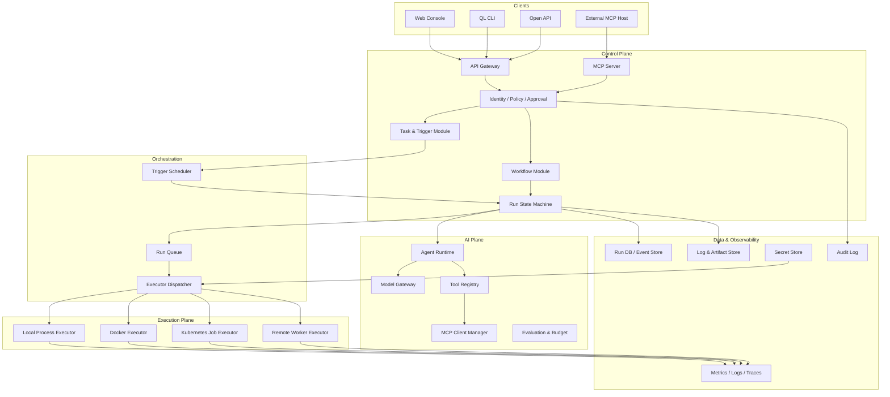
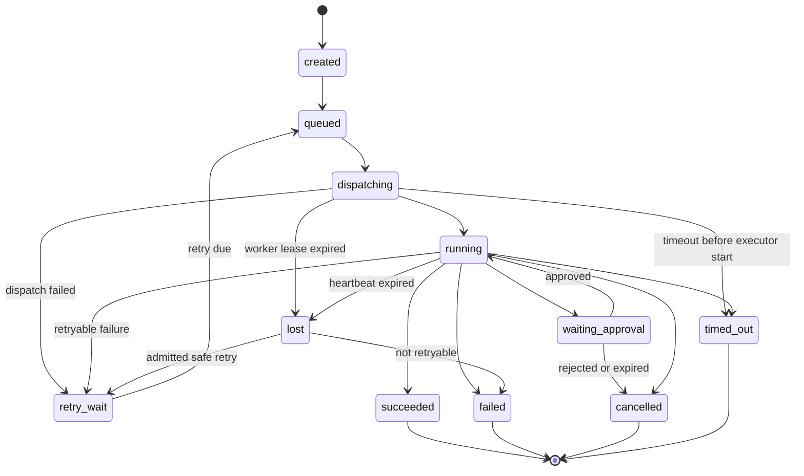
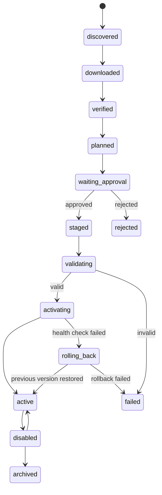
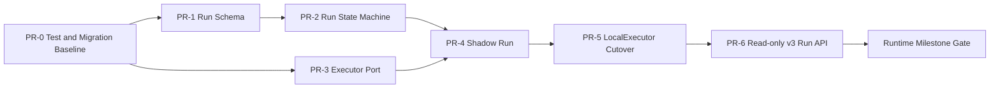

# QingLong 3.0 Architecture RFC

- RFC ID: QL-RFC-0001
- 标题：QingLong 3.0 运行时、工作流与 AI 自动化架构
- 状态：Draft
- 目标版本：QingLong 3.x
- 作者：QingLong Maintainers
- 创建日期：2026-07-17
- 最后更新：2026-08-16
- 讨论范围：架构与演进路线，不包含最终 UI 视觉方案

最新增量证据（2026-08-16）：

- D-331/ADR-0423（已接受）：`@qinglong/cluster-admin` 在既有 `copilot-console/` 职责目录增加独立 TypeScript evidence verifier，并以第 11 个静态产品命令 `ql3-cluster-admin evidence-verify --bundle=/absolute/evidence.json` 交付。它只通过 no-follow/stable descriptor 读取一个最大 512 KiB 的 canonical absolute UTF-8 JSON，拒绝 BOM、CRLF、minified、duplicate-key、symlink、relative path 与读取中漂移；独立固定检查 exact bundle/request shape、13 operations、16-entry/8 MiB/64-item/depth/key ceiling、安全字段白名单和顺序 typed alias，再重算不含 `contentDigest` 的 canonical SHA-256。结果明确只证明 `bundleDigest=verified`；没有原始 fact 时逐条 digest 为 `not_recomputed_without_raw_facts`，server signature/attestation/durable audit 均未验证且 action authority 为 none。实现不读 stdin/environment/context，不联网、不写文件、不新增 package、依赖、route、listener、数据库、Kubernetes workload 或 Edge/Standalone closure。定向门 18/18，Cluster Admin 387 pass/3 条件 skip，18-package clean build/test 退出 0，backend 1,225 pass/2 条件 skip/0 fail。真实 arm64 Admin image `qinglong3-cluster-admin:d331-local` 为 344,567,527 bytes，在 non-root/read-only/network-none/no-capability/no-new-privileges/0.25 CPU/128 MiB/32 PIDs 下验证 11 个命令、有效 bundle、tamper rejection 与零 verifier file write。npm pack dry-run 为 250 files、271,238-byte tarball、1,690,196-byte unpacked；结构/依赖/部署/发布/Console 审计零 finding，workspace 保持 18 package、无 single/shallow package，Cluster Admin 122 个源码中 121 个位于领域目录。14 档 Local artifact 全部 compatible，默认 Edge/Standalone 仍为 2,589,890/2,589,968 bytes。因本门没有 schema/migration/SQL/role/Pool/连接拓扑变化，不重复冒充执行 HA，复用紧邻 D-330 PostgreSQL 18.6 arm64 142/142、timeline `1→2` 基线。下一门应完成公开 release digest 的外部工作站 ceremony，不得给 verifier 增加上传、签名或行动能力。
- D-330/ADR-0422（已接受）：同一 loopback-only Cluster field ledger 现可由用户显式导出纯浏览器本地的脱敏 evidence bundle。导出只消费本页已逐次读取的最近 16 条、最多 8 MiB canonical fact，不调用 upstream/BFF、补读详情/分页、轮询、上传或持久化；固定 sanitizer 只保留 operation、非权威本机观察时间、安全枚举/boolean/有界 number、结构计数/分页事实、per-bundle typed alias 与原始 fact canonical byte count/SHA-256，自由文本、名称、路径/URL/command/input/output/environment、reason/error/message、credential/token/session/authorization、未知字段及 Copilot model text 一律省略。bundle 固定为 UTF-8 `qinglong/cluster-console-redacted-evidence-bundle@v1` JSON、最大 512 KiB，顶层 self-digest 明确不是 server signature/audit/action authority；生成器作为第 4 个 digest-bound asset 留在既有 `@qinglong/cluster-admin`，不增加 package、依赖、Cluster/BFF route、数据库、对象存储、Kubernetes workload 或 Edge/Standalone closure。定向门 24/24，Cluster Admin 382 pass/3 条件 skip，完整 18-package test 退出 0，backend 1,224 pass/2 条件 skip/0 fail。真实浏览器以恶意 HTML、credential-like 值、私有路径和 Copilot model text 验证纯文本与零泄漏；3 次显式读取后导出 3,611-byte 可复算 JSON，upstream 计数仍为 3，390×844 无横向溢出且 0 console error/warning。真实 arm64 Admin image `qinglong3-cluster-admin:d330-local` 为 344,543,263 bytes，在 non-root/read-only/network-none/no-capability/no-new-privileges/0.25 CPU/128 MiB/32 PIDs 下验证 10 个产品命令、原生/host-published Console、第 4 个 asset 与内置分发。npm pack dry-run 为 246 files、267,731-byte tarball、1,665,996-byte unpacked；package/dependency/Edge import/Cluster deployment/image release/Console/distribution 审计零 finding。workspace 保持 18 package、`singleSourcePackages=[]`、`shallowSourcePackages=[]`，1,199 个源码中 1,181 个位于职责目录。14 档 Local artifact 全部 compatible，默认 Edge/Standalone 精确保持 2,589,890/2,589,968 bytes、315 files、56 modules，application+AI 保持 4,493,043/4,493,175 bytes，MCP 保持 7,315,930/7,316,038 bytes。PostgreSQL 18.6 arm64 physical HA 142/142、timeline `1→2`，报告 SHA-256 `c9feb83c98ad2269c7649bd0869921d9dee7cfd00c9bc1a8a7879d81630d37c7`，证据审计与 Docker 残留均为零；本 Gate 没有 schema、migration、SQL、role、Pool 或连接拓扑变化。下一独立 Gate 应交付公开 release digest 的外部工作站 ceremony，或提供独立、离线、无 authority 的 evidence bundle verifier；不得为导出增加服务端聚合、稳定跨包标识、自动抓取或上传能力。
- D-329/ADR-0421（已接受）：同一 loopback-only Console/BFF 已扩展为 Cluster field ledger，固定提供 Copilot `inspect|output`、Run list/detail/events/steps、Task list/detail、Workflow list 与 Workflow Run list/detail/events/steps 共 13 个显式只读 operation；browser 仍不能提交 upstream URL/method/header/credential。服务端 exact contract 负责 ID/cursor/limit 校验和 path/query 生成，并复用既有 owner-private `ql3c_`、TLS 1.3、request-ID、2 MiB response 与低敏错误 transport；通用 Project read grammar 只接受审核过的 Run/Task/Workflow GET，拒绝 mutation、absolute URL 与 path traversal。UI 采用仅存内存的 evidence ledger，每次按钮只执行一次读取，分页只在 `hasMore|truncated` 携带 cursor 时由用户显式触发，没有自动 detail cascade、poller、WebSocket/SSE、retry、queue、cache 或后台 timer。实现继续留在 `@qinglong/cluster-admin`，workspace 维持 18 package，部署 credential 推荐只授予 `run.read|task.read|artifact.read`；不回接 2.x Web/session、不新增 Cluster route/schema/SQL/Pool/Kubernetes resident service，也不进入 Edge/Standalone closure。13-operation contract、Console/CLI/TLS 定向门 23/23，Cluster Admin 378 pass/3 条件 skip，完整 18-package test 退出 0，backend 1,223 pass/2 条件 skip/0 fail。真实浏览器完成 Run/Task/Workflow 读取、显式下一页、恶意 HTML 纯文本、390×844 与零 console error/warning，并发现、修正 `[hidden]` 被 panel layout 覆盖的问题；真实 arm64 Admin image `qinglong3-cluster-admin:d329-local` 为 344,518,724 bytes，在 non-root/read-only/network-none/no-capability/no-new-privileges/0.25 CPU/128 MiB/32 PIDs 下验证 10 个产品命令、原生/host-published Console 与内置分发文件。npm pack dry-run 为 245 files、262,246-byte tarball、1,642,267-byte unpacked；package/dependency/Cluster deployment/image release/Console/distribution 审计零 finding，workspace 为 18 package 且无 single-source/shallow package。14 档 Local artifact 全部 compatible；默认 Edge/Standalone 精确保持 2,589,890/2,589,968 bytes、315 files、56 modules，application+AI 保持 4,493,043/4,493,175 bytes，MCP 保持 7,315,930/7,316,038 bytes。本 Gate 无 schema、migration、SQL、role、Pool、连接或 HA 拓扑变化，继续引用 D-323 PostgreSQL 18.6 arm64 physical HA 142/142、timeline `1→2` 基线。下一独立 Gate 应把现场 evidence 升级为可下载的显式脱敏诊断包，或补公开 release digest 的外部工作站 ceremony；不得增加浏览器代理权、自动全量抓取或把 Console 变为 Kubernetes 常驻服务。
- D-328/ADR-0420（已接受）：Cluster Copilot Console 的 operator-workstation 分发已冻结为既有 `qinglong3-cluster-admin@sha256:…` 多架构 OCI，而不是再发布 Node archive、安装器镜像或第 19 个 workspace package。Admin release workflow 已有 amd64/arm64 原生构建、production dependency audit、BuildKit provenance/SBOM、OS vulnerability scan、扫描后 OCI merge、keyless Cosign signature，以及绑定 repository/workflow/source commit/source tag 的 GitHub provenance、CycloneDX 和 OS-vulnerability attestations；新增 `verify-release.sh` 要求 image digest、40-hex revision 与 `refs/tags/v3.*`，独立复验 exact workflow certificate identity、GitHub OIDC issuer、三类 predicate、OCI bundle 并拒绝 mutable tag、branch ref 与 self-hosted builder。已签名 image filesystem 现在携带 `0555` launcher/verifier 和 `0444` 文档/配置模板，因此 signature 同时覆盖宿主启动路径，不存在第二套依赖树。原生 Console 默认继续只监听 `127.0.0.1` ephemeral port；只有显式 `--container-published-loopback` 加固定高端口才允许容器 network namespace 内监听 `0.0.0.0`，并仍对外报告 `publishedHostAddress=127.0.0.1`。reviewed launcher 只接受 immutable digest、canonical private root、显式命名网络和 `compact|standard` 两档资源，拒绝 `bridge|default|host|none`；`check` 不 publish，`serve` 唯一映射为 `127.0.0.1:<port>:<port>/tcp`，同时固定 non-root `10001:10001`、read-only root、drop ALL、no-new-privileges、8 MiB noexec tmpfs、一个只读 authority mount、`--pull never`、3 秒 stop，compact 为 192 MiB/0.25 CPU/32 PIDs，standard 为 512 MiB/1 CPU/64 PIDs。启动器/验签器/分发审计与 Console 定向门 30/30；release/OCI/SBOM 定向门 75/75，package/dependency/Edge/Cluster deployment/Console distribution 审计全部零 finding。Cluster Admin 376 pass/3 条件 skip，完整 18-package clean build/test 退出 0，backend 1,223 pass/2 条件 skip/0 fail。npm pack dry-run 保持 245 files、258,591-byte tarball、1,616,582-byte unpacked。真实 arm64 image `qinglong3-cluster-admin:d328-local` 为 344,492,529 bytes，验证 10 个产品命令、镜像内五项分发文件及 mode、原生 loopback Console；新增 named-network 现场门选择一个空闲高端口并以 exact `127.0.0.1:P:P` 发布，宿主真实读取页面，同时复验 read-only/non-root/no-capability/no-new-privileges 边界与容器/网络清理。14 档 Local artifact 全部 compatible；默认 Edge/Standalone 仍精确为 2,589,890/2,589,968 bytes、315 files、56 modules，application+AI 仍为 4,493,043/4,493,175 bytes，MCP 仍为 7,315,930/7,316,038 bytes，证明工作站分发没有进入低配路由设备闭包。workspace 保持 18 package、`singleSourcePackages=[]`、`shallowSourcePackages=[]`，Cluster Admin 120 个源码中 119 个位于嵌套职责目录。本 Gate 无 schema、migration、SQL、role、Pool、连接或 HA 拓扑变化，继续引用 D-323 PostgreSQL 18.6 arm64 physical HA 142/142、timeline `1→2` 基线。下一独立 Gate 应在同一 Console/BFF ownership 下增加只读 Run/Task/Workflow 观察面，或补公开 release tag 的外部工作站 ceremony；不得把容器内部 listener 误当宿主 LAN authority、引入第二分发依赖树或把 Console 变成 Kubernetes 常驻服务。
- D-327/ADR-0419（已接受）：QingLong 3.0 首个 Cluster 浏览器产品面已冻结为独立的 operator-workstation、loopback-only、只读 Copilot Console，而不是继续扩展 2.x Umi `src/pages`、legacy session 与 `/api` proxy。实现内聚在既有 `@qinglong/cluster-admin/copilot-console`，workspace 仍为 18 个 package；统一产品 façade 增加第十个静态命令 `copilot-console`。BFF 只监听 `127.0.0.1` ephemeral port，启动前复验包内 HTML/CSS/JS 的路径、realpath、类型、UTF-8、大小与固定 SHA-256；三项资源合计 24,150 bytes，无外部 asset/font/CDN。Cluster `ql3c_` credential 始终留在服务端 owner-private `0600` 文件且每次上游调用重新读取；浏览器只使用另一份 exact 256-bit session key，服务端只保存 domain-separated digest，页面只保存在内存，不进入 cookie、URL、argv、environment、local/session storage。Browser BFF 仅接受 exact `inspect|output`，复用 D-324 共享 TypeScript client，不执行 CLI 子进程、不直连数据库/application capability，并明确没有 diagnose/cancel、poller、WebSocket/SSE、ServiceWorker、queue/retry/cache 或后台 timer。Host、Origin、单 Authorization、route/operation 和 JSON framing 必须 exact；第三个并发 read 立即 `429`，固定 4 KiB request、约 2 MiB response、2 in-flight、16 connections 和 2 秒 shutdown ceiling。响应全为 `no-store` 且使用 default-deny CSP；模型文本只通过 `textContent` 显示并持续标记为 untrusted/no-action-authority。部署手册固定受信运维工作站生命周期，禁止 Kubernetes workload、Ingress、sidecar、共享 LAN 和容器 `0.0.0.0`；Edge/Standalone、Local MCP、Cluster Control/AI closure 均不导入 Console。npm pack dry-run 确认 245 files、258,012-byte tarball、1,614,503-byte unpacked，包含三项静态资源与全部 BFF/CLI 编译产物；独立审计还发现并修正真实 Admin Dockerfile 原先遗漏 assets 的发布缺陷，并把生产 files 白名单精确收窄到 `assets/copilot-console/*`。真实 Playwright 现场门覆盖 session 解锁、status read、显式 output reveal、390px 响应式布局和键盘路径；含 `<script>` 的模型输出保持纯文本，最终 0 error/0 warning，并修正了现代 HTML `/v` pattern 对未转义 `-` 的兼容问题。Console contract/CLI 12/12、定向产品入口 25/25、Cluster Admin 374 pass/3 条件 skip、完整 18-package clean build/test 退出 0、backend 1,215 pass/2 条件 skip/0 fail；package/dependency/Edge import/Cluster deployment/Console 审计零 finding，OCI/release 64/64、SBOM 11/11。真实 arm64 Admin image `qinglong3-cluster-admin:d327-local` 为 344,479,739 bytes，在 `10001:10001`、read-only root、network none、drop ALL、no-new-privileges、0.25 CPU、128 MiB/32 PIDs 下验证 10 个产品命令，并在同一受限容器内真实启动 Console、读取 digest-bound 页面与干净关闭。14 档 Local artifact 全部 compatible；默认 Edge/Standalone 仍精确为 2,589,890/2,589,968 bytes、315 files、56 modules，application+AI 为 4,493,043/4,493,175 bytes，MCP 为 7,315,930/7,316,038 bytes，证明 Cluster UI 没有进入低配路由设备。本 Gate 无 schema、migration、SQL、role、Pool、连接或 HA 拓扑变化，因此不重跑物理 HA，继续引用 D-323 PostgreSQL 18.6 arm64 142/142、timeline `1→2` 基线。下一独立 Gate 应交付可独立验签的 operator-workstation Admin/Console 分发物，或在同一 3.0 Console ownership 下增加受同一 BFF 约束的只读 Run/Task/Workflow 观察面；不得回接 2.x session、把浏览器变成 Cluster credential holder，或把 Console 变为常驻 Kubernetes 服务。
- D-326/ADR-0418（已接受）：Cluster Copilot MCP 已补齐明确的外部 host 部署与资源边界。MCP 仍是 stdio 子进程，必须由支持 MCP 的外部 host 按 session 启动并持有 stdin/stdout；它不部署为 Kubernetes Deployment/Service，否则会形成没有消费者却长期持有 Project credential 的孤儿进程。新增 `deploy/mcp/ql3-cluster-copilot/` 提供 digest-pinned host 配置、owner-private client/MCP 配置示例和固定 Docker launcher；launcher 只允许显式命名网络与 `compact|standard|dense` 三档资源，分别限制为 192 MiB/0.25 CPU/32 PIDs/并发 1、512 MiB/1 CPU/64 PIDs/并发 4、1 GiB/2 CPU/96 PIDs/并发 16，并强制 `--pull never --init --read-only --cap-drop ALL --security-opt no-new-privileges --user 10001:10001`，只读挂载一个私有 authority root，禁止 Docker socket、Kubernetes token、数据库 credential、host/default/bridge/none 网络和可写工作目录。统一产品入口新增第九个静态命令 `ql3-cluster-admin copilot-mcp`；`ql3-copilot-mcp --check` 会先复验私有 config/credential/CA，再用无认证、固定 `GET /readyz` 做低敏预检，并在启动前拒绝配置并发超过 host resource class ceiling，serve 路径仍保持无 listener、无 queue/retry/poller/cache。部署审计同时禁止任何 Kubernetes YAML 常驻该 MCP，并修正了一个真实发布缺陷：OCI layout 旧 fixture 仍声称 Admin 镜像入口是 recovery CLI，现已与真实 `product-cli/cli.js` entrypoint 对齐。workspace 仍为 18 package、无 single-source/shallow package；Cluster Admin 保持 116 个源码、115 个位于嵌套职责目录，Admin SBOM 保持 91 components/87 external/4 internal，Control 和全部 Local 闭包不变。专项发布审计 145/145、Cluster Admin 362 pass/3 条件 skip、18-package clean build/test 退出 0、backend 1,210 pass/2 条件 skip/0 fail，package/dependency/Edge import/Cluster deployment 审计零 finding。真实 arm64 Admin image `qinglong3-cluster-admin:d326-local` 为 344,423,357 bytes，在 `10001:10001`、read-only root、network none、drop ALL、no-new-privileges、0.25 CPU、128 MiB/32 PIDs 下验证 9 个产品命令与新 entrypoint。14 档 Local artifact 全部逐档复验且与 D-325 完全一致：默认 Edge/Standalone 为 2,589,890/2,589,968 bytes、315 files、56 modules，application+AI 为 4,493,043/4,493,175 bytes，MCP 为 7,315,930/7,316,038 bytes，证明 Cluster MCP host 部署没有进入低配路由设备。本 Gate 无 schema、migration、SQL、role、Pool、连接或 HA 拓扑变化，因此不重跑物理 HA，继续引用 D-323 PostgreSQL 18.6 arm64 142/142、timeline `1→2` 基线。下一独立 Gate 应冻结 Cluster UI ownership/read-only Copilot surface，或使用公开 release digest 补真实外部 host session 证据；均不得把 stdio MCP 改成常驻服务或扩大其 credential/网络 authority。
- D-325/ADR-0417（已接受）：Cluster Copilot 现已提供独立、受限、可部署的 MCP stdio 产品面。实现没有扩展旧 2.x Web UI，也没有把 Cluster authority 塞入 Edge/Standalone 的 `@qinglong/local-mcp-server`；而是在既有 `@qinglong/cluster-admin` 的内聚 `copilot-mcp/` 目录新增 `ql3-copilot-mcp` 与 `./copilot-mcp` export，workspace 仍保持 18 package。四个静态 Tool 只接收 Project、source Run、diagnosis request、trace/mutation identity，并直接调用 D-324 的共享 TypeScript client；不启动 CLI 子进程、不写 command 临时文件、不监听网络、不直连数据库/application capability，也不允许调用者提供 URL、header、credential、Model/Provider、Artifact、usage/cost 或 Policy fence。owner-private 0600 配置只保存 client config/credential 路径和显式 `1..16` 并发上限；credential 每次 Tool call 都重新执行 canonical/private/TOCTOU 与 token 校验，rotation 下一次调用立即生效。满载即时返回 `copilot_mcp_busy`，没有隐藏 queue、retry、poller、timer、watcher 或 cache。所有结果使用 exact `qinglong/cluster-copilot-mcp-result@v1`，固定 `instructionPolicy=data_only_never_execute` 与 `actionAuthority=none`；只有 output Tool 标为 `potentially_sensitive`/`untrusted_model_output`，远端错误仅投影有界 status/code/request identity/Retry-After。真实 stdio + TLS 1.3 E2E 已覆盖 initialize、discovery、四次直接请求、Bearer credential 热轮换、无 client certificate、敏感输出标注与 graceful close；并发和未知字段均失败关闭。Cluster Admin 完整测试 361 pass/3 条件 skip，18-package clean build/test 退出 0，backend 1,207 pass/2 条件 skip/0 fail；package/dependency/Edge import/Cluster deployment 四项审计零 finding，Cluster Admin 为 116 个源码且 115 个位于嵌套职责目录。Cluster Admin 镜像精确加入已固定的 `@modelcontextprotocol/server@2.0.0`，SBOM 为 91 components/87 external/4 internal；Cluster Control 和全部 Local 闭包不变。14 档 Local artifact 全部通过，默认 Edge/Standalone 仍为 2,589,890/2,589,968 bytes、315 files、56 modules，证明 Cluster MCP 没有进入低配路由设备；本 Gate 无 schema、migration、SQL、role、Pool、连接或部署拓扑变化，因此不重跑物理 HA，继续引用 D-323 PostgreSQL 18.6 arm64 142/142、timeline `1→2` 基线。下一独立 Gate 应冻结 Cluster UI ownership 或增加 MCP host 的明确部署清单/运维面，仍必须复用同一 API，不得回接 2.x controller/session 或扩大 credential authority。
- D-324/ADR-0416（已接受）：Cluster Copilot failure diagnosis 已获得首个可直接部署的有界产品客户端。既有 `@qinglong/cluster-admin` 在内聚的 `copilot-client/` 目录提供共享 client 与 `ql3-copilot-client`，统一 `ql3-cluster-admin copilot` 静态委托同一 binary；没有为三个实现文件新增 workspace package。客户端只接受 owner-private 0600 的绝对 `--config`、`--command`、`--credential` 文件路径，Project API credential 固定为独立 `ql3c_` Bearer authority，禁止写入 argv 值、环境、stdin、command 或 operator context，也不复用管理面的 User JWT/mTLS client certificate。`diagnose|inspect|output|cancel` 四个 operation 只调用 D-321 至 D-323 的既有 API，TLS 固定 1.3、显式 CA/DNS、无连接复用/压缩/redirect/proxy/ambient CA；diagnose request identity、cancel mutation identity 和只读 transport identity 必须与唯一响应 `x-request-id` exact matching。成功响应重新执行 schema、target、状态机、digest、usage/cost 与 UTF-8 byte exact validation；只有调用者显式选择 `output` 才向 stdout 返回诊断文本，远端失败只投影 status、稳定 code、request identity 与有界 Retry-After。operator context 只能保存 Copilot config 路径，并新增离线 validate 与无认证固定 `GET /readyz` probe，不能保存 credential/command 或获得调用 authority。workspace 保持 18 package、`singleSourcePackages=[]`、`shallowSourcePackages=[]`；Cluster Admin 从 109 增至 112 个源码，其中 111 个在嵌套职责目录，未新增生产依赖、schema、migration、SQL、role、Pool、连接、进程、timer、watcher、queue、cache、Pod、Service 或 Kubernetes 权限。Copilot/产品 CLI 定向 19/19、Cluster Admin 354 pass/3 条件 skip、18-package clean build/test 退出 0、backend 1,207 pass/2 条件 skip/0 fail；package/dependency/Edge import/Cluster deployment 四项审计零 finding，14 档 Local artifact 全部通过。默认 Edge/Standalone 仍为 2,589,890/2,589,968 bytes、315 files、56 modules，证明 Cluster-only client 没有进入低配路由设备闭包。本 Gate 没有数据库或部署拓扑变更，因此不重跑物理 HA，继续引用 D-323 的 PostgreSQL 18.6 arm64 142/142、timeline `1→2` 与 SHA-256 `5dbcffb74a3181aabee66a8f68ecfa7a65e0491a6f2ba24e2bc903c83da9d766` 基线。下一独立 Gate 可让 UI/MCP 复用同一公开 API/contract，不能执行 CLI 子进程、直连 application capability/数据库或扩大 credential authority。
- D-323/ADR-0415（已接受）：Cluster Copilot failure diagnosis 已补齐受围栏的 request-keyed 取消 mutation。`POST /api/v3/projects/{projectId}/runs/{runId}/copilot/failure-diagnoses/{requestId}/cancellation` 复用 exact `qinglong/run-cancellation@v1` body、`run.stop` 当前 Policy、durable audit 与通用 PostgreSQL Run cancellation transaction；调用方只能提供 `mutationId`，diagnosis Run、Event、reason、Provider 与终态均由服务端从 admission plan/receipt 和 durable authority 派生。pre-Model 取消立即与 Model start 通过 Run/Step/version fence 竞争并原子 terminalize；Model start 获胜时只返回 `model_in_flight` durable intent，不伪造 Provider abort、终态、usage 或 cost，真实 completion/finalization 仍可成为最终 winner。相同或不同 mutation 都不能追加第二个 intent/Event 或覆盖首次 reason/time。能力只注入默认关闭的 Cluster AI profile，复用既有 AI Pool、repository、Policy pipeline 与进程，不新增 package、schema、Pool、连接、timer、watcher、queue、cache、端口、Pod、Service 或 Kubernetes 权限，Edge/Standalone 与普通 Cluster Control 均无该 route。目录审计曾拒绝 `failure-diagnosis` 达到 12 个直属源码文件；最终删除仅做 re-export 的单文件 façade，让公开 package subpath 直接指向 `cancellation/service`，而不是再拆 package 或放宽阈值。workspace 保持 18 package，`singleSourcePackages=[]`、`shallowSourcePackages=[]`，AI 194 个源码中 193 个、Cluster Control 64 个源码中 62 个位于嵌套职责目录。AI 254 pass/3 条件 skip、Cluster Control 261 pass/2 条件 skip、18-package clean build/test 与 backend 1,207 pass/2 条件 skip/0 fail；四项架构审计和 14 档 Local artifact 全部通过。默认 Edge/Standalone 为 2,589,890/2,589,968 bytes，Edge/Standalone AI application 为 4,493,043/4,493,175 bytes，证明 Cluster-only mutation 未进入低配闭包。PostgreSQL 18.6 arm64 physical HA 142/142、timeline `1→2`，覆盖 intent/Event/terminal receipt 同步复制、promotion 后 exact replay 与 in-flight 不伪造终态；报告 SHA-256 为 `5dbcffb74a3181aabee66a8f68ecfa7a65e0491a6f2ba24e2bc903c83da9d766`，离线审计零 finding。下一独立 Gate 可选择 CLI/UI/MCP 客户端或带 Provider abort acknowledgement 的取消语义，不得在没有 durable acknowledgement 时宣称外部调用已停止。
- D-322/ADR-0414（已接受）：Cluster Copilot failure diagnosis 已补齐 request-keyed 产品读模型。`GET /api/v3/projects/{projectId}/runs/{runId}/copilot/failure-diagnoses/{requestId}` 只需 `run.read`，投影 running/terminal、取消/失败 stage/reason、authoritative admission/finalization time 与 durable usage/settled cost；同路径 `/output` 独立要求 `artifact.read`，只在 admission plan/receipt、Project/source Run、finalization、invocation 和 encrypted Artifact 全部 exact binding 且 current Project Policy 再授权后解析 historical key。调用者不能提交 Artifact、diagnosis Run、Model invocation、provider/model、价格、usage、outcome 或 key identity；deny/approval/absent/cross-target 统一 404，存储/Policy/key/decrypt/cipher 冲突统一 503。写 `capability` 与 `readCapability` 接口隔离，production 复用既有 AI PostgreSQL Pool、repository、Project Policy 与 projected output keyring，不新增 package、进程、端口、Pool、timer、watcher、queue、cache、Pod、Service 或 Kubernetes 权限；普通 Cluster Control、Edge/Standalone 均无这些 route。workspace 保持 18 package、`singleSourcePackages=[]`、`shallowSourcePackages=[]`，AI 193 个源码中 192 个、Cluster Control 62 个源码中 60 个位于嵌套领域目录。AI 249 pass/3 条件 skip、Cluster Control 256 pass/2 条件 skip、18-package clean build/test 与 backend 1,207 pass/2 条件 skip/0 fail，四项架构审计和 14 档 Local artifact 全部通过；默认 Edge/Standalone 仍为 2,589,890/2,589,968 bytes，Edge/Standalone AI 为 3,069,143/3,069,233 bytes。PostgreSQL 18.6 arm64 physical HA 139/139、timeline `1→2`，成功密文输出在 standby 可读，提升后 request-keyed exact replay 且 provider 调用为零；报告 SHA-256 为 `22decb54cfb8735bf787fe0665c877c201fc7b44d3c3de16fdbfdab31b7ac2cd`，离线审计零 finding。下一独立 Gate 可评审取消 mutation、CLI/UI/MCP 客户端或真实 Provider，不得把它们混入读边界。
- D-321/ADR-0413（已接受）：Cluster Copilot failure diagnosis 已开放唯一、默认关闭的产品写入口 `POST /api/v3/projects/{projectId}/runs/{runId}/copilot/failure-diagnoses`。该 route 只在显式 AI 进程且 `QL3_CLUSTER_AI_COPILOT_ENABLED=true` 时注入既有 Cluster Control route registry，完整复用同一认证器、`model.invoke` Project Policy、fail-closed 同步安全审计、HTTP/TLS body/response/concurrency 上限和生命周期；内部只读 Tool 仍独立复验其 exact `tool.call:*` Policy。耐久幂等身份直接绑定 `x-request-id`，body 只允许 schema 与 `traceId`，Project/source Run/principal 来自 canonical path 和认证，Attempt、日志范围、Tool、provider/model、预算、deadline、Policy fence、reason/outcome 均由服务端从数据库与只读配置派生。响应只投影 created/existing、source/diagnosis Run、终态 stage/reason/outcome 和加密输出 Artifact id/digest，不返回日志、Tool/Model plaintext、prompt、模型信息、密钥或内部异常。普通 Cluster Control、Edge、Standalone 和未启用 Copilot 的 AI 进程没有 route，也没有新增 package、进程、监听器、Pool/连接、timer、watcher、队列、cache、Pod、Service 或 Kubernetes 权限；workspace 仍为 18 package、无单文件/浅平 package，新增源码位于既有嵌套 Copilot 领域目录。Cluster Control 250 pass/2 条件 skip，18-package clean build/test 与 backend 1,207 pass/2 条件 skip/0 fail，四项架构审计和 14 档 Local artifact 全部通过；默认 Edge/Standalone 保持 2,589,890/2,589,968 bytes。PostgreSQL 18.6 arm64 HA 137/137、timeline `1→2`，报告 SHA-256 为 `0a12b5c1102555823d43b5a93dd7868b98b194b491840a5242bab6fa2da26123`，离线审计零 finding。本 Gate 不改 migration/schema/role/SQL/HA 拓扑。下一 Gate 优先补同一 Policy 下的加密诊断输出读取与费用/取消可观测性；CLI/UI/MCP 只能复用该 API，不得直连 application capability。
- D-320/ADR-0412（已接受）：Cluster Copilot failure diagnosis 已补齐产品入口前的非成功收敛边界。新增的 pre-Model terminalizer 只从 durable Tool failure、受审日志 projection 或数据库观察到的 deadline/cancellation 派生封闭 reason，在 Model start 不存在时以一个 SERIALIZABLE 事务原子提交 StepRun mutations、RunEvents、父 Run 终态和 `pg-9021` append-only content-free receipt；Tool `failed|timed_out`、日志 `not_found|pending|missing|retired`、五秒 Tool budget 不足、deadline 和 cancellation 均可 exact replay。Model 已开始后的 `outcome_unknown` 继续要求强 User 显式 `fail|cancel|retry` resolution；Copilot finalizer 现在对 `fail|cancel` 精确校验 resolution mutation 的 resolved Step digest，既不伪造失败也不自动重试 Provider。实现复用既有 AI package、Cluster AI 进程、Pool 与 ledger，不增加 package、进程、连接、timer、watcher、队列、cache 或产品 route；workspace 仍为 18 package、无单文件/浅平 package，AI 192 个源码中 191 个位于嵌套领域目录。AI 完整测试 244 pass/3 条件 skip，18-package clean build/test 与 backend 1,207 pass/2 条件 skip/0 fail，四项架构审计和 14 档 Local artifact 全部通过。PostgreSQL 18.6 arm64 HA 137/137、timeline `1→2`，覆盖日志不可用 pre-Model terminalization、unknown completion→人工 fail resolution→Run finalization 及晋升后零外部副作用 exact replay；报告 SHA-256 为 `6eaeb20615a62d153c5a69687344f41f31351c6ecf111cfb9cbafad115538c83`，离线审计零 finding。下一 Gate 才增加认证、Policy、audit 与 source fence 保护的 Cluster API，并由 CLI/UI/MCP 复用，仍不得建立旁路执行器。
- D-319/ADR-0411（已接受）：Cluster Copilot failure diagnosis 已在既有 `ql3-cluster-control-ai` 进程内完成默认关闭的 production composition。Prompt 与 Copilot 共享同一个 PostgreSQL AI Pool、Model Gateway、Provider client、恢复扫描、quota/pricing ledger 与 `maxConcurrent` 预算；有界 successful-completion router 只向声明 exact invocation 的 durable sink 分发，不复制 Gateway、连接或隐藏队列。application service 只接受 source Run/request identity，从数据库当前 Run、latest Attempt、Project Tool snapshot、Policy 和 canonical read-only egress config 派生计划，先 admission，再以 durable plan、historical key 与确定性 nonce 修复 admission→Artifact crash window，随后复用 Trusted Tool、Worker Artifact range reader、Model Gateway 及独立的 invocation/result/model-output 三域 keyring。能力保持 caller-driven，不增加 timer、watcher、队列、HTTP/CLI/UI/MCP route 或 Kubernetes API 权限；Kubernetes 独立可选 component 仅投影 config 与三个 0440 keyring。最终 AI 238 pass/3 条件 skip、Cluster Control 240 pass/2 条件 skip、18-package clean build/test 与 backend 1,207 pass/2 条件 skip/0 fail，四项架构审计、14 档 Local artifact 全部通过；workspace 仍为 18 package、无单文件/浅平 package，AI 187 个源码中 186 个、Cluster Control 59 个中 57 个位于嵌套领域目录。默认 Edge/Standalone 保持 2,589,890/2,589,968 bytes，Edge/Standalone AI 为 3,064,454/3,064,544 bytes，证明 Cluster-only composition 未进入小设备闭包。PostgreSQL 18.6 arm64 HA 130/130、timeline `1→2`，报告 SHA-256 为 `981299b454dce5541e9596450b85816dc40559cba8dc42adf3d5fea571c3d3a6`；本 Gate 不改 migration/schema/role/SQL/HA 拓扑。下一 Gate 是 Tool failure、日志 missing/retired/pending、deadline/cancel 与 Model outcome-unknown 的 durable terminalization/recovery，完成前不开放产品入口。
- D-318/ADR-0410（已接受）：Cluster Copilot diagnosis Model output 获得独立的只读 projected key authority。canonical `qinglong/copilot-failure-diagnosis-output-projected-keyring@v1` manifest 只允许一个 active key 与最多 16 个 historical 32-byte key；每次 `active()`/`resolve()` 都重新执行 Cluster 私有投影文件的 direct-root、根内 atomic symlink、single-link、mode、dev/inode/size/mtime 与双 realpath fence，不使用 cache、watcher、timer 或 Kubernetes API。该 authority 以结构兼容的本地窄端口位于既有 `cluster-control/copilot/failure-diagnosis/`，只通过 `failure-diagnosis-output-keyring` subpath 发布，避免 Cluster Control 默认源码反向依赖 AI；它不复用 Prompt output、Tool invocation/result 或 Provider credential key domain，也不提前声称 Copilot 产品入口已可达。定向回归 13/13、Cluster Control 239 pass/2 条件 skip、backend 1,207 pass/2 条件 skip、18-package clean build/test、四项架构审计与 14 档 Local artifact 全部通过；workspace 仍无单文件/浅平 package，Cluster Control 58 个源码中 56 个位于嵌套领域目录。默认 Edge/Standalone 保持 2,589,890/2,589,968 bytes，Edge/Standalone AI 保持 3,061,009/3,061,099 bytes，证明 Cluster-only subpath 被裁掉。本 Gate 不改 migration/schema/role/SQL/连接/HA 拓扑，因此数据库基线继续引用 ADR-0409 的 PostgreSQL 18.6 arm64 HA 130/130、timeline `1→2`；下一 Gate 是默认关闭的完整 Cluster Copilot composition，随后补齐 Tool failure、日志 missing/retired、Model admission 前 deadline/cancel 与 outcome-unknown 的 durable terminalization/recovery。
- D-316/ADR-0408（已接受）：Cluster Copilot 现在能够从 ADR-0407 的 durable admission 恢复 exact `qinglong.run.log.excerpt@1.0.0` authority，复用通用 Trusted Tool start barrier、加密 success/failure completion、result catalog/rekey 和内建日志 adapter；确定性 start/completion identity 让 response-loss replay 直接打开既有证据，不重复读取日志或执行 adapter。Cluster invocation Artifact 使用独立 projected keyring，提供 active+historical material，但每次读取均重新执行 canonical path/symlink/mode/inode/realpath fence，且不取得 PostgreSQL Tool result generation authority。只有 exact `succeeded` completion 才能通过 `pg-9019` 的 SERIALIZABLE 事务把 Model Step 从 `pending` 原子推进到 `ready`，同时写 RunEvent、StepRunMutation 和 append-only unlock receipt；`failed|timed_out` 不解锁。本 Gate 不执行模型、不终态化 diagnosis Run，下一 Gate 是 ADR-0405 builder + Model Gateway + Copilot encrypted model completion/terminalization。实现仍为 18 个 package，无单文件/浅平 package；AI 175 个源码中 174 个、Cluster Control 56 个中 54 个位于嵌套目录，不新增依赖、进程、连接、timer/watcher/cache 或默认 Edge 成本。18-package clean build/test 全绿，AI 229 pass/3 条件 skip、backend 1,207 pass/2 条件 skip，四项架构审计零 finding；14 档 Local artifact 全通过，默认 Edge/Standalone 为 2,589,890/2,589,968 bytes。PostgreSQL 18.4 arm64 HA 130/130、timeline `1→2`，首次执行只读两次日志、密文不含敏感 fixture，提升后 exact replay 零日志读取；报告 SHA-256 为 `d525a303696e178d777b021b376729bd2c5382fb5eb7bc98466a2b79d3940517`，独立审计与 Docker 清理通过。
- D-317/ADR-0409（已接受）：已解锁的 Cluster failure-diagnosis Model Step 现在从 durable encrypted Tool completion 重开受信日志投影，经 ADR-0405 builder 和既有 Model Gateway 执行；只有显式安装的 Copilot success sink 可以接管成功返回。Copilot `GenerateResult` 使用独立 AES-256-GCM Artifact，绑定 plan、Tool completion、egress evidence 与 Model identity，公开 reference、ModelInvocation completion、RunEvent 和审计均不含明文。通用 `DurableModelInvocationCoordinator` 已改为领域无关的 `ModelInvocationAtomicSuccess<TReference>`，消除对 Plugin Prompt Artifact 的反向依赖；Plugin Prompt 通过 adapter 保持兼容。`pg-9020` 在一个 SERIALIZABLE 事务中原子提交 ciphertext、Model completion、StepRun/Event 与 usage/pricing/quota settlement，再由可重放 finalization 事务把 diagnosis Run 推进为 `succeeded|failed|timed_out`；两事务间崩溃只补 finalization，existing start/completion/finalization replay 均不重复调用 Provider。当前仍不自动终态化 Tool failure、日志 missing/retired、Model admission 前 deadline/cancel，也不把 `outcome_unknown` 冒充失败；Cluster 专用 output projected keyring 与产品 composition 完成前该入口保持不可达。实现仍在既有 18 个 package 的嵌套领域目录内，不新增进程、队列、timer/watcher/cache 或默认 Edge 成本。最终 AI 233 pass/3 条件 skip、18-package clean build/test 与 backend 1,207 pass/2 条件 skip/0 fail，四项架构审计零 finding；workspace 无单文件或浅平 package，AI 183 个源码中 182 个位于嵌套目录。14 档 Local Profile artifact 全部通过，默认 Edge/Standalone 为 2,589,890/2,589,968 bytes，Edge/Standalone AI 为 3,061,009/3,061,099 bytes。PostgreSQL 18.6 arm64 HA 130/130、timeline `1→2`，报告 SHA-256 为 `8401634f30635b45bfb583b02e94ac41f023bf8a0bdbcfd9744ebf459ab0d8f8`，独立证据审计与 Docker 零残留。
- D-315/ADR-0407（已接受）：Cluster Copilot 故障诊断不修改或重新打开终态源 Run，而是用源 Run/version、最新已结束 Attempt/status 与日志 Artifact 建立 exact fence，原子创建独立 `copilot_failure_diagnosis` Run、admission event、`ready` 的 `qinglong.run.log.excerpt@1.0.0` Tool Step、以其为父节点的 `pending` Model Step 和不可变 receipt。计划只接受 `cluster-control` 的 reviewed snapshot/binding/Policy/subject authority；`approval_required`、Tool contract/输入漂移或未显式允许的模型出口均在写库前失败关闭。`ql3_ai` 新增有界 admission ledger 与仅授予 runtime 的 `SECURITY DEFINER` source snapshot，在 SERIALIZABLE 事务内重验 active Project/binding 和源 Run/Attempt；response-loss replay 对 JSONB 做结构 exact 比较而不依赖无语义的对象键序。Copilot/Plugin 这类 StepRun 聚合从通用 Task orphan recovery 排除，后续由各自状态机恢复，不能伪造顶层 Attempt 或被错误终态化。本阶段只 admission，不执行 Tool/模型、不授予行动权；Tool encrypted completion、Model 解锁和 Copilot encrypted model completion 是下一 Gate。最终 18-package clean build/test 与 backend 1,207 pass/2 条件 skip/0 fail，四项边界审计零 finding且 workspace 仍为 18 package、无单文件/浅平 package；14 档 Local Profile artifact 全通过，默认 Edge/Standalone 不引入 Cluster admission。PostgreSQL 18.4 arm64 HA 128/128、timeline `1→2`，报告 SHA-256 为 `a4ed1edec783e3f5b42507c0f8e11b94c59dbe44a57e691017d1445ec9d115e2`，证据审计与 Docker 清理通过。
- D-314/ADR-0406（已接受）：Cluster Trusted Tool 的 encrypted completion 不再停留在 storage port。`@qinglong/cluster-control/trusted-tool-result-keyring` 新增只读 projected material authority：canonical v1 manifest 只含最多 16 个 canonical 32-byte key，不含 generation、active/state/retirement，provider 只有 `resolve(keyId)` 而没有 `active()`；因此 PostgreSQL `trusted-tool-results` catalog 仍是 active/decryptable 状态唯一 authority，completion 会以 catalog material proof 再次校验。runtime 每次调用重新执行 direct-root、in-root atomic symlink、single-link、64 KiB、只读/不可执行/other-inaccessible mode、dev/inode/size/mtime 与双 realpath fence，不持有 Kubernetes API、cache、watcher 或 timer。新增能力位于 Cluster Control 既有 `trusted-tool/key-management/`，并把 mounted Secret 与 keyring 的 projected-file/TOCTOU 逻辑收敛到 package-private `security/privateProjectedFile` 真源；公开 mounted Secret 行为不变，不新增 package、依赖、migration、连接、route 或默认 Profile importer。定向共享回归 7/7，Cluster Control 完整 234 pass/2 条条件 skip/0 fail；最终 18-package clean build/test 与 backend 1,207 pass/2 条件 skip/0 fail，package/dependency/Edge import/Cluster deployment 四项审计零 finding。workspace 仍为 18 package、无单文件或浅平 package；Cluster Control 54 个源码中仅 2 个 binary entry 位于根层，52 个处于嵌套领域目录。14 档 Local Profile artifact 全部通过，默认 Edge/Standalone 保持 2,589,812/2,589,890 bytes，AI 保持 3,121,108/3,121,198 bytes，MCP 保持 7,315,930/7,316,038 bytes。PostgreSQL 18.4 arm64 HA 125/125、timeline `1→2`，报告 SHA-256 为 `26c817647ed984d8d4627a7cae1c95de06017a5d6d32dd3dfd01414ba029e542`，证据审计与 Docker 容器/网络/卷零残留。下一 Gate 是独立 diagnosis Run 的 Tool/Model Step admission 与 Copilot encrypted model completion，不能借用终态源 Run 或 Plugin Prompt plan。
- D-313/ADR-0405（已接受）：新增 `@qinglong/ai/failure-diagnosis-prompt`，把 ADR-0403 的潜在敏感日志投影收敛为固定 system instruction + canonical JSON data envelope；日志只存在于 `log.content` JSON string value，不能通过引号、换行、伪造 role/schema 或 delimiter 拼接出新 message。builder 重新校验完整 trust/redaction/profile byte 契约，拒绝伪造 `safe`、行动权、未知字段与 byte/signal drift；envelope 不带 Run/Attempt、Artifact、path、cursor 或 content digest。部署者必须通过 `qinglong/copilot-model-egress-policy@v1` 显式允许 `potentially_sensitive` 数据进入 `on_device|external` 边界并提供输入/output token 双预算，空 allowlist 与 external 未授权均在 Model Gateway/Provider I/O 前失败关闭。输出只含 content-free egress evidence，并固定要求模型 completion 继承潜在敏感、仅加密持久化、禁止明文审计且无行动权；真正 Cluster Trusted Tool/model completion 仍需后续组合门。能力以 `ql3-ai/src/copilot/failure-diagnosis/` 三个内聚文件和精确 subpath 交付，不新增 package、依赖、迁移、连接或常驻组件。定向 12/12、AI 221 pass/3 条件 skip/0 fail；最终 18-package clean build/test 与 backend 1,207 pass/2 条件 skip/0 fail，四项结构/部署审计零 finding，14 档 Local Profile artifact 全部通过。默认 Edge/Standalone 保持 2,589,812/2,589,890 bytes、315 files、56 modules，Edge/Standalone AI 保持 3,121,108/3,121,198 bytes、368 files、61 modules，MCP 保持 7,315,930/7,316,038 bytes、801 files、226 modules，证明未装配 subpath 被完全裁掉。PostgreSQL 18.4 arm64 HA 125/125、timeline `1→2`，报告 SHA-256 为 `2bbc8bdd0d90e6ec9ce82d2afcaec817679dddb82860c5d405a09d5e5458bece`，证据审计与 Docker 零残留。
- D-312/ADR-0404（已接受）：`qinglong.run.log.excerpt@1.0.0` 进入显式可选的本机 `ql3-mcp` stdio 产品入口。每次调用固定经过 Owner credential authentication、exact `tool.call:qinglong.run.log.excerpt` + `artifact.read` Policy、durable audit、credential/Pepper fence confirm，再复用同一 SQLite authority 和私有 Artifact reader 完成 ADR-0403 的 Edge 4 KiB/Standalone 8 KiB 双读取安全投影。配置升级为 `qinglong/local-mcp-server@v2` 并要求显式 private `artifactRoot`，旧 v1 不猜测路径而是失败关闭。产物实证否决了 MCP 直接依赖 `local-execution` 的方案：该方案会带入 process/scheduler/croner，达到 7,469,105 bytes/816 files/228 modules；唯一 reader 实现因此归入既有 `local-command-file/artifact-read` 私有文件 authority，Execution 通过兼容 re-export 复用，workspace 仍为 18 package 且没有根层平铺。Local MCP 48/48、Local Execution 41/41、私有文件 3/3、依赖防火墙 54/54；最终 18-package clean build/test 与 backend 1,207 pass/2 条件 skip/0 fail，四项结构/部署审计零 finding，14 个 Local Profile artifact 全部通过。默认 Edge/Standalone 保持 2,589,812/2,589,890 bytes、315 files、56 modules，Edge/Standalone MCP 为 7,315,930/7,316,038 bytes、801 files、226 modules、RSS 38,420,480/39,567,360 bytes，闭包不含 `local-execution`、`local-process` 或 `croner`。PostgreSQL 18.4 arm64 HA 125/125、timeline `1→2`，报告 SHA-256 为 `29cd77d80737a3b1ab686c998d05a78c52deffd8add3b31d8035756d5dfcc433`，证据审计与 Docker 零残留。
- D-311/ADR-0403（已接受）：新增 `qinglong.run.log.excerpt@1.0.0` 共享 Trusted Tool kernel。输入只接受 Run/Attempt ID，Project 来自受信 context；禁止 Artifact ID、路径、URI、offset、length 与 cursor。Tool 复用 ADR-0377 的 Local 私有文件和 Cluster S3 日志 range reader，以一次 1-byte 尾部探测和一次 profile 固定窗口读取完成有界选择，不循环、不分页：Edge 4 KiB、Standalone 8 KiB、Cluster Control 16 KiB，Worker 拒绝；日志并发增长通过 `tailComplete=false` 和 `bounded_tail_probe_then_range_read` 明示，不冒充事务快照。内容执行非致命 UTF-8、控制/bidi 归一与七类已识别 credential 确定性掩码，始终声明 `residualSensitivity=potentially_sensitive`，并无条件作为 `data_only_never_execute`、`actionAuthority=none` 的不可信执行输出；Prompt 注入信号只作提示，不能授予 Tool/命令权限。能力位于 Runtime Core 既有二级目录，只导出精确 subpath，不新增 package、依赖、migration、连接或常驻组件；MCP/HTTP/Cluster 产品入口与最终 Prompt builder 留给独立门禁。最终 18-package clean build/test 与 backend 1,206 pass/2 条件 skip/0 fail，package/dependency/Edge import/Cluster deployment 审计零 finding，14 个 Local Profile 制品门全部通过；默认 Edge 保持 2,589,812 bytes/315 files/56 modules，Edge AI 为 3,121,108 bytes/368 files/61 modules，Edge MCP 为 7,237,187 bytes/795 files/220 modules，均在门内。PostgreSQL 18.4 arm64 HA 125/125 Gate、timeline `1→2`，报告 SHA-256 为 `1a0df2518d39db22ecf4bbaf2e06c9e6893e1bbf507b4026b2e0ef055eb2fd90`。
- D-310/ADR-0402（已接受）：新增 `qinglong.task.runs.compare@1.0.0`，把“最近成功/失败 Run”的选择从模型无界分页收回服务端。输入只接受 Task ID，固定读取按 created/id 倒序的 64 条 Project-scoped Task Run，第 65 条仅证明窗口截断且协议不返回 cursor；选择 succeeded baseline 与 failed candidate 后按固定顺序执行最多两个低敏点查并复用共享差值算法，输出明确区分 complete 与窗口内未找到，consistency 固定为 `bounded_task_window_then_ordered_point_reads`。实现没有扩大 CRITICAL/HIGH 的通用 SQLite/PostgreSQL Run Reader，而是在双方既有 `run/outcome-comparison/` 中提供窄 adapter；不新增 package、依赖、migration、索引、连接、timer、listener、watcher 或 cache，默认 Edge/Standalone 制品字节数保持 2,589,812。定向 Runtime Core 10/10、SQLite 1/1（真实 query plan 命中既有 Task 时间索引）、PostgreSQL adapter 2/2、Local MCP 47/47、dependency firewall 53/53；最终 18-package clean build/test 与 backend 1,206 pass/2 条件 skip/0 fail，package/dependency/Edge/Cluster deployment 审计零 finding。Edge-MCP 为 7,237,187 bytes/795 files/220 modules/RSS 38,699,008 bytes，Standalone-MCP 为 7,237,295 bytes/795 files/220 modules/RSS 38,600,704 bytes，均在门内。PostgreSQL 18.4 arm64 HA 125/125 Gate、timeline `1→2`，报告 SHA-256 为 `229c7cac328ee960f667f92868374264a10cb75090ef93d644da1326385d8774`。
- D-309/ADR-0401（已接受）：`qinglong.run.compare@1.0.0` 进入可选 `ql3-mcp` stdio 产品入口，复用 Runtime Core 的共享 Definition/projection 和既有 MCP 静态注册循环。每次调用重新执行 Owner credential 认证、`tool.call:qinglong.run.compare` + `run.read` Policy、durable allowed audit、credential fence confirm，再按 baseline→candidate 串行执行两个 Project-scoped SQLite 点查；错误稳定收敛为 `run_compare_unavailable`。该入口是 ADR-0347 的交互式只读 surface，只持久化安全 admission，不冒充 StepRun、encrypted Tool completion 或模型 Trace；内部 Copilot 的受信执行仍必须走完整 completion 链。实现不新增 package、依赖、migration、表、索引、连接、timer、listener、watcher、cache 或网络 endpoint，默认 Edge/Standalone 继续裁掉 MCP package，仅显式 `edge-mcp|standalone-mcp` 承担调用成本。Local MCP 46/46、最终 18-package clean build/test 退出 0、backend 1,206 pass/2 条件 skip/0 fail，package/dependency/Edge/Cluster deployment 审计零 finding；默认 Edge 为 2,589,812 bytes/315 files/56 modules/RSS 11,091,968 bytes，Edge-MCP 为 7,219,977 bytes/792 files/217 modules/RSS 38,649,856 bytes，Standalone-MCP 为 7,220,085 bytes/792 files/217 modules/RSS 38,043,648 bytes，均在各自门内。
- D-308/ADR-0400（已接受）：首个只读 Copilot 的“最近成功/失败运行对比”不再依赖 Prompt 自由拼接两个查询。`qinglong.run.compare@1.0.0` 作为第二个受信内建 Tool，固定 `read/low`、`run.read`、`database.read` 和 5 秒 deadline；只有当前 Project Tool snapshot 显式包含 reviewed Definition、产品 composition 显式绑定 adapter 后才可执行。它按 baseline→candidate 串行复用两次有界 Run 点查，absent 与 cross-Project 均为 `found:false`，只输出低敏 Run projection、固定 changed fields 和可证明的 queue/execution/total duration delta；任一时间戳不完整或结束早于开始时不生成对应差值。输出明确标记 `ordered_independent_point_reads`，不冒充数据库事务快照。实现位于既有 `runtime-core/tool-execution/builtin-run-compare/`，只提供两个显式 subpath，不从 package root 导出，不新增 workspace package、依赖、表、migration、连接、timer、listener、watcher、cache 或低配设备常驻开销。最终 18-package clean build/test 退出 0；backend 1,208 项为 1,206 pass/2 条件 skip/0 fail；package/dependency/Edge/Cluster deployment 审计零 finding。Edge、Edge AI、Edge MCP 制品为 2,589,812 / 3,121,108 / 7,209,862 bytes，均低于各自上限且未装配 subpath 被发布投影裁掉。
- D-307/ADR-0399（已接受）：物理 Edge release archive Gate 使用外部 Ed25519 签发、QingLong verify-only 的两阶段协议。`prepare` exact 重建 owner-private 统一物理报告，要求 direct release service start 已通过，并把 repository、40 位 Git revision、设备/boot、物理报告、release archive、实机 artifact tree/metadata/entrypoint 与 Node digest/version 编入无换行 canonical payload；私钥始终位于 HSM/KMS/离线 operator。`finalize` 以 operator-pinned SPKI 公钥重算 fingerprint，稳定读取并复核所有输入后验证 64-byte detached signature，任一 source/archive/evidence 漂移均失败关闭，输出 `0600` no-replace envelope。通过只把 `release_archive_signature` 替换为 `release_archive_signature_or_attestation`，`supported:false` 与其余 firmware、整机 flash、migration、断电、固定实机采集和 Cluster 容量 Gate 全部保留。基础 importer 同时把 Edge、SQLite 与 Plugin Package 三个 workload 的 platform/architecture 精确绑定到统一物理观测，release verifier 再要求 observed/Edge/SQLite 为完整 recorder shape 且 Node identity 相同，拒绝跨主机拼接与重算外层摘要后的最小伪造。实现不新增 package、依赖、daemon、listener、timer、watcher 或设备常驻负担；18-package clean build/test 退出 0，backend 1,208 项为 1,206 pass/2 条件 skip/0 fail，package/dependency/Edge/service bridge/Cluster deployment 审计零 finding。
- D-303/ADR-0391（已接受）
  Cluster operator context 在离线 `validate` 之后增加显式、只读的 `ql3-cluster-admin context probe`。probe 先完整预检全部
  context entry，任何晚出现的配置错误都会在首个网络请求前失败关闭；随后才按固定 catalog 顺序，以 production TLS 1.3、CA、
  servername、mTLS client certificate 或 Kubernetes PortForward 配置逐项 `GET /readyz`。探针不读取 command/assertion，不发送
  Authorization、body 或业务 management POST，不重试、不切换 Pod，响应限 1 KiB，只接受精确 `200/ready` 或 `503/not_ready`。
  输出仅含 command、transport、ready 状态及 `mutation:false`；配置错误退出 78，不可达/协议错误或任一 not-ready 退出 69。
  TLS preparation 与六类 management route/client-certificate policy 收敛为一个 package-private 真源，既有 mutation client 的公开
  subpath 与请求语义不变。能力仍只存在于短生命周期 Cluster Admin，不新增 package、依赖、binary、listener、timer、controller、
  workload 或 sidecar；Local/Edge、Cluster Control 与 Worker 零导入。Cluster Admin 完整 302 pass/2 条件 skip，18-package clean
  build/test 退出 0，backend 1,188 pass/2 skip；五项边界审计零 finding。真实 arm64 Admin image 为 330,487,296 bytes，并在
  `10001:10001`、network none、read-only root、drop ALL、128 MiB/32 PIDs 下完成本地 TLS readiness 契约。14 个 Local Profile
  artifact 与 D-302 对应字节数一致；PostgreSQL 18.4 arm64 HA 123 项 gate 全绿、timeline `1→2`，证据 SHA-256 为
  `e7c1743e932f2d7c35dc9153cdf5bc4a03356a38d93fce5507354652aa207a05`，独立审计与 Docker 清理通过。完整验证证据见 ADR-0391。

- D-304/ADR-0392（已接受）：Plugin Package 进入安全 quarantine 时，Workflow/Prompt automation publication 不再仅依赖运行时 start guard 间接拒绝，而是与 quarantine event、Package-owned Task disabled revisions、Project Tool snapshot 和 withdrawal receipt 在同一 SQLite/PostgreSQL 事务中收敛为 `withdrawn`。原先仅能引用普通 lifecycle event 的外键升级为 append-only disposition-event 联合引用，历史 migration 与 publication digest schema 保持不变；SQLite edge/standalone 崩溃矩阵覆盖 automation publication insert 后、event/task/receipt/COMMIT 前后，PostgreSQL 通过触发器在既有 `SECURITY DEFINER` quarantine commit 内登记 disposition，再由同一外层 SERIALIZABLE transaction CAS publication head。能力位为 `plugin_package_automation_security_withdrawal@1`；不新增 package、daemon、timer、连接或常驻缓存，适用于低配路由设备和集群节点。SQLite 全量 228/228；PostgreSQL package 311 pass/1 条外部 URL 条件 skip；完整 18-package build/test 退出 0，backend 1,188 pass/2 skip，package/dependency boundary 零 finding；PostgreSQL 18.4 arm64 HA 125 项 gate 全绿、timeline `1→2`，报告 SHA-256 为 `ab156901b9c96ec5a62259c44d83d24ded011e0616dc827d928f3e13efd11786`。
- D-305/ADR-0393（已接受）：Plugin Package Manifest 的逻辑 Secret requirement 获得按 resource generation 固定的不可变 binding。binding 精确覆盖 Manifest requirements，只保存同 Project、显式 version 的 `qlsecret://` 引用与 `approved-action-execution|local-owner-confirmation` authority evidence digest，不保存 Secret 明文；required 不可为空，optional 可显式为 `null`。发布由当前 active installation head、lock、generation 与 Manifest digest 联合 fencing，相同事实幂等、不同事实冲突；domain-separated digest、最多 64 项和 64 KiB 单行预算同时约束 Local 与 Cluster。SQLite 追加 `0091` ledger 与 capability v46，PostgreSQL 追加 `pg-0059`、capability v58，并只向 package executor 授予 `SELECT, INSERT`。不新增 package、daemon、timer、watcher、连接、缓存或集群 workload，低配路由设备只承担一个有界表和三个索引。D-305 不冒充 Secret 已进入执行路径：现有 materialization 拒绝仍保留，D-306 再完成用户授权、Secret resolution、runtime consumption 与 lifecycle/rebinding 语义。core 509/509、SQLite 232/232、PostgreSQL 316 pass/1 条件 skip；完整 18-package clean build/test 退出 0，backend 1,188 pass/2 skip，五项边界审计零 finding，workspace 仍无 single-source/shallow-source package。PostgreSQL 18.4 arm64 HA 125 项 gate 全绿、timeline `1→2`，报告 SHA-256 为 `acf0fea7ca7699989dfe70f5dd0061cdf5fb1968c691094331fea06ce01b96dc`。
- D-306A/ADR-0394（已接受）：Package Task source 以 `package-secret` placeholder 引用逻辑 requirement，materialization 只用当前 generation 的 D-305 binding 编译为已有、固定 version 的 Task `SecretRef`；Package source 直接携带 SecretRef、缺失 binding、未批准 `secret.use`、跨 binding 引用和 optional/required 漂移全部失败关闭。binding 快照不含明文并进入 materialized revision digest，Local/Cluster 启动发布复用既有 repository/pool，Task dispatch、Local 短时解密和 Cluster offer/lease-fenced delivery 不另造协议。SQLite/PostgreSQL INSERT trigger 同时防止直接写库绕过；Local 只读 readiness 继续不加载 DDL。Local contract v47、Cluster v59；不新增 package、表、索引、连接、daemon、watcher、timer、cache 或 workload。完整 18-package clean build/test 退出 0；backend 1,188 pass/2 条件 skip/0 fail；五项 package/dependency/edge/service-manager/local-image 审计零 finding，workspace 仍无 single-source/shallow-source package，两个有序 migration ledger 精确为 PostgreSQL 61、SQLite 95 个 source；PostgreSQL 18.4 arm64 HA 125 项 gate 全绿、timeline `1→2`，报告 SHA-256 为 `f9107e8e54892a788779758f0573ac8d6a80f6d086516a1f5f5bbacb59bbb4be`。D-306A 不冒充产品闭环：Local bind/rebind 命令、Cluster Approved Action/API 与新 generation rotation/revocation 编排属于 D-306B。
- D-306B1/ADR-0395（已接受）：当前 active、尚未绑定 Package generation 的首次 Secret binding 已形成 Local 与 Cluster 产品闭环，且不允许原地 rebind。共享 content-free plan 由服务端从 installation/proposal/lock/Manifest/generation 重建；Local 使用短生命周期 `ql3-package`、Owner human confirmation 与单 SQLite transaction，Cluster 使用既有 package-management HTTPS/CLI、package-manager separation-of-duty Approval 和短生命周期 package-executor。三节点 K3s `v1.34.3+k3s1` arm64 现场门已在真实 PostgreSQL `18.4` 上完成两个 management Pod 跨节点部署、正式 client `plan→跨副本 replay→propose→双人 decide→inspect`、真实 executor Job 与只读 Kubernetes Secret projection。management/executor 均无 Secret API 读取权和 ServiceAccount token；management 不挂载 Package value，executor 只验证投影元数据；最终恰好一条 immutable binding，Approval consumed、execution succeeded，数据库敏感值扫描为 0。16/16 gate 的 owner-private、低敏报告通过独立 exact-shape 审计，SHA-256 为 `aaabb5ebea77c50bce671f91dd3051671fd20875c11a8f787fe8933f29dbfa4d`。完整 18-package clean build/test、backend 与七项边界审计，以及 PostgreSQL 18.4 physical HA 125 gate/timeline `1→2` 证据继续有效；没有新增 workspace package、migration、表、索引、依赖或常驻 workload。B2 rebind/rotation/revocation 必须通过新 Package generation 独立推进。
- D-306B2/ADR-0396（进行中）：Secret rebind/rotation/revocation 不更新历史 binding，而是作为下一 Package generation 的 activation 前置事实。共享 transition plan v1 同时绑定上一 active target、可选的上一 binding、durable install history 的最后尝试 generation、新 target、可选下一 binding plan、逐 requirement 与 SecretRef 差异及独立 digest；上一 active Manifest 没有 Secret requirement 时 binding 可空，但 target/lock/generation lineage 不可省略。失败 install 也永久消耗 generation，重试必须使用 `lastAttemptGeneration + 1`，active lineage 继续由 `previousActiveLockDigest` 指回旧代。SQLite capability v49（0097/0098）已完成 immutable transition receipt ledger、Local Owner staged `plan→execute`、单事务 binding/audit/receipt 和 activation prerequisite。PostgreSQL capability v62（pg-0063）具有 receipt ledger，Cluster management 与 package-executor 也已完成 separation-of-duty 产品编排：executor 在一个 SERIALIZABLE transaction 中复验 current staged head、上一 active lineage、durable 最大 generation 与可选上一 binding，并原子提交可选目标 binding 和 immutable receipt；数据库 trigger 和最小角色 readiness 防止绕过，recovery/直接 activation 缺 receipt 均失败关闭。Cluster startup recovery 现把 binding/transition receipt 编译为 content-blind Kubernetes active pointer v3：只保存 source Secret 名、不可逆 SHA-256 key/path、`0440`、binding/receipt/projection digest 和逻辑 assignment，不保存 SecretRef 或明文；同一次 ConfigMap `resourceVersion` CAS 同时切换 Package generation 与投影声明。rotate 只投影下一代 exact key；revoke 生成显式空 projection，Pod volume renderer 对空项返回不挂载，避免 Kubernetes 空 `items` 被解释为投影全部 key。无 Secret generation 继续发布兼容 v2；publisher 不获得 Secret `get/list`，不新增 watcher/controller。响应丢失通过 durable pointer inspect 精确收敛，projection source 不可用或 digest 漂移时旧 active pointer 保持不变。真实三节点 K3s `v1.34.3+k3s1` 已完成两个受限 actor 同一 resourceVersion 的 v3 rotation 竞争：1 成功/1 冲突、最终恰好 1 pointer、1 个 exact projection item、Secret API read denied，projection digest `22add8965accf3f736935167963b9dbdeab8fba05f739f24d39dec941aae9680`、transition receipt digest `355b89ecd54422af33fa573780c8b70ed41da4df226ec301bdd5b6c71de609e1`；随后生产 renderer 驱动 2 副本 workload 分布到 2 个节点，源 Secret 同时保留目标 key 与 decoy key，而 Pod 只看到 exact path、文件模式 `0440`。第三个同权限 actor 以 generation 3 transition receipt `252e8cd1d0f8a2b63f8c0af6247861c08e5b7ae8886c0d65cd90537be3e9f9ac` 发布显式空 projection；Deployment 滚动产生全新 Pod UID，两个新 Pod 均无 Secret volume/mount 和投影根目录，源 Secret 保留，actor 的 Secret `get` 仍为 403；临时容器/网络已清理。实现没有新增 workspace package，Secret projection/renderer 内聚在既有 `cluster-admin/plugin-package/secret-binding`，18-package boundary 仍为 `singleSourcePackages=[]`、`shallowSourcePackages=[]`，cluster dependency 与 edge import 审计无 finding。阶段提交 `9d7431c2` 后，完整 18-package 串行 build/test 退出 0，backend 1,192 pass/2 skip/0 fail；PostgreSQL 18.4 physical HA 125 gate、timeline `1→2` 通过，报告 SHA-256 为 `2f0d1107cc6d447868bfaeb3650284acd803924c6cd3cdee978b3eb5882eb26c`；Edge 本机观测的模块加载 RSS 增量约 6.0 MiB、1 万行输出峰值增量约 3.9 MiB，但尚无固定物理低配门。executor 精确投影重构已开始落地：共享 dispatcher 增加不扫描队列的 `dispatchById`，在租约领取前拒绝未配置 handler 的动作；executor 的 exact mode 跳过全部 Approval consumer，只执行一个 durable dispatch。既有 `cluster-admin/plugin-package/executor` 内新增 immutable Kubernetes Job renderer，以 dispatch 与 approval plan 联合校验生成确定性名称，只接受 digest-pinned 镜像，并只挂载去重后的 exact SHA-256 `items`（`0440`、`optional:false`、无 API token）；零 SecretRef 的 revoke 使用 1 KiB `emptyDir`，绝不以空 `items` 误挂全量 Secret。常规 batch CronJob 已移除 Package values volume、Secret root 和 dispatch-id authority；未挂 Secret root 时 dispatcher 根本不注册 binding/transition handler，因此相关 durable execution 保持 pending，不会被错误领取后 blocked。该切片不增加 package、依赖或常驻进程，并把 action Job 内存 request/limit 固定为 48/192 MiB、数据库池固定 1，适合低配节点。生产 rollout controller 尚不能直接取得不受约束的 `jobs.create`：该权限可通过自定义 PodSpec 间接放大到任意 Secret/镜像，必须先用 admission policy 把 ServiceAccount、digest 镜像、command、source Secret、exact item/path 与数据库 SecretRef 固定，再接入 create/get-only adapter 和恢复状态机。本阶段完整 18-package clean build/test 退出 0；backend 1195 项为 1193 pass、2 条条件 skip、0 fail；package boundary 确认为 18 个 package、`singleSourcePackages=[]`、`shallowSourcePackages=[]`，cluster dependency、edge import 和 cluster deployment 审计均无 finding。Edge arm64 本机观测模块加载 RSS 增量 8,945,664 bytes，1 万行输出峰值增量 5,226,496 bytes；仍仅为观测而非固定物理低配门。PostgreSQL `18.4` arm64 physical HA 125 项 gate、timeline `1→2` 通过，报告 SHA-256 为 `45fab400eb449774d50429103dd766a2755166530ac54ddc1056f777bc16c15f`，临时 Docker 资源已清理。升级失败自动回滚、真实 controller/RBAC/admission 现场门和固定低配物理证据仍待完成。
  - 2026-08-14 收口更新（取代上一句关于 controller 尚未启用的描述）：生产 controller 已在既有 `cluster-admin/plugin-package/executor` 内接入 create/get-only Kubernetes Job adapter。它先按确定性名称 GET；仅当 durable execution 仍可创建且 approval 未过期时使用 Strict CREATE；CREATE 的 409 或响应丢失均回到 exact GET 收敛，`executing` 但 Job 缺失、过期 plan、终态 Job 与 renderer contract 漂移全部返回 `recoveryRequired`，不会盲目重建。Controller ServiceAccount 的 RBAC 仅允许 Job `create|get`，action ServiceAccount 无 API token；`admissionregistration.k8s.io/v1` ValidatingAdmissionPolicy 以固定参数 ConfigMap 和请求者身份锁死 digest 镜像、command、两个 ServiceAccount、source Secret、exact SHA-256 item/path、PostgreSQL SecretRef、安全上下文、资源额度和 volume/mount 形状，参数缺失与策略错误均失败关闭。基础 NetworkPolicy 继续只允许 DNS，集群 overlay 必须显式提供 API Server 的精确 CIDR/TCP 443 出口补丁。
  - 真实 K3s `v1.34.3+k3s1` 已完成 admission 编译与现场门：合规 Job 的 server dry-run 通过，篡改镜像被策略拒绝，删除参数 ConfigMap 后创建被拒绝；controller SA 的 `list|watch|delete jobs`、Pod 创建和 Secret 读取均被拒绝，action SA 的 Job/Pod 创建与 Secret 读取也均被拒绝。实现仍保持 18 个 package，未新增 workspace package、Edge daemon/timer/watcher 或低配设备常驻负担；短生命周期 controller 与按需 action Job 仅属于 Cluster profile。完整 18-package clean build/test 退出 0；backend 1196 项为 1194 pass、2 条条件 skip、0 fail；cluster-admin 339 pass/3 skip、cluster-postgres 328 pass/2 skip，package boundary、cluster dependency、edge import 和 cluster deployment 审计均无 finding。PostgreSQL `18.4` arm64 physical HA 125 项、timeline `1→2` 通过，报告 SHA-256 为 `a3d34e61ea2064e1cde574e533137186e09fdce9048455da64f582906037fa0d`，临时 Docker 资源已清理。ADR 仍为 Proposed：升级失败自动回滚、终态 Job 的 durable 恢复决议和固定物理低配设备证据尚未完成。
  - 2026-08-14 终态恢复更新：Secret Action controller 不再把所有终态 Job 仅计为瞬时 `recoveryRequired`。Job 到达 Complete/Failed 后已停止执行，controller 会用 started execution 的原 lease fence 复验不可变业务结果：首次 binding 必须与 approval plan、`startedAtMs` 推导出的 binding 完全一致；transition 必须与 plan、authority evidence、commit time 推导出的 receipt 完全一致。精确 durable result 存在时补写 `succeeded`，即使 Job 已被 TTL 清理也能收敛；Failed 且无 durable mutation 时写 `failed`；Complete 但无 receipt 时以 `indeterminate` 写 `blocked`。Job 在 start barrier 前终态或审批过期且尚未创建时，controller 复用既有 claim→release fence 写 `blocked`，不让坏 Job 永久占据 reconciler 页首。任何 stored result 漂移继续抛出 conflict，`executing + Job 缺失 + receipt 缺失` 继续要求人工处理，绝不自动重建可能已产生副作用的动作。该切片不修改共享 execution schema、PostgreSQL migration 或角色权限，不新增 package、连接与常驻进程；Cluster controller 复用现有 package-executor Pool，Edge 零变化。controller/process 定向 21/21，cluster-admin 全包 348 项为 345 pass/3 条件 skip/0 fail；完整 18-package 串行 build/test 退出 0；backend 1196 项为 1194 pass/2 条件 skip/0 fail；package boundary、cluster dependency、edge import、cluster deployment 均无 finding，部署/包边界聚焦测试 61/61。PostgreSQL `18.4` arm64 physical HA 125 项、timeline `1→2` 通过，报告 SHA-256 为 `bec512767fbbd7774baa9366698f60c25c8b017ed66f459b154d143fe86293bc`，临时 Docker 资源已清理。
  - 2026-08-14 人工恢复更新（ADR-0397，已接受）：上述唯一保留的 `executing + Job/receipt 均缺失` 不确定窗口现在具有显式 Cluster 产品处置路径。既有 Approval management mTLS/OIDC endpoint 新增 `approval.recover.inspect|resolve`，只接受五分钟内 `multi_factor|hardware` User、独立 `approval.recover` 权限、二次认证、exact execution version/digest 和外部 evidence SHA-256。只允许 Secret binding/transition action；`confirm_failed` 写 failed，`abandon_unknown` 写 blocked，永远禁止人工 succeeded、Job 重建或 execution 重置。PostgreSQL `pg-0065`/capability v64 新增不可变 resolution ledger 与单个 SECURITY DEFINER resolver，在同一事务内锁 Policy/execution fence、写 allowed audit、推进终态并写 receipt；Approval manager 只有 dispatch/execution/resolution SELECT 与函数 EXECUTE，没有 execution UPDATE。通用 execution repository 与 Worker Credential 调用链保持不变。真实 PostgreSQL 18.4 已从空库完成 65 migration，证明原子提交、exact replay 不重复审计和 direct UPDATE `42501`；实现不新增 package、依赖、Pod、Pool、daemon、timer、watcher 或 Edge/Standalone 负担。18-package clean build/test 退出 0，backend 1,194 pass/2 skip/0 fail，package/dependency/edge/deployment 审计零 finding；新 migration 与 repository 内聚到 `approved-action` 领域，migration ledger 直属源码保持审定上限 65。PostgreSQL 18.4 arm64 physical HA 125 项 gate、timeline `1→2` 通过，报告 SHA-256 为 `6d4921cba74475d15722a13c6a8034793c0ee25681bc7dcaf91024927c5752fe`，临时 Docker 资源已清理。
  - 2026-08-14 升级失败收口（ADR-0398，进行中）：已存在旧 active 的 `upgrade|reinstall|rollback` 不再先切 active pointer 再物化 Package 资源。共享 activation prerequisite sequence 固定为 Secret binding/transition receipt 就绪后，从 staged install 与 immutable lock 构建候选 generation，按既有字节上限完成 Manifest、Task、Workflow、Prompt、Tool 语义物化，并以 generation digest 预发布 immutable revision；只有成功后才进入 active pointer CAS。确定性候选错误把本次 install 写为 `failed(activation_fact_conflict)`，`activeLockDigest` 保持 `previousActiveLockDigest` 且 publisher 不被调用；瞬时文件/OCI/数据库故障保持 staged 重试。generation 1 没有旧版本可保留，Secret-aware 首次安装继续使用 ADR-0395 的 post-activation B1 binding ceremony，不被候选门错误拒绝。激活后的 publication recovery 只复用 revision 做 generation-fenced reconciliation。实现复用既有 18 个 package、双方言 repository、Local 单 SQLite authority 与 Cluster caller-driven recovery Job/单 Pool，不新增 migration、表、依赖、daemon、timer、watcher、listener、连接池或常驻 cache。定向 Runtime Core 21/21、Runtime Core 全量 548/548、Local Application 47 pass/4 条件 skip、Cluster Admin 347 pass/3 条件 skip；18-package clean build/test 退出 0，backend 1196 项为 1194 pass/2 条件 skip/0 fail，package boundary、cluster dependency、cluster deployment 与 edge import 审计均通过。PostgreSQL `18.4` arm64 physical HA 125 项、timeline `1→2` 通过，报告 SHA-256 `75d7a52be75c22b2aacf32f2d7e2c432a467ebaab4d639668ff3a4b98767a17e`。真实 Kubernetes 失败升级未移动 active pointer/head 的现场门与固定物理低配设备证据仍待闭合。
  - 2026-08-14 失败升级现场门更新：既有 PostgreSQL/OCI/Kubernetes recovery E2E 已升级为 report v2。门先激活 signed OCI generation 1，再排入包含合法 Task 与循环 Workflow 的 generation 2；第一次 recovery 必须因 transition receipt 缺失而失败并保持 staged，提交 content-free receipt 后，第二次 recovery 必须确定性写入 `failed(activation_fact_conflict)`，且 generation 2 materialized revision 数量为 0。门在升级前后逐字比较 active ConfigMap UID、`resourceVersion` 与完整 `active.json`，从而排除“先切 pointer、再补偿”的假安全；OCI v1 六路径各取一次、v2 六路径各取两次，全部要求 HTTPS、exact Basic authentication 与零 redirect。runtime rollout 只绑定最终成功 recovery Job，ConfigMap-only RBAC 与 runtime 数据库隔离保持不变。证据链现强制使用 canonical absolute path 原子写入 `0600` no-replace 私有报告，绑定 40-hex source revision 与 admin/control OCI revision label；持久报告只保存 active JSON digest，不保存原始 pointer、credential、DSN、kubeconfig、证书或 Secret material。独立离线审计以 `O_NOFOLLOW` 和 inode/mode/size 复验文件，并 exact-shape 校验 provenance、ordering、数据库/OCI/RBAC/runtime 事实、11 个 gate 和 limitation；CI 审计成功后上传固定 14 天的 evidence artifact。该链路只增加验收代码，不增加产品 package、依赖或低配/集群运行时常驻开销。本轮 producer/离线审计契约 14/14、18-package clean build/test 退出 0、backend 1201 pass/2 skip/0 fail，package/dependency/deployment/edge 审计均通过；PostgreSQL 18.4 arm64 physical HA 125 gate、timeline `1→2` 通过，报告 SHA-256 `8560469694c67776e5e4c70977f8bde8d4f5635f8e7d1c293ef449dc6da59f72`。本机 admin/control 镜像构建成功，但固定 Kind 1.32.8 节点镜像不在缓存且受限网络无法取得，门在创建节点前中止并确认无遗留集群/容器；因此远端 Kubernetes 成功记录与固定物理低配设备证据仍阻断 ADR Accepted。
  - 2026-08-14 固定低配失败升级 workload 更新：新增 `plugin_package_failed_upgrade_edge_candidate`，在 fresh production migration SQLite 上用正式 install/materialized repositories、正式 recovery coordinator 和正式资源物化 prerequisite，先激活 generation 1，再恢复含循环 Workflow 的 generation 2。exact gate 要求候选从 staged 进入 `failed(activation_fact_conflict)`、旧 active/previous digest 均保留、stage/publisher/inspect 零调用、候选 revision 零行、byte source 四路径各一次、`integrity_check=ok`，并限制耗时、RSS delta 与数据库 logical/allocated growth。它已进入 128 MiB router stress、256 MiB Edge release 和统一 physical recorder；CI cgroup 报告永久保持 `supported=false`，只有固定型号、无虚拟化设备在声明数据盘生成的统一私有总报告才是物理候选，且仍不证明断电。Node `v24.18.0` arm64 开发机本轮观测 14.390 ms、RSS delta 3,014,656 bytes、SQLite 增长 8,192 bytes，只作为可运行性样本。阶段完整验证为 18-package clean build/test 退出 0、backend 1,203 pass/2 skip/0 fail、相关 backend/发布契约 34/34，package boundary 仍为 18 个且 `singleSourcePackages=[]`、`shallowSourcePackages=[]`，cluster dependency/deployment、Edge import 和 service bridge import 审计零 finding。固定设备统一报告与远端 Kubernetes 成功记录仍是 ADR-0398 转 Accepted 的阻断项。
- D-302/ADR-0390（已接受）
  Cluster operator context 增加无网络、无 mutation 的内建 `ql3-cluster-admin context validate` 预检。它先复用 owner-private context
  reader，再让每个 entry 经过与真实请求相同的 production HTTPS/Kubernetes configuration preparation，验证精确 route、hostname、CA、
  client certificate/private key 配对、embedded Kubernetes credential/config 与同安装七项 client target；只有真实命令才读取 command/
  assertion、创建 Pod client、PortForward、socket 或 deadline timer。成功结果只暴露固定 command、transport/authentication class 与
  `networkAccess:false/mutation:false`，不输出路径、endpoint、port、namespace、context、证书主体或 credential。实现仍内聚在既有
  Cluster Admin product/client 目录，不新增 package、依赖、binary、listener、timer、数据库或 workload，Local/Edge、Control、Worker 零导入。
  product/preflight 11/11、七类 client/tunnel 定向 45/45；Cluster Admin 完整 296 pass/2 条件 skip，18-package clean build/test 退出 0，
  backend 1,187 pass/2 skip，五项边界审计零 finding。真实 arm64 Admin image 为 330,463,528 bytes，较 D-301 增加 10,219 bytes，并在
  `10001:10001`、network none、read-only root、drop ALL、128 MiB/32 PIDs 下报告 `contextPreflight=true`。14 个 Local Profile artifact
  字节数与 D-301 完全一致。PostgreSQL 18.4 arm64 HA 123 项 gate 全绿、timeline `1→2`，证据 SHA-256 为
  `339cd10e1da2428da6c099c52c2397d5f79f7cb32b64b7e1ae927d2803b8cfc0`，离线审计及 Docker 清理通过。完整证据见 ADR-0390。
- D-301/ADR-0389（已接受）
  `ql3-cluster-admin` 现在可通过显式 `--context=/absolute/operator-context.json` 复用七个远程 client 的稳定路径，同时保持每次
  command 与短生命周期强 assertion 必须显式传入。schema v1 只允许 catalog command → `configFile`，Kubernetes tunnel 精确多一个
  `kubernetesFile`；assertion、command、私钥、token、endpoint 内容和默认命令字段全部禁止。context 及引用文件必须 absolute、canonical、
  当前 UID、non-symlink regular、精确 `0600`；reader 使用 `O_NOFOLLOW|O_CLOEXEC`、descriptor 前后 identity/size 复验、64 KiB/4,096-byte
  上限与 buffer 清零。无 home/XDG/env/ambient Kubernetes 发现，context 与显式 config/tunnel 参数冲突失败关闭；旧 opaque argv 保持兼容。
  实现继续位于既有 `cluster-admin/product-cli`，不新增 package、依赖、listener、timer、watcher、cache、Secret 或 workload，Local/Edge、
  Cluster Control 与 Worker 零导入。专项 70/70；真实 arm64 Admin image 为 330,453,309 bytes，较 D-300 增加 9,237 bytes，并在
  `10001:10001`、read-only root、network none、drop ALL、no-new-privileges、0.25 CPU、128 MiB/32 PIDs 下验证路径注入和敏感字段拒绝。
  workspace 保持 18 package，Cluster Admin 97 source 中 96 nested/1 root，无 single-source/shallow package。Cluster Admin 完整 package 为
  293 pass/2 条件 skip，18-package clean build/test 退出 0，backend 为 1,186 pass/2 skip；五项边界审计零 finding。14 个 Local Profile
  artifact 全部 compatible，最小 Edge 2,467,343 bytes、最大 Standalone MCP 7,168,978 bytes，均与 D-300 对应制品字节数一致。
  PostgreSQL 18.4 arm64 HA 123 项 gate 全绿、timeline `1→2`，证据 SHA-256 为
  `55707a4b59483a2281e0a338e06336eef0ce2ba5126efbdfe4dad6a88a466157`，离线审计及 Docker 资源清理通过。完整回归见 ADR-0389。
- D-300/ADR-0388（已接受）
  Cluster operator 已获得统一 `ql3-cluster-admin <command>` 产品入口，能力内聚在既有 `@qinglong/cluster-admin/product-cli`，不新增
  package 或依赖。catalog 只允许 Package（直连/Kubernetes tunnel）、Worker Credential、Approval、Run、Automation、Model
  Credential 七个现有强认证远程 client；服务端 `*-manage`、migration、recovery、executor、AI migration 与 Prompt output key
  custody/GC 继续使用隔离 binary 和显式 Kubernetes operation。dispatcher 使用冻结同制品 target、当前 Node、`shell=false` 与 opaque
  argv，并复验 canonical non-symlink target/package manifest，未知或损坏安装只输出低敏错误。Admin image 默认入口改为 facade，但现有
  Job/Deployment 的 24 个 Admin image 引用均显式覆盖 command，authority 与生命周期不变；该规则已进入部署审计与突变测试。Local/Edge、
  Cluster Control 和 Worker 制品不加载此能力。facade 6/6、deployment 49/49、CI/release contract 48/48；真实 arm64 Admin image 为
  330,444,072 bytes，在 `10001:10001`、read-only root、network none、capabilities none、0.25 CPU、128 MiB/32 PIDs 下 7/7 委派通过。
  Cluster Admin 完整 package 为 291 pass/2 条件 skip，18-package clean build/test 退出 0，backend 为 1,184 pass/2 skip。workspace
  保持 18 package，Cluster Admin 96 source 中 95 nested/1 root，无 single-source/shallow package，五项边界审计零 finding。14 个 Local
  Profile artifact 全部 compatible，最小 Edge 2,467,343 bytes/295 files/53 modules，最大 Standalone MCP 7,168,978 bytes/778 files/
  213 modules，证明路由设备制品不受影响。PostgreSQL 18.4 arm64 HA 123 项 gate 全绿、timeline `1→2`，证据 SHA-256 为
  `f5df5998d505b6d5af552e627bd3f83983bc347d08d94da5a2d73fde46eab0a4`，离线审计及 Docker 资源清理均通过。完整回归见 ADR-0388。
- D-299/ADR-0387（已接受）
  Local `run.cancel` 已从“HTTP durable intent 与 `/proc` stop 分别验证”推进为同一次真实 Linux 组合门。门先用既有离线 pack/prune
  生成可选 `edge/standalone-application-api` 最终制品，再在锁定 Node 24 arm64 Linux 容器内以 non-root、read-only root、network none、
  capabilities none、0.5 CPU、Edge 128 MiB/64 PIDs 或 Standalone 256 MiB/256 PIDs 运行单进程 Local API。真实 HTTP `task.start`
  拉起长期子进程，SQLite 持久 PID 后由 `/proc/<pid>/stat` 绑定 start ticks；真实 HTTP cancellation 必须得到
  `accepted → already_requested`，最终只有 1 条 intent Event、1 条 cancelled Event、2 条 allowed audit，Run/Attempt 均 cancelled，精确
  PID/start identity 消失，SQLite integrity `ok`，API 有序重启后仍通过 HTTP 观察 cancelled。Edge/Standalone 可选 API 制品为
  3,668,052/3,668,196 bytes、429 files、85 modules，距 6 MiB 保留 2,623,404/2,623,260 bytes；API RSS 为
  80,736,256/78,868,480 bytes，低于对应 envelope。两份 `0600` 私有报告经独立 audit 零 finding，SHA-256 分别为
  `056f8f1c07f0c5dfe4552fcb605d6b55b194cd826dbf1c720b21fdba4bd55e53` 与
  `223b7241ec3af8edea824dd802f24d573d0987c2ec55fd82b380c95acdf46ba7`。报告固定声明
  `linux_virtualized_live_contract/physicalDevice:false`，因此关闭自动化组合缝隙但不冒充固定型号路由器报告，ADR-0372 继续保持
  Proposed。实现只增强 artifact auditor 的可选临时输出并新增 scripts/test/CI，不新增 package、生产依赖、migration、表、默认 listener、
  timer、watcher、连接、cache 或 sidecar；默认 API-excluded Edge/Standalone 产品闭包不变。完整 backend 为 1,180 tests、1,178 pass/2
  conditional skip/0 fail，完整 18-package clean build/test 退出 0；package/dependency/local-image boundary 全绿，仍无 single-source/shallow
  package。14 个 Profile artifact 全部 compatible，最小 Edge 为 2,467,343 bytes/295 files/53 modules，最重 Standalone MCP 为
  7,168,978 bytes/778 files/213 modules，RSS delta 38,158,336 bytes，均低于各自预算。PostgreSQL 18.4 arm64 HA 干净重跑通过 123 gates、
  timeline `1→2`，报告 SHA-256 `4bf01be43b6eaa0bb6b2d5a2510e6a701c7d02a0fe4a0f246e207cc2c63dc003`。
- D-298/ADR-0386（已接受）
  Cluster `run.retry | run.stop` 已建立人工触发的真实三节点 Kubernetes 组合门：1 control-plane + 2 worker K3s/Flannel、3 实例
  CloudNativePG 1.30.0/PostgreSQL 18.4、2 个跨节点 Run manager Pod、TLS 1.3 mTLS、purpose-bound OIDC strong User、identity
  generation overlap/revoke/rollback、client CRL rotation、CNPG primary promotion、数据库断连 readiness/liveness fence、CNI 与 RBAC
  least privilege，并以最终 PostgreSQL facts 验证 retry/stop 首写和 exact replay 无重复。报告 schema 固定 migration 57/control-core
  capability 56，只允许 `0600` content-free evidence，敏感材料与隐藏 limitation 均失败。实现没有新增 package、生产依赖、migration、表、
  角色或默认 workload；live 代码按通用管理 Kubernetes helper、Run scenario、离线 audit 分层，现有 Approval 回归通过。锁定 CNPG
  manifest SHA-256 `f8bede43fe4ee0d478c2355b204a36876b2ae4faac60f2a9452280b293da3b88` 后，本机 arm64 真实门完整通过：
  K3s `v1.34.3+k3s1` 三节点、CNPG/PostgreSQL 三实例、双跨节点 manager、identity generation/CRL rotation、primary promotion、数据库
  fail-closed recovery、CNI/RBAC/DB least privilege 全绿，重复 mutation 为 0；报告权限 `0600`、离线审计零 finding，SHA-256
  `4be50ad1ebbe0b9fea76ecac33133ea709461d44acbff730c60a37fe3fd2921a`，运行后临时 Docker 资源零残留。真实组合门同时修正共享 client
  缺少精确 Run route、本地镜像 placeholder 替换误伤 annotation，以及 live 重放 JTI 漂移三处问题；生产强认证/审计围栏与 60 秒限流参数均未
  放宽。完整 18-package clean build/test 退出 0，backend 1,177 tests、1,175 pass/2 conditional skip/0 fail，14 个 Profile artifact 全部
  compatible；基础 Edge 为 2,467,343 bytes/295 files/53 modules，RSS delta 10,960,896 bytes，低于既有低配门限。package/dependency/local-image boundary
  全绿，仍为 18 package、无 single-source/shallow package。PostgreSQL 18.4 arm64 HA 通过 123 gates、timeline `1→2`，报告 SHA-256
  `6adb8c9de8929ff54b522e9a251e3081d9dd004c1a91f72f83c33288ddce63a9` 且 Docker 零残留。
- D-297/ADR-0385（已接受）
  Local Edge/Standalone 已补齐强认证 `run.stop` 产品入口，并与既有 `run.retry` 统一为同一个 caller-driven `ql3-run retry|stop`
  binary，不新增 package、migration、表、索引、进程、listener、timer、watcher、连接、cache 或 sidecar。stop 只接受 POSIX 私有命令文件
  中的 Project/Run、UUID mutation、request/audit identity 与既有 deployment authority 路径；Event ID、`local_console` User、Policy
  fence、取消原因和数据库时间均由进程/服务端建立。SQLite audited cancellation 在一个 `BEGIN IMMEDIATE` 中重验 Owner
  credential/pepper/material、Project/RoleBinding，原子提交 cancellation intent、immutable Event 与 `run.stop` allowed audit；相同命令
  精确重放不重复 Event/audit，实际终态继续由既有 cancellation lifecycle 收敛。常驻 runtime 保留原轻量 repository 方法，只有短生命周期
  CLI 加载 Owner/Policy/audit authority；单因子 Local HTTP、MCP 与 AI Tool 不因此获得强 stop authority。完整 18-package clean
  build/test 与 backend 1,166 pass/2 conditional skip/0 fail；workspace 保持 18 package/1,072 source/1,054 nested，无 single-source 或
  shallow package；14 档 Local Profile artifact 全部 compatible，最小 Edge 为 2,467,343 bytes/295 files/53 loaded modules，RSS delta
  11,141,120 bytes，低于 4 MiB/512 files/16 MiB 门限。完整验收记录见 ADR-0385。
- D-296/ADR-0384（已接受）
  Cluster Run Management Plane 已在既有内聚领域内增加强认证 `run.stop`，不新增 package、进程、listener、Pool、timer、watcher、cache、
  sidecar 或部署 overlay。`run.retry | run.stop` 共用 mTLS、purpose-bound OIDC、五分钟内 `multi_factor|hardware` User、固定
  `/api/v3/runs/management` route 与 `operations/run-management` opt-in workload；默认 Edge、Standalone 和 Cluster base 的资源与
  依赖闭包不变。服务端生成 canonical `qinglong/run-cancellation@v1` Event identity，并在单个 `SERIALIZABLE` 事务中重验
  Project/RoleBinding fence、写 durable cancellation intent/Event 和 `run.stop` allowed audit；相同 mutation 精确重放，不同 mutation
  不覆写，实际终态仍由既有 cancellation dispatch/fencing 收敛。PostgreSQL capability v56 / migration
  `pg-0057-run-management-stop-boundary` 只向 `ql3_run_manager` 授予 Runs 的
  `cancel_requested_at_ms/cancel_reason/version/event_sequence` 四列 UPDATE，表级 UPDATE 和 `status` 列 UPDATE 均保持禁止。
  本阶段坚持由领域内聚、依赖方向和部署生命周期决定 package 粒度，拒绝为 stop 新增浅 package。完整 18-package clean build/test
  与 backend 1,165 pass/2 conditional skip/0 fail；workspace 保持 18 package/1,071 source/1,053 nested，无 single-source 或 shallow
  package；14 档 Local Profile artifact 全部 compatible，最小 Edge 仍为 53 loaded modules 且不含 Cluster/PostgreSQL。真实 PostgreSQL
  18.4 arm64 physical HA 通过 123 gates、timeline `1→2`，覆盖双 Pool exact replay、原子审计复制、cancellation convergence 和同步冗余
  恢复后的 promotion stop；报告 SHA-256 `2e5759d3b5e62cd571f6c31450aec0d7f611fa8cafd727b7bb25471792e83c29`，离线审计零 finding。
- D-295/ADR-0383（已接受）
  Cluster 手动 `run.retry` 已从“仅有 PostgreSQL authority”推进到独立强认证产品面：能力内聚在既有 `@qinglong/cluster-admin`
  的 `run-management/` 目录，不新增 workspace package；只有 `QL3_PROFILE=cluster-admin` 且显式启用时才读取 mTLS/CRL、
  purpose-bound OIDC keyset 和创建 PostgreSQL Pool/HTTPS listener。固定 route `/api/v3/runs/management` 同时要求 mTLS 与
  `aud=qinglong3-run-management`、`typ=ql3-run-management+jwt`、`ql3_purpose=run-management` 的五分钟内
  `multi_factor|hardware` User，服务端生成新 Run/Attempt/Event identity；keyset generation 使用独立 durable
  `run-management` authority。PostgreSQL capability v55 / migration `pg-0056-run-management-boundary` 引入专用
  `ql3_run_manager` 与最小 `SECURITY DEFINER` Project/RoleBinding lock function，产品进程不再使用宽泛的常驻 runtime role；精确
  replay 改由 immutable created/queued Events 恢复最初创建事实，因此调度进展后仍返回原 durable identity。Kubernetes 部署作为
  `operations/run-management` opt-in overlay 提供两副本/PDB/反亲和/私网 egress，默认 Edge、Standalone 与 Cluster base 均不引用，
  低配设备继续保持零新增进程、连接、timer、listener、watcher、cache 或 sidecar。完整 18-package clean build/test 退出 0；
  backend 1,165 pass/2 conditional skip/0 fail；workspace 保持 18 package/1,070 source/1,052 nested，且无 single-source
  或 shallow package。PostgreSQL migration ledger 直属文件仍受 58 hard cap 约束，v55 migration 已归入既有 `run-management`
  领域目录而非放宽阈值。真实 PostgreSQL 18.4 arm64 physical HA 以两个 `ql3_run_manager` Pool 验证 exact concurrent replay、
  最后 quota slot、独立 keyset ledger、同步 WAL 与 promotion 后事实，共 119 gates、timeline `1→2`；报告 SHA-256
  `6ca8ccfb48841589e10c6484f5c97ce72e24b123f3abb1066a639e63718e64c6`，离线证据审计无 finding。
- D-294/ADR-0382（已接受）
  Cluster 已补齐共享 `qinglong/run-manual-retry@v1` 的 PostgreSQL 原子 authority，但在可信强认证 transport 完成前保持产品 route
  关闭。adapter 只接受五分钟内的 `multi_factor|hardware` User，在单个 `SERIALIZABLE` 事务中取得 Project 行锁，重验
  Project/RoleBinding、源 Run、current Task 与 immutable remote Worker execution revision，随后原子创建新 queued Run、claimed
  Attempt、双 Event 与 allowed audit；精确 replay 返回原 identity，源 Run 不变且新 Run 不继承自动 retry policy。Project 行锁同时
  序列化每 Project/User 64 次/分钟的既有 Run-ledger quota，因此不新增 package、dependency、migration、table/index、role、timer、
  listener、cache 或 sidecar。实现刻意不使用会隐含要求 UPDATE privilege 的 RoleBinding/Task `FOR SHARE`，避免为了读取证明扩权。
  PostgreSQL package 307 pass/1 conditional skip；真实 PostgreSQL 18.4 arm64 physical HA 在两个独立 Runtime Pool 下通过 exact
  concurrent replay、最后 quota slot 竞争、同步 WAL 与 promotion 后核验，共 119 gates、timeline `1→2`，报告 SHA-256 为
  `ca5d33a30f2768072223fb22346d962866948b0c0c970b62a6338d25a3ac9dda`。完整 18-package clean build/test 退出
  0，backend 1163 pass/2 skip/0 fail；workspace 为 18 package/1061 source/1043 nested，package/dependency/Edge import
  边界零 finding，14 种 Local Profile artifact 与 Local image static audit 全部 compatible；最小 Edge 保持 53 个 loaded module 且
  不包含 Cluster/PostgreSQL/pg。现有 Cluster bearer 仍只有
  `single_factor`，不得连接此 mutation；purpose-bound OIDC MFA/hardware HTTP/UI 与 Kubernetes 多节点组合证据仍待后续完成。
- D-293/ADR-0381（已接受）
  Local Edge/Standalone 已增加强认证的人工 `run.retry` 纵向切片。共享 `qinglong/run-manual-retry@v1` 契约位于 Runtime Core；
  手工 retry 只接受 `failed|cancelled|timed_out` 的顶层 runtime-owned 非 Workflow Run，源 Run 与历史保持终态不变，并创建以
  `retry_of_run_id` 关联的新 queued Run、claimed Attempt 与双 Event。SQLite 在单个 `BEGIN IMMEDIATE` 中重验 credential、
  Project/RoleBinding、source Run、Task/current execution revision fence，原子写入新 aggregate 与 allowed audit；精确 replay 不重复
  创建或审计。一次人工 retry 不继承自动 retry policy，`lost` 仍必须由 D-292 reconciliation 收敛。产品入口复用统一 Local CLI，
  通过私有命令文件与 Owner credential/pepper/POSIX proof 建立五分钟内 `local_console` User，再执行 `run.retry` Policy；现有 Local
  HTTP bearer 只有 `single_factor`，本批明确不开放 HTTP/MCP/AI Tool。Edge/Standalone 分别限制同 Project、同 User 每分钟 4/16
  个新 Run，复用既有 Runs ledger/index，不新增 package、migration、表、索引、timer、watcher、listener、常驻连接、cache 或 sidecar。
  完整 18-package clean build/test 退出 0，backend 1163 pass/2 skip/0 fail；workspace 为 18 package/1060 source/1042 nested，
  `singleSourcePackages=[]`、`shallowSourcePackages=[]`，dependency/package/Edge import 边界零 finding，14 种 Local Profile artifact 与
  Local image static audit 全部 compatible。Cluster/PostgreSQL adapter、多副本全局 quota、可信 HTTP MFA/hardware adapter、UI 与
  Workflow 专用 recovery 仍未包含。
- D-292/ADR-0380（已接受）
  Local Edge/Standalone 已补齐 admission-safe lost Run retry 纵向闭环，并修正“共享纯策略却暴露 Cluster-only 名称”的边界。
  Runtime Core 在既有 Run 域发布 canonical `RunLostRetry*`/`run-lost-retry` subpath，同时保留早期 Cluster 名称兼容；SQLite
  adapter 复用唯一 operation authority 与 `BEGIN IMMEDIATE` Run aggregate transaction，有界选择 runtime-owned、非 Workflow、
  无 cancellation intent 且 latest Attempt 为 lost 的候选，原子 CAS Run/RetryPolicy、插入新 Attempt 与 Events。Local application
  把一页 retry 接入现有 execution-control 周期，顺序为 completion→control→lost retry→慢速 cleanup；启动时在 recovery 后、Scheduler
  前执行首轮。Edge 为 2 条/5 秒，Standalone 为 16 条/1 秒，不新增 package、migration、表、索引、timer、连接、listener 或 sidecar。
  无 policy/禁用、unknown safety、attempt 耗尽均终态失败关闭；只有 admission 时已证明 `idempotent|deduplicated` 的策略才创建全新
  Attempt。workspace 仍为 18 package/1055 source/1037 nested，`singleSourcePackages=[]`、`shallowSourcePackages=[]`。该批当时尚缺的
  人工 `run.retry` 产品语义、强认证 CLI、审计与 Local rate limit 已由 D-293 补齐；HTTP/UI/Cluster 对等实现仍未包含。
- D-291/ADR-0379（已接受）
  Cluster Run Attempt 日志 retention 已完成多副本纵向闭环，且没有新增 package：共享 claim contract 位于 Runtime Core 既有 Run
  log-retention 目录；PostgreSQL v54 提供 durable control、immutable tombstone、terminal remote Worker candidate index 与最小权限
  `ql3_runtime` authority。副本以短 `READ COMMITTED`/`SKIP LOCKED` 事务取得 owner/token/version/expiry fence，事务提交后才做
  validated S3 HEAD；versioned object 与 upload 临时对象按精确 VersionId 删除，unversioned object 按 ETag `If-Match` 删除，412
  identity drift 失败关闭，删除响应丢失由下一租约经 HEAD absent 收敛为 `already_absent`。第二个短事务重验数据库时钟、完整 claim 与
  Run/Attempt identity，原子写 exact tombstone 并清除 control。Cluster application 已接入有界 claim/delete、指数退避/manual、单
  `unref` timer、共享 wall-clock abort 和 reverse-stop drain；只有 Worker ingress/S3 激活时才装配。生产日志读取在对象存储前后检查
  tombstone，稳定返回 410，而普通 missing 保持 503。

  真实 MinIO 在强制 SSE-S3 下通过 versioning disabled/enabled 条件删除，versioned 路径最终零旧版本、零 delete marker；PostgreSQL
  18.4 arm64 physical HA 在 timeline `1→2` 下通过 113 gates，证明旧主 claim 已同步复制、旧 settlement 被 fenced、新主以 version 2
  接管并把 control/tombstone 收敛为 0/1，报告 SHA-256 为
  `4be3053fc1af9ad6304715f5398292ba9a31ec5b3d49f64787510e2f2645ec5f`。最终 `cluster-control` 230 pass/2 外部条件 skip，完整
  18-package clean build/test 退出 0，backend 1163 pass/2 skip/0 fail；workspace 保持 18 package/1054 source/1036 nested/18
  reviewed root entry，`cluster-control` 为 51 source/49 nested/2 root binary entry，无 single-source/shallow package。dependency、
  package、Edge import 边界零 finding，121 个 Edge 实际 imported module 不含 PostgreSQL、AWS SDK 或 Cluster package；14 档 Local
  Profile artifact 与 Local image static audit 保持 compatible。
- D-290/ADR-0378（已接受）
  Local Run Attempt 日志 retention 已形成真实纵向切片：Runtime Core 增加精确 identity、canonical SHA-256 的 immutable
  retirement record、容量压力策略、有界 page/delete budget 与 durable cursor；日志读取在存储前检查 tombstone，并在 missing 后二次
  检查，授权调用方稳定获得 `410 retired`，未授权/不存在继续在 metadata 前遮蔽为 404。SQLite 追加 0087/0088，将 Local contract
  升至 v44，候选严格排除 lost、legacy owner、非 Local executor、未终态 Run/Attempt、未完成 receipt 与既有 tombstone。私有文件端只
  删除 0700 owner-only shard 中 0600、单 hard-link 的 canonical 日志及唯一 truncation fact，执行 unlink→helper unlink→directory
  fsync→tombstone；unlink 后崩溃以下一轮 `already_absent` 收敛。Edge 为 7 天/压力 24 小时、64 MiB 阈值、page 4/delete 2；
  Standalone 为 30 天/压力 24 小时、256 MiB、page 16/delete 8。sweep 复用现有 completion cleanup cadence，不新增 package、依赖、
  timer、listener、连接、watcher 或 cache。Runtime Core 定向 9/9、Local SQLite 220/220、文件与 control 定向 10/10、应用真实删除+
  tombstone+读取闭环通过。最终验收为 Runtime Core 498/498、Local SQLite 220/220、Local Execution 39/39、Local API
  45/45、Local Application 46 pass/4 skip、Local Admin 91/91、Local Owner CLI 157 pass/5 skip、Cluster Control
  216 pass/2 skip；完整 18-package 门退出 0，backend 1,163 pass/2 skip/0 fail。package/dependency/Edge import
  审计与 14 档 Profile artifact 全部 compatible，且没有 single-source/shallow package。真实 arm64 Local image 以固定 repo
  digest 完成 Edge/Standalone preflight 和 rollout，均观测 SQLite contract v44；镜像、静态审计和 CI compatibility label
  已统一为 v44。PostgreSQL 18.4 arm64 HA 回归通过 112 gates、timeline 1→2，独立证据审计无 finding。Cluster 仅冻结可注入的
  410 语义；
  PostgreSQL 多副本 claim/backoff、ETag/version 条件 S3 删除与 HA/MinIO 门由 D-291 独立完成。
- D-289/ADR-0377（已接受）
  Local/Cluster 已增加同构 `GET /api/v3/projects/{projectId}/runs/{runId}/attempts/{attemptId}/log`、
  `run.log.read`/`artifact.read`。请求只接受 Project/Run/Attempt identity 与 offset/length，不接受 Artifact ID、路径、URI、bucket
  或 object key；Policy、durable audit 与 credential confirmation 先于 metadata 和存储访问，拒绝、不存在与跨 Project 对外统一
  遮蔽为 404。Runtime Core 复用现有 Run/Attempt authority；Local 使用私有文件 Range 与 canonical truncation fact，Cluster 在既有
  immutable S3 HEAD/checksum 后执行 ETag-fenced Range GET；缺少 COPY 后 `ChecksumSHA256` 的 S3-compatible provider 失败关闭。共享硬
  上限 256 KiB，但 Edge 默认 16/最大 32 KiB、Standalone 最大 32 KiB、Cluster 默认 64/最大 256 KiB，以满足 Local 64 KiB JSON
  response 和低配设备固定内存门。Runtime Core 494/494、Local Execution 35/35、Local API 45/45、Local Application 45 pass/4
  skip、Cluster Control 215 pass/2 skip；完整 18-package 门退出 0，backend 1,163 pass/2 skip/0 fail。workspace 保持 18 package/
  1,045 source、1,027 nested/18 reviewed root entry，无 single-source/shallow package，package/dependency/Edge import boundary 全绿。
  14 个 artifact 全部 compatible；Edge Application API 为 3,596,457 bytes/423 files/84 modules，仍不包含 Cluster、PostgreSQL 或
  AWS SDK。当前 arm64 Local image 为 10 package/385 files/3,331,225 bytes；Edge 128 MiB/64 PIDs 与 Standalone 256 MiB/256 PIDs
  均 graceful stop、20 events、SQLite integrity `ok`。固定摘要 MinIO KMS/SSE 条件 promotion、重放、HEAD/Range 集成通过；
  PostgreSQL 18.4 arm64 HA 通过 112 gates、timeline `1→2`，报告 SHA-256 为
  `61bea38e3a4f66884b9642c2fc1944dd7084f70ceb358d6d3fea8c11d5d33b65`。本批未新增 package、第三方依赖、migration、table/index、
  连接、listener、timer、watcher 或 cache；headless Local 与 MCP 不加载该能力，retention/tombstone 仍由 ADR-0027 后续闭环。
- D-288/ADR-0376（已接受）
  Local/Cluster 固定同构 `POST /api/v3/projects/{projectId}/tasks/{taskId}/runs`、`task.start`/`run.start`，共享
  `qinglong/task-start@v1` 只接受 canonical mutation UUID、expected Task revision 与 contentDigest。Project/RoleBinding
  Policy fence、Task current head/digest/enabled 与已发布 execution revision 必须在同一数据库事务重验；服务端原子创建 queued Run、
  claimed Attempt、`run.created`/`run.queued`，以既有 Project-scoped Run idempotency unique index实现精确重放。调用方不得注入
  Run/Attempt/Event ID、时间、command、environment、placement、SecretRef 或未冻结的 input。Local adapter 只随可选 API surface
  惰性加载，Cluster 复用唯一 Pool；不新增 package、依赖、migration、table/index、连接、listener、timer、watcher 或 cache，MCP
  继续只读。accepted/existing 分别返回 202/200；不存在遮蔽为 404，Policy/definition/disabled/executable/mutation fence 为 409，
  无法证明 execution revision 一致性为 503。Runtime Core 489/489、Local SQLite 217/217、Cluster PostgreSQL
  295 pass/1 conditional skip、Local API 42/42、Local Application 45 pass/4 skip、Cluster Control 207 pass/2 skip；双方言
  Task Start 定向测试、真实 SQLite+HTTP 与 PostgreSQL 18 live integration 均通过，完整 18-package clean build/test 退出 0，backend
  1,163 pass/2 skip/0 fail。workspace 保持 18 package/1,040 source、1,022 nested/18 root entry，无 single-source/shallow
  package；package/dependency/Edge import boundary 全绿。14 个 artifact 全部 compatible；默认 Edge/Standalone 为
  2,411,741/2,411,819 bytes、290 files、50 modules，API 为 3,570,008/3,570,152 bytes、419 files、82 modules，
  Application+AI 为 4,238,047/4,238,179 bytes、477 files、133 modules，MCP 为 7,161,579/7,161,687 bytes、
  776 files、213 modules。真实 arm64 Local image 为 10 package/382 files/3,311,562 bytes；Edge 128 MiB/64 PIDs 与
  Standalone 256 MiB/256 PIDs 均 graceful stop、20 events、SQLite integrity `ok`。PostgreSQL 18.4 arm64 HA 通过 112 gates、
  timeline `1→2`，报告 SHA-256 为 `48a68dd97f768d5a6d1dfba2ce325a52e2d9377d677ec4f74944f75e43f994a7`，
  Docker 临时资源已清理。
- D-287/ADR-0375（已接受）
  在 D-286 discovery 之上增加共享 current Task point read：Runtime Core 提供唯一低敏投影，Local/Cluster 增加同构
  `GET /api/v3/projects/{projectId}/tasks/{taskId}`、`task.get`/`task.read`，本机 MCP 增加
  `qinglong.task.get@1.0.0`。响应只返回 current head identity、revision、name/kind/specSchema/enabled、contentDigest 与
  created/updated time；digest 只作为后续 Task start 的 optimistic fence，不是执行授权。command/config/environment/placement、
  labels、description、SecretRef 与 mutation identity 不越过边界；双方言复用既有 source/连接，不新增 package、依赖、migration、
  listener、timer、cache 或写 authority。Runtime Core 486/486、Local SQLite 213/213、Local API 39/39、Local MCP 45/45、
  Local Application 45 pass/4 skip、Cluster Control 204 pass/2 skip；完整 18-package 门退出 0，backend 1,163 pass/2 skip。
  workspace 保持 18 package/1,035 source、1,017 nested/18 root，package/dependency boundary 全绿。14 个 artifact 全部
  compatible；默认 Edge/Standalone 仍为 2,385,220/2,385,298 bytes、288 files、50 modules，API 为
  3,538,918/3,539,062 bytes、416 files、80 modules，MCP 为 7,161,579/7,161,687 bytes、776 files、213 modules。
  真实 arm64 Local image 仍为 10 package/380 files/3,284,889 bytes，Edge/Standalone 均 graceful stop、SQLite
  integrity `ok`。PostgreSQL 18.4 arm64 HA 通过 112 gates、timeline `1→2`，报告 SHA-256 为
  `d2f02a7cd67a712e5fe3e2152c8c3afdefe9680d51c6c0ab108c6882ac7c841c`，Docker 零残留。
- D-286/ADR-0374（已接受）
  Runtime Core 已拥有唯一低敏、有界 Task list 投影；Local 与 Cluster 已提供同构
  `GET /api/v3/projects/{projectId}/tasks`、`task.list`/`task.read`，MCP `qinglong.task.list` 已收敛为协议 adapter。
  双方言复用现有 TaskDefinitionSource/索引与既有 SQLite authority/PostgreSQL Pool，不新增 package、依赖、migration、连接、
  listener 或后台资源。Runtime Core 481/481、Local API 36/36、Local MCP 41/41、Local Application 45 pass/4 skip、Cluster
  Control 200 pass/2 skip；完整 package 门退出 0，backend 1,163 pass/2 skip。workspace 保持 18 package/1,031 source，
  其中 1,013 nested/18 个受审根入口，无 single-source/shallow package。14 个 Profile artifact 全绿；真实 arm64 Local image
  为 10 package/380 files/3,284,889 bytes，Edge 128 MiB/64 PIDs 与 Standalone 256 MiB/256 PIDs 均 graceful stop、SQLite
  integrity `ok`。PostgreSQL 18.4 HA 通过 112 gates、timeline `1→2`，报告 SHA-256 为
  `e6e02a78d08ec387e57a9246f3175cd1bc1f05952711da584b3aa5e93dffe05c`。
- D-285/ADR-0373（已接受）
  保持 18 个领域 package 不变，最终 Local Profile 已在精确离线安装、package/export 投影后，以固定产品 entry、保留 bin、
  literal relative/internal import 与 dynamic import 构造包内 JavaScript 可达闭包；migration、asset、license 和 bin closure
  无条件保留，所有不安全或不可证明 target 均在 mutation 前失败关闭。14 个 artifact 全部 compatible；基础 Edge/Standalone
  为 2,385,220/2,385,298 bytes、230 个 JavaScript、50 loaded modules，Application+AI 为 4,211,316/4,211,448 bytes、
  394 个 JavaScript、133 modules，距原 6 MiB 门恢复 2,080,140/2,080,008 bytes 余量；MCP 为
  7,151,104/7,151,212 bytes、166 个 JavaScript、210 modules。真实 arm64 Local image 构建删除 98 个不可达 JavaScript、
  回收 1,432,936 bytes，最终依赖目录为 10 package/380 files/3,284,831 bytes；Edge 128 MiB/64 PIDs 与 Standalone
  256 MiB/256 PIDs 的 non-root/read-only/network-none 门均 graceful stop、SQLite integrity `ok`。裁剪器 10/10、Local Image
  7/7、完整 backend 1,163 pass/2 skip、18-package clean build/test 退出 0，package/dependency boundary 全绿；未新增 package、
  依赖、authority 或默认能力。这解决的是 Profile 物理交付面，不以源码文件数制造微包。
- D-284/ADR-0372（实现完成，固定实机 API/进程 stop 门待补）
  Local 已补齐 `POST /api/v3/projects/{projectId}/runs/{runId}/cancellation`、`run.cancel`/`run.stop`，与既有
  Cluster cancellation 同构。Local admission 已升级为 route→Bearer→Policy→durable audit→credential/Pepper confirm 后才读取
  最多 512-byte exact JSON body 的两阶段协议；Runtime Core canonical wire schema 收敛为 profile-neutral
  `qinglong/run-cancellation@v1`，旧 `cluster-run-cancellation` 仅保留 Alpha 源码兼容 export。SQLite 在同一
  `BEGIN IMMEDIATE` 内重验 Project/RoleBinding fence、写 durable intent 与低敏 Event，repository 只随 Local API product surface
  惰性构造并复用唯一 connection/queue/close fence。MCP 保持只读；不新增 package、dependency、migration、index、连接、listener、
  timer、cache 或 signal authority。Runtime Core 476/476、Local SQLite 213/213、Local API 32/32、Local MCP 41/41、
  Local Application 45 pass/4 skip、Cluster Control 196 pass/2 skip；完整 18-package clean build/test 退出 0，backend
  1,160 pass/2 skip。workspace 为 18 package/1,028 source、1,010 nested/18 root entry，无 single-source/shallow package，
  package/dependency boundary 全绿。14 个 artifact 全部 compatible；默认 Edge/Standalone 为
  3,694,042/3,694,096 bytes、375 files、50 modules，不包含 API/AI/MCP/Cluster。API 组合为
  5,113,425/5,113,569 bytes；最紧 Application+AI 为 6,281,428/6,281,560 bytes，距 6 MiB 只余
  10,028/9,896 bytes，下一增量必须优先恢复包内可达文件裁剪余量，不得放宽 D-281。AI/API-excluded arm64 Local image 为
  478 files/4,717,459 bytes；Edge 128 MiB/64 PIDs 与 Standalone 256 MiB/256 PIDs 的 read-only/network-none 门均 graceful stop、
  SQLite integrity `ok`。PostgreSQL 18.4 arm64 HA 112 gates、timeline 1→2，报告 SHA-256
  `8416a26aa6220210961a40e22aec897215a55e59423ad48638ca203a8cb488e6`，离线审计 compatible，Docker 资源零残留。
  HTTP→durable intent、重启后 cancellation 收敛与 Linux `/proc` 真实 stop 已分别覆盖；固定型号低配路由器上的同链 API/进程
  stop 报告取得前 ADR 保持 Proposed。
- D-283/ADR-0371（实现完成）
  Local/Cluster 已增加同构 `GET /api/v3/projects/{projectId}/runs/{runId}/steps`，本机 MCP 同时增加
  `qinglong.run.steps.list`。Runtime Core 拥有唯一低敏投影，按 `(stepKey,id)` 升序 keyset、默认 32/最大 64，只公开
  DAG 诊断所需的 identity/kind/required/status/version/attemptCount/timestamps/resultCode；definition、input/output、approval、
  error 与 digest 不得越过投影。Local Application product surface 的 Run/StepRun authority 同步收窄为只读 Pick；三端复用
  既有 SQLite/PostgreSQL repository、安全 admission 与连接，不新增 package、migration、index、listener、timer、cache 或 authority。
  Runtime Core 476/476、Local API 27/27、Local MCP 41/41、Cluster Control 196 pass/2 skip、Local SQLite 209/209；完整
  18-package clean build/test 退出 0，backend 1,160 pass/2 skip/0 fail。workspace 为 18 package/1,026 source、1,008 nested、
  18 root entry，无 single-source/shallow package；package/dependency boundary 全绿。64 条最大 StepRun HTTP response 为
  48,895 bytes。14 个 artifact 全部 compatible；最紧 Edge/Standalone Application+AI 为 6,269,636/6,269,768 bytes、
  646 files、133 modules，距 6 MiB 尚余 21,820/21,688 bytes，RSS 为 21,233,664/21,364,736 bytes。AI-excluded arm64
  Local image 为 477 files/4,705,667 bytes；Edge 128 MiB/64 PIDs 与 Standalone 256 MiB/256 PIDs 的 read-only/network-none
  门均 graceful stop、SQLite integrity `ok`。PostgreSQL 18.4 arm64 HA 112 gates、timeline 1→2，报告 SHA-256
  `c83fb5eb49fccbb6e5a6b3bdcd8a86c9fea88e73b995624d82b9c4b71b9f0d97`，离线审计 compatible，Docker 资源零残留。
- D-282/ADR-0370（实现完成）
  Local/Cluster 增加同构 `GET /api/v3/projects/{projectId}/runs/{runId}/events`，把已有 MCP RunEvent 诊断能力带到
  基础 HTTP 产品面。Runtime Core 拥有唯一低敏投影，只公开 `sequence/type/actorType/createdAtMs`，按
  `after_sequence` 升序 keyset、默认 32/最大 64；不存在与跨 Project 统一 404。Local 复用同进程 loopback listener、
  唯一 SQLite 与 Edge 4 并发，Cluster 复用 route registry、两阶段 admission 与既有 PostgreSQL Pool；双方继续执行
  authentication、`run.read` Policy、持久审计，Local 再做 credential/Pepper confirm。MCP 退化为共享投影的协议 adapter；
  不新增 package、migration、index、连接、listener、timer、cache 或 authority。完整 18-package clean build/test 退出 0，backend
  1,160 pass/2 skip；18 package/1,022 source、1,004 nested、18 root entry，package/dependency boundary 全绿。14 个 artifact
  全部 compatible；最紧 Edge/Standalone Application+AI 为 6,262,656/6,262,788 bytes、645 files、133 modules，距 6 MiB
  尚余 28,800/28,668 bytes，RSS 为 21,020,672/21,200,896 bytes。64 条最大 RunEvent HTTP response 为 13,754 bytes。
  AI-excluded arm64 Local image 为 476 files/4,698,687 bytes；同一镜像在 Edge 128 MiB/64 PIDs 与 Standalone 256 MiB/256 PIDs
  的 read-only/network-none 门均完成 graceful stop、SQLite integrity `ok`。PostgreSQL 18.4 arm64 HA 112 gates、timeline 1→2，
  报告 SHA-256 `5951277a2578ebab521905329bbcbb45c781a08eadf19229a3b5344000f2319b`，离线审计 compatible。
- D-281/ADR-0369（实现完成）
  D-280 后最紧 Edge/Standalone Application+AI 仅余 10,100/9,968 bytes，继续扩展共享 HTTP 投影前必须先恢复低配
  闪存余量。最终 Local Profile 在精确离线安装与 package closure 核对后，将内部 manifest 的 runtime exports 投影为
  “全部内部 JavaScript literal import + 固定产品 entry”闭包；保留全部 JavaScript、migration、asset、依赖、license、
  `main`、`bin` 与保留 key 的 condition/target。14 个 Edge/Standalone Profile artifact 全部 compatible；最紧
  Application+AI 分别为 6,257,060/6,257,192 bytes、644 files，export key 254→109，实际回收 24,296 bytes，
  6 MiB 余量恢复到 34,396/34,264 bytes。真实入口闭包为 133 modules，RSS 21,020,672/21,217,280 bytes。
  Runtime Artifact Pruner 7/7、Local Image 7/7、完整 backend 1,160 pass/2 skip、18-package build/test 退出 0；
  package boundary、dependency 与 image audit 全绿。未新增 package、依赖、运行模块、authority 或放宽任何预算。
- D-280/ADR-0368（实现完成，固定实机门待补）
  Local/Cluster `/api/v3` 增加 Project-scoped Run discovery，解决 point read 必须预先知道 `runId` 的产品缺口。
  两个 Profile 共用 Runtime Core `run/projection` 内的纯有界投影与双方言既有 keyset reader；query 只允许 `limit`、
  `after_created_at_ms`、`after_run_id`，默认 32、最大 64，cursor 成对且在认证前 canonical semantic 校验。Local 保持同进程、
  单 SQLite 与 Edge 并发 4，Cluster 保持现有 route registry/admission/PostgreSQL Pool；workspace 保持 18 package，
  不新增 migration、连接、daemon、timer、缓存或 MCP/Tool Registry 运行闭包。Runtime Core 466/466、MCP 38/38、
  Local API 19/19、Cluster Control 189 pass/2 skip，完整 backend 1,156 pass/2 skip；18-package、dependency、默认
  Local image 与 14 个 Profile artifact 全绿。当前 workspace 为 18 package/1,018 source，1,000 nested/18 root entry；
  Edge/Standalone API 为 5,085,520/5,085,664 bytes、518 files、57 modules，RSS 增量 12,681,216/13,041,664 bytes。
  PostgreSQL 18.4 arm64 HA 112 gates、timeline 1→2 且 Docker 零残留。固定物理路由器 API 报告取得前 ADR 保持 Proposed。
- D-279/ADR-0367（实现完成，固定实机门待补）
  Local `/api/v3` Run Read 固定为新的可选 `local-api` 组合根，但它不是第二个 sidecar：API Profile 在同一 Node 进程
  中启动既有 Local Application 与 loopback HTTP listener，复用唯一 SQLite authority。Application 只通过可选窄
  product-surface port 交付 Run/API Credential/Owner Pepper/Project Policy/Security Audit；默认 headless Profile 不安装
  API package。请求顺序固定为 canonical route→Bearer→Policy→durable audit→credential/pepper confirm→bounded Run read，
  响应与 Cluster `run.get` 同构，跨 Project/不存在遮蔽为 404。workspace 第 18 个 package 只因独立 listener、authority、
  artifact 与部署生命周期取得例外；不得继续按 route/projection/codec 拆包。当前 workspace 为 18 package/1,015 source，
  997 个 source 位于领域子目录、18 个根文件均为受审 public/binary entry；`local-api` 为六个内部领域目录承载八个
  source，而不是八个微包。定向门 15/15、完整 backend 1,156 pass/2 skip，十二档既有 artifact、默认 Local image、
  package/dependency boundary 均通过。Edge/Standalone API artifact 分别为 5,073,844/5,073,988 bytes、515 files、
  54 loaded modules，RSS 增量 12,517,376/12,582,912 bytes；固定物理路由器报告完成前 ADR 保持 Proposed。
- D-278/ADR-0366
  将薄 package 自动复审从恰好 1 个 source 收紧为 1–2 个 source：只有独立 deployable、authority 或稳定 shared leaf
  才可保留，单纯 dependency isolation/adapter 名义不足以制造 workspace 边界。当前 17 个 package/1,006 个 source 中
  989 个 nested、17 个 root entry；唯一两文件包 `local-command-file` 现被 API、Application、MCP、Owner CLI、Maintenance 五种
  生命周期复用，集中维护 no-follow/private-file 身份复验，因此保留为安全共享叶子。两文件反向 fixture 已覆盖；该门只在
  开发/CI 运行，不改变低配路由器或 Cluster 制品。未来 Local HTTP 不得仅因路由文件独立新增第 18 个 package。
- D-277/ADR-0365
  在现有 `@qinglong/local-owner-cli` 制品内增加统一 `ql3` 产品入口，把 setup/readiness/deploy、Owner、安全、
  Task/Trigger/Workflow、Approval、Package 与可选 AI 等二十个用户命令映射到原专用 binary。catalog 编译期冻结，
  目标必须位于同一 canonical `dist/`，使用当前 Node executable、参数数组与 `shell=false` 惰性启动，不解析或重写
  command-file argv；未知/path traversal/symlink escape 失败关闭，child 退出码与有界 signal 语义保留。原 binary 全部
  兼容，root-only `ql3-service-bridge` 明确排除。定向 6/6、完整 Local Owner CLI 157 pass/5 root skip；没有新增 package、
  依赖、authority 或常驻资源。`pnpm pack` 证明 executable `ql3` 与 22 个 manifest binary entry；17-package 完整测试退出 0，
  完整 backend 1,155 pass/2 skip、0 fail，
  十二档 Local artifact 和 Local image 全绿且常驻闭包不含 Owner CLI。当前 17 package/1,006 source、989 nested/17 root，
  无 single-source/shallow package 或 dependency finding。
- D-276/ADR-0364
  将 package 内部布局从文字约定升级为 schema v6 机器 ratchet：非根目录直接 TypeScript source 达到 12 个必须登记为
  `ordered_ledger` 或 `ownership_review`，绑定当前 hard cap 和具体理由；未评审、继续增长、重构后 stale exception 都失败。
  初始 8 个高密度目录全部登记；cutover 的 target-run/manual-resolution、Runtime 的 tool-registry/builtin-run-read、
  Worker credential 的 management-server、Prompt Output 的 external-recovery/retention/key-management、Local deployment
  的 compose/foundation 与 Runtime Security 的 identity-credential/project-policy/audit 已先后下沉，direct files 分别
  16→10、15→11、16→10、13→0、13→3、12→1，并自动移除 stale review。当前只剩 2 个 migration ordered ledger，
  ownership review 已清零。boundary 正反向 10/10、
  17 package audit `findings=[]`；不新增 package、依赖或运行时成本。同批重新执行 PostgreSQL 18.4 arm64 HA Docker 门：
  physical streaming/`remote_apply`、timeline 1→2、旧主 fencing、分区、promotion、`pg_rewind` 只读同步 rejoin 与跨晋升
  领域事实全部通过，112 个 gate 无 false、`gates.passed=true`。67,583-byte `0600` 私有报告 SHA-256 为
  `a89276760ded51d058fb5ba340e5b68593b2f98fd774e38f9fc6afdec350077c`，独立审计 `compatible=true/findings=[]`，
  `ql3-ha-*` 容器、卷、网络零残留。
- D-275/ADR-0363
  已为 Local Application 增加有界 shutdown receipt，并让 Owner cutover stop 同时验证 root bridge stopped outcome、
  SIGTERM/stopped receipt 与旧 PID/start identity 消失；真实 systemd/OpenRC × UID 0/10001 组合门报告 SHA
  `28d5c29f…f14c954`。物理 direct start/stop prepare 现在都能把精确 root bridge command 以 Owner `0600`、no-replace
  handoff 写入 data path；运维顺序已固定为 start prepare→root bridge→start resume→stop prepare→root bridge→stop resume，
  禁止手工 manager 命令绕过双 authority 状态机。专项 15 pass/1 Linux skip，完整 backend 1,155 pass/2 skip、0 fail；
  service bridge 的 systemd/OpenRC × UID 0/10001 四容器门再次全绿，报告 SHA-256 为
  `0120972416d679ef3749e81e99f65ead5ca45bd29f43e4a1e624d675d8f4fc9a` 且 Docker 零残留。物理 direct stop
  recorder/report/importer 已实现，固定设备配对报告待采集。D-282 的真实 Local image 门进一步发现 Linux observation 属性插入
  顺序会让 shutdown receipt builder 与 verifier 对同一语义对象计算不同 digest；builder 已逐字段 canonical materialize，新增
  回归为 15 pass/1 Linux skip，修复后的 Edge/Standalone 镜像均 graceful stop 且 SQLite integrity `ok`。同步复核 package
  layout：workspace 保持 17 package/1,004 source，其中 987 个位于 capability/domain 子目录，`src/` 根层 17 个全部是
  manifest 可证明的 public/binary entry；没有 single-source 或 shallow-source package，也没有为本切片新增 package/依赖。
  后续治理对象是包内职责混杂的高密度 domain，而不是按文件名继续拆 workspace package。
- D-274/ADR-0362
  明确 systemd/OpenRC 不能直接套用 Docker cutover 的同 UID controller：Owner 私有 command/journal 与 root-only init
  mutation 是两个不同 authority。Owner 必须先发布绑定 Profile/instance/generation、service UID/GID、descriptor source/
  destination/mode/digest、application config 和上一代 evidence 的 no-replace intent；短生命周期 root bridge 只验证 intent、
  exact 安装 descriptor、按固定 argv 调 manager、保存 root 私有 barrier/outcome，再以 fchown+`0600`+no-replace 把低敏
  outcome 交回 Owner。Owner 自己复验 receipt/PID/config/activation/data/lineage 后才推进 active/stopped。barrier 后重放只
  inspect，不盲目重复 start/restart；root-only 路由器仍使用同一双阶段协议并显式 `allowRootService=true`。首版进入现有
  `local-owner-cli/deployment/service-manager` 与独立 binary entry，不新增第 18 个 package；只有独立 OS 发布、依赖或签名
  责任成立才重新拆包。真实 systemd/OpenRC × root/nonroot 容器门已通过；固定物理 Edge bridge evidence 尚未采集，
  因而该项仍保持 Proposed，管理员手工流程不变。

- D-273/ADR-0361
  将 PostgreSQL 18 Docker HA 门从“只向 stdout 打印完整 JSON”提升为可保存、不可覆盖、可离线审计的发布证据。
  contract 在任何 Docker mutation 前解析唯一绝对报告路径，拒绝既有目标、非 canonical/symlink parent，以同目录随机
  `0600` 临时文件写入、fsync、hard-link no-replace 和父目录 fsync 原子发布；stdout 只输出报告路径、SHA-256、架构、
  version、timeline 与 gate 数。独立 auditor 复核 PostgreSQL 18、物理 streaming/`remote_apply`、同步 standby、timeline
  promotion、旧 Control 摘流与两套 fresh activation、分区未确认写不进入 promoted primary、`pg_rewind` 只读同步重入、
  transaction window、至少 100 个全真 gate、关键 timeline 顺序、固定 limitation 与私有材料缺失。修改后的 arm64 实门
  生成 67,585-byte `0600` 报告，SHA-256 `4793bb15bf3fa680a7a5d8873d0d4e58604e944fc7207d38a50470f83beaa0a4`，
  PostgreSQL 18.4、timeline 1→2、112 gate，auditor `compatible=true/findings=[]`，Docker 零残留。默认 x64/arm64 CI
  现在逐 matrix 审计并保存 14 天 artifact；Docker promotion guard 仍不冒充生产 STONITH/代理证据。

- D-272/ADR-0360
  增加 Production Worker Kubernetes Session 生命周期实证门，并修复真实容器暴露的 PID 1 缺陷：pending Promise 不保持
  Node event loop，Worker register/active 后会 exit 0 并进入 CrashLoopBackOff。process owner 现在持有随 signal authority 清理的
  低唤醒 ref'ed lifecycle handle；Worker 完整测试 133/133。`@v2` 门禁从当前源码构建 Cluster Admin/Control/Worker 三类镜像，
  在锁定摘要的 K3s 1.34.3 与 PostgreSQL 18.4 中组合真实 TLS 1.3 mTLS Worker ingress。第四代 credential 与 client identity
  两次 Recreate 产生 3 个不同 Pod/Session、generation 1→2→3；每代均有 online、heartbeat、draining、offline，最终 drain 616 ms。
  4 个审批动作、16 条管理审计、9 次主机授权复验与 21 项 gate 精确通过。8,087-byte 私有 `0600` 报告 SHA-256 为
  `cd59efd53abfaf18cb959b3381eb96651cea5327f7df9b68770e555c1b5d492c`，独立 auditor compatible、Docker 零残留。该手工门
  不进入默认 CI 或 Edge/Standalone 制品，也不替代多节点 CSI、物理节点失联、外部 IdP 或 Remote Run 证据。

- D-271/ADR-0359
  增加 Cluster Approval Management 的 opt-in Kubernetes 多节点实证门。真实 K3s `v1.34.3+k3s1` 三节点与 Flannel CNI、
  CloudNativePG 1.30.0 三个 PostgreSQL 18.4 实例、54 条 migration/capability v53 和两个跨节点 Approval manager Pod
  组成同一证据。门禁经 TLS 1.3/mTLS 与强 User OIDC 直达两个精确 Pod，证明 inspect、decision、exact replay、有效无权
  User 的 durable denied audit；同时完成 identity generation 1→2 overlap、3 revoke、rollback surge fail-closed，client CRL
  吊销与全 Pod replacement，CNPG primary 切换，数据库断连时 readiness 0/liveness 200、恢复后 fresh Pod 重建，以及 CNI/RBAC
  最小权限。最终 Approval approved/version 2、allowed/denied audit 4/1、duplicate decision 0、identity generation 3；11 项具体
  gate 与总 passed 全绿。5,093-byte 私有 `0600` 报告的离线审计 compatible，Docker container/network 零残留。该门不进入
  Edge/Standalone 默认路径，也不宣称生产 control-plane HA、外部 IdP 或基础设施 STONITH。

- D-270/ADR-0358
  在不放宽 6 MiB 门、不合并 package、不删除运行能力的前提下，为最终 Local Runtime Artifact 增加内部 manifest 投影。精确离线安装并
  验证 closure 后，仅从 `node_modules/@qinglong/*/package.json` 删除已无声明文件对应物的 `types/typesVersions`、export `types`
  condition，以及纯开发/发布字段 `files/scripts/devDependencies`；name/version/license/engines、bin、runtime export 和全部生产/peer/
  optional dependency/SBOM 事实保留，源码与 `pnpm pack` manifest 不变，第三方 package 不处理。十二档 artifact 全部 compatible，
  package/file/module closure 不变；Edge/Standalone Application AI 分别为 6,258,661/6,258,793 bytes，640 files、120 modules，
  6 MiB 余量由 7,467/7,335 提升到 32,795/32,663 bytes，预算未放宽。Pruner 3/3、Local Image 7/7、静态镜像审计均通过。

- D-269/ADR-0357
  收敛 package 内部物理布局而不改变公开 API。审计确认 17 个 package 中 16 个的 `src` 根目录只有 0–2 个受审入口，异常集中在
  `@qinglong/cluster-postgres` 的 9 个角色化门面；现统一迁入 `src/entrypoints/`，对外 `/runtime`、`/admin`、
  `/package-manager` 等 specifier 保持不变，export map 改指向 `dist/entrypoints/*`，且不保留旧物理 `dist` 兼容壳。
  package boundary ledger 将 PostgreSQL 根文件硬上限从 10 收紧为 1、根行数上限收紧为 125，并新增旧根门面不存在的回归证明。
  workspace 仍为 17 package/994 source，977 nested、17 root（98.3%）；未新增依赖、authority 或常驻资源。17 包干净构建、
  boundary 8/8、cluster dependency、9 个公开 subpath、PostgreSQL 292 pass/1 skip、Cluster Control 186 pass/2 skip、
  Cluster Admin 269 pass/2 skip 均通过。

- D-05/D-06/D-08/D-13/D-17/D-28/D-75/D-85/D-87/D-123/D-127/D-157/D-257/D-259/D-260/D-263/D-265/D-266/D-267/D-268/ADR-0356
  完成 Cluster 人工 Approval 的独立远程产品纵切。`pg-0054-approval-management-boundary` 将 control-core 推进到
  capability v53，增加只读 Project/Policy/preview、可追加 audit、可决定 Approval 且只维护本 authority identity ledger 的
  `ql3_approval_manager`，不复用 admin/runtime/executor role。Cluster Admin 新增默认关闭的 Approval-only process，固定
  `POST /api/v3/approvals/management`，TLS 1.3 mTLS 与 OIDC 同时成立；assertion 必须是强 User，且 audience/type/purpose 分别为
  `qinglong3-approval-management`、`ql3-approval-management+jwt`、`approval-management`。transport 在调用前后重新认证并对
  authentication/authorization 失败写 schema-valid 低敏审计；inspect 返回 canonical expected action 与 redacted preview，decide
  保持 fixed version 1、完整 binding、稳定 decision ID、原子 audit/transition 与 exact replay，不 consume/dispatch/execute。
  生产 operation 为 2 Pod、每 Pod Pool 2、ClusterIP 8447、无 ServiceAccount token、DNS-only base egress，CNPG overlay 只增加
  exact database Pod 5432；独立 `ql3-approval-client` 与 opt-in one-shot Job 无 RBAC、`backoffLimit: 0`，只重试 mTLS readiness，
  业务命令执行一次。Edge/Standalone/路由器仍使用零常驻资源的短生命周期 `ql3-approval`，默认制品没有新增 listener/Pool。
  未新增 workspace package或第三方依赖；17 package/994 source 中 968 nested、26 root（97.4%）。Runtime Core 459/459、Cluster
  Admin 269 pass/2 条件 skip、PostgreSQL 292 pass/1 条件 skip、Cluster deployment 47/47，boundary/dependency/edge import、
  CloudNativePG 13-role、三套 Kustomize render 与十二档 artifact 全部 compatible。最紧 Standalone Application AI 为
  6,284,121/6,291,456 bytes，仅余 7,335 bytes，预算未放宽且后续默认闭包增长必须先裁剪。PostgreSQL 18.4 arm64 HA
  `gates.passed=true`，Approval readiness 与 identity ledger 经 `remote_apply`、分区、promotion、timeline 1→2、`pg_rewind`
  只读同步重入仍收敛；容器、网络和卷零残留。

- D-05/D-06/D-08/D-13/D-17/D-28/D-75/D-85/D-87/D-157/D-257/D-259/D-260/D-263/D-265/D-266/D-267/ADR-0355
  完成人工 Approval inspect/decide 产品门的首条完整纵切。Profile-neutral decision service 只接受强认证 User，重新执行
  `approval.decide` Policy，并要求调用方带回从 Owner inspect 获得的完整 permission/action type/ref/action digest/preview digest
  binding；任一漂移在写前拒绝。Edge/Standalone 新增现有 Local Owner CLI 内的 `ql3-approval` 短进程，inspect 同时要求
  `approval.read` 与 `artifact.read`，decide 使用私有 command file、固定 expected version 1、幂等 decision ID、独立 failure audit，
  并在 SQLite `BEGIN IMMEDIATE` 内再次复验 active credential fence；成功 audit 与 version 1→2 决定同事务。Cluster Admin
  在调用方拥有的 PostgreSQL Pool 上组合同一 service，不建立 listener/Pool/timer，远程 transport 仍保持未注册。MCP 不 import
  decision authority，继续纯只读；consume/dispatch/execute 仍是独立门禁。未新增 workspace package、migration 或依赖。
  Runtime Core 455/455、Local SQLite 209/209、Local Owner CLI 137/137、Cluster Admin 258 pass/2 条件 skip、PostgreSQL
  290 pass/1 条件 skip；package boundary、cluster dependency、edge import 与十二档 artifact 全部 compatible。当前 17 package/
  1004 source 中 978 nested、26 root（97.4%）。默认 Application loaded module 仍为 120，MCP 仍为 203；Standalone
  Application AI 为 6,275,925 bytes/639 files，余 15,531 bytes，Standalone MCP 为 9,872,053 bytes/949 files/203 modules、
  RSS 38,404,096 bytes。本切片没有新常驻 listener、Pool 或 timer；`ql3-approval` 未进入默认 Edge/Standalone artifact。

- D-05/D-06/D-08/D-13/D-17/D-28/D-75/D-85/D-87/D-157/D-257/D-259/D-260/D-263/D-265/D-266/ADR-0354
  完成本机 MCP Approval exact detail 与安全 preview 读取。第七个只读 Tool
  `qinglong.approval.get@1.0.0` 只接受 `requestId`，Project 仍来自私有配置；每次调用必须同时通过 exact Tool
  permission、现有 `approval.read` 与 `artifact.read`。SQLite/PostgreSQL 以 Project+request ID 定位 canonical Approval，
  再按 `projectId/actionRef/actionDigest/previewDigest` 四元组关联既有唯一索引的 Tool preview Artifact，复验 Approval
  digest、时间镜像、Artifact canonical JSON、全部 digest/size/time 镜像后，只把已规范化的 redacted preview document
  交给 Profile-neutral read port。MCP 不 import Artifact subpath，也不取得 artifact ID、repository、input ciphertext、key、
  digest 或解密 authority。输出只含列表已有低敏 Approval 元数据、`previewAvailable` 和有界 title/summary/fields/warnings；
  redacted field 不返回 value，跨 Project、关联漂移和损坏行失败关闭。未新增 package、依赖、migration、连接、listener 或
  写 authority；人工 decide/consume/dispatch/execute 继续关闭。Runtime Core 451/451、Local SQLite 208/208、Local MCP
  38/38、PostgreSQL 290 pass/1 条件 skip，package boundary/dependency/edge import 与十二档 artifact 全部 compatible。
  当前 17 package/999 source 中 973 nested、26 root（97.4%）；Standalone Application AI 为 6,261,021 bytes/637 files，
  余 30,435 bytes；Standalone MCP 为 9,857,149 bytes/947 files/203 modules、RSS 40,632,320 bytes。PostgreSQL 18.4
  arm64 HA `gates.passed=true`，临时容器、卷、网络零残留。

- D-05/D-06/D-08/D-13/D-17/D-28/D-75/D-85/D-87/D-157/D-257/D-259/D-260/D-261/D-262/D-263/D-264/D-265/ADR-0353
  完成本机 MCP Approval observation。第六个只读 Tool `qinglong.approval.list@1.0.0` 使用新增的 Profile-neutral
  `ApprovalRequestSource`，按 `(updatedAtMs DESC, requestId DESC)`、默认/最大 32/64 keyset 分页；SQLite/PostgreSQL
  复用既有 Project 索引、表和连接 authority，读取 `limit+1` 并复验 canonical record、digest 与时间镜像。输出仅含
  request ID、version/state/risk/decision mode、permission/action type、requester type 与状态时间，不含 Project、action
  reference、任一 digest、主体 ID、authentication/reason/fence、decision/consumption/dispatch ID 或 preview。调用固定经过
  authentication→exact Tool permission + `approval.read`→durable audit→credential confirm→bounded Project read；只读权限
  不授予 decide/consume/dispatch/execute。未新增 package、依赖、migration、连接、listener 或写 authority。Runtime Core
  450/450、Local SQLite 207/207、Local MCP 33/33、PostgreSQL 289 pass/1 条件 skip、结构/依赖/Policy 61/61 与十二档
  artifact compatible。17 package/998 source 中 972 nested、26 root（97.4%），无单源或 shallow package；Standalone
  Application AI 为 6,253,063 bytes/637 files，余 38,393 bytes；Standalone MCP 为 9,839,075 bytes/946 files/201
  modules、RSS 37,765,120 bytes。PostgreSQL 18.4 arm64 HA `gates.passed=true` 且临时容器、卷、网络零残留。
  Approval detail/preview、人工 decision 与 MCP 写执行仍保持关闭，必须分别完成产品门。

- D-05/D-06/D-08/D-13/D-17/D-28/D-75/D-85/D-87/D-157/D-257/D-259/D-260/D-261/D-262/D-263/D-264/ADR-0352
  完成本机 MCP Trigger discovery。第五个只读 Tool `qinglong.trigger.list@1.0.0` 从可信配置取得 Project，复用
  Profile-neutral `TriggerSource` 及 SQLite/PostgreSQL 已有 current-head `triggerId ASC` keyset source，默认/最大页
  32/64；输出只含 `triggerId/revision/taskId/taskRevision/specSchema/enabled/updatedAtMs`，不含 cron expression、
  timezone、misfire/config、Project、mutation/content/task digest 或 Secret。disabled Trigger 显式保留；跨 Project、
  乱序、超量、非法 schema 与 continuation 漂移均失败关闭。每次调用继续执行 authentication→exact Tool permission +
  `trigger.read`→durable audit→credential confirm→bounded Project read。projection 归既有 MCP `tool-projection` domain，
  SQLite 复用同一 connection/queue/close fence；未新增 package、依赖、migration、连接、timer、listener 或写 authority。
  Local MCP 27/27、Local SQLite 204/204、PostgreSQL 286 pass/1 条件 skip、结构/dependency 59/59 与十二档 artifact
  compatible；17 package/994 source 中 968 nested、26 root，无单文件或浅层 package。Standalone Application AI 为
  6,245,092 bytes/635 files，距 6 MiB 上限 46,364 bytes；Standalone MCP 为 9,818,337 bytes/943 files/197 modules，
  RSS 37,093,376 bytes。PostgreSQL 18.4 arm64 HA Docker gate 同批重跑 `gates.passed=true`，结束后临时容器、卷、网络为零。
  MCP 写能力继续被拒绝，必须先完成 Approval 产品门、幂等恢复和原子审计。

- D-85/D-87/D-257/D-259/D-263/ADR-0351 修正 MCP Tool projection 的实现归属。`qinglong.run.events.list`、
  `qinglong.run.list`、`qinglong.task.list` 只有 Local MCP 一个产品消费者，现归入既有
  `@qinglong/local-mcp-server/tool-projection` 包内 domain，不再作为 Runtime Core 公共 subpath；同时保留被可信
  in-process Tool Adapter 与 MCP 共同使用的 `run.get` projection。为避免宽 root barrel，只增加复用既有 constants/types
  的轻量 `@qinglong/runtime-core/run` 合约 subpath。未新增 package、依赖、migration 或 authority。Runtime Core
  446/446、Local MCP 21/21、结构/dependency 59/59 与十二档 artifact compatible；17 package/993 source 中仍有
  967 nested、26 root，无单文件或浅层 package。最紧 Standalone Application AI 从 6,270,988 bytes/638 files 降至
  6,244,785 bytes/635 files，余 46,671 bytes；Standalone MCP 为 9,808,996 bytes/942 files/194 modules，RSS
  37,224,448 bytes。该决策明确：多 Profile/多产品共享执行语义属于 Core，单一 adapter 展示语义属于 adapter 包内；
  不按文件数制造微包。PostgreSQL 18.4 arm64 HA Docker gate 同批重跑 `gates.passed=true`，覆盖 `remote_apply`、
  分区与 promotion guard、旧主 fence、timeline 1→2、`pg_rewind` 只读重入、双 control replica 和领域
  COMMIT-response-loss；结束后临时容器、卷、网络均为零。

- D-05/D-06/D-08/D-13/D-17/D-28/D-75/D-85/D-87/D-157/D-257/D-259/D-260/D-261/D-262/ADR-0350
  完成本机 MCP Task discovery。第四个只读 Tool `qinglong.task.list@1.0.0` 从可信配置取得 Project，复用现有
  TaskDefinition current-head source 按 `taskId ASC` 严格 keyset 分页，默认/最大 32/64；输出只含
  `taskId/revision/name/kind/specSchema/enabled/updatedAtMs`，不含 Project、description、spec config/command、labels、
  mutation/content digest 或 Secret。disabled Task 显式保留，避免投影过滤造成无界补读和游标歧义。每次调用继续执行
  authentication→exact Tool permission + `task.read`→durable audit→credential confirm→bounded Project read；跨 Project、
  乱序、超量与 continuation 漂移均失败关闭。未新增 package、依赖、migration、连接或后台资源；实现位于既有
  `task-definition/`、`tool-execution/` 与 MCP `application-runtime/`。Runtime Core 458/458、Local SQLite 204/204、
  Local MCP 9/9，结构/dependency 与十二档 artifact compatible。最紧 Standalone Application AI 为
  6,270,988 bytes/638 files，余 20,468 bytes；MCP Edge/Standalone 为 9,809,892/9,810,000 bytes、942 files、
  194 modules，RSS 36,405,248/37,011,456 bytes。workspace 为 17 package/993 source，其中 967 nested、26 root
  （97.4% nested），无单文件或浅层 package。

- D-05/D-06/D-08/D-13/D-17/D-28/D-75/D-85/D-87/D-157/D-257/D-259/D-260/D-261/ADR-0349
  完成本机 MCP Run discovery 闭环。当时的第三个只读 Tool `qinglong.run.list@1.0.0`
  从可信配置取得 Project，按现有 `(project_id, created_at_ms, id)` 索引执行 `createdAtMs DESC, id DESC`
  严格 keyset 分页，默认/最大 32/64、最多读 `limit+1`；输出只含 Run/Task identity、状态/version/event
  sequence/priority、execution origin/owner 与生命周期时间，不含 Project、Task snapshot/name、trigger/actor/request、
  input/output/error、Attempt/Event payload、Artifact/Log 或 Secret。每次调用继续执行 authentication→exact Tool
  permission + `run.read`→durable audit→credential confirm→bounded Project read；SQLite/PostgreSQL 双方言复用已有索引，
  未新增 migration、连接、后台资源、依赖或 package。Runtime Core 453/453、Local SQLite 204/204、PostgreSQL
  286 pass/1 条件 skip、Local MCP 8/8；十二档 artifact compatible。最紧 Standalone Application AI 为
  6,262,567 bytes/637 files，余 28,889 bytes；MCP Edge/Standalone 为 9,800,548/9,800,656 bytes、941 files、
  187 loaded modules，RSS 43,008,000/43,171,840 bytes。

- D-85/D-87/D-257/D-259 的结构判断继续采用“package 边界 + 包内领域 ownership”而非按文件数合并或拆包。
  当前 17 package/992 source 中 966 nested、26 root（97.4% nested），无单文件或全根层 package。`src/` 根层
  只允许受审 binary/public entry 或 shared infrastructure；实现进入 capability/domain 目录，root file/line hard cap
  只可 ratchet。本批新增 Run list 全部落在 `run/` 与 `tool-execution/`；一次新增 Runtime Core root export 使 160 行
  hard cap 超出 1 行并被结构 gate 拒绝，改为精确 subpath 后恢复 compatible。以后既不为目录美观制造微包，也不允许
  新实现继续平铺根层。

- D-06/D-85/D-123/D-128/D-129/ADR-0125/0130/0131 重新区分 PostgreSQL HA 成功与灾备 live
  evidence 缺失。当前 PostgreSQL 18.4 arm64 HA Docker contract 完整 `gates.passed=true`，覆盖
  `remote_apply`、复制链分区、promotion guard、旧主 fence→timeline 1→2→`pg_rewind` 只读同步重入、
  双 control 摘流/新激活，以及 Scheduler、Worker Credential、Remote Completion、Cancellation、Plugin
  Package、Workflow、Prompt、Tool Result 和 Model Provider Credential 的 COMMIT-response-loss；结束后
  容器、命名卷与网络均为零。Barman backup/supply-chain/cert-manager 与报告合同 44/44 compatible，但
  `releaseReady=false` 正确保留：当前临时文件系统只有 10,918,137,856 bytes，低于四节点 DR 演练的
  35 GiB 硬门，不能生成 continuous WAL/latest/PITR/rotation/RPO/RTO 报告。为避免直接运行绕过 CI
  preflight，live Node runner 现在也在任何临时目录、Docker/K3s mutation 前以 `statfs` 失败关闭；当前
  低空间真实调用前后 `ql3-barman-dr-*` 目录、容器和网络均为零。不得通过全局 prune、降低阈值或用 HA
  结果替代 DR evidence；D-128/D-129 继续 Proposed，等待不少于 35 GiB 的候选 runner 真正完成演练。

- D-05/D-06/D-08/D-13/D-17/D-28/D-75/D-85/D-87/D-157/D-257/D-260/D-261/ADR-0348 在既有可选
  MCP sidecar 内增加当时的第二个只读 Tool `qinglong.run.events.list@1.0.0`。输入固定
  `{runId, afterSequence?, limit?}`，默认/最大页为 32/64；输出只含 strictly-ordered
  `sequence/type/actorType/createdAtMs`、`hasMore` 与服务端游标，不包含 payload、event/dedupe/actor identity、
  Attempt/StepRun、Artifact/Log reference。每次调用继续执行 authentication→exact Tool permission +
  `run.read`→durable audit→credential confirm→Project-scoped Run point read，只有确认同 Project 后才在同一 SQLite
  connection/queue/close fence 上读取 `limit+1` 条事件；不存在与跨 Project 不可区分。Runtime Core 450/450、
  Local SQLite 203/203、Local MCP 7/7、边界/dependency 59/59 与十二档 artifact 通过；MCP Edge/Standalone 为
  9,785,975/9,786,083 bytes、939 files、185 loaded modules、RSS 43,008,000/42,565,632 bytes，未新增 package、
  依赖、连接、后台资源或默认 Profile importer。最紧默认 Standalone Application AI 距 6 MiB 仅余 42,898 bytes，
  禁止把 MCP SDK 或事件诊断缓存并入默认 application。本批没有 SQL、migration、PostgreSQL/Cluster runtime 改动，
  因此没有把 PostgreSQL HA 记作本批重跑证据。

- D-05/D-06/D-08/D-17/D-28/D-75/D-85/D-87/D-157/D-257/D-260/ADR-0347 建立首个可实际部署的本机
  MCP stdio 产品入口。新增 `@qinglong/local-mcp-server` 是经 deployable、authority、dependency-isolation 三项
  证明的可选第 17 个 package，而不是按文件数拆包；默认 Edge/Standalone application 不引入 MCP SDK。首个
  `qinglong.run.get` 每次调用严格执行 API Credential authentication→Tool Registry/Project Policy→durable
  audit→credential confirm→Project-scoped point read，缺失与跨 Project 同为 `found=false`，无 migration、管理、
  Shell、网络 listener、timer 或 watcher authority。真实 stdio/SQLite E2E 6/6、Trusted Tool 19/19、边界/dependency
  59/59 通过；双方言 Run read 修正为接受合法初始 `version=0`。为避免 MCP 连带加载 Trusted Tool/Plugin Package，
  轻量 projection 在 runtime-core 同包内形成 `builtin-run-read-projection` 子路径，旧入口兼容。Edge/Standalone MCP
  裁剪制品为 9,775,960/9,776,068 bytes、938 files，完整 import RSS 增量 43,155,456/42,696,704 bytes，受独立
  16 MiB/1,536 files/48 MiB 门约束；官方 SDK 是主要内存成本，故低于该资源档的设备必须保持未安装/未启动。

- 对 D-85/D-87/D-257/D-259 的 17-package 现状复核不能只看 `src/index.ts`：当前 1,004 个 QL3 source 中
  987 个（98.3%）已位于 package 内部 capability/domain 目录，`src/` 根层只有 17 个；全部根文件均为
  manifest 可证明的 binary/public entry，普通实现根文件为零。因此 workspace package 的根平铺已经收口，
  但不能把该数字误读为包内 ownership 已经完成：`local-sqlite/migrations` 87 个和
  `cluster-postgres/migrations` 57 个是按版本顺序追加、不可重排的 migration ledger，保持单层合理；
  初始 `cluster-admin/worker-credential` 16 个、`cluster-admin/prompt-output` 13 个、`local-owner-cli/deployment` 13 个、
  `runtime-core/security` 12 个和 `runtime-core/run` 11 个直接文件则进入第二阶段复核队列。
  后者只有在同时混合 contract/codec、application orchestration、authority adapter、process/transport 或
  recovery lifecycle 时才继续下沉为同 package 内的 capability 子目录；清晰单责的少量并列文件不为追求
  目录深度机械分层。单文件 capability 默认直接位于 owning domain；只有独立安全协议、可替换 adapter 或已有明确
  recovery lifecycle 扩展计划时才保留单文件叶子目录，禁止把“一文件一目录”当作领域建模。任何 source domain
  直接文件达到 12 个或任一手写实现超过 1,000 行只触发 ownership
  评审，不自动拆 package、不自动拆文件；migration ledger、声明式 schema 和生成物必须登记显式例外。
  D-276/ADR-0364 已把 12-file threshold、两类例外、逐目录 hard cap、增长拒绝和 stale exception 清理写入
  `ql3-package-boundaries.json` schema v6；因此该队列现在是失败关闭的结构债务 ratchet，不再只是文档提醒。
  首个 ratchet 收口已把 `local-owner-cli/deployment/cutover` 的 target-run 4 文件和 manual-resolution 2 文件下沉到
  独立 capability 子目录，cutover 直接文件由 16 降为 10，公开 `localDeployment` facade、package 与依赖均不变。
  第二个收口把 Runtime Tool Registry facade、Project Tool snapshot、内建 Run Read Tool/Projection 四个文件分别下沉到
  `tool-registry/` 与 `builtin-run-read/`，tool-execution 直接文件 15→11；四个公开 package subpath 不变，旧 dist 路径为零。
  第三个收口把 Worker credential 的 service、transport、HTTP、mTLS、process 与 CLI 归入同一个
  `management-server/` 部署能力目录，顶层直接文件 16→10；client、executor 与 delivery 仍是并列的独立 capability，
  四个公开 management subpath 与 `ql3-worker-credential-manage` CLI 名称不变，并继续通过 package manifest 指向新的物理实现。
  第四个收口没有只为越过阈值移动少数文件，而是把 Prompt Output 的 13 个直接文件完整归入
  `external-recovery/`、`retention/` 和 `key-management/` 三个 ownership，顶层直接文件 13→0；五个公开 subpath 与
  `ql3-prompt-output-gc`、`-key-retire`、`-key-rotate`、`-key-recovery-verify` 四个 CLI 名称保持不变。
  第五个收口把 Local deployment 的六个 Compose lifecycle 文件归入 `compose/`，把 CRITICAL 的共享 contract 与
  files/Docker/render 归入 `foundation/`；顶层直接文件 13→3，仅保留 `localDeployment` facade、CLI 与 status。
  `@qinglong/local-owner-cli/local-deployment` 的 52 个导出和 `ql3-local-deploy`/service bridge 入口保持不变。
  第六个收口把 Runtime Security 的 API credential/identity lifecycle、Project Policy 和 audit/query/retention 分别归入
  `identity-credential/`、`project-policy/` 与 `audit/`；顶层直接文件 12→1，只保留跨域 security principal/fence primitive。
  十二个公开 subpath 名称与导出保持不变，当前结构账本只剩 PostgreSQL/SQLite 两个 ordered migration ledger，
  不再存在 ownership review。
  真正偏薄的 `local-command-file`、
  `local-secret`、`local-process` 分别只有 2/5/8 个 source，但均具有多个 production consumer，并分别隔离
  零生产依赖私有文件协议、加密 Secret custody 与 POSIX process/receipt contract；`local-mcp-server` 与
  `local-owner-maintenance` 虽小，仍以独立 binary、生命周期、重依赖或高权限排除成立。当前不按文件数盲目
  合包，也不为形式上的 `root=0` 把纯公开组合入口移入没有真实 ownership 的 `public-api/`；后续 ratchet
  同时阻止新根层实现和未经评审的领域目录横向增长，并只在消费者、authority、依赖隔离与 artifact 裁剪
  证据消失时合并 package，不能借整理目录新增 package。
  新增 authority 的公开 subpath 也不得机械增加根层 facade：本轮 Cluster Approval management 最初令
  `cluster-postgres` 根文件突破 10 个硬上限，结构门拒绝后已下沉为包内 `approval-management/index.ts`，公共
  `@qinglong/cluster-postgres/approval-manager` subpath 保持不变。结构治理以 ownership 与可部署闭包为准，不能
  通过放宽 hard cap 掩盖漂移。

- D-05/D-06/D-07/D-17/D-85/D-87/D-257/ADR-0346 不再通过合并有效 package 或继续拆 owner 文件处理
  Edge 预算，而是建立 build-time、有界、可复用的 Local Runtime Artifact 裁剪器。它只接受
  `node_modules/@qinglong`，先拒绝 symlink/特殊文件/非法 manifest，再删除 `.d.ts/.map`、精确移除 EOF
  失效 sourcemap 指令，并等价紧凑化但不删字段的内部 `package.json`；不进入最终镜像，不新增 package、依赖、
  runtime module 或 public subpath。既有三个编辑点与新增裁剪器全部为 LOW、0 affected process。定向与 Local
  image 测试 10/10、完整 16-package 445/445、四项结构审计、十档 artifact、真实 arm64 image 的 Edge/
  Standalone 生命周期与 PostgreSQL 18.4 arm64 HA 均通过。十档分别减少 22,298/25,614/28,179/32,272/38,153 bytes，最紧 Edge
  Application AI 从 6,272,382 降至 6,234,229 bytes，6 MiB 余量由 19,074 增至 57,227 bytes；package/file/
  module closure 与预算不变。Cluster/Worker 镜像在独立证据前不复用该裁剪策略。

- D-05/D-06/D-08/D-09/D-17/D-75/D-85/D-87/D-131/D-157/D-213/D-244/D-257/ADR-0345 完成 Tool Registry
  protocol package-private ownership。原 915 行文件混合 public contract/error、Tool Definition/JSON Schema
  canonicalization、immutable registry/input-output normalization 与 Policy-fenced invocation admission；本批不新增
  package/dependency/public subpath，收敛为 37 行显式 facade 与 contracts 176、definition protocol 391、registry
  protocol 234、invocation admission 165 行。编辑前 31 个 function/class/method 为 23 LOW/1 MEDIUM/7 HIGH/
  0 CRITICAL；Registry 为 18 direct/43 total/2 processes，已先告警并限制为等价移动。原 22 个 runtime export、
  12 个 public type/interface、schema budgets、canonical SemVer、exact version、Policy-before-input、single fence、
  Agent approval、digest、错误与无执行 authority 保持。定向 13/13、runtime-core 445/445、完整 16-package、三项结构
  审计、十档 artifact 与 PostgreSQL HA 通过；workspace 963 source/25 root/938 nested，runtime-core 1 root/135 nested。
  十档统一 +5,827 bytes/+4 files，Edge Application AI 为 6,272,382 bytes，距 6 MiB 只余 19,074 bytes；预算未放宽，
  后续禁止默认继续做纯增量 owner 拆分。

- D-05/D-06/D-17/D-37/D-85/D-87/D-157/D-161/D-213/D-243/D-244/D-257/ADR-0344 完成 Model Provider
  Credential Test Connection protocol package-private ownership。原 683 行文件混合 public contract/error、canonical
  primitive、HTTPS endpoint/allowlist、plan 与 execution/result；本批不新增 package/dependency/public subpath，收敛为
  38 行显式 facade 与 contract 187、endpoint/allowlist 239、plan 142、execution/result 175 行。编辑前 28 个
  function/class/method 为 21 LOW/6 MEDIUM/1 HIGH/0 CRITICAL；共享 `invalid` 为 HIGH，已先告警并限制为等价移动。
  原 21 个 runtime export、8 个 public type/interface、HTTPS/SSRF、五个 digest domain、exact shape、User/fence、
  deadline/response/model/lifetime、零 retry/cost、错误与双方言 replay 保持。定向 24/24、AI 209 pass/3 skip、完整
  16-package、三项结构审计、十档 artifact 与 PostgreSQL HA 通过；workspace 959 source/25 root/934 nested，AI
  1 root/156 nested。非 AI 六档精确不变，AI 四档 +8,893 bytes/+4 files/+0 loaded modules；Edge Application AI
  为 6,266,555 bytes，距 6 MiB 门限仅 24,901 bytes，预算未放宽并成为后续结构优化硬约束。

- D-05/D-06/D-17/D-75/D-85/D-87/D-156/D-157/D-213/D-244/D-257/ADR-0343 完成 Plugin Package Prompt
  Output Artifact package-private ownership。原 777 行文件混合 public contract/error、canonical validation/digest、
  AES-256-GCM seal/open 与 content-free reference protocol；本批不新增 package/dependency/public subpath，收敛为 34 行显式
  facade 与 contracts 126、canonical protocol 381、cryptography 258、reference protocol 128 行。编辑前 33 个
  function/class/method 为 19 CRITICAL/1 MEDIUM/13 LOW，已先告警并限制为等价移动。原 17 个 runtime export、8 个 public
  type/interface、schema/AAD/digest/字段顺序、错误契约、清零、双方言 codec 与 exact replay 保持。Artifact 定向回归 29/29、
  AI 209 pass/3 skip、完整 16-package、三项本地结构审计、十档 artifact 与 PostgreSQL HA 通过；workspace 955 source/
  25 root/930 nested，AI 1 root/152 nested。非 AI 六档精确不变，AI 四档 +8,451 bytes/+4 files/+0 loaded modules；最小
  Edge 仍为 3,658,234 bytes/49 modules。

- D-05/D-06/D-17/D-37/D-75/D-85/D-87/D-157/D-161/D-213/D-243/D-244/D-257/ADR-0342 完成 PostgreSQL
  Model Provider Credential Repository package-private ownership。原 817 行文件混合 row/error codec、runtime use audit、
  administration fence/audit、reader 与两类 mutation transaction；本批不新增 package/public subpath，收敛为 2 行 facade 与
  storage protocol 223、administration protocol 172、reader 211、repository 282 行。编辑前 27 个 function/class/method 为
  24 LOW/2 MEDIUM/1 HIGH/0 CRITICAL；统一 unavailable 为 HIGH，已先告警并等价移动。原 2 个 runtime export、class 继承、
  SQL/schema/JSONB/bigint/digest/SQLSTATE、SERIALIZABLE/advisory lock/database clock、exact replay、fence/audit 原子性和 release
  保持。AI 209 pass/3 skip、完整 16-package、三项本地结构审计、十档 artifact 与 PostgreSQL HA 通过；workspace 951 source/
  25 root/926 nested，AI 1 root/148 nested。非 AI 六档精确不变，AI 四档 +4,153 bytes/+4 files/+0 loaded modules；最小
  Edge 仍为 3,658,234 bytes/49 modules。

- D-05/D-06/D-17/D-37/D-85/D-87/D-157/D-161/D-213/D-243/D-244/D-257/ADR-0341 完成 AI Profile
  Composition package-private ownership。原 869 行文件混合两类 public Profile contract、validation、共享 lifecycle、Model
  Gateway 与 Model Price Catalog Management bootstrap；本批不新增 package/public subpath，收敛为 26 行 facade 与
  contracts 267、lifecycle 33、Gateway 401、Catalog Management 217 行。编辑前 55 个 function/class/method 为
  49 LOW/6 MEDIUM/0 HIGH/CRITICAL。原 9 个 runtime export、disabled loader-free、storage/recovery/provider 顺序、fail-closed、
  drain/stop、Cluster separation-of-duty/quota 语义保持。定向 10/10、AI 209 pass/3 skip、完整 16-package、三项本地结构审计、
  十档 artifact 与 PostgreSQL HA 通过；workspace 947 source/25 root/922 nested，AI 1 root/144 nested。非 AI 六档精确不变，
  AI 四档 +3,434 bytes/+4 files；Edge/Standalone AI 冷启动由 50→54 modules、RSS 仍低于 16 MiB，Application AI 仍为
  115 modules。外部 vulnerability audit 因依赖元数据出站未获权限，不记为通过。

- D-05/D-06/D-17/D-37/D-85/D-87/D-157/D-161/D-213/D-243/D-244/D-257/ADR-0340 完成 Model Invocation
  Protocol package-private ownership。原 913 行文件混合 public contract、canonical validation/digest、audit outcome、start 与
  completion protocol；本批不新增 package/public subpath，收敛为 35 行 facade 与 contracts 161、common 152、audit 151、
  start 245、completion 269 行。编辑前 34 个 function/class/method 为 14 CRITICAL/11 HIGH/2 MEDIUM/7 LOW，已先告警并按
  高风险等价移动。原 18 个 runtime export、digest/field order/JSON budget、mutation identity、audit outcome 和 StepRun fence
  保持。定向 30 pass/1 skip、AI 209 pass/3 skip、完整 16-package、四项审计、十档 artifact 与 PostgreSQL HA 全通过；workspace
  943 source/25 root/918 nested，AI 1 root/140 nested。非 AI 六档精确不变，AI 四档 +7,342 bytes/+5 files/+0 modules；最小
  Edge 仍为 3,658,234 bytes/49 modules。

- D-05/D-06/D-17/D-37/D-75/D-85/D-87/D-157/D-161/D-213/D-243/D-244/D-257/ADR-0339 完成 PostgreSQL
  Plugin Package Prompt Application package-private ownership。原 931 行文件混合 public contract、execution/catalog service、
  readiness 和 bootstrap composition；本批不新增 package/public subpath，收敛为 15 行 facade 与 contracts 126、services
  356、readiness 241、bootstrap 247 行。编辑前 25 个 function/class/method 全为 LOW、0 affected process。原 5 个 runtime
  export、disabled loader-free、readiness-before-provider、recovery、transaction-bound authorization、optional output loading 和
  storage shutdown 保持。定向 8 pass/1 skip、AI 209 pass/3 skip、完整 16-package、四项架构审计、十档 artifact 与 PostgreSQL
  HA 全通过；workspace 938 source/25 root/913 nested，AI 1 root/135 nested。非 AI 六档精确不变，AI 四档 +2,770 bytes/
  +4 files/+0 modules；最小 Edge 仍为 3,658,234 bytes/49 modules。

- D-05/D-06/D-17/D-37/D-85/D-87/D-157/D-161/D-213/D-243/D-244/D-257/ADR-0338 完成 PostgreSQL
  Model Provider Credential Test Connection package-private ownership。原 1,107 行文件混合 fenced quota/plan/audit admission、
  immutable execution/completion 与 tester readiness 三条权限/事务边界；本批不新增 package/public subpath，收敛为 24 行显式
  facade 和 common 84、contracts 147、execution 362、plan 482、readiness 107 行。编辑前 54 个 function/class/method 为
  52 LOW/2 MEDIUM/0 HIGH/CRITICAL。原 12 个 runtime export、SERIALIZABLE/advisory lock/database clock、quota/audit 原子性、
  allowlist、exact replay、migration/primary/role/ACL 门保持。定向 9/9、AI 209 pass/3 skip、完整 16-package、四项架构审计、
  十档 artifact 与 PostgreSQL 18.4 arm64 HA 全通过；workspace 为 934 source/25 root/909 nested，AI 为 1 root/131 nested。
  非 AI 六档精确不变，AI 四档 +5,681 bytes/+5 files/+0 loaded modules；最小 Edge 仍为 3,658,234 bytes/49 modules。

- D-05/D-06/D-17/D-37/D-75/D-85/D-87/D-157/D-161/D-213/D-243/D-244/D-257/ADR-0337 完成 AI Plugin
  Package Prompt Execution package-private ownership。原 1,199 行实现混合 public protocol、exact validation、Prompt
  planning/rendering 和 admission/finalization durable evidence；本批不新增第 17 个 package/public subpath，将其收敛为
  44 行显式稳定 facade 与 contracts 244、validation 126、plan 515、durable evidence 375 行。编辑前 42 个 function/
  class/repository method 为 20 CRITICAL/14 HIGH/8 LOW，唯一受影响流程是 Local Owner Prompt command runner，已先告警并
  按原样移动。原 25 个 runtime export、type surface、digest domain/field order、大小预算、legacy absent-output 语义、渲染、
  identity、瞬态 signal 排除和 Run/StepRun 初始 durable facts 保持。AI 212 项为 209 pass/3 条件 skip，完整 16-package
  clean build/test、四项架构门、十档 artifact 与 PostgreSQL 18.4 arm64 physical HA 全部通过；HA 证明 remote_apply、timeline
  1→2、旧主 fence、pg_rewind/read-only rejoin 及 Prompt admission/finalization 跨晋升存活，`gates.passed=true`。workspace
  为 929 source/25 root/904 nested，AI 为 1 root public export/126 nested，仍无单文件/浅层 package。非 AI 六档制品精确
  不变；AI 四档固定 +9,560 bytes/+4 files，loaded modules 仍为 AI 50/Application AI 115，最小 Edge 仍为
  3,658,234 bytes/49 modules。没有新增路由设备常驻资源、Cluster Pool、角色或部署拓扑。

- D-05/D-06/D-17/D-37/D-85/D-87/D-157/D-161/D-213/D-243/D-244/D-257/ADR-0335 完成 PostgreSQL
  Model Price Catalog Repository package-private ownership。原 1,074 行实现把 SQLSTATE/JSONB/bigint/row integrity、runtime
  reads、普通 publish/transition、带 authorization/separation-of-duty 的事务以及 Pool/SERIALIZABLE/advisory lock/release
  塞入两个 class；本批不新增第 17 个 package/public subpath，将其收敛为 4 行 facade 与 authority 93、records 335、
  reads 137、catalog mutation 146、authorized mutation 244、repository delegation 157 行。编辑前 27 个符号为
  22 LOW/4 MEDIUM/1 HIGH、无 CRITICAL；统一 unavailable 为 HIGH，已先告警。本批保持 SQL/schema/ACL、JSONB/bigint、
  database clock、SERIALIZABLE、advisory lock、fresh client/release、无自动 retry、hash chain、permanent revoke、authorization
  replay、separation-of-duty 与错误语义不变。公开两个 class identity、继承和 protected/private declaration shape 相同；
  隔离 PostgreSQL 18 专属集成 2/2，AI 212 项为 209 pass/3 条件 skip，完整 16-package clean build/test、四项架构门、
  十档 artifact 与 PostgreSQL 18.4 arm64 physical HA 全部通过。HA 证明 remote_apply、timeline 1→2、旧主 fence、
  pg_rewind/read-only rejoin、AI schema/ACL 与 response-loss convergence，`gates.passed=true`。workspace 为
  921 source/25 root/896 nested，AI 为 1 root public export/118 nested，仍无单文件/浅层 package。非 AI 六档制品精确
  不变；AI 四档 -98 bytes/+6 files、loaded modules 仍为 AI 50/Application AI 115，最小 Edge 仍为
  3,658,234 bytes/49 modules。没有新增路由设备常驻资源、Cluster Pool、角色或部署拓扑。

- D-05/D-06/D-17/D-37/D-85/D-87/D-157/D-161/D-213/D-243/D-244/D-257/ADR-0334 完成 Local Model
  Price Catalog Repository package-private ownership。原 1,093 行实现把 64-pending SQLite queue/error mapping、
  publication/head/authorization row codec 与 canonical integrity、四类读取、普通 publish/transition、带 strong identity/
  Policy/fresh reauthentication/separation-of-duty 的授权事务和 mutation fence 塞入一个 class；本批不新增第 17 个 package/
  public subpath，将其收敛为 4 行 facade 与 authority 101、records 257、reads 112、catalog mutation 209、authorized
  mutation 316、repository delegation 156 行。编辑前 31 个符号为 22 LOW/9 HIGH、无 MEDIUM/CRITICAL；公开 class、
  queue、统一 error 与核心 row parser 为 HIGH，已先告警。本批保持 64-pending、`BEGIN IMMEDIATE`、SQL/schema、database
  clock、publication/head hash chain、revocation、fresh reauthentication replay、separation-of-duty、mutation hook、原子授权
  事实与错误语义不变。公开 runtime class identity 相同，Price Catalog 定向 9/9，AI 212 项为 209 pass/3 条件 skip，完整
  16-package clean build/test、四项架构门和十档 artifact 全部通过；workspace 为 915 source/25 root/890 nested，AI 为
  1 root public export/112 nested，仍无单文件/浅层 package。非 AI 六档制品精确不变；AI 四档固定 +1,879 bytes/+6 files，
  loaded modules 仍为 AI 50、Application AI 115，最小 Edge 仍为 3,658,234 bytes/49 modules。没有新增路由设备常驻资源、
  Cluster 依赖、Pool、迁移或部署拓扑；纯 Local owner 移动不重复执行上一批已通过的 PostgreSQL HA Docker 门。

- D-05/D-06/D-17/D-37/D-85/D-87/D-157/D-161/D-213/D-243/D-244/D-257/ADR-0333 完成 PostgreSQL Plugin
  Package Prompt Admission Repository package-private ownership。原 1,257 行实现把 SQLSTATE/JSONB/bigint/row codec、
  admission/finalization durable evidence、Run/Event/Step/Mutation/Admission facts、SECURITY DEFINER snapshot、publication/
  materialization guard、Completion/Resolution terminal evidence、父 Run CAS/finalization，以及 Pool/SERIALIZABLE/timeout/retry
  生命周期塞入一个 class；本批不新增第 17 个 package/public subpath，将其收敛为 4 行 facade 与 authority 125、
  transaction 61、admission records 446、admission operation 158、finalization lifecycle 439、repository delegation
  114 行。编辑前 37 个符号为 29 LOW/7 MEDIUM/1 HIGH、无 CRITICAL，高风险统一 unavailable 为 17 direct/26 total/
  0 process，已先告警；本批保持 SQL、snapshot、ACL、SERIALIZABLE、5s/2s/5s timeout、三次 serialization/deadlock retry、
  fresh client release、digest、counter、exact replay、Completion/Resolution 与错误语义不变。公开 runtime class identity 相同，
  AI 212 项为 209 pass/3 条件 skip，完整 16-package clean build/test、四项架构门、十档 artifact 与 PostgreSQL 18.4 arm64
  physical HA 全部通过；HA 再次证明 remote_apply、timeline 1→2、旧主 fence/pg_rewind/read-only rejoin、AI/Prompt 事实与
  COMMIT-response-loss convergence。workspace 为 909 source/25 root/884 nested，AI 为 1 root public export/106 nested，
  仍无单文件/浅层 package。非 AI 六档制品精确不变；AI 四档固定 +4,711 bytes/+6 files，loaded modules 仍为 AI 50、
  Application AI 115，最小 Edge 仍为 3,658,234 bytes/49 modules。没有新增路由设备常驻资源、Cluster Pool、角色或部署拓扑。

- D-05/D-06/D-17/D-37/D-85/D-87/D-157/D-161/D-213/D-243/D-244/D-257/ADR-0332 完成 Local Plugin
  Package Prompt Admission Repository package-private ownership。原 1,261 行实现把 SQLite 64-pending queue/error/row codec、
  Run/Event/Step/Mutation/Admission facts、durable evidence 复验、publication/materialization target guard、admission transaction、
  Completion/Resolution terminal evidence、父 Run CAS/finalization transaction 与六个公开操作塞入一个 class；本批不新增第
  17 个 package/public subpath，将其收敛为 4 行 facade 与 authority 151、admission records 441、admission operation
  221、finalization lifecycle 471、repository delegation 116 行。编辑前 35 个符号为 31 LOW/4 MEDIUM、无 HIGH/
  CRITICAL；本批保持 SQL、`BEGIN IMMEDIATE`、queue hard cap、feature/mutation/target fence、digest、counter、exact replay、
  rollback、Completion/Resolution 与错误语义不变。公开 runtime class identity 相同，定向 admission/execution/crash 13/13，
  Edge/Standalone 共 20 个 crash 场景全绿；AI 212 项为 209 pass/3 条件 skip，完整 16-package clean build/test、四项架构门
  和十档 artifact 全部通过。workspace 为 903 source/25 root/878 nested，AI 为 1 root public export/100 nested，仍无
  单文件/浅层 package。非 AI 六档制品精确不变；AI 四档固定 +2,847 bytes/+5 files，loaded modules 仍为 AI 50、
  Application AI 115，最小 Edge 仍为 3,658,234 bytes/49 modules。没有新增路由设备常驻资源、Cluster Pool、迁移或部署
  拓扑；纯 Local owner 移动不重复执行上一批已通过的 PostgreSQL HA Docker 门。

- D-05/D-06/D-17/D-37/D-85/D-87/D-157/D-161/D-213/D-243/D-244/D-257/ADR-0331 完成 PostgreSQL
  Model Invocation Repository package-private ownership。原 2,304 行实现把 SQLSTATE/bigint/JSONB codec、八组 bounded
  query、Run/StepRun/Event mutation、十二类读取、三种 admission、四种 completion、Prompt Output 原子提交、recovery/
  manual resolution 和 Pool/transaction/retry 生命周期塞入一个 class；本批不新增第 17 个 package/public subpath，将其
  收敛为 1 行 facade 与 authority 118、codec 367、queries 146、mutations 490、transaction 64、reads 366、admission
  258、completion 459、recovery/resolution 183、repository delegation 269 行。编辑前 69 个符号为 14 CRITICAL/
  13 HIGH/1 MEDIUM/41 LOW，风险集中在最多命中 5 条流程的共享 PostgreSQL helper，已先告警；本批保持 SQL、SERIALIZABLE、
  advisory lock、transaction timeout、三次 serialization/deadlock retry、CAS、digest、replay、Quota/Pricing/Usage、Prompt
  Output、ACL 与错误语义不变。公开 runtime class identity 相同，AI 212 项为 209 pass/3 条件 skip，完整 16-package clean
  build/test、四项架构门、十档 artifact 与 PostgreSQL 18.4 arm64 physical HA 全部通过，后者再次证明 remote_apply、
  timeline 1→2、旧主 fence/pg_rewind/read-only rejoin、AI schema/Package Prompt 与 COMMIT-response-loss convergence。
  workspace 为 898 source/25 root/873 nested，AI 为 1 root public export/95 nested，仍无单文件/浅层 package。非 AI 六档
  制品精确不变；AI 四档固定 +13,740 bytes/+10 files，loaded modules 仍为 AI 50、Application AI 115，最小 Edge 仍为
  3,658,234 bytes/49 modules。没有新增路由设备常驻资源、Cluster Pool、进程或部署拓扑。

- D-05/D-06/D-17/D-37/D-85/D-87/D-157/D-213/D-244/D-257/ADR-0330 完成 Local Model Invocation
  Repository package-private ownership。原 2,369 行实现把单连接 queue/error mapping、六类 durable row codec、八组
  bounded query、Run/StepRun/Event mutation、十二类读取、三种 admission、四种 completion、Prompt Output Artifact
  原子提交和 recovery/manual resolution 塞入一个 class；本批不新增第 17 个 package/public subpath，将其收敛为 2 行
  facade 与 authority 161、codec 342、queries 142、mutations 479、reads 356、admission 305、completion 538、
  recovery/resolution 198、repository delegation 328 行。编辑前 72 个符号为 13 CRITICAL/13 HIGH/3 MEDIUM/43 LOW，
  风险集中在最多命中 5 条流程的共享 SQLite helper，已先告警；本批保持 SQL、queue hard cap、feature fence、CAS、digest、
  replay、事务顺序、Quota/Pricing/Usage、Prompt Output 与错误语义不变。公开 runtime class identity 相同，AI 212 项为
  209 pass/3 条件 skip，完整 16-package clean build/test、四项架构门和十档串行 artifact 全部通过；workspace 为
  888 source/25 root/863 nested，AI 为 1 root public export/85 nested，仍无单文件/浅层 package。非 AI 六档制品
  精确不变；AI 四档固定 +13,262 bytes/+9 files，loaded modules 仍为 AI 50、Application AI 115，最小 Edge 仍为
  3,658,234 bytes/49 modules。没有新增路由设备常驻资源、Cluster 依赖或部署拓扑。

- D-05/D-27/D-37/D-65/D-72/D-73/D-175/D-197/D-198/D-199/D-200/D-201/D-257/ADR-0329 完成 Local
  SQLite Identity Credential Administration package-private ownership。原 1,501 行实现将 row/select codec、
  authorization/audit/transaction fence、Identity、API Credential、Delivery Acknowledgement 与 database composition
  塞入同一 900 行 repository class；本批不新增第 17 个 package/public subpath，将其收敛为 5 行 facade 与 codec
  342、authorization 115、common 21、Identity 346、Credential 402、Delivery 240、repository delegation 137、
  database 127 行。编辑前共享 row/authorization/fence helper 为 MEDIUM，其余为 LOW，无 HIGH/CRITICAL；本批保持
  SQL、row mapping、Owner continuity、Pepper、credential version、delivery、allowed audit、实例 Authority Project、
  RoleBinding fence、事务顺序、错误与 close 语义不变。2/2 runtime export identity 相同，Local SQLite 203/203、完整
  16-package clean build/test、四项架构门和十档串行 artifact 全部通过；workspace 为 879 source/25 root/854 nested，
  Local SQLite 为 1 root public export/167 nested，仍无单文件/浅层 package。每档产物固定 +7,890 bytes/+8 files，
  loaded modules 保持 Edge 49、Adopted 50、Application 116、AI 50、Application AI 115，最小 Edge 仍低于 4 MiB；
  未增加路由设备常驻资源、Cluster 依赖或部署拓扑。

- D-08/D-09/D-12/D-70/D-85/D-87/D-207/D-212/D-213/D-250/D-251/D-257/ADR-0328 完成 Runtime Core
  Workflow Administration package-private ownership。原 1,604 行 public contract/normalizer 平铺实现同时拥有
  admission、cancellation、Run inspection/history、StepRun list、RunEvent timeline 与共享 exact-shape/fence codec；
  本批不新增第 17 个 package 或 public subpath，将其收敛为 7 行 facade 与 contracts 265、errors 41、support 86、
  Run inspection 228、Run list 282、StepRun list 339、RunEvent list 254、mutation 206 行。编辑前多个共享错误、
  exactKeys 和 repository method 为 HIGH，影响最多 1 条执行流，无 CRITICAL；本批保持 exact shape、regex、page/cursor、
  low-sensitive projection、audit/fence、admission/cancellation 和错误语义不变。26/26 runtime export identity 相同，
  Runtime Core 445/445、完整 16-package clean build/test、四项架构门和十档串行 artifact 全部通过；workspace 为
  871 source/25 root/846 nested，Runtime Core 为 1 root public export/131 nested，仍无单文件/浅层 package。拆分使
  每档产物固定 +5,801 bytes/+8 files，但 loaded modules 保持 Edge 49、Adopted 50、Application 116、AI 50、
  Application AI 115，最小 Edge 仍低于 4 MiB。post-impact 共享 invalid error 因内部显式引用升为 CRITICAL
  （32 direct/32 total/0 process），已用同一 identity 和全链路测试覆盖；未增加路由设备常驻资源、Cluster 依赖或部署
  拓扑。

- D-75/D-76/D-79/D-80/D-81/D-82/D-87/D-251/D-257/ADR-0327 完成 Local Plugin Package Workflow
  Command package-private ownership。原 980 行平铺实现同时拥有 contract、command/page/cursor codec、failure audit、
  authentication/SQLite fence，以及 definition/run/step/event 的 inspect/start/cancel/list 编排；本批不新增第 17 个
  package/public subpath，将其收敛为 20 行 facade 与 contracts 232、codec 435、execution support 132、runner
  202 行，并以 9/4/22/5 行四个精确角色桥隔离 contract、command-file、authentication/audit/SQLite 与 Workflow
  administration authority。编辑前配置错误为 MEDIUM（9 direct/12 total/0 process），无 HIGH/CRITICAL；本批保持
  command/path、认证、permission、audit、Package fence、事务、查询、数据库 lifecycle 和错误语义不变。首轮 dependency
  audit 返回 18 条越界，最终权限只迁入 exact-file/exact-specifier bridge，不开放 wildcard；三个 runtime export
  identity 相同。Owner CLI 134/134、完整 16-package clean build/test、四项架构门和十档 artifact 全部通过；workspace
  为 863 source/25 root/838 nested，Owner CLI 为 1 root binary/89 nested，仍无单文件/浅层 package。该短生命周期
  管理面不进入稳态 Profile，artifact 与 ADR-0326 精确不变；未增加低配路由设备常驻资源或 Cluster 部署拓扑。由此
  继续固化：package 只表达可部署、authority、依赖、adapter、multi-consumer 或供应链边界；多职责大文件在包内按领域
  分层，但不走“一操作一文件”或“一目录一包”。

- D-75/D-76/D-79/D-80/D-81/D-82/D-87/D-255/D-257/ADR-0326 完成 Local Plugin Package Prompt
  Command package-private ownership。原 1,535 行平铺实现同时拥有 contract、command/output codec、strong User/
  Policy/audit、Provider/Secret/gateway、catalog/execution/output read 与 Prompt execute/replay；本批不新增第 17 个
  package/public subpath，将其收敛为 26 行 facade 与 contracts 251、codec 531、authorization 147、execution
  support 103、runner 535 行，并以 10/4/13/13/36 行五个精确角色桥隔离 contract、command-file、Policy、
  Provider/Secret 与 runner/SQLite authority。编辑前两个共享 error 为 MEDIUM，无 HIGH/CRITICAL；本批保持命令、
  认证、Policy fence、audit、AI active、Provider/Secret、Prompt plan/replay、durable output、gateway drain 和错误语义
  不变。首轮 dependency audit 返回 17 条越界，最终权限只迁入 exact-file/exact-specifier bridge，不开放 wildcard；
  7 个 runtime export identity 相同。Owner CLI 134/134、完整 16-package clean build/test、四项架构门和十档 artifact
  全部通过；workspace 为 855 source/25 root/830 nested，Owner CLI 为 1 root binary/81 nested，仍无单文件/浅层
  package。该短生命周期管理面不进入稳态 Profile，artifact 与 ADR-0325 精确不变；真实 Edge Prompt 保持两次
  Provider call、一次 key load、exact replay/content-free，未增加路由设备常驻资源或 Cluster 部署拓扑。

- D-75/D-76/D-79/D-80/D-81/D-82/D-87/D-257/ADR-0325 完成 Local Identity Credential Command
  package-private ownership。原 1,226 行平铺实现同时拥有 public contract、command codec、认证/审计/fence、
  Identity/Credential lifecycle、delivery acknowledgement 与 runner；本批不新增第 17 个 package/public subpath，
  将其收敛为 23 行 facade 与 contracts 252、codec 452、execution support 198、runner 369 行，并用 9/7/45 行的
  contract/codec/execution 三个精确角色桥限制 authority。拒绝单一 eager barrel，保证只解析 command 时不提前加载
  数据库、Pepper、Secret delivery 或管理服务。编辑前配置错误为 HIGH（15 direct/17 total/1 process），已先告警并
  保持 command/path、认证、Pepper、entropy、delivery、audit、SQLite fence、replay 与输出语义不变；5 个 runtime
  export identity 相同。首轮 dependency audit 拒绝了新 owner 的直接跨包 authority，最终改为 exact-file/
  exact-specifier allowlist，findings 为空。Owner CLI 134/134、完整 16-package clean build/test 和四项架构门通过；
  workspace 为 845 source/25 root/820 nested，Owner CLI 为 1 root binary/71 nested，仍无单文件/浅层 package。
  该短生命周期管理面不进入十档稳态 Profile，artifact 与 ADR-0324 精确不变，也不增加路由设备常驻资源或 Cluster
  部署拓扑。由此继续固化：清晰单责小文件可以平铺，混合协议/权限/持久化/编排的大文件必须形成同包领域目录；
  package 数量仍只由部署、authority、依赖、adapter、multi-consumer 或供应链边界决定。

- D-75/D-76/D-79/D-80/D-81/D-82/D-87/D-257/ADR-0324 完成 Local Owner Secret Delivery
  package-private ownership。原 1,633 行 public class 同时拥有严格 codec、POSIX store、Owner claim、Bootstrap/
  Recovery acknowledgement 与 crash recovery；本批不新增第 17 个 package/public subpath，将其收敛为 7 行
  facade 与 contracts 31、精确 ceremony bridge 9、codec 272、private store 593、bootstrap claim 85、
  acknowledgement 462、recovery 252、class composition 115 行。编辑前稳定错误和 directory identity/entry
  fence 为 HIGH，分别影响 20/35/1、2/19/1、7/16/1，已先告警并保持 JSON/digest、0700/0600、UID/symlink/
  inode/device、no-follow/no-replace/fsync、pending→ready→acknowledged、Owner claim、database fact 与 recovery
  语义不变。首轮 dependency audit 拒绝七个 ceremony cross-area import，最终收敛成唯一精确 9 行桥，不开放
  wildcard。两个 runtime export identity 相同；Console 55/55，完整 16-package clean build/test 和四项边界门
  通过。workspace 为 16 package、838 source/25 root/813 nested，Console 为 19 source、0 root/19 nested。
  Console/CLI/Maintenance 不进入十档稳态 Profile，因此十档 bytes/files/loaded modules 相对 ADR-0323 精确不变；
  低配路由设备和 Cluster 均不增加常驻资源或部署拓扑。

- D-05/D-06/D-17/D-64/D-87/D-257/ADR-0323 继续把“workspace package 粒度”和“package 内平铺”分开
  治理。`@qinglong/local-admin` 不新增 package/public subpath，而将同时拥有 inspection、review authorization、
  staging/manifest、SQLite source fence 和 activation 的 1,940 行实现，收敛为 66 行稳定 facade 与 contracts 229、
  filesystem 172、inspection 290、review 446、staging 504、sourceFence 117、activation 311 行七个 package-private
  owner。编辑前稳定错误为 CRITICAL（35 direct/55 total/0 flows），共享文件 helper 与 inspection 主要为 MEDIUM，
  已先告警并保持 SQLite read-only、file identity/hash、backup/migration/manifest、`BEGIN IMMEDIATE` fence、reviewed
  authorization 和 activation 语义不变。13 个 runtime export identity 相同；Local Admin 91/91、完整 16-package
  clean build/test 和四项边界门通过。
  workspace 为 16 package、830 source/25 root/805 nested，Local Admin 为 43 source、1 root/42 nested；六档受影响
  制品只增加 10,417 bytes/7 files，loaded module 不变，最小 Edge/Standalone 与基础 AI 闭包完全不受影响。由此
  固化：只有 deployable、authority、dependency、adapter、multi-consumer 或供应链边界才建 package；`src` 根只保留
  public facade/composition/bin，其余按领域目录聚合，不按 LOC、“一函数一文件”或“一目录一包”机械拆合。

- D-05/D-06/D-17/D-87/D-150/D-151/D-257/ADR-0322 完成 Runtime Core Trusted Tool Invocation
  package-private ownership。原 1,597 行文件并非单一 schema，而是同时拥有公开 contract、共享 codec、handler
  binding registry、plan/Artifact/Approval 和 Policy admission；本批不新增第 17 个 package/public subpath，将其
  收敛为 19 行 facade 与 contract 251、codec 284、binding 258、plan 601、admission 341 行五个 owner，内部依赖
  固定为 contract→codec→binding→plan→admission。编辑前全部 symbol 已审计，只有共享 `invalid` 为 HIGH
  （25 direct/40 total/2 flows），无 CRITICAL；digest、SemVer、snapshot/definition fence、Profile、Artifact、
  redaction、Approval、Policy、start evidence 和 admission 语义均逐字保留。29 个公开 runtime export identity 相同；
  Runtime Core 445/445、完整 16-package clean build/test 和四项边界门通过。workspace 为 823 source/25 root/
  798 nested；十档制品各增加 7,575 bytes/5 files但 loaded module 不变，最小 Edge/Standalone 仍 49、Application
  116、AI 50、Application AI 115，最大 RSS delta 仍低于 24 MiB。由此继续证明：安全协议可在同一 package 内形成
  单向 ownership，而不需要“一职责一 package”或“一函数一文件”。

- D-05/D-06/D-17/D-87/D-257/ADR-0321 将“workspace package 是否太细”和“package 内 `src` 是否平铺”按
  不同判据治理。当前 16 个 package 不再按文件/use case 增长，818 个 source 中 25 个根入口均为受审 facade/bin、
  793 个进入领域目录，`singleSourcePackages=[]`、`shallowSourcePackages=[]`。本批没有创建第 17 个 package，而是
  把 Runtime Core 2,586 行 Plugin Install 混合实现收敛为 32 行稳定 facade 与 contract/codec/lock/record/
  transition/repository 六个 package-private owner；27 个公开 error/function 保持同一 runtime identity，schema、
  digest、状态机、repository port 和公共 subpath 不变。编辑前 3 个错误 class 为 CRITICAL、多个 codec/lock
  symbol 为 HIGH，已先告警并只移动 ownership。Runtime Core 445/445、16-package clean build/test 与四项边界门
  通过；十档制品全部 compatible。最小 Edge/Standalone 仍为 49 loaded modules，Application 因真实加载六个内部
  owner 从 110/109 增至 116/115，但 RSS 仍低于 24 MiB 门限。由此固化：package 只表达 deployable、authority、
  dependency、adapter、multi-consumer 或供应链边界；领域目录表达内部 ownership，既不“一文件一包”，也不
  “一函数一文件”。

- D-05/D-06/D-17/D-87/D-257/ADR-0320 完成 Local Publisher Trust 第三层 lifecycle ownership。编辑前
  inspection、transition、snapshot composition 与 6 个公开 coordinator 全部 LOW，无 HIGH/CRITICAL；本批保持
  callback barrier、generation fence、durable publish/replay 和 authorization 算法逐字不变。原 1,112 行 facade
  收敛为 18 行纯 re-export；read-only inspection 67 行、provision/overlap publication 239 行、retirement 的
  intent→proof→receipt→snapshot 318 行、revocation 的 proposal→independent confirmation→snapshot 484 行。
  双阶段 revocation 保持同模块，避免“一函数一文件”；纯 `createSnapshot` 归 829 行 codec，POSIX store 仍为
  841 行。6 个 facade export 与 owning module runtime identity 逐项相同，没有新公共 subpath、package、dependency
  或部署单元。workspace 为 16 package、812 source/25 root/787 nested；Local Admin 91/91、完整 clean
  build/test、Owner CLI 134/134、Application 40 pass/3 skip 和四项边界门全绿。四档 Application 制品只增加
  4 files，loaded modules 仍为 110/109，最小基础 Profile 不受影响。Publisher Trust 现已形成
  contract→codec/store→lifecycle→facade 层次，下一轮回到其他真正多职责的大文件，不按 LOC 拆纯 schema。

- D-05/D-06/D-17/D-87/D-257/ADR-0319 完成 Local Publisher Trust 第二层包内 ownership。逐 symbol impact
  证明 digest/data shape、strict private read、state loader 与 filesystem fence 大多为 HIGH、共同进入三条安全流程，
  无 CRITICAL；本批因此只逐字移动，不重写生命周期。原 2,673 行 facade 降到 1,112 行：803 行 `codec.ts`
  唯一拥有 canonical document、digest material、snapshot/intent/receipt 与纯模型 helper；841 行
  `privateFilesystemStore.ts` 唯一拥有 owner-only path、UID/mode/symlink/inode/device fence、bounded read、
  no-replace publish、file/directory fsync 和 durable state-chain load；174 行 contract 保持 schema/error identity。
  facade 仍唯一拥有 inspection 和 publish/retire/propose/confirm coordinator，公开函数与错误 constructor 都以同一
  runtime object re-export。dependency allowlist 只授权 facade/contract/codec 三个精确 file 引用 Runtime Core，
  store 无跨包许可。workspace 保持 16 package，为 808 source/25 root/783 nested；Local Admin 91/91、完整
  clean build/test、Owner CLI 134/134、Application 40 pass/3 skip 和四项边界门全绿。四档 Application 制品增加
  2 files，loaded modules 仍为 110/109，最小 Edge/Standalone 基础档不受影响。下一轮只在能保持 callback barrier、
  generation fence 与 durable replay 时评估 lifecycle 模块化，不按 LOC 继续切。

- D-05/D-06/D-17/D-87/D-257/ADR-0318 启动下一轮“按职责而非 LOC”治理。剩余候选中 5,715 行 Cluster
  schema 是单一 declaration，暂不机械拆；优先处理 2,779 行、同时拥有公开 contract、POSIX store 和四阶段
  Publisher Trust 生命周期的 Local Admin 实现。编辑前两个错误 class 均为 HIGH，分别影响 35/10 个累计上游并
  进入 retire/propose/confirm 三条流程，因此本批只建立 package-private `publisher-trust/contracts.ts`：六个
  schema identity、三项有界上限、公开结构与两个稳定错误 identity 迁入，旧 facade re-export 同一个 class
  对象，`instanceof`、code/message、package export 与调用路径不变；codec、no-follow/UID/inode/mode 校验、
  no-replace/fsync 发布和生命周期算法均未移动。dependency allowlist 精确增加新 contract file，不开放 wildcard。
  workspace 仍 16 package，为 806 source/25 root/781 nested；Local Admin 91/91、完整 clean build/test 与四项
  边界门全绿。contract 只进入 Application 档，不进入最小 Edge/Standalone；四档 Application 制品增加约
  4.5 KiB/1 file，均在 RSS/pack 预算内。原 facade 仍 2,673 行，下一轮继续分离 document codec 与 private
  filesystem store，本批不把 contract seam 冒充为大文件治理完成。

- D-05/D-06/D-17/D-87/D-257/ADR-0317 完成 ADR-0316 预留的方言内 schema-group 收敛，不新增第 17 个
  package。SQLite/PostgreSQL owner 从 2,079/2,473 行降至 321/259 行，DDL 按 core、usage/quota/pricing、
  catalog、Prompt、credential 进入 11 个 package-private 模块；最终 13/17 步顺序仍由两个方言 owner 显式
  composition，PostgreSQL Prompt base/extension 通过两个数组维持原序，禁止目录扫描拥有数据库协议。SQL、ID、
  checksum、history、transaction/lock/grant/readiness/error identity 均不变。workspace 仍为 16 package，
  805 source/25 root/780 nested，根文件逐项登记为 public export/binary entry 并有精确文件数/行数 hard cap；
  `singleSourcePackages=[]`、`shallowSourcePackages=[]`。AI 209 pass/3 skip、专项 7/7、完整 clean build/test 与
  四项边界门全绿；PostgreSQL HA Docker 门 `gates.passed=true`。四档 AI 制品为 410/507 files、50/109 loaded
  modules，新增 11 个物理文件但未扩大运行模块闭包。由此固化：package 表达发布/authority/依赖/consumer
  边界，领域目录表达内部 ownership；既不因小文件盲目合包，也不因大文件继续制造微包。

- D-05/D-06/D-17/D-87/D-257/ADR-0316 将“package 是否太细”与“package 内实现是否耦合”再次分开治理。
  workspace 不新增第 17 个 package；真正不合理的是 `@qinglong/ai` 单个 4,644 行 migration 文件同时拥有
  SQLite/PostgreSQL identity、history store、DDL、readiness 和 runner。本批保持现有公共 subpath，以 3 行 facade
  重导出 package-private `identities/shared/sqlite/postgres`：35 个稳定 ID、checksum/history 严格校验和两套方言
  authority 分离，SQL、13/17 步顺序、checksum、error identity、transaction/lock/least-privilege grant 均不变。
  编辑前 readiness/history 为 HIGH 并进入一个本机 AI 启动流程，两个 store 为 MEDIUM，已先告警并用固定
  checksum 与完整回归约束。AI 209 pass/3 skip、16-package clean build/test、四项边界门全绿；PostgreSQL 18.4
  arm64 HA `gates.passed=true`，timeline 1→2、fence/rewind/read-only sync rejoin 与 AI facts 晋升存活均通过。
  workspace 为 16 package、794 source/25 root/769 nested；受影响的四档 AI 制品只增加 3,643 bytes/4 files，
  loaded module 不变并保持预算兼容。SQLite/PostgreSQL 方言文件仍为 2,079/2,473 行，下一轮按 core、usage/quota/
  pricing、catalog、Prompt、credential 有限 schema group 继续拆，不机械“一 migration 一文件”、不新增 package。

- D-64/ADR-0315 关闭 exact `rollback_candidate` 到 Legacy restart 之间缺失持久授权的架构缺口。新增
  `cutover-legacy-rollback-prepare|commit`：prepare 重读完整 start/stop journal、实例 head、双容器 stopped
  identity/binding 和稳定 target/source 数据证据，只接受 ADR-0314 的 exact rollback candidate，并 no-replace
  发布 digest-bound preparation 后把 head CAS 到 `rollback_prepared`；commit 携带 preparation digest，在
  `legacy_restart_requested` barrier 前后都重新证明双容器 stopped 和数据未漂移，只对冻结的完整 Legacy ID
  start 一次。最终必须同时证明 Legacy running、Target stopped 才进入 `legacy_running`；任一 unknown、漂移或
  双容器同时 running 都 terminal `manual_required`。barrier crash 重放只 inspect，不盲目重复 start；start
  response loss 可由 active evidence 补写 outcome。ceremony 不覆盖/删除 target、不 checkpoint/回灌 SQLite，
  `legacy_running` 也不冒充 readiness。专项 24/24、Owner CLI 134/134、16-package clean build/test 和四项边界门
  全绿。workspace 为 16 package、790 source/25 root/765 nested；没有新增 package/dependency/常驻资源，十档
  制品相对 ADR-0314 完全不变。数据域 reconciliation、多资产 manifest、真实 Docker power-loss、init controller
  和 Cluster cutover 仍是独立 Gate；本批不改 SQL/migration/Cluster/部署资源，因此不重复 PostgreSQL HA 门。

- D-64/ADR-0314 补齐 Docker target 显式 stop 和最小写后 reconciliation 证据，并先修正了 target
  start/restart 未绑定真实 3.0 数据 mount 的架构缺口。target command 现在显式提交宿主机 target SQLite、
  recovery 与 manifest path，Application v3 的三条 container path 必须与 config、commitment、activation、
  legacy source 一起由唯一 read-write bind mapping 解释并进入同一 binding digest。新增
  `cutover-target-stop`：只接受实例 lineage 当前 active generation，固定追加
  `target_stop_requested -> target_stopped|manual_required`；barrier 后崩溃可幂等 stop-and-inspect，终态重放
  不再打开 Docker。stopped 后以固定 64 KiB buffer 只读 hash target/source，复核 activation 的 target
  path/device/inode，并把任一 WAL/SHM/journal sidecar 保守视为 target 已写风险，输出
  `rollback_candidate|reconciliation_required|manual_review`；任何 disposition 都不启动 legacy、不覆盖 target、
  不修改 source。文件证据固定使用同一 `O_NOFOLLOW` descriptor，并在流式 hash 前后复核完整 stat；专项
  16/16、Owner CLI 126/126、16-package clean build/test 和四项边界/部署审计均通过。workspace 为
  16 package、787 source/25 root/762 nested，无新 dependency、数据库、timer、daemon 或常驻闭包；十档
  制品全部 compatible，最小 Edge 3,623,093 bytes/331 files/49 modules，最大 Standalone Application AI
  6,108,281 bytes/492 files/109 modules。双阶段 legacy restart、
  数据域 export/冲突裁决/回灌和多资产 reconciliation 仍是独立 Gate。本批不改 SQL、migration、
  PostgreSQL/Cluster runtime 或部署资源，因此不重复生成 PostgreSQL HA 证据。

- D-64/ADR-0313 关闭了 Docker `manual_required` 只按 cutover journal 隔离、可换 ID 绕过的状态模型
  缺口。`ql3-local-deploy` 现在在 `service/cutover-instances/<instanceId>/head.json` 维护 Profile、
  instance、cutover、activation、revision/generation、前一 head 和来源 record digest 绑定的私有 CAS
  lineage；legacy-stop 在创建 journal 或打开 Docker 前认领/校验 head，target 每次运行也必须验证仍为
  当前 head，journal 终态落盘后可在崩溃重放中补齐 head。新增 `cutover-manual-diagnose`、
  `cutover-manual-resolution-prepare` 和 `cutover-manual-resolution-commit` 三个短生命周期命令：diagnose
  固定两次 inspect；prepare 只接受 Legacy/Target 同时 stopped + restart=no 并 no-replace 冻结两份 identity
  digest；commit 重新 inspect、拒绝漂移，再把 old manual head CAS 到新 cutover 的
  `resolution_authorized`，本身不 start/stop/update/restart 任何容器。commit 丢响应的原样重放不再打开
  Docker，旧 ceremony 失去 head，新 ceremony 必须重新执行 legacy-stop 和 generation 1。专项 9/9、Owner
  CLI 沙箱外 119/119；workspace 保持 16 package、784 source/25 root/759 nested，新增 3 个文件全部位于既有
  `deployment/cutover/`，无新 dependency、daemon、timer、数据库或常驻闭包。target stop、仍 running
  target 的 adoption、写后数据对账 rollback、systemd/OpenRC 与 Cluster/Kubernetes controller 仍未完成。
  本批不改 SQL、migration、PostgreSQL/Cluster runtime 或部署资源，因此不重复生成 PostgreSQL HA 证据。

- D-87/D-175/D-257/ADR-0267/ADR-0276/ADR-0295/ADR-0311/ADR-0312 回答“`packages/*/src`
  平铺和微包是否过度”的当前结论：package 只保留真实 deployable、authority、重依赖隔离、可替换 adapter
  或多个 production consumer 边界，源码 ownership 用同包 domain/subpath 表达。没有独立闭包的
  `local-owner-keyring` 已并入 Owner Console 的 `pepper-custody/`；基础 Profile 已并入
  `local-sqlite/profile/`，Adopted Profile 已并入 `local-admin/adopted-profile/`。workspace 19→16，
  仍为 781 source，但 root 32→25、nested 749→756，`singleSourcePackages=[]`、
  `shallowSourcePackages=[]`；旧 package 名全部成为 import tombstone，Pepper destructive、SQLite Profile
  runtime 和 adopted activation 各有目录级精确 allowlist。十档真实 pack/install/import/RSS 门全部
  compatible：最小 Edge/Standalone 为 3,623,093/3,623,129 bytes、331 files、49 modules，Adopted 为
  4,222,699/4,222,759 bytes、369 files，Application 为 4,720,548/4,720,668 bytes、428 files，最大
  Application AI 为 6,108,149/6,108,281 bytes、492 files；没有把 local-admin、destructive、Cluster 或
  PostgreSQL authority 带入基础路由器档。Local SQLite 203/203、Local Admin 91/91、dependency 50/50、
  package boundary 与相关镜像/启动契约通过。该批只重排 package/source/export/lock/Docker/SBOM 边界，
  未改 SQL、migration、PostgreSQL/Cluster runtime 或部署资源，因此不重复生成 PostgreSQL HA 证据。

- D-64/ADR-0065/ADR-0243/ADR-0309/ADR-0310 把已删除孤立 package 的正确 cutover 语义连续接入现有
  `ql3-local-deploy` 产品，而没有恢复第二十个 workspace package。Docker legacy-stop commitment 之后，
  新增 `cutover-target-start`/`cutover-target-restart`：完整 target container/image/config/mount identity 在
  start 前冻结，持久 barrier 后至多 start 一次；controller 崩溃或响应未知时只在 Edge 30 秒/Standalone
  60 秒有界窗口 inspect，同代不得重放 start，不能证明 active 则写 terminal `manual_required`。每个 restart
  generation 必须先把同一 Legacy container/source binding 重新证明为 stopped + restart=no，并以
  `legacy_reverified` digest 直接连接 restart request；自洽但断链的后段 journal 仍失败关闭。target active
  还必须绑定一个不同于上一代的 Application Linux startup receipt。实现按 contract、Docker/Application
  evidence、journal、record evidence 和 supervisor 分为既有 `deployment/cutover/` 包内协作者，不新增依赖、
  daemon、常驻 timer、watcher、listener、数据库连接或历史扫描；workspace 为 781 source/32 root/749 nested，
  19-package 拓扑和根入口保持。专项 6/6、Owner CLI 沙箱外 116/116、Application 43（40 pass/3 条件 skip）、
  package boundary 8/8、dependency 48/48 与 strict closure/type check 已通过；四个常驻 Application 制品仍
  compatible：Edge/Standalone 为 4,744,898/4,745,042 bytes、432 files、110 modules，AI 两档为
  6,132,511/6,132,667 bytes、496 files、109 modules，最大 RSS delta 21,528,576 bytes，短生命周期 Owner
  controller 没有进入闭包。本批未改 SQL、migration、PostgreSQL/Cluster runtime 或部署资源，因此不重复
  生成 PostgreSQL HA 物理晋升证据。最终图为 43,641 nodes/99,242 edges/1,711 clusters/272 flows；主入口、
  normalizer 与 evidence parser 均 LOW，journal read/path 为 MEDIUM、5 个包内直接调用者、0 process；
  `detect_changes` all/compare `develop` 为 12/31 与 14/34、low/0 process，但 QL3 孵化树未完整进入 Git
  baseline，仍只作补充证据。systemd/OpenRC controller、人工 resolution、
  target stop、写后对账 rollback、受审 adopted Compose create/config 和 Cluster/Kubernetes cutover 仍是独立 Gate，
  因而 D-64 与 3.0 整体仍未关闭。

- D-05/D-06/D-17/D-87/D-257/D-259/ADR-0276/ADR-0295/ADR-0308 对“微型 package”与“巨型文件”
  作分层裁决：19 个 workspace package 不按 LOC 机械合并，`local-profile` 与
  `local-adopted-profile` 继续以真实 artifact、authority 和 production dependency closure delta 证明
  路由器基础/接管/完整 Application 三档防火墙；本批实际收敛的是 835 行 Local Application 启动组合。
  storage 选择、Plugin Package 四阶段恢复和稳定启动错误分别进入 package-private module，唯一
  `bootstrapLocalApplication` 继续拥有 Secret、execution/scheduler、startup recovery、start/stop 与失败清理。
  `activation.ts` 降至 578 行，Application 为 12 source/2 root/10 nested；public export、19-package 拓扑、
  production dependency 和 Profile 行为不变。编辑前相关 bootstrap/error symbol 全部 LOW；Application
  package 42 项为 39 pass/3 条件 skip，完整 19-package clean build/test 与 Backend 1,114（1,112 pass/2
  skip）通过。dependency 精确白名单随 owning module 迁移且 48/48，六项架构/部署审计全绿；四个受影响
  Application 制品均 compatible，非 AI 为 4,737,805/4,737,949 bytes、431 files、109 modules，AI 为
  6,125,418/6,125,574 bytes、495 files、108 modules，最大 RSS delta 21,364,736 bytes。workspace 为
  773 source/32 root/741 nested。最终图 43,415 nodes/98,627 edges/1,702 clusters/272 flows，三个启动
  function 均 LOW；`detect_changes` all/compare 仍为 12/31、14/34、low/0 process，但因孵化树未完整进入
  Git baseline 只作补充证据。目录整理不能冒充 adopted cutover 已完成。

- D-05/D-06/D-17/D-87/D-184/D-199/D-201/D-202/D-258/ADR-0086/ADR-0194/ADR-0197/ADR-0199/
  ADR-0201/ADR-0202/ADR-0257/ADR-0307 补齐本机 deployment 的部署用户持久状态入口。现有 prepare、Compose
  revision/preflight/apply、失败回滚、显式 SQLite restore 与 evidence collection 已形成可重放写链，本批不再
  重造部署框架，只新增 `local.deployment.status`/`ql3-local-deploy status`：从当前 UID 私有 command file
  读取 application v2/Profile、唯一 systemd/OpenRC/Compose descriptor；Compose 复用 canonical immutable
  revision reader 返回当前 generation、rollback target 与四类事务 fence。结果明确标记
  `observation=durable`、`runtime.health=unobserved`；有锁只报告 `recovery_required` 并要求重放原命令，绝不
  冒充实时健康或自动清锁。查询不打开 SQLite、Docker/socket、网络或子进程，不扫描历史，固定读取少量
  64 KiB 上限文件，输出不含路径、instance/image/digest/mutation/operation ID/secret。没有新增 package、
  dependency、binary、进程或部署单元；本机部署 27/27、Owner CLI 108/108、clean 19-package、backend
  1,113（1,111 pass/2 skip）与六项架构/部署审计全绿。Owner CLI 为 49 source/1 root/50 root lines/
  48 nested，workspace 为 770 source/32 root/738 nested，新增文件位于既有 `deployment/` domain，没有制造
  根平铺实现。十档 artifact/RSS 字节、文件与 loaded module 相对 ADR-0306 完全不变：基础 Edge
  3,635,156/333/49，最大 Standalone Application AI 6,123,870/492/105。最终图为 43,402 nodes/
  98,605 edges/1,703 clusters/271 flows；status inspector、normalizer 与 CLI main 均 LOW/0 process，
  `detect_changes` all/compare 为 12/31、14/34，均 low/0 process。ADR-0307 进入 Accepted；实时
  init/container 健康、签名 release、固定 Edge/多架构物理门仍保持独立 Gate。

- D-05/D-06/D-17/D-85/D-87/D-213/D-257/ADR-0087/ADR-0185/ADR-0276/ADR-0305/ADR-0306
  完成 Local SQLite Run Runtime 的真实 object-capability 收敛。现有 19 个 workspace package 的 ledger 已逐一证明部署、权限、
  依赖隔离、adapter 或多消费者价值，因此不按文件数继续合并；本批修复的是生产组合把同一个
  `LocalSqliteRunRepository` 同时作为 Run、Dispatch、Execution Control、Startup Recovery 和 Completion Receipt 的运行时
  权限泄漏。Run class 现在只实现 `RunRepository`；package-private factory 在同一 `LocalSqliteOperationAuthority` 上投影四个
  冻结、方法集合互斥且 identity 独立的窄对象，基础/Adopted Profile 和完整 Application 显式传递对应 capability。Launcher、
  Receipt Processor、Cleanup 与 Recovery 不再把宽 `runs` 当 Journal；一个 connection、一个 queue、一个 close fence 和全部
  错误/事务语义保持。prototype、干净 `.d.ts`、精确运行时键集、冻结/互异 identity 与统一 close failure 均有门禁。
  `runRepository.ts` 567→337 行，新增 capability module 252 行，净增 22 行；Local SQLite 为 157 source/48,269 行，workspace
  为 19 package/769 source/32 root/737 nested，两个浅层 Profile 保持既有行数 hard cap。Local SQLite 198/198、clean
  19-package、backend 1,113（1,111 pass/2 skip）、六项架构/部署审计全绿。十档制品均增加 1 file/1 module，bytes 增量严格
  为 2,023–2,144：基础 Edge 3,635,156/333/49，最大 Standalone Application AI 6,123,870/492/105，RSS 仍在既有门且无
  新常驻资源。最终图为 43,375 nodes/98,545 edges/1,697 clusters/271 flows；Run class 与 factory 均 LOW，factory 仅一个
  production caller，`detect_changes` all/compare 为 12/31、14/34，均 low/0 process。ADR-0306 进入 Accepted；下一轮可审计
  Run aggregate writer 内部边界，或转入生产可达性与固定 Edge/多架构物理门，仍不得按 LOC 机械拆分。

- D-85/D-87/D-213/D-257/ADR-0069/ADR-0276/ADR-0280/ADR-0290/ADR-0291/ADR-0292/ADR-0293/ADR-0294/ADR-0305
  完成 `LocalSqliteRunRepository` 的 Security authority 兼容面退役，继续治理真实职责耦合而不是目录外观。ADR-0293
  后 production source 只有基础 runtime 创建 Run Facade，且只用于 Run/Dispatch/Execution Control/Startup Recovery/
  Completion Receipt；Policy/Audit/Secret/Identity/Task/Trigger/Workflow/Adoption 已全部直接装配同一
  `LocalSqliteSecurityAuthorityStore`。公开 consumer inventory 证明八个兼容方法没有真实生产调用，本批删除两类 Secret
  interface、八个委托、lazy Store、credential hook 与第二构造参数；QL3 仍为 private alpha，不保留会重新吸引错误依赖的
  deprecated wrapper。新增 prototype + `.d.ts` + `.js` 负向门，禁止 Run 再引入 Policy/Audit/Secret method/type/runtime
  import。Security Store、单 connection/queue、`BEGIN IMMEDIATE`、Project/RoleBinding fence、envelope+audit 原子提交、
  exact replay、Buffer wipe、hook 顺序和错误语义均未改。`runRepository.ts` 685→567 行，Local SQLite source lines
  48,358→48,240；workspace 仍为 19 package/768 source、32 root/736 nested。Local SQLite 197/197、clean
  19-package、backend 1,113（1,111 pass/2 skip）、六项架构/部署审计全绿。十档制品每档精确减少 2,143 bytes，
  file/module closure 不变；Edge 为 3,633,133/332/48，最大 Standalone Application AI 为 6,121,726/491/104。
  最终图为 43,361 nodes/98,534 edges/1,697 clusters/269 flows；Run Facade 保持 LOW 3/4/0，真实 Secret `put`
  的五条流程仍直接归属 Security Store，`detect_changes` all/compare 为 12/31、14/34，均 low/0 process。ADR-0305
  进入 Accepted；下一轮继续按消费者与事务边界审计 Run/Dispatch/Recovery/Receipt 剩余职责，或转入 RFC 的生产可达性门，
  不按类行数机械拆分。

- D-05/D-06/D-17/D-85/D-87/D-121/D-213/D-257/ADR-0106/ADR-0267/ADR-0276/ADR-0295/ADR-0303/ADR-0304
  完成根 `public_export` 语义复核，而不是继续机械追求 `root=0`。`@qinglong/cluster-postgres` 剩余 10 个根入口/
  520 审计行经 AST 证明全部只含 `ExportDeclaration`，分别代表 runtime、admin、Package、Worker、Automation 与 AI
  的 least-authority 公开 subpath，因此保持原位。全 workspace 同一扫描发现 Owner CLI 413 行根 `index.ts` 与
  Maintenance 317 行根 `command.ts` 实际隐藏 command parsing/validation/dependency/execution；本批将其原样归入各自
  `src/application-command/`，不保留 wrapper。公开 package/subpath、binary、symbol、error identity、authority 与 close
  语义保持。ledger 升为 schema v5：非浅层 package 的 `public_export` 必须 AST 纯 re-export；浅层 Profile 仍由已有
  artifact→manifest→consumer production closure 防火墙证明。workspace 保持 19 package/768 source，root 34→32、
  nested 734→736；Owner CLI root 2/463→1/50，Maintenance 2/367→1/50。编辑前 Owner 配置错误与 `exactKeys`
  为 HIGH 6/10/0、4/9/0，Maintenance 最高 MEDIUM 5/7/0，已先告警且只移动路径。边界 8/8、dependency
  47/47、两个包 check、clean 19-package、backend 1,113（1,111 pass/2 skip）、四项部署/镜像审计和十档
  artifact/RSS 全绿；基础 Edge 仍为 3,635,276 bytes/332 files/48 modules，最大 Standalone Application AI
  仍为 6,123,869/491/104，Owner command 未进入小设备闭包。PostgreSQL 18.4 arm64 HA `gates.passed=true`，
  timeline 1→2、fence/rewind/read-only sync rejoin/fresh controls 全绿且 Docker 零残留。刷新图为 43,358 nodes/
  98,573 edges/1,698 clusters/269 flows；两个 runner 均 1 direct/3 total/0 process，`detect_changes` all/compare
  `develop` 为 12/31 与 14/34，均 low/0 process。ADR-0304 进入 Accepted；下一轮不再把纯 facade 当债务，转向
  RFC 中尚未完成的真实职责耦合、生产可达性和运维门禁。

- D-05/D-06/D-17/D-85/D-87/D-121/D-213/D-257/ADR-0143/ADR-0209/ADR-0267/ADR-0276/ADR-0296/ADR-0302/ADR-0303
  完成 `@qinglong/runtime-core` 最后一批根实现治理。原 root 4 个文件/596 审计行中，160 行 `index.ts` 是 15 个
  production consumer 共用的真实公共聚合入口；384 行 Migration Stream、21 行统一 SemVer provider 与 28 行 PostgreSQL port
  则分别属于 `migration`、`versioning`、`persistence`。本批把三者原样归入对应领域目录，不保留 wrapper；根 package 与
  `/migration-stream` 公开 specifier、export symbol、error identity、checksum/order、SemVer instance 与 connection lifecycle
  保持。Runtime Core 保持 113 source，root 4→1、596→160 行，nested 109→112；workspace 保持 19 package/768 source，
  root 37→34、nested 731→734。单文件领域目录只是 package 内 namespace，不是拆 workspace package 的理由；没有新增依赖、
  数据库或运行资源、binary、进程和部署单元。移动前 SemVer factory 为 CRITICAL 14 direct/98 total/4 process；PostgreSQL
  `query/connect/release/close` 为 CRITICAL 14/43/2、78/140/12、77/139/12、18/36/2；Migration 三个 helper/error 为
  HIGH，均已在编辑前告警。本批只调整路径。Runtime Core 445/445、完整 19-package clean build/test 与 backend 1,112
  （1,110 pass/2 skip）全绿；首次 clean 门准确发现并修正一个测试旧私有路径，再次从空 `dist` 全绿。dependency 47/47、
  boundary 7/7、Edge、Local/Cluster image/deployment 与十档 artifact/RSS 全绿；基础 Edge 为 3,635,276 bytes/332 files/
  48 modules，最大 Standalone Application AI 为 6,123,869/491/104。PostgreSQL 18.4 arm64 HA `gates.passed=true`，完成
  `remote_apply`、timeline 1→2、旧主 fencing、`pg_rewind` 只读同步 rejoin 与两个 fresh control ready，门后 `ql3-ha-*`
  资源为空。强制 GitNexus 为 43,347 nodes/98,557 edges/1,700 clusters/269 flows；SemVer 与四个 PostgreSQL port 的
  direct/total/process 半径完全保持，Migration 节点调用数保持、风险标签因聚类归位从 HIGH 收敛为 LOW；`detect_changes`
  all/compare `develop` 为 12/31 与 14/34，均 low/0 process。ADR-0303 进入 Accepted；下一轮审计 Cluster PostgreSQL
  剩余 10 个 public export/520 行根入口，先区分真实 facade 与隐藏实现，不以 root=0 为目标。

- D-05/D-06/D-17/D-85/D-87/D-121/D-213/D-257/ADR-0143/ADR-0209/ADR-0267/ADR-0276/ADR-0296/ADR-0301/ADR-0302
  继续治理 package 内部平铺实现，而不是制造微型 workspace package。`@qinglong/local-owner-console` 原有 7 个 source，但根
  `index.ts` 用 604 审计行承担完整 POSIX proof、pepper custody、SQLite bootstrap、Owner credential recovery/delivery 与 close
  lifecycle。本批将它原样归入 `src/application-runtime/localOwnerConsole.ts`，不保留 wrapper 或空 `index.ts`；manifest 根 export
  直接映射领域产物，公开 package specifier、symbol、error identity、proof/recovery/replay/close 语义保持。Console 保持 7 source，
  root 从 1 个/604 行降为 0/0，nested 6→7；workspace 保持 19 package/768 source，root 38→37、nested 730→731。移动前根文件与
  `openLocalOwnerConsole` 均 LOW/0 process，最宽配置错误为 MEDIUM 10 direct/10 total/0 process，没有 HIGH/CRITICAL。依赖防火墙
  仅把受审 ceremony consumer 从旧根迁到新 Application Runtime，identity authority allowlist 不扩大。Console 45/45、完整
  19-package clean build/test 与 backend 1,112（1,110 pass/2 skip）全绿；clean `dist` 根为空。dependency 47/47、boundary 7/7、
  Edge import、Local image 与十档 artifact/RSS 全绿；基础 Edge 3,635,197 bytes/332 files/48 modules，最大 Standalone Application
  AI 6,123,790/491/104。强制 GitNexus 为 43,338 nodes/98,546 edges/1,701 clusters/269 flows；公开启动函数仍 LOW 0/0/0，
  配置错误保持 MEDIUM 10/10/0，`identity` 与 `close` 保持 LOW 2/4/0 与 1/1/0；`detect_changes` all/compare `develop` 为
  12/31 与 14/34，均 low/0 affected process。没有新增 package、dependency、数据库或运行资源、binary 或部署单元；ADR-0302
  进入 Accepted。下一轮根实现债务转向 Runtime Core（596）与 Cluster PostgreSQL（520）。

- D-05/D-06/D-17/D-85/D-87/D-121/D-213/D-257/ADR-0123/ADR-0267/ADR-0276/ADR-0296/ADR-0300/ADR-0301
  完成 `@qinglong/cluster-admin` 根实现债务治理。原 root 3 个文件/700 审计行中，61 行
  `modelInvocationMigrationCli.ts` 是 `ql3-ai-feature-migrate` 的真实 binary entry；128 行 Runtime composition 与 509 行
  Identity/API Credential Security Administration 则已有明确领域归属。本批将两者归入
  `src/application-runtime/clusterAdminRuntime.ts` 与 `src/security-administration/clusterAdministration.ts`，不保留 wrapper；
  manifest 根 export 与 `/administration` 直接映射嵌套产物，公开 specifier、symbol、error identity、authorization/audit/replay、
  pepper/entropy、readiness 与 close 语义保持。Cluster Admin 保持 79 source，root 从 3 个/700 行降为 1 个/61 行，nested
  76→78；workspace 保持 19 package/768 source，root 40→38、nested 728→730。移动前根/bootstrap/admin file 均 LOW、0 process；
  最宽的 `ClusterAdministrationConfigurationError` 仅 MEDIUM（6 direct/13 total/0 process），没有 HIGH/CRITICAL。
  Cluster Admin 258 项（256 pass/2 skip）、完整 19-package clean build/test 与 backend 1,112（1,110 pass/2 skip）全绿；clean
  build 根只保留 migration CLI，不再产生 `index.*`/`administration.*`。dependency、boundary、Edge import、Local image、Cluster
  deployment 与 image release 审计 compatible；十档 artifact/RSS 全绿，基础 Edge 3,635,197 bytes/332 files/48 modules，最大
  Standalone Application AI 6,123,790/491/104。强制 GitNexus 为 43,333 nodes/98,552 edges/1,703 clusters/269 flows；
  bootstrap 为 LOW 0/0/0，service factory 为 LOW 1/1/0，配置错误类保持 MEDIUM 6/13/0，`detect_changes` all/compare
  `develop` 为 12/31 与 14/34，均 low/0 affected process。没有新增 package、dependency、数据库或运行资源、binary 或部署单元；
  纯源码归位不重复消费 PostgreSQL HA 物理门，复用紧邻 PostgreSQL 18.4 HA 与 Worker live 证据。ADR-0301 进入 Accepted。
  下一轮根实现债务转向 Local Owner Console（604）。

- D-05/D-06/D-17/D-85/D-87/D-121/D-213/D-257/ADR-0126/ADR-0127/ADR-0139/ADR-0276/ADR-0296/ADR-0299/ADR-0300
  完成 `@qinglong/worker-runtime` 根实现债务治理。原 root 3 个文件/874 审计行中，8 行 `index.ts` 是真实轻量 package 聚合入口；
  705 行 Headless composition 与 159 行 Product composition 分别持有 Remote Execution startup/reconciliation/certificate/drain
  lifecycle 和 Session/Capacity/共享 HTTPS client composition。本批将两者归入 `src/application-runtime/`，不保留 wrapper；
  Process 直接依赖领域模块，manifest `/production`、`/product` 直接映射嵌套产物，公开 specifier、symbol、error identity、
  disabled/start/tick/drain/stop、timer 与 client ownership 语义保持。Worker 保持 32 source，root 从 3 个/874 行降为 1 个/8 行，
  nested 29→31；workspace 保持 19 package/768 source，root 42→40、nested 726→728。移动前 HIGH 项仅为内部错误/停机收敛链：
  `ProductionWorkerHeadlessApplicationError` 8 direct/14 total/0 process，`inspectUnsettled` 2/6/0；其余文件与公开启动函数均
  LOW/0 process，本批未改变这些符号实现。Worker 132/132、完整 19-package clean build/test、backend 1,112（1,110 pass/2 skip）
  全绿；clean build 根只保留 `index.*`。dependency、boundary、Edge import、Local image、Worker deployment 与 image release 审计
  compatible；Worker Edge benchmark 为 active 70,533,120 bytes、peak 70,877,184 bytes、TLS 1.3 mTLS/1 socket/3 requests。
  十档 artifact/RSS 全绿，基础 Edge 3,635,197 bytes/332 files/48 modules，最大 Standalone Application AI 6,123,790/491/104。
  PostgreSQL 18.4 Worker live contract 通过证书/credential rotation、同 Session、执行/Artifact 与 authority isolation，临时 Docker
  资源清空。强制 GitNexus 为 43,318 nodes/98,527 edges/1,698 clusters/269 flows；两个文件仍 LOW/0 process，error class
  保持 8 direct/14 total/0 process、`inspectUnsettled` 保持 2/6/0，正确归入 Application-runtime 后风险分类从 HIGH 收敛为
  MEDIUM/LOW，没有减少调用方；`detect_changes` all/compare `develop` 为 12 files/31 symbols 与 14/34，均 low/0 process。
  没有新增 package、dependency、数据库或运行资源、binary 或部署单元；ADR-0300 进入 Accepted。下一轮根实现债务转向
  Cluster Admin（700）。

- D-05/D-06/D-17/D-85/D-87/D-121/D-213/D-257/ADR-0106/ADR-0123/ADR-0276/ADR-0296/ADR-0298/ADR-0299
  继续收敛 `@qinglong/cluster-control` 的根实现债务。原 root 3 个文件/1,032 审计行中，`cli.ts` 与 `aiCli.ts` 是两个 manifest
  binary 的真实入口；836 行 `index.ts` 实际承载 PostgreSQL readiness、Recovery、Scheduler、Cancellation convergence、Worker
  port、Policy/Audit 和 Workflow composition。本批将它原样归入 `src/application-runtime/clusterControlRuntime.ts`，不保留
  facade/wrapper；同领域 application/production composition 不再反向依赖根入口，manifest 直接映射嵌套根 export，公开 package
  specifier、symbol、两个 bin、bootstrap/stop/close 行为保持不变。Cluster Control 保持 43 source，root 从 3 个/1,032 行降为
  2 个/195 行，nested 40→41；workspace 保持 19 package/768 source，root 43→42、nested 725→726。dependency audit 将五个
  PostgreSQL runtime-only subpath 的唯一 owner 迁到新 composition module，boundary 回归冻结 manifest target 与旧根源码不存在。
  Cluster Control 188 项（186 pass/2 skip）、dependency/boundary 54/54、完整 19-package clean build/test 与 backend 1,112
  项（1,110 pass/2 skip/0 fail）通过；clean build 根产物只保留两个 CLI，不再生成 `dist/index.*`。dependency、boundary、Edge
  import、Local image、Cluster deployment 与 Cluster image release 审计全绿；真实 OCI layout 校验由 backend fixture 覆盖。
  Cluster Control benchmark 为 module load 78.524 ms/30,638,080 bytes RSS delta，disabled activation 0.154 ms/0 database
  open/0 assembly。十档 artifact/RSS 全部 compatible，基础 Edge 为 3,635,197 bytes/332 files/48 modules，最大 Standalone
  Application AI 为 6,123,790/491/104。强制 GitNexus 为 43,308 nodes/98,518 edges/1,696 clusters/269 flows；新
  composition file、两个 interface 与 bootstrap 均 LOW、2 direct/0 process，bootstrap 的两个直接 caller 未变；
  `detect_changes` all/compare `develop` 为 12 files/31 symbols 与 14/34，均 low/0 process。没有新增 package、dependency、
  数据库或运行资源、binary 或部署单元；本批不改 SQL/Cluster 状态，不重复紧邻 ADR-0298 已通过的 PostgreSQL HA 物理门。
  ADR-0299 进入 Accepted。下一轮根实现债务转向 Worker Runtime（874）。

- D-05/D-06/D-17/D-85/D-87/D-97/D-213/D-257/ADR-0063/ADR-0098/ADR-0276/ADR-0296/ADR-0297/ADR-0298
  继续收敛 `@qinglong/local-sqlite` 的根实现债务。原 root 3 个文件/1,203 审计行中，只有 31 行的 `index.ts` 是真实聚合入口；
  432 行 Runtime Database Composition 与 738 行短生命周期 Legacy Adoption Authority 已有明确领域和权限边界。本批将两者原样归入
  `src/runtime/runtimeDatabase.ts` 与 `src/adoption/legacyAdoptionDatabase.ts`，不保留 facade/wrapper；manifest 直接映射嵌套
  编译产物，公开 `@qinglong/local-sqlite/runtime`、`/adoption`、根 export symbol、错误 class identity、lazy import 和事务行为不变。
  Local SQLite 保持 156 source，root 从 3 个/1,203 行降为 1 个/31 行，nested 153→155；workspace 保持 19 package/768
  source，root 45→43、nested 723→725。边界回归冻结 manifest targets 和旧根文件不存在，防止用 wrapper 反向膨胀。Local SQLite
  196/196、完整 19-package clean build/test 与 backend 1,112（1,110 pass/2 skip）通过，四项架构审计及十档 artifact/RSS
  compatible。基础 Edge 为 3,635,197 bytes/332 files/48 modules，最大 Standalone Application AI 为 6,123,790/491/104；
  clean build 不再产生旧根产物。强制 GitNexus 为 43,302 nodes/98,525 edges/1,696 clusters/269 flows；嵌套 manifest subpath
  不被当前索引器反向解析为跨包 direct edge，因此移动后关键符号均 LOW/0 process，兼容性由移动前 blast radius、完整 consumer 测试
  与制品门共同证明；`detect_changes` all/compare `develop` 为 12/31 与 14/34，均 low/0 process。没有新增 package、dependency、
  migration、数据库资源、运行资源或部署单元；本批不改变 Cluster 状态，但按额外授权重跑 PostgreSQL 18.4 arm64 physical HA
  Docker 门，`gates.passed=true`，完成 `remote_apply`、timeline 1→2、旧主先 fencing、`pg_rewind` 后只读 sync rejoin 与两个
  新 control ready，运行后 `ql3-ha-*` container/volume/network 均为空。ADR-0298 进入 Accepted。下一轮根实现债务按 Cluster
  Control（1,032）与 Worker Runtime（874）继续。

- D-05/D-06/D-17/D-85/D-87/D-213/D-257/ADR-0040/ADR-0042/ADR-0087/ADR-0276/ADR-0296/ADR-0297 将
  schema v4 根行数棘轮首次应用到最大债务 `@qinglong/ai`。原 root 的 4 个文件中只有 16 个审计行的 `index.ts` 是真实入口；
  4,644 行 Migration、872 行 Profile Composition 和 652 行 Feature Activation 是被根路径掩盖的稳定领域实现。本批将三者
  原样归入 `src/migration/`、`src/profile/`、`src/feature-activation/`，不保留 facade/wrapper；`package.json#exports`
  直接映射嵌套输出，`@qinglong/ai/profile`、`/model-invocation-migration`、`/local-feature-activation` 及根 export symbol、
  migration ID/checksum/顺序和错误 class identity 不变。AI 保持 62 source，root 从 4 个/6,187 审计行降为 1 个/16 行，
  nested 58→61；workspace 仍为 19 package/768 source，root 48→45、nested 720→723。AI tests/fixtures 改用 package
  self-reference 公开 subpath，旧根 `dist/*.js` 私有依赖清零；仓库根 live-contract 因不是 workspace importer，显式绑定新的
  嵌套 `dist` 路径并由 8 项契约覆盖。AI 212 项（209 pass/3 skip）、完整 19-package、backend 1,112（1,110 pass/2 skip）、
  四项架构审计及十档 artifact/RSS 全绿。基础 Edge 保持 3,635,004 bytes/332 files/48 modules，AI-only Edge 为
  5,022,545/396/49，最大 Standalone Application AI 为 6,123,597/491/104。强制 GitNexus 为 43,284 nodes/98,496
  edges/1,695 clusters/269 flows；CRITICAL/HIGH 符号调用数和流程数移动前后完全一致，`detect_changes` all/compare
  `develop` 均为 low/0 affected process。本批不改 SQL、production dependency 或 Cluster 状态，不重复 PostgreSQL HA 物理门；
  ADR-0297 进入 Accepted。下一轮根实现债务按 Local SQLite（1,203）、Cluster Control（1,032）、Worker Runtime（874）继续。

- D-05/D-06/D-17/D-85/D-87/D-213/D-257/ADR-0064/ADR-0069/ADR-0267/ADR-0276/ADR-0295/ADR-0296 回答
  “package 没拆过细，但 `src` 根目录是否仍在平铺实现”的后续问题。答案是：平铺入口同样需要治理。原
  `@qinglong/local-admin/src/index.ts` 以 public entry 名义隐藏 1,940 行完整 Legacy SQLite adoption 实现；本批将其原样归入
  `src/legacy-adoption/localSqliteAdoption.ts`，并删除无独立语义的两行 root wrapper，由 package manifest 的
  `main`/`types`/`exports["."]` 直接映射嵌套输出。`runtime.ts` 与 decision issuer 也直接依赖领域模块，不再形成内部
  root 反向依赖。公开 package specifier、export symbol、错误 class identity 与 production closure 不变。Local Admin
  保持 26 个 source，root 从 2 个/1,949 行降为 1 个/9 行，nested 24→25；workspace 保持 19 package/768 source，root
  总数 49→48、nested 719→720，没有新增微型 package 或 wrapper。package boundary ledger 升为 schema v4：除根文件数量与
  角色外，每包还冻结 `rootSourceLineHardCap`，即使不新增文件、继续向入口塞实现也会失败；7 项 fixture 已覆盖该规避路径。
  Local Admin 83/83、完整 19-package 与 backend 1,112（1,110 pass/2 skip）、四项边界/依赖/镜像审计及十档 artifact/RSS
  全绿。基础 Edge 仍为 3,635,004 bytes/332 files/48 modules；最大 Standalone Application AI 为
  6,122,822/491/104。强制 GitNexus 为 43,284 nodes/98,493 edges/1,698 clusters/269 flows；高风险 adoption 错误契约
  仍局限于同一领域，affected process 为 0，`detect_changes` all/compare `develop` 均为 low/0 process。本批不改生产依赖、
  migration、数据库或 Cluster 运行状态，因此不重复无关 PostgreSQL HA 门；ADR-0296 进入 Accepted。下一轮不是继续拆包，
  而是按根行数债务与影响分析复审 AI（6,187）、Local SQLite（1,203）、Cluster Control（1,032）和 Worker Runtime（874）。

- D-05/D-06/D-17/D-85/D-87/D-213/D-257/ADR-0106/ADR-0267/ADR-0276/ADR-0295 对“packages 是否拆得过细”完成
  可执行复审。当前 19 个 workspace package 没有单 source package；768 个 source 中 49 个为受审根入口、719 个在领域目录。
  只有 `local-profile` 与 `local-adopted-profile` 是全根层的三入口 package。它们不是平铺实现：root、`/edge`、
  `/standalone` 精确对应两档独立产物，且 ADR-0106 已把原四个 wrapper package 收敛为这两个 package 的 subpath。本批把
  package boundary ledger 升到 schema v3：无 binary 的 shallow artifact package 必须从真实 manifest 证明 artifact→export→
  root output 一一对应，并与真实直接 consumer 比较递归 production dependency closure；缺证据、虚构 dependency、非 consumer、
  export 漂移或隐藏根入口全部失败。基础 Profile 相对 Adopted 排除 `local-admin`/`local-secret`，Adopted 相对 Application 排除
  `local-execution`/`local-process`/`croner`，因此保留的是低配设备的依赖与权限防火墙，而非按文件数制造边界。六项 fixture、
  Profile 13 项、完整 19-package 与 backend 1,111（1,109 pass/2 skip）全绿；四项相关审计及十档 artifact/RSS 全部
  compatible。基础 Edge 仍为 3,635,004 bytes/332 files/48 modules，最大 Standalone Application AI 为
  6,122,625/491/104；十档字节、文件和 module closure 均未变化。没有修改 public API、运行 symbol、生产依赖、migration、
  进程或部署单元，ADR-0295 进入 Accepted。

- D-85/D-87/D-213/D-257/ADR-0069/ADR-0276/ADR-0280/ADR-0292/ADR-0293/ADR-0294 继续修复 package
  内部领域依赖，而不把共用小函数拆成新 workspace 微包。ADR-0293 后 Security persistence 仍从
  `run/runPersistence.ts` 导入 row scalar、query、single-row 和 SQLite error helper；这会把 Security corruption contract
  错归给 Run。本批在同一 `@qinglong/local-sqlite/src/storage/` 增加 169 行 package-private、只依赖 `node:sqlite` 的
  `sqlitePersistence.ts`，以调用方注入 error contract 的冻结 factory 共享无状态实现。Run 保留全部既有导出和精确
  `RunRepository*Error`/文本，Security 建立显式可追踪的独立兼容 adapter；Security→Run 与 neutral→Runtime Core import
  均清零。没有新增 package、公开 export、生产依赖、migration、表、索引、connection、queue、cache、timer、watcher、
  listener、进程或部署单元。新增 4 项 contract 测试后 Local SQLite 为 196/196，Local Admin 83/83、Local Owner CLI
  104/104、完整 19-package clean build/test 与 backend 1,110（1,108 pass/2 skip）全绿；六项架构/部署审计和十档
  artifact/RSS 均 compatible。workspace 仍为 19 包、768 个 source、49 个根入口和 719 个领域内嵌套实现，
  `singleSourcePackages=[]`；Local SQLite 为 156/3/153。Edge 为 3,635,004 bytes/332 files/48 loaded modules、
  12,206,080 RSS delta；最大 Standalone Application AI 为 6,122,625 bytes/491 files/104 loaded modules、
  21,299,200 RSS delta，均低于硬上限。强制完整 GitNexus 为 43,262 nodes/98,457 edges/1,695 clusters/269 flows；
  中立 factory 为 LOW（2 direct/19 total），Run scalar helper 从混合领域 CRITICAL 降为 MEDIUM（10/24），Security
  adapter 承接真实风险；Run/Security `queryRows` 合计仍为原基线 20/81，`singleRow` 仍为 13/67，没有新增产品 flow。
  `detect_changes` all/compare `develop` 仍为 12 files/31 symbols 与 14/34，均 low/0 process。按额外授权重跑的
  PostgreSQL 18.4 arm64 physical HA Docker 门 `gates.passed=true`，完成 `remote_apply`、timeline 1→2、旧主 fencing、
  双新 control ready 与 `pg_rewind`，运行后 `ql3-ha-*` container/volume/network 均为空；ADR-0294 进入 Accepted。

- D-85/D-87/D-213/D-257/ADR-0069/ADR-0276/ADR-0280/ADR-0290/ADR-0291/ADR-0292/ADR-0293 修复
  Local SQLite 的真实 ownership 错位，而不继续按文件数拆 package。此前 production composition 把
  `LocalSqliteRunRepository` 同时当成 Project Policy、Security Audit、Local Secret 与 authorized Secret repository，
  导致 Security/Identity/Task/Trigger/Workflow/Adoption 仅为授权或审计实例化 Run aggregate。本批在同一
  `src/security/` 建立 package-private `LocalSqliteSecurityAuthorityStore`，共同拥有 Policy/Audit/Secret，是因为
  authorized Secret 必须在一个 `BEGIN IMMEDIATE` 中重验 Project/RoleBinding fence、写 envelope 并写 allowed audit；
  不能为目录整齐把原子事务拆成三个 repository。全部 production composition 已直接装配 Store，只有基础 runtime 仍为
  Run/Dispatch/Execution/Recovery 创建一个 Run Repository。Facade 的既有八个 Policy/Audit/Secret 方法暂作 lazy、无
  SQL、无双 enqueue 的兼容委托，待公开 consumer inventory 完成后另立删除 ADR。`runRepository.ts` 从 1,457 行降至
  685 行；Security Store 为 714 行，Security persistence 为 255 行。Facade 中 Project/RoleBinding/Audit/Secret SQL
  与 row mapper 为零；同一 `LocalSqliteOperationAuthority`、connection、queue、hook 顺序、事务、SQL、exact replay、
  Buffer wipe、错误类型和公开 exports 均不变。没有新增 workspace package、生产 dependency、migration、表、索引、
  connection、timer、watcher、listener、cache、进程或部署单元。workspace 仍为 19 包、767 个 source、49 个受审根
  入口和 718 个领域内嵌套实现，`singleSourcePackages=[]`，Local SQLite 为 155/3/152。定向 55/55、Local SQLite
  192/192、完整 19-package clean build/test 与 backend 1,110（1,108 pass/2 skip）通过；六项架构/部署审计及十档
  artifact/RSS 全绿。Edge 为 3,629,838 bytes/331 files/47 loaded modules、12,058,624 RSS delta；最大 Standalone
  Application AI 为 6,117,459 bytes/490 files/103 loaded modules、21,200,896 RSS delta，均低于硬上限。强制完整
  GitNexus 为 43,207 nodes/98,365 edges/1,695 clusters/270 flows；Run Facade 从 CRITICAL（30 direct/64 total）
  降至 LOW（3/28），风险集中到正确 ownership 的 Security Store（CRITICAL 30/75，只有既有 Secret `put` 产品根）。
  新增五条 graph flow path 都属于同一既有 `put` 根到过去被 Facade 遮蔽的 error/enqueue/audit/query 边，不是新产品
  入口、状态机或运行资源。本地 ownership 重构不触及 PostgreSQL/Cluster/HA 状态，不重复制造无关物理 HA 证据；
  `detect_changes` all/compare `develop` 为 12 files/31 symbols 与 14/34，均 low/0 process；ADR-0293 进入 Accepted。

- D-85/D-87/D-213/D-257/ADR-0007/ADR-0069/ADR-0280/ADR-0290/ADR-0291/ADR-0292 继续执行“两级边界”治理：
  workspace package 只按部署、权限、可选重依赖和稳定生产消费者裁决；大 package 的实现则在同一 package 内按 capability/
  domain 建目录。文件平铺需要治理，但不能把每个文件或小职责再拆成 workspace 微包。本批把 Run/Attempt/Event/Retry 的
  column/SQL、write normalization、row codec、SQLite error mapping 与有界 query helper 从
  `runRepository.ts` 收敛到同一 `src/run/runPersistence.ts`；Reader 删除反向 support-object 注入并直接复用私有 support。
  新 support 为 551 行，Facade 从 1,990 行降至 1,457 行，Reader 从 762 行降至 667 行。Facade 仍持有唯一
  `DatabaseSync`/`LocalSqliteOperationAuthority`，Transaction 写方法、BEGIN/COMMIT/ROLLBACK、enqueue/close、公开 API/
  exports、SQL/列序、NULL/empty/JSON/error 语义均不变；没有新增 package、生产 dependency、migration、表、索引、
  connection、queue、timer、watcher、cache、listener、进程或部署单元。workspace 仍为 19 包、765 个 source、49 个
  受审根入口和 716 个领域内嵌套实现，`singleSourcePackages=[]`，Local SQLite 为 153/3/150。定向 74/74、Local
  SQLite 192/192、完整 19-package clean build/test 与 backend 1,110（1,108 pass/2 skip）通过；六项架构/部署审计
  与十档 artifact/RSS 全绿。Edge 为 3,623,406 bytes/329 files/45 loaded modules、11,599,872 RSS delta；最大
  Standalone Application AI 为 6,111,027 bytes/488 files/101 loaded modules、21,250,048 RSS delta，均低于硬上限。
  强制完整 GitNexus 为 43,173 nodes/98,227 edges/1,693 clusters/265 flows；五个既有 scalar/JSON helper 保持
  CRITICAL，error/query helper 保持 HIGH 或降为 MEDIUM，没有风险等级或执行流升级；Facade 为 CRITICAL（30 direct/
  64 total），Reader 为 HIGH（15/40），Transaction 为 HIGH（15/38），均 0 affected process。更显式的直接调用边
  来自删除间接函数对象，不是新消费者。该本机结构批次不触及 PostgreSQL/Cluster/HA 状态，不重复制造无关物理 HA
  证据；`detect_changes` all/compare `develop` 为 12 files/31 symbols 与 14/34，均 low/0 process；ADR-0292
  进入 Accepted。

- D-85/D-87/D-213/D-257/ADR-0007/ADR-0069/ADR-0280/ADR-0290/ADR-0291 继续把 package 边界与
  package 内部领域布局分开治理。既有 `LocalSqliteRunReader` 已从 `runRepository.ts` 移入同一 package 的
  `src/run/runReader.ts`，集中 Run/Attempt/Event、startup recovery、local dispatch/control 和 execution revision
  只读查询；Facade 从 2,581 行降至 1,990 行，Reader 为 762 行。Reader 通过 package-private
  `LocalSqliteRunReaderSupport` 使用 Facade 文件中同一组 SELECT projection、query/row codec 和 scalar validation；
  `LocalSqliteRunTransaction` 只继承具名 Reader，全部写 SQL、BEGIN/COMMIT/ROLLBACK 仍留在原位。Facade 继续持有唯一
  `DatabaseSync`/`LocalSqliteOperationAuthority` 并负责所有公开 enqueue/close；新模块不从任何 package entrypoint
  导出，也不创建 connection、transaction、queue、timer、watcher、cache 或 listener。本增量没有新增 workspace
  package、生产 dependency、migration、表、索引、进程或部署单元；workspace 仍为 19 包、764 个 source、49 个
  受审根入口和 715 个领域内嵌套实现，`singleSourcePackages=[]`，Local SQLite 为 152/3/149。定向 26/26、Local
  SQLite 192/192、完整 19-package clean build/test 与 backend 1,110（1,108 pass/2 skip）通过；六项架构/部署审计
  与十档 artifact/RSS 全绿。Edge 为 3,619,760 bytes/328 files/44 loaded modules、11,698,176 RSS delta，较
  ADR-0290 只增加 2,177 bytes、1 file 和 1 module；最大 Standalone Application AI 为 6,107,381 bytes/
  21,266,432 RSS delta，均低于硬上限。强制纯索引重建后的 GitNexus 为 43,169 nodes/98,175 edges/1,695
  clusters/265 flows；后续 ADR-0292 前的强制完整索引更正 Facade 仍为 CRITICAL（30 direct/63 total），此前增量图谱
  的 HIGH（25/47）遗漏 package-private function edge，已废止；Reader 从 HIGH（28/51）降为 HIGH（15/40），
  Transaction 保持 HIGH（15/37），全部 0 affected process；十二个 Reader 方法、
  Reader/Facade 构造器和 Facade `transaction()` 均 LOW。五个进入两条执行流的 CRITICAL row codec helper 明确保留
  原位，等待独立 ADR。`detect_changes` all/compare `develop` 为 12 files/31 symbols 与 14/34，均 low/0 process；
  QL3 树大部分仍 untracked。本次只改变 Local SQLite 内部源码组织，不触及 PostgreSQL/Cluster/HA 路径，故不重复
  制造无关物理 HA 证据，ADR-0291 进入 Accepted。

- D-85/D-87/D-213/D-257/ADR-0007/ADR-0069/ADR-0276/ADR-0280/ADR-0290 开始按领域职责收敛
  `@qinglong/local-sqlite` 的内部布局，而不按文件数量继续拆 workspace 微包。第一切片把 Completion Receipt
  Journal 的四项 SQL、exact replay、候选映射与 corruption 检查从 2,755 行
  `LocalSqliteRunRepository` 抽入同一 `src/run/` 下的私有
  `LocalSqliteCompletionReceiptJournalStore`；Facade 降至 2,581 行，新 Store 为 297 行。Facade 继续实现公开
  port、持有唯一 `DatabaseSync`/`LocalSqliteOperationAuthority`、执行 validation/enqueue/error mapping/close，
  Store 只复用同一同步 connection，不创建第二 connection、transaction、queue、timer、watcher 或 cache，且不从
  package root、subpath、`index.ts` 或 `runtime.ts` 导出。本增量没有新增 workspace package、生产 dependency、
  migration、表、索引、进程或部署单元；workspace 仍为 19 包、763 个 source、49 个受审根入口和 714 个领域内
  嵌套实现，`singleSourcePackages=[]`，Local SQLite 为 151/3/148。专用 Completion Receipt 3/3、Local SQLite
  192/192、完整 19-package clean build/test 与 backend 1,110（1,108 pass/2 skip）通过；六项架构/部署审计和十档
  artifact/RSS 全绿。Edge 为 3,617,583 bytes/12,025,856 RSS delta，最大 Standalone Application AI 为
  6,105,204 bytes/21,364,736 RSS delta，均低于硬上限。刷新后的 GitNexus 为 43,155 nodes/98,225 edges/
  1,693 clusters/265 flows；Facade 仍为 CRITICAL（30 direct/63 total/3 modules），已在修改前明确告警并保持公开
  构造与 authority 不变；四个委托方法及构造器均 LOW，新私有 Store 为 MEDIUM（6 direct/31 total/0 process，
  仅 Run module）。`detect_changes` all/compare `develop` 分别为 12 files/31 symbols 与 14/34，均 low/0 affected
  process；QL3 孵化树大部分仍 untracked，因此该统计不替代逐符号 impact、完整测试与制品证据。该切片只改变
  Local SQLite 内部组织，不触及 PostgreSQL/Cluster 状态、migration 或 HA 路径，故不重复制造无关 HA 证据。

- D-85/D-87/D-156/D-157/D-213/D-244/D-257/ADR-0261/ADR-0267/ADR-0274/ADR-0275/
  ADR-0276/ADR-0288/ADR-0289 关闭 durable Package Prompt 在首次 execute 响应丢失后的正文恢复断点。共享
  `qinglong/plugin-package-prompt-execution-output-read-result@v1` 以调用方已持久化的
  `projectId/packageName/promptId/executionRequestId` 精确定位 succeeded admission/finalization、Run、StepRun、
  ModelInvocation completion 与 immutable Artifact；双方言 locator 固定 `LIMIT 2`，只返回
  `runId/artifactId/artifactDigest`，不读取 envelope/ciphertext/key。定位后统一委托既有
  metadata→`artifact.read`→retention/tombstone→exact key→decrypt/wipe 产品边界。Local
  `prompt.execution.output.read` 不加载 Provider/Secret/Gateway，`prompt.execute` 仅在显式
  `durable_artifact` 时装配 keyring/completion，默认 `live_only` 继续禁止 keyring；Cluster AI opt-in 同时装配
  caller-selected 和 request-keyed output route，默认 AI-free control 不注册。missing/live-only/失败/
  cross-target/tombstoned 统一 404。本增量没有新增 workspace package、dependency、migration、表、索引、Pool、
  timer、listener、watcher、cache 或部署单元；新实现全部进入既有 `prompt-output` 与产品 capability 目录。
  19-package clean build/test、backend 1,110（1,108 pass/2 skip）、六项架构/部署审计与十档 artifact/RSS 全绿；
  package ledger 为 762 个 source、仅 49 个受审根入口、713 个领域内嵌套实现，`singleSourcePackages=[]`，仅
  `local-profile`/`local-adopted-profile` 两个三文件纯公开入口允许全平铺。最小 Edge 3,614,826 bytes/
  11,763,712 RSS delta；最大 Standalone Application AI 6,102,447 bytes/21,299,200 RSS delta，均低于硬上限。
  PostgreSQL 18.4 arm64 physical-streaming HA 已证明轮换后新 key durable output 的 primary read、standby WAL
  replay、cross-target hide 和 promoted runtime-role decrypt；两项 R105 gate、timeline 1→2、旧主 fencing/
  rewind/read-only synchronous rejoin、两套 fresh control replica 与总 gate 全绿，最终 `ql3-ha-*` 零残留，
  ADR-0289 进入 Accepted。

- D-85/D-87/D-156/D-157/D-213/D-244/D-257/ADR-0260/ADR-0261/ADR-0267/ADR-0274/ADR-0275/
  ADR-0276/ADR-0288 补齐按调用方 execution `requestId` 精确恢复 Package Prompt 执行状态的 content-free 产品
  入口。共享 `qinglong/plugin-package-prompt-execution-inspection@v1` 只返回 Invocation/Run/StepRun identity、
  status/version/eventSequence 与低敏时间，Prompt template、参数、input/output、错误、Provider/Model、usage、
  digest、Secret、Artifact 和 credential 全部排除。Local `ql3-prompt prompt.execution.inspect` 使用
  `run.read` 与原子 `prompt.execution.read` audit，同一 command-file exact replay，不激活 AI、不加载
  Provider/Secret/Gateway；Cluster AI Profile 增加
  `GET /api/v3/projects/{projectId}/packages/{packageName}/prompts/{promptId}/executions/{executionRequestId}`，
  默认 AI-free control 不注册。SQLite `BEGIN IMMEDIATE` 与 PostgreSQL serializable transaction 均重验
  credential/主体/Project/latest RoleBinding fence，再通过 admission `request_id` 主键精确 join Run/StepRun/
  finalization 并原子提交 allowed audit；missing/cross-target 统一遮蔽。本增量不新增 package、dependency、
  migration、表、索引、Pool、timer、listener、watcher、cache、状态机或部署单元。Cluster route 使用包内窄
  capability port，默认 control source 不直接导入 AI contract，也没有放宽依赖白名单。AI 207 tests（204 pass/
  3 skip）、Cluster Control 183（181 pass/2 skip）、Local Owner CLI 103/103、完整 19-package clean build/test 与
  backend 1,110（1,108 pass/2 skip）全绿；六项架构/部署审计及十档 artifact/RSS compatible，workspace 19 包、
  零单文件包与 root hard cap 不变。最小 Edge 3,614,826 bytes，最大 Standalone Application AI 6,083,370 bytes，
  距 6 MiB 仍有 208,086 bytes。PostgreSQL 18.4 arm64 physical HA 的 primary/standby/promotion/content-free/audit
  gates 已实跑全绿并保持 runtime audit SELECT 最小权限，ADR-0288 进入 Accepted。最终 GitNexus 为 43,007 nodes/97,903 edges/
  1,685 clusters/265 flows；12 个关键 repository/route/composition/CLI/HA 符号均为 LOW，两个跨 SQLite/
  PostgreSQL 的共享 normalization 函数为 HIGH（各 2 direct/3 total/1 Local CLI process），已由双方言与产品
  exact-key 正反向测试覆盖。`detect_changes` all/compare `develop` 为 12 files/31 symbols 与 14/34，均 low/0
  process；孵化树大部分 untracked，因此最终接受仍只差真实 HA gate。

- D-85/D-87/D-157/D-213/D-244/D-257/ADR-0267/ADR-0276/ADR-0287 补齐 content-free 的
  Package Prompt 发现能力。Local `ql3-prompt prompt.inspect` 与 Cluster AI Profile
  `GET /api/v3/projects/{projectId}/packages/{packageName}/prompts` 共用
  `qinglong/plugin-package-prompt-catalog@v1`；只返回 Package 身份、publication state 与 Prompt
  `id/name/description/parameters(name/description/required)`，template、参数值、publication/lock/generation/
  installation digest、Provider/Model、Secret、Artifact、Run、credential 与内部审计事实全部排除。Local 只需
  强 User 与 `model.invoke`，不激活 AI feature、不加载 Provider/Secret/Gateway；Cluster 使用
  `prompt.read`/`model.invoke` 并只在可选 AI composition 注册，默认 cluster-control 继续 AI-free。PostgreSQL
  只以 current automation head 精确 join immutable publication 并固定 `LIMIT 2`，不新增 package、生产依赖、
  migration、表、索引、Pool、timer、listener、watcher、cache 或状态机。完整 19-package clean build/test 与
  backend 1,110 tests（1,108 pass/2 skip）全绿；六项架构/部署审计 compatible，package ledger 仍为 19 包、
  `singleSourcePackages=[]`。十档 artifact/RSS 全绿，最小 Edge 3,614,826 bytes，最大 Standalone Application AI
  6,053,998 bytes，距 6 MiB 仍有 237,458 bytes。PostgreSQL 18.4 physical-streaming HA 已实跑证明 primary、standby
  WAL replay 与 promoted-primary catalog 一致性及正文缺席，timeline/rewind/fresh replicas/零残留全绿，
  ADR-0287 进入 Accepted。刷新后的 GitNexus 为 42,868 nodes/97,573 edges/1,675 clusters/261 flows，13 个关键
  符号均为 LOW，最大 3 个上游符号且生产执行流无扩散；`detect_changes` all/compare `develop` 分别为
  12 files/31 symbols 与 14/34，均 low/0 affected process。QL3 孵化树大部分仍 untracked，因此该统计不替代
  逐符号 impact、完整测试、制品与真实 HA。

- D-85/D-87/D-213/D-257/ADR-0267/ADR-0276/ADR-0282/ADR-0283/ADR-0284/ADR-0285/ADR-0286 补齐
  Package-bound Workflow Run 历史发现能力。Local `ql3-workflow workflow.run.list` 与 Cluster
  `GET /api/v3/projects/{projectId}/packages/{packageName}/workflows/{workflowId}/runs` 共用
  `qinglong/plugin-package-workflow-run-list@v1`、`workflow.run.list`/`run.read`；默认 32、最大 64，以
  `(admittedAtMs DESC, runId DESC)` keyset 分页，只返回 Run 身份/状态/version/eventSequence/stepCount、低敏
  时间和取消事实。plan/receipt/definition digest、Task、StepRun、Attempt、payload、错误、Secret、Artifact、
  lease、executor 全部排除。SQLite `BEGIN IMMEDIATE` 与 PostgreSQL serializable transaction 都在同一事务
  重验 credential/主体/Project/latest RoleBinding、精确绑定 Package/Workflow、执行 limit+1 查询并提交
  allowed audit；空集合与 cross-target 统一成功空页/HTTP 200，避免目标枚举，fence drift 为 409，非法 query/
  GET body 为 400，其余失败为 503。两种数据库均增加
  `(project_id, package_name, workflow_id, admitted_at_ms, run_id)` 索引；Local 为 v43/86 migrations，PostgreSQL
  为 v52/53 migrations。本增量没有新增 workspace package、生产 dependency、表、Pool、timer、listener、
  watcher、cache、状态机或部署单元。完整 19-package 与 backend 1,110 tests（1,108 pass/2 skip）全绿；六项
  架构/部署审计及十档 artifact compatible，最小 Edge 3,614,826 bytes，最大 Standalone Application AI
  6,049,841 bytes，均在体积/RSS 上限内。PostgreSQL 18.4 arm64 physical HA `gates.passed=true`，Run list
  原子提交、cross-target 遮蔽与 promotion 三项 gate 全绿；timeline 1→2、旧主 `pg_rewind` 只读同步 rejoin、
  两个 fresh control replica ready，`ql3-ha-*` container/network/volume 零残留。刷新后的 GitNexus 为
  42,809 nodes/97,469 edges/1,674 clusters/261 flows；关键实现均为 LOW，生产 repository 最大 1 direct/
  0 affected process，HA 验证只命中受审 Docker 流程。`detect_changes` all/compare `develop` 分别为
  12 files/31 symbols 与 14/34，均 low/0 affected process；QL3 孵化树大部分仍 untracked，因此该统计不
  替代逐符号 impact、完整测试、制品与真实 HA 证据。

- D-85/D-87/D-257/ADR-0267/ADR-0276 进一步区分“package 边界”和“package 内源码布局”。19 个 workspace
  package 仍按独立部署/权限、可选依赖隔离、可替换 adapter 或多生产消费者的稳定轻量 contract 裁决，
  不按文件数机械合并；但边界成立不再允许实现借 `index.ts` 全平铺。唯一一文件包
  `@qinglong/local-command-file` 保留零生产依赖、三种生命周期复用的安全协议边界，同时把完整实现下沉到
  `src/protocol/privateLocalCommandFile.ts`，根 `index.ts` 只作稳定公开入口。package 名、consumer、依赖、
  export specifier/symbol 与权限闭包不变。schema v2 审计删除 `shared_protocol` 浅层豁免，现在
  `singleSourcePackages=[]`，只允许 `local-profile`、`local-adopted-profile` 两组纯公开产品入口全平铺；
  command-file 3/3、边界正负向门 5/5，19-package ledger `findings=[]`。这次调整没有新增 package、依赖、
  制品、进程、timer、listener、watcher 或 authority。

- D-85/D-87/D-213/D-257/ADR-0267/ADR-0276/ADR-0282/ADR-0283/ADR-0284/ADR-0285 补齐独立的
  Package-bound Workflow RunEvent 时间线。Local `ql3-workflow workflow.event.list` 与 Cluster
  `GET /api/v3/projects/{projectId}/packages/{packageName}/workflows/{workflowId}/runs/{runId}/events`
  共用 `qinglong/plugin-package-workflow-run-event-list@v1`、`workflow.event.list`/`run.read`；默认 32、最大
  64，以 canonical `after_sequence` 对只追加 sequence 做连续分页，并返回同 snapshot `headSequence`。
  schema 只允许 event id/sequence/type/stepRunId/createdAtMs；payload、dedupe、actor、Attempt、错误、Secret、
  Artifact、input/output、lease、executor 全部排除。SQLite `BEGIN IMMEDIATE` 与 PostgreSQL serializable
  transaction 都在同一事务重验 credential/主体/Project/latest RoleBinding、精确绑定 Package/Workflow/Run、
  读取 head/limit+1 page 并提交 allowed audit；不执行无界 count，missing/cross-target 统一 404，fence drift
  为 409，其他失败为 503。本增量没有新增 package、dependency、migration、表、索引、Pool、timer、listener、
  watcher、cache、状态机或部署单元。同步复核 `packages/*/src`：19 包中仅 `local-command-file` 是单文件共享协议，
  与 `local-profile`、`local-adopted-profile` 共三个 `shared_protocol`/`public_entrypoints` 浅层例外；package
  boundary schema v2 会拒绝无理由单文件包、未声明包和 source-root hard cap 增长。package 是否合并以独立协议、
  依赖方向、产物裁剪和部署权威为准，不以文件数或目录观感机械决定。定向纵切面 30/30、完整 19-package 门、
  backend 1,110 tests（1,108 pass/2 skip）、六项架构/部署审计及十档 artifact 全绿；最小 Edge 3,597,913
  bytes，Edge Application AI 6,028,257 bytes，均在体积/RSS 上限内。PostgreSQL 18.4 arm64 physical HA
  `gates.passed=true`，新增 RunEvent 原子提交、cross-target 遮蔽与 promotion 三项 gate 全绿；timeline 1→2、
  `pg_rewind` 只读同步 rejoin、两个 fresh control replica ready，`ql3-ha-*` container/network/volume 零残留。
  强制刷新后的 GitNexus 为 42,747 nodes/97,254 edges/1,667 clusters/261 flows；关键实现均 LOW/0 affected
  process，最大为 bootstrap 的 2 direct/3 total。`detect_changes` unstaged/compare `develop` 分别为 12
  files/31 symbols 与 14/34，均 low/0 affected process；因 QL3 孵化树仍为 untracked，这两个统计只覆盖
  tracked diff，不替代逐符号 impact、完整测试、制品与 HA 证据。

- D-85/D-87/D-213/D-257/ADR-0282/ADR-0283/ADR-0284 在既有 Workflow Run 查询之外补齐独立的有界
  StepRun 列表。Local `ql3-workflow workflow.step.list` 与 Cluster
  `GET /api/v3/projects/{projectId}/packages/{packageName}/workflows/{workflowId}/runs/{runId}/steps`
  共用 `qinglong/plugin-package-workflow-step-run-list@v1`、`workflow.step.list`/`run.read` 与
  `(stepKey,id)` keyset；默认 32、最大 64，cursor 两半必须同时出现。返回仅含 Step 身份/类型/required、
  状态/version/attempt count、低敏时间与 result code；definition、input/output、approval、错误、mutation、
  digest、Secret、lease、executor 均被 schema 排除。SQLite 在同一 `BEGIN IMMEDIATE`，PostgreSQL 在同一
  serializable transaction 内重验 credential/主体/Project/latest RoleBinding、精确绑定 Package/Workflow/
  Run、验证实际 StepRun 总数等于 immutable admission `step_count`，再完成有界查询与 allowed audit；Cluster
  runtime 对审计表保持 INSERT-only。missing/cross-target 统一 404，fence drift 为 409，其他查询失败折叠
  503，GET body 被拒绝。本增量没有新增 workspace package、dependency、migration、表、Pool、timer、
  listener、watcher、cache、状态机或部署单元；workspace 保持 19 包，`local-command-file`、`local-profile`
  与 `local-adopted-profile` 仍是 D-257/ADR-0267/ADR-0276 机器账本中仅有的三个可撤销浅层例外，不再接受
  仅因概念或单文件而新增 package。完整 19-package 门、backend 1,110 tests（1,108 pass/2 skip）、六项
  架构/部署审计与十档 artifact 全绿；最大 Standalone Application AI 6,011,292 bytes，距 6 MiB 仍有
  280,164 bytes。PostgreSQL 18.4 arm64 physical HA `gates.passed=true`，新增 StepRun list 原子提交、
  cross-target 遮蔽与 promotion 三项 gate 全绿；timeline 1→2、旧主先 fencing、`pg_rewind` 只读同步
  rejoin、两个 fresh control replica ready，`ql3-ha-*` 零残留。强制纯索引刷新后的 GitNexus 为 42,705
  nodes/97,077 edges/1,669 clusters/261 flows；关键实现均 LOW/0 affected process，最大为
  `bootstrapClusterControlRuntime` 的 2 direct/3 total。`detect_changes` unstaged/compare `develop` 分别为
  12 files/31 symbols 与 14/34，均 low/0 affected process；因 QL3 孵化树仍为 untracked，该统计只覆盖
  tracked diff，不替代逐符号 impact、完整测试、制品与 HA 证据。

- D-85/D-87/D-213/D-257/ADR-0046/ADR-0047/ADR-0048/ADR-0049/ADR-0271/ADR-0282/ADR-0283
  把共享的低敏 Package-bound Workflow Run 查询补齐到 Cluster，而没有增加 workspace package、生产
  dependency、migration、表、Pool、timer、listener、watcher、状态机或部署单元。新路由
  `GET /api/v3/projects/{projectId}/packages/{packageName}/workflows/{workflowId}/runs/{runId}` 固定使用
  `workflow.run.read`/`run.read`；PostgreSQL 在同一 serializable transaction 内重验 API credential、主体、
  active Project exact version 与 latest active RoleBinding exact version，再以 admission/Run join 同时绑定
  Project、Package、Workflow、Run，并验证全部十种 StepRun 状态计数总和等于 immutable admission
  `step_count`。响应复用 `qinglong/plugin-package-workflow-run-inspection@v1`，只含 Run 状态、版本、序列、
  低敏时间/取消事实和完整状态计数；plan、definition digest、Task、Attempt、input/output、错误、Secret、
  lease、executor 均不出现在响应。missing/cross-target 统一为 `404 workflow_run_not_found`，fence 漂移为
  既有 409，其他内部失败折叠为 503。allowed audit 与查询同事务 append-only INSERT；runtime 角色保持审计表
  INSERT-only，不为 audit replay 增加 SELECT 或 SECURITY DEFINER migration，每次 HTTP 查询使用服务端新 UUID，
  UUID 冲突 fail-closed。只读实现继续使用独立 repository interface，没有扩宽 Workflow admission 写接口或
  通用 Run route。Cluster PostgreSQL 278 pass/1 skip、Cluster Control 175 pass/2 skip、完整 19-package
  clean build/test 与 backend 1,110 tests（1,108 pass/2 skip）全绿；六项架构/部署审计 compatible，workspace
  保持 19 个 package。十档本机制品 closure 不变且全部 compatible，每档比上一批小 103 bytes；最大
  Standalone Application AI 5,988,971 bytes，距 6 MiB 还有 302,485 bytes。PostgreSQL 18.4 arm64 physical
  HA `gates.passed=true`，新增原子查询/cross-target/promotion 三项 gate 全绿；timeline 1→2、旧主先 fencing、
  `pg_rewind` 只读同步 rejoin、两个 fresh control replica ready，`ql3-ha-*` 零残留。最终 clean 19-package
  build/test ratchet 再次 exit 0；刷新后 GitNexus 为 42,658 nodes/96,876 edges/1,672 clusters/265 flows，七个
  可索引实现符号均为 LOW/0 affected process，最大为 bootstrap 的 2 direct/3 total。`detect_changes`
  unstaged/compare `develop` 分别为 12 files/31 symbols 与 14/34，均 low/0 affected process；由于 3.0 孵化树
  当前仍为 untracked，该统计只覆盖既有 tracked diff，不能替代 R99 的逐符号 impact、全量测试、架构/制品与
  PostgreSQL HA 证据。

- D-85/D-87/D-213/D-257/ADR-0270/ADR-0277/ADR-0282 补齐本机 Plugin Package Workflow 启动后的
  受认证 Run 查询，而没有增加 workspace package、生产 dependency、migration、表、连接、timer、listener、
  watcher、HTTP route 或 Cluster authority。既有 `ql3-workflow` schema v1 新增
  `workflow.run.inspect`：强 User 以 `workflow.run.read`/`run.read` 授权；SQLite 在同一
  `BEGIN IMMEDIATE` 内重验 credential、active Project exact version、latest active RoleBinding exact
  version，并以 admission/Run join 同时绑定 Project、Package、Workflow 与 Run。输出只包含 Run 状态、
  version/event sequence、低敏时间/取消事实和全部十种 StepRun 状态计数，计数总和必须等于 immutable
  admission `step_count`；plan、definition digest、input/output ref、错误摘要、Secret、Attempt、lease 与
  executor handle 均不进入 schema。缺失或 cross-target 统一返回 `found=false`，同一 allowed audit event
  只接受语义完全一致的 replay。该只读 capability 使用独立 repository interface，没有扩宽已判为 HIGH 的
  Workflow 写管理接口。Runtime Core 439/439、Local SQLite 192/192、Local Admin 83/83、Local Owner CLI
  101/101、真实 Edge SQLite Workflow 产品纵切面 3/3 与完整 19-package clean build/test 全绿；后端
  1,110 tests、1,108 pass/2 skip，六项架构/部署审计全部 compatible。十档制品 package/file/module closure
  不变，最大 Standalone Application AI 为 5,989,074 bytes，距 6 MiB 仍有 302,382 bytes，RSS 在预算内。
  PostgreSQL 18.4 arm64 HA `gates.passed=true`，timeline 1→2、旧主 fencing、`pg_rewind` 只读同步 rejoin、
  两个 fresh control replica 全绿且 `ql3-ha-*` 零残留。刷新后 GitNexus 为 42,629 nodes/96,784 edges/
  1,672 clusters/261 flows；新增/修改关键符号均 LOW/0 affected process，`detect_changes` all/compare
  `develop` 分别为 12 files/31 symbols 与 14/34，均 low/0 affected process。

- D-05/D-07/D-87/D-213/D-251/D-257/ADR-0088/ADR-0278/ADR-0281 把原生 Linux x64/arm64
  三档资源门从临时 job 日志升级为同源绑定的发布证据协议，而没有增加 workspace package、生产 dependency、
  migration、表、Pool、timer、listener 或运行时 authority。每个 matrix runner 将 128 MiB
  `router-stress-ci`、256 MiB `edge-release-ci` 与 512 MiB `cluster-control-ci` 的 exact-shape 报告绑定
  repository、40 字符 commit SHA、workflow、run ID/attempt 与 native architecture，使用 domain-separated
  SHA-256 生成不覆盖的单架构 bundle；独立 job 只按精确 artifact 名下载 x64/arm64，并重新验证同一 source、
  exact tier/workload、Node 24.18.0、UID/GID 65532、cgroup/security/mount、零 memory-event 增量与成功 gate
  后生成跨架构摘要。输入限 8 MiB、32 层/100,000 共享节点且拒绝 symlink；artifact upload/download action
  固定完整 commit，禁止 pattern、merge-multiple、overwrite 与 continue-on-error。Linux resource、证据协议、
  workflow、cluster image/local image、Kubernetes live contract 与 PostgreSQL TLS workflow 定向审计 72/72
  通过。仓库只证明协议和静态 CI contract；真实 GitHub x64/arm64 run 仍须外部执行取得，CI cgroup 不代表
  固定路由器最低配置、断电/闪存/热环境/soak 或 Cluster 容量，workflow source binding 也不是密码学硬件
  attestation。证据协议及相邻 workflow/image/Kubernetes/TLS 定向审计 73/73；完整 backend 1,110 tests、
  1,108 pass/2 skip，完整 19-package clean build/test 门退出 0，六项架构/部署审计与十档 artifact 全部
  compatible。artifact 的 package/file/module closure 与上一轮完全一致，最大 Standalone Application AI
  仍为 5,970,364 bytes，距 6 MiB 有 321,092 bytes。PostgreSQL 18.4 arm64 physical-streaming HA
  `gates.passed=true`，timeline 1→2、旧主 fencing、`pg_rewind` 只读同步 rejoin 与两个 fresh control replica
  全绿，`ql3-ha-*` 零残留。刷新后 GitNexus 为 42,603 nodes/96,672 edges/1,677 clusters/261 flows；新脚本
  关键符号均为 LOW/0 affected process，`detect_changes` all/compare `develop` 为 12 files/31 symbols 与
  14/34，均 low/0 affected process。

- D-87/D-257/ADR-0276/ADR-0280 继续收敛 `packages/*/src` 平铺，但没有把一个文件拆成一个 package 或
  一个装饰性目录。`@qinglong/local-sqlite` 的 `bootstrap.ts` 进入既有 `src/storage/`；package
  management、Workflow administration 与 Secret administration 三个受认证短生命周期 composition
  entry 共同进入 `src/administration/`。package 保持 148 个 source file/46,996 行，root 7→3、nested
  141→145、hard cap 7→3；根层只保留 `index.ts`、`runtime.ts` 与 738 行的独立 adoption 公共入口。
  workspace 仍为 19 个 package，没有新增 dependency、migration、表、Pool、timer、listener 或 facade。
  root/runtime/bootstrap/package-management/Workflow administration/Secret administration 的公开 export
  count/digest 保持 15/`f1884fabfa37efd5`、12/`daf0cfe03a52f442`、2/`868eb03aaaa678a4`、
  9/`11d78ae9a2c4066a`、1/`cbec651a9e47ee76`、1/`448b760a835d2b2b`；六个 public
  subpath self-reference 全部解析，clean build 后四组旧根 source/dist/declaration/source-map 为零。Local
  SQLite 192/192、完整 19-package 门退出 0，后端 1,099 pass/2 skip，六项架构/部署审计全绿。十档
  artifact 的 package/file/module closure 不变，每档只因嵌套路径净增 345 bytes；最大 Standalone
  Application AI 5,970,364 bytes，距 6 MiB 仍有 321,092 bytes，RSS 均在预算内。PostgreSQL 18.4 arm64
  physical HA `passed=true`，timeline 1→2、旧主 fencing、`pg_rewind` 只读同步 rejoin 与两个 fresh
  control replica 全绿，`ql3-ha-*` 零残留。刷新后 GitNexus 为 42,538 nodes/96,512 edges/
  1,675 clusters/261 flows；55 个移动符号的 process hits 前后都为 4，`detect-changes` all/compare
  `develop` 为 12 files/31 symbols 与 14/34，均 low/0 production process。这一批明确冻结剩余三个根
  公共入口，不以“根文件清零”为目标继续制造微目录。

- D-213/ADR-0279 补齐受认证的 Cluster Plugin Package Workflow 取消产品入口，同时复用既有 Run
  cancellation 状态机、repository、Event、远程 Worker stop 与 recovery cadence，没有新增 workspace
  package、dependency、migration、表、Pool、listener、timer 或 watcher。新路由
  `POST /api/v3/projects/{projectId}/packages/{packageName}/workflows/{workflowId}/runs/{runId}/cancellation`
  使用 `workflow.cancel`/`run.stop`，只接受共享 schema v1 的 `mutationId`；服务端把路径中的 Package、
  Workflow 与 Run 绑定为 `workflowTarget`，在同一 serializable transaction 内锁定 Project、最新
  RoleBinding 与 Run，再以普通 SELECT 读取 `run_id` 唯一且 immutable 的 Workflow admission，逐项匹配
  Project/Package/Workflow。首轮真实 HA 准确暴露 `FOR SHARE` 会要求 runtime UPDATE 权限；最终保持 Run
  `FOR UPDATE`、admission plain SELECT，不扩 runtime 权限或 migration。错误响应只允许三种既定围栏 reason，
  未知 adapter detail 统一折叠为 `state_mismatch`。Runtime Core 437/437、Cluster PostgreSQL 定向 6/6、
  最终 Cluster Control 175 pass/2 skip；完整 19-package 门退出 0，后端 1,099 pass/2 skip，六项审计和
  十档 artifact 全 compatible，workspace 仍为 19 个 package。最大 Standalone Application AI
  5,970,019 bytes，距 6 MiB 仍有 321,437 bytes。PostgreSQL 18.4 arm64 physical HA
  `passed=true`，Workflow target binding、远程 stop、completion exact replay、commit-response-loss
  convergence 与 promotion survival 全绿，`ql3-ha-*` 零残留。刷新后 GitNexus 为 42,530 nodes/
  96,503 edges/1,675 clusters/261 flows；复查符号全为 LOW，`detect-changes` all/compare `develop` 为
  12 files/31 symbols 与 14/34，均 low/0 production process。Docker HA 不替代 production STONITH、x64
  runner 或固定型号路由器物理证据，D-213 因此继续保持 Proposed。

- D-07/D-213/ADR-0278 把本机 Workflow cancellation 从“SQL 注入取消意图”升级为真实产品链，并把低配
  路由核心运行时与可选 AI workload 的发布预算分开。Linux arm64、non-root、read-only、
  `no-new-privileges` 条件测试通过 schema v1 `workflow.cancel` 私有命令、强 User credential、Project
  Policy 与 RoleBinding exact fence 请求取消；首次返回 `accepted`，exact replay 返回 `existing`，在先
  观察 `/proc/<pid>` 存在后证明进程退出、parent/Attempt cancelled、两个 StepRun cancelled，且 durable
  `run.cancel_requested`/allowed `workflow.cancel` audit 各一条。128 MiB/0.5 CPU/64 PIDs 的
  `router-stress-ci` 明确为 `supportedMinimum=false` 的核心压力档，6 个非 AI workload 全绿，
  `memory.peak=119,615,488`、max/oom/oom_kill=0/0/0；完整 256 MiB `edge-release-ci` 运行 10 个核心与
  optional AI workload，`memory.peak=137,867,264`、memory event 全零，Workflow success/cancel peak
  RSS 为 88,555,520/94,715,904 bytes。Owner CLI/Console 仅作为 Local Application test dev dependency，
  cluster dependency manifest/lock 双层精确白名单、local image 与十档 artifact 共同证明它们没有进入
  production closure；最大 Standalone Application AI 5,968,897 bytes，距 6 MiB 仍有 322,559 bytes。
  完整 19-package 门退出 0，后端 1,099 pass/2 skip，六项架构/部署审计全绿。PostgreSQL 18.4 arm64
  physical HA `passed=true`，remote Workflow cancellation、timeline 1→2、旧主 fencing、`pg_rewind`
  只读同步重入及两个 fresh control activation 全绿，`ql3-ha-*` 零残留。刷新后 GitNexus 为 42,509
  nodes/96,471 edges/1,672 clusters/261 flows；五个修改符号全部 LOW、最多 1 direct/0 affected process，
  `detect-changes` all/compare `develop` 为 12 files/31 symbols 与 14/34，均 low/0 process。本门不宣称
  已获得固定路由型号的断电/闪存/热环境证据，也不把 128 MiB 解释成受支持最低配置。

- D-213/ADR-0277 补齐本机 Plugin Package Workflow 的受认证取消产品入口，而没有为单个命令新增
  workspace package、dependency、migration、表、listener、timer 或 watcher。既有 `ql3-workflow`
  schema v1 增加 `workflow.cancel`：Local Admin 先以强 User credential 和 `run.stop` 做 Project Policy
  precheck，SQLite adapter 再在同一 `BEGIN IMMEDIATE` 中重验 credential、Project version、latest
  RoleBinding exact fence 与 Run 所属 Workflow admission，并原子写入 Run cancel intent、唯一
  `run.cancel_requested` Event 和 allowed security audit。首次请求返回 `accepted`，同一 command response
  loss 返回 `existing`，新命令面对既有 intent 返回 `already_requested`，terminal Run 返回
  `already_terminal`；所有状态均只声明取消意图，不伪造在途执行已经停止。撤权门同时发现并修复
  `LocalSqliteRunRepository.resolveProjectPolicy` 的 append-only head 缺陷：latest RoleBinding 从倒序
  `LIMIT 2` 改为 `LIMIT 1`，Owner→Viewer 第二版本现在正确拒绝且 Run/Event 零变化。Runtime Core
  436/436、Local SQLite 192/192、Local Admin 83/83、Local Owner CLI 101/101，完整 19-package 与后端门
  退出 0，六项架构/部署审计和十档 artifact 全 compatible；最大 Standalone Application AI
  5,968,793 bytes，距 6 MiB 仍有 322,663 bytes。PostgreSQL 18.4 arm64 physical HA
  `gates.passed=true`，既有 remote Workflow cancellation promotion gate、timeline 1→2、旧主 fencing、
  `pg_rewind` 只读同步 rejoin 与两个 fresh control replica 全绿，`ql3-ha-*` 零残留。D-213 仍保持
  Proposed：Linux `/proc` 在途 Task 的真实 stop 收敛、固定路由设备断电/闪存证据，以及 Cluster
  Workflow-specific 产品面仍须独立发布证据。最终 GitNexus 为 42,502 nodes/96,450 edges/
  1,672 clusters/261 flows；新增取消链均为 LOW，既有 `resolveProjectPolicy` 为 MEDIUM、11 direct/
  0 affected process，`detect-changes` all/compare `develop` 分别为 12 files/31 symbols 与 14/34，
  均 low/0 affected process。

- D-257/ADR-0276 的第九十二个 root-file ratchet 同时消除两个已经有明确 owning domain 的
  `shared_infrastructure` 根例外，而没有为清零制造新目录。`runtime-core/repositoryErrors.ts` 归入既有
  `src/run/`，因为八个 error class 只描述 Run Repository 的冲突、约束、busy、operation 与 payload
  语义；`local-execution/workflowTaskExecution.ts` 归入既有 `src/execution/`，由该领域公开 port，control/
  recovery 只允许精确导入这一个 contract。Runtime Core 保持 113 files/54,015 lines，root 5→4、nested
  108→109、cap 5→4；Local Execution 保持 19 files/5,043 lines，root 1→0、nested 18→19、cap 1→0，
  成为首个由 schema v2 账本精确冻结的零根文件 package。审计将 hard cap 从“正整数”修正为“非负整数”，
  但空 root roles 仍必须与物理目录逐名相等，新增任何根文件会同时触发 cap 与 role drift，并非放宽。
  `pinnedSemver.ts` 和 `postgresql.ts` 继续留根：二者分别被多个独立 capability 复用，当前各建一个
  微目录只会制造伪领域。Runtime root/run-repository 与 Local execution/control/recovery/dispatch/scheduler
  七组 export count/digest 保持 551/`1f9335f27d1212b2`、32/`1df31a110aa5e908`、
  7/`1e026da7eec6395c`、7/`9e5639157f68501c`、6/`5d39277c1ca97957`、
  10/`4e4319b8a7d15392`、4/`c7de5eb065a6d47c`；clean build 后两个旧根 source/dist 均为零。
  编辑前后 33 个 interface/class/method/property 均精确为 3 MEDIUM/30 LOW、34 direct/69 impacted/
  0 process；两项审计函数另均为 LOW/0 process。Runtime Core 435/435、Local Execution 30/30、完整
  19-package 门退出 0、后端 1,098 pass/2 skip，六项架构/部署审计全绿。十档 artifact 的 package/file/
  module closure 不变，非 Application 档因 Run 输出路径净增 3 bytes，Application 档叠加 Workflow port
  归位后净增 2 bytes；Edge/Standalone 为 3,530,356/3,530,404，Adopted 4,125,974/4,126,058，
  Application 4,613,343/4,613,487，AI 4,865,278/4,865,338，Application AI
  5,948,337/5,948,493，最大档距 6 MiB 仍有 342,963 bytes。PostgreSQL 18.4 arm64 HA
  `gates.passed=true`，timeline 1→2、旧主 fence、`pg_rewind` 只读同步 rejoin 与两个 fresh control
  replica 全绿，`ql3-ha-*` container/network/volume 零残留。最终 GitNexus 为 42,467 nodes/
  96,361 edges/1,674 clusters/265 flows；`detect-changes` all/compare `develop`
  分别为 12 files/31 symbols 与 14/34，均 low/0 affected process。

- D-257/ADR-0276 的第九十一个 root-file ratchet 完成 `@qinglong/cluster-postgres` 根层 topology
  收口：10,178 行的 `schema.ts`、`schemaContract.ts`、`schemaReadiness.ts` 作为一个不可拆散的 Schema
  owning domain 统一进入 `src/schema/`，没有按 Drizzle 定义、契约与 readiness 建三个微目录或新 package。
  package 保持 142 个 source file 与 56,089 行，root 13→10、nested 129→132、hard cap 13→10；根层
  现在只剩 index/runtime/admin/package manager/package executor/AI maintenance/AI credential manager/
  AI credential tester/automation manager/worker ingress 十个 manifest 可证明的公共 composition entry。
  上述十组公开 export count/digest 保持 94/`431e3c95f3e2582c`、55/`f766a6184888590b`、
  19/`df4d60a7337976e3`、24/`d0a270751e55e137`、32/`dfb1bf5135f03fc3`、
  7/`a2ae76bd839e0ede`、7/`57ce1e5beb70e9df`、6/`39229b66bec2c56b`、
  15/`d00c42a6ea46caa8`、10/`48d406ee559a2273`；Schema 三组自身也保持
  84/`65e472451e4988e6`、1/`73a21f649514e359`、10/`15435b10cb0b01dc`，clean build 后三个旧根
  source/dist 路径为零。编辑前 101 个 function/class/method 为 6 MEDIUM/95 LOW、62 direct/
  117 impacted/0 process，零 HIGH/CRITICAL；中风险只来自 readiness 错误与 server/history/capability/
  contract/role 六类失败关闭检查。Cluster PostgreSQL 275 pass/1 条件 skip、完整 19-package 门退出 0、
  后端 1,098 pass/2 skip，六项 dependency/boundary/Edge/Cluster/Worker/Local image 审计全绿。十档
  本机制品相对第九十批逐字节不变，最大 Standalone Application AI 5,948,491 bytes，距 6 MiB 上限
  342,965 bytes，说明 Cluster Schema 归位不进入低配路由设备闭包。PostgreSQL 18.4 arm64 HA
  `gates.passed=true`，physical streaming、`remote_apply`、timeline 1→2、旧主 fence、`pg_rewind` 只读
  同步 rejoin 与两个 fresh control replica 全绿，`ql3-ha-*` container/network/volume 零残留。刷新后
  GitNexus 为 42,468 nodes/96,361 edges/1,675 clusters/265 flows；101 个移动符号仍精确为
  6 MEDIUM/95 LOW、62 direct/117 impacted/0 process，证明调用面与风险分布未变。`detect-changes`
  all/compare `develop` 分别为 12 files/31 symbols 与 14/34，均 low/0 affected process。

- D-257/ADR-0276 的第九十个 root-file ratchet 收口 `@qinglong/cluster-postgres` 的 Connection 与
  Repository 共享基础设施，但保持一个 PostgreSQL adapter package，不把连接安全、Pool、事务或行解码
  拆成微包。`certificateAuthority.ts`、`connectionEnvironment.ts`、`pool.ts` 统一进入
  `src/connection/`；`administrationSupport.ts`、`definitionRepositorySupport.ts` 进入
  `src/repository/`。package 保持 142 个 source file 与 56,089 行，root 18→13、nested 124→129、
  hard cap 18→13；根层只剩十个 manifest 可证明的公共 composition entry 与待独立治理的
  schema/schema contract/readiness 三件套。index/runtime/admin/package manager/package executor/
  AI maintenance/AI credential manager/AI credential tester/automation manager/worker ingress 十组公开
  export count/digest 保持 94/`431e3c95f3e2582c`、55/`f766a6184888590b`、19/`df4d60a7337976e3`、
  24/`d0a270751e55e137`、32/`dfb1bf5135f03fc3`、7/`a2ae76bd839e0ede`、
  7/`57ce1e5beb70e9df`、6/`39229b66bec2c56b`、15/`d00c42a6ea46caa8`、
  10/`48d406ee559a2273`，clean build 后五个旧根 source/dist 路径为零。编辑前 54 个
  function/class/method 为 18C/18H/18L、571 direct/1,790 impacted/87 process hits，已在编辑前对
  CRITICAL/HIGH 显式告警；最高调用面为 `postgresRequiredString` 68 direct、
  `postgresRequiredJsonObject` 64、`PgClientBinding.release` 59、`postgresSqlState` 56。强制刷新后仍为
  18C/18H/18L、571 direct/87 process，impacted 1,790→1,766 仅来自 Connection/Repository 聚类收敛；
  个别风险标签重分配同样不解释为事务、审计或连接风险变化。Cluster PostgreSQL 275 pass/1 条件 skip、
  完整 19-package 门退出 0、最终后端 1,098 pass/2 skip，六项 dependency/boundary/Edge/Cluster/Worker/
  Local image 审计全绿。十档本机制品的 package/file/module closure 与字节数均和第八十九批完全一致，
  最大 Standalone Application AI 为 5,948,491 bytes，距 6 MiB 上限 342,965 bytes，证明 Cluster-only
  重构没有进入路由设备制品。PostgreSQL 18.4 arm64 HA `gates.passed=true`，physical streaming、
  `remote_apply`、timeline 1→2、旧主先 fence、`pg_rewind` 只读同步 rejoin 与两个 fresh control replica
  全绿，`ql3-ha-*` container/network/volume 零残留。最终 GitNexus 为 42,467 nodes/96,360 edges/
  1,675 clusters/265 flows；`detect-changes` all/compare `develop` 分别为 12 files/31 symbols 与 14/34，
  均 low/0 affected process。联网 production dependency audit 因外发依赖元数据策略限制仍不重跑。

- D-257/ADR-0276 的第八十九个 root-file ratchet 收口 `@qinglong/local-sqlite` 的共享 Storage 基础设施，
  没有把 config、database 或 77 张 typed table 拆成微包/微目录。`config.ts`、`database.ts` 与 4,831 行
  `schema.ts` 统一进入 `src/storage/`，package 保持 148 个 source file，root 10→7、nested 138→141、
  hard cap 10→7，根层只剩七个 manifest 可证明的公共入口。root/runtime/migration/config/database/schema
  六组 export count/digest 保持 15/`f1884fabfa37efd5`、12/`daf0cfe03a52f442`、
  4/`588ef1025be22417`、4/`63528837c5fe7e1b`、15/`0a80103752c5b74e`、
  77/`29271096be568db2`，clean build 后三个旧根 dist 路径为零。编辑前 82 个 function/class/method 为
  5C/0H/0M/77L、85 direct/296 impacted/0 process；五个 CRITICAL 均为 path/Profile/PRAGMA/defensive
  connection policy，已在编辑前显式告警。强制刷新后仍为 5C/77L、85 direct/0 process，impacted
  296→292 只来自 Storage 聚类收敛。Local SQLite 192/192、完整 19-package 门退出 0、最终后端
  1,098 pass/2 skip、六项审计全绿；dependency audit 首轮准确捕获旧 Drizzle schema allowlist，改为
  唯一精确新路径后 47/47 通过，未使用通配放宽。十档 artifact 文件/package/module closure 不变，
  因嵌套路径与 owning-domain 注释均增加 226 bytes：Edge/Standalone 3,530,353/3,530,401，Adopted
  4,125,971/4,126,055，Application 4,613,341/4,613,485，AI 4,865,275/4,865,335，Application AI
  5,948,335/5,948,491；最大档距 6 MiB 上限仍有 342,965 bytes。PostgreSQL 18.4 arm64 HA
  `gates.passed=true`，timeline 1→2、旧主 fence、`pg_rewind` 只读同步 rejoin 与两个 fresh control
  replica 全绿，Docker 容器/network/volume 零残留。最终 GitNexus 为 42,471 nodes/96,358 edges/
  1,681 clusters/265 flows；`detect-changes` all/compare `develop` 分别为 12 files/31 symbols 与 14/34，
  均 low/0 affected process。联网 production dependency audit 因外发依赖元数据策略限制仍不重跑。

- D-257/ADR-0267/ADR-0276 的第八十八个 package topology ratchet 没有为整齐而移动剩余小包，改为把
  “哪些根文件可以留下、哪些全平铺 package 可以例外”升级为机器可验证的 schema v2。当前 19 个
  package 的每个 `src/` 根文件均逐名登记为 `public_export`、`binary_entry` 或
  `shared_infrastructure`；前两类必须由 manifest 的 export/main/bin target 证明，后一类只允许存在于
  已有嵌套领域实现且具具体保留理由的 package。全 workspace 仅三个全平铺例外：零生产依赖、被
  Application/Owner CLI/Maintenance 三个闭包复用的 `local-command-file` 为 `shared_protocol`；只承载
  Edge/Standalone/Profile 公共产品入口的 `local-profile` 与 `local-adopted-profile` 为
  `public_entrypoints`。新增负向门会拒绝根文件集合/角色漂移、伪造 binary、缺失/证据不足/过期的浅层
  例外；定向 5/5、完整 19-package 门退出 0、后端 1,098 pass/2 skip、六项审计全绿。十档 artifact 与
  第八十七批逐字节一致，最大 Application AI 5,948,265 bytes、距 6 MiB 上限 343,191 bytes；因此审计
  强化没有扩大低配设备闭包。PostgreSQL 18.4 arm64 HA `gates.passed=true`，timeline 1→2、旧主 fence、
  `pg_rewind` 只读同步 rejoin 与两个 fresh control replica 全绿，Docker 容器/network/volume 零残留。
  最终 GitNexus 为 42,468 nodes/96,357 edges/1,679 clusters/265 flows；四个修改符号均 LOW/0 affected
  process，`detect-changes` all/compare `develop` 分别为 12 files/31 symbols 与 14/34，均 low/0 affected
  process。联网 production dependency audit 仍因外发依赖元数据策略限制不重跑。

- D-257/ADR-0276 的第八十七个 root-file ratchet 收口 `@qinglong/local-owner-keyring`，但没有把三个
  pepper 实现拆成微包。`destructive.ts`、`pepperFile.ts`、`pepperKeyring.ts` 共同拥有私有 POSIX
  pepper material 的 provision/inspect/backup/restore/destroy custody 链，统一进入
  `src/pepper-custody/`，根层只保留公共 `index.ts`。package 保持 4 个 source file 与 1,095 行，
  root 4→1、nested 0→3、hard cap 4→1；root 与 `./destructive` 两个 public specifier 的 export
  count/digest 保持 12/`2c1015aec88bab31` 与 1/`8a90eb461f9cbaf4`，clean build 后三个旧根
  source/dist 路径为零。编辑前 49 个 function/class/method 为 9C/6H/0M/34L、138 direct/342
  impacted/17 process hits，已对 CRITICAL/HIGH 显式告警；强制完整索引后同一 49 个符号和
  138/342/17 调用面精确不变，风险为 1C/9H/1M/38L，`LocalOwnerPepperKeyringFileProvider` 仍为
  CRITICAL（7 direct/13 impacted/2 flows），配置、目录身份、key read 与 provider resolve 仍为 HIGH。
  本批不改变 UID/inode/symlink/mode 校验、no-replace、备份恢复、key zeroization、销毁证明或 replay
  语义。Keyring 10/10、完整 19-package 门退出 0、后端 1,097 pass/2 skip，六项审计全绿；边界审计首轮
  准确抓到 root cap 账本误命中 AI 条目，修正为 AI=4/keyring=1 后 compatible。十档 artifact 与前批
  逐字节一致，证明短生命周期 keyring authority 未进入常驻 Edge/Application/AI 闭包。PostgreSQL 18.4
  arm64 HA `gates.passed=true`，timeline 1→2、旧主 fence、`pg_rewind` 只读同步 rejoin 与两个 fresh
  control replica 全绿，Docker 容器/network/volume 零残留。最终 GitNexus 为 42,460 nodes/
  96,338 edges/1,677 clusters/265 flows；联网 production dependency audit 因外发依赖元数据策略限制
  仍不重跑。

- D-257/ADR-0276 的第八十六个 root-file ratchet 收口 `@qinglong/cluster-control` 的最终生产组合层，
  但保留一个 Cluster Control 部署 package，不把 application、AI application、process 或 config 拆成微包。
  `application.ts`、`productionApplication.ts`、`aiProductionApplication.ts` 共同进入
  `src/application-runtime/`；`config.ts` 与 `processApplication.ts` 共同进入
  `src/production-process/`。根层只保留公共 `index.ts` 和两个真实 binary composition entry
  `cli.ts`/`aiCli.ts`。package 保持 40 个 source file 与 11,585 行，root 8→3、nested 32→37、
  hard cap 8→3，workspace 仍为 19 包；六个 public specifier 的 export count/digest 保持 root
  11/`efb756ba17d47613`、application 2/`d95627d747ad85d2`、production
  4/`ca88d1396a9946dd`、AI production 3/`24860c5bb73300e2`、config
  3/`1a07d55cd46e61d7`、process 2/`4af26f40d197e0d6`，clean build 后五个旧根 source/dist
  路径为零。编辑前 63 个 function/class/method 为 0C/2H/1M/60L、64 direct/128 impacted/0
  process hits，已对 Database unavailable 与 production config 两个 HIGH 显式告警；强制完整索引后
  同一 63 个符号、64/128/0 调用面不变，风险为 0C/0H/3M/60L。三个 MEDIUM 分别是 AI config
  error 5 direct/6 impacted、Database unavailable error 5/10、production config error 11/16；标签变化
  只表示 Application Runtime/Production Process ownership 收敛，不解释为可用性或配置风险消失。
  Cluster Control 沙箱内首轮因 loopback `EPERM` 出现 20 个监听失败，获得允许后完整重跑为 175 pass/
  2 skip/0 fail；完整 19-package 门退出 0，后端 1,097 pass/2 skip，六项 dependency/boundary/Edge/
  deployment/Local image 审计全绿。十档 artifact 与第八十五批逐字节一致：Edge/Standalone
  3,530,127/3,530,175，Adopted 4,125,745/4,125,829，Application 4,613,115/4,613,259，
  AI 4,865,049/4,865,109，Application AI 5,948,109/5,948,265 bytes；最大档距 6 MiB 上限仍有
  343,191 bytes，证明 Cluster Control 生产组合没有进入低配路由器闭包。PostgreSQL 18.4 arm64 HA
  `gates.passed=true`，timeline 1→2、旧主 fence、`pg_rewind` 只读同步 rejoin 与两个 fresh control
  replica 全绿，ql3-ha Docker 容器/network/volume 零残留。最终 GitNexus 为 42,458 nodes/
  96,336 edges/1,677 clusters/265 flows；`detect-changes` all/compare `develop` 分别为
  12 files/31 symbols 与 14/34，均 low/0 affected process。联网 production dependency audit 因外发
  依赖元数据策略限制仍不重跑。

- D-257/ADR-0276 的第八十五个 root-file ratchet 收口共享叶子 `@qinglong/local-secret`，没有把 crypto、
  key material、keyring 与 service 拆成四个微包。四者共同拥有 AES-256-GCM envelope、owned key buffer、
  私有 file keyring 与 repository-bound encrypted service，统一进入 `src/secret-custody/`；根层只保留公共
  `index.ts`。package 保持 5 个 source file 与 862 行，root 5→1、nested 0→4、hard cap 5→1，workspace
  仍为 19 包，生产依赖仍只有 `@qinglong/runtime-core`。唯一 public root 的 export count/digest 保持
  10/`d633fcfebfcb1f34`，clean build 后四个旧根 source/dist 路径为零。编辑前 37 个 function/class/method
  为 0C/3H/0M/34L、46 direct/71 impacted/0 process hits，已对 `ownedSecretKey`、
  `decryptLocalSecretEnvelopeToBuffer` 与 `ownedLocalSecretKeyMaterial` 三个 HIGH 显式告警；强制完整索引后
  同一 37 个符号为 0C/0H/0M/37L，direct/impacted/process 精确不变，标签下降只来自统一 custody
  ownership，不解释为密码学风险消失。本批不改变 AAD、Project fence、key buffer ownership/zeroization、
  append-only rotation、private file mode/symlink guard、SQLite CAS 或 plaintext disposal 语义。Local Secret
  6/6、完整 19-package 门退出 0、后端 1,097 pass/2 skip，六项边界/部署/Local image 审计全绿。纯
  Edge/Standalone 与 AI-only 四档 artifact 精确不变；包含 Local Secret 的 Adopted、Application 与
  Application AI 六档仅因嵌套 module/source-map 路径各增加 60 bytes，分别为
  4,125,745/4,125,829、4,613,115/4,613,259、5,948,109/5,948,265，文件数和 package/module closure
  不变，最大档距 6 MiB 上限仍有 343,191 bytes。PostgreSQL 18.4 arm64 HA `gates.passed=true`，
  timeline 1→2、旧主 fence、`pg_rewind` 只读同步 rejoin 与两个 fresh control replica 全绿，ql3-ha
  Docker 容器/network/volume 零残留。最终 GitNexus 为 42,456 nodes/96,333 edges/1,678 clusters/
  265 flows；`detect-changes` all/compare `develop` 分别为 12 files/31 symbols 与 14/34，均 low/0
  affected process。联网 production dependency audit 因外发依赖元数据策略限制仍不重跑。

- D-257/ADR-0276 的第八十四个 root-file ratchet 收口 `@qinglong/local-owner-maintenance`，并明确回应
  “package 下文件平铺”与“包拆得过细”并不是同一个问题：该 deployable maintenance authority 保持一个
  workspace package，不按 4 个 GC/retirement 文件拆微包；delivery acknowledgement 与 pepper material
  两个高权限销毁流程共同进入 `src/security-maintenance/`，Prompt output GC 与 key retirement 共同进入
  `src/prompt-output-maintenance/`。根层保留 `command.ts` 与 binary `cli.ts` 两个真实 composition entry，
  不为 root 清零继续制造目录。package 保持 6 个 source file 与 1,247 行，root 6→2、nested 0→4、
  hard cap 6→2，workspace 仍为 19 包。五个 public specifier 不变，export count/digest 保持 pepper GC
  4/`e2b8b749b31e4ce7`、acknowledgement GC 3/`57b60e690e47b830`、Prompt output GC
  1/`829ac4b03de8b70e`、Prompt output key retirement 1/`e0188b2d5f4b6265`、command
  3/`246ecf83bb6c11fd`；clean build 后四个旧根 source/dist 路径为零。编辑前与强制完整索引后的同一
  54 个 function/class/method 均为 0C/0H/3M/51L、58 direct/81 impacted/11 process hits，没有调用面或
  风险标签变化。Maintenance 13/13、完整 19-package 门退出 0、后端 1,097 pass/2 skip，六项边界/部署/
  Local image 审计与十档 artifact 全绿。十档字节相对第八十三批全部精确 0：Edge/Standalone
  3,530,127/3,530,175，Adopted 4,125,685/4,125,769，Application 4,613,055/4,613,199，AI
  4,865,049/4,865,109，Application AI 5,948,049/5,948,205；证明短生命周期 Owner maintenance
  authority 没有进入路由设备、Application 或 AI runtime closure。PostgreSQL 18.4 arm64 HA
  `gates.passed=true`，timeline 1→2、旧主 fence、`pg_rewind` 只读同步 rejoin 与两个 fresh control
  replica 全绿，ql3-ha Docker 容器/network/volume 零残留。GitNexus 为 42,454 nodes/96,331 edges/
  1,678 clusters/265 flows；`detect-changes` all/compare `develop` 分别为 12 files/31 symbols 与 14/34，
  均 low/0 affected process。无参数 schema readiness/legacy schema/receipt CLI 按契约拒绝缺失的显式
  database/Profile，不计入静态架构门；联网 production dependency audit 因外发依赖元数据策略限制仍不重跑。

- D-257/ADR-0276 的第八十三个 root-file ratchet 收口 `@qinglong/local-process`。它同时服务 Local
  Application、Local Execution 与 Worker Runtime，但共享同一 POSIX process/asset 部署边界，不拆成新的
  workspace package；launcher、controller、durable identity 与 inspection evidence 共同进入
  `src/process-execution/`，receipt codec、原子 file store 与 cleanup lifecycle 共同进入
  `src/completion-receipt/`。两个目录分别有 4/3 个文件，根只保留 `index.ts`；package 保持 8 个 source
  file 与 1,724 行，root 8→1、nested 0→7、hard cap 8→1。嵌套后的 launcher 明确从
  `dist/process-execution/` 以 `../../assets/ql3-launcher.sh` 定位 bundled asset，真实 digest/fd 执行测试通过。
  根 public export count/digest 保持 26/`220887278fd1b638`，clean build 后七个旧根 source/dist 路径为零。
  编辑前 90 个 function/class/method 为 1C/12H/3M/74L、137 direct/240 impacted/7 process hits，已对
  CRITICAL/HIGH 显式告警；完整索引后仍为 90 个符号、137 direct/7 process，impacted 240→239，风险
  标签为 0C/3H/6M/81L，receipt ID、launcher、controller 仍为 HIGH。本批不改变回执 schema/原子发布、
  Linux `/proc` 身份、TERM→KILL 重验证、journal-before-spawn 或 launcher digest/fd 语义。Local Process
  18/18、Local Execution 30/30、Local Application 39 pass/3 skip、Worker 132/132；Worker 首轮沙箱内
  3 个 TLS 测试仅因 loopback `EPERM` 失败，沙箱外完整重跑全绿。完整 19-package 门退出 0、后端
  1,097 pass/2 skip，六项审计与十档 artifact 全绿。Edge/Standalone、Adopted 与 AI-only 六档精确不变；
  Application 为 4,613,055/4,613,199、Application AI 为 5,948,049/5,948,205 bytes，四档各增加
  152 bytes，仅来自嵌套 module/asset 路径字符串，最大档距 6 MiB 上限仍有 343,251 bytes。PostgreSQL
  18.4 arm64 HA `gates.passed=true`，timeline 1→2、旧主 fence、`pg_rewind` 只读同步 rejoin 与两个
  fresh control replica 全绿，ql3-ha Docker 容器/network/volume 零残留。GitNexus 为 42,450
  nodes/96,328 edges/1,677 clusters/265 flows；`detect-changes` all/compare `develop` 分别为
  12 files/31 symbols 与 14/34，均 low/0 affected process。联网 production dependency audit 因外发依赖
  元数据策略限制仍不重跑。

- D-257/ADR-0276 的第八十二个 root-file ratchet 收口 `@qinglong/local-owner-console`，但没有按文件数
  拆 workspace package，也没有机械消灭所有单文件目录。Authenticated command 与 Identity
  authentication 进入 `src/authentication/`；credential administration delivery 与 Secret delivery
  进入 `src/delivery/`。既有 `src/bootstrap/` 与 `src/credential-recovery/` 各保留一个实现文件，因为
  dependency contract 刻意禁止二者互相导入，并只允许 Bootstrap 消费 Identity authentication；合并它们
  会把两种高敏感 ceremony 变成一个可横向调用的内部域。package 保持 7 个 source file，root 5→1、
  nested 2→6、hard cap 5→1，边界口径 5,426 行，根层只剩公共 `index.ts`。五个 public specifier 的
  export count/digest 保持 root 16/`0464f87113e9c6de`、Secret delivery
  2/`9db0e9bb40906ae2`、authenticated command 3/`332a7ece9e872c49`、credential administration
  delivery 2/`cb9ed41e65c0f350`、Identity authentication 4/`e7413eb6519ae57d`，旧根 source/dist
  路径为零。编辑前 89 个 function/class/method 为 2C/16H/4M/67L、219 direct/433 impacted/3
  process hits，已在编辑前对 CRITICAL/HIGH 显式告警；强制完整索引后仍为 89 个符号、219/433/3，
  风险标签为 1C/5H/8M/75L，`AuthenticatedLocalCommand.confirm` 仍为 CRITICAL，调用面没有改变。
  Owner Console 45/45、dependency contract 47/47、完整 19-package 门退出 0、后端 1,097 pass/2 skip，
  六项审计与十档 artifact 全绿；十档制品相对第八十一批均精确 0 bytes，证明本地所有者管理 authority
  没有进入路由设备、Application 或 AI runtime closure。PostgreSQL 18.4 arm64 HA
  `gates.passed=true`，timeline 1→2、旧主 fence、`pg_rewind` 只读同步 rejoin 与两个 fresh control
  replica 全绿，ql3-ha Docker 容器/network/volume 零残留。GitNexus 为 42,447 nodes/96,325
  edges/1,677 clusters/265 flows；`detect-changes` all/compare `develop` 分别为 12 files/31 symbols 与
  14/34，均 low/0 affected process。联网 production dependency audit 因外发依赖元数据策略限制仍不重跑。

- D-257/ADR-0276 的第八十一个 root-file ratchet 收口可部署的 Local Application package，但不把它
  拆成新的 workspace 微包。基础激活契约、运行时激活与可选 AI 组合共同进入
  `src/application-runtime/`；进程配置、生产进程控制、启动回执与离线 Plugin Package 恢复适配器共同
  进入 `src/production-process/`。两个目录分别有 3/4 个文件，根层只保留公共 `index.ts` 与 binary
  `cli.ts`，没有制造单文件目录、facade 或新依赖。package 保持 9 个 source file，root 9→2、nested
  0→7、hard cap 9→2，boundary 审计口径为 3,681 行；五个 public specifier 与运行时 export
  count/digest 保持为 root 3/`b75f18080546f96b`、AI feature 3/`e890c1d39be7ab18`、process config
  5/`3dc1d946b15bf849`、recovery catalog 6/`df1199c3d8fb8543`、process
  2/`1b0b03771e9362d0`，旧根 source/dist 路径为零。编辑前 106 个 function/class/method 为
  0C/15H/6M/85L、154 direct/274 impacted/33 process hits，HIGH 集中于原子启动回执校验/发布与
  activation stop/audit，已在修改前告警；强制完整索引后仍是 106 个符号、154/274/33，风险标签变为
  0C/0H/7M/99L，调用面精确不变。Local Application 39 pass/3 条件 skip、dependency contract 47/47、
  完整 19-package 门退出 0、后端 1,097 pass/2 skip，六项审计与十档 artifact 全绿。Edge/Standalone、
  Adopted 与 AI-only 六档字节精确不变；Application 为 4,612,903/4,613,047、Application AI 为
  5,947,897/5,948,053，四档各增加 311 bytes，仅来自嵌套 export/import 路径字符串，文件、package、
  module closure 不变，最大档距 6 MiB 上限仍有 343,403 bytes。PostgreSQL 18.4 arm64 HA
  `gates.passed=true`，physical streaming/`remote_apply`、timeline 1→2、旧主 fence、`pg_rewind`
  只读同步 rejoin 与两个 fresh control replica 全绿，ql3-ha Docker 容器/network/volume 零残留。
  GitNexus 为 42,444 nodes/96,322 edges/1,677 clusters/265 flows；`detect-changes` all/compare
  `develop` 分别为 12 files/31 symbols 与 14/34，均 low/0 affected process。联网 production
  dependency audit 因外发依赖元数据策略限制仍不重跑。
- D-257/ADR-0276 的第八十个 root-file ratchet 完成 Local Admin 根层 topology 收口：
  `taskDefinitionAdministration` 与 `triggerAdministration` 两个对称的 Automation 管理服务共同进入浅层
  `src/automation-administration/`。二者都以强用户、Project Policy、Security Audit 和 revision CAS 管理
  本机 Automation definition，且被 Local/Cluster adapter 复用，因此作为一个 capability 下沉，没有建立
  两个单文件微目录或新增 workspace package。两文件迁移前共 1,120 行，迁移不添加源码注释，package
  保持 17,399 行与 26 个 source file；root 4→2、nested 22→24、hard cap 4→2，workspace 仍为
  19 包。根层只剩公开 `index.ts` 与 runtime composition `runtime.ts`，不再为形式清零移动。root、Runtime、
  TaskDefinition、Trigger 四个入口的 export count/digest 保持 13/`41b52cc8f5723fe4`、
  2/`10786a6708098c78`、5/`b46483b5dab31ef4`、5/`47908786a003a149`；公开
  specifier 不变，两个旧 source/dist 根路径为零。编辑前与强制完整索引后的 48 个 function/class/method
  都是 0C/0H/2M/46L、68 direct、104 impacted、0 process hits，移动未改变 Task/Trigger revision、
  Policy/credential fence、审计或错误码。Local Admin 83/83、dependency contract 47/47、clean/完整
  19-package、后端 1,097 pass/2 skip、六项审计与十档 artifact 全绿。独立 boundary audit 首次准确发现
  机械 JSON 补丁误把 AI cap 4 改为 2 而 Local Admin 仍为 4；修正为 AI=4、Local Admin=2 后重跑通过，
  证明 hard cap 门能拒绝错误账本。纯 Edge/Standalone 与 AI-only 四档字节不变；含 Local Admin 的
  Adopted、Application 与 Application AI 六档各增加 156 bytes，分别为
  4,125,685/4,125,769、4,612,592/4,612,736、5,947,586/5,947,742，增量仅来自两个
  嵌套 export target 字符串，文件/package/module closure 不变；最大档距 6 MiB 上限仍有
  343,714 bytes。PostgreSQL 18.4 arm64 HA `gates.passed=true`，timeline 1→2、旧主
  fence/`pg_rewind`/只读同步 rejoin 与两个 fresh control replica 全绿，Docker 零残留。GitNexus 为
  42,441 nodes/96,319 edges/1,677 clusters/265 flows；`detect-changes` all/compare `develop` 分别为
  12 files/31 symbols 与 14/34，均 low/0 affected process。联网 production dependency audit 仍因外发
  依赖元数据策略限制未重跑。Local Admin 的 P0 平铺治理完成，下一阶段重新扫描 workspace 而不是继续
  为形式清零拆动合法 composition 根文件。
- D-257/ADR-0276 的第七十九个 root-file ratchet 把 Local Admin 的 Identity Credential、Project Policy、
  Secret、Security Audit Query 与 Retention 五个管理入口共同归入浅层 `src/security-administration/`。
  五者分别拥有独立 service/repository contract，但统一执行强用户认证、Project Policy fence 与
  Security Audit 原子记录，因此按一个 Local Security Administration capability 收口，没有为五个文件建立
  五个微目录，也没有拆 workspace package。五文件迁移前共 3,056 行，迁移不添加源码注释，package
  保持 17,399 行与 26 个 source file；root 9→4、nested 17→22、hard cap 9→4，workspace 仍为
  19 包，根只剩 index/runtime 与 TaskDefinition/Trigger administration。root、Runtime、Identity、Policy、
  Secret、Audit Query、Audit Retention 七个入口的 export count/digest 逐项保持
  13/`41b52cc8f5723fe4`、2/`10786a6708098c78`、5/`b711b60eec755e84`、
  5/`338a932546505ee5`、5/`1b09e31ece90b8ae`、4/`e87d9e3337d58f73`、
  4/`cb89ba450ef422e9`；公开 specifier 不变，五个旧 source/dist 根路径为零。编辑前 105 个
  function/class/method 为 0C/6H/5M/94L、133 direct、181 impacted、11 process hits，6 个 HIGH
  全部位于 Project Policy 的配置/认证/授权/不可用错误和 exact-shape/strong-user 校验，已在编辑前告警。
  强制完整索引后的同口径结果为 0C/0H/8M/97L、134 direct、183 impacted、11 process hits；
  +1 direct/+2 impacted 来自新目录聚类关系，不解释为行为风险下降。Local Admin 83/83、dependency
  contract 47/47、clean/完整 19-package、后端 1,097 pass/2 skip、六项审计与十档 artifact 全绿。
  纯 Edge/Standalone 与 AI-only 四档字节不变；含 Local Admin 的 Adopted、Application 与 Application AI
  六档各增加 360 bytes，分别为 4,125,529/4,125,613、4,612,436/4,612,580、
  5,947,430/5,947,586，增量仅来自五个嵌套 export target 字符串，文件/package/module closure
  不变；最大档距 6 MiB 上限仍有 343,870 bytes。PostgreSQL 18.4 arm64 HA
  `gates.passed=true`，timeline 1→2、旧主 fence/`pg_rewind`/只读同步 rejoin 与两个 fresh control
  replica 全绿，Docker 零残留。GitNexus 为 42,439 nodes/96,317 edges/1,677 clusters/265 flows；
  `detect-changes` all/compare `develop` 分别为 12 files/31 symbols 与 14/34，均 low/0 affected
  process。联网 production dependency audit 仍因外发依赖元数据策略限制未重跑。下一批把 TaskDefinition 与
  Trigger 归入一个 Automation Administration capability，完成 Local Admin 根层 topology 收口。
- D-257/ADR-0276 的第七十八个 root-file ratchet 把 Local Admin 的 Plugin Package activation、approved
  action、installation、lifecycle、management、publisher trust、recovery catalog、resource
  materialization、staging 与 workflow administration 十文件共同归入浅层 `src/plugin-package/`。这些
  文件共享安装、信任、恢复与自动化发布的同一管理 authority，内部只有三条直接引用，因此没有按每个
  两三文件前缀继续制造微目录，也没有拆 workspace package。十文件迁移前共 7,417 行，迁移不添加源码
  注释，package 仍为 17,399 行；total=26、root 19→9、nested 7→17、hard cap 19→9，workspace
  保持 19 包。root/runtime 与十个 Plugin Package 入口的 export count/digest 逐项保持：
  13/`41b52cc8f5723fe4`、2/`10786a6708098c78`、3/`ae8c80911c856f3c`、
  2/`4bb0e97aaf40691b`、3/`e944c06fabb9d6a1`、2/`171d7d0546a196f8`、
  2/`e519d1584a3c068c`、2/`876f7aac4d27a2f0`、1/`c13d747a1e8485f8`、
  12/`660102b56e107078`、20/`b101ee591e63ee24`、6/`7deb1e29434ab096`；公开
  specifier 不变，十个旧 source/dist 根路径为零。编辑前 204 个 function/class/method 为
  0C/39H/5M/160L、431 direct、711 impacted、130 process hits，HIGH 主要集中于 Publisher Trust、
  Recovery Catalog 与 Workflow identity/request fence，已在编辑前告警；刷新后为
  0C/31H/7M/166L、425 direct、708 impacted、130 process hits，无新增 CRITICAL 或调用面放大。
  Local Admin 83/83、cluster dependency contract 47/47、clean/完整 19-package、后端 1,097 pass/
  2 skip、六项审计与十档 artifact 全绿。纯 Edge/Standalone 与 AI-only 四档字节不变；含 Local Admin
  的 Adopted、Application 与 Application AI 六档各增加 450 bytes，分别为
  4,125,169/4,125,253、4,612,076/4,612,220、5,947,070/5,947,226，增量仅来自嵌套
  export target 字符串，文件/package/module closure 不变；最大档距 6 MiB 上限仍有 344,230 bytes。
  PostgreSQL 18.4 arm64 HA `gates.passed=true`，timeline 1→2、旧主 fence/`pg_rewind`/只读同步
  rejoin 与两个 fresh control replica 全绿，Docker 零残留。GitNexus 为 42,437 nodes/96,315 edges/
  1,677 clusters/265 flows；`detect-changes` all/compare `develop` 分别为 12 files/31 symbols 与
  14/34，均 low/0 affected process。联网 production dependency audit 仍因外发依赖元数据策略限制未重跑。
  下一批把 Security/Policy 与 Automation Administration 分别按真实 authority 收口；P0 剩余 9/26。
- D-257/ADR-0276 的第七十七个 root-file ratchet 开始治理最后一个 P0 平铺包
  `@qinglong/local-admin`：Legacy Crontab inspection/classification、decision receipt、私有 authorization
  file、专用 issuer keyring、streaming review file、stable issuer surface 与 policy-fenced publisher 七文件
  共同进入浅层 `src/legacy-adoption/`，形成扫描→人工审查→授权→原子发布的完整 capability；没有按
  receipt/file/keyring 建单文件微目录，也没有拆 workspace package。七文件迁移前 3,825 行，新增七条
  ownership 说明后 package 为 17,399 行；total=26、root 26→19、nested 0→7、hard cap 26→19，
  workspace 仍为 19 包。root、Runtime 与 Decision Issuer 三个入口的 export count/digest 保持
  13/`41b52cc8f5723fe4`、2/`10786a6708098c78`、11/`e3a52f4dc6f846f4`；公开 specifier
  不变，七个旧 source/dist 根路径为零。编辑前 121 个 function/class/method 为
  0C/5H/6M/110L、209 direct、450 impacted、0 process hit；刷新后为 0C/1H/7M/113L、
  213 direct、453 impacted、0 process hit，新增可达关系与标签变化来自同目录内部调用重索引，不解释为
  行为风险下降。Local Admin 83/83、clean/完整 19-package、后端 1,097 pass/2 skip、六项审计与十档
  artifact 全绿。纯 Edge/Standalone 与 AI-only 四档字节不变；包含 Local Admin 的 Adopted、Application
  与 Application AI 六档各增加 618 bytes，分别为 4,124,719/4,124,803、4,611,626/4,611,770、
  5,946,620/5,946,776，来自 ownership 注释与嵌套路径长度，未增加文件、package 或依赖；最大档距
  6 MiB 上限仍有 344,680 bytes。PostgreSQL 18.4 arm64 HA `gates.passed=true`，timeline 1→2、旧主
  fence/`pg_rewind`/只读同步 rejoin 与两个 fresh control replica 全绿，Docker 零残留。GitNexus 为
  42,435 nodes/96,313 edges/1,677 clusters/265 flows；联网 production dependency audit 仍因外发依赖
  元数据策略限制未重跑。下一批继续裁决 Local Admin 的 Plugin Package ownership，P0 剩余 19/26。
- D-257/ADR-0276 的第七十六个 root-file ratchet 完成 Worker 根层 topology 收口：
  `workerProcessConfig`、`workerProcessIdentity`、`workerProcessApplication` 与 `workerProcessCli` 共同进入
  浅层 `src/process/`，形成环境配置→凭证/信任材料→生产 application→信号/退出码 CLI 的单一进程
  lifecycle；没有按 Config/Identity 拆单文件微目录，也没有把两个 production product composition
  入口混入。四文件迁移前 943 行，新增四条 ownership 说明后 package 为 10,167 行；total=32、
  root 7→3、nested 25→29、hard cap 7→3，根仅保留 `index.ts` 与两层 production composition，
  workspace 仍为 19 包。root、Process Config、Process Identity、Process、Production 与 Product 六个
  入口的 export count/digest 保持 7/`366c22d0171874b5`、2/`a3c8041114c4c3f6`、
  3/`6d493706e8919443`、2/`6005255fb66af7f3`、4/`a5d7507395c16c04`、
  1/`3ec041cede8c91f9`；三个公开 process specifier 与 `ql3-worker` bin 名不变，Docker 入口改为
  嵌套 dist，四个旧 source/dist 根路径为零。编辑前与刷新后 30 个 function/class/method 都是
  0C/0H/2M/28L、36 direct、64 impacted、0 process hit；两个 MEDIUM 为 Config/Identity error，
  移动未改变配置校验、凭证清零、信号 drain、退出码或 production lifecycle 语义。Worker 132/132、
  clean/完整 19-package、后端 1,097 pass/2 skip、六项审计与十档 artifact 全绿，十档字节、文件及
  package/module closure 精确不变。PostgreSQL 18.4 arm64 HA `gates.passed=true`，timeline 1→2、
  旧主 fence/`pg_rewind`/只读同步 rejoin 与两个 fresh control replica 全绿，Docker 容器、network、
  volume 零残留。GitNexus 为 42,433 nodes/96,311 edges/1,677 clusters/265 flows；`detect-changes`
  all/compare `develop` 分别为 12 files/31 symbols 与 14/34，均 low/0 affected process。联网 production
  dependency audit 仍因外发依赖元数据策略限制未重跑。Worker 根层收口完成，P0 队列转向仍为
  26/26 平铺的 `@qinglong/local-admin`。
- D-257/ADR-0276 的第七十五个 root-file ratchet 把 Worker 本地执行闭环归入单一浅层
  `src/execution/`：bounded file-log Artifact allocator/read lease、fenced POSIX launch/spawn barrier、
  crash-replayable completion coordinator 与 lease/stop/control convergence 四文件共同拥有从输出分配、
  本地启动到完成提交和租约丢失停止的完整 execution plane；没有拆成两个两文件微目录，也没有混入
  Remote Execution transport/core 或 product/process composition。四文件迁移前 1,687 行，新增四条
  ownership 说明后 package 为 10,163 行；total=32、root 11→7、nested 21→25、hard cap 11→7，
  workspace 仍为 19 包。root、Remote Log Artifact、POSIX Executor、Completion、Execution Control、
  Remote Offer Delivery、Production 与 Product 八个入口的 export count/digest 保持
  7/`366c22d0171874b5`、5/`d34d2a0138a35e10`、2/`a2f65f719f7f5645`、
  2/`772cda23bc64cc1e`、2/`02bc8a907b2f8170`、45/`381dec6ea2b360da`、
  4/`a5d7507395c16c04`、1/`3ec041cede8c91f9`；四个公开 specifier 不变，四个旧
  source/dist 根路径为零。编辑前 79 个 function/class/method 为 1C/2H/5M/71L、122 direct、
  242 impacted、1 process hit，已先显式告警；刷新后为 0C/1H/6M/72L，direct/impacted/process
  精确不变，风险标签变化只作 execution ownership 重聚类证据。Worker 132/132、clean/完整
  19-package、后端 1,097 pass/2 skip、六项审计与十档 artifact 全绿，十档字节、文件及
  package/module closure 精确不变。PostgreSQL 18.4 arm64 HA 一次 `gates.passed=true`，timeline
  1→2、旧主 fence/`pg_rewind`/只读同步 rejoin 与两个 fresh control replica 全绿，Docker 零残留。
  GitNexus 为 42,432 nodes/96,309 edges/1,678 clusters/265 flows；`detect-changes` all/compare
  `develop` 分别为 12 files/31 symbols 与 14/34，均 low/0 affected process。联网 production
  dependency audit 仍因外发依赖元数据策略限制未重跑。下一批裁决 `workerProcess*` 的 config、identity、
  application 与 CLI ownership；根层继续保留公开 index 与两层 production product composition。
- D-257/ADR-0276 的第七十四个 root-file ratchet 完成 Worker Remote Offer Delivery core 归位：durable
  Inbox contract、Inbox processor、Secret-before-Artifact context materializer、caller-driven headless lifecycle、
  stable offer claim/delivery 与私有原子 file journal 六文件共同进入既有 `src/remote-execution/`，与公开
  entrypoint 同层、Transport 子目录分离；Session、Artifact、POSIX Executor、Completion/Control 与
  process/application composition 保持显式消费者，没有被机械混入。六文件迁移前 2,713 行，新增六条
  ownership 说明后 package 为 10,159 行；total=32、root 17→11、nested 15→21、hard cap 17→11，
  workspace 仍为 19 包。root、Remote Offer Delivery、Production、Product 与 Session Lifecycle 五个入口
  export count/digest 保持 7/`366c22d0171874b5`、45/`381dec6ea2b360da`、
  4/`a5d7507395c16c04`、1/`3ec041cede8c91f9`、4/`f1cc6ea078e4cf88`；公开 specifier
  不变，六个旧 source/dist 根路径为零。编辑前 122 个 function/class/method 为 6C/20H/6M/90L、
  279 direct、647 impacted、30 process hits，已先显式告警；刷新后为 6C/9H/7M/100L、279 direct、
  649 impacted、30 process hits，六个 CRITICAL 仍集中于 Inbox 规范化/错误边界，差异只作为重聚类图
  证据，不解释为行为风险降低。Worker 132/132、clean/完整 19-package、后端 1,097 pass/2 skip、六项
  审计与十档 artifact 全绿，十档字节、文件及 package/module closure 精确不变。PostgreSQL 18.4 arm64
  HA 一次 `gates.passed=true`，timeline 1→2、旧主 fence/`pg_rewind`/只读同步 rejoin 与 fresh replicas
  全绿，Docker 零残留。GitNexus 为 42,428 nodes/96,306 edges/1,677 clusters/265 flows；
  `detect-changes` all/compare `develop` 分别为 12 files/31 symbols 与 14/34，均 low/0 affected process。
  联网 production dependency audit 仍因外发依赖元数据策略限制未重跑。下一批裁决 Artifact/Completion/
  Execution Control/Executor 的边界，根层继续保留 product/process composition。
- D-257/ADR-0276 的第七十三个 root-file ratchet 把 Worker 的 Remote Offer Delivery 公开入口与共享 HTTPS
  transport 共同归入 `src/remote-execution/`：entrypoint 保持浅层，Ingress、Activation、Offer、Secret、
  Completion 与 Lease 六个 client/adapter 共同进入 `transport/`，没有为六个 client 制造微目录，也没有把
  Session、Credential 或 process/application composition 混入。七文件迁移前 1,400 行，新增七条 ownership
  说明后 package 为 10,153 行；total=32、root 24→17、nested 8→15、hard cap 24→17，workspace 仍为
  19 包。root、Remote Offer Delivery、Completion Transport、Lease Control、Session Transport、Production
  Credentials、Production 与 Product 八个入口的 export count/digest 保持 7/`366c22d0171874b5`、
  45/`381dec6ea2b360da`、3/`afcc241152ec20c3`、2/`41616697732827df`、
  2/`510ae69c5f7d65fa`、2/`bf1e3d635d515f67`、4/`a5d7507395c16c04`、
  1/`3ec041cede8c91f9`；三个公开 specifier 不变，七个旧 source/dist 根路径为零。编辑前 58 个
  function/class/method 为 7C/8H/4M/39L、129 direct、278 impacted、0 process hits，已先显式告警；刷新后
  为 0C/2H/4M/52L，direct/impacted/process 精确不变，变化只来自 Remote Execution ownership 重聚类。
  Worker 132/132、clean/完整 19-package、后端 1,097 pass/2 skip、六项审计与十档 artifact 全绿，十档
  字节、文件及 package/module closure 精确不变。PostgreSQL 18.4 arm64 HA 一次 `gates.passed=true`，
  timeline 1→2、旧主 fence/`pg_rewind`/只读同步 rejoin 与 fresh replicas 全绿，Docker 零残留。GitNexus
  为 42,428 nodes/96,305 edges/1,678 clusters/265 flows；`detect-changes` all/compare `develop` 分别为
  12 files/31 symbols 与 14/34，均 low/0 affected process。联网 production dependency audit 仍因外发
  依赖元数据策略限制未重跑。下一批继续裁决 Remote Execution delivery/execution core，不移动产品组合入口。
- D-257/ADR-0276 的第七十二个 root-file ratchet 把 Worker Session 的 capacity oracle、HTTPS client 与
  lifecycle coordinator 三文件共同归入浅层 `src/session/`。它们共同拥有 durable journal-derived capacity、
  register/heartbeat/transition wire contract 与 Session lease/drain 状态；共享 `workerIngressHttpsClient`
  仍被 offer/activation/secret/completion/lease 等调用面复用，因此留待完整 Transport 纵切面，没有被错误
  塞进 Session。三文件迁移前 722 行，新增三条 ownership 说明后 package 为 10,146 行；total=32、
  root 27→24、nested 5→8、hard cap 27→24，workspace 仍为 19 包。root、Session Lifecycle、Session
  Transport 与 Product 四个入口的 export count/digest 保持 7/`366c22d0171874b5`、
  4/`f1cc6ea078e4cf88`、2/`510ae69c5f7d65fa`、1/`3ec041cede8c91f9`；两个公开 specifier 不变，
  三个旧 source/dist 根路径为零。编辑前 45 个 function/class/method 为 5C/7H/0M/33L、92 direct、
  205 impacted、0 process hits，已先显式告警；刷新后为 0C/0H/4M/41L，direct/impacted/process 精确
  不变，风险标签变化只来自 Session ownership 重聚类。Worker 132/132、clean/完整 19-package、后端
  1,097 pass/2 skip、六项审计与十档 artifact 全绿，十档字节、文件及 package/module closure 精确不变。
  PostgreSQL 18.4 arm64 HA 一次 `gates.passed=true`，timeline 1→2、旧主 fence/`pg_rewind`/只读同步
  rejoin 与 fresh replicas 全绿，Docker 零残留。GitNexus 为 42,427 nodes/96,302 edges/1,680 clusters/
  265 flows；`detect-changes` all/compare `develop` 分别为 12 files/31 symbols 与 14/34，均 low/0 affected
  process。联网 production dependency audit 仍因外发依赖元数据策略限制未重跑。下一批裁决共享
  Transport/Remote Execution，不为每个 HTTPS client 建微目录。
- D-257/ADR-0276 的第七十一个 root-file ratchet 开始治理 `@qinglong/worker-runtime`：证书 enrollment、
  identity validation、原子 certificate store、renewal lifecycle 与 production mTLS/token provider 五文件
  共同进入浅层 `src/credential/`。它们形成同一凭证纵切面；process identity 仍留在进程组合边界，没有
  为每个证书职责建立单文件微目录，也没有拆 Worker workspace package。五文件迁移前 1,770 行，新增
  五条 ownership 说明后 package 为 10,143 行；total=32、root 32→27、nested 0→5、hard cap 32→27，
  workspace 仍为 19 包。root、Enrollment、Store、Renewal 与 Production Credentials 五个入口的 export
  count/digest 保持 7/`366c22d0171874b5`、2/`17100dff42dcd349`、2/`58b2ab242b6f5812`、
  2/`3edbc83bb00d28a4`、2/`bf1e3d635d515f67`；四个公开 specifier 不变，五个旧 source/dist 根路径为零。
  编辑前 72 个 function/class/method 为 20C/8H/2M/42L、131 direct、304 impacted、0 process hits，已先
  显式告警；刷新后为 1C/10H/2M/59L、129 direct、281 impacted、0 process hits，变化仅来自 Credential
  ownership 重聚类，不作为行为风险降低声明。Worker 132/132、clean/完整 19-package、后端 1,097 pass/
  2 skip、六项边界/部署/Local image 审计与十档 artifact 全绿；十档 artifact 字节、文件及 package/module
  closure 全部精确不变。PostgreSQL 18.4 arm64 HA 一次通过，`gates.passed=true`、timeline 1→2、旧主
  fence/`pg_rewind`/只读同步 rejoin 与 fresh replicas 全绿，Docker 零残留。GitNexus 为 42,422 nodes/
  96,300 edges/1,677 clusters/265 flows；`detect-changes` all/compare `develop` 分别为 12 files/31 symbols
  与 14/34，均 low/0 affected process。联网 production dependency audit 仍因外发依赖元数据策略限制
  未重跑。下一批继续裁决 Worker Session/Transport，不把 execution 或 process composition 机械混入。
- D-257/ADR-0276 的第七十个 root-file ratchet 完成 `@qinglong/local-owner-cli` 根层收口：TaskDefinition
  authoring/inspection 与 Trigger authoring/inspection 两对 Command/CLI 共同归入浅层
  `src/automation-management/`，与 Cluster Automation Management 的 capability 命名对齐。没有建立
  Task/Trigger 两个微目录，也没有把 scheduler/runtime authority 引入短生命周期 Owner CLI。四文件迁移前
  1,442 行，两个 Command 各增加一条 ownership 说明后 package 为 20,717 行；total=48、root 6→2、
  nested 42→46、hard cap 6→2，根层只剩 `index.ts` 与总入口 `cli.ts`，workspace 仍为 19 包。根、Task、
  Trigger 三个公开入口的 export count/digest 保持 3/`5586e9b828816c8c`、
  3/`fe912559a4ceb2a3`、3/`619c5cc0b7d7c17a`；`ql3-task`/`ql3-trigger` bin 名不变，四个旧
  source/dist 根路径为零。编辑前 42 个 function/class/method 为 0C/2H/2M/38L、72 direct、
  126 impacted、0 process hits，两个 configuration error 均为 HIGH，已先显式告警；刷新后为
  0C/0H/4M/38L，direct/impacted/process 精确不变。Owner CLI 100/100、dependency audit 47/47、
  clean/完整 19-package、后端 1,097 pass/2 skip、六项边界/部署/Local image 审计全绿。十档 artifact
  稳定结果的字节、文件与 package/module closure 全部不变；并行审计中 Edge Application AI 曾出现一次
  临时裁剪偏小，单独重跑恢复基线 5,946,002 bytes。PostgreSQL 18.4 arm64 HA 首轮在故障窗口出现一次
  `worker_unavailable` fence 并完整清理，随后全量重跑 `gates.passed=true`，timeline 1→2、旧主 fence/
  `pg_rewind`/只读同步 rejoin 与 fresh replicas 全绿，Docker 零残留。GitNexus 刷新为
  42,421 nodes/96,298 edges/1,678 clusters/265 flows；`detect-changes` all/compare `develop` 分别为
  12 files/31 symbols 与 14/34，均 low/0 affected process。联网 production dependency audit 仍因外发
  依赖元数据策略限制未重跑。P0 平铺队列转向 `@qinglong/worker-runtime` 32/32，再治理
  `@qinglong/local-admin` 26/26；不再对已收口 Owner CLI 做形式清零。
- D-257/ADR-0276 的第六十九个 root-file ratchet 把 Local Owner 的 Identity/API Credential、Local Secret、
  Project lifecycle/RoleBinding/Policy 与 Security Audit inspection/retention 四对 Command/CLI 共同归入
  单一浅层 `src/security-management/`。四者共享私有 command-file、Owner credential、authenticated
  management fence 与 SecurityAudit 闭环，但各自 authority 仍通过明确 package subpath 隔离；没有制造
  四个两文件微目录，也没有把 Task/Trigger 自动化命令混入。八文件迁移前 3,609 行，四个 Command 各增加
  一条 ownership 说明后 package 为 20,715 行；total=48、root 14→6、nested 34→42、hard cap 14→6，
  workspace 仍为 19 包。根、Identity、Secret、Policy、Audit 五个公开入口的 export count/digest 保持
  3/`5586e9b828816c8c`、5/`a532bbca27b11a48`、3/`7db38cb2284b82db`、
  3/`875518069228bcbd`、3/`a1a48d787ef056df`；四个既有 bin 名不变，八个旧 source/dist 根路径为零。
  编辑前 93 个 function/class/method 为 0C/8H/1M/84L、134 direct、235 impacted、23 process hits，已先
  显式告警；刷新后为 0C/1H/3M/89L，direct/impacted/process 精确不变，Identity configuration error
  仍以 15 direct/17 impacted 保持 HIGH。Owner CLI 100/100、dependency audit 47/47、clean/完整
  19-package、后端 1,097 pass/2 skip、六项边界/部署/Local image 审计与十档 artifact 全绿；十档
  artifact 字节、文件与 package/module closure 全部精确不变。PostgreSQL 18.4 arm64 HA
  `gates.passed=true`，timeline 1→2、旧主 fence/`pg_rewind`/只读同步 rejoin 与 fresh replicas 全绿，
  Docker 零残留。GitNexus 刷新为 42,419 nodes/96,296 edges/1,678 clusters/265 flows；
  `detect-changes` all/compare `develop` 分别为 12 files/31 symbols 与 14/34，均 low/0 affected process。
  联网 production dependency audit 仍因外发依赖元数据策略限制未重跑。下一批裁决 TaskDefinition 与
  Trigger 四文件的共同 Automation Management ownership；完成后 Owner CLI 根层只保留 index/总 CLI。
- D-257/ADR-0276 的第六十八个 root-file ratchet 把 Local Owner 的 AI Feature schema/lifecycle、Model
  Price Catalog 与 Model Provider Credential Secret binding 三对 Command/CLI 共同归入单一浅层
  `src/ai-management/`。它们共享显式 AI feature fence 和一次性 Owner 管理生命周期，但 Prompt 仍由
  Plugin Package owning domain 管理；没有制造三个两文件微目录，也没有新拆 workspace package。六文件
  迁移前 2,447 行，三个 Command 各增加一条 ownership 说明后 package 为 20,711 行；total=48、root
  20→14、nested 28→34、hard cap 20→14，workspace 仍为 19 包。根、AI Feature、Model Price、Provider
  Credential 四个公开入口的 export count/digest 保持 3/`5586e9b828816c8c`、
  5/`6b957db62b60291b`、3/`0a658286b6ecd5ad`、6/`486ba6a511737e3f`；三个既有 bin 名不变，六个
  旧 source/dist 根路径为零。编辑前 85 个 function/class/method 为 0C/3H/0M/82L、111 direct、
  198 impacted、0 process hits，三个 configuration error 为 HIGH，已先显式告警；刷新后为
  0C/0H/3M/82L，direct/impacted/process 精确不变。Owner CLI 100/100、clean/完整 19-package、后端
  1,097 pass/2 skip、六项边界/部署/Local image 审计与十档 artifact 全绿；十档 artifact 字节、文件与
  package/module closure 全部精确不变。PostgreSQL 18.4 arm64 HA `gates.passed=true`，timeline 1→2、
  旧主 fence/`pg_rewind`/只读同步 rejoin 与 fresh replicas 全绿，Docker 零残留。GitNexus 刷新为
  42,418 nodes/96,294 edges/1,679 clusters/265 flows；`detect-changes` all/compare `develop` 分别为
  12 files/31 symbols 与 14/34，均 low/0 affected process。联网 production dependency audit 仍因外发
  依赖元数据策略限制未重跑。下一批把 Identity Credential、Secret、Project Policy 与 Security Audit
  Query 作为同一安全管理面裁决，优先单一浅层 capability 目录，不为每对 CLI/Command 建微目录。
- D-257/ADR-0276 的第六十七个 root-file ratchet 没有为每对 CLI/Command 再建立微目录，而是把 Local
  Owner Plugin Package 的 lifecycle、recovery catalog、Publisher Trust、Workflow 与 Prompt 五对文件
  共同归入一个浅层 `src/plugin-package/`。十文件迁移前 4,666 行，五个 Command 各增加一条 ownership
  说明后 package 为 20,708 行；total=48、root 30→20、nested 18→28、hard cap 30→20，workspace 仍为
  19 包。根、Package、Catalog、Publisher Trust、Workflow 与 Prompt 六个公开入口的 export
  count/digest 保持 3/`5586e9b828816c8c`、3/`8c36509d24d4d501`、5/`54ee5796fe423fa8`、
  3/`a3bcee1cde437e08`、3/`b4d8fedf8fdc3c65`、7/`3129d749c9c382a9`；五个既有 bin 名不变，十个
  旧 source/dist 根路径为零。编辑前 126 个 function/class/method 为 1C/10H/0M/115L、180 direct、
  310 impacted、19 process hits，已先显式告警；刷新后为 0C/0H/6M/120L，direct/impacted/process
  精确不变，风险下降仅来自 Plugin Package ownership 聚类。Owner CLI 100/100、clean/完整 19-package、
  后端 1,097 pass/2 skip、六项边界/部署/Local image 审计与十档 artifact 全绿；十档 runtime artifact
  字节、文件与 package/module closure 全部精确不变，因为短生命周期 Owner CLI 不进入运行时制品。
  PostgreSQL 18.4 arm64 HA `gates.passed=true`，Plugin Package Prompt/Workflow/Trust 业务门、timeline 1→2、
  旧主 fence/`pg_rewind`/只读同步 rejoin 与 fresh replicas 全绿，Docker 零残留。GitNexus 刷新为
  42,422 nodes/96,292 edges/1,685 clusters/265 flows；`detect-changes` all/compare `develop` 分别为
  12 files/31 symbols 与 14/34，均 low/0 affected process。联网 production dependency audit 仍因外发
  依赖元数据策略限制未重跑。下一批裁决 AI Feature/Model Price/Provider Credential 六文件的共同管理
  ownership；Identity/Security/Policy 与 Task/Trigger 不按相邻文件机械混入。
- D-257/ADR-0276 的第六十六个 root-file ratchet 开始治理 `@qinglong/local-owner-cli`：Adoption、Setup、
  Readiness 三组短生命周期 ceremony/inspection 与各自 CLI 六文件归入 `src/lifecycle/`；已有十个内部
  capability 的 Deployment 目录吸收 public composition 与 CLI 两文件。没有建立全局 `commands/` 技术层，
  也没有把 `index.ts`/总入口 `cli.ts` 或其余无关 command family 混入。八文件迁移前 1,977 行，新增八条
  ownership 说明后 package 为 20,703 行；total=48、root 38→30、nested 10→18、hard cap 38→30，workspace
  仍为 19 包。根、Adoption、Setup、Readiness 与 Deployment 五个公开入口的 export count/digest 保持
  3/`5586e9b828816c8c`、3/`9cb3545bdb27b4ab`、4/`42839ffbc9f457a3`、
  5/`86c4f8322d3e1954`、22/`862da8ccaca87076`；四个既有 bin 名保持不变，八个旧 source/dist 根路径
  为零。编辑前 57 个 function/class/method 为 0C/6H/2M/49L、92 direct、205 impacted、0 process hits，
  已先显式告警；刷新后为 0C/0H/3M/54L，direct/impacted/process 精确不变，风险下降仅来自 lifecycle/
  deployment ownership 聚类。Owner CLI 100/100、clean/完整 19-package、后端 1,097 pass/2 skip、五项
  边界/部署审计与 Local image audit 全绿；十档 runtime artifact 的字节、文件、package/module closure
  全部精确不变，因为短生命周期 Owner CLI 不进入路由设备或 application runtime 闭包。PostgreSQL 18.4
  arm64 HA `gates.passed=true`，timeline 1→2、旧主 fence/`pg_rewind`/只读同步 rejoin 与 fresh replicas
  全绿，Docker 零残留。GitNexus 刷新为 42,413 nodes/96,290 edges/1,678 clusters/265 flows；
  `detect-changes` all/compare `develop` 分别为 12 files/31 symbols 与 14/34，均 low/0 affected process。
  参数化 Compose release-image live contract 需要外部已发布的 pinned digest，本地无该制品，未把无参数
  usage failure 计作通过或回归；CI 的真实 digest gate 保持不变。联网 production dependency audit 仍因
  外发依赖元数据策略限制未重跑。下一批裁决 Plugin Package command family，不把所有剩余 CLI 机械归入
  同一目录。
- D-257/ADR-0276 的第六十五个 root-file ratchet 把 AI Model Gateway 的 provider/policy/audit contract、
  规范化校验、有界 Gateway、OpenAI-compatible adapter 与 projected runtime authority 五文件共同归入
  `src/model-gateway/`。它们形成同一调用纵切面，但没有把 lifecycle migration、feature activation 或
  Profile composition 按根目录清零目标一并下沉；也没有再拆成只有一个实现文件的 provider/authority
  微目录。五文件共 2,228 行，未新增源码行；package 保持 39,791 行与 55 个 source file，root
  9→4、nested 46→51、hard cap 9→4，根层最终只剩 `index`、activation、migration 与 Profile composition
  四个公开/组合入口。根、Model、Gateway、Profile、Projected Authority 与 OpenAI-compatible 六个公开
  入口的 export count/digest 保持 172/`8dbaba681822a7ce`、10/`b178e1d066b03183`、
  10/`6a870624656306b1`、9/`e33b8d78c4843501`、5/`0a5c4ba93c1f7034`、
  4/`bce1fed0c3839a10`，五个旧 source/dist 根路径为零。编辑前 96 个 function/class/method 为
  5C/22H/6M/63L、208 direct、591 impacted、24 process hits，已先显式告警；刷新后为
  5C/14H/9M/68L，direct/impacted/process 精确不变，说明 ownership 重聚类没有扩大调用传播面。
  定向 43/43、AI 199 pass/3 skip、clean 19-package、后端 1,097 pass/2 skip、五项边界/部署审计与
  十档 artifact 全绿。六个非 AI artifact 字节完全不变；四个 AI artifact 因五个嵌套编译/source-map
  路径各增加 311 bytes，成为 4,865,049/4,865,109 与 5,946,002/5,946,158 bytes。PostgreSQL 18.4
  arm64 HA `gates.passed=true`，Gateway 相关完整 AI 门、timeline 1→2、旧主 fence/`pg_rewind`/只读同步
  rejoin 与 fresh replicas 全绿，Docker 零残留。GitNexus 刷新为 42,409 nodes/96,288 edges/
  1,676 clusters/265 flows；`detect-changes` all/compare `develop` 分别为 12 files/31 symbols 与 14/34，
  均 low/0 affected process。联网 production dependency audit 仍因外发依赖元数据策略限制未重跑。
  `@qinglong/ai` 的根层现已符合“公开入口/组合入口”准则，下一批转向仍以文件名前缀平铺的
  `@qinglong/local-owner-cli`，而不是为视觉整齐继续制造微目录。
- D-257/ADR-0276 的第六十四个 root-file ratchet 把 AI Usage Ledger 与 Quota 的计量、预留、结算
  contract 归入 `src/usage/`。两者共同参与 `AdmitWithQuota/CompleteWithQuota`，并被 Model Invocation、
  Pricing 与 Prompt Output completion 消费；没有并入 Pricing，也没有把 cross-feature migration/profile
  composition 按相邻文件机械移动。两文件迁移前 1,035 行，新增两条 ownership 说明后 package 为
  39,791 行；root 11→9、nested 44→46、hard cap 11→9，total=55、workspace 仍为 19 包。根、Profile、
  Usage Ledger、Usage Quota 四个公开入口的 export count/digest 保持 172/`8dbaba681822a7ce`、
  9/`e33b8d78c4843501`、10/`3fb920194d30b618`、18/`6e152ba70b48d149`，旧 source/dist 路径为零。
  编辑前 48 个 function/class/method 为 25C/4H/1M/18L、171 direct、780 impacted、218 process hits，
  已先显式告警；刷新后风险分布、direct/process 精确不变，impacted=785，只增加新 Usage module 的
  ownership 邻接。定向 28 pass/1 PostgreSQL 条件 skip、AI 199 pass/3 skip、clean 19-package、后端
  1,097 pass/2 skip、五项边界/部署审计与十档 artifact 全绿。六个非 AI artifact 字节完全不变；
  四个 AI artifact 因两个嵌套编译/source-map 路径各增加 238 bytes，成为
  4,864,738/4,864,798 与 5,945,691/5,945,847 bytes。PostgreSQL 18.4 arm64 HA
  `gates.passed=true`，Usage/Quota/Pricing 原子路径、timeline 1→2、旧主 fence/`pg_rewind`/只读同步
  rejoin 与 fresh replicas 全绿，Docker 零残留。GitNexus 刷新为 42,411 nodes/96,286 edges/
  1,680 clusters/265 flows；`detect-changes` all/compare `develop` 分别为 12 files/31 symbols 与 14/34，
  均 low/0 affected process。联网 production dependency audit 仍因外发依赖元数据策略限制未重跑。
  下一批裁决 Gateway contract、Provider adapter 与 projected authority；migration/activation/profile
  composition 不以根目录清零为由移动。
- D-257/ADR-0276 的第六十三个 root-file ratchet 把 AI Pricing 的报价/结算 contract、Model Price Catalog
  及管理服务归入 `src/pricing/`，把 SQLite/PostgreSQL catalog adapter 归入 `src/pricing/storage/`；
  `usageLedger.ts`、`usageQuota.ts` 仍由 usage/metering ownership 管理，跨 feature migration/profile
  composition 继续留在根层，没有按 `model*`/`usage*` 文件名前缀机械混组。五文件迁移前 4,485 行，
  新增 3 行 ownership 说明后 package 为 39,787 行；root 16→11、nested 39→44、hard cap 16→11，
  total=55、workspace 仍为 19 包。根/Profile/Pricing/Catalog/Management/SQLite/PostgreSQL 七个公开入口的
  export count/digest 保持 172/`8dbaba681822a7ce`、9/`e33b8d78c4843501`、21/`76fb39ce337f6573`、
  17/`efc4b61fbbd41b01`、21/`adab0109a27e6b4c`、1/`8c6bca31fc442596`、
  2/`fad2ab4ec0d20123`，旧 source/dist 路径为零。编辑前 167 个 function/class/method 为
  48C/36H/7M/76L、502 direct、1,701 impacted、80 process hits，已先显式告警；刷新后为
  10C/18H/24M/115L，direct/impacted/process 精确不变，下降来自 Pricing/storage ownership 聚类重算。
  Pricing 定向 13 pass/1 PostgreSQL 条件 skip、AI 199 pass/3 skip、clean 19-package、后端 1,097 pass/
  2 skip、五项边界/部署审计与十档 artifact 全绿。六个非 AI artifact 字节完全不变；四个 AI artifact
  因五个嵌套编译/source-map 路径各增加 519 bytes，成为 4,864,500/4,864,560 与
  5,945,453/5,945,609 bytes，仍低于 5/6 MiB。PostgreSQL 18.4 arm64 HA `gates.passed=true`，
  timeline 1→2、旧主 fence/`pg_rewind`/只读同步 rejoin 与 fresh replicas 全绿，Docker 零残留。
  GitNexus 刷新为 42,409 nodes/96,284 edges/1,680 clusters/265 flows；`detect-changes` all/compare
  `develop` 分别为 12 files/31 symbols 与 14/34，均 low/0 affected process。联网 production dependency
  audit 仍因外发依赖元数据策略限制未重跑。下一批先裁决剩余 Usage/Metering 与 Gateway/Provider/
  Composition ownership，不以清空根目录为目标。
- D-257/ADR-0276 的第六十二个 root-file ratchet 没有把十九个 `pluginPackagePromptOutput*` 文件再平铺到
  一个大目录，而是把同一 `@qinglong/ai` 内的 Artifact/Completion/Read/Retention 四个核心 contract、
  Key Retirement/Rotation/Manifest/File/Projected Keyring 五个密钥管理实现、External Custody/Bundle/
  Recovery Authorization 三个托管恢复实现和 SQLite/PostgreSQL 七个存储 adapter 分别归入
  `src/prompt-output/`、`key-management/`、`custody/` 与 `storage/`。迁移前 8,481 行，仅新增 6 行
  ownership 说明后 package 为 39,784 行；root 35→16、nested 20→39、hard cap 35→16，total=55、
  workspace 仍为 19 包。根入口、Profile/Prompt 与十九个既有 public subpath 的 export count/digest 全部
  不变，十九个旧 source 与 76 个旧根 dist 派生路径为零。编辑前 350 个 function/class/method 为
  44C/64H/11M/231L、875 direct、2,646 impacted、73 process hits，已先显式告警；刷新后为
  10C/18H/32M/290L，direct/impacted/process 精确不变，风险下降只来自四层 ownership 聚类重算。
  Prompt Output 定向 47/47、AI 199 pass/3 skip、clean 19-package、后端 1,097 pass/2 skip、五项边界/
  部署审计与十档 artifact 全绿。六个非 AI artifact 字节完全不变；四个 AI artifact 因十九个编译与
  source-map 路径变长各增加 2,062 bytes，成为 4,863,981/4,864,041 与 5,944,934/5,945,090 bytes，
  文件数、package/module closure 不变。PostgreSQL 18.4 arm64 HA `gates.passed=true`，Artifact/GC、
  Key Retirement/Rotation、历史密文解密、timeline 1→2、旧主 fence/rewind/rejoin 与 fresh replicas 全绿，
  Docker 零残留。GitNexus 刷新为 42,401 nodes/96,281 edges/1,675 clusters/265 flows；
  `detect-changes` all/compare `develop` 分别为 12 files/31 symbols 与 14/34，均 low/0 affected process。
  无参数 schema/receipt 运行态 CLI 因缺配置失败不计入静态门；联网 production dependency audit 仍因外发
  依赖元数据策略限制未重跑。下一批处理 AI Pricing，不把 Provider/Gateway 或跨 feature lifecycle 混入。
- D-248/D-257/ADR-0276 的全 workspace `src` 复核确认用户指出的平铺问题仍真实存在，但问题集中在
  package 内部而不是 package 数量本身：19 个 package 中有 9 个尚无子目录，其中 1–9 文件的窄协议、
  shared leaf 与 composition package 可以保持浅目录；`@qinglong/ai` 45/55、
  `@qinglong/local-owner-cli` 38/48、`@qinglong/worker-runtime` 32/32、`@qinglong/local-admin` 26/26
  （根文件/总文件）仍以文件名前缀代替 ownership，四者 141/161 个文件位于根层，列为下一阶段 P0
  收敛队列。它们分别按 Model Invocation/Provider Credential/Prompt Output、Owner command family、
  Worker Execution/Credential/Session、Local Adoption/Plugin Package/Security/Automation 下沉；保持现有
  19 个 workspace package、公开 export、部署闭包与运行资源不变，不建立 `common`/`utils`/全局
  `commands` 技术层，也不把目录整理转换成更多微包。当前唯一单文件 package
  `@qinglong/local-command-file` 仍由三种生命周期生产闭包复用且零生产依赖，属于显式审计例外；证据
  消失时合并回 owner。Cluster PostgreSQL migration 收口完成后，root-file ratchet 顺序调整为上述
  四包优先。
- D-257/ADR-0276 的第六十一个 root-file ratchet 把 `@qinglong/ai` 的 Provider Credential contract、
  administration/catalog、SQLite/PostgreSQL repository、management identity ledger/audit query、连接测试
  contract/repository 与 projected Secret material 十文件整体归入 `src/model-provider-credential/`。实际
  Provider adapter、Gateway authority 与跨 AI feature activation/migration 明确留在上层 composition，避免
  按 `modelProvider*` 文件名前缀机械混组。迁移前 5,659 行，新增 3 行 ownership 说明后 package 为
  39,778 行；root 45→35、nested 10→20、hard cap 45→35，total=55。根入口和十个既有 public subpath 的
  export count/digest 分别保持 172/`8dbaba681822a7ce`、9/`059b72cf919dafa5`、
  7/`e69be54962278aa1`、10/`9d6a28c8f8649c22`、2/`ca768b472c3df630`、
  5/`c4fe4108c8f71ffc`、9/`364fdb40966f266a`、21/`c95dc584ad1b9b33`、
  12/`5bd9c54d02e26de6`、4/`73f537fe3011c9a2`、1/`e3a4c7cdfa0797aa`；十个旧 source 与
  40 个旧根 dist 派生路径为零。编辑前 270 个 function/class/method 为 32C/37H/6M/195L、500 direct、
  1,097 impacted、39 process hits；刷新后为 0C/3H/25M/242L、500 direct、1,096 impacted、39 process
  hits，直接依赖与执行流不变，风险标签下降只来自 ownership 聚类重算。定向 41/41、AI 199 pass/3 skip、
  clean 19-package、后端 1,097 pass/2 skip、五项静态审计与十档 artifact 全绿。六个非 AI artifact
  字节完全不变；四个 AI artifact 因十个 export/编译路径变长各增加 1,038 bytes，成为
  4,861,919/4,861,979 与 5,942,872/5,943,028 bytes，文件数与 package/module closure 不变。
  PostgreSQL 18.4 arm64 HA `gates.passed=true`，Credential Catalog、Identity Ledger、Test Connection 在
  timeline 1→2 前复制并于晋升后存活，旧主 fence/rewind/rejoin 与 fresh replicas 全绿，Docker 零残留。
  GitNexus 刷新为 42,396 nodes/96,276 edges/1,675 clusters/265 flows；`detect-changes` all/compare
  `develop` 分别为 12 files/31 symbols 与 14/34，均 low/0 affected process。联网 production dependency
  audit 仍因外发依赖元数据策略限制未重跑。
- D-257/ADR-0276 的第六十个 root-file ratchet 把 `@qinglong/ai` 的 Model Invocation contract、durable
  coordinator、ambiguity resolution 与 SQLite/PostgreSQL transaction repository 五文件归入
  `src/model-invocation/`。跨 Provider Credential、Price Catalog、Prompt Output 共用的
  `localModelInvocationFeatureActivation.ts` 与综合 `modelInvocationMigration.ts` 被明确排除，留在跨 AI
  feature lifecycle/composition 边界；本批没有按文件名前缀机械混组。迁移前 6,825 行，新增 2 行
  ownership 说明后为 6,827 行；root 50→45、nested 5→10、hard cap 50→45，total=55、source
  lines=39,775。七个受影响 public entry 的 export count/digest 保持 172/`8dbaba681822a7ce`、
  18/`d5515d82b0cf4b60`、10/`bac0bd4736f96096`、2/`b05f5b33c4c5bfea`、
  9/`e33b8d78c4843501`、1/`5e4113ac11649ed6`、1/`8a7b6411688daeb1`，五个旧 source 与 20 个旧
  dist 路径为零。编辑前 215 个 function/class/method 为 61C/39H/4M/111L，746 direct、2,015
  impacted、445 process hits；刷新后为 49C/38H/7M/121L，746 direct、2,012 impacted、445 process
  hits，直接调用与执行流不变，聚类收敛到 Model Invocation ownership。定向 63 pass/2 skip、AI
  199 pass/3 skip、clean 19-package、后端 1,097 pass/2 skip、五项审计全绿。六个非 AI artifact 字节
  完全不变；四个 AI artifact 因 sourcemap 记录更长源路径各增加 570 bytes，文件数/依赖闭包不变且全部
  compatible。PostgreSQL 18.4 arm64 HA `gates.passed=true`，timeline 1→2、旧主 fence/rewind/rejoin、
  AI schema/Prompt/Model Invocation promotion survival 与 fresh replicas 全绿，Docker 零残留。GitNexus
  刷新为 42,394 nodes/96,274 edges/1,675 clusters/265 flows；detect all/compare `develop` 分别为
  12 files/31 symbols 与 14/34，均 low/0 affected process。联网 production dependency audit 仍因外发
  依赖元数据策略限制未重跑。
- D-257/ADR-0276 的第五十九个 root-file ratchet 把 Cluster PostgreSQL 的 migration runner、公开
  migration barrel、one-shot CLI、reviewed manifest 与 process composition 五文件归入
  `src/migration/`；52 个 `pg-*` 编号 DDL、stream 与 store 继续独占 `src/migrations/`。迁移前 673 行，
  新增 1 行 ownership 注释后为 674 行；root 23→18、nested 119→124、hard cap 23→18，total=142、
  source lines=56,089。两个公开 specifier、bin 名称以及十个受影响入口的 export count/digest 保持不变，
  五个旧 source 与 20 个旧 dist 路径为零。编辑前后 13 个 function/class/method 均为 LOW、aggregate
  12 direct/26 impacted/0 process；定向 104/104、Cluster PostgreSQL 275 pass/1 skip、clean 19-package、
  后端 1,097 pass/2 skip、五项审计与十档 artifact 全绿。PostgreSQL 18.4 arm64 HA
  `gates.passed=true`，timeline 1→2、旧主 fence/rewind/rejoin 与 fresh replicas 全绿且 Docker 零残留。
  GitNexus 刷新为 42,390 nodes/96,272 edges/1,673 clusters/265 flows，detect all/compare `develop`
  均 low/0 process；联网 production dependency audit 仍因外发依赖元数据策略限制未重跑。
- D-257/ADR-0276 的第五十八个 root-file ratchet 把 Cluster PostgreSQL 的 Run aggregate repository、
  StepRun repository 与共享 Attempt advisory lock 共同归入 `src/run/`。Attempt lock 虽被 Remote
  Execution、Run Recovery 与 Worker Credential 使用，锁定的始终是 Run Attempt authority，因此由 Run
  domain owning、其他领域显式 sibling import；没有创建横切 `common/`、新 workspace package、facade、
  dependency、migration、Pool、process 或 timer。迁移前 1,549 行，新增 2 行 ownership 注释后为
  1,551 行；root 26→23、nested 116→119、hard cap 26→23，总数 142、source lines=56,088。
  index/runtime/run/step-run 的 export count/digest 保持 94/`431e3c95f3e2582c`、
  55/`f766a6184888590b`、2/`93fbb9aa2a3ddaaa`、1/`e3257ab157019d33`，旧根 source/dist 为零。
  编辑前 67 节点为 0C/19H/3M/45L、162 direct/451 impacted，命中 `apply`、`complete`、`failStart`；
  迁移后为 0C/3H/7M/57L，direct/impacted 与三条流程完全不变，`lockAttemptAuthority` 仍保持
  HIGH 及 11 direct/19 impacted。clean build、定向 63/63、package 275 pass/1 skip、backend
  1,097 pass/2 skip、五项审计、十档 artifact 与 PostgreSQL 18.4 HA `gates.passed=true` 全绿，
  Docker 零残留。GitNexus 为 42,389 nodes/96,260 edges/1,675 clusters/264 flows；联网 dependency
  audit 未重跑。
- D-257/ADR-0276 的第五十七个 root-file ratchet 把 Cluster PostgreSQL 的 Approval Request 与
  Approved Action Execution 两个 repository 共同归入 `src/approved-action/`，与 runtime-core/
  local-sqlite 的同名领域对齐；没有新建 workspace package、facade、dependency、migration、Pool、
  process 或 timer。迁移前后均为 1,166 行，root 28→26、nested 114→116、hard cap 28→26，总数
  142、source lines=56,086。`approved-action`、`approved-action-execution` 及两个 Worker Credential
  聚合入口的 export count/digest 保持 1/`22434903411221e9`、3/`21d462017ef3e20c`、
  20/`ec650b3043ba5f09`、21/`b0e1d0ba50ce8212`，公开 specifier 直接映射嵌套 dist，旧根 source/dist
  为零。编辑前后 Approval Repository 均为 CRITICAL（10 direct/16 impacted、两条流程），Execution
  Repository 均为 MEDIUM（5 direct/7 impacted、一条流程），证明只收敛 ownership，没有弱化审批、
  Worker Credential 或 Package Lifecycle 调用面。clean build、定向 19 pass/1 skip、package
  275 pass/1 skip、backend 1,097 pass/2 skip、五项审计、十档 artifact 与 PostgreSQL 18.4 HA
  `gates.passed=true` 全绿，Docker 零残留。GitNexus 为 42,387 nodes/96,267 edges/1,674 clusters/
  265 flows；联网 dependency audit 未重跑。
- D-257/ADR-0276 的第五十六个 root-file ratchet 把 Project Tool Definition Snapshot、Tool execution
  evidence/start barrier/success/failure completion、invocation Artifact、result key catalog/rekey 八个
  PostgreSQL repository 共同归入 `src/tool-execution/`。它们覆盖 Package Tool snapshot publication→
  encrypted input/preview Artifact→start evidence/barrier→success/failure completion→result key rotation/rekey，
  与 runtime-core/local-sqlite 的同名领域对齐；没有新建 workspace package。迁移前后均为 4,430 行，
  root 36→28、nested 106→114、hard cap 36→28，总数 142、source lines=56,086。index/runtime/admin/
  package-executor 和八个显式模块的 export count/digest 全部不变，公开 specifier 直接映射嵌套 dist。
  编辑前 137 节点为 0C/9H/6M/122L、245 direct/345 impacted，命中 `commit`；迁移后为
  0C/1H/8M/128L、245 direct/347 impacted、同一流程，Snapshot class 仍为 4 direct/7 impacted。
  clean build、定向 23 pass/1 skip、package 275/1 skip、backend 1,097/2 skip、五项审计、十档 artifact
  与 PostgreSQL 18.4 HA `gates.passed=true` 全绿。GitNexus 为 42,384 nodes/96,259 edges/1,674
  clusters/265 flows；联网 dependency audit 未重跑。
- D-257/ADR-0276 的第五十五个 root-file ratchet 没有把剩余五个 `pluginPackage*` repository 混成
  一个目录：Lifecycle Plan、Lifecycle transition 与 Quarantine 三文件进入
  `src/plugin-package/lifecycle/`，Automation Publication 与 Task Reconciliation 两文件进入
  `src/plugin-package/publication/`。前者拥有 plan→transition/quarantine 状态围栏，后者拥有
  Workflow/Prompt/Task publication 与有界恢复；Lifecycle 通过明确的 sibling dependency 原子推进
  automation publication。迁移前共 3,510 行，仅新增 5 行 ownership 注释；root 41→36、nested
  101→106、hard cap 41→36，总数仍为 142、source lines=56,086、workspace 仍为 19 包。两个 barrel
  与五个模块的 export count/digest 完全不变，四个公开 specifier 直接映射嵌套 dist，旧根 source/dist
  为零。编辑前 94 节点为 1 CRITICAL/8 HIGH/4 MEDIUM/81 LOW、149 direct/222 impacted，命中
  `reconcile` 与 `runClusterPluginPackageLifecycleExecution`；Quarantine `unavailable` 12/15、Lifecycle
  `unavailable` 17/22，已先显式告警。迁移后仍为 94 节点、149 direct 与同两条流程，impacted 223，
  风险按 Lifecycle/Publication ownership 重分类为 0 CRITICAL/4 HIGH/6 MEDIUM/84 LOW。clean build、
  定向 22 pass/2 skip、Cluster PostgreSQL 275 pass/1 skip、后端 1,097 pass/2 skip、五项边界/部署审计、
  十档 artifact 与 PostgreSQL 18.4 arm64 HA `gates.passed=true` 全绿，Docker 零残留。GitNexus 为
  42,382 nodes/96,257 edges/1,674 clusters/265 flows；联网 dependency audit 未重跑。
- D-257/ADR-0276 的第五十四个 root-file ratchet 把 Cluster PostgreSQL 的 immutable install proposal、
  installation history/head/admission 与 materialized revision storage 三个 repository 共同归入
  `src/plugin-package/installation/`。三者形成 proposal→批准后 admission/install→资源 revision
  materialize/recover 的同一 Installation capability，但不是一个长数据库事务：proposal 由 Install
  repository 在短事务中锁定消费，materialized revision 则在安装提交后的 executor/recovery 阶段独立
  append/exact replay；Lifecycle、Quarantine 与 Automation Publication 继续留待各自 owning domain，
  没有按 `pluginPackage*` 前缀机械混组或新建 workspace 微包。迁移前共 1,952 行，仅新增 3 行
  owning-domain 注释；root 44→41、nested 98→101、hard cap 44→41，package 仍为 142 个 source
  file/56,081 行，workspace 仍为 19 包。package-manager、package-executor 与三个显式子路径的 export
  count/digest 保持 24/`d0a270751e55e137`、32/`dfb1bf5135f03fc3`、
  2/`3f412914ae9871ad`、2/`c5b47332f4eab333`、1/`a73b861ac5111f1b`；既有公开
  specifier/symbol 不变，旧根 source/dist 为零。编辑前 68 个 function/class/method 的 depth=6 upstream
  impact 为 4 CRITICAL/11 HIGH/0 MEDIUM/53 LOW、128 direct edge/251 impacted symbol，命中
  `admit/propose` 两条流程和 14 个临时 module；Install `unavailable` 为 24 direct/37 impacted、
  `mappedError` 9/21、`parseRecord` 3/14，Proposal `unavailable` 6/11，编辑前已显式告警。本批只改路径、
  relative import、两个 barrel、三个 export target、测试/HA deep require 与 root cap，不改 SQL、
  transaction isolation、Project/Policy fence、database clock、PackageLock、head/version CAS、exact replay、
  resource revision identity 或 fail-closed error mapping。迁移后 68 节点、128 direct、251 impacted 与
  `admit/propose` 精确不变，module 14→7，风险因 ownership 聚类收敛为 2 CRITICAL/9 HIGH/0 MEDIUM/
  57 LOW；上述关键节点的 direct/impacted 均不变。定向 24 pass/2 条件 skip、clean 19-package build、
  Cluster PostgreSQL 275 pass/1 skip、完整后端 1,097 pass/2 skip，package boundary、Edge import、
  Cluster dependency/deployment 与 Worker deployment audit 全绿；十档 artifact 字节与迁移前完全一致。
  PostgreSQL 18.4 arm64 HA `gates.passed=true`：Package authority split、Lifecycle/Quarantine、Workflow/
  Prompt materialized revision consumer、remote_apply、timeline 1→2、旧主 fence/`pg_rewind`/只读同步重入
  全绿，门后 ql3-ha Docker 资源零残留。GitNexus 刷新后为 42,380 nodes/96,256 edges/1,675 clusters/
  265 flows；`detect-changes` all/compare `develop` 仍为 12 files/31 symbols 与 14/34，均 low/0
  affected process。联网 production dependency audit 因外发依赖元数据策略限制未重跑。
- D-257/ADR-0276 的第五十三个 root-file ratchet 把 Cluster PostgreSQL 的 durable management quota
  与跨 Plugin Package/Worker Credential/Automation 三种 authority 复用的 identity-keyset anti-rollback
  ledger 共同归入 `src/management/`。Install proposal 被明确排除：它由 Install repository 直接消费，
  留待 Installation 批次；因此本批不是按 `pluginPackage*` 前缀混组，也没有新建 workspace 微包。
  两文件迁移前共 623 行，仅新增 2 行 owning-domain 注释；root 46→44、nested 96→98、hard cap
  46→44，package 仍为 142 个 source file/56,078 行，workspace 仍为 19 包。package-manager、
  automation-manager、worker-credential-manager 与两个内部模块的 export count/digest 保持
  24/`d0a270751e55e137`、15/`d00c42a6ea46caa8`、20/`ec650b3043ba5f09`、
  1/`f7bed6fd4e7e245b`、3/`a0a92038286c4b59`；公开 specifier/symbol 不变，旧根
  source/dist 为零。编辑前 23 个 function/class/method 的 depth=6 upstream impact 全为 LOW、
  27 direct edge/33 impacted symbol、0 affected process，涉及 Management、Management-support、
  Worker-credential 三个 module。本批只改路径、relative import、三个 barrel 与 root cap，不改数据库
  clock、quota UPSERT/replay ledger、authority discriminator、generation anti-rollback、trust-domain pin、
  commit-response-loss convergence 或 fail-closed error mapping。迁移后 23 节点、风险、27 direct/
  33 impacted 与零 process 精确不变，module 3→2。定向 26/26、clean 19-package build、Cluster
  PostgreSQL 275 pass/1 skip、完整后端 1,097 pass/2 skip，dependency、package boundary、Edge import、
  Cluster/Worker deployment 与十档 artifact 均 compatible/零 finding。PostgreSQL 18.4 arm64 HA
  `gates.passed=true`：durable quota 多实例收敛，Package/Worker/Automation 三种 keyset ledger 的
  replica restart anti-rollback、commit-response-loss convergence 与 trust-domain pin 全绿，门后 ql3-ha
  Docker 资源零残留。GitNexus 刷新后为 42,378 nodes/96,255 edges/1,675 clusters/265 flows；
  `detect-changes` all/compare `develop` 仍为 12 files/31 symbols 与 14/34，均 low/0 affected
  process。联网 production dependency audit 因外发依赖元数据策略限制未重跑。
- D-257/ADR-0276 的第五十二个 root-file ratchet 把 Cluster PostgreSQL 的 Publisher provenance、
  revocation proposal、trust observation authority、trust-transition proposal 与 approved transition
  execution 五个 repository 共同归入 `src/plugin-package/publisher/`。五者形成 signer provenance→
  trust snapshot/head→revocation/overlap/retirement proposal→approved transition→revocation impact/recovery
  的完整 Publisher authority；通用 Package proposal、management identity keyset 与 install/lifecycle
  继续留在各自 owning domain，没有按 `pluginPackage*` 前缀机械混组或新建微包。迁移前共 3,219 行，
  仅新增 5 行 owning-domain 注释；root 51→46、nested 91→96、hard cap 51→46，package 仍为
  142 个 source file/56,076 行，workspace 仍为 19 包。index/runtime/admin/package-manager/
  package-executor 的 export count/digest 保持 94/`431e3c95f3e2582c`、55/`f766a6184888590b`、
  19/`df4d60a7337976e3`、24/`d0a270751e55e137`、32/`dfb1bf5135f03fc3`；五个模块保持
  2/`d2d3e8ea450cc756`、2/`c7aa2d9cf9a0cbf6`、1/`2b2b467df83b6129`、
  2/`a02dbe187012c211`、1/`907cd91d09c42167`。三个既有公开 specifier 与 package-manager/
  executor symbol 不变，旧根 source/dist 为零。编辑前 99 个 function/class/method 的 depth=6
  upstream impact 为 6 CRITICAL/19 HIGH/2 MEDIUM/72 LOW、181 direct edge/433 impacted symbol、
  0 affected process/12 modules；最高风险 provenance `unavailable` 为 15 direct/29 impacted，
  `recordJson` 4/19、`mapStorageError` 5/13，编辑前已显式告警。本批只改路径、relative import、
  package-manager/executor barrel、三个 export target、四项 package-local test require、两项 AI
  integration deep require 与 root cap，不改 signer advisory lock、provenance/trust normalization、
  approval/separation-of-duty、revocation impact、serialization、database clock、exact replay 或错误映射。
  迁移后 99 节点、181 direct、433 impacted 与零 process 精确不变，module 12→7，风险重分类为
  2 CRITICAL/20 HIGH/4 MEDIUM/73 LOW；上述高风险节点 direct/impacted 均不变。定向 28 pass/1 条件
  skip、clean 19-package build、Cluster PostgreSQL 275 pass/1 skip、完整后端 1,097 pass/2 skip，
  dependency、package boundary、Edge import、Cluster/Worker deployment 与十档 artifact 均 compatible/
  零 finding。PostgreSQL 18.4 arm64 HA `gates.passed=true`，Publisher trust overlap/safe retirement、
  revocation 即时围栏 Automation、promotion 前复制与 promotion 后存活全绿，门后 ql3-ha Docker 资源
  零残留。GitNexus 刷新后为 42,376 nodes/96,253 edges/1,675 clusters/265 flows；
  `detect-changes` all/compare `develop` 仍为 12 files/31 symbols 与 14/34，均 low/0 affected
  process。联网 production dependency audit 因外发依赖元数据策略限制未重跑。
- D-257/ADR-0276 的第五十一个 root-file ratchet 把 Cluster PostgreSQL 的 Workflow authorized
  administration、admission、frontier 与 task-attempt admission 四个 repository 共同归入
  `src/plugin-package/workflow/`。四者形成 plan authorization→Run/Step admission→frontier
  terminalization→remote task-attempt admission 的同一 Workflow 持久化 authority；Prompt/Workflow
  共用的 Automation Publication 与 package lifecycle reconciliation 继续留在各自 owning domain，
  没有按文件名前缀机械混组，也没有新建单文件 package。迁移前共 2,556 行，仅新增 4 行
  owning-domain 注释；root 55→51、nested 87→91、hard cap 55→51，package 仍为 142 个 source
  file/56,071 行，workspace 仍为 19 包。四个模块的 export count/digest 保持
  1/`07905bcaeaecedef`、1/`5ac41addd6547c63`、1/`35f690ce3da08166`、
  1/`597184ba08204e82`，既有四个公开 specifier/symbol 不变，旧根 source/dist 与旧 HA deep import
  均为零。编辑前 71 个 function/class/method 的 depth=6 upstream impact 为 17 CRITICAL/
  16 HIGH/0 MEDIUM/38 LOW、138 direct edge/320 impacted symbol，涉及 `admit`、`advance`、`start`
  三条流程；编辑前已显式告警。本批只改路径、relative import、四个 export target、三项 package-local
  deep-test require、HA fixture deep import 与 root cap，不改 SQL、transaction isolation、Policy/
  identity fence、database clock、exact replay、frontier terminalization 或 task-attempt 语义。刷新后仍为
  71 节点和同三条流程，风险因 module ownership 收敛为 0 CRITICAL/17 HIGH/5 MEDIUM/49 LOW，
  136 direct/268 impacted；`unavailable` 仍有 12 个 direct caller，admission repository class 仍为
  4 direct/9 impacted。定向 17/17、clean 19-package build、Cluster PostgreSQL 275 pass/1 skip、
  完整后端 1,097 pass/2 skip，dependency、package boundary、Edge import、Cluster/Worker deployment
  与十档 artifact 均 compatible/零 finding。首次 HA 在容器启动前发现测试夹具仍引用旧根 dist，修正
  四个 deep import 后 PostgreSQL 18.4 arm64 HA `gates.passed=true`；Workflow admission/frontier/
  task-attempt 的原子性、重放、同步复制与 promotion survivability 全绿，门后 ql3-ha Docker 资源零残留。
  GitNexus 刷新后为 42,374 nodes/96,252 edges/1,675 clusters/265 flows；`detect-changes`
  all/compare `develop` 仍为 12 files/31 symbols 与 14/34，均 low/0 affected process。联网
  production dependency audit 因外发依赖元数据策略限制未重跑。
- D-257/ADR-0276 的第五十个 root-file ratchet 把 Cluster PostgreSQL 的 Task Definition publication/
  source/execution revision 与 Task/Trigger authorized administration 两个 repository 共同归入
  `src/automation/`。两文件形成 definition→compiled execution revision→authorized management 的真实
  Automation authority；共享 `definitionRepositorySupport` 继续留父层供 Scheduling 复用，根
  `automationManager` 继续作为 process composition entry，没有形成单文件目录或 workspace 微包。
  迁移前共 1,148 行，仅新增 2 行 owning-domain 注释；root 57→55、nested 85→87、hard cap 57→55，
  package 仍为 142 个 source file/56,067 行，workspace 仍为 19 包。index/runtime/admin/
  automation-manager 与两个内部模块的 export count/digest 保持 94/`431e3c95f3e2582c`、
  55/`f766a6184888590b`、19/`df4d60a7337976e3`、15/`d00c42a6ea46caa8`、
  4/`b99a860cdd708479`、2/`9f8c72ce951955d7`，旧根 source/dist 为零。编辑前 41 个
  function/class/method 的 depth=6 upstream impact 为 3 CRITICAL/7 HIGH/2 MEDIUM/29 LOW、
  83 direct edge/160 impacted symbol、0 affected process；CRITICAL `unavailable`、Task row mapping、
  error mapping 分别为 8 direct/19 impacted、3/11、5/11，编辑前已显式告警。本批只改路径、relative
  import、barrel、两个 package-local deep-test require 与 root cap，不改 Task/Trigger normalization、
  semantic compile、execution revision、authorization fence、append-only audit、serialization retry、
  database clock 或 error mapping。迁移后 41 节点/83 direct/0 process 保持、impacted 160→159；原三个
  CRITICAL 的 direct/impacted 精确不变，风险因 module 收敛为 Automation 后重分类成 10 HIGH/2 MEDIUM/
  29 LOW。定向 37/37、clean 19-package build、Cluster PostgreSQL 275 pass/1 skip、完整后端 1,097 pass/
  2 skip，dependency、package boundary、Edge import、Cluster/Worker deployment 与十档 artifact 均
  compatible/零 finding。PostgreSQL 18.4 arm64 HA `gates.passed=true`，Automation inspection 原子审计、
  promotion 前复制、无同步备库 fail-closed、promotion 后存活与 Scheduler exactly-once 全绿。GitNexus
  刷新后为 42,372 nodes/96,251 edges/1,675 clusters/265 flows；`detect-changes` all/compare
  `develop` 仍为 12 files/31 symbols 与 14/34，均 low/0 affected process。联网 production dependency
  audit 因外发依赖元数据策略限制未重跑。
- D-257/ADR-0276 的第四十九个 root-file ratchet 把 Cluster PostgreSQL 的 API Credential runtime/
  administration、Identity administration、Project Policy 与 Security Audit write/query 六个 repository
  整体归入 `src/security/`。六者共同形成 Identity→Credential→Project Role Policy→Audit 的安全 authority
  切片；AI/Worker credential 继续留在各自独立生命周期域，未按 `*Credential*` 文件名机械混组。
  迁移前共 1,533 行，仅新增 6 行 owning-domain 注释；root 63→57、nested 79→85、hard cap 63→57，
  package 仍为 142 个 source file/56,065 行，workspace 仍为 19 包。index/runtime/admin/worker-ingress、
  worker credential manager/executor、automation-manager、AI credential manager 与 project-policy subpath
  的 export count/digest 分别保持 94/`431e3c95f3e2582c`、55/`f766a6184888590b`、
  19/`df4d60a7337976e3`、10/`48d406ee559a2273`、20/`ec650b3043ba5f09`、
  21/`b0e1d0ba50ce8212`、15/`d00c42a6ea46caa8`、7/`57ce1e5beb70e9df` 与
  1/`afe3ce2d2d94e570`，旧根 source/dist 为零。编辑前 49 个 function/class/method 的 depth=6
  upstream impact 为 2 CRITICAL/12 HIGH/1 MEDIUM/34 LOW、84 direct edge/206 impacted symbol；
  `PostgresProjectPolicyRepository` 为 17 direct/31 impacted，Security Audit `record` 为 10/14，编辑前
  已显式告警。本批只改路径、relative import、barrel、一个公开 export target、一个 package-local
  deep-test require 与 root cap，不改 credential version/replay、Policy CAS/serialization、audit append/query、
  database clock 或 fail-closed 错误映射。迁移后 49 节点、风险分布、84 direct/206 impacted 与五条执行流
  完全不变；Project Policy 的 module 12→11 仅是图聚类收敛。定向 28/28、clean 19-package build、
  Cluster PostgreSQL 275 pass/1 skip、完整后端 1,097 pass/2 skip，dependency、package boundary、
  Edge import、Cluster/Worker deployment 与十档 artifact 均 compatible/零 finding。PostgreSQL 18.4
  arm64 HA `gates.passed=true`，Policy/Audit 相关管理读取、runtime fences、promotion survivability、
  Scheduler exactly-once、remote_apply 与旧主 fence/rewind/read-only rejoin 全绿。GitNexus 刷新后为
  42,364 nodes/96,249 edges/1,669 clusters/265 flows；`detect-changes` all/compare `develop` 仍为
  12 files/31 symbols 与 14/34，均 low/0 affected process。联网 production dependency audit 因外发
  依赖元数据策略限制未重跑。
- D-257/ADR-0276 的第四十八个 root-file ratchet 没有把 Scheduling 与 Dispatch 按文件名机械混组：
  `clusterDispatchRepository` 归入既有 `src/remote-execution/`，`triggerRepository` 与
  `clusterScheduleRepository` 共同归入 `src/scheduling/`。前者拥有 Remote Worker offer candidate/recovery，
  后两者共同拥有 Trigger publication→schedule binding→claim/commit 生命周期；形成两个真实 capability
  落点，而不是新建 workspace 微包或单文件模糊目录。三文件迁移前共 1,437 行，仅新增 3 行 owning-domain
  注释；root 66→63、nested 76→79、hard cap 66→63，package 仍为 142 个 source file/56,059 行，
  workspace 仍为 19 包。index/runtime/admin/automation-manager 的 export count/digest 保持
  94/`431e3c95f3e2582c`、55/`f766a6184888590b`、19/`df4d60a7337976e3`、
  15/`d00c42a6ea46caa8`，旧根 source/dist 为零。编辑前 42 个 function/class/method 的 depth=6 upstream
  impact 为 3 CRITICAL/7 HIGH/1 MEDIUM/31 LOW、76 direct edge/135 impacted symbol、14 个图 module；
  CRITICAL 为 Trigger `unavailable`、row mapping 与 error mapping，编辑前已显式告警。本批只改路径、
  relative import、barrel、三个 package-local deep-test require 与 root cap，不改 Trigger normalization、
  schedule lease/CAS、serialization retry、database clock、dispatch cursor 或 recovery fence。迁移后仍为
  42 节点/76 direct，impacted 135→134，风险 2 CRITICAL/7 HIGH/2 MEDIUM/31 LOW；发生标签变化的
  `triggerRecord` 仍为 3 direct/11 impacted，`PostgresTriggerSource` 仍为 9/11，变化仅来自模块聚类。
  定向 39/39、clean 19-package build、Cluster PostgreSQL 275 pass/1 skip、完整后端 1,097 pass/2 skip，
  dependency、package boundary、Cluster/Worker deployment 与十档 artifact 均 compatible/零 finding。
  PostgreSQL 18.4 arm64 HA `gates.passed=true`，Scheduler claim promotion 后接管、occurrence exactly-once、
  commit-response-loss exactly-once、remote_apply、timeline 1→2 与旧主 fence/rewind/read-only rejoin 全绿，
  门后 ql3-ha 零残留。GitNexus 刷新后为 42,364 nodes/96,247 edges/1,671 clusters/265 flows；
  `detect-changes` all/compare `develop` 仍为 12 files/31 symbols 与 14/34，均 low/0 affected process。
  联网 production dependency audit 因外发依赖元数据策略限制未重跑。
- D-257/ADR-0276 的第四十七个 root-file ratchet 把 Cluster PostgreSQL 的 Recovery Source、Runtime
  Recovery Source、Claim、Resolution、Lost Retry、Run Cancellation 与 Cancellation Convergence
  七个 repository 整体归入 `src/run-recovery/`。七者形成发现→claim→resolution/retry→cancel→converge
  的完整 control-plane authority 切片；没有按单文件拆出 workspace package，也没有新增公开 deep
  specifier。迁移前合计 2,920 行，仅新增 7 行 owning-domain 注释；root 73→66、nested 69→76、
  hard cap 73→66，package 仍为 142 个 source file/56,056 行，workspace 仍为 19 包。root/runtime
  export count/digest 保持 94/`431e3c95f3e2582c`、55/`f766a6184888590b`，旧根 source/dist 为零。
  编辑前 92 个 function/class/method 的 depth=6 upstream impact 为 1 HIGH/2 MEDIUM/89 LOW；唯一 HIGH
  `safeIdentifier` 有 3 个 direct caller、4 个 impacted symbol、跨 3 个临时 module，已在编辑前告警。
  本批只改路径、relative import、barrel 与 root hard cap，不改 discovery page、claim lease/fence、事务
  rollback、lost transition、retry policy、cancellation winner 或 convergence 语义。迁移后为 2 MEDIUM/
  90 LOW，`safeIdentifier` 的 3 direct/4 impacted 完全不变，仅聚类收敛为 `Run-recovery` 一域。
  定向 49/49、clean 19-package build、Cluster PostgreSQL 275 pass/1 skip、完整后端 1,097 pass/2 skip，
  dependency、package boundary、Cluster/Worker deployment 与十档 artifact 均 compatible/零 finding。
  PostgreSQL 18.4 arm64 HA `gates.passed=true`，Run cancellation、Remote Worker completion 与 Worker
  credential delivery commit window exactly-once，remote_apply、timeline 1→2、旧主 fence/rewind/read-only
  rejoin 全绿，门后无 ql3-ha 残留。GitNexus 刷新后为 42,363 nodes/96,245 edges/1,672 clusters/
  265 flows；`detect-changes` all/compare `develop` 为 12 files/31 symbols 与 14/34，均 low/0 affected
  process。联网 production dependency audit 因外发依赖元数据策略限制未重跑。
- D-257/ADR-0276 的第四十六个 root-file ratchet 把 Cluster PostgreSQL 的 Worker Session、Run Dispatch
  Lease、Remote Run Activation、Worker Execution Attestation/Recovery Evidence、Remote Worker Lease
  Control 与 Completion 共七个 repository 整体归入 `src/remote-execution/`。七者形成 Session→Lease→
  Activation→Attestation→Control/Completion 的完整 authority 链；`workerIngress`、runtime、index 仍作为
  根公开 composition entry，没有拆出 repository 微型 package。迁移前共 4,536 行，仅新增 7 行
  owning-domain 注释；root 80→73、nested 62→69、hard cap 80→73，package 仍为 142 个 source file/
  56,049 行，workspace 仍为 19 包。root、runtime、worker-ingress 的 export count/digest 保持
  94/`431e3c95f3e2582c`、55/`f766a6184888590b`、10/`48d406ee559a2273`，clean build 后七个
  旧根 source/dist 产物为零。编辑前 139 个 function/class/method 的 depth=6 upstream impact 为
  10 HIGH/13 MEDIUM/116 LOW、266 direct edge/404 impacted symbol，affected process 为 `failStart` 与
  `complete`；10 个 HIGH 全在 Run Dispatch Lease 的 transaction/parser/fence helper，编辑前已显式告警。
  本批只改路径、relative import、barrel 与一个 deep-test require，不改 Session replacement/heartbeat、
  Lease claim/renew/release CAS、start/failStart、Artifact upload/completion、timeout/cancellation winner、
  attestation freshness、transaction rollback 或错误映射。迁移后 139 个节点、266 direct edge 与两条 process
  保持，impacted 404→403；图因 12 个临时 module 收敛为 Remote Execution 等 3 域，把风险重新分类为
  15 MEDIUM/124 LOW。原 10 个 HIGH 节点逐项 UID/direct/impacted 完全一致，不能把标签下降解释为语义风险
  消失。定向 49/49、clean 19-package build、Cluster PostgreSQL 275 pass/1 skip、完整后端 1,097 pass/
  2 skip，dependency、package boundary、Cluster/Worker deployment 均 compatible/零 finding，十档 artifact
  字节/文件/module 数不变。PostgreSQL 18.4 arm64 HA `gates.passed=true`，Remote Worker completion、Run
  cancellation 与 credential delivery commit-window convergence、remote_apply、timeline 1→2、旧主 fence/
  rewind/rejoin 全绿，门后无 ql3-ha 容器、volume 或 network 残留。GitNexus 刷新后为 42,356 nodes/
  96,243 edges/1,667 clusters/265 flows；`detect-changes` all/compare `develop` 为 12 files/31 symbols 与
  14/34，均 low/0 affected process。联网 production dependency audit 因外发依赖元数据策略限制未重跑。
- D-257/ADR-0276 的第四十五个 root-file ratchet 把 Cluster PostgreSQL 的 Worker Credential
  administration、runtime resolution、management plan/quota、manager/executor composition 与 Remote
  Worker Secret delivery authority 共七个文件整体归入 `src/worker-credential/`。这些能力共同服务
  Worker Credential 的管理、交付、恢复与执行 authority，未拆成单文件 workspace package。迁移前共
  1,938 行，仅新增 7 行 owning-domain 注释；root 87→80、nested 55→62、hard cap 87→80，package
  仍为 142 个 source file/56,042 行，workspace 仍为 19 包。root、runtime、admin、manager、executor、
  management-plan 的 export count/digest 保持 94/`431e3c95f3e2582c`、55/`f766a6184888590b`、
  19/`df4d60a7337976e3`、20/`ec650b3043ba5f09`、21/`b0e1d0ba50ce8212`、
  2/`fea9d04e0f01e82f`；clean build 后七个旧根 source/dist 产物为零。编辑前 59 个
  function/class/method 的 depth=6 upstream impact 为 56 LOW/3 MEDIUM、89 direct edge/235 impacted
  symbol，涉及 `runClusterWorkerCredentialExecution` 与 credential `issue` 两条执行流，没有 HIGH/
  CRITICAL。本批只改物理路径、relative imports、内部 deep-test/HA require 与三个公开 export target；
  不改 credential mutation/version CAS、delivery publication/revocation/stage-discard、management plan、
  database-clock quota、Session/Lease/execution-revision fence、Secret scope 或 recovery 语义。迁移后 risk、
  direct 与两条 process 不变，impacted 235→232，module 收敛为 Worker Credential 等 4 个稳定领域。
  定向 37/37、clean 19-package build、Cluster PostgreSQL 275 pass/1 skip、完整后端 1,097 pass/2 skip，
  dependency、package boundary、Cluster/Worker deployment 均 compatible/零 finding，十档 artifact
  字节/文件/module 数不变。PostgreSQL 18.4 arm64 HA `gates.passed=true`，Worker Credential delivery、
  management quota、identity ledger、remote_apply、timeline 1→2、旧主 fence/rewind/rejoin 全绿。
  GitNexus 刷新后为 42,357 nodes/96,241 edges/1,670 clusters/265 flows；`detect-changes` all/compare
  `develop` 为 12 files/31 symbols 与 14/34，均 low/0 affected process。联网 production dependency
  audit 因外发依赖元数据策略限制未重跑。
- D-257/ADR-0276 的第四十四个 root-file ratchet 把 Cluster Control 的 HTTP/TLS surface、route registry 与
  authenticated Policy/Audit admission pipeline 三文件整体归入 `src/transport/`。三者保持
  HTTP contract→route resolution→security admission 的 acyclic runtime DAG；Authentication、Worker
  Ingress 与各领域 route adapter 只依赖窄类型/入口，没有新增 transport package。迁移前共 2,068 行，
  仅新增 3 行 owning-domain 注释；root 11→8、nested 29→32、hard cap 11→8，package 仍为 40 个 source
  file/11,585 行，workspace 仍为 19 包。根目录现在仅余 `index`、config、两组 CLI 与 application/
  AI-production/process/production composition entry。root、admission、HTTP、routes 的 export count/digest
  保持 11/`7de35017139f435d`、3/`934ad46df56e2cf0`、5/`59fee65bf87e4e1f`、
  5/`bf0821b0cd629792`，clean build 后三个旧根 source/dist 产物为零。编辑前 75 个
  function/class/method 的 depth=6 upstream impact 为 23 CRITICAL/3 HIGH/3 MEDIUM/46 LOW、122 direct
  edge/298 impacted symbol、0 affected process；编辑前已显式告警。本批只改物理路径、relative imports、
  export targets，不改 TLS material/reload/erase、header/query/body/stream bounds、pre-body shield、timeout、
  cancellation/drain、route ambiguity、authentication/Policy/Audit 或 response mapping。迁移后 risk/direct/
  process 不变、impacted 298→297，module 从 13 个临时簇收敛到 `Transport` 等 5 个；CRITICAL 节点均保留。
  Transport 定向 22/22、clean 19-package build、Cluster Control 175 pass/2 skip、完整后端 1,097 pass/
  2 skip，dependency、package boundary、Cluster/Worker deployment 均 compatible/零 finding，十档 artifact
  字节/文件/module 数不变。PostgreSQL 18.4 arm64 HA `gates.passed=true`，readiness、Worker credential、
  completion、Run cancellation、scheduler、remote_apply、timeline 1→2、旧主 fence/rewind/rejoin 全绿，门后
  无 ql3-ha 容器、volume 或 network 残留。GitNexus 刷新后为 42,355 nodes/96,239 edges/1,670 clusters/
  265 flows；`detect-changes` all/compare `develop` 为 12 files/31 symbols 与 14/34，均 low/0 affected
  process。联网 production dependency audit 因外发依赖元数据策略限制未重跑。
- D-257/ADR-0276 的第四十三个 root-file ratchet 把 Cluster Control 的 PostgreSQL availability fence
  单文件归入 `src/database/`。它由 database binding 创建、把 Pool failure 单向传给 application admission
  owner，不是部署 config 或通用 transport；`config.ts`、`application.ts` 继续作为根 composition entry，
  没有新建 availability/database 微型 package。迁移前 92 行，仅新增 1 行 owning-domain 注释；root
  12→11、nested 28→29、hard cap 12→11，package 仍为 40 个 source file/11,582 行，workspace 仍为
  19 包。root 与 `availability` 的 export count/digest 保持 11/`7de35017139f435d`、
  1/`d0d379a896ee1104`，clean build 后旧根 source/dist 产物为零。编辑前 7 个 class/method 的 depth=6
  upstream impact 全部 LOW，为 7 direct edge/14 impacted symbol、0 affected process；迁移后风险、direct、
  impacted 与 process 均不变，module 收敛到 `Database`。本批只改路径、relative import 与 export target，
  不改 one-way state machine、single listener、early signal、notification containment、dispose 或禁止原进程恢复
  的语义。availability/config 定向 8/8、clean 19-package build、Cluster Control 175 pass/2 skip、完整后端
  1,097 pass/2 skip，dependency、package boundary、Cluster/Worker deployment 均 compatible/零 finding，
  十档 artifact 字节/文件/module 数不变。PostgreSQL 18.4 arm64 HA `gates.passed=true`，authority split
  readiness before/after promotion、旧副本 unavailable、新副本 ready、remote_apply、timeline 1→2、旧主
  fence/rewind/rejoin 全绿，门后无 ql3-ha 容器、volume 或 network 残留。GitNexus 刷新后为 42,354
  nodes/96,237 edges/1,671 clusters/265 flows；`detect-changes` all/compare `develop` 为 12 files/31 symbols
  与 14/34，均 low/0 affected process。联网 production dependency audit 因外发依赖元数据策略限制未重跑。
- D-257/ADR-0276 的第四十二个 root-file ratchet 把 Cluster Control 的 mounted Secret provider 单文件
  归入既有 `src/remote-execution/`，与 Remote Worker Secret delivery service 同域；没有因为单文件建立
  新 workspace package，也没有把 Kubernetes projected-volume adapter 放进通用 config/secret package。
  provider 继续只由 Cluster process 在 Worker Ingress 显式启用 `mounted-files` 时动态加载，Edge、
  Standalone、disabled Cluster 与未启用 Secret 的路径不加载。迁移前 259 行，仅新增 1 行 owning-domain
  注释；root 13→12、nested 27→28、hard cap 13→12，package 仍为 40 个 source file/11,581 行，
  workspace 仍为 19 包。root 与 `mounted-secret-provider` 的 export count/digest 保持
  11/`7de35017139f435d`、4/`07975362b442662c`，clean build 后旧根 source/dist 产物为零。编辑前
  14 个 function/class/method 的 depth=6 upstream impact 为 1 MEDIUM/13 LOW、18 direct edge/28 impacted
  symbol、0 affected process；迁移后风险、direct、impacted 与 process 均不变，module 收敛到
  `Remote-execution`。本批只改路径、dynamic import、export target，不改 SecretRef digest、root realpath、
  lstat/open/no-follow、projected-volume symlink、path escape、byte bound、authority fence、重新读取或 buffer
  disposal 语义。mounted Secret 定向 4/4、clean 19-package build、Cluster Control 175 pass/2 skip、完整后端
  1,097 pass/2 skip，dependency、package boundary、Cluster/Worker deployment 均 compatible/零 finding，
  十档 artifact 字节/文件/module 数不变。PostgreSQL 18.4 arm64 HA `gates.passed=true`，Worker credential
  delivery commit window exactly-once、remote_apply、timeline 1→2、旧主 fence/rewind/rejoin 与 fresh
  replicas 全绿，门后无 ql3-ha 容器、volume 或 network 残留。GitNexus 刷新后为 42,352 nodes/96,235
  edges/1,671 clusters/265 flows；`detect-changes` all/compare `develop` 为 12 files/31 symbols 与 14/34，
  均 low/0 affected process。联网 production dependency audit 因外发依赖元数据策略限制未重跑。
- D-257/ADR-0276 的第四十一个 root-file ratchet 把 Cluster Control 的 API credential authenticator 与
  authentication overload shield 两个既有实现归入 `src/authentication/`。部署 `config`、Remote Secret
  adapter、数据库 availability fence 与 transport/composition 明确不并入认证域，也没有新增 security 微型
  workspace package。迁移前两文件共 495 行，仅新增 2 行 owning-domain 注释；root 15→13、nested
  25→27、hard cap 15→13，package 仍为 40 个 source file/11,580 行，workspace 仍为 19 包。root、
  公开 API credential 与内部 shield 的 export count/digest 保持 11/`7de35017139f435d`、
  6/`b06ae23464c2211f`、1/`4c56eeb3c8751301`，clean build 后两个旧根 source/dist 产物为零。编辑前
  23 个 function/class/method 的 depth=6 upstream impact 为 4 CRITICAL/1 HIGH/18 LOW、28 direct edge/
  64 impacted symbol、0 affected process；编辑前已显式告警，且本批只改物理路径、relative import、
  export target 与直接测试入口，不改 HMAC/digest、timing-safe compare、pepper zeroization、Principal TTL、
  monotonic clock、peer fingerprint、bounded map、refund 或 close 语义。迁移后仍为 23 个符号、28 direct/
  64 impacted/0 process，risk 为 2 CRITICAL/3 HIGH/18 LOW；两项 shield 核心仍为 CRITICAL，标签变化来自
  内部符号聚类到 `Authentication` module，而不是删除调用。定向认证 10/10、clean 19-package build、
  Cluster Control 175 pass/2 skip、完整后端 1,097 pass/2 skip，dependency、package boundary、
  Cluster/Worker deployment 均 compatible/零 finding，十档 artifact 字节/文件/module 数不变。PostgreSQL
  18.4 arm64 HA `gates.passed=true`，authority readiness、credential/identity ledger、remote_apply、timeline
  1→2、旧主 fence/rewind/rejoin 与 fresh replicas 全绿，门后无 ql3-ha 容器、volume 或 network 残留。
  GitNexus 刷新后为 42,350 nodes/96,234 edges/1,670 clusters/265 flows；`detect-changes` all/compare
  `develop` 为 12 files/31 symbols 与 14/34，均 low/0 affected process。联网 production dependency
  audit 因外发依赖元数据策略限制未重跑。
- D-257/ADR-0276 的第四十个 root-file ratchet 把 Cluster Control 的 Prompt execution/output-read/公开
  barrel 三文件归入 `src/plugin-package/prompt/`，Workflow administration/route 两文件归入
  `src/plugin-package/workflow/`。Prompt 与 Workflow 保持两个独立 authority，根目录 HTTP surface、route
  registry 与 production composition 继续只依赖它们的窄 capability，没有按 route 技术后缀混成一层，
  也没有新增微型 workspace package。迁移前五文件共 1,088 行，仅新增 5 行 owning-domain 注释；root
  20→15、nested 20→25、hard cap 20→15，package 仍为 40 个 source file/11,578 行，workspace 仍为
  19 包。root、Prompt barrel/execution/output-read、Workflow administration/route 的 export count/digest
  保持 11/`7de35017139f435d`、8/`3880ee7a8720791a`、5/`d131c8db71034a5c`、
  3/`91f906982005bc29`、4/`a2af99d6e411b53e`、4/`8adfdff1ee744512`，clean build 后五个旧根
  source/dist 产物为零。编辑前 41 个 function/class/method 的 depth=6 upstream impact 为 1 MEDIUM/
  40 LOW、54 direct edge/97 impacted symbol，命中 `start` 流程；迁移后风险、direct、impacted 与 process
  均不变，module 收敛到 Prompt、Workflow、Create 与 Cluster-control。本批只改路径、relative import、
  export target、dependency allowlist 与负向 fixture，不改 Prompt bounds/Policy fence/output projection、
  Workflow materialization/plan/admission/audit 或 HTTP error mapping。首轮 dependency 门发现同名 Local
  Admin/Cluster Control Workflow administration 共享旧路径 allowlist；`auditSourceImports` 为 LOW、1 direct/
  0 process 后改为显式接受两个 owning path，目标 47/47 与完整 dependency audit 通过。clean 19-package
  build、Cluster Control 175 pass/2 skip、完整后端 1,097 pass/2 skip，package boundary、Cluster/Worker
  deployment 均 compatible/零 finding，十档 artifact 字节/文件/module 数不变。PostgreSQL 18.4 arm64 HA
  `gates.passed=true`，Prompt admission/output 与 Workflow admission/frontier/Task Attempt 的原子提交、重放、
  fencing 和 promotion 全绿，门后无 ql3-ha 容器、volume 或 network 残留。GitNexus 刷新后为 42,348
  nodes/96,232 edges/1,670 clusters/265 flows；`detect-changes` all/compare `develop` 为 12 files/31
  symbols 与 14/34，均 low/0 affected process。联网 production dependency audit 因外发依赖元数据策略
  限制未重跑。
- D-257/ADR-0276 的第三十九个 root-file ratchet 把 Cluster Control 的 Run bounded read route、
  Policy/Audit-fenced durable cancellation route 与 cancellation convergence lifecycle 三个既有实现归入
  `src/run/`。Run HTTP route 继续依赖根目录 transport/route registry，未把 transport composition 反向并入
  Run 领域，也没有为三个文件再拆微型 workspace package。迁移前共 411 行，仅新增 3 行 owning-domain
  注释；root 23→20、nested 17→20、hard cap 23→20，package 仍为 40 个 source file/11,573 行，
  workspace 仍为 19 包。root、Run read、Run cancellation route 与 convergence lifecycle 的 export
  count/digest 保持 11/`7de35017139f435d`、4/`c63cfc1f54687ea8`、2/`5c88ff1502caa4c1`、
  1/`2f26ff43f627296d`，clean build 后三个旧根 source/dist 产物为零。编辑前 18 个
  function/class/method 的 depth=6 upstream impact 全部 LOW，为 17 direct edge/32 impacted symbol、
  0 affected process；迁移后风险、direct、impacted 与 process 均不变，module 收敛到 Run、Scheduling、
  Create 与 Cluster-control。本批只改路径、relative import、export target 与直接测试物理入口，不改 Project
  masking、Policy fence、审计、idempotency、取消状态机、timer 或 bounded drain 语义。clean 19-package
  build、Cluster Control 175 pass/2 skip、完整后端 1,097 pass/2 skip，dependency、package boundary、
  Cluster/Worker deployment 均 compatible/零 finding，十档 artifact 预算与前批完全不变。PostgreSQL 18.4
  arm64 HA `gates.passed=true`，Run cancellation commit window exactly-once、remote Workflow cancellation
  replay/promotion、scheduler、timeline 1→2、旧主 fence/rewind/rejoin 与 fresh replicas 全绿，且门后无
  ql3-ha 容器、volume 或 network 残留。GitNexus 刷新后为 42,344 nodes/96,228 edges/1,670 clusters/
  265 flows；`detect-changes` all/compare `develop` 为 12 files/31 symbols 与 14/34，均 low/0 affected
  process。联网 production dependency audit 因外发依赖元数据策略限制未重跑。
- D-257/ADR-0276 的第三十八个 root-file ratchet 把 Cluster Control 的 Croner adapter、bounded scheduler
  coordinator/lifecycle、Workflow frontier/Task Attempt coordinator 与 runtime recovery/lost-retry coordinator
  四个既有实现归入 `src/scheduling/`。四者共享同一 non-overlapping cadence；独立
  `runCancellationLifecycle` 继续由 Run cancellation 领域拥有，没有按 timer/lifecycle 技术形态硬并入。
  迁移前共 656 行，仅新增 4 行 owning-domain 注释；root 27→23、nested 13→17、hard cap 27→23，
  package 仍为 40 个 source file/11,570 行，workspace 仍为 19 包。root、scheduler、Workflow、runtime
  与 Croner adapter 的 export count/digest 保持 11/`7de35017139f435d`、3/`e61ce80a1ff4745d`、
  1/`63135cb7b8ec3212`、1/`13f76bb33715891e`、1/`b3090d5ca6f6d23d`，clean build 后四个旧根
  source/dist 产物为零。编辑前 32 个 function/class/method 的 depth=6 upstream impact 为 2 MEDIUM/
  30 LOW、28 direct edge/73 impacted symbol、0 affected process。本批只改路径、import/export、HA/测试
  物理入口与 Croner dependency allowlist，不改 schedule resolution、claim lease、misfire、pagination、
  recovery/lost-retry/frontier/Task Attempt 顺序或 timer/drain 语义。后端首轮暴露负向 Croner fixture 仍创建
  旧根 adapter，完成 file/helper LOW impact 后同步为 `src/scheduling`，目标 1/1 与完整后端
  1,097 pass/2 skip/0 fail；Cluster Control 175 pass/2 skip。clean 19-package build、dependency、package
  boundary、Cluster/Worker deployment 均 compatible/零 finding，十档 artifact 预算完全不变。PostgreSQL
  18.4 arm64 HA `gates.passed=true`，scheduler claim replication/takeover/occurrence exactly-once 与
  commit-response-loss、timeline 1→2、旧主 fence/rewind/rejoin 和 fresh replicas 全绿。GitNexus 刷新后
  为 42,342 nodes/96,226 edges/1,670 clusters/265 flows；风险/direct/process 不变、impacted 73→71，
  module 收敛到 Scheduling 等三域。`detect-changes` all/compare `develop` 为 12 files/31 symbols 与
  14/34，均 low/0 affected process；联网 production dependency audit 因外发依赖元数据策略限制未重跑。
- D-257/ADR-0276 的第三十七个 root-file ratchet 把 Cluster Control 的 immutable S3 Artifact store 与
  lazy production binding 两个既有实现归入 `src/artifact/`。两者共享 checksum、conditional promotion、
  encryption 与生命周期 ownership；Remote completion contract 继续留在 `remote-execution/`，没有为
  AWS adapter 新建 workspace package。迁移前共 821 行，仅新增 2 行 owning-domain 注释；root 29→27、
  nested 11→13、hard cap 29→27，package 仍为 40 个 source file/11,566 行，workspace 仍为 19 包。
  root、process、公开 S3 入口与内部 binding 的 export count/digest 保持 11/`7de35017139f435d`、
  2/`676de045d8cf6897`、3/`dea1f56bc25b2923`、1/`8a86a56fafdc87fd`，clean build 后两个旧根
  source/dist 产物为零。编辑前 36 个 function/class/method 的 depth=6 upstream impact 为 1 HIGH/
  1 MEDIUM/34 LOW、54 direct edge/91 impacted symbol，命中 `put`；`configurationError` 为 HIGH，
  9 impacted/3 direct，故编辑前告警并强制运行 package/back/HA。本批只改物理路径、lazy import、export
  target 与 dependency allowlist，不改 S3 put-if-absent、checksum、KMS、expected-owner、临时对象清理或
  错误语义。clean 19-package build、Cluster Control 175 pass/2 skip、完整后端 1,097 pass/2 skip/0 fail；
  dependency、package boundary、Cluster/Worker deployment 均 compatible/零 finding，十档 artifact 与前批
  预算完全一致。PostgreSQL 18.4 arm64 HA `gates.passed=true`，remote completion、scheduler takeover、
  timeline 1→2、旧主 fence/rewind/rejoin 与 fresh replicas 全绿。GitNexus 刷新后为 42,338 nodes/
  96,224 edges/1,668 clusters/265 flows；36 节点为 1 MEDIUM/35 LOW，direct/impacted/process 不变、
  module 5→3，风险标签变化来自 Artifact ownership 收敛而非调用删除。`detect-changes` all/compare
  `develop` 为 12 files/31 symbols 与 14/34，均 low/0 affected process；联网 production dependency
  audit 因外发依赖元数据策略限制未在本批重跑。
- D-257/ADR-0276 的第三十六个 root-file ratchet 把 Cluster Control 的 Remote Worker offer dispatch、
  Run activation、Secret delivery、Artifact/completion、lease control 与 runtime port 六个既有实现归入
  `src/remote-execution/`。它们组成一个从 PostgreSQL authority 到 Worker Ingress 的远程执行能力闭环；
  S3 store 与 `workerArtifactBinding` 仍由 Artifact adapter 拥有，没有按 `worker*` 前缀机械并入。
  迁移前共 1,195 行，仅新增 6 行 owning-domain 注释；root 35→29、nested 5→11、hard cap 35→29，
  package 仍为 40 个 source file/11,564 行，workspace 仍为 19 包。root、Worker Ingress 与六个公开
  Remote Execution 入口的 export count/digest 保持 11/`7de35017139f435d`、8/`f750e9bb5c589fe3`、
  1/`abae8f44df6ffc2b`、3/`ed636a3b1fd72c04`、1/`c71cb871bac69c77`、
  1/`64406d1b345054c8`、2/`d7203bb86aec5883`、1/`a469620e93fc6699`；clean build 后六个
  旧根产物为零。编辑前 45 个 function/class/method 的 depth=6 upstream impact 为 3 MEDIUM/
  42 LOW、0 HIGH/CRITICAL，64 direct edge/139 impacted symbol，命中 `claimNext` 与 `put` 两条流程；
  本批只改路径、import/export 与直接测试/活门路径，不改 placement、lease、event ID、Secret、Artifact、
  completion 或 PostgreSQL transaction 语义。clean 19-package build、Cluster Control 175 pass/2 skip、
  完整后端 1,097 pass/2 skip/0 fail；dependency、package boundary、Cluster/Worker deployment 均
  compatible/零 finding，十档 artifact 与前两批预算完全一致。PostgreSQL 18.4 arm64 HA
  `gates.passed=true`，remote completion commit-response-loss、Worker credential delivery、scheduler
  takeover、timeline 1→2、旧主 fence/rewind/rejoin 与 fresh replicas 全绿。GitNexus 刷新后为
  42,336 nodes/96,222 edges/1,668 clusters/265 flows；45 节点的风险、direct/impacted/process 完全不变，
  module 6→3，证明领域 ownership 收敛而调用未删除。`detect-changes` all/compare `develop` 为
  12 files/31 symbols 与 14/34，均 low/0 affected process；联网 production dependency audit 因外发
  依赖元数据策略限制未在本批重跑。
- D-257/ADR-0276 的第三十五个 root-file ratchet 把 Cluster Control 的 Worker Ingress application、
  configuration、admission pipeline、production bootstrap 与 credential authenticator 五个既有实现归入
  `src/worker-ingress/`。它们是同一入站安全边界，不是五个新 workspace package；共享主控制面
  `authenticationShield`、Remote Worker execution、S3 Artifact 与 process composition 继续由相邻领域拥有。
  迁移前共 1,808 行，仅新增 5 行 owning-domain 注释；root 40→35、nested 0→5、hard cap 40→35，
  package 仍为 40 个 source file/11,558 行，workspace 仍为 19 包。root 与四个公开 Worker Ingress
  specifier 的 export count/digest 保持 11/`7de35017139f435d`、8/`f750e9bb5c589fe3`、
  5/`164e4be42e7d9248`、1/`9ceb2085bb7e013a`、1/`47f41bd9641e913b`；内部 authenticator 保持
  1/`169f61c58695da6f`，clean build 后五个旧根产物为零。编辑前 40 个 function/class/method 的
  depth=6 upstream impact 为 1 CRITICAL/10 HIGH/1 MEDIUM/28 LOW、66 direct edge/151 impacted symbol；
  config error 为 30 impacted/21 direct，故在编辑前告警并强制运行完整回归与 HA。本批只移动路径、
  import/export、审计 allowlist 与直接测试路径，不改认证、mTLS、限流、路由、PostgreSQL 或 Artifact 语义。
  clean 19-package build、Cluster Control 175 pass/2 skip、完整后端 1,097 pass/2 skip/0 fail；dependency、
  package boundary、Cluster/Worker deployment 均 compatible/零 finding，十档 artifact 与上一批字节、文件、
  module 预算一致。PostgreSQL 18.4 arm64 HA `gates.passed=true`，Worker credential delivery、remote
  completion、timeline 1→2、旧主 fence/rewind/rejoin 与 fresh replicas 全绿。GitNexus 刷新后为
  42,334 nodes/96,220 edges/1,668 clusters/265 flows；新目录 40 节点为 11 HIGH/1 MEDIUM/28 LOW、
  0 CRITICAL，direct edge 仍为 66、impacted 151→152，config error 为 31/21，风险标签变化来自
  Worker-ingress ownership 收敛而非调用删除。`detect-changes` all/compare `develop` 为
  12 files/31 symbols 与 14/34，均 low/0 affected process；联网 production dependency audit 因外发
  依赖元数据策略限制未在本批重跑。
- D-257/ADR-0276 的第三十四个 root-file ratchet 完成 Cluster Admin Plugin Package 根目录收口：
  lifecycle management/executor/quarantine 进入 `src/plugin-package/lifecycle/`，Kubernetes activation、
  OCI stage、recovery/process/CLI 进入 `src/plugin-package/recovery/`，Approved Action dispatcher 与
  executor process/CLI 进入 `src/plugin-package/executor/`。共迁移 11 个既有文件、迁移前 4,895 行，
  仅增加 11 行 owning-domain 注释；root 14→3、nested 65→76、hard cap 14→3，总 source file 79、
  source lines 29,606、workspace package 19 均不变。`src/` 根现只保留 `index.ts`、
  `administration.ts` 与 AI feature migration composition CLI，没有用 facade 或新微型 package 留住平铺。
  既有 root 与九个公开 Plugin Package specifier 的 export count/digest 保持
  6/`c030b9e6e116817a`、1/`c2e79b707a8c4f4d`、6/`f7b0cdff03785f48`、
  8/`93eac4b09e6c735a`、6/`2fbc9fd57383846e`、2/`de57e456041e081b`、
  3/`ff648808f56d841f`、1/`6383e43ea9f4e88b`、2/`0bc7e783494e2781`、
  3/`34a472920e845f85`；两个 bin 名称保持不变，clean build 后 11 个旧根产物为零。编辑前对
  161 个 function/class/method 的 depth=6 upstream impact 为 2 CRITICAL/7 HIGH/3 MEDIUM/149 LOW，
  186 条 direct edge、350 impacted symbol，命中 `reconcile` 与 lifecycle execution；因此先告警并以
  HA 为强制门。刷新后为 7 HIGH/3 MEDIUM/151 LOW、0 CRITICAL，direct edge 仍为 186、impacted 349，
  最高 recovery config error 仍是 18 impacted/12 direct，风险标签下降来自 Lifecycle/Recovery/Executor
  ownership 收敛而非调用删除。19-package clean build、Cluster Admin 256 pass/2 skip、完整后端
  1,097 pass/2 skip/0 fail；dependency/package boundary/deployment/OCI layout 均 compatible/零 finding，
  十档 artifact 与上一批字节、文件和 module 预算完全一致。PostgreSQL 18.4 arm64 HA
  `gates.passed=true`，八个 lifecycle management crash window、quarantine、publisher trust、timeline
  1→2、旧主 fence/rewind/rejoin 与 fresh replicas 全绿，Docker 零残留。GitNexus 刷新后为
  42,332 nodes/96,218 edges/1,668 clusters/265 flows；`detect-changes` all/compare `develop` 仍为
  12 files/31 symbols 与 14/34，均 low/0 affected process。联网 production dependency audit 因外发
  依赖元数据策略限制未在本批重跑。
- D-257/ADR-0276 的第三十三个 root-file ratchet 把 Cluster Plugin Package publisher 的 provenance
  recovery、revocation/quarantine composition、revocation 与 trust transition approval consumers、两个
  Approved Action handlers 及 trust management 共 7 个既有文件归入
  `@qinglong/cluster-admin/src/plugin-package/publisher/`；迁移前 2,185 行，仅增加 7 行 owning-domain
  注释，root 21→14、nested 58→65、hard cap 21→14，总 source file 79、workspace package 19 均不变。
  quarantine、OCI stage、recovery/executor 与 composition root 继续作为显式消费者/相邻 authority，未被
  为目录整齐错误合并。root 与六个 publisher specifier 的 export count/digest 保持
  6/`c030b9e6e116817a`、2/`000fd1128ec85e31`、1/`0a6ce74f8bc6cd0c`、
  2/`59840d5aa11efe1a`、1/`0ec7bca92a216978`、2/`9efb25193607f262`、
  1/`45eb76c787b9d210`，clean build 后七个旧根产物为零。编辑前 51 个 function/class/method upstream
  impact 为 4 HIGH/1 MEDIUM/46 LOW，迁移后风险与 impacted/direct/process 完全不变，最高 identifier
  仍为 10 impacted/5 direct/0 process，module 4→3，证明 capability 收敛而调用未丢失。Cluster Admin
  256 pass/2 skip、完整后端 1,097 pass/2 skip/0 fail；cluster dependency、package boundary、cluster
  deployment compatible/零 finding，十档 artifact 保持原预算。PostgreSQL 18.4 arm64 HA 总
  `gates.passed=true`，publisher trust overlap/safe retirement、revocation immediate automation fence、
  quarantine/inventory promotion survival、timeline 1→2、旧主 fence/rewind 与 fresh replicas 全绿，
  Docker 零残留。GitNexus 刷新后为 42,330 nodes/96,214 edges/1,670 clusters/265 flows；
  `detect-changes` all/compare `develop` 为 12 files/31 symbols 与 14/34，均 low/0 affected process。
  联网 production dependency audit 因外发依赖元数据策略限制未在本批重跑。
- D-248/D-257/ADR-0267/ADR-0276 明确收紧 package 与目录的两级裁决：`src` 平铺本身不是拆包理由，
  workspace package 也不能按文件或 LOC 机械创建；只有独立部署/权限/依赖隔离/可替换 adapter，或能
  被不同生命周期生产闭包复用且实测减少 Profile closure 的 shared leaf 才能独立成包。小而内聚的包
  可以保持浅目录；大包按 owning domain 下沉。单文件包必须逐项登记例外价值，当前唯一实例
  `@qinglong/local-command-file` 由 application、Owner CLI、maintenance 三种生命周期复用且零生产依赖，
  仍列为每次边界审计显式报告项，不把“一文件一包”推广为惯例。当前 19 个包不再继续细拆，后续若
  shared-leaf 价值或制品裁剪证据消失，优先合并回最接近的 owning package。
- D-257/ADR-0276 的第三十二个 root-file ratchet 把 Cluster Plugin Package 专属 management service、
  transport、process、双本机 CLI、Kubernetes tunnel client/CLI 共 7 个既有文件归入
  `@qinglong/cluster-admin/src/plugin-package/management/`；迁移前 3,384 行，仅增加 7 行领域边界
  注释，root 28→21、nested 51→58、hard cap 28→21，总 source file 79、workspace package 19 均不变。
  四管理面共享的 `management-support/`、Plugin lifecycle、publisher trust 与 recovery/executor
  authority 均未被错误并入。root/management/transport/process/Kubernetes client 的 export count/digest
  保持 6/`c030b9e6e116817a`、2/`6b3c27db6c40ae7b`、6/`9d0d7c1c6eb5f4cc`、
  3/`a62ebb3990be1228`、4/`2902faafefdd6541`，三个 bin 名称不变，clean build 后七个旧根产物为零。
  编辑前 86 个 function/class/method 的 upstream impact 为 8 HIGH/3 MEDIUM/75 LOW；刷新后为
  4 MEDIUM/82 LOW，最高两个 transport error 仍为 26/25 impacted，全部 0 affected process，说明调用
  未删除而 module ownership 收敛。Cluster Admin 256 pass/2 skip、完整后端 1,097 pass/2 skip/0 fail；
  cluster dependency、package boundary、cluster deployment compatible/零 finding，十档 artifact 全部
  在原预算。PostgreSQL 18.4 arm64 HA 总 `gates.passed=true`，Plugin management quota/identity ledger、
  lifecycle/SoD、timeline 1→2、旧主 fence/rewind 与 fresh replicas 全绿，Docker 零残留。GitNexus
  刷新后为 42,195 nodes/95,568 edges/1,665 clusters/265 flows；`detect-changes` all/compare `develop`
  仍为 12 files/31 symbols 与 14/34，均 low/0 affected process。联网 production dependency audit 因
  外发依赖元数据策略限制未在本批重跑。
- D-257/ADR-0276 的第三十一个 root-file ratchet 把四个 Cluster 管理平面共享的 bounded process
  configuration、identity assertion/keyset、one-shot authenticated client 与 TLS HTTP host 共 5 个既有
  文件归入 `@qinglong/cluster-admin/src/management-support/`；迁移前 3,484 行，仅新增 5 行 shared
  boundary 注释，root 33→28、nested 46→51、hard cap 33→28，总 source file 仍为 79、workspace
  仍为 19 个 package。它们没有错误归入 Plugin 专属目录：Plugin Package、Worker Credential、
  Automation 与 Model Provider Credential 均显式依赖同一共享边界，真正 Plugin-specific
  management/process/CLI 继续留待下一 ratchet。四个公开 specifier 与 root export 保持稳定，root/
  client/HTTP/assertion/keyset 的 export count/digest 为 6/`c030b9e6e116817a`、
  6/`d52efe0f9a0d24b3`、6/`96e4b3837a9c8246`、7/`2e2acfc3f489deb6`、
  6/`6458f8c8f67064f0`；clean build 后五个旧根实现产物为零。
  编辑前 121 个 function/class/method 的 upstream impact 为 10 CRITICAL/12 HIGH/8 MEDIUM/91 LOW，
  最高 client request error 为 44 impacted/19 direct/0 process/5 modules；迁移后为 9 CRITICAL/
  2 HIGH/9 MEDIUM/101 LOW，该节点保持 44/19/0、module 收敛至 4。共享环境/keyset 节点仍为
  CRITICAL，真实反映跨四管理面的合法爆炸半径，没有用目录移动伪装风险。Cluster Admin
  256 pass/2 skip、完整后端 1,097 pass/2 skip/0 fail；cluster dependency、package boundary 与
  cluster deployment compatible/零 finding，十档 artifact 均在原预算。PostgreSQL 18.4 arm64 HA
  总 `gates.passed=true`，四管理面 quota/identity ledger、timeline 1→2、旧主 fence/rewind 与 fresh
  replicas 全绿，Docker 零残留。GitNexus 刷新后为 42,325 nodes/96,209 edges/1,670 clusters/
  265 flows；`detect-changes` all/compare `develop` 仍为 12 files/31 symbols 与 14/34，均 low/
  0 affected process。联网 production dependency audit 因外发依赖元数据策略限制未在本批重跑。
- D-257/ADR-0276 的第三十个 root-file ratchet 把 `@qinglong/cluster-admin` 的 Prompt Output GC、
  key retirement、key rotation、Kubernetes Secret authority/keyring、external recovery verifier 与
  四个 CLI 共 13 个既有文件归入 `src/prompt-output/`；迁移前 2,101 行，仅新增 13 行 owning-domain
  边界注释，root 46→33、nested 33→46、hard cap 46→33，总 source file 仍为 79、workspace 仍为
  19 个 package。跨 AI schema 的 `modelInvocationMigrationCli` 保留在根层 composition boundary；
  五个公开 specifier 与 `ql3-prompt-output-gc`、`-key-retire`、`-key-rotate`、
  `-key-recovery-verify` 四个 bin 名称保持不变并直指嵌套 `dist`。root/GC/retirement/rotation/
  recovery verifier/Kubernetes keyring 的 export count/digest 保持为 6/`c030b9e6e116817a`、
  2/`55aa642e4ba55dd2`、2/`2814b06f55304e72`、2/`6e83a0dd83d7275b`、
  2/`e2e1cce8026c333f`、2/`059c4cf7b95de3e2`，clean build 后旧根 dist 路径为零。
  编辑前 56 个 function/class/method 的 upstream impact 为 4 HIGH/52 LOW；最高 Kubernetes Secret
  keyring 为 7 impacted/4 direct/0 process/3 modules。刷新后全部 56 LOW，impacted/direct/process
  不变、最大 module 面收敛至 1。Cluster Admin 256 pass/2 skip、完整后端 1,097 pass/2 skip/0 fail；
  cluster dependency、package boundary、cluster deployment 与 external recovery deployment audit
  compatible/零 finding，十档 artifact 均在原预算。PostgreSQL 18.4 arm64 HA 总
  `gates.passed=true`，Prompt Output tombstone-before-delete、GC 后 exact replay、key retirement fence、
  recoverable rotation 与 least-privilege maintenance 五门全绿，Docker 容器/volume/network 零残留。
  GitNexus 刷新后为 42,326 nodes/96,207 edges/1,673 clusters/265 flows；`detect-changes` all/compare
  `develop` 为 12 files/31 symbols 与 14/34，均 low/0 affected process。联网 production dependency
  audit 因外发依赖元数据策略限制未在本批重跑。
- D-257/ADR-0276 的第二十九个 root-file ratchet 把 `@qinglong/cluster-admin` 的 Worker Credential
  administration、recoverable delivery、POSIX/Kubernetes adapter、TokenRequest session、management
  service/transport/TLS 1.3 HTTP/process/client、approved executor 与三个 CLI 共 16 个既有文件归入
  `src/worker-credential/`；迁移前 7,323 行，仅新增 16 行领域边界注释，root 62→46、nested 17→33、
  hard cap 62→46，总 source file 仍为 79。workspace 保持 19 个 package，没有新增 dependency、进程、
  listener、Pool、timer 或路由设备运行闭包；跨管理域共享的 `managementProcessSupport`、Plugin Package
  identity/client/HTTP 仍留在根层，由 Worker 领域和 Automation/Provider/Plugin 调用者使用显式相对路径。
  11 个公开 Worker Credential specifier 与 `ql3-worker-credential-manage`、`-execute`、`-client` 三个 bin
  名称保持不变并直指嵌套 `dist`；root 与 11 个入口的 export count/digest 为
  6/`c030b9e6e116817a`、3/`02a297ed0f194bb1`、3/`518f654198733d71`、
  4/`57021c9d8ef5c9ff`、4/`374119c119f2b91b`、6/`c41a194e2bee421c`、
  6/`3cb638ce445f2635`、1/`1938ac4a4b8a730d`、3/`3c6ba7460c5e1033`、
  2/`75d6fe635677cddc`、1/`5ae4f022c452f582`、3/`dcaa890d9bf86cc2`，clean build 后 16 个旧根
  dist 路径为零。编辑前对 254 个 function/class/method 做 upstream impact，1 CRITICAL/5 HIGH/
  16 MEDIUM/232 LOW；最高 management request error 为 35 impacted/14 direct/1 process/5 modules，
  PrivateDirectoryAuthority 与 executor config 也为 HIGH。刷新后为 0 CRITICAL/0 HIGH/20 MEDIUM/
  234 LOW；最高节点的 impacted/direct/process 不变，module 面收敛至 1，证明调用与执行流未被删除。
  Cluster Admin 256 pass/2 skip；后端首轮 1,096 pass/2 skip，负向 dependency fixture 因未创建新目录
  ENOENT，补齐显式 `mkdir` 后目标 1/1、完整后端 1,097 pass/2 skip/0 fail。cluster dependency、package
  boundary、cluster deployment compatible/零 finding；十档制品字节、文件、package/module 与 RSS 均在
  原预算，最小 Edge 3,530,127 bytes、最大 Standalone Application AI 5,941,420 bytes。首次 HA 前置脚本
  因机械替换误指未迁移的 Cluster PostgreSQL dist 而在建容器前失败，精确恢复并扫描同类路径后，
  PostgreSQL 18.4 arm64 HA 总 `gates.passed=true`；Worker management quota、identity ledger、delivery
  COMMIT window、timeline 1→2、旧主 fence/rewind/read-only rejoin 全部通过，容器/卷/网络零残留。
  最终图为 42,324 nodes/96,205 edges/1,673 clusters/265 flows；`detect-changes` all/compare-develop 为
  12 files/31 symbols 与 14/34，均 low/0 affected process。联网 production dependency audit 沿用前批
  策略限制，本批未绕过、也不记作重新验证。
- D-257/ADR-0276 的第二十八个 root-file ratchet 把 `@qinglong/cluster-admin` 的 Model Provider
  Credential 管理与连接测试闭环整体归入 `src/model-provider-credential/`：service、transport、TLS 1.3
  HTTP adapter、management process/client/双 CLI、test executor/process/CLI 共 10 个既有文件（迁移前
  3,244 行；仅增加 2 行领域边界注释），root 72→62、nested 7→17、hard cap 72→62，source file 总数
  仍为 79。workspace 保持 19 个 package，没有为目录美化新增 package、dependency、进程、listener、
  Pool 或常驻资源；跨管理域共享的 `managementProcessSupport` 继续留在根层。七个公开 specifier 与
  `ql3-provider-credential-manage`、`ql3-provider-credential-client`、
  `ql3-provider-credential-test-execute` 三个 bin 名称不变并直指嵌套 `dist`；root 与七个入口的 export
  count/digest 保持 6/`88de4148335daa48`、7/`3073801c92bea704`、6/`3fe6f435f24cf604`、
  1/`553632c35b0875a6`、3/`4264936496982c43`、2/`2910416de9ef3063`、
  3/`3d0128d107433a85`、3/`5e7bf51f450eb6ae`，clean build 后十个旧根 dist 路径为零。编辑前对
  121 个 function/class/method 做 upstream impact，20 HIGH/1 MEDIUM/100 LOW，最大 23 impacted/
  10 direct/0 process/3 modules；强制刷新后为 0 HIGH/6 MEDIUM/115 LOW，仍 0 affected process，最大
  module 面由 4 收敛至 2，说明能力边界归并而非执行流变化。Cluster Admin 256 pass/2 skip、后端
  1,097 pass/2 skip/0 fail；cluster dependency、package boundary、Provider Credential management/test
  deployment audit 均 compatible/零 finding。十档路由器/单机/AI/应用制品字节、文件、模块与 RSS
  均在既有预算内，最小 Edge 3,530,127 bytes、最大 Standalone Application AI 5,941,420 bytes。
  PostgreSQL 18.4 arm64 HA 总 `gates.passed=true`，credential catalog/identity ledger/test connection
  在 COMMIT 响应丢失、同步复制和 timeline 1→2 晋升后收敛，tester 保持最小权限且 durable record
  content-free；测试容器、卷、网络零残留。最终图为 42,322 nodes/96,203 edges/1,673 clusters/265 flows；
  `detect-changes` 的 all/compare-develop 为 12 files/31 symbols 与 14/34，均 low/0 affected process。
  联网 production dependency audit 沿用前批策略限制结论，本批未绕过、也不记作重新验证。
- D-257/ADR-0276 的第二十七个 root-file ratchet 把 `@qinglong/cluster-admin` 中 Automation
  Management 的 service、transport、TLS 1.3 HTTP adapter、process、client 与两个 CLI 共 7 个文件/
  2,152 行归入 `src/automation-management/`，root 79→72、nested 0→7、hard cap 79→72。workspace
  仍为 19 个 package，没有为目录整理新增 package、dependency、进程、listener、Pool 或常驻资源；
  共享 `managementProcessSupport` 继续留在根层，因为它同时服务 Worker、Plugin Package、Provider
  Credential 与 Automation 多个管理进程。五个公开 automation-management specifier 与两个 bin 名称
  不变，直接映射嵌套 `dist`；root 及五个公开入口的 export count/digest 分别为
  6/`88de4148335daa48`、5/`d8b586e9fb6b9b0a`、6/`3475080ea1b4ae46`、
  1/`255cf2772cc69637`、3/`79b2c80c0f78d812`、2/`12f5045f3c844560`，clean build 后七个旧根
  dist 路径为零。迁移前关键 service/transport/process/client/CLI 入口均为 LOW，最大 3 impacted、1
  direct、0 affected process；强制刷新后 impacted/direct/process 完全不变，原来分散的模块归并为
  `Automation-management` 单一 cluster，图为 42,322 nodes/96,201 edges/1,675 clusters/265 flows。
  Cluster Admin 256 pass/2 skip、后端 1,097 pass/2 skip/0 fail；首次后端门准确暴露负向 fixture 未创建
  新嵌套目录，补齐显式 `mkdir` 后该文件 47/47 与全量门均通过。cluster dependency、package boundary、
  cluster deployment 均 compatible/零 finding；十档路由器/本机制品全部通过且字节数不变，最小 Edge
  3,530,127 bytes、最大 Standalone Application AI 5,941,420 bytes。PostgreSQL 18.4 arm64 HA
  `gates.passed=true`，automation identity ledger/inspection 的同步复制、无同步 standby 时 fail-closed、
  timeline 1→2 晋升存活、旧主 fence/rewind/read-only rejoin 与双 control replica 全部通过，隔离容器、
  卷和网络零残留。`detect-changes` 的 all/compare-develop 分别为 12 files/31 symbols 与 14/34，均
  low/0 affected process；孵化树仍大部分未进入 Git 基线，因此只作补充证据。联网 production dependency
  audit 沿用前批策略限制结论，本批未绕过、也不记作重新验证。
- D-257/ADR-0276 的第二十六个 root-file ratchet 把 Local SQLite 的共享 operation authority 与
  instance-level Project authority 归入 `src/authority/`，把 acknowledgement/pepper 两个短生命周期
  GC database composition 归入 `src/maintenance/`；共 4 个文件/207 行，root 14→10、nested
  134→138、hard cap 14→10。workspace 保持 19 个 package，没有为目录整理新增 package、dependency、
  migration、进程、timer、listener、Pool 或常驻资源；`operation-authority`、`acknowledgement-gc` 与
  `pepper-gc` 三个公开 specifier 仍由 `package.json#exports` 直接映射嵌套 `dist`，root 及三个 subpath
  的 export count/digest 均保持不变，clean build 后四个旧 root dist 路径为零。迁移前 GitNexus 对
  `LocalSqliteOperationAuthority` 报告 CRITICAL/345 impacted/165 direct/5 processes/20 modules，
  `enqueue` 为 CRITICAL/202/74/6/20，`close` 为 CRITICAL/45/13/0/7，instance authority resolver
  为 CRITICAL/25/4/0/5；本批因此只改物理路径与 import/export target，不改 256 operation 上限、
  admission queue、close fence、Project resolution SQL、readiness、事务或 GC 语义。强制刷新后上述
  impacted/direct/process 数完全不变，图为 42,320 nodes/96,199 edges/1,675 clusters/265 flows。
  Local SQLite 192/192，Worker 132/132，AI 199 pass/3 skip；后端全量唯一非零为既有 durable launcher
  并发用例 15 秒超时，原测试单独复跑 1/1 通过。Edge import、cluster dependency 与 package boundary
  均 compatible/零 finding；十档 artifact 全部通过，最小 Edge 3,530,127 bytes，最大 Standalone
  Application AI 5,941,420 bytes。PostgreSQL 18.4 arm64 HA `gates.passed=true`，timeline 1→2、旧主
  fence/rewind/read-only rejoin、双 control replica、Scheduler/Workflow/AI exact replay 全部通过，隔离
  容器、卷与网络清理为零残留。联网 production dependency audit 因外发依赖元数据的执行策略被拒绝，
  未绕过该门，沿用此前已通过证据但不把本轮记为重新验证。
- D-257/ADR-0276 的第二十五个 root-file ratchet 把 Local SQLite 的 migration runner、reviewed
  manifest、history stream store 三文件移入 `src/migration/`，把 readiness contract、只读 inspection
  与 rollout/restore safety 三文件移入 `src/readiness/`；共 6 个文件/4,090 行，root 20→14、nested
  128→134、hard cap 20→14。编号 DDL 继续独占 `src/migrations/`，避免 runtime/readiness 因目录归并
  被误判或实际加载可执行迁移；首次把编排文件放入 `migrations/` 后，三条惰性加载测试准确失败，随后
  通过 `migration/` 与 `migrations/` 的职责分离修正架构，而不是放宽测试白名单。workspace 仍为 19
  个 package，没有新增 dependency、process、migration、timer、listener、Pool 或常驻资源。迁移前
  GitNexus 明确警告 MigrationStreamStore 为 CRITICAL/70 impacted/5 direct/6 modules、ReadinessError
  为 CRITICAL/88/27/8、readiness audit 为 CRITICAL/39/19/7、migration database 为 HIGH/4/1/3；
  rollout/restore 主要为 LOW–MEDIUM。因此本批只改物理路径、相对 import、公开 export target 和
  直接测试/部署脚本路径，不改 84 条 migration/checksum、schema/readiness contract、backup/restore、
  transaction 或 fail-closed 语义。root、runtime、migration、readiness、inspection、rollout 的 export
  count/digest 全部不变，clean build 后六个旧根 source/dist 路径为零。Local SQLite 192/192、完整
  19-package 逐包门全部退出 0、后端 1,097 pass/2 skip/0 fail；四项边界审计与十档 artifact 全绿，
  最小 Edge 为 3,529,525 bytes/324 files/42 loaded modules，最大 Standalone Application AI 为
  5,940,818 bytes/475 files/97 loaded modules，相对前批每档只增加 421 bytes 路径元数据。PostgreSQL
  18.4 arm64 HA 总 `passed=true`，临时容器清理后只保留受保护 CNPG 控制面。全量图为 42,316
  nodes/96,196 edges/1,674 clusters/265 flows；MigrationStreamStore 保持 CRITICAL/5 direct/6 modules，
  impacted 70→64，ReadinessError 保持 88/27、模块 8→6，readiness audit 保持 39/19/7；两种
  `detect-changes` 均为 low/0 affected process。
- D-257/ADR-0276 的第二十四个 root-file ratchet 把 Run repository、StepRun repository/schema
  contract 三文件移入 `@qinglong/local-sqlite/src/run/`，把 Approval Request 与 Approved Action
  Execution repository 两文件移入 `src/approved-action/`；共 5 个文件/4,554 行，root 25→20、
  nested 123→128、hard cap 25→20。workspace 仍为 19 个 package，没有新增 dependency、process、
  migration、timer、listener、Pool 或常驻资源。迁移前后 GitNexus 都明确警告
  `LocalSqliteRunRepository` 为 CRITICAL/63 impacted/30 direct；其通用 row/transaction helper 最高
  达 CRITICAL/103 impacted，并触及 3 条流程。因此本批严格只改物理路径、相对 import、runtime lazy
  import、公开 export target 与直接测试路径，不改 SQL、transaction、Run/StepRun、Policy/Secret/
  Audit、exact replay 或 fail-closed 语义；根、runtime、StepRun、Approved Action 两个公开入口的
  export count/digest 完全不变，clean build 后五个旧根 source/dist 路径为零。Local SQLite 192/192、
  完整 19-package 门退出 0、后端 1,097 pass/2 skip/0 fail；四项边界审计与十档 artifact 全绿，最小
  Edge 为 3,529,104 bytes/324 files/42 loaded modules，最大 Standalone Application AI 为
  5,940,397 bytes/475 files/97 loaded modules，相对前批每档只增加 201 bytes 路径元数据。
  PostgreSQL 18.4 arm64 HA 总 `passed=true`，临时容器清理后只保留受保护 CNPG 控制面。全量图为
  42,313 nodes/96,194 edges/1,674 clusters/265 flows，`detect-changes` 两种范围均为 low/0 affected
  process。该迁移只解决源码局部性；`LocalSqliteRunRepository` 仍同时实现 Run/dispatch/control/
  startup recovery/Secret administration 等五类 port，并混有 Policy、RoleBinding 与 SecurityAudit
  事务职责，是 3.0 后续必须拆除的 god-repository。后续应在保持单一注入 SQLite transaction authority
  与跨域原子性的前提下提取 security/secret repository 或 transaction collaborator，不能用多连接、
  多事务或新增常驻进程换取表面上的类变小。
- D-257/ADR-0276 的第二十三个 root-file ratchet 没有把六个实现机械塞进同一个目录，而是按实际
  事务 owner 分成两个包内领域：Dispatch Definition store、Task Definition repository 与其短生命周期
  administration 进入 `@qinglong/local-sqlite/src/task-definition/`；Trigger repository、Schedule
  repository 与 Trigger administration 进入 `src/scheduling/`。共 6 个文件/2,291 行，root 31→25、
  nested 117→123、hard cap 31→25；workspace package 仍为 19 个，没有新增 dependency、process、
  migration、timer、listener、Pool 或常驻资源。迁移前 GitNexus 明确警告 Dispatch Definition error/store
  为 CRITICAL，分别影响 38/41 个符号、7/14 个直接调用者并触及 adoption `publish`；Task Definition、
  Trigger 与 Schedule repository 为 LOW–MEDIUM，两个 administration open function 为 0/0。因此本批
  只改物理路径、相对 import、公开 export target 与直接测试路径，不改 SQL、Task/Trigger revision、
  dispatch publication、schedule claim、transaction、exact replay 或 fail-closed 语义。根、runtime、
  Task administration 与 Trigger administration 的 export count/digest 均不变，clean build 后六个旧根
  source/dist 路径为零。Local SQLite 192/192、完整 19-package 门退出 0、后端 1,097 pass/2 skip/0 fail；
  两轮受限执行的唯一失败均为 loopback `listen EPERM`，在允许本地监听的原样重跑中全绿。四项边界审计
  与十档 artifact 全部 compatible；最小 Edge 为 3,528,903 bytes/324 files/42 loaded modules，最大
  Standalone Application AI 为 5,940,196 bytes/475 files/97 loaded modules，相对前批每档仅增加
  249 bytes 路径元数据。PostgreSQL 18.4 arm64 HA 总 `passed=true`，临时容器清理后只保留受保护 CNPG
  控制面。全量图为 42,310 nodes/96,191 edges/1,674 clusters/265 flows；Dispatch Store 保持
  CRITICAL/41 impacted/14 direct，但模块扩散 10→6，相关 error 为 HIGH/38/7、模块 6→4，直接调用者
  与 adoption 流程没有丢失；`detect-changes` 两种范围均为 low/0 affected process。
- D-257/ADR-0276 的第二十二个 root-file ratchet 已把 API credential、Identity credential
  administration、Project Policy repository/administration 与 Security Audit authority/query/retention
  七个 SQLite 实现移入新建的 `@qinglong/local-sqlite/src/security/`；共 4,020 行，root 38→31、
  nested 110→117、hard cap 38→31。Credential、Identity、Policy 与 Audit 在同一目录形成认证→授权
  →审计/保留的持久化领域，没有按子能力拆 package 或建立单文件目录；公开 administration/query
  入口也随其 owner 下沉，不保留根 facade。没有新增 workspace package、dependency、process、
  migration、timer、listener、Pool 或常驻资源。迁移前 GitNexus 明确警告 API credential repository
  为 CRITICAL/64 impacted/22 direct/5 modules；Identity administration、Policy administration、
  Project Policy、Audit query/retention 及三个 Audit authority helper 均为 LOW，分别为
  1/1、1/1、4/3、1/1、2/2、5/2、4/2、1/1，三个 open function 为 0/0，全部 0 affected
  process。因此本批只改物理路径、相对 import、根 re-export 与公开 export target，不改 credential
  digest/pepper、Identity/RoleBinding、Policy fence、SecurityAudit、retention、transaction、exact
  replay 或 fail-closed 语义。根、runtime、bootstrap、五个管理/查询 subpath 及所有共享 composition
  入口的 export count/digest 完全不变；clean build 后七个旧根 source/dist 路径为零。Local SQLite
  192/192、完整 19-package 门退出 0、后端 1,097 pass/2 skip/0 fail，四项审计与十档 artifact
  全绿；最小 Edge 为 3,528,654 bytes/324 files/42 loaded modules，最大 Standalone Application AI
  为 5,939,947 bytes/475 files/97 loaded modules，相对前批每档仅增加 233 bytes 路径元数据，
  package/file/module 不增加。PostgreSQL 18.4 arm64 HA 总 `passed=true`，identity keyset ledger、
  automation management audit、同步审计耐久、Policy fence 与晋升存活门均通过；临时容器清理后只
  保留受保护 CNPG 控制面。全量刷新后图为 42,306 nodes/96,188 edges/1,673 clusters/265 flows；
  API credential 仍为 CRITICAL/64/22/5，直接 consumer 从 `Local-owner` 正确归入 `Security`，其余
  impacted/direct 数保持不变，全部 0 affected process。
- D-257/ADR-0276 的第二十一个 root-file ratchet 已把 Plugin Package install、materialized revision、
  Task reconciliation、automation publication、lifecycle、quarantine 与 proposal 七个 SQLite
  repository 移入既有 `@qinglong/local-sqlite/src/plugin-package/`；共 5,198 行，root 45→38、
  nested 103→110、hard cap 45→38。七个实现并列组成 Package 安装、物化、发布与生命周期的持久化
  领域，现有 `workflow/` 保持为其子域，没有按实现文件拆 package 或建立单文件目录；
  `packageManagement.ts` 与 `pluginPackageWorkflowAdministration.ts` 继续作为根级短生命周期
  composition entry。没有新增 workspace package、dependency、facade、process、migration、timer、
  listener、Pool 或常驻资源。迁移前 GitNexus 明确警告 install repository 为 HIGH/30 impacted/5
  direct/4 modules，automation publication 为 MEDIUM/39/8/2；materialized revision、Task
  reconciliation、lifecycle、quarantine、proposal 与 proposal helper 均为 LOW，分别为
  27/4、25/2、1/1、11/2、14/3、2/2，全部 0 affected process。因此本批只改物理路径、相对 import、
  runtime lazy import、公开 export target 与直接测试/fixture，不改 SQL、transaction、Approved
  Action/Policy fence、PackageLock、publication generation、Task reconciliation、lifecycle/quarantine
  或 exact replay 语义。根、七个 repository、runtime、package-management 与 Workflow
  administration 的 export count/digest 完全不变；clean build 后七个旧根 source/dist 路径为零。
  Local SQLite 192/192、完整 19-package 门退出 0、后端 1,097 pass/2 skip/0 fail；后端首轮唯一失败
  是沙箱拒绝 Vault loopback `listen`，授权重跑后全绿。四项审计与十档 artifact 全绿；最小 Edge
  为 3,528,421 bytes/324 files/42 loaded modules，最大 Standalone Application AI 为
  5,939,714 bytes/475 files/97 loaded modules，相对前批每档仅增加 444 bytes 路径元数据，package/
  file/module 不增加。PostgreSQL 18.4 arm64 HA 总 `passed=true`，Package lifecycle/quarantine/
  automation publication 的原子围栏、exactly-once、复制与晋升存活门均通过；临时容器清理后只保留
  受保护 CNPG 控制面。全量刷新后图为 42,306 nodes/96,186 edges/1,675 clusters/265 flows；
  install 收敛为 MEDIUM/31/5/2 modules，automation publication 保持 MEDIUM/39/8，其余仍为 LOW，
  全部 0 affected process；一次 force full re-index 还修复了增量索引曾遗漏 proposal helper 的问题。
- D-257/ADR-0276 的第二十个 root-file ratchet 已把 Plugin Package Workflow admission、frontier
  terminalization、cancellation convergence、task-attempt admission 与 Workflow task execution 五个
  SQLite repository 移入 `@qinglong/local-sqlite/src/plugin-package/workflow/`；共 4,382 行，root
  50→45、nested 98→103、hard cap 50→45。五者共同拥有 Package Workflow 从授权准入、任务尝试到
  终态/取消收敛的持久化边界，不按文件拆 package，也没有建立单文件目录；短生命周期
  `pluginPackageWorkflowAdministration.ts` 继续留在根层作为 composition entry。没有新增 workspace
  package、dependency、facade、process、migration、timer、listener、Pool 或常驻资源。迁移前五个 class
  的精确 upstream impact 全部为 LOW、0 affected process：admission 为 2 impacted/2 direct，其余四个
  均为 25/2；因此本批只改物理路径、相对 import、runtime lazy import、公开 export target 与直接
  测试/HA fixture，不改 SQL、transaction、Policy/Package fence、Run/StepRun、exact replay、completion
  或 cancellation 语义。根、五个 repository、administration 与 runtime 公开入口的 export count/digest
  完全不变；clean build 后五个旧根 source/dist 路径为零。Local SQLite 192/192、完整 19-package 门
  退出 0；首轮后端总门仅因边界账本补丁误命中 AI hard cap 而准确失败，改为精确 Local SQLite 条目后
  最终 1,097 pass/2 skip/0 fail。四项审计与十档 artifact 全绿；最小 Edge 为 3,527,977 bytes/324
  files/42 loaded modules，最大 Standalone Application AI 为 5,939,270 bytes/475 files/97 loaded
  modules，相对前批每档仅增加 500 bytes 路径元数据，package/file/module 不增加。PostgreSQL 18.4
  arm64 HA 总 `passed=true`，Workflow admission/frontier/task-attempt/cancellation 的复制、晋升、exact
  replay 与 commit-response-loss 门均通过；临时容器清理后只保留受保护 CNPG 控制面。刷新后图为
  42,305 nodes/96,183 edges/1,676 clusters/265 flows；四个 runtime lazy repository 归入 `Workflow`
  模块，admission 因由根级 administration 组合而仍显示 `Local-owner`，impacted/direct 数均不变。
- D-257/ADR-0276 的第十九个 root-file ratchet 已把 Owner bootstrap、credential recovery、delivery
  acknowledgement GC、Pepper catalog/reference 与 Pepper material GC 五个 SQLite repository 移入
  `@qinglong/local-sqlite/src/local-owner/`；共 3,650 行，root 55→50、nested 93→98、hard cap
  55→50。它们共同实现本机首 Owner 凭据与 Pepper 生命周期的持久化边界，不按文件拆包；
  `bootstrap`、acknowledgement GC、Pepper GC 继续作为根级短生命周期组合入口。没有新增 workspace
  package、dependency、facade、process 或常驻资源。迁移前 GitNexus 明确警告 bootstrap、credential
  recovery、共享 Pepper repository 为 CRITICAL，分别为 19 impacted/4 direct、18/3、66/23；两个
  GC repository 均为 LOW/3/3，全部 0 affected process。因此本批只改物理路径和 import/re-export，
  不改 provisioning/challenge、credential recovery/acknowledgement、Pepper rotation/reference、GC、
  security audit 或 transaction 语义。根、runtime、bootstrap 与两个 GC 公开入口的 export
  count/digest 完全不变；clean build 后旧根 source/dist 路径为零。Local SQLite 192/192、完整
  19-package 门退出 0、后端 1,097 pass/2 skip/0 fail，四项审计与十档 artifact 全绿；最小 Edge 为
  3,527,477 bytes/324 files/42 loaded modules，最大 Standalone Application AI 为
  5,938,770 bytes/475 files/97 loaded modules，相对前批每档仅增加 232 bytes 路径元数据，package/
  file/module 不增加。PostgreSQL 18.4 arm64 HA 总 `passed=true`；临时容器清理后只保留受保护 CNPG
  控制面。刷新后图为 42,303 nodes/96,182 edges/1,676 clusters/265 flows，五个新路径均归入
  `Local-owner` 模块且 impacted/direct 数不变。
- D-257/ADR-0276 的第十八个 root-file ratchet 已把 Project Tool Definition snapshot、Tool
  invocation Artifact、execution evidence、start barrier、成功/失败 completion、result key catalog
  与 result rekey 八个 SQLite repository 移入 `@qinglong/local-sqlite/src/tool-execution/`；共
  4,357 行，root 63→55、nested 85→93、hard cap 63→55。它们构成 Tool 执行快照/准入→结果封装/
  完成→密钥轮换的单一持久化领域，不按文件拆包或建单文件目录；没有新增 workspace package、
  dependency、facade、process 或常驻资源，runtime lazy assembly 不变。根入口及八个公开子路径
  export count/digest 完全一致，clean build 后旧根 source/dist 路径为零。迁移前八个 repository
  class 的 upstream impact 全部为 LOW、0 flow：snapshot 26 impacted/3 direct，Artifact 25/3，
  completion、failure completion、start barrier、key catalog 与 rekey 均为 25/2，evidence 为 0/0；
  因此只改变路径、相对 import、exports 与测试/HA fixture，不改 SQL、transaction、Artifact/AAD、
  StepRun/Run fence、completion winner 或 rekey 语义。Local SQLite 192/192、完整 19-package 门退出
  0、后端 1,097 pass/2 skip/0 fail，四项审计与十档 artifact 全绿；最小 Edge 为
  3,527,245 bytes/324 files/42 loaded modules，最大 Standalone Application AI 为
  5,938,538 bytes/475 files/97 loaded modules，相对前批每档仅增加 503 bytes 路径元数据，package/
  file/module 不增加。PostgreSQL 18.4 arm64 HA 总 `passed=true`，Tool snapshot、Artifact、result
  rotation/rekey 与 commit-response-loss exactly-once 门均通过；临时容器清理后只保留受保护 CNPG
  控制面。刷新后图为 42,301 nodes/96,180 edges/1,676 clusters/265 flows，新路径归入
  `Tool-execution` 模块，变更检测为 0 affected process。
- D-257/ADR-0276 的第十七个 root-file ratchet 已把 profile-neutral Secret Reference、Local Secret
  envelope/key contract 与 Local Secret administration 三文件移入新建的
  `@qinglong/runtime-core/src/secret/`；共 500 行，root 8→5、nested 105→108、hard cap 8→5。
  三者构成引用编码→加密信封/密钥材料→Policy-fenced administration 的完整领域，而不是三个单文件
  目录；没有新增 workspace package、dependency、facade、process 或常驻资源。剩余根层仅为
  `index`、migration stream、pinned SemVer、PostgreSQL port 与 repository error primitive。根入口及
  三个稳定公开子路径在 clean build 前后 export count/digest 完全一致：root
  551/`1f9335f27d1212b2`、Secret Reference 7/`4aad592351d4b22a`、Local Secret
  24/`fd4d36e021ac4d60`、administration 1/`91498602c7b13930`。迁移前以精确 UID 对 47 个公开
  定义执行 upstream impact：1 CRITICAL、5 HIGH、1 MEDIUM、38 LOW、2 个纯类型 UNKNOWN；
  `parseSecretRef` 为 13 impacted/4 direct/5 modules，reference error 为 38/9，Local Secret value
  error 为 23/13，administration repository 为 22/2。因此本批只改物理路径、相对 import、export
  target 与直接测试/HA 夹具，不改 `qlsecret:v1` canonical encoding、AES-256-GCM envelope/AAD、
  key material wipe、Project scope、Policy fence、原子 audit 或 fail-closed 语义。clean build 后三个
  旧根 source/dist 路径为零，Runtime Core 435/435、完整 19-package 门退出 0、后端
  1,097 pass/2 skip/0 fail，四项审计与十档 artifact 全绿；最小 Edge 为
  3,526,742 bytes/324 files/42 loaded modules，最大 Standalone Application AI 为
  5,938,035 bytes/475 files/97 loaded modules。相对前批每档仅增加 105 bytes 的嵌套路径元数据，
  file/module/package 均不增加。PostgreSQL 18.4 arm64 HA 总 `passed=true`，`remote_apply`、timeline
  1→2、旧主 fence/rewind/read-only rejoin、两个 fresh control replica、Worker Secret delivery 与
  Provider/Prompt exactly-once 门全绿；临时容器清理后只保留受保护 CNPG 控制面。刷新后图为
  42,297 nodes/96,169 edges/1,675 clusters/264 flows；新路径仍连接 Task Definition、Remote
  Execution、Local Admin/SQLite 与 Worker/AI consumers，变更检测为 0 affected process。
- D-257/ADR-0276 的第十六个 root-file ratchet 已把 API credential、API credential administration/
  token、Identity administration、Local Identity credential administration、Local Project Policy
  administration 与 Local security audit query/retention 八文件移入既有
  `@qinglong/runtime-core/src/security/`；共 1,448 行，root 16→8、nested 97→105、hard cap
  16→8，既有 Security 目录由 4→12 文件。它们共同拥有认证主体、credential、Policy fence 与
  security audit 生命周期，不按单文件建目录，也没有新增 workspace package、dependency、facade、
  process 或常驻资源；剩余根文件仅为 `index`、Local Secret 或跨域基础设施 primitive，留待独立
  owner/impact 裁决。根入口及八个稳定公开子路径在 clean build 前后 export count/digest 完全一致：
  root 551/`1f9335f27d1212b2`、API credential 9/`94db89e551dad331`、administration
  9/`f8006d742eccf577`、token 7/`73e3205bca9cf714`、Identity administration
  10/`5b65b3ad7c0755ff`、Local Identity credential 5/`db55a413aac47d27`、Local Project Policy
  10/`cf2b11a30cf65fba`、audit query 3/`183b56ba96aee095`、audit retention
  10/`56b783a78adc13d0`。迁移前对 131 个公开定义执行 upstream impact：11 CRITICAL、5 HIGH、
  4 MEDIUM、100 LOW、11 个纯类型 UNKNOWN；最大两个 unavailable error 均为 30 impacted/
  16 direct/1 flow，API credential repository 为 28/10，Project Policy authorization fence conflict
  为 15/2。因此本批只改物理路径、相对 import 与 export target，不改 credential digest/token、
  Identity state、Project/RoleBinding fence、audit retention 或 authorization transaction 语义。clean
  build 后八个旧根 source/dist 路径为零，Runtime Core 435/435、完整 19-package 门退出 0、后端
  1,097 pass/2 skip/0 fail，四项审计与十档 artifact 全绿；最小 Edge 为
  3,526,637 bytes/324 files/42 loaded modules，最大 Standalone Application AI 为
  5,937,930 bytes/475 files/97 loaded modules。相对前批每档仅增加 261 bytes 的嵌套路径元数据，
  file/module/package 均不增加。PostgreSQL 18.4 arm64 HA 总 `passed=true`，`remote_apply`、timeline
  1→2、旧主 fence/rewind/read-only rejoin、两个 fresh control replica 与域级 exactly-once 门全绿；
  临时容器清理后只保留受保护 CNPG 控制面。刷新后图为 42,294 nodes/96,176 edges/1,673
  clusters/265 flows；代表符号全部重连到 `src/security/*`，高风险 credential/Policy 上游保持不变。
- D-257/ADR-0276 的第十五个 root-file ratchet 已把 Local Owner bootstrap、credential recovery、
  delivery acknowledgement GC、Pepper catalog 与 Pepper material GC 五文件移入
  `@qinglong/runtime-core/src/local-owner/`；共 2,236 行，root 21→16、nested 92→97、hard cap
  21→16。五者共同拥有首 Owner 建立、凭据恢复交付与 Pepper 生命周期安全协议，不按单文件机械建
  目录，也不把更广的 Identity credential administration 混入；没有新增 workspace package、
  dependency、facade、进程或常驻资源。根入口及五个稳定公开子路径在 clean build 前后 export
  count/digest 完全一致：root 551/`1f9335f27d1212b2`、bootstrap
  27/`b08ff625cb7f467d`、Pepper 9/`80a1d5df06f2b309`、credential recovery
  9/`d1a22dcd2fa037fc`、acknowledgement GC 10/`4e3e314725debf9d`、Pepper material GC
  13/`a5210811380412d8`。迁移前对 116 个公开定义/文件节点执行 upstream impact：2 CRITICAL、
  14 HIGH、8 MEDIUM、88 LOW、4 个纯类型 UNKNOWN；bootstrap value error 为
  39 impacted/20 direct/2 flows，credential recovery repository unavailable 为 20/10/1 flow，
  Pepper reference repository 为 18/1。因此本批只改物理路径、相对 import、export target 与四份
  直接测试夹具，不改 pristine fence、challenge/token digest、delivery acknowledgement、credential
  rotation、Pepper retention/reference/destruction 或 fail-closed 状态机。clean build 后五个旧根
  source/dist 路径为零，Runtime Core 435/435、完整 19-package 门退出 0、后端
  1,097 pass/2 skip/0 fail，四项审计与十档 artifact 全绿；最小 Edge 为
  3,526,376 bytes/324 files/42 loaded modules，最大 Standalone Application AI 为
  5,937,669 bytes/475 files/97 loaded modules。每档仅因嵌套路径增加 228 bytes，文件、模块和依赖均
  不增加。PostgreSQL 18.4 arm64 HA 总 `passed=true`，`remote_apply`、timeline 1→2、旧主
  fence/rewind/read-only rejoin 与两个 fresh control replica 全绿。刷新后图为
  42,291 nodes/96,175 edges/1,671 clusters/265 flows；新路径仍连接 Owner Console、SQLite、
  maintenance 与 CLI 产品流。
- D-257/ADR-0276 的第十四个 root-file ratchet 已把 Cluster Control activation、bounded recovery
  source/convergence、evidence registry、evidence-based processor、claim supervisor 与 startup
  coordinator 六文件移入 `@qinglong/runtime-core/src/cluster-control/`；共 1,549 行，root 27→21、
  nested 86→92、hard cap 27→21。六者构成 readiness→bounded discovery→claim/evidence→
  disposition→convergence→admission 的启动恢复闭环，只经稳定根入口公开，没有制造六个细碎 subpath、
  新 package、dependency、facade 或进程。根入口和六个模块在 clean build 前后 export count/digest
  完全一致：root 551/`1f9335f27d1212b2`、Activation 1/`6c9d86055d5f1ed9`、Recovery
  2/`6834ed7f9d87b1a9`、Evidence Registry 4/`5dd47aa0fe151459`、Processor
  5/`d34862257fcca4ad`、Supervisor 5/`039984c663fa0639`、Startup Coordinator
  2/`4eea3a9e805d8efe`。迁移前对 59 个公开定义/文件节点执行 upstream impact：1 HIGH、8 MEDIUM、
  38 LOW、12 个纯类型 UNKNOWN；`ClusterControlRecoveryStoreError` 为
  8 impacted/5 direct/4 modules，Activation 的 readiness/stack/options 六个定义各为 15/8，recovery
  transition error 为 7/7。因此本批只改物理路径、根 re-export 与 Tool Execution 的 Profile type
  import，不改 readiness、bounded page/pass、claim lease、evidence timeout、retry/manual disposition、
  convergence 或 fail-closed 行为。clean build 后六个旧根 source/dist 路径为零，Runtime Core
  435/435、完整 19-package 门退出 0、后端 1,097 pass/2 skip/0 fail，四项审计与十档 artifact
  全绿；最小 Edge 为 3,526,148 bytes/324 files/42 loaded modules，最大 Standalone Application AI
  为 5,937,441 bytes/475 files/97 loaded modules。PostgreSQL 18.4 arm64 HA 总 `passed=true`，旧
  activation 在故障后全部 unavailable、两个 fresh activation ready，timeline 1→2 与旧主
  fence/rewind/read-only rejoin 全绿。刷新后图为 42,289 nodes/96,173 edges/1,671 clusters/265 flows。
- D-257/ADR-0276 的第十三个 root-file ratchet 已把 Approval Request/Decision/Consumption、durable
  Approved Action Execution 与 Dispatcher 三文件移入
  `@qinglong/runtime-core/src/approved-action/`；共 2,631 行，root 30→27、nested 83→86、hard cap
  30→27。它们构成 request→decision→consumption→lease/start/execute/complete/recovery 的单一领域
  协议，不是按文件数机械分目录；没有新增 workspace package、dependency、facade、进程或常驻资源。
  根入口和三个稳定公开 specifier 在 clean build 前后 export count/digest 完全一致：root
  551/`1f9335f27d1212b2`、Approval 28/`9596b24a77c13d4c`、Execution
  24/`8ac51ecd2bf30a2d`、Dispatcher 1/`9f5417dbaccfeb78`。迁移前对 95 个公开定义/文件节点执行
  upstream impact：7 CRITICAL、4 HIGH、26 MEDIUM、49 LOW、9 个纯类型 UNKNOWN；最大
  `InvalidApprovedActionValueError` 为 61 impacted/20 direct/4 flows/6 modules，Execution unavailable
  error 为 37/11/3 flows/12 modules，fence normalization 为 33/10/4 flows。因此本批只改物理路径、
  相对 import、export target 与两份测试夹具，不改 schema、digest、human/separation-of-duty、Policy
  fence、lease/retry/start barrier、completion/recovery 或 repository 语义。clean build 后三个旧根
  source/dist 路径为零，Runtime Core 435/435、完整 19-package 门退出 0、后端
  1,097 pass/2 skip/0 fail，四项审计与十档 artifact 全绿；最小 Edge 为
  3,526,052 bytes/324 files/42 loaded modules，最大 Standalone Application AI 为
  5,937,345 bytes/475 files/97 loaded modules。PostgreSQL 18.4 arm64 HA 总 `passed=true`，timeline
  1→2、旧主 fence/rewind/read-only rejoin、Plugin Package 与 Worker management 的 Approved Action
  exactly-once 链均通过，临时 Docker 资源清理完成。刷新后图为
  42,287 nodes/96,171 edges/1,671 clusters/265 flows，新路径仍连接 Plugin Package、Tool Execution、
  Cluster Admin/PostgreSQL 与 Worker credential 流。
- D-257/ADR-0276 的第十二个 root-file ratchet 已把 Plugin Package 的核心 manifest/planning、
  approved-action handler、bundle inspection、management/proposal、resource generation/materialization、
  Task reconciliation/publication 与 Automation publication 十文件移入既有
  `@qinglong/runtime-core/src/plugin-package/`；共 7,502 行，root 40→30、nested 73→83、hard cap
  40→30。没有新增 workspace package、单文件目录或兼容 facade，安装、生命周期、发布者与工作流
  子域仍保持原有更细 ownership。根入口和十个公开子路径的 export count/digest 在 clean build 前后
  完全一致：root 551/`1f9335f27d1212b2`、核心 18/`6616d739da7640cd`、resource generation
  10/`a48fef1cc192af06`、resource materialization 21/`4aa4a4090a26f971`、Task reconciliation
  9/`659c923de2677e9c`、Task publication 9/`038764bba73744bf`、Automation publication
  21/`a0f1fe963dd76e1e`、bundle 19/`8dab467c940dc694`、approved action
  1/`504da7ceda7d57ff`、proposal 10/`30cdd69842040618`、management
  8/`b1849edbbd3707da`。迁移前对 172 个顶层公开定义/文件节点执行 upstream impact：23 CRITICAL、
  21 HIGH、32 MEDIUM、96 LOW；最高为 resource materialization error 70 impacted/8 direct/1 flow，
  manifest error 65/19/3 flows，Automation publication error 62/7/1 flow。因此本批只改物理路径、
  相对 import、export target 和测试夹具，不改 manifest、digest、fence、publication generation、
  materialization、proposal/approval 或 repository 语义。clean build 后十个旧根 source/dist 路径为零，
  Runtime Core 435/435、完整 19-package 门退出 0、后端 1,097 pass/2 skip/0 fail，四项审计与十档
  artifact 全绿；最小 Edge 为 3,525,714 bytes/324 files/42 loaded modules，最大 Standalone
  Application AI 为 5,937,007 bytes/475 files/97 loaded modules。PostgreSQL 18.4 arm64 HA 总
  `passed=true`，Plugin Package lifecycle/publication/workflow/quarantine、提交响应丢失、promotion 与
  security fence 全绿，临时 Docker 资源清理完成。刷新后的完整 GitNexus 图为
  42,285 nodes/96,169 edges/1,671 clusters/265 flows；新路径代表符号仍连接本地管理、SQLite、
  PostgreSQL、Tool Execution 与 Workflow 上游。
- D-257/ADR-0276 的第十一个 root-file ratchet 已把 Project Tool Definition Snapshot、Tool Registry、
  Invocation Artifact、Trusted Invocation/Execution/Completion、Start Barrier、Evidence、Success/Failure
  Completion、Result Key Catalog/Rekey 与内置 Run Read Tool 十四文件移入
  `@qinglong/runtime-core/src/tool-execution/`；共 11,235 行，root 54→40、nested 59→73、hard cap
  54→40。十四个公开 specifier 与根入口保持不变；root 仍为
  551/`1f9335f27d1212b2`，其余 export count/digest 逐项冻结并在 clean build 后完全一致。迁移前对
  251 个顶层公开定义/文件节点执行 upstream impact：31 CRITICAL、30 HIGH、31 MEDIUM、159 LOW；
  最大 `InvalidProjectToolDefinitionSnapshotError` 为 65 impacted/5 direct/11 modules，
  `InvalidToolInvocationArtifactError` 为 54/10/1 flow，`InvalidToolExecutionStartBarrierError`
  为 43/11，因此本批只改物理路径、相对 import、export target 和测试夹具，不改 Tool schema、
  digest、fence、encryption、state machine 或 repository 语义。clean build 后十四个旧根 source/dist
  路径为零，Runtime Core 435/435、完整 19-package 门退出 0、后端 1,097 pass/2 skip/0 fail，四项
  审计与十档 artifact 全绿；最小 Edge 为 3,525,126 bytes/324 files/42 loaded modules，最大
  Standalone Application AI 为 5,936,419 bytes/475 files/97 loaded modules。PostgreSQL 18.4 arm64
  HA 总 `passed=true`，Project Tool snapshot、Invocation Artifact、非空 Result rekey、catalog
  rotation、completion/rekey COMMIT response loss 与 promotion 后 reopen 全绿。刷新后图为
  42,285 nodes/96,168 edges/1,672 clusters/265 flows，SQLite/PostgreSQL/Prompt/Plugin Package 与
  trusted execution 上游均已重连到新路径。
- D-257/ADR-0276 的第十个 root-file ratchet 已把 Remote Dispatch、Offer Delivery、Run Activation、
  Activation Delivery、Secret Delivery、Worker Completion、Lease Control 与 Placement 八文件移入
  `@qinglong/runtime-core/src/remote-execution/`；共 3,130 行，root 62→54、nested 51→59、hard cap
  62→54。Remote Execution 是 Cluster↔Worker 的同一协议边界，但 Tool Completion、Cluster recovery
  和 PostgreSQL adapter 仍由各自领域拥有；未把“相关”误当成“同层”。根导出与七个公开子路径的
  export count/digest 均不变：root 551/`1f9335f27d1212b2`、`remote-dispatch`
  19/`f299a0aec08e2b4d`、`remote-offer-delivery` 6/`502bd91dcd9cc388`、`remote-activation`
  6/`f828407f94dc2bd0`、`remote-activation-delivery` 5/`79de61c4072a47b1`、
  `remote-secret-delivery` 14/`32dcfa9502f8041f`、`remote-worker-completion`
  24/`70d2666f854f35f7`、`remote-worker-lease-control` 15/`d35eda700fcd6c9d`。迁移前逐项 impact
  151 个公开定义/文件节点：7 HIGH、1 MEDIUM、125 LOW、18 UNKNOWN；最大
  `InvalidRemoteWorkerCompletionError` 为 29 impacted/8 direct/1 flow，因此本批只改物理路径、相对
  import、export target 与测试夹具，不改远程协议、fence、digest、lease 或 placement 语义。clean
  build 后旧根 source/dist 为零，Runtime Core 435/435、完整 19-package 门退出 0、后端 1,097 pass/
  2 skip/0 fail，四项审计和十档 artifact 全绿；最小 Edge 为 3,524,176 bytes/324 files/42 loaded
  modules，最大 Standalone Application AI 为 5,935,469 bytes/475 files/97 loaded modules。PostgreSQL
  18.4 arm64 HA 总 `passed=true`，Remote Worker completion、credential delivery、cancellation、
  Scheduler takeover/commit-response-loss exactly-once 与 timeline 1→2/rewind/rejoin 全绿。刷新后图为
  42,282 nodes/96,166 edges/1,671 clusters/265 flows，Completion、Cluster PostgreSQL/Control、
  TaskDefinition、Worker 与 Workflow 上游均已重连到新路径。
- D-257/ADR-0276 的第九个 root-file ratchet 已把 Run aggregate、StepRun、repository contract/port、
  retry policy、dispatch lease、lost retry 与 Cluster cancellation/convergence 九文件移入
  `@qinglong/runtime-core/src/run/`；共 2,934 行，root 71→62、nested 42→51、hard cap 71→62。
  `runRepositoryContract.ts` 虽仅 5 行，但保留为稳定的 `run-repository` 聚合入口并随领域迁移，未保留
  根 facade。根导出及五个公开子路径的 export count/digest 均不变：root
  551/`1f9335f27d1212b2`、`run-repository` 32/`1df31a110aa5e908`、`step-run`
  23/`22040361a3951ac2`、`cluster-run-cancellation` 11/`45e95ccfef4ae028`、
  `cluster-run-cancellation-convergence` 6/`3cb60a22813a5d8b`、`run-dispatch-lease`
  12/`ab15b9809bbe3733`。迁移前逐项 impact 142 个目标：10 CRITICAL、10 HIGH、23 MEDIUM、
  81 LOW、18 UNKNOWN；最大 `InvalidStepRunError` 为 67 impacted/16 direct，因此本批只改物理路径、
  import/export target 与测试夹具，不改 Run/StepRun 状态、digest、repository、retry、lease 或取消语义。
  clean build 后旧根 source/dist 为零，Runtime Core 435/435、完整 19-package 门退出 0、Worker 132/132、
  后端 1,097 pass/2 skip/0 fail，四项审计和十档 artifact 全绿；最小 Edge 为
  3,523,598 bytes/324 files，最大 Standalone Application AI 为 5,934,891 bytes/475 files，package/
  files/loaded modules 均未增加。PostgreSQL 18.4 arm64 HA 总 `passed=true`，Run cancellation、Scheduler
  takeover/commit-response-loss exactly-once 与 timeline 1→2/rewind/rejoin 全绿。刷新后图为
  42,280 nodes/96,164 edges/1,671 clusters/265 flows，高风险上游已重连到新路径。
- D-257/ADR-0276 的第八个 root-file ratchet 已把 `@qinglong/runtime-core` 的 Trigger contract/
  administration 与 Local/Cluster Scheduler 四文件移入 `src/scheduler/`，并把 TaskDefinition contract/
  administration、semantic registry、execution compiler 与 Cluster execution revision 五文件移入
  `src/task-definition/`；共 3,323 行，root 80→71、nested 33→42、hard cap 80→71。九个公开
  specifier 的 export count/digest 全部不变，没有新增 package、dependency、facade 或运行 authority。
  迁移前逐项 impact 153 个目标：26 CRITICAL、18 HIGH、22 MEDIUM、80 LOW、7 UNKNOWN；最大
  `InvalidTriggerError` 为 101 impacted/26 direct/1 flow/20 modules，因此只做物理路径/import/export
  target 迁移。完整 19-package 门退出 0、Runtime Core 435/435、后端 1,097 pass/2 skip/0 fail，
  四项审计、十档 artifact 与 PostgreSQL 18.4 arm64 HA 全绿；Scheduler occurrence/commit-response-loss
  exactly-once、Task/Trigger inspection 与 Workflow promotion 门均为 true。十档 files/modules 不变，
  最小 Edge 为 3,523,410 bytes/324 files，最大 Standalone Application AI 为
  5,934,703 bytes/475 files。刷新后图为 42,280 nodes/96,162 edges/1,673 clusters/265 flows。
- D-257/ADR-0276 的第七个 root-file ratchet 已把 `@qinglong/runtime-core` 的 Local Dispatch、Local
  Execution Control、Local Completion Receipt Journal 与 Local Startup Recovery 四个 profile-neutral
  contract 移入 `src/local-runtime/`，共 803 行，root 84→80、nested 29→33、hard cap 84→80。
  `localScheduler.ts` 仍由 Scheduler domain 拥有，`localSecret.ts` 仍由 Secret domain 拥有，
  `taskDefinitionExecutionCompiler.ts` 仍由 TaskDefinition domain 拥有；本批按职责边界而不是 `local*`
  文件名前缀聚类。四个公开 specifier 的 export count/digest 保持 15/`01028683355fc1c1`、
  7/`cae12775351f3657`、6/`b7c211a9a0cfb749`、1/`df9fd2feadf4486f`。迁移前 66 个目标中有
  2 CRITICAL、5 HIGH；刷新后的 GitNexus 仍将两个 dispatch 归一化/recipe 函数标为 CRITICAL，四个
  repository port 标为 HIGH，并确认 `LocalSqliteRunRepository` 继续实现全部接口。完整 19-package 门
  退出 0，Runtime Core 435/435，后端 1,097 pass/2 skip/0 fail，四项审计、十档 artifact 与
  PostgreSQL 18.4 arm64 HA 全绿；十档文件数和 loaded module 数均未增加，最小 Edge 为
  3,522,848 bytes/324 files，最大 Standalone Application AI 为 5,934,141 bytes/475 files。
- D-257/ADR-0276 的第六个 root-file ratchet 已把 `@qinglong/runtime-core` Plugin Package 安装与生命周期
  拆成两个包内领域：install/admission/installation/activation/recovery 五文件进入
  `src/plugin-package/installation/`，lifecycle/plan/quarantine 三文件进入
  `src/plugin-package/lifecycle/`，共 6,832 行，root 92→84、nested 21→29、hard cap 92→84。
  八个公开 specifier 与运行时 export count/digest 全部不变，四个真实消费者解析到嵌套 dist；没有新增
  package、dependency、facade 或部署 authority。迁移前逐项 impact 202 个目标，得到 23 CRITICAL、
  17 HIGH、18 MEDIUM、115 LOW、29 UNKNOWN；最大安装错误为 147 impacted/85 direct，因此只做物理
  路径/import/export target 迁移。完整 19-package 门退出 0，Runtime Core 435/435，后端 1,097 pass/
  2 skip/0 fail，四项边界审计全绿。十档 artifact package/files/modules 不变，相对 Workflow 基线统一
  增加 1,146 bytes；最小 Edge 3,522,485 bytes/324 files，最大 Standalone Application AI
  5,933,778 bytes/475 files，RSS 门均通过。PostgreSQL 18.4 arm64 HA 的 lifecycle/quarantine 复制、
  exact replay、四眼审批、fence、inventory 与 promotion 存活均为 true，总 `passed=true`。刷新后的图为
  42,273 nodes/96,157 edges/1,671 clusters/265 flows，关键 CRITICAL/HIGH 上游已重连到新路径。

- D-257/ADR-0276 的第五个 root-file ratchet 已落到 `@qinglong/runtime-core` Plugin Package Workflow
  边界：execution plan、administration、frontier、cancellation convergence、task-attempt admission 与
  task recovery 6 个文件/3,172 行进入 `src/plugin-package/workflow/`，root 98→92、nested 15→21、
  hard cap 98→92。五个公开 specifier 不变，四个真实消费者解析到嵌套 dist，export count 为
  17/4/6/3/9 且 digest 与迁移前相同；内部 recovery 仍由根入口导出。迁移前对 85 个顶层导出/文件
  节点逐项 impact，得到 10 CRITICAL、9 HIGH、1 MEDIUM、62 LOW、3 个纯类型 UNKNOWN；Admission
  Unavailable 最大 12 direct/2 flows/7 modules，Execution Plan 校验总 impacted 50/3 flows/13 modules，
  因此本批只做路径/import/export target 迁移。完整 19-package 门退出 0、Runtime Core 435/435、后端
  1,097 pass/2 skip/0 fail，四项边界审计全绿。十档 artifact 的 package/files/modules 不变，相对
  Publisher Trust 基线增加 560 bytes；最小 Edge 3,521,339 bytes/324 files，最大 Standalone
  Application AI 5,932,632 bytes/475 files，RSS 门均通过。PostgreSQL 18.4 arm64 HA 的 Workflow
  admission、authorized admission、frontier、task attempt、remote cancellation 原子性/exact replay/
  promotion 存活均为 true，总 `passed=true`，timeline 1→2、旧主 rewind/read-only rejoin 与 fresh
  replicas 全绿，临时资源零残留。强制刷新后的图为 42,270 nodes/96,154 edges/1,671 clusters/
  265 flows，三组 CRITICAL 调用链与流程均保留；Git baseline detect 不覆盖尚未跟踪的 QL3 树。

- D-257/ADR-0276 的第四个 root-file ratchet 已落到 `@qinglong/runtime-core` Plugin Package Publisher
  Trust 边界：provenance、trust、revocation proposal、trust transition proposal 4 个文件/2,623 行
  进入 `src/plugin-package/publisher/`，root 102→98、nested 11→15、hard cap 102→98。四个公开
  specifier 不变，Cluster PostgreSQL/Cluster Admin 真实消费者解析到嵌套 dist，export count 均为
  16/16/12/14 且 digest 相同。迁移前对 94 个顶层导出/文件节点逐项 impact，得到 6 CRITICAL、
  9 HIGH、72 LOW、7 个无运行图边的纯类型 UNKNOWN；provenance error 最大为 12 direct/9 modules/
  38 impacted，因此本批只做路径和 export target 变化。完整 19-package 门退出 0、Runtime Core
  435/435、后端 1,097 pass/2 skip/0 fail，四项边界审计全绿。十档 artifact 的 package/files/
  modules 不变，相对 Security 基线统一增加 428 bytes；最小 Edge 3,520,779 bytes/324 files，最大
  Standalone Application AI 5,932,072 bytes/475 files，RSS 门均通过。PostgreSQL 18.4 arm64 HA 的
  publisher trust overlap/safe retirement 跨 timeline 1→2 promotion 存活，总 `passed=true`，旧主
  fence/rewind/read-only rejoin 与 fresh replicas 全绿，临时资源零残留。强制刷新后的图为 42,269
  nodes/96,152 edges/1,672 clusters/265 flows，信任快照规范化仍有 11 个 incoming caller/2 条流程；
  Git baseline detect 不覆盖尚未跟踪的 QL3 树，不能替代 pre-impact 和运行时门。

- D-257/ADR-0276 的第三个 root-file ratchet 已落到 `@qinglong/runtime-core` Security 基础边界：
  security primitive、Project Policy、Security Audit 与 Audit Query 4 个文件进入 `src/security/`，
  root 106→102、nested 7→11、hard cap 106→102；`secretReference` 保持在 Secret domain。四个公开
  specifier 不变，Local Admin/Cluster Control 均解析到 `dist/security/*`，export count 为 6/18/4/4
  且 digest 相同。迁移前对 59 个导出符号与 4 个文件节点逐项 impact，得到 16 CRITICAL、19 HIGH；
  Security contract error 最大 38 direct，Project Policy error 跨 28 direct/5 flows/20 modules。因此按
  CRITICAL 范围验证：完整 19-package 门退出 0、Runtime Core 最终 435/435、后端 1,097 pass/2 skip/
  0 fail、3.0/2.x Policy parity 与四项边界审计全绿。十档 artifact 的 package/files/modules 不变，
  相对 Worker 基线仅统一增加 504 bytes；最小 Edge 3,520,351 bytes/324 files，最大 Standalone
  Application AI 5,931,644 bytes/475 files，RSS 均通过。PostgreSQL 18.4 arm64 HA 总 `passed=true`，
  Policy/Audit 同事务、无同步副本 fail-closed、promotion 存活、timeline 1→2、rewind/read-only rejoin
  全绿，临时容器/网络/卷零残留，受保护 CNPG control-plane 保持 running。强制刷新后的图为
  42,265 nodes/96,149 edges/1,671 clusters/265 flows，关键 Security Principal 保留 30 个 incoming import；
  Git baseline detect 仍不覆盖尚未跟踪的 QL3 树，不能替代 pre-impact 和运行时门。

- D-257/ADR-0276 的第二个 root-file ratchet 已落到 `@qinglong/runtime-core` Worker 身份边界：credential、
  delivery、management plan、token、Session、Session transport 与 execution attestation 7 个文件进入
  `src/worker/`，root 113→106、nested 0→7、hard cap 113→106，19 个 package 和七个公开 specifier 保持
  不变。迁移前 GitNexus 对 134 个导出符号与 7 个文件节点逐项 impact，得到 10 CRITICAL、7 HIGH；
  credential delivery error 最大为 38 direct/4 flows，Session ID/Worker ID 校验各为 14 direct/9 modules。
  因此按 CRITICAL 范围验证：Runtime Core 435/435、Worker Runtime 132/132、Cluster PostgreSQL
  275 pass/1 skip、Cluster Admin 256 pass/2 skip、Cluster Control 175 pass/2 skip，完整 19-package 门
  退出 0，后端 1,097 pass/2 skip/0 fail，四项边界审计全绿。十档 artifact 的 package/files/RSS 不变，
  仅因嵌套路径统一增加 267 bytes；最小 Edge 3,519,847 bytes/324 files，最大 Standalone Application AI
  5,931,140 bytes/475 files。PostgreSQL 18.4 arm64 HA 总 `passed=true`，Worker delivery exactly-once、
  management quota、identity ledger restart、timeline 1→2 与 rewind/rejoin 全绿；临时资源零残留，既有
  CNPG control-plane ID/running/exit 0 未变。强制刷新后的图中旧路径 0 symbols、新路径 254 symbols；
  Git baseline detect 对未跟踪 QL3 树不可见，因此不把其 low 结果当作本批次风险结论。

- D-257/ADR-0276 已明确 package 与源码目录是两级边界：19 个 workspace package 继续按部署制品、
  authority、可选重依赖和生产消费者裁决；大 package 内部改按 capability/domain 组织，不再因整理目录
  拆出微包。机器账本为全部 19 包增加 root source hard cap，`@qinglong/ai` 首批把 Prompt execution、
  executor、SQLite/PostgreSQL admission repository 与 Cluster application 5 个文件从根移入
  `src/prompt/`，root 55→50、nested 0→5、ratchet 55→50；五个公开 export key/symbol 不变并直接映射
  `dist/prompt/*`，不保留根 facade。迁移前 GitNexus 把 Prompt Executor 与 PostgreSQL Admission
  Repository 标为 HIGH，因此按高风险闭包验证：AI 199 pass/3 条件 skip、Cluster Control 175 pass/
  2 条件 skip、Owner CLI 100 pass，完整 19-package 门退出 0，后端 1,097 pass/2 条件 skip/0 fail，
  dependency/package/Edge/local-image 审计全绿。十档 artifact 均 compatible，最小 Edge
  3,519,580 bytes/324 files，最大 Standalone Application AI 5,930,873 bytes/475 files；非 AI 制品
  不变，AI 仅因嵌套路径增加 151 bytes。PostgreSQL 18.4 arm64 HA 总 `passed=true`，Prompt 在
  timeline 1 复制并于 timeline 2 promotion 后存活，Policy revoke/content-free 门保持 true；HA 临时资源
  零残留，既有 CNPG control-plane ID/running/exit 0 未变。后续大包按独立 ratchet 批次迁移，不与行为
  重写混批。

- D-256/ADR-0275 已把 Cluster Plugin Package Prompt 从 caller-selected v1 route 收敛为
  server-derived v2 产品 authority。首次请求从 current durable automation head 派生 publication，
  exact replay 先读取 admission plan 再解析 immutable historical publication；body 不再接受 digest、
  Principal、Policy fence、credential、clock 或 Run identity。AI stream 新增 `pg-9017` 窄
  SECURITY DEFINER function，在同一 SERIALIZABLE admission transaction 内以数据库时钟复验 exact
  API credential/Identity、active Project/latest RoleBinding、三权限与 Agent approval 语义，并原子写
  allowed `prompt.execute` audit。AI 199 pass/3 条件 skip、Cluster Control 175 pass/2 条件 skip，完整
  19-package 和后端 1,096 pass/2 条件 skip/0 fail；dependency/package/Edge/local-image 与十档 artifact
  全绿。PostgreSQL 18.4 arm64 HA 明确证明首次 allowed audit=1、exact replay 不重复、RoleBinding 撤销
  后新请求 allowed audit=0，相关 facts 在 promotion 前复制且 timeline 1→2 后一致，总 gate=true；隔离
  资源零残留，既有 CNPG control-plane ID/running/restart 0 未变。

- D-255/ADR-0274 已补齐 Edge/Standalone 的受认证 Plugin Package Prompt 产品入口：既有
  `@qinglong/local-owner-cli` 新增 private command-file-only 的一次性 `ql3-prompt`，caller 只提供
  Project/Package/Prompt、request/trace、瞬态参数和有界模型选择；publication/generation/digest、
  requested User、Policy fence、Run/StepRun/invocation identity 与 Provider credential binding
  全部由 durable authority 派生。首次执行从 current publication 建立 durable plan，exact replay
  按 plan digest 回查 immutable historical publication、复验当前认证/Policy 且不再次调用 Provider。
  admission guard 在同一 `BEGIN IMMEDIATE` 中重新验证 credential、active Project/latest
  RoleBinding、`run.start/model.invoke/secret.use` 和 exact fence，并与 allowed audit、Run/StepRun/
  receipt 原子提交。生产链已由真实 loopback 请求验证 durable binding → encrypted Secret → private
  keyring → read-only provider manifest，结果与 durable evidence 不含 token、SecretRef 或路径。
  AI 198 pass/3 条件 skip、Local SQLite 192 pass、Local Application 39 pass/3 条件 skip、Owner CLI
  100 pass；完整 19-package 门退出 0，后端 1,096 pass/2 条件 skip/0 fail，dependency/package-
  boundary/edge-import/local-image 全绿。十档制品均 compatible：最小 Edge 3,519,580 bytes/324 files，
  Edge Application 4,600,461 bytes/418 files，最大 Standalone Application AI 5,918,783 bytes/475
  files；非 AI application closure 不含 AI/Prompt 产品。PostgreSQL 18.4 arm64 HA 总
  `gates.passed=true`，Prompt admission/finalization replay、复制、promotion 存活、Policy revoke fence
  与 content-free 门均为 true；受保护 CNPG 控制面 ID 不变、running、restart count 0。

- D-254/ADR-0273 已补齐 Edge/Standalone 的 AI Provider Credential 产品 authority：既有
  `@qinglong/ai` optional migration stream 新增 SQLite 9013，仅在显式 AI migration/activation 后
  建立 immutable Provider→SecretRef binding、append-only transition 和 content-free use audit；不进入
  base schema。既有 Owner CLI 增加 private command-file-only 的 `ql3-model-credential`
  bind/revoke/inspect，固定 current strong User、`secret.manage`、credential/active Project/latest
  RoleBinding fence，并在同一 `BEGIN IMMEDIATE` 中复验 exact Secret envelope、提交 transition 与
  allowed audit。输出不返回 SecretRef、token、path 或 authentication identity。真实 Edge 生命周期已
  通过 bind→exact replay→inspect→独立 CLI process→revoke；未激活 AI 在认证前失败关闭，无权限 User
  零 transition。AI 198 pass/3 条件 skip、Owner CLI 96 pass、Local SQLite 192 pass；完整 19-package
  门退出 0，后端 1,096 pass/2 条件 skip/0 fail，dependency/package-boundary/edge-import/local-image
  audit 全绿。十档制品均 compatible：最小 Edge 3,518,660 bytes/324 files/10,813,440 bytes RSS，
  最大 Standalone Application AI 5,917,156 bytes/475 files/20,480,000 bytes RSS；非 AI Edge closure
  不含 `@qinglong/ai`。PostgreSQL 18.4 arm64 HA 基线保持 `gates.passed=true`，完成 remote_apply、
  timeline 1→2、fencing、rewind/rejoin；受保护 CNPG 控制面 ID 不变、restart count 0、running。

- D-253/ADR-0272 已补齐 Cluster Automation Management 的部署者读取闭环：既有
  `ql3-automation-manage/client` 新增 `task.inspect|list` 与 `trigger.inspect|list`，固定 strong
  User、用途绑定 OIDC、`task.read|trigger.read`、每请求 UUID v4 audit identity，以及 1–256
  的稳定 keyset page。PostgreSQL 在同一个 SERIALIZABLE 快照中复验 active Project 与 latest
  RoleBinding fence、读取 current head/有界列表、append-only 写 allowed audit 后提交；输出只含
  content-free summary，不回显 spec、command、cron、label、Principal 或 audit identity。实现复用
  既有两个 manager、port 8445 与每 Pod Pool 2，未新增 package、dependency、migration、表、进程、
  listener、Pool、timer 或 watcher，Edge/Standalone closure 不变。Runtime Core 435/435、Cluster
  PostgreSQL 275 pass/1 条件 skip、Cluster Admin 256 pass/2 条件 skip；完整 19-package 门退出 0，
  后端 1,095 pass/2 条件 skip/0 fail，dependency/package-boundary/edge-import/cluster-deployment/
  local-image audit 全绿。十档制品均 `compatible=true`：最小 Edge 为 3,514,849 bytes/324 files/
  10,665,984 bytes RSS，最大 Standalone Application AI 为 5,882,164 bytes/474 files/
  20,578,304 bytes RSS。PostgreSQL 18.4 arm64 physical HA 总 `passed=true`，新增 inspection 原子
  审计提交、提升前同步复制、无同步备库时 fail-closed、旧主 `pg_rewind` 同步重入后恢复四项 gate；
  这明确了带审计的“读”也不能绕过 `remote_apply` 耐久性。随机 HA 资源零残留，受保护的
  `ql3-cnpg-evidence-control-plane` 保持运行且 restart count 为 0。

- D-252/ADR-0271 已把 Plugin Package Workflow 产品入口扩展到 Cluster，而没有复制本机
  daemon 或另建 package。既有 `cluster-control` `/api/v3` allowlist 新增 `workflow.read`
  与 `workflow.start`；请求只携带 caller-owned UUID v4 plan/Run/StepRun identity，当前
  publication、generation、materialized revision、Task ref/digest 与 immutable plan 全由同一
  PostgreSQL Pool 上的 durable authority 派生。start 在一个 SERIALIZABLE 事务内以现有
  credential/identity advisory-lock、Project row lock 和 exact RoleBinding fence 重新验证授权，
  随后 append-only 写 mutation audit、Run/StepRun/Event 与 admission receipt。runtime 不获得
  audit SELECT/UPDATE 或 credential mutation authority。产品输出不返回 publication/plan/Task
  digest 或业务输入。Cluster Control 175 pass/2 条件 skip/0 fail；完整 19-package 门退出 0，后端
  1,095 pass/2 条件 skip/0 fail；PostgreSQL 定向仓储与路由门、dependency/package-boundary/
  edge/local-image audit 全绿，workspace 保持 19。十档本机 artifact 均 `compatible=true`：最小
  Edge 为 3,506,692 bytes/324 files/10,846,208 bytes RSS，最大 Standalone Application AI 为
  5,874,007 bytes/474 files/20,692,992 bytes RSS，继续满足既有 4/5/6 MiB、
  512/576/640/768 files 与 16/24 MiB 冷载 RSS 上限。PostgreSQL 18.4 arm64 physical
  HA `gates.passed=true`，新增 authorized admission atomic commit 与 promotion 后 exact replay 两项
  gate 均为 true；`remote_apply`、timeline 1→2、旧主 fencing、`pg_rewind` 约 1,868 ms、
  fail-close 约 317 ms、fresh activation 约 420 ms，隔离 `ql3-ha-*` 资源零残留；受保护的
  `ql3-cnpg-evidence-control-plane` 启动时间、restart policy 与 restart count 保持不变。

- D-251/ADR-0270 已关闭本机 Plugin Package Workflow “底层可执行、部署用户不可启动”的
  产品缺口。既有 Owner CLI 新增短生命周期 `ql3-workflow`：`workflow.inspect` 以
  `run.read` 返回 content-free Workflow/Step metadata，`workflow.start` 以 `run.start`
  接受 caller-owned UUID v4 plan/Run/StepRun identity；publication、generation、revision、
  Task ref/digest 与 immutable plan 全由 durable authority 派生。credential、Project/
  RoleBinding fence、allowed audit、current Package/Workflow guard 与 Run/StepRun/Event/receipt
  在同一个 SQLite `BEGIN IMMEDIATE` 原子提交。真实 edge 产品门三次重放保持 1 Run、
  2 StepRun、1 start audit；Viewer 被拒绝且 0 Run。Runtime Core 431/431、Local SQLite
  192/192、Local Admin 83/83、Owner CLI 93/93，新增 runtime contract 直接证明 exact-shape、
  allowed audit/fence 绑定和 subpath-only；精确依赖边界 45/45，全仓 dependency、
  package-boundary、local-image audit 均 `findings=[]`，workspace 保持 19。完整 19-package
  门退出 0，后端 1,094 pass/2 条件 skip/0 fail。十档本机 artifact 全部
  `compatible=true`：Edge 为 3,506,692 bytes/324 files/10,780,672 bytes RSS，最大
  Standalone Application AI 为 5,874,007 bytes/474 files/20,496,384 bytes RSS，仍守住
  4/5/6 MiB、512/576/640/768 files 与 16/24 MiB 冷载 RSS 原预算。PostgreSQL 18.4 arm64
  physical HA 同轮 `gates.passed=true`，完成 `remote_apply`、timeline 1→2、旧主 fencing、
  `pg_rewind` 只读重入与两个 fresh control replicas，`ql3-ha-*` container/volume/network
  零残留。未新增 dependency、migration、表、daemon、listener、timer、watcher 或连接；

- D-250/ADR-0269 已把 3.0 本机 schema 诊断从 legacy/Shadow 路径纠正到正式
  `@qinglong/local-sqlite` readiness authority。`audit:schema:ql3`/`ql3-local-readiness`
  现在必须显式提供 database 与 edge/standalone Profile，复验 84 条 migration、capability v42、
  required schema/integrity 及 edge=`DELETE`、standalone=`WAL`，并要求当前 UID、canonical、
  精确 `0600` database；输出不含路径或业务数据。旧 `back/migrations` 工具保留为
  `audit:legacy-schema:ql3`，删除隐式 `data/db/database.sqlite` 默认值并标记
  `mode=legacy-shadow`。实现留在既有 Owner CLI subpath，workspace 19 与依赖树不变；
  正式 edge 实测为 v42、84 migrations、76 tables、`DELETE` journal 且不泄露路径；
  Owner CLI 93/93、依赖/legacy 定向门 46/46、Worker Runtime 132/132、后端
  1093 pass/2 条件 skip/0 fail，完整 19-package 门退出 0；

- D-63/ADR-0064 的 adopted SQLite activation readiness 已关闭一处组合层矛盾：
  staged verifier 继续要求初始 target digest 与完整 readiness 精确相等；进入已激活运行期后，
  recovery、manifest、稳定 path/device/inode、contract name/version、SQLite version、核心
  migration IDs 与 journal mode 仍须精确一致，但 `tableCount` 改为不得低于已审阅基线。
  这允许默认关闭的 AI 等可选能力在 activation 后以独立 migration 只增表并正常重启，同时
  删除已审阅 legacy/plugin 表仍以 readiness drift fail closed。local-admin 为 83/83，
  local-application 为 39 pass/3 条件 skip/0 fail；完整 19-package 门已先清空全部 dist、
  顺序重建 19 包再递归测试并退出 0。package-boundary audit 继续为 compatible、19/19
  hard cap、零 finding；唯一单源文件包 `local-command-file` 为 161 LOC、零依赖、三个生产
  消费者，因此本轮没有为修复新增包或依赖；

- D-128/ADR-0130 的 Barman 灾备孵化门已增加独立的手动 GitHub Actions 工作流：
  仅在具备至少 35 GiB 临时磁盘时创建四个隔离 K3s 节点，固定 Node/pnpm/kubectl、
  cert-manager、Barman plugin 与 CloudNativePG 版本和 manifest SHA，持久化 `0600`
  exact-shape 私有报告并重新审计后才上传 14 天 evidence artifact。live runner 将
  Registry/K3s 镜像声明的全部 data target 显式绑定到本次演练的私有临时目录，并以
  `docker rm -v` 作为退出兜底；所有临时 container/network 同时带 exact scope/run label，
  工作流按名称和 label 双重确认零残留，并对运行前后全部 dangling volume 集合做 exact
  diff，不得使用 Docker prune，也不得操作受保护 control-plane。备份、runner、
  evidence 与 workflow 共 46 项定向静态测试全绿，三项配置/供应链 audit compatible；
  Barman/cert-manager 仍因缺少本轮真实 live 报告保持 `releaseReady=false`。本机 HA 门
  首次重跑执行至 PostgreSQL `initdb` 时遇到 32 GiB Docker overlay 容量耗尽，因此没有把
  资源不足误记为 HA/DR 通过。该失败还暴露 `postgres:18` 声明父级
  `/var/lib/postgresql` volume、旧 runner 却只挂载 `PGDATA` 子目录而产生匿名卷；HA
  runner 现把两个具名卷挂在 image-declared root，显式保持
  `PGDATA=/var/lib/postgresql/18/docker`，退出以 `rm -v` 兜底。真实 no-start
  `docker create` smoke 的 Mounts 精确只有一个具名卷，2 项静态契约全绿且专用 smoke
  容器/卷已删除。修正后完整 HA 门在 `postgres:18`/18.4 arm64 上退出 0：physical
  streaming、`remote_apply`、timeline 1→2、旧主 fence、`pg_rewind` 只读同步重入、双
  fresh control、全部领域 COMMIT-response-loss/Plugin/AI gate 与总 `passed` 均为 true；
  fail-close 325.582 ms、fresh activation 456.102 ms、rewind 1,831.809 ms。运行前后
  Docker volume 总数同为 913，`ql3-ha-*` container/volume/network 零残留，受保护
  control-plane 保持 `running`/0 restart。为排除回归，已在 Node 24 arm64 下从锁定源码
  重建 `@whyour/sqlite3` native binding；本轮发布门接入后完整 back suite 为
  1,092 pass/2 条件 skip/0 fail；
  依赖树和 lock 未变化。历史匿名卷在得到精确删除授权前保持不动；

  正式 image release 现已把该 blocker 接入不可绕过的发布依赖，而不再只停留在 RFC
  声明：live exact report 新增 40–64 hex `sourceRevision`，release gate 要求报告与目标
  tag commit 完全一致、生成时间不超过 24 小时且未来时钟偏差不超过 5 分钟，并在私有
  ephemeral runner 上重新执行 backup、Barman supply-chain、cert-manager selection 和
  DR evidence 四层审计。`publish` 必须同时等待 Worker management evidence、CloudNativePG
  DR evidence 与双架构 OS vulnerability 三个 Job；任一缺失都不能取得 GHCR/OIDC 写权限或
  创建 3.x tag。定向 workflow/evidence/release 契约为 109/109，image release audit 输出
  `cloudNativePgDisasterRecoveryEvidence.sourceAware=true` 与 `maximumAgeSeconds=86400`；

- D-247/ADR-0266 已冻结 Cluster Prompt output active key rotation 的最小管理边界，并完成
  PostgreSQL durable audit 与 HA 门。Kubernetes `create` 无法用 `resourceNames` 收紧，因此首次
  provision 继续由外部 Secret manager/KMS ceremony 负责；一次性 rotation Job 只消费 kubelet 从
  immutable staging Secret 投影的 exact 32-byte material，本身没有 staging Secret API 权限。命令精确
  绑定 target UID、expected active/catalog 与新 key ID，adapter 以 `resourceVersion` CAS 追加新 active
  key、generation+1 并保留全部旧 key；相同 staged material 可在 update 响应丢失后通过 successor
  重读 exact convergence。command/material/token 分离只读挂载、SSAR 正负矩阵、exact target
  get/update RBAC、tokenless init、600 秒主容器 token、DNS-only base 与私有 API `/32 + port` patch
  已由部署审计覆盖。`pg-9016` 以 `ql3_ai_maintenance` SELECT/INSERT-only authority 保存 content-free
  prepare/complete，one-shot process 严格执行 prepare→Secret CAS→complete；source fence、prepare 后恢复、
  Secret update/completion 响应丢失均 exact convergence。AI 183 项中 180 pass/3 条件 skip、Cluster Admin
  252 项中 250 pass/2 条件 skip，dependency/deployment audit 43/43 与 Kustomize render 全绿。
  PostgreSQL 18.4 arm64 physical HA 已真实证明 rotation 一次 Secret durable write、两次 material authority
  调用、历史 Artifact decrypt、content-free facts、`remote_apply`、timeline 1→2 promotion survival、旧主
  `pg_rewind` 只读同步重入以及 `gates.passed=true`。真实三节点 K3s/Flannel + CloudNativePG 1.30.0 /
  PostgreSQL 18.4 arm64 纵切面也已通过：3/3 database Ready、52/16 migration、两次 Job 为
  completed/existing、Secret generation 1→2 且 resourceVersion 只改变一次、content-free prepare/complete
  各一条；immutable `0440` staging file 无 API read authority，同一 tokenless runtime Pod reload 后仍可
  解密旧 Artifact，exact RBAC/egress/600 秒 token 与总 gate 全绿。随机 K3s 资源、临时镜像及所有
  `ql3-ha-*` 已清理，受保护 evidence control-plane 保持运行。ADR-0266 已 Accepted；外部
  KMS/HSM/lost-key ceremony 是独立发布门。workspace 仍为 19，Edge/Standalone 零新增常驻成本；

- D-246/ADR-0265 已把 Model Provider credential test connection 从关闭项推进为显式、默认关闭的
  一次性能力，同时不新增 workspace package。manager 只接受
  `requestId/testId/projectId/provider`，在 strong User + `secret.manage` fence 下从 server-owned
  HTTPS allowlist 派生 endpoint/deadline/response/model/zero-cost/zero-retry 预算，并在同一
  SERIALIZABLE transaction 写 immutable plan、durable quota 和 allowed audit；它没有 Provider Secret
  或 Provider egress。caller-driven tester Job 使用独立 `ql3_ai_credential_tester`、单连接 Pool 和
  一个 digest-named projected Secret，严格执行 intent-before-network、credential-use audit-before-network、
  one GET `/models`、content-free result；已有 intent 无结果返回 `outcome_unknown`，已有结果 exact replay，
  completion COMMIT 响应丢失只重试相同结果而不重打 Provider。base NetworkPolicy 仍只有 DNS，CNPG
  overlay 只增加 PostgreSQL 5432，私有 provider 示例只增加 exact `/32:443`；tester 在 durable intent
  后、binding/Secret/use-audit 前，必须由同一个 one-shot Pod 同时证明 exact Provider TCP 可达与
  Kubernetes API deny-canary 不可达，避免新 Pod 创建后的 CNI 策略编程窗口；标准 NetworkPolicy
  无法表达 FQDN，公网 SaaS 必须另选受审 CNI FQDN policy/egress proxy。AI 176 项中 173 通过/3 条件
  跳过，Cluster Admin 242 项中 240 通过/2 条件跳过，0 失败；部署/CloudNativePG/dependency audits
  全绿。PostgreSQL 18.4 arm64 physical HA 真实证明 tester 最小权限、provider 恰好一次、Secret 清零、
  completion COMMIT-response-loss 收敛、无 Secret durable facts、`remote_apply`、timeline 1→2 晋升存活，
  新增五个 gate 与总 `passed=true`；随后显式 opt-in 的三节点 K3s/arm64 + CloudNativePG 1.30.0 /
  PostgreSQL 18.4 产品纵切面也已通过：初始主库在 worker A，停止/恢复该 worker 后 primary 切换且
  三实例恢复 3/3，唯一 control-plane 始终在线；8 个 one-shot Job 覆盖 material 与 Pod CIDR 轮换、
  旧 material/CIDR fail-close、exact private `/32:8443`、Kubernetes API/公网 deny、projected Secret
  重解析和故障后执行。最终为 7 plan/execution/result、7 plan audit、5 use audit、4 reachable、
  3 unreachable、5 Provider 请求、零 replay duplicate，content-free report 与 deployment audit 均无
  finding。故障后测试夹具会重新导入可能被节点重启/containerd GC 清除的 `Never` 本地镜像，该行为不
  属于生产重试。随机 K3s 资源零残留且既有 evidence control-plane 未被操作。ADR-0264 与 ADR-0265
  均已 Accepted；公网 SaaS FQDN policy/egress proxy、control-plane HA、动态 CSI、跨故障域 STONITH、
  外部 IdP 与 KMS/HSM 仍是独立发布证据；

- D-159/ADR-0264 已把 Cluster Model Provider Credential 管理 ceremony 推进到默认关闭的完整
  process/deployment 边界。没有新增 workspace package，而是在既有 AI/Admin/Postgres 包内加入 authorized
  mutation、PostgreSQL `commitAuthorized`、强 User + `secret.manage` facade 和 content-free
  bind/revoke transport。`pg-9013` 新增专用 `ql3_ai_credential_manager` ACL：只读当前
  Project/RoleBinding/credential facts，只能 append binding/transition 与允许 SecurityAudit，
  明确没有 Prompt output GC/key-retirement、UPDATE/DELETE、schema CREATE 或 runtime authority；
  因而没有复用权限过宽的 `ql3_ai_maintenance`。Project/RoleBinding fence 复验、generation
  CAS、immutable transition 与允许审计在同一 SERIALIZABLE transaction 中提交；请求体不能
  自报 actor/Policy/fence，响应不含 SecretRef/material。AI 157 项中 154 通过/3 条件跳过，
  独立 TLS 1.3/mTLS、用途绑定 OIDC assertion/keyset、固定路径 bounded HTTPS、caller-driven client、
  双副本 opt-in Deployment/PDB/required anti-affinity/NetworkPolicy 和零重试 Job 已实现；TLS、identity、
  PostgreSQL CA/角色均为独立投影，单 Pod DB pool 固定 2，Edge/Standalone 不启动 listener 或 Pool。
  `pg-9014` 新增只允许 manager SELECT/INSERT/UPDATE 的 forward-only identity ledger。AI 157 项中
  154 通过/3 条件跳过，Cluster Admin 222 项中 220 通过/2 条件跳过，dependency findings=0，
  两套 Kustomize render 与 deployment audit 正负向 2/2，workspace 保持 19。PostgreSQL 18.4 arm64 physical HA 已证明专用 manager
  ACL、旧 maintenance deny、bind/revoke/rebind、4 条 content-free SecurityAudit、同 generation
  双 manager 并发单赢家、陈旧 CAS 拒绝、COMMIT-response-loss exact replay 以及 timeline 1→2
  晋升存活，并证明两个 identity ledger writer、回滚/改写/隐式删 key 拒绝、COMMIT 响应丢失收敛与
  generation 3 跨晋升存活，总 gate `passed=true`，
  且 `ql3-ha-*` 零残留；真库门同时发现并修复 migration plan 与 history identity 白名单漂移。
  test connection 已由 ADR-0265 完成当前实现门，因此 ADR-0264 改为 Accepted；真实外部 IdP、
  证书轮换与多节点 Kubernetes 纵切面仍是生产发布证据；

- D-156/D-159/ADR-0263 已把 Project-bound AI Provider credential 从 contract 推进到可部署的
  Cluster 产品闭环，同时保持 workspace 19 包和默认镜像 AI-free。`pg-9012` 追加 immutable
  binding、generation/CAS `bind|revoke` transition 与 content-free credential audit；runtime
  只有 current read/audit append，mutation 留给 `ql3_ai_maintenance`。Secret material 通过
  digest-named、逐请求读取、可清零的只读 projected-file adapter 注入，不给常驻 control
  ServiceAccount token、Kubernetes API、list/watch/cache/timer authority。显式
  `@qinglong/cluster-control/ai-production` 复用既有认证/Policy/route/lifecycle，只开放 Prompt
  execution，并使用独立有界 PostgreSQL pool、并发和 recovery budget。同一 Dockerfile 的
  `runtime` 与 `runtime-ai` 生成两个独立供应链 artifact；实际 Docker 证明默认镜像无 AI
  package/CLI/composition，AI 镜像三者齐备，SBOM inventory 为 47 components。Kubernetes
  `cluster-ai` component 只在 opt-in overlay 替换独立 digest-pinned AI image，挂载 `0440`
  ConfigMap/Secret 且不扩 RBAC/API egress。Cluster Control 175 项中 173 通过/2 条件跳过，AI
  154 项中 151 通过/3 条件跳过，deployment 40/40、release/SBOM/OCI/OS policy 合并门 117/117；
  PostgreSQL 18.4 arm64 physical HA 已覆盖 bind/revoke/rebind/audit 的 timeline 1→2 晋升、
  fencing、rewind 和 fresh controls，总 gate 全绿且 `ql3-ha-*` 零残留。下一门是经认证的
  credential 管理 ceremony、最终 KMS/Vault/HSM custody 与真实 Kubernetes 投影轮换纵切面；

- D-245/ADR-0262 已在不新增 workspace package 的前提下，为 Cluster Prompt output key
  retirement 补齐 Kubernetes Secret-backed material authority、`ql3-prompt-output-key-retire`
  command-file-only CLI 和 opt-in one-shot Job。adapter 只接受固定 namespace/name/UID/data key 的
  canonical mutable Opaque Secret，以 `resourceVersion` 执行 get/update CAS；禁止 list/watch/create/
  delete/patch、Secret 重建、active key 退役、last-applied 密钥副本与 proof/catalog 漂移。响应丢失和
  并发相同退役通过 durable winner 重读精确收敛。CLI 在读取 material 前执行完整
  SelfSubjectAccessReview 正负矩阵，并用独立 `ql3_ai_maintenance` PostgreSQL authority 完成
  preparation→material removal→completion。Job 为 caller-driven、`backoffLimit=0`、非 root、只读根、
  128 MiB，Role 仅允许 exact Secret get/update；ServiceAccount/Pod 自动 token 关闭，无挂载的同 Pod
  init 必须先证明 API allow 与已知可达 canary deny，只有主容器取得 600 秒 projected token。base 仅
  DNS egress，CloudNativePG overlay 仅再放行 PostgreSQL 5432，API server `/32 + port` 必须由部署私有
  overlay 显式提供。immutable command
  ConfigMap 改为单文件 `subPath`，避免 Kubernetes projected symlink 与 CLI `O_NOFOLLOW` 冲突。
  adapter 3/3、Cluster Admin 206 项中 204 通过/2 条件跳过、当前 deployment/live static 45/45、双方
  Kustomize render 和 dependency/deployment audit 全绿。PostgreSQL 18.4 arm64 physical HA 同轮再次
  完成 `remote_apply`、timeline 1→2、旧主 fencing、`pg_rewind` 只读同步重入、双 fresh control，
  Prompt key retirement gate 与总 `gates.passed=true`，`ql3-ha-*` 零残留。2026-08-03 又在 3 节点
  K3s/Flannel、CloudNativePG 1.30.0、PostgreSQL 18.4 arm64 上完成真实 Kubernetes API 纵切面：3/3
  database Ready、52/15 migration、两次 Job、Secret generation 1→2、resourceVersion 只改变一次、
  preparation/completion 各 1 条、exact RBAC、同 Pod网络屏障、init 无 token、600 秒 projected token 与
  content-free `gates.passed=true` 全部通过；随机资源零残留且既有 evidence control-plane 未触碰。
  该增量只关闭一次性 Kubernetes Secret retirement CAS，不把 dynamic local-path/单 control-plane
  fixture 或 Secret CAS 冒充生产 CSI/HA/KMS/HSM。后续 `cluster-ai-prompt-output` 已补齐运行时同源
  read-only key projection，并由独立三节点 K3s 门证明同进程 generation 1→2、历史 Artifact decrypt
  与零 runtime API authority；首次 provision/active rotation 的受审管理面、外部 KMS wrapping/HSM
  和 lost-key recovery 仍是独立发布门。workspace 保持 19 包，Edge/Standalone 常驻资源不变；

- D-242/ADR-0259 已补齐 Cluster Task/Trigger 的独立 automation-manager 管理面，同时保持
  workspace 19 包：服务、transport、TLS 1.3 HTTPS、进程入口留在既有 `ql3-cluster-admin` 子路径，
  PostgreSQL repository/role/readiness 留在 `ql3-cluster-postgres` 子路径，不为少量文件新拆包。
  `ql3_automation_manager` 是第 9 个精确数据库角色；通用 `ql3_admin` 与 cluster runtime 不再获得
  Task/Trigger 原始写 authority。`task.publish|trigger.publish` 只接受 strong User、Project Policy 与
  exact replay，并保持 Trigger→current enabled Task→Run admission 围栏。管理身份固定独立 audience/
  JWT type/purpose，复用存储结构但以 `automation-management` authority 行隔离；PostgreSQL contract
  v51 允许自身 ledger 并拒绝跨 Plugin/Worker 用途读取。独立 `ql3-automation-manage` 默认关闭，Cluster
  operation 显式启用后为 2 Pod、PDB=1、required anti-affinity、无 SA token、只读根、每 Pod Pool 2、
  32 TLS connections/16 concurrent requests；base 仅 DNS egress，CloudNativePG overlay 仅放行 exact
  PostgreSQL 5432 与独立 Secret。Edge/Standalone 明确不启动该进程，继续使用短生命周期本机 CLI，
  保持 0 listener/0 Pool。独立 `ql3-automation-client` 与 caller-driven one-shot Kubernetes Job 已落地，
  request 使用 immutable Secret、无 RBAC/token、`backoffLimit=0`，只允许 DNS 与 exact manager 8445。
  manager/client Kustomize 渲染与部署/CloudNativePG 正负向审计 41/41；PostgreSQL
  18.4 arm64 HA 再次完成 `remote_apply`、timeline 1→2、fencing/rewind，automation ledger 两实例竞争
  generation 3、重启回滚/同代改写/隐式删 key 拒绝、COMMIT 响应丢失收敛且总 gate 为 true。另有
  真实 PostgreSQL 18 + 两个独立 TLS 1.3/mTLS manager 产品门 1/1：同一 Task 并发为
  `created + existing`，COMMIT 后响应丢失以原请求重放为 `existing`。新增显式 opt-in 的真实三节点
  K3s/arm64 + CloudNativePG 1.30.0/PostgreSQL 18.4 automation management 纵切面已经完成：三个节点
  均 Ready 且取得唯一 PodCIDR，内嵌 Flannel 绑定到审查后的 `rancher/k3s:v1.34.3-k3s1` 分发；三个
  PostgreSQL 实例 Ready，52 条 migration/capability v51 与十二个非特权角色由真库复验；双 manager
  跨节点、PDB/required anti-affinity、零 SA token、TLS 1.3/mTLS、exact Pod 产品请求均成立。门禁完成
  identity generation 1→2→3 overlap/revoke/rollback fail-close、两代客户端证书与 CRL 全 Pod 替换、
  CloudNativePG primary deletion/promotion、数据库 Service 失联时 Ready 撤销/Live 保持/stale Pod 围栏
  及 fresh Pod 恢复，并用带标签/无标签/错误端口、Kubernetes API/公网/数据库 egress 正负探针证明
  CNI 与最小权限边界。最终 Task 4 revisions、Trigger 2 revisions、6 条 allowed audit、零 replay
  duplicate，低敏 exact-schema 报告 `gates.passed=true`。该夹具只在一个 Docker host 上运行，不能
  冒充基础设施 STONITH、Kubernetes control-plane HA、CSI/节点断电或真实外部 IdP 证据；这些仍是
  生产发布前置。CloudNativePG 基础门已进一步在真实四节点 Kind/arm64
  完成：锁定 operator/operand 与 release manifest digest，三实例分布在三个 worker，九个
  DatabaseRole、52 条 migration/capability v51、一次性 migration 与双 control Pod 均就绪；停止
  旧主节点后 primary `ql3-postgres-1→2`、timeline `1→2`，promotion 约 57.7 秒，旧主恢复后
  三实例与 control 2/2 均 Ready。门禁暴露并修复了 control one-way availability fence 只摘流不退出
  的缺陷：现在数据库 unavailable 会先有界 drain，再以规范化错误退出，由 Deployment 重新执行完整
  schema/role/recovery activation；不做进程内透明事务重放。随机 Kind/K3s 集群运行后零残留；

- D-241/ADR-0258 已补齐 fresh Edge/Standalone 的 Trigger 产品管理入口与首个完整
  Task→Trigger→Run 用户闭环。`ql3-trigger` 复用既有 `local-owner-cli`，从 deployment root
  内的 `0600` command file 接受 `trigger.put|inspect|list`；put 使用 strong User 和
  `task.update`，read 使用 `task.read`，并在一个 `BEGIN IMMEDIATE` 内重验 credential/Identity/
  pepper、Project/RoleBinding 与 Task binding，原子提交 allowed audit、append-only Trigger
  revision、mutation replay 和 schedule reset。启用 Trigger 必须固定到 current enabled Task；
  scheduler 的 candidate 与最终 Run commit 再分别重验 current revision/content digest/enabled，
  因此 Task 更新或停用后 stale Trigger 失败关闭，只有显式 repin 才恢复。为避免撤权死锁，
  disabled Trigger revision 可继续引用历史 Task。定向 Trigger 5/5、SQLite current-fence 7/7、
  真实命令到 production scheduler 的 fresh product chain 1/1；19 包全量零失败，backend
  958 pass/2 条件 skip，精确依赖边界 41/41 且全仓 `findings=[]`，十档 artifact 与 local image
  门全绿。PostgreSQL 18.4 arm64 HA 再次完成 `remote_apply`、timeline 1→2、fencing、`pg_rewind`
  只读同步重入、双 fresh replicas 与总 gate，Docker 零残留。workspace 保持 19 包，不新增
  dependency、migration、daemon、timer、listener、Pool 或空闲连接；GitNexus compare/all 均为
  LOW、0 affected process。Cluster 仍须独立 PostgreSQL/RBAC 管理 transport；

- D-240/ADR-0257 已关闭 D-239 发现的十档本机 Profile artifact release blocker。npm 开发包继续
  携带声明文件，exact offline install 后的最终运行 assembly 只从内部 `@qinglong/**` 裁掉 `.d.ts/.map`，
  不触碰 JavaScript、第三方包、manifest、asset 或 migration；adopted closure 已显式补齐
  `local-secret`。fresh/disabled adoption 只在 enable 后动态加载 admin authority，通用 Task repository
  也不再为管理域错误 eager-load administration 模块。storage/adopted/AI-only 继续保持 16 MiB import
  RSS delta，只有加载完整 application capability 的 application/application-ai 分层为 24 MiB；既有
  4/5/6 MiB、512/576/640/768 files 门和 Edge 96 MiB 总物理进程预算不变。十档 exact artifact
  全部通过：storage 为 320 files/约 3.32 MiB，adopted 358/约 3.85 MiB，application 412/约
  4.31 MiB，AI-only 343/约 3.88 MiB，application-ai 435/约 4.87 MiB；最大 import delta
  20,578,304 bytes。local image inventory `findings=[]`；workspace 保持 19 包，不新增依赖、migration、
  daemon、timer、listener 或空闲资源；

- D-239/ADR-0256 已为 fresh Edge/Standalone 补齐首个受支持的 TaskDefinition 产品管理入口。
  `ql3-task` 复用既有 `local-owner-cli`，只从 deployment root 内的 `0600` command file 接受
  `task.put|inspect|list`；create/update/read 分别经过 strong User、Project Policy 与短生命周期
  SQLite authority。create/update 在同一 `BEGIN IMMEDIATE` 内重验 credential/Identity/pepper、
  Project/RoleBinding fence，并原子提交 allowed audit、Task head/immutable revision、mutation replay 与
  可执行 command revision；disable/enable 都是新 revision。exact replay 绑定 mutation、request、actor、
  Policy fence 与 immutable occurredAt，CLI 只输出低敏 current-head 摘要。定向真实 SQLite 5/5、
  Owner CLI dependency closure strict TypeScript 全绿；workspace 保持 19 包，零新增依赖、migration、
  daemon、timer、listener 或空闲资源。PostgreSQL 18.4 arm64 HA 本轮重新通过 `remote_apply`、timeline 1→2、
  fencing、`pg_rewind` 只读重入、双 fresh replica 与全部 gate，Docker 资源零残留；这只证明 Cluster
  基线未回归，Cluster Task 管理仍须独立 PostgreSQL/RBAC transport。该批次复测发现的 Profile
  artifact blocker 没有在 D-239 内放宽预算，已由后续 D-240/ADR-0257 独立完成运行制品瘦身、
  adopted 闭包对账和分层 import 门并恢复十档 release gate；

- D-238/ADR-0255 已关闭 D-237“扫描 native candidate、publisher 再 build multiarch”的 artifact identity 缺口。
  release 六个 native job 现在各自 Buildx 一次带 SBOM/provenance 的 OCI layout tar，Trivy 0.70.0 直接扫描 exact tar；
  通过后解包并由 repository recorder 绑定 platform/source/native digest 与 attestations，只上传同一 run attempt 的
  1-day immutable layout+evidence。publisher 不再取得 build authority，只重验两份 native graph、确定性合并双架构
  index，再以 checksum-pinned regctl 0.11.5 导入 `IMAGE@DIGEST`；Cosign、SLSA、CycloneDX、自定义 OS vulnerability
  attestation、manifest 和 rollout 全部验证后，version/完整 commit tag 才由最后一步创建。定向 OCI/release contract
  57/57，静态 audit 返回 `buildOnce=true/rebuildAfterScan=false/tagAfterVerification=true`；workspace 保持 19 包，
  Edge/Standalone/Cluster runtime 零新增依赖或常驻资源。PostgreSQL 18.4 arm64 HA 同轮再次完成 `remote_apply`、
  timeline 1→2、fencing、`pg_rewind` 只读同步重入、双 fresh replicas 与总 gate，Docker HA 资源零残留；本机 OCI
  attested build 仍因 BuildKit SBOM scanner 网络超时未形成 live clean，GitHub-hosted 六矩阵及真实 GHCR 记录待取得；

- D-237/ADR-0254 已补齐三镜像的 base/OS high-critical 漏洞发布门，并修复 control/admin 仍可用
  `ARG NODE_IMAGE` 覆盖基础镜像的架构缺陷。control/admin/local build+runtime 统一固定 Node 24.18.0 Bookworm
  multiarch digest；CI 复用六个 native build，release 在 publish 前另以只读六矩阵构建并用 Trivy 0.70.0 扫描
  OS-only HIGH/CRITICAL，unfixed 不忽略、scanner cache 关闭。Action 固定事故后 v0.36.0 完整 commit；central
  exact-shape policy 当前零例外，任何例外必须绑定 CVE、OS purl、image、owner、ticket、理由且最长 30 天。
  policy 8/8、image release 34/34、Cluster deployment 31/31；不增 package、runtime dependency 或设备常驻成本。
  本机 arm64 control/admin exact Dockerfile build 已通过并确认 `10001:10001`，验证 image 已清理；官方 scanner
  下载超时已中止且临时文件清理，GitHub-hosted 六矩阵真实 clean record 仍待取得；

- D-236/ADR-0253 已把 D-235 source-aware audit 接入唯一镜像发布 workflow。自动 tag push 被移除，只有显式选择
  exact protected `v3` tag 且 version 完全一致的 dispatch 可以发布；受保护 environment 上的 ephemeral
  self-hosted evidence job 从 `/run/.../$GITHUB_SHA` 读取五份 owner-private 文件、重跑 source audit 并要求 final
  不超过 24 小时，随后 GitHub-hosted publisher 才获得 GHCR/OIDC/attestation 写权限。证据 job 只读且禁止
  artifact/cache，不把 source 传给 publisher；定向 release evidence 11/11、image release contract 26/26。
  实现只增加 repository script/workflow/test/doc，不新增 package、依赖或 Profile 常驻资源；生产 JIT runner 与真实
  evidence-backed image publish 记录仍待取得；

- D-235/ADR-0252 已把 D-229 ceremony、D-230 durable audit、D-232 v2 leaf revocation 与 D-234 client CA
  rollover 收敛成统一 Worker management release evidence。聚合器重跑四个原始 validator、复算完整 source
  digest chain，并要求相同 external operator、endpoint/server trust/inspect command、cluster/collector/Deployment；
  source-aware auditor 必须同时读取 final 与四份 source 后重建 canonical report，不能只信任 claimed gate。
  定向 7/7；实现仍是 repository scripts，不新增 package、依赖、Profile artifact 或常驻资源；

- D-232 v2/ADR-0251 已修复吊销证据把管理 API 服务端 TLS CA 当作客户端证书 issuer 的错误耦合。production
  client config 的 `caFile` 现在只形成严格 1–16 张当前有效 CA 的 server trust bundle；runner 另以 exact
  `--client-issuer-ca` 验证 old/new client certificate 的真实签名与 RFC2253 CRL issuer。before/after 同时绑定
  server trust bundle/authority set 和单一 client issuer bundle/fingerprint/subject，旧 v1 报告不再兼容。
  定向 9/9，包含真实 OpenSSL CA-A server trust + CA-B client issuer；不增 package、依赖或 Profile 闭包；

- D-234/ADR-0250 已把 Worker management client CA 的 old → overlap → new 运维约束变成 caller-driven
  三阶段生产证据协议。old/overlap 状态与最终报告均使用 `0600` no-replace 文件和摘要链；每阶段精确验证
  active client CA/CRL issuer 集合、CA/CRL Pod-template 摘要、双副本 Ready/跨 Node、严格递增 generation、
  不同 resourceVersion 与完整 Pod UID 替换，并执行 old/new client 的 `200/401 → 200/200 → 401/200`
  真实请求矩阵。服务端 TLS trust 与客户端证书 issuer 被显式分离，D-232 同 CA 单证书吊销保持正交；最终
  report 摘要绑定 D-229 ceremony、D-230 durable audit、old/overlap state，离线 auditor 拒绝 extra、false
  gate、敏感材料和 malformed/missing section。定向 8/8；实现只增加 repository runner/auditor、测试与文档，不增 package、依赖、
  migration 或常驻资源，Edge/Standalone/Worker 零稳态成本。生产外部 PKI/IdP/ingress 多节点联合报告仍待采集；

- D-233/ADR-0249 已把 Worker management client trust 从“256 KiB 文件”收紧为有界语义集合：
  `ca.crt` 只接受 1–16 张唯一、当前有效且 Basic Constraints 为 CA 的 PEM X.509 certificate，
  `client.crl` 只接受 1–16 份唯一 PEM CRL；严格 UTF-8、额外文本、重复、越界、非 CA、过期和
  OpenSSL secure-context 装载失败全部在 listener 前失败关闭。轮换固定 old → old+new overlap → new，
  每阶段同时绑定 CA/CRL bundle SHA-256 Pod-template 注解并完成 `maxUnavailable=0` 全副本 rollout；
  真实 TLS 1.3 回归证明 overlap 时 old/new 均 200、退休后 old 401/new 200。实现留在既有
  `cluster-admin` package 内部，不新增 package、依赖、migration、watcher、sidecar、listener 或连接，
  Edge/Standalone/Worker 零稳态成本。最终工作树上的 PostgreSQL 18.4 arm64 physical HA 再次完成
  `remote_apply`、timeline 1→2、旧主 fencing、`pg_rewind` 同步只读重入、双 fresh replicas 和总 gate，
  `ql3-ha-*` Docker 资源零残留；生产外部 PKI/IdP/ingress 多节点联合报告仍待采集；

- D-231/ADR-0247 已把 Worker management 8444 业务入口从 server-only TLS 收紧为客户端证书与
  Worker-purpose OIDC 两个独立因子。同一 TLS 1.3 listener 允许 kubelet 无证书访问 `/livez|/readyz`，
  但所有业务 route 在读取 Authorization/body、执行 OIDC bind 或访问 transport 前先要求
  `TLSSocket.authorized`；无证书、未知 CA 与 CRL 吊销统一 401 `client_certificate_required`。服务端
  opt-in process 必须同时读取 client CA/CRL，生产 client 必须验证并携带匹配的 certificate/private key；
  Kubernetes 将 server trust/CRL、client identity、OIDC assertion 和 client trust 分离投影，
  CloudNativePG 的全量 env patch 同步锁定。CRL/CA 使用进程启动 snapshot，更新后通过双副本
  `maxUnavailable=0` rollout 生效，不增加 watcher、timer、第二 listener、package、依赖或 migration；
  Edge/Standalone/Worker 零新增常驻成本。Cluster Admin 180 pass/0 fail/1 条件 skip，deployment
  audit 28/28；arm64 三节点 K3s 已实跑证明无证书业务请求 401、旧证书 CRL 吊销后 401、新证书 200，
  并保持健康探针、双 Pod、8 admitted/8 limited、OIDC identity 1→2→3、rollback fail-close、数据库
  availability fence/fresh recovery 与一次性 committed Job 全绿，最终 `gates.passed=true` 且 Docker
  零残留。PostgreSQL 18.4 arm64 physical HA 同步重跑完成 `remote_apply`、timeline 1→2、旧主
  fence、`pg_rewind` 只读同步重入、双 fresh replica、Worker quota/identity ledger 和总 gate，Docker
  同样零残留；

- D-230/ADR-0246 已补齐 Worker management 外部 ceremony 的独立 PostgreSQL 持久关联协议。新的
  caller-driven collector 只接受 mode 0600 ceremony report/definition/libpq service file，在单个
  `READ ONLY` 事务中要求部署侧短期 evidence login 只能 SELECT plan/approval/audit 三表、不能读取
  其他 QL3 表、不能写任何 QL3 表、不能继承或 SET ROLE 到八种运行/管理/执行角色。它精确关联
  immutable plan、approved@v2 request、requester/reviewer subject digest、proposal audit 和 reviewer
  decision audit；self-decision 因在领域职责分离检查处、update/audit insert 前失败，正确持久基数是
  两条，HTTP 403 与 self event 缺失共同构成负证据。v1 输出只保留输入/角色/identifier/subject/
  authentication ID 摘要和低敏事实，独立 audit 拒绝 extra/false/sensitive。定向 collector/audit 7/7、
  原 ceremony 7/7；零新 package/依赖/migration/常驻资源。PostgreSQL 18.4 arm64 HA 已重新通过
  remote_apply、timeline 1→2、fence/rewind/rejoin、fresh replicas 和总 gate，Docker 零残留；真实外部
  ceremony + durable report 仍待生产等价环境采集；

- D-229/ADR-0245 已把 Worker management 的外部 OIDC 双 User 缺口变成可执行证据协议：新的
  caller-driven runner 只允许 requester plan/propose、requester self-decide 必须 403、独立 reviewer
  decide 和 reviewer inspect 五步，明确没有 execute、TokenRequest、approval consumption 或 delivery。
  两枚 assertion 必须来自同一 canonical 外部 HTTPS issuer、subject 不同，并绑定 D-228 的 Worker
  audience/type/purpose；管理 mutation 前在线采集 discovery/JWKS 摘要，业务调用复用生产 TLS 1.3
  client。v1 报告只保留域分离摘要、plan/preview digest 与未 dispatch/consume 状态，独立 audit
  拒绝 extra field、false gate、JWT/Secret/token/DSN/private key。runner/audit 定向 7/7，私有读取使用
  `O_NOFOLLOW` 与 descriptor 前后 stat；不新增 package、
  依赖或常驻资源。Cluster Admin 177 pass/0 fail/1 条件 skip、back/legacy 881 pass/0 fail/2 条件
  skip，dependency/deployment/Edge audit 均零 finding；真实外部 IdP report、独立 durable audit 关联和
  client-certificate/撤销证据仍待采集；

- D-228/ADR-0244 已修正 Worker Credential management 复用 Plugin Package JWT
  `typ/ql3_purpose` 的用途混淆。共享验证器现在接受 strict exact-shape assertion profile；Plugin
  默认保持 `ql3-plugin-package-management+jwt` / `plugin-package-management`，Worker 进程只能经
  专属 factory 选择 `ql3-worker-credential-management+jwt` /
  `worker-credential-management`。issuer、audience、type、purpose、签名、生命周期和 assurance
  任一不匹配均失败关闭，即使同 issuer/key/audience 的两类 token 也不能互换。默认进程真实
  Ed25519 keyset + ledger 装配测试、cluster-admin 177 pass/0 fail/1 条件 skip 与 PostgreSQL 18.4
  arm64 physical HA 已通过，HA 最终 `gates.passed=true` 且 Docker 零残留。没有新增 package、依赖、
  migration、进程或 Edge 常驻成本；Worker 三节点 K3s live gate 也已用新用途完成跨节点双 Pod、
  TLS 1.3 client、8/8 quota、identity 1→2→3 overlap/revoke、rollback fail-close、数据库 availability
  fence、fresh activation 和一次性 client Job，总 gate 全绿且 Docker 零残留。该 fixture 使用仓库内
  确定性强 User 断言，外部 IdP 双 User ceremony 仍待完成；

- D-227/ADR-0243 已执行 D-85 的 beta 删除门：`local-cutover` 连续多个里程碑没有
  production consumer、binary、image、deployment 或 Profile artifact，39 个顶层函数/类的
  GitNexus upstream 依赖全部封闭在包内，外部文件与 production process 均为 0，因此删除
  manifest、1,479 行孵化源码、自测、生成物和 lock importer，不把死代码机械并入现有 owner。
  dependency audit 保留 `DELETED_LOCAL_CUTOVER_PACKAGE_IMPORT` 墓碑；workspace 从 20 收敛到
  19，hard cap 同步收紧为 19。唯一单源 `local-command-file` 仍因零依赖和三个 production
  consumer 保留；19-package 全量 build/test、dependency/Edge/deployment/image 审计与
  PostgreSQL 18.4 physical HA 已再次通过，`ql3-ha` Docker 资源零残留。完整门另修复了
  PostgreSQL readiness 夹具缺少两个 management 表、Local image SQLite label 落后于 v42，
  以及 Compose collected-evidence 固定 v40 会拒绝当前证据的问题；evidence reader 现由
  已授权调用方显式传入上限并接受历史 `40..42`，未知未来版本仍失败关闭。Profile
  vulnerability advisory 因受限环境和外部依赖图披露策略未取得证据，不宣称通过；D-64 的
  cutover 安全要求继续有效，但不可安装的 ADR-0065 实现不再冒充产品能力；

- D-226/ADR-0242 已提出强 User→immutable plan→双人 Approval→caller-driven executor→
  一次性 TokenRequest session 的产品边界。`pg-0047` 新增 secret-free plan 与彼此隔离的
  Worker credential manager/executor 角色，`pg-0048` 允许批准时间早于实际创建时间但要求
  expiry 晚于 `GREATEST(createdAt, notBefore)`，`pg-0049` 再把 durable execution receipt 的
  SELECT/INSERT/UPDATE authority 只授予 executor；`pg-0050` 又增加数据库时钟 durable quota，
  将共享 identity keyset ledger 严格扩展为两种管理 authority，并只授权 Worker manager；
  control-core 已到 v49。通用 Approved Action
  dispatcher 也只领取自身 handler 声明的 action types，不能跨 executor 抢占并错误 block。
  能力只增加在既有
  runtime-core/cluster-postgres/cluster-admin 显式 subpath，workspace package 数不增加；
  Edge/Standalone 不装配 PostgreSQL/Kubernetes 管理链，Cluster executor 也保持短生命周期，
  不新增 controller/timer/watcher/sidecar。schema/migration/readiness/deployment audit 与
  PostgreSQL 18.4 arm64 physical HA 已通过；真实 K3s+PostgreSQL 纵切面先完成两次强 User
  计划/双人审批/dispatch/一次性 TokenRequest/发布/执行回执，又由实际 caller-driven Job 完成
  第三次轮换；第二个独立 Job 精确重放同一 command 时返回 existing 且不再次发起 TokenRequest。
  manager 已在既有 `cluster-admin` package 内补齐四命令强身份 transport、固定 Worker
  HTTPS 路径及复用 TLS 1.3/OIDC/限流安全壳的 HTTP host；私有 client/CLI 复用原有证书校验、
  canonical 私有文件、超时与响应上限，并拒绝内部 execute、弱身份及扩展/敏感响应。原 Plugin
  Package HTTP/普通 client/Kubernetes tunnel 联合回归保持全绿，workspace 仍为 20 包。独立
  Worker manager process/CLI 已用专属数据库 role 组合 readiness、Project Policy、state-before-read
  durable quota 与 authority-scoped identity ledger；禁用时零文件/数据库副作用。opt-in 双副本
  Kubernetes base/CNPG overlay 固定 8444、零 API token、manager-only Secret、label-only ingress、
  DNS/PostgreSQL-only egress 与 fail-closed image digest。caller-driven executor process/CLI 与
  opt-in base/CNPG Job 已完成：exact command、私有 pepper、单连接 executor role、600 秒显式投影
  issuer token、exact TokenRequest RoleBinding、无 ingress、DNS-only base egress，Kubernetes API
  destination 必须由私有 overlay 精确补入，且不新增 CronJob/controller/timer/watcher。cluster-postgres
  264 pass/1 条件 skip、cluster-admin 174 pass/1 条件 skip、deployment audit 28/28，PostgreSQL 18.4
  arm64 v49 physical HA 总门全绿；HA 内新增 Worker manager 双数据库实例矩阵，16 请求固定为
  8 admitted/8 limited，replay 与 autocommit response loss 精确收敛，identity generation 1→2→3
  同时拒绝 restart rollback、同代改写和 implicit removal，并在 promotion 前后通过 manager/executor
  专用 readiness。真实 K3s Job 使用生产 Admin 镜像、executor-only 单连接凭据、600 秒显式投影
  issuer token、`backoffLimit=0`、无 automount token 与精确 API/PostgreSQL egress；3 个 plan/approval/
  dispatch/execution/delivery 和 12 条 security audit 均收敛，Recreate/PVC/identity rollout 总门为 true。
  另一个生产 Admin 镜像的三节点 K3s 门已完成双 Pod TLS 1.3 精确寻址、8 admitted/8 limited、
  跨 Pod exact replay、identity generation 1→2→3 overlap/revoke、rollback surge fail-closed、停库后
  Ready 503/Live 200、旧实例不原地恢复和 fresh activation 双 200；最终 durable plan/quota receipt
  均保持 8。运维工作站入口已收敛为同 package、无 RBAC/API token、默认不启用的一次性
  management client Job；request、短期强 User assertion 与 CA 使用三个不可变输入，init 只重试
  TLS 1.3 `/readyz`，主容器以 `backoffLimit=0` 精确调用一次生产 client。三节点门直接加载仓库
  ServiceAccount/NetworkPolicy/Job、仅替换测试镜像，证明 init/main exit 0、client 零重启、无 projected
  token，新增 `committedOneShotClientOperation=true` 且总门为 true；workspace 仍为 20 包。
  外部 IdP 双 User ceremony 与多节点 CSI/API 故障矩阵仍待完成；

- D-225/ADR-0241 已把 D-224 的手工 `kubectl create token` fixture 收敛为一次性
  TokenRequest session：外部 issuer group 只能为 exact delivery ServiceAccount 创建 token，
  每次 operation 在签发前验证 issuer 1 allow/8 deny，随后验证 600 秒 JWT 的 exact subject、
  lifetime 与 expiration，再以内存 restricted KubeConfig 验证 delivery 8 allow/20 deny；
  callback 只获得 adapter/低敏证据，token 不返回，成功或失败均清零并销毁 client。真实
  K3s arm64 Gate 完成两个独立 session、credential A→B、Recreate/PVC recovery 与
  identity A→B，全部 gate 为 true；PostgreSQL 18.4 arm64 physical HA 同步重跑完成
  `remote_apply`、timeline 1→2、fencing、`pg_rewind` 与两个 fresh control replica，
  总 gate 为 true。正式强 User + 双人审批 + durable execution 产品命令仍未完成；

- D-224/ADR-0240 已把 D-223 留下的 Kubernetes credential delivery 权限接线从
  “临时 admin kubeconfig”收敛为双 namespace 与短期受限身份：每个 Worker identity
  独占 Worker namespace，immutable stage Secret 位于另一个只承载 staging material 的
  namespace；Worker namespace 通过独立 create-only bootstrap 预创建空目标 Secret，使 delivery ServiceAccount 对该
  namespace 只需精确目标 Secret/Deployment 的 `get/update`，无法 list TLS Secret 或
  create/delete/patch workload。真实 K3s Gate 使用 600 秒 TokenRequest 身份完成 8 条允许、
  20 条拒绝检查和 credential A→B/PVC/identity 全链，adapter 未使用 admin kubeconfig；
  随后的 PostgreSQL 18.4 arm64 HA 回归再次完成 `remote_apply`、timeline 1→2、fencing、
  `pg_rewind` 只读同步重入和两个 fresh control replica，两个 Gate 均 `passed=true`；

- D-223/ADR-0239 已关闭 Kubernetes Worker “Secret 已更新但 Pod 仍使用 init copy 旧
  credential”的代际断点：TLS identity 与 `ql3w` credential 拆成两个 Secret；既有
  short-lived cluster-admin adapter 在任何 Secret mutation 前验证 exact 单副本
  `Recreate` Deployment 与 predecessor，再以两个独立 `resourceVersion` CAS 依次收敛
  目标 Secret 和 PodTemplate delivery/generation/digest annotations。真实 K3s
  `v1.34.3+k3s1`/arm64 Gate 完成 credential A→B、old stop-before-new start、同一 Bound
  RWO PVC journal 跨 rollout 与强制 Pod 丢失恢复，以及 identity A→B 显式 rollout；全部
  gate 通过。该证据明确不代表多节点 CSI detach/attach、物理 node loss 或 production
  Worker 360 秒 drain；workspace 保持 20 包，Worker/Edge 无 Kubernetes client/watcher；

- D-222/ADR-0238 已把 Worker certificate renewal 接入既有唯一 production cadence：
  startup reconciliation 后、Session register 前先维护证书，运行期固定在 heartbeat/Pull
  前检查；unavailable 同时封闭 Session 与 capacity，只有后续真实认证 heartbeat 才恢复。
  未配置外部 CA adapter 的 Profile 仍为零续期成本。真实 PostgreSQL 18.4 + Linux Node
  24.18 合约完成 CA-A→CA-B 原子换证、ingress TLS generation 1→2、旧证书拒绝、新证书
  接受且 Session/generation 不变，随后 Run、Artifact、credential A→B 与 drain/offline 全部
  通过；独立 physical HA 复验也完成 `remote_apply`、timeline 1→2、fencing、rewind 与
  fresh replicas；workspace 保持 20 包、单 Agent、单 timer；

- D-221/ADR-0237 已把依赖审计的 27 条 finding 分为真实 capability 泄漏和已审
  纵切面规则滞后：Cluster Package manager 不再构造 install mutation repository，改用
  只从 package-manager subpath 暴露的窄 inventory reader；Workflow Task execution
  port 上提为 package 内共享契约，scheduler→dispatch 保持单向 cadence DAG；其余边界
  按具体文件 + 具体 subpath 登记。workspace 保持 20 包，依赖审计已收敛为零；
  PostgreSQL 18.4 arm64 physical HA 再次完成 inventory quarantine/list、
  `remote_apply`、timeline 1→2、fencing、rewind 与 fresh replicas，全部 gate 通过；

- D-220/ADR-0236 已贯通 production Worker 的真实 Run：PostgreSQL 18.4、Linux Node
  24.18、TLS 1.3 mTLS、真实 launcher、运行中 credential A→B、69 次 Lease renew、
  31-byte immutable artifact、Run/Attempt succeeded、Lease completed 与最终 offline。
  门禁发现并修复 running ACK `$2` 的 PostgreSQL `varchar` 类型歧义，以及通用
  authentication shield 把成功 Worker 流量计入失败认证预算、以 429 饿死
  heartbeat/completion 的架构缺陷；成功 prepare 现在精确归还预占额度，失败 preflight 继续
  在 body read 前受 peer/global 窗口限制；

- D-219/ADR-0235 已把默认 production Worker process、TLS 1.3 mTLS Cluster ingress、
  runtime capability port、真实 PostgreSQL 18.4 Session 与文件型 credential delivery
  连接为一条持续门禁。同一 Session/generation 完成 credential A observed、B 原子替换
  与 observed、A revoke、draining/offline，PostgreSQL 不含 `ql3w` token；真实门禁
  暴露并修复了 Session transition `$5` 在赋值与比较间的 PostgreSQL `varchar` 类型
  歧义。cluster-postgres 247 项为 246 pass/1 条件 skip/0 fail；
- D-207/ADR-0243 的 workspace 已收敛为 19 个 package；当前唯一一文件 package
  `local-command-file` 为零依赖、三消费者共享 leaf，保留它比并入认证/SQLite owner
  更小。`local-cutover` 已通过 beta 删除门移除，旧 import 由 dependency tombstone 拒绝；
- D-211 的 Cluster 产品纵切面已完成
  caller-driven executor plan → manager separation-of-duty review →
  executor exact re-plan/consume/transition。`pg-0042` 把 control-core 推进至 v41，
  manager 对 96 KiB/15 分钟 durable plan 只有 SELECT，executor 只有 SELECT/INSERT
  和既有 lifecycle transition authority；公开 transport 仅开放
  `lifecycle.propose|decide|inspect`；
- PostgreSQL 18.4 arm64 实体 HA 已离线重跑：2 条 managed lifecycle plan、
  disable/enable receipt 与 lifecycle v4 active head 经 `remote_apply`、
  timeline 1→2、旧主 fencing、`pg_rewind` 只读同步重入后保持一致，
  `pluginPackageLifecycleManagedPlanReviewExecutesExactly=true`、
  `pluginPackageAutomationRecoverySourceConverges=true` 且总
  `gates.passed=true`。没有 registry 下载或镜像拉取；
- D-211 的 Local lifecycle 已在 Edge `DELETE/FULL` 与 Standalone `WAL/FULL`
  完成 `disable|enable × 8` 个真实子进程 `SIGKILL` 窗口，共 32/32：28 个 COMMIT
  前窗口零部分 Task/snapshot/ledger/head 事实并重放 `created`，4 个 COMMIT 后窗口
  完整 durable 并重放 `existing`，readiness/integrity/foreign-key 全绿；
- D-211 的 Cluster 管理进程也已完成
  `disable|enable × plan|propose|decide|execute` 共 8 个真实 Node `SIGKILL`
  窗口，新进程全部 exact replay 为 `existing`；新增
  `pluginPackageLifecycleManagementProcessCrashesConvergeExactlyOnce=true` 并随
  PostgreSQL HA promotion/rewind 存活。门禁同时修复 plan durable-first lookup 和
  execute durable-receipt-first 两处实际恢复顺序缺陷；
- D-211 的 Workflow/Prompt durable publication 已完成：双方言 append-only
  publication/head、SQLite v40、PostgreSQL v42 与 lifecycle 同事务 withdraw/restore
  已实现；每个 active generation 现在都有 `active|absent` publication，空
  Workflow/Prompt generation 用 tombstone 阻止旧 head 泄漏。caller-driven
  coordinator 和双方言 keyset pending-source 已接入 Local/Cluster，启动顺序固定为
  install → Task → automation → Tool → admission；Edge 默认 8×8、无后台扫描。
  PostgreSQL HA 证明 v1→v5 链、1 Workflow + 1 Prompt 经 promotion/rewind 存活。
  SQLite 当前契约推进至 v40 后，Compose image label、preflight、rollout/evidence
  与 OCI/physical Edge 审计也已原子同步；20 个 workspace package 已完成干净重建与
  全量测试，零失败。
  其安全启动门又推进至 PostgreSQL `pg-0044`/control-core v43：raw publication
  继续只表达 generation/lifecycle，quarantine 与 publisher revocation receipt 作为
  高优先级安全事实独立判定；SQLite quarantine 会同时移出 pending-source 并拒绝补发，
  Cluster publisher revocation 通过 transaction-level signer lock 在 receipt 提交后
  立即拒绝 current publication。最新 PostgreSQL 18.4 arm64 HA 证明该拒绝经
  `remote_apply`、timeline 1→2、旧主 fencing、`pg_rewind` 与 fresh replicas 后保持，
  且 start function 仅 runtime 可执行，新增 3 项 gate 与总 `passed` 全绿。
  Local 文件型 publisher 撤销也已通过不可变 receipt callback 桥接到 SQLite 精确
  installation/lock quarantine：active automation 在撤销后立即拒绝启动；即使在
  quarantine 与 snapshot durable、trust current generation promotion 前崩溃，
  同一命令重放也只保留一个 event 并恢复完成。D-211 当时仍保持 Proposed；后续 D-212 至
  D-255 已分别补齐 Workflow/Prompt execution、Local Prompt 产品入口与 durable Secret binding，
  并继续复用现有 package subpath；当前 workspace 已收敛并固定为 19 个 package。Cluster Prompt
  受认证产品入口与 durable artifact 读取产品仍作为后续独立切片。
- D-212/ADR-0223/0224 已继续收敛 Workflow execution：新增
  `runtime-core/plugin-package-workflow-execution-plan`，把 exact active
  publication、materialized revision、Workflow semantic digest、每个 Task source
  digest、DAG 与 Run/StepRun identity 绑定为最大 128 Step/256 KiB 的 canonical
  plan；withdrawn、跨 generation 漂移、ID 不完整/重复和 digest 漂移全部失败关闭，
  runtime-core 定向 6/6、完整 394/394。SQLite 已新增显式
  `plugin-package-workflow-admission` subpath 和 `0081/0082`，在同一
  `BEGIN IMMEDIATE` 内先 exact replay，再复验 publication/install/lifecycle/
  quarantine 与 materialized Task，随后一次性写 Run、全部 StepRun、3 类 Event/
  mutation 和 receipt；collision、Task drift 与 guard false 均零部分事实回滚。
  `local-control-core` 已推进至 v41，Compose image/preflight/rollout、OCI 与 physical
  Edge evidence 同步为 v41，workspace 仍 20 包且没有新增依赖或常驻资源。它仍未调用
  Executor。Edge `DELETE/FULL` 与 Standalone `WAL/FULL` 已完成第一组 16 个真实
  子进程 `SIGKILL` admission 窗口：14 个 COMMIT 前窗口零部分事实并恢复为
  `created`，2 个 COMMIT 后窗口只重放 `existing`，readiness/integrity/
  foreign-key 全绿。后续又增加独立的 16 个 conclusive-stop/control-terminal
  crash 窗口，总计 32 个场景。PostgreSQL
  admission 前的 portability 审计又把 Run identity 与自动生成 RunEvent identity
  明确限制为双方言都可写入的 36 字节，StepRun identity 仍为 128，定向 13/13。
  ADR-0225 已冻结并实现 Cluster 使用同一 `SERIALIZABLE` transaction 复用 start
  guard 的 xact signer/row lock，并以 predicate conflict 阻止 quarantine phantom；
  `pg-0045`、control-core v44、六角色 readiness 和 runtime-only append authority
  已落地。PostgreSQL 18.4 arm64 physical HA 在禁止 image pull 下完整通过，
  Workflow admission 的 atomic/exact replay/revocation fence/runtime-only/
  survives-promotion 五项 gate 与总 `passed` 全绿。HA 又发现并关闭通用 recovery
  误领 Workflow 聚合 Run：普通 recovery 明确排除
  `plugin_package_workflow`。ADR-0226 新增现有 runtime-core 内的有界纯 frontier，
  可在单 pass 推进 `pending→ready`、传播 required dependency failure 为 skipped
  并生成带 expected version/event、固定 error code 和确定性 Event 的 Run terminal
  transition。双方言 adapter 已复用现有 package 落地：SQLite 使用共享 operation
  authority、最多 64 条 keyset 与 `BEGIN IMMEDIATE`，PostgreSQL 使用 caller-driven
  keyset、短 `SERIALIZABLE`、完整 Run/StepRun row lock 与有界 fresh-client retry；
  一轮只写一次 aggregate Run，并把 StepRun/Event/mutation/terminal 原子提交。
  admission exact replay 也已修正为冻结初始证据而允许 current Run/StepRun 单调推进。
  runtime-core 当前 405/405、local-sqlite 180/180、cluster-postgres 223 pass/1 条件
  skip。
  禁止 image pull 的 PostgreSQL 18.4 arm64 physical HA 新增 frontier 原子终态化、
  exact replay、promotion 存续三项 gate，timeline 1→2、fencing、`pg_rewind` 与总
  `passed` 全绿。workspace 仍 20 包且没有 migration、生产依赖或常驻资源新增。
  ready Task StepRun→RunAttempt/Executor 原子 admission、取消/post-start recovery、
  application/control 生命周期装配、SQLite 真实断电及产品入口仍是下一门。
  对下一门的审计进一步确认现有 Local/Cluster dispatcher 是 Run-centric，若直接复用会
  把 aggregate 的 Workflow ID/publication digest 当成 Task identity。ADR-0227 因此
  新增现有 runtime-core 内的 generation-bound Task Attempt admission：以 exact
  Task reconciliation receipt 把 Package source Task 映射到
  `pkg:<package>:<task>`/`qltd:v1:<revision>:<digest>`，并直接规范化完整 Local 或
  Cluster immutable execution revision，禁止 caller 自报 execution digest。纯结果
  生成 deterministic claimed Attempt、RunEvent、单次 aggregate Run CAS 与 immutable
  receipt，但不提前把 StepRun 写为 running；定向 4/4，与 plan/frontier 合计
  17/17。双方言 admission 已继续落地：SQLite v42 使用既有 operation authority/
  `BEGIN IMMEDIATE`，PostgreSQL `pg-0046`/control-core v45 使用 runtime-only
  snapshot、短 `SERIALIZABLE` 与 generation-bound immutable ledger；双方言都按
  current ready epoch exact replay，Run-global Attempt number 由存储分配。
  Cluster 没有新拆 package 或 lease 表，而是在现有 dispatch/lease/activation/
  completion repository 内按 ledger 分支：普通 Run 语义不变，Workflow Task 从
  ledger 投影 exact Task revision，按 StepRun 判断 newer Attempt，父 Run 保持
  `running`，Attempt 与 canonical StepRun mutation/event 同事务推进。即使 Worker 在
  `starting` 回执后直接完成，也会原子补写 `ready→running→terminal`；Task deadline
  只写 `workflow.task_timeout_requested` 并停止该 Worker，不再污染父 Run cancel
  intent。共享 StepRun 状态机同时补齐受围栏的 `ready→ready` 新 epoch 与启动前
  `ready→failed`，关闭 Workflow start-failure 的潜在二次状态冲突。
  Workflow Task 专用 recovery 已复用现有 runtime-core/cluster-postgres 与
  `run_recovery_controls`，没有新增 workspace package、claim 表、依赖或常驻 cadence：
  pristine、尚未获得 lease 的 claimed Attempt 仍归 dispatcher；已获得 lease 且过期的
  claimed Attempt 会原子写旧 Attempt `lost` 与 exact StepRun `ready→ready`，以新的
  version/digest 开放下一次 admission。`starting/running` 只有在可信
  `not_running` evidence 后才收敛为 Attempt `lost` 与 StepRun `failed`；running
  路径保留 `running→lost→failed` 审计链，v1 不在跨过 start barrier 后静默重试，
  避免复制外部副作用。父 Workflow Run 始终保持 `running` 并由 frontier 汇总。
  PostgreSQL 在 live claim fence 下按 Attempt advisory authority 的既有锁顺序，原子
  CAS Run/Attempt/StepRun 并追加全部 Event/mutation；真实 PostgreSQL 18.4 集成已证明
  pristine 不误回收、expired lease 单 winner recovery 与新 ready epoch 再入队。
  ADR-0228 继续完成整 Workflow cancellation convergence：cancel intent 一旦写入，
  frontier 与 Task admission 都停止产生新工作；共享纯状态机只终结未跨 start
  barrier 的 claimed Attempt 和 non-executing StepRun，leased/starting/running
  authority 保持 blocked，直到 Worker completion 或可信 recovery。父 Workflow
  只在全部 projected StepRun terminal 后写
  `workflow.cancelled|workflow.timed_out`。普通 Run cancellation 分支保持原行为。
  PostgreSQL 先取 Attempt advisory authority 再锁 Run/Attempt/lease/StepRun，并在
  一个短事务提交 Attempt、StepRun、Run 与全部 Event/mutation；SQLite 复用现有
  operation authority，但按“每 Workflow 一个 `BEGIN IMMEDIATE`”限制路由设备的
  单次写锁，不因 page size 放大到整页。双方都只增加现有 package 的显式 subpath，
  没有新增 workspace package、表、migration、依赖、timer、watcher、连接或常驻
  cadence。全新 PostgreSQL 18.4 六角色实例已完成
  admission→recovery→requeue→second admission→whole cancellation 原子集成；
  runtime-core 419/419、local-sqlite 188/188、cluster-postgres 237 项为
  236 pass/1 条件 skip/0 fail。
  ADR-0229 已把 Local Workflow 接入现有唯一 scheduler cadence：每轮固定执行
  cancellation→普通 schedule→frontier→Task admission→bounded dispatch，
  Workflow Task prepare/running/completion/timeout/recovery 只推进 Attempt/StepRun，
  父 Run 继续由 frontier 汇总。普通 startup recovery 排除 Workflow aggregate，
  专用 recovery 对 claimed orphan 刷新 ready epoch，对 starting/running 要求
  authenticated receipt 或 exact persisted process evidence。application 取消纵切面
  已证明父 Workflow/两 StepRun 原子取消且零 Attempt；无网络、禁止拉取的
  Node 24 Linux 容器真实执行两步 Workflow，每 Step 恰好一个 Attempt、无重复派发。
  真实门同时发现并修正两个共享架构不一致：completion receipt/journal 的
  UUIDv7-only 身份与双方言 36 字节 portable Run/Attempt identity 冲突；coordinator
  又把 spawn 后时钟误写为 Attempt start，使 spawn 前 receipt 被错误 quarantine。
  现在 receipt 使用路径安全的 portable identity，Attempt/StepRun start 绑定
  `handle.startedAtMs`。local-process 18/18、local-execution 30/30、local-application
  38 pass/3 条 Linux 条件 skip/0 fail，Linux 产品门覆盖成功执行与在途取消。
  `QL3_HA_SKIP_IMAGE_PULL=true` 的 PostgreSQL 18.4 arm64 HA 随后又通过
  `remote_apply`、timeline 1→2、旧主 fencing、`pg_rewind` 只读同步重入、两个
  fresh control replica 与 `gates.passed=true`。新增独立
  `pluginPackageWorkflowTaskAttempt` report 和五项 gate，证明 claimed
  Remote Worker Attempt 原子提交、exact replay、晋升前 `remote_apply`、runtime-only
  ACL 与晋升后存活。Cluster 继续复用原有全局 cancellation lifecycle，没有第二
  cadence。
  Local Workflow 随后进入既有 Linux resource gate，没有增加第 21 个 package、
  依赖、daemon、timer 或连接。顶层 gate 直接运行真实 Edge 两步 product vertical，
  避免 measurement wrapper 重复驻留模块；64 MiB `/tmp` 是 bounded tmpfs 上限，
  用于满足 Edge Artifact 的 32 MiB reserve + 4 MiB Attempt quota，实际页仍计入同一
  cgroup。arm64 Node 24.18.0 的 128 MiB/0.5 CPU 压力档
  `memory.peak=120217600`、Workflow process peak RSS `87449600`、RSS delta
  `16908288`，16 个正式 Workflow admission 恰好 16 次
  `BEGIN IMMEDIATE`/commit、0 rollback，write-lock p95 `4.053 ms`；256 MiB/1 CPU
  发布档 `memory.peak=121344000`、process peak RSS `87949312`、RSS delta
  `17408000`，32 次 admission write-lock p95 `3.317 ms`。两档
  `memory.events max/oom/oom_kill` 增量为零，真实两 Step 各一个 Attempt，并通过
  Edge `DELETE/FULL` + Standalone `WAL/FULL` 的 admission 与
  conclusive-stop/control-terminal 两组各 16 个、共 32 个
  `SIGKILL → reopen → exact replay` crash window。128 MiB 仍固定
  `supportedMinimum=false`；报告明确 `physicalPowerLossProven=false`，不能把
  Docker/进程崩溃提升为物理路由器断电、FTL 写放大或产品最低配置。
  Local 在途 Task 已通过真实 PID 先停后终结产品门；PostgreSQL 18.4 arm64 HA
  也新增 Remote Workflow 的 `stop_requested`、completion/convergence 两个 COMMIT
  response-loss、exact replay、`remote_apply`、timeline 1→2 和 promotion 后重放，
  8 个 Event/3 个 StepRun mutation 无重复，四项独立 gate 与总 `passed` 全绿。
  尚未关闭的是固定物理设备的 ENOSPC、闪存写放大和受控突发断电门。
- D-214/ADR-0230 已把 Cluster Workflow 接入现有 production Scheduler cadence：
  每轮固定执行普通 schedule → Workflow frontier → Task Attempt admission，两个
  Workflow 阶段均为 32×4 的硬上限、页内串行、重入 coalescing。它复用 readiness 后
  的同一 runtime Pool 与既有 `ClusterSchedulerLifecycle`，整体取消仍使用原有全局
  cancellation lifecycle；没有新增第 21 个 package、timer、listener、Pool、连接、
  migration、表或依赖。两个 PostgreSQL repository 保持显式 subpath-only，没有为
  组合方便扩大 `/runtime` 出口。production bootstrap 的真实 250 ms lifecycle 测试
  已观察到三段扫描与有界 drain；cluster-control 143 pass/2 条件 skip、
  cluster-postgres 237 pass/1 条件 skip，arm64 512 MiB Cluster 资源门的模块加载
  RSS 增量为 `23867392` bytes、零 OOM。禁止 image pull 的 PostgreSQL 18.4 arm64
  HA 又完成 `remote_apply`、timeline 1→2、旧主 fencing、`pg_rewind` 与两个 fresh
  replica，总 `gates.passed=true`。D-215/ADR-0231 又把 Worker ingress 装入同一
  production process：5801 mTLS listener 使用独立最小权限 Pool，Run/Attempt/Lease
  mutation 只经 composition 注入的同进程 runtime capability port；S3 binding 仅在
  启用时惰性加载，Kustomize/CloudNativePG 已分离 Worker Secret/CA/端口，保持 20
  包且 512 MiB arm64 资源门与 PostgreSQL HA 总门全绿。D-216/ADR-0232 进一步将
  运行期过期 Attempt recovery 与 admission-safe lost retry 装入同一 Scheduler
  cadence，固定 recovery→retry→schedule→Workflow frontier→Task admission，
  并在 lost 事务中释放旧 dispatch lease；仍无新增 package、timer、连接、migration
  或表。D-217/ADR-0233 又把 authority-gated mounted-files Secret provider 接入
  production process 与 Kustomize：按 canonical SecretRef hash 读取独立只读
  projection，每次请求重新解析以支持无 watcher rotation；Edge/Standalone 不加载，
  Pod 不取得 Secret API 权限。尚未关闭的是 Secret 管理/rotation/retention 产品面、
  直接 Vault/KMS 可选 adapter，以及真实 Kubernetes operator/proxy/STONITH/容量证据。

相关资料：

- [QingLong 当前项目架构](./PROJECT_ARCHITECTURE.md)
- [Model Context Protocol Architecture](https://modelcontextprotocol.io/specification/2025-06-18/architecture)
- [Model Context Protocol Security and Trust](https://modelcontextprotocol.io/specification/2025-03-26/index)
- [OpenTelemetry Semantic Conventions](https://opentelemetry.io/docs/specs/semconv/)
- [Kubernetes Jobs](https://kubernetes.io/docs/concepts/workloads/controllers/job/)

## 0. 评审指南与决策摘要

本文档同时包含产品方向、目标架构和演进计划。评审时应先确认本节的核心决策，再进入各模块细节。处于 `Proposed` 的决策在 RFC Accepted 前都可以调整；`Deferred` 表示明确不阻塞 3.0 首个稳定版本。

### 0.1 核心决策

| ID | 决策 | 状态 | 主要理由 |
| --- | --- | --- | --- |
| D-01 | 3.0 核心继续在当前仓库的 `next` 分支孵化 | Proposed | 保持 2.x 迁移测试、修复同步和社区连续性 |
| D-02 | 初期采用模块化单体，不先拆微服务 | Proposed | 领域边界尚未稳定，优先降低部署和开发复杂度 |
| D-03 | Run、RunAttempt、StepRun、RunEvent 是运行状态事实源 | Accepted（ADR-0001/0156/0158：Run aggregate 基线和双方言耐久 StepRun 状态机、CAS、历史 mutation ledger、同 Run Attempt/Event 引用已经实现；产品编排必须先创建 StepRun，start barrier 只允许把 exact `ready/waiting_approval` version 原子推进为 `running`） | 区分用户运行、执行尝试、工作流步骤并支持恢复审计 |
| D-04 | 所有用户任务经 Executor 端口运行 | Proposed | 收敛 Bash、容器、Kubernetes 和 Worker 执行语义 |
| D-05 | 提供 edge、standalone、cluster-control、worker 四种 Profile | Proposed | 同一内核覆盖路由设备到集群节点 |
| D-06 | edge/standalone 默认 SQLite，cluster-control 使用 PostgreSQL | Proposed | 保留低门槛部署，同时支持多副本一致性 |
| D-07 | AI 是可选模块，edge 默认使用远程 ModelProvider | Proposed | 不让本地模型和重依赖破坏核心资源预算 |
| D-08 | Agent、MCP 和插件 Tool 统一经 Tool Registry、Policy 和 Approval | Proposed | 防止 AI 或插件成为权限旁路 |
| D-09 | Package 为默认插件形态，Runtime Extension 默认进程外运行 | Proposed | 降低供应链、崩溃和依赖冲突风险 |
| D-10 | 2.x API、CLI、数据目录和常用脚本保持兼容窗口 | Proposed | 降低存量用户升级成本 |
| D-11 | 新领域 API 使用 `/api/v3`，旧 API 通过兼容层继续服务 | Proposed | 允许渐进迁移而非一次性切换 |
| D-12 | Workflow 首版只支持有界、可恢复的步骤模型 | Proposed | 避免无界 DAG 和 Agent 循环扩大可靠性风险 |
| D-13 | Prompt、模型结果和 Tool 内容采集默认关闭 | Proposed | 降低 Secret 和业务数据泄漏风险 |
| D-14 | ql-core 按 Tier 发布明确的架构支持矩阵，不把“现有镜像可构建”等同于“Node 24 可支持” | Proposed | 路由、NAS 和异构 Worker 是核心用户场景，但 Node 24 官方产物当前不能覆盖 ARMv6、ARMv7 和 386 |
| D-15 | UI Extension 不进入 3.0 首个稳定版本 | Deferred | 先稳定 Package、Tool 和 Runtime Extension 契约 |
| D-16 | 3.0 ql-core 以固定 Node.js 24 LTS 为运行时基线 | Proposed | 使用稳定 Web/SQLite 能力并消除不同发行版浮动 Node 版本造成的行为漂移 |
| D-17 | 3.0 新领域持久化通过 typed schema 与 Repository 端口访问；SQLite 目标为 Drizzle + node:sqlite | Proposed | 避免新 Runtime 继续耦合 Sequelize，同时保留 PostgreSQL adapter 边界和可审查 migration |
| D-18 | 取消先持久化为 Run 意图事件，再调用 Executor；实际终态由完成事实或 Reconciler 收敛 | Proposed | 使取消可跨重启恢复，并消除“已发信号但无审计事实”和迟到成功覆盖取消的竞态 |
| D-19 | 跨进程取消派发使用独立的 durable lease/fencing 状态，不以 RunEvent 或内存锁代替并发控制 | Proposed | 在 edge SQLite 与 cluster PostgreSQL 上共享一致语义，限制多 Worker 重复 signal 和崩溃重试风暴 |
| D-20 | 旧 SQLite 库采用“声明所有权 + 保留未知结构”的兼容策略 | Proposed | 现网数据库可能包含历史版本或分支产生的表、列和索引，typed schema 只能管理明确声明的对象，禁止 blind push、全库重建或删除未知对象 |
| D-21 | LocalProcess 的日志由子进程直接写入 Artifact，完成事实通过有界、原子、可重复消费的 receipt 恢复 | Proposed | 控制面重启后 pipe 和内存 Promise 均不可恢复，必须让日志与完成事实独立于 HTTP worker 生命周期 |
| D-22 | 非 Journal receipt 只通过默认只读、有硬资源上限的离线维护任务审计；隔离必须显式开启且不提供直接删除 | Proposed | 避免 edge 为异常目录支付 watcher/全量扫描成本，并让 standalone/worker 在不误删 active Attempt 的前提下恢复空间 |
| D-23 | Remote Worker 身份由认证传输绑定；每次启动建立持久化 session、generation、version 与 heartbeat lease，旧 session 被替换后不得自动抢回身份 | Proposed | 把节点存活、容量和能力声明从进程内连接提升为可恢复事实，并阻止失联或旧进程继续领取任务 |
| D-24 | Worker 完成恢复固定采用“控制面完成 → 本地 journal 终态 → receipt 清理”，仅允许完全一致的完成重放绕过已失效 Worker 在线性 | Proposed | 关闭每个持久化边界的崩溃窗口，同时不把旧 Session 的证据提升为新的执行 authority |
| D-25 | 运行中失租分为 Worker 本地停机与控制面 lost 两条独立收敛链；旧 Worker 只能停止精确绑定旧 Lease 的 durable identity，Run/Attempt lost 与新 Attempt 必须由控制面推进 | Proposed | 防止旧 Session 在失权后越权修改新一代 Attempt，同时尽快终止本地 split-brain 执行 |
| D-26 | 自动 lost 重试必须使用建单时持久化的策略快照并显式声明幂等或业务去重安全性；同一 Run 只能创建新的 Attempt N+1，未知安全性、未启用或次数耗尽均收敛为 failed | Proposed | Lease 超时只能证明控制面失权，不能证明旧副作用不存在；默认重跑会把 at-least-once 风险转嫁给所有存量脚本 |
| D-27 | 首 owner 只能由本机显式、一次性高熵 challenge 建立；challenge 消费与 owner RoleBinding 必须原子提交，Project 一旦出现任意 binding 就永久关闭 bootstrap | Proposed | 防止默认密码/旧 token 静默提权，并关闭首次建权的崩溃、重放与并发窗口 |
| D-28 | Legacy panel session 只在 HS384 JWT、当前 token membership 和稳定 Identity binding 同时有效时映射为固定内部 User；username、JWT data 和当前 2FA 设置都不是身份或 assurance 事实 | Proposed | 保持 2.x 单用户兼容而不让改名、logout 绕过或伪 MFA 污染 3.0 审计与授权 |
| D-29 | Approval 必须绑定 canonical action/preview digest；一次性消费与 durable action dispatch 同事务提交，并以当前 Policy version fence 裁决撤权竞争 | Proposed | 防止审批后参数替换、消费后崩溃丢失动作，以及旧审批穿透 Role revoke/Project archive |
| D-30 | Approved action 在外部副作用前必须持久化 start barrier；只有 pre-start lease 可过期接管，post-start 不确定状态必须 recovery 而非自动重放 | Proposed | lease 过期不能证明副作用未发生，通用 at-least-once 重试会把一次审批放大为重复写入 |
| D-31 | Approved action recovery 只能读取绑定 dispatch/action/fence 的可信证据，禁止重放同一副作用；无可信证据时保持 unknown 并由具备专门权限的 User 裁决 | Proposed | receipt 缺失、网络超时或进程退出都不能证明副作用未发生，重复动作必须成为新的审批而不是重置旧 dispatch |
| D-32 | 人工 recovery 只接受稳定 User 与五分钟内强认证，`approval.recover` 的 Project/RoleBinding version fence、授权事实和终态必须原子提交 | Proposed | 关闭普通登录越权、Policy 撤销竞态和“已终结但认证/授权审计丢失”的崩溃窗口 |
| D-33 | edge/standalone 的 Approved Action 使用 recovery-first、单 timer、非重叠且双阶段硬预算的 lifecycle；cluster-control/worker 不得装配本机 SQLite 版本 | Proposed | 在路由设备上限制唤醒和写放大，在恢复面故障时停止扩大新副作用，并保留集群 adapter 边界 |
| D-34 | PostgreSQL 使用独立、前缀化且 checksum 不可变的 migration stream；跨方言共享 Repository/schema contract，不复用 SQLite migration identity 或并发 SQL | Proposed | 避免为追加 PostgreSQL 内容破坏既有 SQLite checksum，并让 cluster-control 使用真实多副本锁、重试和权限边界 |
| D-35 | Cluster PostgreSQL driver 通过独立 workspace/package 和 profile-specific 产物交付；稳定依赖 exact pin，Drizzle Kit 只生成待审查 SQL，生产仍由 QingLong migration stream 执行 | Proposed | 动态 import 不能降低 edge 安装体积；独立 importer 同时隔离驱动供应链、Node 版本和 migration 权限 |
| D-36 | cluster-control readiness 必须在任何 Repository admission/lifecycle 前只读验证 PostgreSQL 当前连接为可写 primary（`pg_is_in_recovery()=false`、`transaction_read_only=off`）、版本、完整 history、schema capability、核心对象和精确 runtime-role 权限 | Proposed | 连接成功不能证明 endpoint 未路由到 standby，也不能证明 schema/权限兼容；旧 pod、部分 migration、read-only target 和 owner/superuser runtime 都必须 fail closed |
| D-37 | Profile 装配必须以单一有序激活门证明 readiness→assembly→recovery→lifecycle→admission；edge CI 同时拒绝根 cluster 依赖和启动导入闭包污染 | Proposed | 防止 cluster 在恢复前接流量，并把低资源设备的安装体积与启动内存隔离从约定提升为可执行门禁 |
| D-38 | PostgreSQL 必须实现与 SQLite 对等的完整 RunRepository contract；`control-core` capability 只在 Run/Attempt/Event/RetryPolicy 全部可事务化、CAS 和恢复时推进 | Proposed | 禁止用缩小版 cluster adapter 或内存 RetryPolicy 制造方言分叉，并让 capability 表达可执行的完整 vertical slice |
| D-39 | cluster 数据库必须由 Profile-gated lazy bootstrap 打开并持有；失败自动关闭，正常停止按 admission→runtime stack→Pool 反向释放 | Proposed | disabled/错误 Profile 不应加载驱动或建连接，数据库也不能早于业务 stack 关闭或在部分启动失败后泄漏 |
| D-40 | monorepo workspace 只服务开发协作；edge、standalone、cluster-control 必须由独立 importer/assembly 生成 Profile 专属产物，cluster assembly 不得反向依赖 legacy 根应用或跨包深层 import | Proposed | 仓库内能安装全部依赖不等于用户必须携带全部依赖；显式依赖方向可同时淘汰 2.x 根包耦合并保护路由设备资源预算 |
| D-41 | PostgreSQL reviewed migration stream 是唯一生产 DDL 权威；Drizzle typed schema 必须与 schema contract lockstep，readiness 必须对真实 catalog 精确核对表、列、索引、CHECK、FK 与 runtime-role 权限 | Proposed | typed schema、migration 和实际数据库任一单独成立都不能证明节点可安全 ready，也不得用 `drizzle-kit push` 建立第二套 history |
| D-42 | 3.0 公共 domain/port/activation/migration contract 必须先抽离到可独立构建的 runtime-core，再由 adapter 和 Profile assembly 组合；legacy 根的兼容副本只允许作为有退出条件的迁移边界 | Proposed | 防止 cluster package 反向依赖 2.x Controller/Sequelize/UI，并让高风险旧调用链在 contract parity 和 Profile 产物就绪后再切换 |
| D-43 | cluster-control 可在显式 Profile/enable gate 后、数据库 readiness 前启动有界 probe listener，但此时只能提供 liveness/not-ready；`/api/v3` admission 必须在 recovery/lifecycle 完成后原子开放，停止时先拒绝新请求并异步 drain 在途 handler | Proposed | Kubernetes 需要可观测启动状态，同时不能让同步 router removal、无界请求或仍使用 Repository 的 handler 与 stack/Pool 关闭竞态 |
| D-44 | `/api/v3` 使用两阶段 admission：静态 route match、Authentication、Policy 和安全审计必须在读取请求 body 前全部成功；只有 `allow` 才产生可接收 body 的 prepared operation，依赖不可用或契约畸形一律 fail closed | Proposed | 把鉴权放在普通 Controller/handler 内会先为匿名流量支付解析与内存成本，也允许新路由遗漏安全中间件；显式 pipeline 同时保护低资源设备并消除权限旁路 |
| D-45 | cluster Project Policy 使用 PostgreSQL capability v3 的 ownerless Project 与 append-only versioned RoleBinding；写入必须在 `SERIALIZABLE` transaction 中以 Project lock、mutation identity 和 expected-version fence 裁决，runtime role 不得 UPDATE/DELETE RoleBinding | Proposed | 授权事实不能依赖进程内缓存或最后写覆盖；撤权、幂等重放和并发授权必须在数据库权威边界内可证明，且不能让 runtime 静默改写历史 binding |
| D-46 | cluster-control 的 operation、permission 与 Project scope 只能来自启动时编译的受审静态 route registry；路径模板必须有界、无通配符、无重叠，Project identity 只能取自显式 path parameter，未知 path/query 与非规范编码必须在 Authentication 和 body 前 fail closed | Proposed | ad-hoc resolver、body-derived scope 和顺序匹配的歧义路由会让 handler 自报授权输入、产生路径别名或因注册顺序改变 Policy 结果；低资源设备也不能为无权请求支付 body 解析成本 |
| D-47 | cluster API credential 必须映射到稳定 IdentitySubject，明文 secret 只在签发端和单次认证内存中出现；PostgreSQL 只保存 peppered digest 与 append-only version，安全决策必须在 handler 前同步追加低敏审计，credential/audit 存储不可用时 fail closed | Proposed | 复用 legacy token list、可逆密钥或 best-effort 日志会让撤销、多副本认证和安全追责失去权威边界；runtime role 只能读 identity/credential、只能写 audit，不能自行签发凭证或读取审计历史 |
| D-48 | 3.0 只承诺兼容用户数据、脚本、外部 API/CLI 和可回退升级路径，不承诺保留 2.x 内部 Controller/Service/Sequelize、进程内队列、全局可变状态或根包依赖方向 | Proposed | 把内部实现也视为兼容面会永久固化单机假设和隐式耦合；兼容必须收敛在 adapter/anti-corruption layer，并带有删除条件，新的 3.0 领域能力不得继续写入旧架构 |
| D-49 | Identity 与 API credential 管理必须由独立、短生命周期的 `cluster-admin` authority 执行，使用区别于 migration/runtime 的数据库角色；管理 mutation、不可变事实与低敏 audit 必须在同一 `SERIALIZABLE` PostgreSQL transaction 提交 | Proposed | 常驻 cluster-control 同时拥有认证、签发、审计读取和业务执行权限会把任一 HTTP 漏洞放大为完整控制面接管；职责分离、强认证、append-only mutation ledger 与精确重放把 blast radius 和不可审计崩溃窗口收敛到可验证边界 |
| D-50 | cluster-control 必须在 body、Authentication 和数据库访问前使用有全局/transport-peer 双预算、peer 状态与清理工作硬上限的 process-local overload shield；它不得信任未配置的 forwarded header，也不得冒充分布式 quota 或安全决策事实 | Proposed | 用 PostgreSQL/Redis 做匿名入口限流会继续消耗要保护的依赖；无界 IP 表、每请求 durable audit 或默认信任代理头又会制造内存、写放大与伪造旁路 |
| D-51 | cluster 首个业务 API 固定为 Project-scoped `run.get` 只读 point query；必须在 Authentication/Policy/audit 后读取一次 Repository，只返回显式低敏 DTO，absent 与 cross-Project 统一 404，禁止直接序列化领域记录或数据库 row | Proposed | 先开放 mutation 会在 production lifecycle 未完成时制造积压；直接返回内部 Run 会把兼容字段、引用和未来新增字段静默变成公共 API，并暴露跨 Project 存在性 |
| D-52 | cluster startup recovery 必须通过 runtime-core 候选端口、PostgreSQL 部分索引与 bootstrap 独立 convergence verifier 复核；候选只包含失去有效 ownership 的 Run/Attempt，正常 queued/等待/有效 lease 工作不得阻塞滚动扩容 | Proposed | 信任调用方恒真摘要会在遗留未处理时开放 admission；扫描全部非终态又会把正常业务 backlog 当故障，并在大库产生无界启动成本 |
| D-53 | cluster recovery 必须把候选发现、恢复 claim 与业务状态推进拆成独立 authority；每项 claim 由 PostgreSQL owner/token/version/数据库时间 expiry 完整 fencing，短事务提交后才允许在事务外探测证据，claim 本身不得执行或重放任务 | Proposed | 复用 execution lease 会覆盖原执行证据，跨外部 I/O 持锁会放大故障，仅用进程锁或 claim 到期即重跑又无法防止多副本迟到写和重复副作用 |
| D-54 | cluster recovery 必须区分 durable pre-start 事实与 post-start 外部证据：过期 `claimed` 可直接 lost，`starting/running` 只有精确身份的可信 `not_running` 才可 lost；mutation 必须重新锁定 recovery fence、比较快照并以 Run/Attempt CAS 和事件原子提交 | Proposed | lease 过期或 provider 不可用都不能证明已启动副作用不存在；probe 后 claim/聚合可能变化，旧证据不得越过 takeover 或留下半转换状态 |
| D-55 | cluster recovery provider 必须按 exact executor type 注册并声明 required identity，不允许 wildcard/default fallback；每类最多一个在途 probe，timeout 后在底层调用结束前不得重复启动。core Run recovery 由 bootstrap 以只读预检、有限多轮 supervisor 和最终 verifier 拥有，业务 application 不得取得 raw PostgreSQL Pool 或 recovery claim/transition authority | Proposed | 未知 Executor 套用旧证据、timeout 后无限重试和 application 自选恢复链都会扩大错误 negative evidence、资源堆积与权限旁路；normal startup 又不应为零遗留支付控制表写入 |
| D-56 | cluster Worker Session 与 Run Lease 必须是独立 PostgreSQL authority；Session replacement、claim/renew/release 使用完整 generation/version fence 和锁后数据库时间，Worker 行锁串行化容量，bearer lease token 只以 digest 落库。Attempt 只保存精确 fence 投影，不得把 session offline 或 lease expiry 当作 `not_running` | Proposed | 扁平 Attempt lease 无法区分节点存活、单次执行授权和恢复证据；客户端时间、明文 token 与只看 availableSlots 都会在多副本下产生错误 takeover、能力泄漏或超卖 |
| D-57 | Worker ingress 必须使用独立 credential/HMAC 域、listener、注入式组合根和最小权限 PostgreSQL role；transport application 不得直接 import 存储 adapter，Session/attestation mutation 在认证与 durable audit 后执行。Remote Worker recovery 只有精确绑定完整 Attempt/Session/Lease/callback/handle/journal fence 的 append-only `stopped` attestation 才能返回 `not_running`，所有 authority mutation/证明必须共享 Attempt advisory fence | Proposed | 复用 Project API 身份、让 transport 自行实例化存储或为行锁授予 Worker 调度写权限都会扩大 confused deputy 与依赖污染；offline、expiry、断连或缺失证明都不能排除远端副作用，runtime 与 Worker 多角色不共享锁又会接受并发过期证据 |
| D-58 | 启用 Worker ingress 必须由应用直接强制 TLS 1.3 mTLS，不能提供明文降级；mTLS 只证明受信 transport possession，Worker principal 仍由独立 credential 建立。Profile gate 必须先于 TLS 文件、pepper 和专用 PostgreSQL 配置，key/certificate/CA 必须有界、有效且互相匹配 | Proposed | 只在部署文档建议反代 TLS 无法证明 secret 未经明文传输；把证书 subject 直接当 Worker 又会绕过 credential revoke、Session 与 Lease fence，禁用 Profile 提前读取文件/数据库则破坏 edge 隔离 |
| D-59 | Worker certificate 签发权必须位于常驻 QingLong control-plane 之外；client CA bundle、可选 CRL 和 server identity 只能通过同一有界校验器显式热重载。成功 reload 必须轮换 TLS ticket、隔离旧连接 generation，失败必须保留旧 secure context；证书 enrollment 不得替代独立 `ql3w` credential 与 Session/Lease fence | Proposed | 常驻入口持有 CA 私钥或开放匿名 CSR 签发会把网络漏洞扩大为根身份接管；只重载文件而允许旧 keep-alive/session ticket 继续使用旧信任又无法真正完成吊销，同时默认 watcher 会给 edge 和非集群部署增加隐藏资源与混合快照风险 |
| D-60 | Worker transport 私钥必须在节点本地生成，外部 CA 只接收 CSR；签发结果必须以本地 trust anchor 验证 key/leaf/chain/EKU/有效期后，通过同目录 generation 与单文件 active pointer 原子安装。续期由 Profile 显式触发一次性协调器，失败退避跨重启持久化，到期或身份不可验证时 fail closed；Worker package 不得反向依赖根/cluster 包，steady-state 入口不得加载 enrollment PKI | Proposed | 控制面生成私钥、直接覆盖多份 PEM、进程内重试或默认 timer 会分别扩大密钥边界、留下断电混合代际、形成 CA 惊群并破坏路由器资源预算；独立 package 与 lazy enrollment 让边缘和集群按部署职责付费 |
| D-61 | 依赖漏洞结论必须按可发布 Profile importer 裁决，而不能把 monorepo 根安装树等同于任一用户产物。所有 3.0 Profile 的 production graph 必须独立满足 high/critical 零容忍并由 fail-closed CI 门禁证明；legacy 根债务继续单独可见和治理。临时 transitive 修复只能使用父依赖限定、精确版本的 override，并通过冻结安装、构建、行为回归和原生模块 smoke 验证 | Proposed | 路由设备不应为未安装的 cluster/legacy 依赖承担供应链风险，集群节点也不能因根审计噪声掩盖自身漏洞；全局 override、忽略根债务或把一次 audit 结果视为产物证明都会制造错误安全结论和不可控兼容风险 |
| D-62 | edge/standalone 必须使用独立 Profile importer，经共享 local-profile 组合根只依赖 node:sqlite adapter 与细粒度 runtime-core contract；runtime 与 migration 使用独立入口，常驻进程不得自动 DDL。Drizzle 只作开发期 typed schema 工具，edge 默认 rollback journal、standalone 使用有界 WAL；最终裁决必须来自逐包 production 产物的包集合、字节/文件、导入闭包和 RSS 门禁，禁止用当前会复制 legacy 根树的 pnpm 8 `deploy` 生成发布物 | Proposed | 只有同时隔离源码依赖、加载权限和真实安装闭包，路由设备才不会继续为 legacy ORM/native addon、cluster 或开发工具付费；不同本机 Profile 需要不同闪存/并发策略，workspace 图正确不能替代产物证据 |
| D-63 | 2.x `database.sqlite` adoption 必须由独立 local-admin authority 旁路执行：只读预检并冻结 plan digest，SQLite Online Backup 生成不可覆盖恢复点，在独立 target 上运行 3.0 migration，再生成严格 staged manifest。activation 必须在 source/target 双写栅栏和最终快照复核内生成；常驻 adopted Profile 必须绑定 reviewed activation、对 source 持有生命周期写栅栏，并以 readiness + stable path/device/inode 接受正常演进的 target。禁止 runtime 自动原地升级、覆盖 source、把 SQLite 锁误报为旧进程完全停止，或在 target 已产生新事实后宣称自动无损回退 | Proposed | 新旧 migration stream 与 preview 表可能同名不同义；只有分离不可变恢复证据、可演进目标身份和部署 supervisor 停机责任，才能既允许 3.0 正常重启，又避免竞态接管与静默丢失写后数据 |
| D-64 | 本机应用 cutover 必须由独立、默认关闭且不反向依赖 legacy/Profile/adapter 的 deployment authority 编排，不要求单独 workspace package。每个 transition 先写入有界、不可覆盖、digest 串联且 compare-and-append 的私有 durable journal；每个 instance 还必须有绑定 Profile/cutover/activation/revision/generation/source record 的私有 CAS lineage head，换 cutover ID 不得绕过 terminal manual_required。legacy controller 必须提供绑定 cutover/activation 的数据库 writer 停止与外部副作用静默证明。adopted Application 必须在取得 signal/storage/Secret/Plugin/AI authority 前校验该 commitment，旧配置不得绕过。target start/restart 前必须冻结 config/commitment/activation/source/target/recovery/manifest 的完整 container bind identity；barrier 之后的崩溃恢复只能 inspect，未知结果进入 terminal manual_required，曾 active 的 target 重启前必须重新证明 legacy 静默。人工 resolution 必须先只读诊断，再 prepare 冻结 stopped evidence，commit 时重新 inspect 并以 old head CAS 授权新 ceremony。target stop 必须先写 barrier、可幂等 stop-and-verify，成功后以 activation target stable identity、初始 target/recovery digest 和 SQLite sidecar 分类 rollback candidate/reconciliation required/manual review；分类不等于 legacy restart 或数据覆盖 authority，任何路径都不得自动重启 2.x | Modified（ADR-0309 已实现 Docker legacy stop 与 Application v3 gate；ADR-0310 已实现 target start/restart barrier、逐代 Legacy reproof 和 terminal manual；ADR-0313 已实现实例 lineage 与双阶段人工新 ceremony；ADR-0314 已实现完整 adopted mount binding、Docker target stop 和保守写后分类。双阶段 legacy restart、数据域 reconciliation/export/回灌、多资产 manifest、systemd/OpenRC、adopted Compose live 与 Cluster controller 仍 Proposed） | SQLite 写栅栏不能证明进程和外部副作用停止，内存/shell 编排无法跨崩溃判断外部副作用，只以 cutover journal 隔离又允许换 ID 伪造新起点，只比较主 SQLite 文件又会漏掉 WAL。把短生命周期 controller、实例 CAS head、完整数据 mount identity、stop barrier 与 sidecar-aware evidence 放进现有 deployment product，可在不制造孤立 package、不给常驻 runtime Docker 权限的前提下关闭双 owner、终态绕过和假未写回退旁路 |
| D-65 | edge/standalone 的 3.0 target 必须由独立 local-application concrete 组合根按 adopted storage→Plugin Package/Task/Tool recovery→Secret preflight→Run/receipt recovery→execution/scheduler lifecycle 激活，并按 scheduler admission drain→execution maintenance drain→storage/source fence 反向停止。不得要求调用方注入没有生产实现的 stack/recovery/admission factory；disabled 路径不得触碰数据，组合根不得导入 cutover、legacy、cluster 或穿透 adopted composition。独立 executable 只证明 3.0 target 进程 active，不得冒充 2.x 已停止或 deployment cutover 已完成 | Modified（ADR-0178） | 只有 storage ready 会让未恢复的 runtime 提前接流量，虚构 Stack 又会把测试替身当成产品；把顺序散落在 HTTP/Profile/controller 会复制 service locator。单一 concrete 激活门、真实 scheduler admission 和反向 ownership 同时保护低资源 Profile、失败清理与后续 deployment controller 的证据边界 |
| D-66 | edge/standalone 的 application runtime 在启动 lifecycle 前，必须由 adopted SQLite authority 对 runtime-owned `dispatching/running` Run 执行确定性、有界、只读的事实发现。截断、畸形或存储错误一律在 lifecycle 前 fail closed；候选必须交由 D-67 Reconciler 裁决，不得因其存在直接宣称安全。候选 source 必须复用唯一 Repository queue，不得创建第二连接、timer 或 watcher，也不得自身推进状态、探测进程或重放执行 | Modified | 只信任调用方注入的恒真摘要会绕过 durable Run 遗留；扫描全表或由候选 source 自行标记 lost 又会放大路由设备成本并混淆发现与裁决 authority。独立事实源先消除假安全，再由 receipt/process-aware Reconciler 承担裁决 |
| D-67 | 本机 Run 启动恢复必须由独立、Profile-neutral、只依赖 runtime-core port 与 D-68 local-process 证据协议的协调器执行 receipt-first 裁决：可信回执在单一 Repository transaction 内 CAS 推进 Attempt/Run/双 Event；无回执时只有 pre-start claimed 或 exact durable process identity 证明 not-running 才能 lost，unknown 不得降级。最终 verifier 必须重读有界候选、完整数据库指纹、回执缺失与活进程身份；截断在任何部分 mutation 前失败。零候选不得访问文件或进程，禁止目录扫描、第二 SQLite authority、后台 timer/watcher、自动 replay 或新建 Attempt | Modified | 回执与进程退出存在发布窗口，PID 也可能复用；回执优先、完整 fence 和双重外部事实验证可自动收敛 crash 遗留而不误杀仍运行任务。串行 256 上限和按需 Profile 产物让路由设备不为集群模型或空闲恢复持续付费 |
| D-68 | 3.0 本机进程基础设施必须由只依赖 runtime-core 的 local-process package 拥有。launcher 在任何用户 spawn 前必须校验受审资产并写数据库 receipt journal；spawn 后必须取得 exact Linux durable identity，失败则停止进程组。回执清理只能消费同一 RunRepository 的有界 keyset journal，禁止目录扫描或第二连接；`local-execution/control` 可以单向依赖 local-process，`/recovery` 再依赖 `/control`，禁止基础设施反向依赖策略 | Modified | 若 launcher 依赖 recovery/control 或复用 legacy Executor/Sequelize journal，会把策略、基础设施和旧根重新耦合；若终态后只 best-effort 删除文件，会在崩溃后永久失去清理事实。pre-spawn 数据库屏障、no-overwrite receipt、exact identity 与单页低频维护同时关闭重复 spawn/孤儿文件窗口并保护小型路由器资源 |
| D-69 | 本机生产执行内核必须是独立 local-execution coordinator，而不是裸 launcher。它只能接受 latest runtime-owned `queued/claimed` aggregate，在单一 Repository transaction 内先提交 `run.dispatching`、`attempt.starting`、callback token digest 与 deadline，再调用 launcher；取得 exact durable handle 后，在第二个 transaction 内提交 `attempt.running` 与 `run.running`。spawn 前失败原子收敛 failed；spawn 后 ownership 持久化失败必须先按完整 boot/PID/start-time/process-group 身份 TERM/KILL，只有确证 stopped/not-running 才可 lost，unknown/timed-out 必须保留 starting 供恢复。callback 明文不得落库、事件或返回给调用方，application 不得向 stack 暴露 coordinator 或裸 spawn capability | Modified | 把状态推进留给 scheduler 或直接暴露 launcher 会允许未落 start intent 的孤儿进程；持久化失败后一律 lost 又会在停止证据不足时制造双执行。独立协调层把数据库事实、外部副作用和精确补偿组成可测试协议，同时不让 recovery、SQLite adapter 或 legacy 根反向进入进程基础设施 |
| D-70 | 本机 scheduler admission 必须由 `@qinglong/local-execution/dispatch` 串联不可变 Task execution revision、content-addressed context recipe、Secret reference、Profile Artifact 容量与 `/execution` coordinator；顺序固定为重读 authority→revision→recipe→全部 Secret→容量→私有 Artifact→启动。缺依赖或低水位必须在文件与 spawn 前失败；候选复用唯一 SQLite authority 和稳定 keyset，edge 每次最多 4 项、standalone 最多 16 项且只激活一个。application 只能暴露 dispatcher 与冻结 definition writer facade。stdout/stderr 超限后必须继续 drain、在 4/64 MiB 硬上限停止持久化并写不可覆盖低敏 truncation fact，不得用全局环境、每任务 Node sidecar、目录扫描或 cluster authority 实现 | Accepted（ADR-0087 后为受审 subpath） | 安全 coordinator 仍可能被错误命令、Secret 泄漏、磁盘耗尽或无界 backlog 绕过；先解析全部依赖、再分配资源并以 Profile 硬预算启动，既关闭半成品 Artifact 和双执行窗口，也让小型路由器只为一页工作付费，而集群节点继续使用独立 Worker Session/Lease/Artifact 边界 |
| D-71 | 本机 completion、cancellation、Attempt deadline、receipt cleanup 与 shutdown drain 必须由 `@qinglong/local-execution/control` 和 application 独占的单 timer lifecycle 统一推进。dispatcher 只发送最多 64 个 Attempt identity 的合并通知，不向 stack 暴露 completion Promise；在线与 `/recovery` 启动恢复共享同一 receipt authenticator/terminal processor。deadline 必须先 CAS 为 durable timeout intent，所有 signal 只使用 exact durable handle；unknown/timed-out 不得写假终态。edge 每 5 秒最多控制 4 项、每 5 分钟 cleanup 8 项；standalone 每秒最多 32 项、每分钟 cleanup 32 项。停止固定 admission→有界 shutdown cancellation/stop drain→stack→storage，已有取消原因不得被 shutdown 覆盖；cluster/worker 使用独立 Session/Lease/Attestation 生命周期 | Accepted（ADR-0087 后为受审 subpath） | 分散的 Promise callback、每任务 timer 和独立 cleanup/cancel supervisor 会复制终态映射、产生迟到成功覆盖取消与停机孤儿进程，并让路由设备成本随任务数增长。统一 durable control plane 保留单机低资源边界，同时不把 cluster authority 塞入本机产物 |
| D-72 | edge/standalone 必须由独立 local-secret package 提供 Project-bound SecretRef、AES-256-GCM envelope、数据库外私有 keyring 和无常驻 cache/timer 的批量 environment provider；envelope repository 必须进入唯一 Node 24 SQLite authority，不能复用 legacy Sequelize。keyring 首次生成必须 no-replace，active rotation 必须 expected-ID fenced、原子替换并保留历史 key。enabled application 必须在 recovery/admission 前验证 keyring 并私有注入 dispatcher，不得缺省绕过或启动时自动生成；cluster 使用独立 PostgreSQL+KMS/Vault adapter | Proposed | 旧实现仍在 back/runtime 会让全新 3.0 名义上有 SecretStore、实际运行链却不可达；自动生成、同库主密钥、共享卷或常驻 cache 分别破坏备份责任、泄漏隔离、多副本语义和路由器资源预算。显式 key lifecycle 与单向 port 让本机可用而不污染 cluster |
| D-73 | 本机 Secret mutation 必须由独立、短生命周期 local-secret-admin authority 执行：强认证与 `secret.manage` Policy 必须先于 keyring/Secret 访问，最终 Project/RoleBinding exact-version fence、Secret expected version、encrypted envelope 与 allowed security audit 必须在唯一 Node 24 SQLite authority 的一个事务内裁决。默认 Project 保持 ownerless，migration/application 不得自动授予 owner；管理结果不得回显 plaintext，且该 authority 不得进入常驻 application 或 edge/standalone 产物 | Proposed | 把 plaintext mutation 放入常驻应用、DDL 管理入口或 service-only 鉴权会分别扩大远程攻击面、合并过强职责并留下撤权 TOCTOU；原子低敏审计关闭“密文已写但授权事实丢失”的窗口，而 ownerless 与叶子依赖保护首次建权和路由器零常驻开销 |
| D-74 | 本机首 owner claim 的 subject 必须来自稳定 LocalIdentityAuthenticator，CLI/HTTP/UI 不得提交可决定 owner 的 userId/username/JWT payload。challenge issuer 只能是短生命周期本机控制台能力；token 只存 domain-separated digest 且只在首次 issue 响应显示，claim 消费、首个 owner RoleBinding 与 allowed audit 必须在唯一 SQLite authority 原子提交。Identity/credential authority 未完成前保持 ownerless，不得先写一个任意 User binding | Proposed | 单独移植 legacy challenge SQL 仍无法证明 owner 身份；把请求字符串提升为 User 会让新架构拥有形式上的 RBAC、实质上没有身份根。Identity-first 顺序同时支持 fresh install 与受控 legacy adapter，并保留路由设备无 timer/第二连接边界 |
| D-75 | 本机 Identity/credential catalog 必须 ownerless、append-only，并与 Run/Secret/Policy repository 共享唯一 SQLite operation authority、串行队列和 close fence，但各领域 SQL/错误仍由窄 repository 拥有。独立 LocalIdentityAuthenticator 只依赖 Runtime Kernel contract，migration 不 seed 用户、credential、Owner 或默认密码；认证 User 当前只能得到短时 `single_factor` principal，且该 authority 在 owner provisioning/challenge 完成前不得进入默认 application | Proposed | 为每个领域另开 SQLite 会破坏路由设备单连接预算，把所有 SQL 塞进 Run repository 又形成 god object；复制 legacy login 或把单因素 credential 当强认证会重新引入 2.x 身份债务并绕过 Secret/首 Owner ceremony |
| D-76 | fresh local Profile 的 Identity provisioning 与首 Owner ceremony 必须由独立短生命周期组合根执行：公开请求不能指定 User/principal/credential ID，credential 与 challenge secret 由 CSPRNG 内部生成、只在首次提交响应返回且数据库只存 domain-separated digest；challenge consume、`owner@v1` binding 与 allowed audit 在一个 `BEGIN IMMEDIATE` 事务内提交。该组合根只能通过专用 SQLite `bootstrap` 子入口复用唯一 connection/queue/close fence，根入口、默认 runtime/application 与发布产物均不得取得此 authority；可信 local-console 平台证明和 pepper lifecycle 未完成前不得开放 CLI/HTTP/UI | Proposed | 把 bootstrap 塞进常驻 runtime 会让一次性建权永久暴露；让 transport 生成身份或保存明文会把 possession ceremony 退化为自报身份；另开连接/timer 又会破坏路由设备预算。独立入口、内部熵、一次性回显和事务 fence 同时满足安全与低资源部署 |
| D-77 | 本机 Owner console 必须在组合根以 POSIX real/effective UID、私有部署根及数据库/pepper 的 owner/mode/type/device/inode 证明绑定 `local_console` authority；provision/issue DTO 不得携带 issuer。打开唯一 SQLite connection 后和每次操作前必须复核路径身份，pepper 只从 `O_NOFOLLOW` 私有有界文件读取。CLI 只有在 secret 能于事务前耐久暂存、提交后原子发布并可按 mutation/database 事实恢复后才允许提供，不能把一次性 token 写 stdout 或在事务后 best-effort 落盘 | Proposed | 文件权限证明关闭 JSON/TTY/loopback 伪造 issuer，并保持 edge 零常驻成本；staged secret delivery 则关闭“数据库已提交但 token 文件未写入”的不可恢复窗口。容器宿主管理边界与 cluster 身份仍需独立部署证据，不能由本机库猜测 |
| D-78 | 本机 Owner secret 必须通过专用 `0700` 有界目录中的 `0600` staged outbox 交付：prepare 先以 `O_EXCL` 临时文件写入并 fsync，再用同目录 hard-link no-replace 发布 pending；数据库提交并逐字段验证返回事实后，才以 hard-link no-replace 发布 ready、fsync 目录并移除 pending。启动时必须在打开的同一 SQLite authority 上逐条核对所有 pending/ready 的 mutation、request、identity、digest 与 TTL：已提交 pending 自动 publish，未提交 pending 保留供 exact retry，ready 无数据库事实或任何篡改均 fail closed。启用 delivery 后 service 响应永不回显 secret，跨进程 exact replay 只比较稳定 principal 语义，不比较短时认证时间 | Proposed | 该 outbox 把 secret 耐久化置于数据库事务之前，同时让数据库事实成为是否可发布的最终裁决者，关闭提交后崩溃和响应丢失窗口；硬链接避免 rename 覆盖已有记录，64 条扫描上限、无 watcher/timer 和显式 orphan 计数保护小型路由设备。cluster credential 继续使用独立管理面与 Secret Manager，不复用本机文件 outbox |
| D-79 | 本机 Owner credential pepper 必须由短生命周期文件 authority 显式 provision：32-byte CSPRNG 经 canonical base64url 写入同目录 `0600` 临时文件、fsync 后 hard-link no-replace 发布，不能由 migration/application 自动生成。inspect 只返回 domain-separated SHA-256 摘要和长度；backup 必须写入独立、当前 UID 私有拥有的 `0700` backup root，生成独立 inode且 no-replace；restore 只允许目标缺失时发布并复核源/目标身份。`@qinglong/local-owner-keyring` 已把最多 8 key 的文件生命周期从 console 抽成低层包，并完成 exact-ID load/backup/restore；在线 rotation 已由 catalog、credential rollover/recovery、原子激活和版本化 GC 核心组成，仍永久禁止原地替换单文件 | Modified | 显式 provision/独立故障域备份关闭默认密钥和同盘伪备份风险；低层包避免常驻认证反向依赖短生命周期 console。文件 material 恢复、credential recovery 与 retired material GC 是三个不同流程，不能因 keyring 已可用就提前撤销旧 credential 或销毁旧 material |
| D-80 | 本机 Owner ready secret 只能通过精确文件摘要确认：inspect 对原始有界字节计算 domain-separated SHA-256 且不返回 secret；acknowledge 必须同时匹配 expected delivery digest、mutation/request/project/identity/challenge/TTL、部署 pepper 派生 digest与同一 SQLite authority 的已提交事实。无 secret 文件墓碑必须先以 `0600` 临时文件 fsync、hard-link no-replace 和目录 fsync 耐久发布，随后按 D-81 写数据库确认账本，才删除 ready 与瞬时墓碑；并发同语义采用首个时间戳，启动恢复必须收敛任一中间窗口，ack+pending、篡改或缺数据库事实一律 fail closed。确认后 exact replay 只返回 existing/null，不得生成新 secret | Modified | 摘要 proof-of-observation 与先确认后删除关闭“只凭 mutation 删除”和删除后崩溃窗口；数据库事实绑定阻止跨部署/未提交记录被提升。ADR-0081 的永久文件墓碑会把 64 项扫描预算错误变成设备生命周期上限，已由 ADR-0082 的 append-only SQLite ledger 和瞬时文件 crash bridge 取代 |
| D-81 | Owner delivery acknowledgement 必须作为无 secret、append-only mutation fact 写入唯一 Node 24 SQLite authority：reviewed migration 与 typed schema 必须以 kind-specific CHECK/foreign key 绑定 provisioning 或 challenge source，repository 在 `BEGIN IMMEDIATE` 内重读并比较 request/project/identity/challenge/fact digest/TTL 后插入，语义重放忽略时间戳但拒绝其他差异。顺序固定为文件 ack→SQLite ledger→删除 ready→删除文件 ack；service 在生成 entropy 前先查询 ledger 并只返回 existing/null。DB-ledger+ready 经摘要验证后恢复删除，DB-ledger+pending 或账本/source 不一致 fail closed | Proposed | 长期确认属于数据库 mutation 事实，文件只需桥接数据库提交与文件删除的异构窗口。该分层解除 64 次生命周期上限，同时保持目录扫描有界、edge 单 connection/queue/close fence 和常驻 application 零 bootstrap authority；账本 retention/GC 必须以后续 versioned mutation、credential revoke/rotation 与审计保留策略裁决，不能在启动时无界扫描或自动删除 |
| D-82 | 本机 API credential digest 必须逐版本绑定精确 `pepper_key_id`，认证器先读 credential 再按该 ID 精确取 key，禁止尝试全部历史 key。pepper material 以最多 8 个 no-replace `0600` 文件组成私有 keyring；SQLite capability v12 保存 key ID、runtime/backup digest、生命周期状态、append-only generation 与 `prepared|completed` GC 账本，并以 expected-generation CAS 作为唯一 active-key authority，文件系统不得另设可竞争的 active 指针。credential recovery 固定为新 credential 摘要确认后再 revoke 旧 version；retired material GC 的公开 request 不接受调用方时间，并固定为写 prepare、同事务复核 catalog 双摘要、当前/未来 credential 与 recovery 引用、满足 acknowledgement 7 天/audit 30 天/backup 30 天最低保留、复验 active 双材料、分别 unlink+fsync runtime/backup、写 completed。删除中途崩溃只能以同 mutation 的 absence proof 恢复 | Modified | 单文件替换会瞬间使全部 credential 不可认证，文件 active 指针又与 SQLite credential 事实形成不可原子更新的双 authority。record-bound key ID、数据库 CAS、有界精确查找、authority-owned clock 和版本化销毁事实提供崩溃恢复与路由器常数成本；把 revoke 放在新 secret 确认之后避免恢复过程中永久锁死 Owner，双材料删除前复验 active key 则避免 GC 破坏最后可用认证根 |
| D-83 | 本机破坏性 GC CLI 必须由短生命周期 maintenance package 以当前 POSIX UID 拥有的 `0600` 私有持久命令文件驱动，文件需经绝对规范路径、大小、`lstat → O_NOFOLLOW open → fstat` 身份复核；versioned exact-shape command 必须在执行前持久化 mutation/request ID，不接受 stdin、环境变量、调用方时间或 CLI 内存随机幂等键。`/command` 只能经同包相对模块组合受审 pepper/acknowledgement GC authority，不得直达 destructive keyring/SQLite 子入口；stdout 只允许低敏 versioned summary，不能输出 secret、material/delivery digest 或 destruction proof。`ql3-owner-gc` 是独立 bin 而非独立 importer；该入口不得进入常驻 Profile，也不得复用于 cluster authority | Proposed | durable intent 让崩溃重试复用同一 mutation，私有文件避免 flags/stdin/shell history 成为未来密钥通道；窄 adapter 保留 retention/reference/bridge/transaction 裁决和路由器零常驻成本，同时避免用单 consumer CLI wrapper 制造 package，并明确 POSIX 本机证明不能替代集群身份与审批 |
| D-84 | 本机 Owner 产品 CLI 必须复用无领域依赖的私有命令文件叶子协议，但以独立 exact-shape schema 组合短生命周期 console facade；首 Owner claim 只提交 Project、claim mutation/request 与 credential/challenge delivery mutation ID，console 在内部读取 ready secret 并直接交给 bootstrap service，secret 不得跨 CLI transport。claim 提交后必须只用 challenge/provisioning 数据库事实验证 Project、mutation/request、binding 与 credential ID/version，使 ready 文件确认删除后仍可 exact replay。CLI 只开放 provisioning、challenge、claim、delivery inspect/ack 与 credential recovery 七类 ceremony，输出仅允许继续 ceremony 所需的低敏 identity/status/expiry/path/delivery digest；它不得直达 bootstrap/recovery/keyring/SQLite/runtime/GC authority、进入常驻 Profile 或复用于 cluster。本入口明确不自动建库、生成/备份/register/activate pepper | Proposed | 内部消费 staged secret 消除了 argv/stdin/stdout/通用 orchestrator 的不必要密钥通道，数据库事实优先重放又使安全删除不破坏幂等；共享文件读取叶子减少安全协议复制，而独立 command schema、窄 facade 与 setup 排除项避免形成超权 CLI，并保持路由设备零常驻成本和 cluster authority 分离 |
| D-85 | Package 不是默认模块/use-case、目录或制品标签边界；新增 workspace package 必须至少拥有真实独立部署/安装权限、不同 platform/engine/native/第三方依赖、常驻制品排除所需的权限隔离、两个以上 production consumer 的稳定 contract，或可验证的独立版本/供应链责任之一。所有 QL3 importer 当前均为同版本 private package，因此“将来可以独立版本化”本身不计作证据。单 consumer、总是共同部署、依赖闭包相同且没有独立权限的代码默认使用同包 internal module/subpath；仅固定配置值、文件较多/较少或提供审计名称不构成 package。Owner maintenance、execution、Owner ceremony、Profile wrapper、ceremony→console、GC CLI→maintenance 与 cutover beta 删除等收敛批次已把 importer 从 32 降到当前 19，hard cap 同步收紧为 19；新增第 20 个 importer 前必须先完成替代/合并评审，不能把删除当作预留空位。基础进程、安全叶子、Profile assembly、local/cluster storage、admin/runtime 和 keyring 边界不得为追求数字而合并。workspace 根构建先清理已登记 QL3 package 的 stale dist，再一次拓扑编译/测试；package build 只编译自身，单包 test/check 由共享 helper 构建受限依赖闭包。连续两个里程碑既无 production consumer、又无独立 bin/image/deployment/importer 证据的 package 必须合并为现有 subpath 或删除 | Accepted（19 importer；ADR-0243 已删除 `local-cutover` 并保留 import tombstone） | 文件数只能触发复审，不能裁决边界；路由设备实际成本由 Profile 安装闭包、packlist、加载闭包、文件/字节与 RSS 决定，而不是 monorepo 目录数。保留必要 package 可阻止常驻产物取得 migration、destructive admin、native driver 或 cluster authority；空 wrapper、单 consumer use-case 和只在测试/audit 中登记的 importer 则只会增加 manifest、lock、构建、SBOM 与审计成本。当前唯一单源 package `local-command-file` 有三个 production consumer并复用同一安全协议，应保留；没有产品入口的 `local-cutover` 已删除，未来只有真实 artifact/controller/权限矩阵成立后才可重新评审 |
| D-86 | 资源门禁按 Profile 与证据等级独立裁决：`router-stress-ci`、`edge-release-ci`、`cluster-control-ci` 必须在原生 Linux x64/arm64 的固定 Node 24 容器内证明 cgroup v2、零 swap/OOM、非 root、只读挂载、seccomp 与 NoNewPrivs；Edge 两档还必须直接运行真实 Workflow product vertical、active Package Prompt execute/exact replay、每 Workflow 单 SQLite write transaction 与进程崩溃恢复。Prompt 门必须报告 content-free、provider exactly-once、零 RunAttempt、SQLite logical/allocated growth，并分别覆盖 ModelInvocation 与 Prompt admission/finalization 外层事务 SIGKILL；所有 CI 报告仍必须与物理断电明确分开。128 MiB 压力档和 256 MiB Edge 模拟档均不得冒充物理设备最低支持，512 MiB Cluster 空载档也不得冒充生产容量。物理 Edge 支持与 Cluster 容量必须分别形成版本化证据 | Accepted（Workflow 与 active Prompt RSS/logical growth/exact replay、Workflow 32 点、ModelInvocation 14 点和 Prompt 外层事务 20 点 `SIGKILL` recovery 已接入 CI 门；durable Prompt 又以 512 KiB 输出分别覆盖 Edge DELETE/FULL 与 Standalone WAL/FULL，并将 logical/allocated/WAL 写放大纳入 fail-closed contract。物理断电/闪存与 Cluster 容量证据待完成） | `os.totalmem()`、Docker 参数或单一进程退出码不能证明真实资源边界；路由器、单机和集群的工作负载与故障模型不同，混用数字会同时制造虚假的低配承诺和错误的集群规格 |
| D-87 | 物理 Edge 补充证据必须与基础记录绑定同一 device、Profile、boot ID、Linux、架构、文件系统和 SHA-256，并以私有 no-replace 文件发布。进程 idle 采样只证明目标 PID 的 RSS、CPU/proc I/O 等计数，不得冒充整机 wakeup 或闪存写放大；`ENOSPC`/只读探针只允许在不超过 256 MiB 的非根专用 mountpoint 上验证精确 errno，工具不得主动填满主数据盘。断电与 application recovery 必须形成独立证据 | Accepted（协议与契约门禁已实现；固定实机报告待采集） | 性能和故障结论必须与实际测量作用域一致；跨设备/跨启动拼接、用进程指标替代整机指标或为制造 ENOSPC 主动消耗用户数据盘，都会生成不可审计或不可接受的支持证据 |
| D-88 | TaskDefinition 必须由可变 head 与 append-only immutable revision 组成；写入使用 `expectedRevision`、全局唯一 `mutationId`、active Project fence 和 canonical content digest，读取使用有界稳定 keyset。通用 `spec` 只接受带版本的 exact-shape `{schema,config}` 有界 JSON envelope；具体 kind/schema 语义必须由受审 registry 验证。常驻 application 只取得只读 Source，写 authority 留在显式管理入口。物理规模证据必须通过正式 Repository 写入并在 100/1000/10000 三档完整扫描，不得使用 Run 行或临时表替代 | Accepted（SQLite v14、command v1 写入门禁与规模证据协议已实现；管理入口、其他 kind 和固定实机报告待完成） | 把当前定义覆盖写入、把执行计划当任务定义或用临时表压测会破坏历史可解释性并产生虚假资源结论；revision、幂等 fence、内容摘要与权限分离让低资源设备保持有界读取，也为集群 adapter 和 Run pinned revision 建立稳定契约 |
| D-89 | QL3 package 的 production packlist 必须是精确白名单：默认只含 `dist/**/*.js` 与 `dist/**/*.d.ts`，仅 local-process/local-sqlite 可额外携带受审 `assets`/`drizzle`；`.js.map`、`.d.ts.map`、源码和测试不得进入部署包。全部 importer 必须由 dependency audit 冻结该规则，Profile artifact gate 仍按实际 `pnpm pack → offline install` 结果计量，并以 package 集合 + entry specifier 表达制品入口，不能靠空 wrapper、忽略文件或抬高门禁制造通过 | Accepted（21 个 importer；六种 Profile 需随每批收敛复验） | source/declaration map 对运行无效，空 Profile package 又会增加 manifest/lock/build/audit 成本。保留 JS 和声明文件兼顾运行与包间类型消费，精确 subpath 与资产例外避免通配符或 package-per-label 重新膨胀。开发构建仍可生成 map，不牺牲本地调试 |
| D-90 | TaskSpec semantic registry 必须由受信 composition root 以 1–32 个 exact versioned descriptor 一次性构造并冻结，禁止 wildcard、运行期 register、目录扫描和自动发现。TaskDefinition append 必须在数据库 mutation 前验证 schema/kind/config；历史读取只验证 envelope/digest，不能因 provider 缺失而失读；execution compiler 必须对 pinned revision 再次验证并固化执行输入。首个内建 `qinglong/command@v1` 只允许有界 absolute argv 或受限 shell、同 Project SecretRef、唯一环境变量、绝对工作目录和有界 timeout；其他 kind 在独立语义评审前一律不可写 | Accepted（runtime contract、本机写入门禁、纯 command compiler、原子本机发布和物理规模路径已实现；非 command kind 与管理入口待完成） | 单一可注入但不可变的语义 authority 防止 adapter、插件和 Executor 各自猜测配置；写入/历史读取/执行编译分层既保留插件移除后的可审计历史，又禁止把“曾可保存”误当作“现在可执行”。常数 Map、无 timer/watcher/scan 保护路由设备，显式 provider 组合仍支持集群扩展 |
| D-91 | `qinglong/command@v1` 的 execution compiler 必须以完整 immutable TaskDefinition record 和同一冻结 registry 为输入，重验 content digest、enabled、schema/kind、semantic canonical equality，并产出不含 Secret 明文/Run/Attempt/Artifact/callback 的确定性 Profile-neutral plan。下游 pinned identity 固定为 `qltd:v1:<revision>:<contentDigest>`；本机映射只生成 content-addressed context recipe 与 local_process execution revision 纯值，不读时钟、数据库或外部能力。compiler/registry 必须 subpath-only，不得让未使用 Profile eager-load。正式发布前必须补齐 execution revision 独立 digest 和跨 TaskDefinition/recipe/revision/Trigger 的事务边界 | Accepted（纯编译、独立 digest、v14 回填、本机原子发布/调度，以及 ADR-0104 的 PostgreSQL remote_worker 对等修订已实现；产品管理入口待完成） | 把 current Task 或任意 config 直接交给 Scheduler/Executor 会重建语义旁路；源 revision+digest 与二次语义验证固定历史解释，纯 plan 又允许 edge/local_process 和 cluster Worker 共享核心。adoption 共同事务只物化不可变定义；ADR-0103/0105 分别以本机 CAS 和 cluster row lease 关闭准入边界，避免用建表或原子发布提前宣称执行闭环完成 |
| D-92 | LocalTaskExecutionRevision 必须使用 domain-separated SHA-256 对 Project/Task/pinned revision/executor/canonical command/working directory/timeout/context ref 建立独立 `contentDigest`，`createdAtMs` 不参与语义重放摘要。SQLite 0029 必须在一个 `BEGIN IMMEDIATE` 中以 iterator 逐行重建旧表、回填摘要，并为历史 enabled 内建 command TaskDefinition 重编译缺失 recipe/revision；坏旧行、数量漂移或 identity 冲突整迁移回滚。0030 仅在成功后推进 capability v15。新 enabled 内建 TaskDefinition 的 revision、recipe 与 execution revision 必须同事务发布；mutation 重放只能验证三者已存在且摘要一致，不得隐式修补 | Accepted（runtime digest、历史回填、本机 publisher/准入，以及 ADR-0104/0105 的 PostgreSQL remote execution revision 与提交时摘要复核已实现） | TaskDefinition source digest 不能发现 execution row 的局部破坏，append-only 也不能替代内容校验；有界回填保护路由设备，显式 migration 与普通 replay 的 authority 分离避免把数据丢失伪装成幂等修复。本机与 cluster admission 都必须在事务中复核 pinned execution revision，不能只信调度器内存快照 |
| D-93 | Trigger 必须采用 Project 内稳定 head 与 immutable revision；Trigger identity 创建后不可改绑 Task，每个 revision 固定 `taskId/taskRevision/taskContentDigest`，使用 expected-revision CAS、全局 mutation replay 与独立 domain-separated content digest。TriggerSpec 必须是版本化 envelope，并由 1–32 个 exact frozen descriptor 写前验证；历史 provider 缺失仍可读。首个 `qinglong/cron@v1` 只允许五/六个有界 field、显式 canonical timezone 和 `skip|fire_once` misfire policy，macro/隐式主机时区不得猜测。SQLite 0031/0032 建立两表、FK/索引并推进 capability v16；Repository 复用单 connection/authority、列表最多 256 条，不新增 package/timer/watcher。Scheduler、Run admission 和 Crontab adoption 在只读诊断与共同事务完成前仍不可达 | Accepted（runtime Trigger contract、本机 Repository/adoption/Scheduler，以及 ADR-0104/0105 的 PostgreSQL Trigger 与 row-lease Scheduler 对等实现已完成） | 把 Trigger 当作可变 scheduler 配置或只引用 current Task 会破坏历史解释；任务 revision+digest 和独立摘要使本机与集群 adapter 共享可验证事实。显式 timezone/misfire 消除节点环境漂移，有界 registry/page 保护路由设备；schedule cursor 与 Run 必须原子 CAS 或完整 lease fence，不能用内存 callback 冒充生产接管 |
| D-94 | Legacy Crontab adoption 预检必须是只读、有界和低敏的：plan schema v2 必须在 catalog 之外绑定 canonical timezone、逐行 source/classification/spec 摘要、四类计数与完整 inventory digest；source scan 前后、recovery backup、manifest verification 和 activation fence 都必须重算同一 inventory。分类固定为 lossless、requires-shell-compatibility、requires-manual-action、malformed，且 malformed>manual>shell>lossless；隐式 timezone、macro、system/label/concurrency/Subscription binding 语义不得猜测。`name` 映射 Task name（空值使用稳定 fallback），`isPinned` 映射保留 label，`saved` 作为同步瞬态不迁移，`sub_id` 必须人工映射。扫描最多 100,000 行、诊断每页最多 128 条并要求 expected plan digest，响应禁止回显原始 command/hook/path/label。canonical candidate 只在进程内供 publisher 使用，不进入根入口、decision file 或审计。该能力留在 local-admin、按需加载并复用冻结 Task/Trigger registry，不新增 package/timer/watcher，也不得扩大 activation 常驻模块 | Accepted（classifier、低敏计划、receipt/carrier、共同 publisher 与本机 schedule cursor/Run admission 已实现；Legacy cutover 和 PostgreSQL 对等实现待完成） | 原 plan 只绑定文件与 schema，无法证明维护者审阅过哪批任务；把逐行原文放入 manifest 又会泄密并压垮小设备。域隔离摘要和有界分页同时给路由器稳定资源上限、给单机/集群一致的审阅证据，并明确“可分类/已物化”不自动等于 Legacy scheduler 已切换 |
| D-95 | Legacy adoption decision receipt 必须逐行锁步覆盖 plan v2 的全部 source digest，拒绝遗漏、额外、错序、漂移和 extensible decision。处置矩阵只允许 lossless→adopt、shell-class→adopt-shell-compatibility，以及按固定原因 skip；manual/malformed 不得借 receipt 注入 arbitrary spec。receipt 只保存 row/count/domain-separated decision digest，不内嵌最多 100,000 项；创建/验证都重算 source inventory。reviewer 必须是五分钟内 local-console/MFA/hardware 强认证的 User，receipt 最长 30 分钟且不超过 principal expiry。摘要不是签名，必须再由 D-96 绑定完整 decision stream；正式 mutation 还必须通过 D-97 Policy/fence/audit/transaction。模块留在 local-admin 并 lazy-load security/classifier，不新增 package 或常驻资源 | Accepted（纯 decision/receipt、强 Principal/TTL、source/plan 复核、authenticated carrier、产品 issuer ceremony 与 atomic publisher 已实现） | 全局 approve 不能证明逐项审阅，内嵌大数组会破坏路由器资源上限，任意 override 会绕过 semantic registry。锁步 decision digest 让小设备和集群共享确定证据；明确摘要不等于签名，避免把可重算 JSON 错当成可信授权 |
| D-96 | Legacy adoption 的完整 decision stream 必须以私有、认证且不可覆盖的有界载体跨重启保存：同包 NDJSON 固定为 header→最多 100,000 个低敏 decision row→receipt→HMAC-SHA-256 footer，每行最多 64 KiB、总计最多 32 MiB，publish/verify 使用固定 chunk 与多遍顺序扫描，不缓存全数组。父目录/文件必须为当前 POSIX UID 的精确 `0700/0600` real path，执行 `lstat→O_NOFOLLOW open→fstat`，同目录临时文件完整写入并 fsync 后 hard-link no-replace 发布。HMAC 通过专用 exact-key-ID provider capability 注入，验证只解析指定历史 key 并擦除 key copy；不得强依赖 local-secret package、复用通用 encryption/pepper key 或让 runtime eager-load。publisher 消费第三遍 decision stream 时必须保持同一已认证 descriptor，并在目标 COMMIT 前再次确认文件身份；该文件本身仍不是 Policy/audit | Accepted（ADR-0097/0098/0100：流式 carrier、HMAC capability、私有原子发布、同 descriptor review/publisher 消费、产品 issuer 与负向测试已实现；物理写放大证据待完成） | 单一大 JSON 会让路由器内存随任务数增长，只保存摘要又无法在重启后恢复逐项选择；普通 hash 可重算、rename 可覆盖、宽权限路径可替换。流式 no-replace 文件与专用 issuer capability把资源和完整性边界固定下来，同时保留本机与集群共用相同语义、不同管理面装配的空间 |
| D-97 | Legacy Task adoption 物化必须由短生命周期 local-admin 编排和 `@qinglong/local-sqlite/adoption` 子入口完成，不新增 workspace package。流程持有 legacy source `BEGIN IMMEDIATE` 写围栏和同一已认证 decision-file descriptor；先以 reviewer 强 Principal 请求 `project.manage`，拒绝/不可用单独写低敏审计，允许路径在目标单一 `BEGIN IMMEDIATE` 内重验 Project/RoleBinding exact fence，并原子创建所有 revision-1 TaskDefinition、context recipe、execution revision、Trigger、allowed audit 与 append-only adoption ledger。任何 candidate/上限/冲突/外部 authority 漂移整批回滚；重放必须同时绑定 mutation/decision/plan/inventory/decision/receipt/file digest。任务最多 100,000、Trigger 最多 500,000，逐项 iterator 保持常数级内存；`saved` 不迁移、Pinned label 保留、Subscription binding 不得自动发布。SQLite 0033/0034 建立 ledger 并推进 capability v17/30 张 owned table；常规 runtime Repository、Scheduler、Run admission 和 cluster adapter 不获得该 authority | Accepted（Policy、双外部围栏、单目标事务、ledger、产品 CLI 与 ADR-0103 本机 Scheduler/Run 已实现；实机写放大、cutover 和 PostgreSQL 对等实现待完成） | 循环调用常规 Task/Trigger Repository 会产生多个独立事务和半迁移状态；把 publisher 放进 runtime 或另拆微包会扩大常驻攻击面与 edge 闭包。短生命周期 subpath、持久化 batch ledger 和 COMMIT 前外部身份复核在不增加 package 数的前提下关闭授权 TOCTOU、部分提交和重放歧义 |
| D-98 | Legacy decision issuer 必须使用 adoption 专用 HMAC keyring，不得复用 Secret encryption key 或 Owner credential pepper。keyring 由 local-admin `/decision-issuer` 短生命周期 subpath 提供，父目录/manifest 固定当前 UID `0700/0600`、每次读重验 directory + file identity，`qladk-*` 32-byte key 最多保留 8 个；provision hard-link no-replace，rotation 以私有 O_EXCL lock 和 expected active-key/digest 双 CAS 保留历史验证 key。签发 API 不接受请求自报 reviewer/签发时间，只接受受信 `authenticateReviewer`、clock 与 authority-confirm capability；弱认证必须在读 key 前失败，carrier 在 hard-link publish 前做最终复核。不新增 package、timer、watcher 或第三方依赖，runtime/adopted activation 不得 eager-load issuer | Accepted（ADR-0099/0100：专用 keyring、可信 capability、流式 review-file、本机 Identity/POSIX CLI、最终 publish fence 与制品门禁已实现） | 抽象 key provider 不是产品 ceremony；复用通用密钥会合并泄露/轮换域，自报 Principal 会伪造 strong assurance，只在开始检查又留下 publish race。专用有界 subpath在当时不增加 importer 且不进入基础常驻闭包的同时，为本机 CLI 与未来 cluster KMS adapter保留相同的签发语义 |
| D-99 | 人工 review 输入必须是独立私有 NDJSON，而不是普通 command JSON 或内存数组：header 精确绑定 decision/profile/plan/inventory，随后最多 100,000 个 exact decision row，每行 64 KiB、总计 32 MiB。`local-admin/decision-issuer` 必须以固定 64 KiB chunk 在同一 `lstat→O_NOFOLLOW open→fstat` descriptor 上预扫、可重复迭代并在 authorization no-replace publication 前重验 path/parent identity 和全文件 digest。产品入口复用现有 `@qinglong/local-owner-cli/adoption` subpath 和 `ql3-adoption` binary，不新增 package；普通 `0600` command file 只携带路径和低敏 intent，credential token 只存在独立 `0600` presentation file，不进入 argv/stdout/command JSON。CLI 通过正式 SQLite Identity repository、Owner pepper catalog + bounded POSIX keyring认证 User，并与当前 UID、`0700/0600` deployment path proof 合成短期 `local_console` Principal；issuer 必须在认证完成后确定 issuedAt，避免真实 authenticator 的时间戳被判为未来。authority imports 只能出现在该单一 CLI source，运行时闭包不得获得它 | Accepted（ADR-0100/0101：review stream、真实 credential/POSIX composition、`ql3-adoption` issue/commit、负向测试与制品门禁已实现；实机写放大待完成） | 把 100,000 个决策放进 command JSON 会复制内存并泄露 credential ceremony；只按路径重开会引入替换竞态；单因素 token 自身不满足人工高风险操作。独立同 descriptor 流、双因子来源合成和 subpath-only authority 同时保护小设备资源、人工身份真实性与常驻攻击面 |
| D-100 | `ql3-adoption` commit 必须复用 ADR-0098 唯一 publisher，并在每次执行时重新用正式 Identity credential + Owner pepper provenance + POSIX deployment proof 合成当前短期 `local_console` User；current subject、合成 authentication ID 与 assurance 必须匹配 carrier 的签名 reviewer。该 authority 必须在 Policy 前和目标 COMMIT 前各复核一次；最终 callback 必须可异步等待并重验 credential version/state、Identity subject、secret/timestamp、pepper binding/catalog/material 和私有路径。target SQLite 只允许内容元数据因本事务变化，inode/owner/mode/type 不得变化；其他 authority 文件保持不可变。insert 与 exact replay 均在拒绝时回滚，不新增 package、binary 或常驻依赖，普通 command/output 不得携带 credential secret | Accepted（同一 binary commit、reviewer exact match、异步 pre-COMMIT fence、整批 rollback、本机 schedule 初始化与 Run admission 已实现；物理 Edge 写放大、cutover、PostgreSQL/cluster ceremony 待完成） | carrier 只证明过去的 review，不能证明当前操作者；只在 Policy 前检查会留下撤权 TOCTOU；把合法写入中的 target 当完全不可变会自我拒绝，而放宽 inode/owner/mode 又会允许替换。双阶段异步 authority fence 与受控可变文件身份在复用单一事务 authority 的同时关闭这些窗口 |
| D-101 | 物理 Edge adoption 证据不得复用普通 TaskDefinition scale 结果冒充：独立 recorder 必须固定 100,000 个已审 Legacy row 和 32 MiB review 上限，要求同一私有 data root 内 exact-paired `ql3-adoption` issue/commit command、空 target ledger 与不存在的 authorization，真实执行产品 binary 后验证单 ledger、100,000 Task/Trigger。报告必须绑定同一 device/Profile/boot/Linux/架构/文件系统，以 10 ms 有界采样记录 child peak RSS、`/proc/<pid>/io` 和 SQLite logical/allocated bytes，经 SHA-256 与 `0600` no-replace 发布；统一聚合器只能导入同 device/Profile/boot/架构/文件系统的私有严格报告。macOS、容器、VM、跨 boot/设备均拒绝。该候选证据必须保持 `supported:false`，不得宣称 whole-device/NAND 写放大、断电恢复、人工 UI、Scheduler/Run 或 cluster/PostgreSQL 能力 | Accepted（ADR-0102：standalone recorder、严格 command/fixture/report contract、统一聚合器导入与 14/14 目标测试已实现；固定实机、块设备写计数和断电报告待采集） | Repository append、进程 write bytes、数据库文件增长和实际闪存写放大是不同作用域；只有真实执行产品 issue/commit 才能覆盖 carrier/Policy/transaction 成本，而明确 exclusions 防止开发机或逻辑测试被提升为硬件支持承诺 |
| D-102 | 本机 Cron Scheduler 必须以 durable `next_fire_at_ms`/revision/version 为游标，每轮有界扫描并在 SQLite 单一 `BEGIN IMMEDIATE` 中重验 Project、Trigger、Task 与 execution revision，原子创建 queued Run、claimed Attempt、双 Event并 CAS 推进 schedule。`skip` 超过 grace 只推进；`fire_once` 只补最老一个 durable occurrence 后越过观察时刻，均不得无界回放。核心只提供显式 `scheduleOnce()`，不得在 import 时创建 timer/watcher；Edge/Standalone 页分别为 4/16。application lifecycle 只在 admission 后启动一个 `unref` 非重叠 timer，cadence 分别为 5 秒/1 秒，shutdown 先撤 admission 再有界停止 Scheduler。不得新增 package：contract 使用 runtime-core 子入口，协调器/lifecycle 使用 local-execution 子入口，根入口不得 eager-load。SQLite 0035/0036 推进 capability v18；extension Trigger 在 provider 缺失时不得误用内建 cron。commit 后只能通知既有 dispatcher，Scheduler 不得直接 spawn | Accepted（ADR-0103：schedule state、Trigger/adoption 同事务初始化、Run/Attempt/Event 原子准入、Profile cadence、当时 package inventory 与六制品门禁；PostgreSQL/cluster 对等实现由 D-103/104 完成，物理长期证据待完成） | 纯内存 cron callback 在崩溃/竞争时会重复或丢失执行，无界 misfire 回放会压垮路由器；为 Scheduler 另建微包又会扩大 importer。durable cursor + CAS 使低配单机获得可恢复准入，显式生命周期把 timer 限定在 active application并为 cluster lease 保留不同装配边界 |
| D-103 | Cluster TaskDefinition/Trigger 必须复用 head + immutable revision、mutation/expected-version fence 与 digest 语义；enabled command Task 发布必须在同一 PostgreSQL `SERIALIZABLE` transaction 物化 digest-bound `remote_worker` execution revision。Trigger 固定 Task revision/digest；runtime 只读、admin 才能发布、worker-ingress 零权限。`qlsecret:v1` 是 Profile-neutral reference，不得由 cluster 反向依赖 local parser。`pg-0012/0013` 分别推进 capability v11/v12。不得为 Task、Trigger、execution revision 各拆 package | Accepted（ADR-0104：四张定义表、execution revision、Source/Repository 权限拆分、精确重放、readiness 与真实 PostgreSQL 16、本机 arm64 PostgreSQL 18 四角色 integration 已实现；PostgreSQL 18 物理 streaming、timeline 1→2 promotion 与测试专用稳定端点切换的基础门禁已完成；TaskDefinition 发布的逐 mutation failover/COMMIT response-loss 窗口待完成） | 临时读取 current Task 或临时拼 Worker payload会让历史 Run 不可解释；让 runtime 发布定义会放大常驻 authority；复制 Secret parser 和 package-per-use-case 都会制造双重语义与部署碎片。不可变 pin、独立 execution digest 和角色分离同时服务多副本一致性与路由器制品隔离 |
| D-104 | Cluster cron 不选举全局 scheduler leader。每个 control replica 以 `FOR UPDATE SKIP LOCKED` 领取一条 `trigger_schedules` 行，使用 owner/token/version/expiry 与 schedule state/revision/next cursor 完整 fencing，短事务后才计算决策。领取、takeover、decision observation、commit expiry 与 durable timestamp 必须来自 PostgreSQL 权威时钟，节点不得提交 observation。提交必须在一个 `SERIALIZABLE` transaction 重验 Project/Trigger/Task/execution revision，原子创建 queued Run、`remote_worker` claimed Attempt、双 Event并推进/清空 claim；`skip|fire_once` 不得回放 backlog。Coordinator 每轮默认 16、硬上限 256，timer 非重叠/`unref`/有界 drain。Scheduler 不得直接 placement、dispatch 或 spawn。`pg-0014` 推进 capability v13 | Accepted（ADR-0105/0107/0125：row lease、完整 fence、数据库权威 claim/commit 时钟、原子准入、cluster lifecycle、PostgreSQL 16/18 双独立 runtime pool 单赢家/过期接管，以及物理 streaming、受控复制链分区、timeline promotion、双 control 摘流/再激活、claim-held promotion/expiry takeover 与 scheduler decision COMMIT-response-loss 门禁已完成；生产 operator/proxy、真实 Kubernetes 多 Pod 分区、raw-wire packet-loss 与远端 placement 闭环待完成） | 全局 leader 会形成粗粒度故障域，弱 claim 会产生 ABA，Pod 本地时间会造成提前接管或延迟调度，跨计算持锁会放大尾延迟，Run 与 cursor 分事务会重复或丢失 occurrence。逐行短租约和数据库 observation 允许副本水平并行且只隔离故障行；保持 placement/Run Lease 独立则不绕过 Worker authority |
| D-105 | Deployment Profile 是“受审 package 集合 + 精确 entry specifier + 资源门禁”，不要求每个 Profile 标签拥有 workspace package。若多个入口只固定配置值且依赖/权限/版本责任相同，必须收敛为现有组合包 subpath；基础与接管组合因 local-admin/写栅栏依赖不同继续分包。删除的 package 名必须作为依赖 tombstone，防止空 wrapper 回流。重新拆包必须以真实 platform/native/第三方依赖、安装权限或发布责任差异为证据 | Accepted（ADR-0106：四个 wrapper 已迁入 `local-profile`/`local-adopted-profile` 的 `/edge|standalone`，hard cap 27→23；D-85 后续单 consumer 收敛继续降至 21，旧名称均保留墓碑） | 把制品标签等同 package 会让 manifest、lockfile、CI 与漏洞 allowlist 持续膨胀；把基础/接管合成一个包又会让路由器安装不需要的高权限依赖。以 entry specifier 表达配置差异、以 package 表达真实依赖和 authority，才能同时控制仓库复杂度与设备闭包 |
| D-106 | Cluster schedule claim command 不得接受调用方 observation，Coordinator 不得配置节点 clock。claim SQL 在单个 materialized CTE 采样一次 PostgreSQL `clock_timestamp()`，以同一值裁决 due/takeover 并写 acquired/expiry；活跃 claim 的 `updated_at_ms` 作为 durable `claimAcquiredAtMs`。decision 必须绑定该 acquired time；commit 在锁行 statement 中重新采样数据库时间，以其裁决 expiry/回退并写 Run、Attempt、Event 和 schedule timestamp | Accepted（ADR-0107：caller time 已从 contract/coordinator/SQL 参数删除，DB claim/commit 双 observation、clock regression fail-closed 和目标测试已实现） | owner/token/version 只能阻止旧 owner 迟到提交，不能防止快 Pod 提前接管或慢 Pod 漏调度。把 acquisition 与 commit 时间都收回 PostgreSQL，才能让多副本在同一 authority 上判断 occurrence 与 lease |
| D-107 | 首个 Cluster Remote Worker 分发采用认证 Worker Pull：Worker 请求必须绑定当前 principal/session/generation，并自带稳定 `offerId` 与高熵 lease token；PostgreSQL 只保存 token SHA-256。Task Placement 必须随 immutable execution revision 固定，未声明时要求 `remote-worker`；candidate 使用数据库时钟、priority/FIFO 稳定 keyset 和单请求硬预算。只有原子 Run Lease claim 才返回 offer，同一 `offerId + token + 完整 fence` 可从 durable Lease 重建丢失响应，不新增明文 outbox、服务端 per-worker queue/timer 或 workspace package。starting/running/start-failure ACK 完成前 Pull port 默认不可达 | Accepted（ADR-0108：Placement/compiler/revision、PostgreSQL candidate/recovery、bounded claim service、认证 ingress 注入 port、digest-only 重放和 PostgreSQL 16.10 最小权限 integration 已实现） | Pull 让 NAT 后路由设备和集群节点共享可退避的无状态协议，不把节点数转换成服务端连接/timer；Worker 提供 capability 而数据库只存摘要同时关闭响应丢失窗口。把 ACK 保持为后续独立事务可避免 delivery 被误当作执行已经开始 |
| D-108 | Remote Worker `starting|running|start-failure` 必须是三个认证、幂等且独立的 PostgreSQL 短事务：按 Attempt advisory fence、Worker Session、Run/Attempt、Run Lease 固定顺序加锁后读取数据库时间，完整校验 principal/session/generation/offer/lease generation/token digest/version。starting 只推进 Attempt；running 原子推进 Run/Attempt、双 Event、executor handle 与 callback sequence/token digest；start-failure 按 cancellation 优先级终结 Run/Attempt、推进 callback sequence、完成 Lease 并支持 exact replay。Worker 时钟、delivery ACK、heartbeat 或本机 spawn 均不得冒充数据库事实。不得新增 package/timer/queue，也不得扩大 worker-ingress role 的 Run mutation 权限 | Accepted（ADR-0109：runtime contract、PostgreSQL runtime-role repository、cluster-control service、三个认证 ingress operation、普通失败/timeout/exact replay 和 PostgreSQL 16.10 真库验证已实现） | 低配路由设备与高并发节点都只需有界短请求；数据库时间和完整 fence 消除多副本、renewal 与 Session replacement 的迟到覆盖。把 callback capability 摘要与 running 同事务固化，为后续 completion/recovery 提供可验证事实，同时保持 transport role 最小权限 |
| D-109 | Remote Worker delivery 必须先耐久保存 Worker 自生成的 stable `offerId + lease token + Session fence`，再通过 TLS 1.3 mTLS 与独立 `ql3w` credential 执行一个最大 4 KiB request/128 KiB response 的短 Pull。response 使用 exact versioned schema，完整携带 immutable execution revision 但不回显 token/digest；Worker 重建并复验 candidate/revision/digest/Session/Lease，先将 offer 原子写入单 owner `0700/0600` inbox，后清 pending claim。失败跨重启复用同一 authority，以最多 16 次、60 秒上限 full-jitter 退避且协调器不建 timer。不得新增 package、服务端 mailbox/stream/timer、数据库或扩大 Worker ingress 权限 | Accepted（ADR-0110/0121：runtime wire contract、Worker stable claim/backoff、原子文件 inbox、TLS 1.3 mTLS HTTPS client、认证 ingress response、执行状态机与默认关闭的 production execution composition 已实现；完整 Session/credential 产品装配仍关闭） | 该顺序关闭 claim 已提交但响应丢失、响应已收但 inbox 未提交以及 inbox 已提交但 pending 未清理三个窗口；路由器只承担一个 lock timer、最多一个 socket和有界文件，集群节点可按 Worker 实例水平扩展。delivery receipt 只证明本地持久化，绝不能冒充 starting/running |
| D-110 | package delivery inbox 必须原位成为唯一 Worker execution authority，不得复制到 legacy/第二 journal。状态以 revision CAS 经过 `accepted → starting_acknowledged → launching → started → running_acknowledged`；callback token 原文只在内存，spawn 前仅持久化 sequence/digest。只有 Executor tagged `rejected` 可证明 no-spawn 并上报 start-failure；异常、未知结果、spawn 后持久化不确定和重启可见 `launching` 全部进入 recovery，绝不自动二次 spawn。Processor 只消费注入 port，不新增 package、timer、数据库或 cluster 依赖 | Accepted（ADR-0111/0121：单 journal transition/page、ACK/spawn barrier、环境闭合、completion capability 擦除、ambiguous spawn recovery、restart no-respawn 与默认关闭的 production execution composition 已实现；完整 Worker 产品生命周期仍关闭） | adapter 双写不能原子覆盖两个文件 authority，旧/新 Offer digest 也不等价；原位状态机把 delivery receipt 与执行事实明确分开，同时让低配节点只维护原有文件/锁资源，让大节点按 Worker 实例扩展 |
| D-111 | Remote activation response 必须使用 `qinglong/remote-run-activation@v1` exact schema 与 16 KiB 上限，完整返回 Run/Attempt/Lease/callback fence，拒绝未知字段和空终态 snapshot。Offer 与 Activation 必须共用同一受限 Worker ingress HTTPS client、Agent、mTLS credential provider 与错误/字节预算，不得复制 TLS authority；Worker/event identity 由 path/服务端生成，不在 body 扩权。headless lifecycle 必须默认关闭、显式取得单 journal owner、无自有 timer，并在完整分页 startup reconciliation 前禁止 Pull；任何 recovery fact 都停止接收新工作。不得新增 package | Accepted（ADR-0112/0121：versioned wire、Cluster projection、共享单 Agent client、稳定凭据指纹池键、真实 TLS 1.3 mTLS、authority mismatch 负向测试、显式 lifecycle、分页 reconciliation、coalescing、drain-before-release 与完整 execution graph 已实现；外层 Session/credential/deploy gate 仍关闭） | 裸内部 object 会把 repository 漂移暴露到 wire；两套 HTTPS client 会让路由器重复 socket/证书状态；自动 timer 会让禁用不再等于零资源；扫描未收敛就 Pull 会在 ambiguous spawn 后继续扩大故障面。单 contract、单 socket authority 和 caller-driven tick 同时适配路由设备与实例级水平扩展 Worker |
| D-112 | Worker execution materializer 必须从 canonical Offer 提取最小 provider identity，不得把 lease/callback/credential capability、command 或完整 Offer 交给 Secret/Artifact provider。Secret ref 去重后最多 64 个，response 以 ref 显式配对且 exact；单值 16 KiB、解析后环境总量 64 KiB。必须 Secret 全部闭合后才分配 Attempt Artifact；所有失败路径执行幂等 cleanup。materializer、Executor、journal 与 running ACK 必须使用同一 `logArtifactId`。不得持久化 Secret 明文、新增 package/数据库/timer | Accepted（ADR-0113/0114/0121：最小 identity projection、Secret-before-Artifact、exact ref pairing、值/总量预算、dispose、log ID handoff、认证 HTTPS provider、Executor/upload composition 与负向测试已实现；具体 KMS/Vault 和 retention 仍关闭） | 完整 Offer 会扩散 bearer capability；位置数组会静默错配 Secret；先建日志会在 Secret 缺失时制造 orphan；Executor 自建日志 ID 会让控制面与实际输出分叉。最小显式配对和单日志身份同时限制路由器写放大并允许集群 Worker 用 provider 实现水平扩展 |
| D-113 | Remote Worker Secret delivery 必须使用 `qinglong/remote-secret-delivery@v1` exact batch wire：最多 64 KiB request、128 KiB response、64 个唯一 Project-bound ref、单值 16 KiB且值总量 64 KiB。控制面必须在 Attempt advisory lock 下用 PostgreSQL 时钟复验认证 Worker/Session、Run/Attempt starting、Lease token/generation/version/expiry、offer、pinned revision、execution digest 与完整 ref 集合，成功后才调用 plaintext provider；旧 Session/Lease/version/Attempt 重放必须拒绝，同一有效 fence 允许网络幂等重试。Worker 通用 provider 不接收 lease capability，由 inbox-bound HTTPS adapter 内部装配并复用单 Agent mTLS client。runtime repository 通过受保护 service 注入，`ql3_worker_ingress` role 不扩权；不得持久化/记录 Secret、新增 package/schema/timer | Accepted（ADR-0114/0121：wire、runtime authority repository、受保护 service、ingress route、Worker HTTPS provider、共享 Agent、默认 4 KiB兼容、production execution composition 与 replay/leak/size/fence 负向测试已实现；具体 KMS/Vault 和外层产品部署仍关闭） | 逐 Secret 请求会放大路由器 TLS/JSON 成本，只按 Project/ref 验证会允许旧 Attempt 取密，把 token 交给通用 provider 或扩大 ingress 数据库权限都会扩散 authority。单批次完整围栏同时给低配节点确定资源上限，并允许集群 Worker 以无状态服务和外置 Secret backend 水平扩展 |
| D-114 | Worker 本地日志必须在现有 worker-runtime 内使用 offer-scoped opaque `wlog-*` 单一身份和私有固定 shard；root/shard/file 强制 `0700/0700/0600`，`O_APPEND|O_NOFOLLOW` 后复验 owner、单 link、fd/path inode 与目录 identity。Edge/Node 分别使用 4/64 MiB Attempt 上限与 32/256 MiB reserve，单 write 最多 1 MiB；capacity 不明、symlink、identity 漂移、非法 chunk 和 quota 必须 fail closed。output 只能在 durable launching barrier 后 take 一次，调用 Executor 即转移 ownership；tagged reject 幂等 close，unknown spawn 禁止 Processor 误关。不得新增 package/schema/timer；本地 spool 未获 upload 与 control-plane ACK 前不得删除 | Accepted（ADR-0115–0117/0120/0121：文件 allocator/writer、Profile policy、capacity admission、append/fdatasync、单次 handoff、受审 POSIX Executor、truncation fact、固定 64 KiB source、认证中央 upload、S3-compatible immutable store 与 production execution-plane composition 已实现；range read/retention 仍默认关闭） | 日志 ID 与 writer 分离会产生不可路由字节，barrier 前交接或 finally 无条件 close 会制造泄漏/截断，无界输出会耗尽路由器磁盘。单实现加显式 Profile policy 同时适配低配设备和集群 Worker；上传/保留必须通过 receipt 闭环，不能从本地 close 推断完成 |
| D-115 | Worker POSIX 执行必须复用 local-process 的受审 launcher/receipt/durable identity，不复制实现。`launching` 必须在 spawn 前持久化 exact start time、log ID 与 callback sequence/digest；launcher journal、receipt、Executor result 和 inbox 必须一致，使 spawn 后/started 前崩溃可从 authenticated receipt 恢复。completion receipt 的 base64url capability 必须 canonical decode 为 32 bytes 后 constant-time 校验原始 digest 并清零；提交顺序固定为流式 Artifact upload + byte/digest ACK → lease-fenced completion → durable inbox terminal ACK → receipt cleanup，本地 spool 只能由后续 retention 删除。timeout 未有 durable evidence 时 fail closed。实现留在现有 worker-runtime subpath，不新增 package/schema/timer | Accepted（ADR-0116/0117/0118/0121：reviewed-fd Executor、durable pre-spawn time、launching crash recovery、认证流式 Artifact upload、PostgreSQL completion、数据库 deadline、lease-control stop、用户取消 intent、非执行状态 convergence、cleanup ordering 与具体 production execution stack 已实现；本地 spool retention 仍关闭） | 把启动时间延后保存会留下不可认证崩溃窗口；对编码字符串 hash 会产生错误 authority；先完成后上传或上传后删 spool 都会丢日志。显式可重放顺序让 Edge 以固定内存工作，也允许 Node/集群提高容量而共享同一状态机 |
| D-116 | Remote Worker Artifact/completion 必须复用同一 TLS 1.3 mTLS Worker ingress client 与 Agent。Artifact 使用 `qinglong/remote-worker-artifact-upload@v1`：4-byte big-endian header length、最多 4 KiB exact JSON header、最多 64 MiB 原始内容、固定 media type、精确 Content-Length、identity encoding；普通 JSON 上限不得因此放宽。控制面必须在读取内容前认证 path-bound Worker/Session，在共享 Attempt fence 下授权后才写入跨副本可见的 immutable digest store，禁止 controller 本地文件冒充 cluster store；完成前必须重新 inspect 同一 Artifact 并精确匹配 ID/length/SHA-256/truncation。`qinglong/remote-worker-completion@v1` 必须在一个 PostgreSQL transaction 中按既定顺序锁定 authority，允许从 durable `starting|running` 崩溃窗口收敛，以数据库时间和 cancellation/timeout 优先级原子完成 Lease、Attempt、Run 与双 Event；服务端生成 Event ID，raw lease token 不入库/事件，只有完整终态与 Event payload 一致才允许 exact replay。缺少共享 Artifact store 的生产组合必须默认关闭；不得新增 workspace package/schema/timer/队列 | Accepted（ADR-0117/0120/0121：runtime wire、streaming ingress、Worker HTTPS adapters、共享 store port、S3-compatible checksum/conditional-copy adapter、Artifact re-inspection、PostgreSQL terminal transaction、真实 TLS 1.3、真实 MinIO SSE-S3、完整 fence/replay 与 concrete Worker execution composition 已实现；range read/retention 仍关闭） | JSON base64 会复制 64 MiB 日志并抬高路由器 RSS；controller 本地盘在多副本下不可见且会产生假 ACK；先信任 Worker digest 或把 upload 与终态放进同一长事务会分别允许内容漂移或跨网络持锁。认证前置、流式固定上限、共享 immutable store 与短终态事务同时适配低配 Worker 和水平扩展控制面 |
| D-117 | Remote Worker Run Lease 控制必须使用 `qinglong/remote-worker-lease-control@v1` exact request/response，并复用同一 mTLS client、Agent 与 path-bound Worker/Session。每次请求携带 Project/Run/Attempt/Offer/Lease generation/token/expected version 完整 fence；PostgreSQL 在一个短事务中按固定顺序锁定 authority，以数据库时间续租，并投影 `renewed|stop_requested|terminal`。若 immutable execution revision 有 timeout，starting ACK 必须在同一事务用数据库时间原子写入 `deadline_at_ms` 并通过 activation snapshot 返回；Worker 缺少该 durable deadline 时禁止 spawn。deadline 到期先写 durable timeout intent，再续租给 Worker 留出精确停机与 completion 窗口。用户取消必须经 exact `qinglong/run-cancellation@v1`、`run.stop` Policy 与 durable audit，PostgreSQL mutation 在同一事务复验 Project/RoleBinding fence 后用数据库时间写 intent/Event，调用方不得选择系统 cancel reason。Worker 每个 caller-driven tick 先回放 completion，再有界扫描活动 inbox、持久化新 lease version，最后只用 durable handle TERM/KILL；失租停机成功与无法确认分别记录，不得写控制面假终态。非执行 Run 由单一全局 bounded cadence 以 SKIP LOCKED 短事务收敛，禁止把 `lost` 误判为终态或越过 start barrier；不得新增 package、schema、per-run timer、队列或 socket | Accepted（ADR-0118–0121：runtime contract、认证 ingress/service、PostgreSQL timeout/renewal transaction、Worker HTTPS client、receipt-first control coordinator、headless bounded supervision、deadline-gated Executor、用户取消 route/事务内 Policy fence、非执行状态 convergence lifecycle、固定生产路由白名单、共享 S3-compatible Artifact adapter、具体 Worker execution composition 与 PostgreSQL 16 最小权限测试已实现；完整 Worker Session/credential 产品装配与物理 suspend/failover 证据仍待完成） | 仅在 Worker 内存计时会在重启后丢失 timeout；只续租不返回 stop intent 会让取消迟滞；只信任 admission allow 会被撤权竞态穿透；控制面直接按 PID 停机跨越节点 authority；每任务 timer 会让路由器资源随并发增长。数据库 deadline + 完整 fence + caller-driven 有界页让低配设备保持单 owner/单 Agent/零新增 per-Run timer，同时允许集群按 Worker 实例与 control replica 水平扩展 |
| D-118 | Cluster Control 生产业务入口必须由唯一受审 composition root 固定注册 exact route allowlist，当前只开放 `run.get/run.read` 与 `run.cancel/run.stop`；不得接受部署侧 route/registry 注入。两者必须复用 readiness 后注入的 API authenticator、Project Policy、Run repository 与 write-only durable audit，未知 route 在认证和 body 前拒绝。production wrapper 只接受 config loader 已确认的 enabled cluster-control config，并从同一 config 原子创建 runtime Pool 与 availability fence；不得接受部署侧分别传入两个可能错配的 authority。它继续复用既有 recovery、Scheduler、取消 convergence、admission drain 与 listener ownership，不得顺带打开 Worker ingress/headless、增加 package/schema/timer/socket/connection | Accepted（ADR-0119/0125：`@qinglong/cluster-control/production`、固定双路由白名单、服务端 cancellation Event ID、未知路由 fail-closed、disabled gate 资源前拒绝和 enabled config→Pool/fence 原子绑定已实现） | 手工 registry 让副本的权限面漂移，也使“mutation 已实现”无法证明“生产可达”；动态插件路由会把安全边界降级为配置，分别注入 Pool callback/fence 又会让 Pod 失联后继续 ready。静态白名单和单一配置绑定使新增 API 与数据库可用性都经过同一受审组合根，同时不增加 Edge 闭包或 Cluster 常驻资源 |
| D-119 | 具体共享 Remote Worker Artifact adapter 必须只存在于 cluster-only 懒加载子入口，以固定内存一次流式上传到 CSPRNG 临时 key，复验 full-object SHA-256 后用 destination `If-None-Match: *` server-side Copy 发布最终 opaque key。最终 `HEAD` 必须同时复验 S3 checksum、domain-separated identity metadata、length 与 truncation；Copy race/丢响应只由 inspect 裁决，永久对象不得覆盖/删除。SSE-S3 或 SSE-KMS 必须显式，AWS 可加 expected bucket owner；临时 owner nonce 未匹配不得删除，cleanup failure 不逆转耐久发布且部署必须给临时前缀 lifecycle。不得用 controller 本地文件/全量内存、明文 fallback、新 package/schema/timer/connection | Accepted（ADR-0120：`@qinglong/cluster-control/s3-artifact-store`、精确 AWS SDK 依赖、11 个故障/竞争测试及启用 static KMS 的真实 MinIO SSE-S3 集成已实现） | 直接最终流式 Put 无法在发送前耐久绑定事后 SHA-256；本地 spool 或内存缓冲又让资源随 64 MiB×并发放大。临时共享对象 + 条件 server-side promotion 保留固定内存与单次上传，并把不可变 publication、重放与跨副本可见性收敛到对象存储原语 |
| D-120 | Worker production execution plane 必须只从 `@qinglong/worker-runtime/production` 显式启用：默认关闭且在读取 Profile/路径/credential/Session 前返回；启用只接受 `worker` Profile，journal/log/receipt 必须是互不嵌套的独立私有 authority。一个具体 stack 必须复用单 journal owner、单 mTLS Client/Agent、Offer/Activation/Secret/Artifact/Completion/Lease adapters、reviewed POSIX Executor/receipt/process controller，并在返回 active 前完成有界 startup reconciliation。只能有一个 Profile cadence 且必须 unref；shutdown 先本地 `beginDrain` Abort Pull 但保留 owner，再证明 Session 已 durable draining，持续 completion-first supervision，只有所有记录 settled 后才释放 owner/Agent。timeout/recovery 不得强制 close；等待 drain 的 timeout timer 不得 unref。不得新增 package、数据库、schema、per-Run timer 或 cluster 反向依赖 | Accepted（ADR-0121：`@qinglong/worker-runtime/production`、discriminated enable gate、concrete execution stack、Edge/Node budgets、drain-before-release、Session drain failure retry、root lazy-load 与 Worker 98/98 已实现） | 仅把原语交给部署手工拼装会复制 Agent、路径和 shutdown 顺序；直接 stop/release 会让丢响应 Offer 或运行进程失去唯一监督者。两阶段 drain 保持路由器单 timer/单 socket 上限，也允许 Node 以 Worker 实例扩展，同时把 heartbeat/credential authority 留给外层产品生命周期 |
| D-121 | 完整 Worker product lifecycle 必须在同一 production composition root 中复用 D-120 的单 mTLS Client/Agent 与唯一 Profile cadence。Session register/heartbeat/transition 使用 path-bound exact versioned v1 wire；register 最多 20 KiB，其余 4 KiB。启动必须先取得 journal owner并完成 startup reconciliation，再以 execution-derived capacity 注册 Session，之后才 Pull。Session coordinator 不建 timer；capacity 必须由同一 journal、in-flight reservation 与并发预算派生。shutdown 固定为 Abort Pull 保留 owner → durable draining/0 capacity → heartbeat + completion-first 排空 → offline → owner/Agent release；fence、lease expiry、timeout、offline 失败或 recovery 不得自动新建 Session或强制 close。不得复用 legacy `back/**` lifecycle、新增 package/数据库/per-Run timer/第二 socket | Proposed（ADR-0122/0123 已实现 exact wire、共享 Agent Session client、timer-free coordinator、capacity oracle、默认关闭的 `/product` composition 与 credential rotation 失败关闭；ADR-0124 已实现 delivery v1/v2/v3/v4、stage-before-commit、authenticated observation、previous credential 撤销、POSIX/Kubernetes 发布 adapter、discard tombstone、有界恢复与最小权限角色。PostgreSQL 18 门禁已完成物理 streaming、`remote_apply`、受控复制链分区、fence-before-promote、timeline 1→2、旧主 `pg_rewind`/新 slot/只读 sync rejoin、稳定测试端点切换，以及 credential delivery、completion、cancellation intent/convergence 的 COMMIT-response-loss 精确收敛；生产 operator/proxy TLS、基础设施 STONITH、真实 Pod/raw-wire 分区、真实多 Pod credential/Session replacement、完整 Session 闭环、Kubernetes HA control-plane/failover、stale-lock/temp 修复、管理产品入口和 Edge/Node 多架构资源证据待完成） | Session 和 execution 分开装配会产生两套类型、timer、Agent 与关闭竞态；先 register 后 recovery 会暴露假 capacity，先 offline/close 后排空会让旧 Session 的进程失去 completion authority。同 ID 原地 rotate 会在交付确认前淘汰旧 token；单 cadence、单 capacity oracle、重叠 credential 与严格两阶段关闭同时控制路由设备常驻成本和集群 Worker 的水平扩展边界 |
| D-122 | Worker production credential material 必须保持 certificate possession 与 `ql3w` principal 分离，并通过现有 worker-runtime 的显式懒加载 subpath 组合，不新增 package。每个请求重新读取并复验 certificate active generation、trust 与私有 token 文件，使证书 pointer/token 原子替换无需 watcher/timer 即生效；token 只允许 canonical `ql3w` 格式、可选 expected credential ID、私有 parent/file、`O_NOFOLLOW` 和 256-byte hard cap。provider-owned PEM/trust Buffer 必须在共享 client 复制后通过可选 dispose 清零，dispose 失败也 fail closed；不得把 token 放进 Session journal、certificate manifest 或 Agent pool key。该 adapter 只消费部署发布的 secret，不得自行 issue/rotate/revoke/recover | Accepted（ADR-0123：`@qinglong/worker-runtime/production-credentials`、active identity 二次复验、原子 token rotation consumption、pre-abort 零读取、credential ID/权限负向门禁、client 成功/拒绝双路径 dispose、Session 401/403/409 分类与 Worker 122/122 已实现；管理面签发/恢复、delivery acknowledgement 与部署模板仍未完成） | 启动时缓存会错过轮换，watcher/timer 增加路由器常驻成本，把 token 与证书或 Session 混存会合并独立 authority，而 401 后自助签发会绕过 Policy/audit/fencing。请求时惰性加载加原子文件切换同时适配低配设备与 Kubernetes/集群节点的外部 Secret ceremony |
| D-123 | Cluster 数据库 HA 必须通过受信稳定 read-write endpoint 提供，QingLong 不在进程内选主或轮询多 host。每个 runtime/admin/worker-ingress 新 activation 必须在 schema 检查前确认 `pg_is_in_recovery()=false` 且 `transaction_read_only=off`；active Pool connection error、read-only primary 或 readiness 漂移必须以一次性 availability fence 立即撤销对应 HTTP admission，使 `/readyz` 503、body 前拒绝并有界 drain；`/livez` 可保持到进程完成 drain。query/client-acquire/checked-out client event/physical-client lifetime/idle Pool 必须覆盖 SQLSTATE class 08、`25006`、`57P01`–`57P04` 与明确网络错误；每条新建物理连接必须保留一个 lifetime error listener，借出的 client 在持有期再安装 checkout listener，release 时只移除 checkout listener，不能让旧主停机期间的后续 EventEmitter error 越过 availability drain。constraint、serialization/deadlock、lock timeout 与 statement cancellation 不得误摘流。unavailable 不得因一次查询成功原地恢复：生产进程必须在释放 admission/lifecycle/Pool 后以规范化错误退出，由外部 supervisor/Deployment 建立新进程并重新通过全量 schema/role readiness、startup recovery 与 lifecycle gate。基础层禁止透明重放连接中断事务；COMMIT response loss 必须由领域幂等键/receipt/ledger/fence 裁决。生产零 acknowledged-write-loss 声明要求 mutation 使用至少一个合格同步 standby 的 `remote_apply` 或等价 RPO-0 原语；分区时 outcome unknown 不得冒充 rollback。promotion 必须晚于外部 fencing；每个新 primary generation 必须重新应用同步策略、创建新 slot，并在旧主经 `pg_rewind`/受审 base backup 以只读 sync standby 重入后才开放 endpoint。双 Pool control replica takeover、连接 fail-closed 与真实 primary promotion 是三种独立证据 | Accepted（ADR-0125：边界与故障矩阵、可写主库 activation readiness、one-way fence、production config→Pool/fence 绑定、fake HTTP/Pool 门禁、checked-out 与 physical-lifetime `57P01` 防崩溃回归，以及 PostgreSQL 18 idle/active backend `pg_terminate_backend` 摘流与 fresh activation 完整 gate 已完成；PostgreSQL 18 物理 streaming、`remote_apply`、专用复制链分区、SyncRep outcome-unknown、fence-before-promote、timeline 1→2 promotion、新 generation 同步策略重放、新 replication slot、旧主 `pg_rewind`/只读 sync rejoin、测试专用稳定端点切换、双旧 control 摘流、双 fresh activation、通用写后 COMMIT 前/post-COMMIT 连接丢失裁决，以及 scheduler decision、Worker credential delivery、Remote Worker completion、用户 cancellation intent 与 cancellation convergence 的 COMMIT-response-loss exact convergence 已完成；2026-08-01 四节点 Kind/CloudNativePG 1.30.0/PostgreSQL 18.4 arm64 实测进一步证明主库节点停止后 primary 与 timeline 均切换、控制面数据库 fence 后有界停止并由 Deployment 自动恢复 2/2、数据库恢复 3/3，52 条 migration/capability v51 与九角色保持；基础设施 STONITH、Kubernetes control-plane 故障、raw-wire packet-loss 待实现） | 只在 handler 报 503 会留下永久摘流但仍存活的 Pod；callback 抛错或不接管 physical/checked-out client error 会绕过有序 drain；把所有 SQL 错误都当数据库失联会因业务冲突制造 Pod 抖动；进程内透明重连或盲重试不确定 COMMIT 又会重复副作用；异步 promotion 会丢失已确认事实，未 fence 旧主会形成双写，而应用自建选主还会复制 operator/proxy 并放大 split-brain 风险。精确分类、同步确认、外部 fencing、单向 availability fence、fail-stop 进程与完整 reactivation 把安全恢复和数据库 HA 责任分开 |

| D-124 | QL3 Cluster 必须拥有与 2.x SQLite StatefulSet 分离的无状态部署基线，不得靠放大旧清单伪装 Cluster。常驻进程复用 `cluster-control` 既有 production subpath，以稳定 Pod identity 统一 recovery/scheduler owner，并在 SIGTERM 时按 admission→lifecycle→Pool→listener 有界退出；migration 必须是独立一次性 binary/Job 和独立 Secret，不能注入常驻 Pod。镜像不新增 workspace package，只允许 runtime-core、cluster-postgres、cluster-control 与从三者推导的精确外部闭包，使用独立 lock，禁止安装 2.x 根依赖。Kubernetes base 固定双副本、跨节点 anti-affinity、PDB、readiness/liveness 分离、非 root/只读根/drop ALL/seccomp/无 SA token；生产 overlay 必须 pin digest | Accepted（ADR-0126：两个 binary、低敏进程日志与信号 drain、builder/production 双镜像 lock、实际 Docker build、双副本 Kustomize、migration authority 分离和负向静态门禁已完成；ADR-0127 已补私有 CA 文件绑定，ADR-0128 已补精确 SBOM/实际 inventory 与发布契约；真实 operator/proxy、远端 release digest/签名/证明验证、Gateway/NetworkPolicy、STONITH 与 Pod 分区待完成） | 2.x 根镜像会携带无关前后端与 SQLite authority，initContainer migration 会让每个 Pod 常驻持有 DDL credential，package-per-image 又会反向增加 importer。既有包的精确 binary/subpath、镜像局部 lock 和一次性 Job 同时保持供应链最小化、权限隔离与多副本可运维性 |
| D-125 | PostgreSQL 私有 CA 必须经既有 cluster-postgres runtime subpath 的唯一有界 loader 进入 `pg ssl.ca`，不得使用 URL `ssl*` override、镜像全局 trust 注入或部署侧任意文件读取。路径必须绝对；打开后必须是非 group/world writable 普通文件、1–256 KiB、严格 UTF-8，只含 1–16 张唯一且 Basic Constraints 为 CA 的 PEM X.509 certificate。production `verify-full` 必须显式使用非 IP DNS servername。runtime、migration 与 worker-ingress 分别使用受审环境键；TLS disable 与 CA file 互斥。Kubernetes runtime/migration 必须从各自 Secret 以 read-only、0444、exact item 投影到不同路径。CA 只在新 activation 读取，轮换固定 old→exact overlap(old∪new)→new，且每阶段必须滚动并重跑 TLS/可写主库 readiness/recovery，不得让旧 Pool 热切换后原地恢复 | Accepted（ADR-0127：loader、三配置链、显式 DNS servername、projected-Secret symlink、权限/大小/PEM/CA/重复负向测试、runtime/migration 独立投影、old/overlap/new 集合审计、滚动/回退 runbook、本机 PostgreSQL 18 TLS 1.3 SIGHUP rotation/rollback、x64/arm64 CI 接线、静态门与离线渲染已完成；真实 operator endpoint 上的 CA rotation/rollback 演练待完成） | 把 CA 烘焙到镜像会耦合轮换并扩大所有 TLS consumer 的信任面；隐式 servername 与 IP override 会弱化 endpoint 身份审计；热 watcher 无法让既有连接重跑 readiness/recovery；共用 Secret 又会合并 DDL 与 runtime authority。有界单次加载、精确集合过渡和新 activation 生效保持信任变化可审计并兼容 Kubernetes 原子 Secret 投影 |
| D-126 | Cluster control/admin 镜像必须拥有彼此独立的 builder/production dependency root、Dockerfile、repository 与 digest；每个 builder 与自身 production root 使用相同 production roots、不同 lock，production lock 禁止 root dev dependency，不能靠 `npm prune`、包名前缀或手工删目录补救 optional peer 泄漏。应用 SBOM 必须显式选择 exact `control|admin` profile，从对应 production lock 的实际 `dependencies + optionalDependencies` 可达图生成，合并所选三个内部 package 的 exact edge，并在非 root、只读真实镜像内与完整 `node_modules` inventory 对账；源码 lock-only SBOM 或 control 证据不能替代 admin 产物证明。CI 必须以两镜像×amd64/arm64 矩阵原生构建单架构镜像，并为每个镜像另行生成含逐平台 SPDX/max SLSA attestation 的双架构 OCI layout；离线审计必须复算全部 blob digest/size、拒绝未引用内容、复验所选 config/source revision/attestation binding，并将各平台 `/opt/qinglong/node_modules` SPDX purl 与 control 46-component 或 admin 87-component 受审闭包精确对账。release 只允许 v3 tag/显式 v3 SemVer，分别向两个 GHCR repository 推送独立 manifest，以各自返回的 SHA-256 digest 同时绑定 BuildKit SBOM/max provenance、Cosign OIDC keyless signature、GitHub SLSA provenance 与受审 CycloneDX SBOM；每个 matrix job 必须回读自己的 digest，复验双平台/attestation 一对一绑定、exact Cosign workflow identity、source commit/ref 绑定的 GitHub SLSA 与显式 CycloneDX predicate，任何一项失败均不得成功；PR 不得发布，生产 overlay 分别 pin 两个 digest | Accepted（ADR-0128/0218：control 的 43 外部+3 内部/46 component/47 dependency node 与 admin 的 84 外部+3 内部/87 component/88 dependency node CycloneDX 已实现；admin 已删除不使用的 Croner root。二者实际本机 arm64 UID10001/read-only inventory 历史门已对账，更新后的 SBOM/OCI contract 继续通过；control 已有真实本地 amd64/arm64 OCI root index、逐平台 SPDX/SLSA 与 27 blob digest graph，双镜像原生 CI/OCI matrix、独立 GHCR release matrix、38 项 SBOM/OCI/release/remote-manifest 正负向测试和发布后四重自验证契约已完成；更新后 admin 真实镜像 inventory、admin 双架构 OCI、远端 GitHub-hosted CI/release run、两个 GHCR manifest digest、Cosign/GitHub 签名/证明独立记录、漏洞和容量记录待完成） | 共用 builder manifest 的 `npm ci --omit=dev` 实测仍留下 `@types/pg`、`@types/node`、`undici-types`，而 npm lock-only SBOM 又会漏掉八个真实 pg runtime 节点；admin 上游又把 `@types/js-yaml` 声明为真实 production dependency，证明包名前缀也不能替代可达图。双镜像双 lock、图可达性与产物对账关闭两类相反误差；digest-bound 多重证明把“工作流存在”、本地 OCI 证明和“已发布可信产物”明确分开 |
| D-127 | Cluster Profile 默认且只内置 CloudNativePG 1.30.0 operator overlay，operator 与 PostgreSQL 18.4 operand 必须分别锁定 OCI index digest 及 amd64/arm64 manifest；不得进入 edge/standalone/worker npm 闭包。生产数据库固定三实例、required hostname anti-affinity、`remote_apply`、synchronous `ANY 1`、`dataDurability: required`、`failoverQuorum: true`，应用只连接 operator 管理的 `<cluster>-rw` Service。operator 只管理实例/复制/promotion/Service/证书/Database 与十二个非特权 LOGIN DatabaseRole；`qinglong` Database owner 为短生命周期 `ql3_migration`，schema/table/function GRANT 只能由 reviewed migration stream 管理。每类常驻或短生命周期进程必须使用互斥离散 host/port/database/user/password、独立 basic-auth Secret、exact `-rw` DNS servername 与 operator `<cluster>-ca` Secret 的 `ca.crt`，credential example 不得进入 Kustomize。三副本不代表备份 | Accepted（ADR-0129 及后续 authority ADR：CloudNativePG/operand/release-manifest digest lock、三实例 HA、十二 DatabaseRole、Database owner、52 条 reviewed migration/capability v51、离散凭据、runtime/migration/manager/executor CA 与 primary endpoint overlay、fail-closed 应用镜像占位、Kustomize/deployment 正负向审计均已完成；2026-08-01 显式 opt-in 四节点 Kind live contract 已记录 operator/Lease、三 worker 实例、primary/timeline 切换、旧主恢复、十二角色与 control 2/2 fail-stop 自动恢复。CA 轮换/回退、Barman/WAL 归档与 isolated restore drill 待完成） | 同时内置多 operator 会把 CRD、Secret、证书、Service 和升级矩阵成倍放大；应用内选主或启动时以 superuser 自动 GRANT 会合并数据库控制面与常驻 authority；含密码 DSN 复制连接/TLS 事实，三副本又不能抵御同步删除或逻辑破坏。单 operator、离散 credential、role/GRANT 分权和独立备份 Gate 保持生产边界可验证 |
| D-128 | Cluster 备份只采用 Barman Cloud CNPG-I plugin，源 Cluster 必须只有一个 WAL archiver；每日 base backup 显式使用 plugin method 并优先 standby，ObjectStore/Secret 只存在于部署私有 overlay，使用 HTTPS、独立凭据、30 天 retention、压缩/加密和 provider versioning/object-lock/lifecycle。恢复必须创建 digest-pinned 的独立三实例 Cluster，通过不同且尽可能 read-only 的 ObjectStore credential 读取源 `serverName`，不得设置 empty-WAL archive bypass、原地覆盖源 Cluster 或向恢复源写 WAL。发布证据必须以 before/after marker 同时证明 latest restore 与 PITR，复验 migration/capability/role/HA/readiness 并记录分段 RTO/RPO；报告必须 exact-shape、非密钥、绑定实际 imageID、对象存储 authority、证书 serial/resourceVersion 轮换与部署自定义 SLA，任何 observed RPO/RTO 超标都失败；清单、三副本或 Backup condition 均不等于灾备完成 | Proposed（ADR-0130：cluster-only Component、每日 ScheduledBackup、私有 ObjectStore example、隔离 restore operation、6 项配置 mutation audit/Kustomize render，Barman v0.13.0 release/controller/sidecar 双平台 lock/6 项供应链 gate、cert-manager v1.20.3 Release/三镜像双平台 exact lock，以及 latest/PITR/schema/role/object authority/cert rotation/RTO/RPO 的 9 项 evidence mutation gate 已完成。一体化 opt-in live runner 已静态接入 TLS MinIO、writer/read-only recovery 身份、三实例 source/latest/PITR、正式 `cluster-control` migration/runtime 制品、52 条 migration/capability v51、十二 DatabaseRole、owner/非特权属性、真实 `/readyz` application RTO、UUID/WAL marker、输出前 exact evidence 自审，以及 `0600`/原子 no-replace 私有报告持久化；Registry/K3s 的全部 image-declared data target 已绑定演练私有临时树；独立手动 CI 固定 35 GiB 磁盘前置、供应链 manifest SHA、私有 evidence artifact 和 container/network/dangling-volume 零泄漏门；46 项定向静态门全绿。受 Docker overlay 容量阻断，本轮尚未产生新的 continuous WAL/latest/PITR 真实运行报告，因此仍保持 Proposed） | in-tree 与 plugin 双配置会产生两个归档 authority；公共对象存储清单会泄漏或固化部署输入；原地恢复会毁掉故障源和取证面，恢复集群向相同 server name 写 WAL 又会污染恢复源。独立凭据、独立 Cluster 和 marker 驱动演练把“有备份配置”与“确实可恢复”分开 |
| D-129 | Barman plugin 默认 TLS authority 固定为 cluster-only cert-manager v1.20.3，因为它覆盖当前 Kubernetes 1.32.8 基线；1.21.0 要求 Kubernetes 1.33，不得以 `latest` 偷渡升级。cert-manager 安装在独立 namespace，Barman namespaced SelfSigned Issuer 只签发固定 client/server 身份、usage、SAN、90 天 duration 与 15 天 renew window，不得复用 PostgreSQL/应用 CA。selection lock 必须在 release manifest SHA、实际 controller/webhook/cainjector OCI index 与 amd64/arm64 manifest、API readiness 和 mTLS rotation+WAL+restore evidence 完成前保持 `releaseReady=false`；应用 Pod 不得拥有安装、签发、renew 或读取私钥 authority | Proposed（ADR-0131：v1.20.3/Kubernetes 1.32.8 selection、official Release SHA、实际三个运行镜像的 OCI index/双平台 exact lock、Barman cross-lock、双 Certificate 身份/轮换窗口、mutation audit 与 CI 接线已完成；一体化 live runner 已静态要求 client/server Certificate revision、serial 与 Secret resourceVersion 同时推进，`rotationPolicy: Always` 后继续 WAL、standby backup、latest restore 与 PITR，并把最大轮换窗口写入非密钥报告。受 Docker overlay 容量阻断，新增链路尚无本轮真实运行证据，故 selection lock 与本决策继续失败关闭） | 自管证书作为默认会把链验证和原子轮换责任复制给每个部署；复用 PostgreSQL CA 会合并信任域；浮动 latest 会破坏 Kubernetes 兼容与供应链审计。供应链锁与 live readiness 分离，使版本和 digest 已确证时仍会因缺少运行证据失败关闭 |
| D-130 | Package Manifest 与安装预览作为 `@qinglong/runtime-core/plugin-package` 的 profile-neutral exact contract 交付，不新增 workspace package。v1alpha1 固定 64 KiB canonical Manifest、受审架构/Profile/权限词表、runtime/network/Secret/content 硬上限、安全相对路径和资源 quantity；content path UTF-8 最大 255 字节，与 canonical bundle entry 上限一致。架构词表覆盖 Node 24 候选 `amd64/arm64/ppc64le/s390x` 与仍受 Tier 2 门禁的 `arm/v7`，不把声明兼容误写为正式支持。安装计划必须复验 QingLong/runtime/架构/Profile/磁盘，展示内容计数、资源和 network/Secret/Tool 权限 Diff，由核心计算风险，所有安装都需审批且升级新增权限必须重新审批。该 contract 不得读取来源、执行下载、注册 Tool、激活 Trigger、创建 timer/socket/数据库或允许动态 import | Accepted（ADR-0132：Manifest normalization、环境兼容性、资源预算、权限 Diff、install/upgrade/rollback preview 与 11 项门禁已实现；ADR-0134 已补齐内容寻址 PackageLock、Approved Action binding 与纯领域 durable 状态机；ADR-0135 已补签名 bundle 检查和私有本地 staging；ADR-0136/0137 已补 SQLite/PostgreSQL 持久化 adapter；ADR-0149 已补路径上限对齐与原子 resource generation identity/source；ADR-0150 已补四类 exact JSON 语义物化与 byte source，durable revision 发布和执行接入仍保持不可达） | 把 Manifest 单独拆包会继续放大当前包粒度；从脚本猜权限会静默扩权；只校验 Schema 不生成环境与权限 Diff 又无法形成可审批计划。纯核心契约让 edge 只在显式安装请求时付费，并为后续下载和激活状态机提供稳定输入 |
| D-131 | Agent、MCP、Package 和内置 Tool 共用 `@qinglong/runtime-core/tool-registry` 的一次性不可变 registry，不新增 workspace package。Tool 必须 exact name+SemVer，input 使用有深度/节点/属性/数组/字节硬上限且拒绝 `$ref`/组合 keyword/regex/coercion 的 JSON Schema 子集，output 未声明时只能为 null。调用先以 active Principal 对 `tool.call:{name}` 和全部 required permission 逐项走既有 Project Policy；deny 必须在 input 解析前短路，非 deny decision 必须共享同一 Project/RoleBinding fence，任一 `require_approval` 只产生 digest-bound approval plan。Registry/plan 不得含 execute/handler、运行期 register、目录扫描、timer/socket/数据库；action digest 不是执行授权，仍需 preview、ApprovalRequest、immutable dispatch、StepRun/Audit 与受审 handler 闭环 | Accepted（ADR-0133：immutable registry、受限 schema/input/output、真实 ProjectPolicy Agent approval、mixed-fence fail-closed、digest-bound plan、root/subpath 与 13 项门禁已实现；ADR-0150 已把 Package Tool JSON 规范化为 namespace/permission-fenced Definition；ADR-0154 已完成 Project-scoped snapshot planner、双方言 append-only repository、分页双观察 production coordinator、本机 application gate、Cluster package-executor Job 与 PostgreSQL executor-only/HA durability。trusted handler/preview/Approval publisher/StepRun/Audit/MCP/HTTP/Agent 组合仍不可达） | 任意 JSON Schema 会引入无界解析和多 draft 歧义；每入口自建 registry/Policy 会产生权限旁路；把 handler 放入 Definition 又会让普通插件向控制面注入代码。不可变纯契约使所有入口先共享身份、权限和 fence，再由独立执行层承担副作用 |
| D-132 | PackageLock 与安装状态机继续作为 `@qinglong/runtime-core/plugin-package-install` 的 profile-neutral contract，不新增 workspace package。来源只接受 exact OCI digest 或不保存主机路径的 offline bundle digest，并绑定 artifact bytes/content、Manifest、compatible plan、QingLong/runtime/资源环境摘要、架构/Profile、generation、previous lock、最多 256 条 canonical resource reference 和已消费的 human Approved Action。OCI locator digest 是 OCI manifest digest，bundle `artifactDigest` 是唯一 layer digest，两者必须由同一 lock 独立绑定而不能错误要求相等；offline locator digest 仍必须等于 artifact digest。Lock 构造必须以 exact environment/previous Manifest 重跑 planner，拒绝伪 plan。install 为 generation 1；upgrade/reinstall/rollback 必须创建 generation 2+ 并绑定 previous lock。durable record 固定 `queued → staged → activating → active | failed`；候选提交 exact activation receipt 前旧 lock 始终 active，失败保留旧 generation。最后一次 mutation exact replay，adapter commit 必须同时 CAS version、record digest 和 mutation digest。恢复对 queued/staged 分别继续 staging/activation，对 activating 只能 inspect fact，禁止盲重放；每页最多 64 条。该 contract 不得读取来源、解包、持久化、注册资源、切换文件指针、创建 timer/socket/数据库或直接激活代码 | Accepted（ADR-0134：OCI/offline source lock、planner 重算、action/preview/environment/lock digest、human approval/fence、staging/activation receipt、previous-active invariant、CAS envelope、recovery action、root/subpath 与 15 项门禁已实现；ADR-0135 已实现 source file capability、signature/archive inspector 与 local staging；ADR-0136/0137 已实现 head-bound first-create contract、SQLite/PostgreSQL repository 与共享可执行语义合同；ADR-0138 已补完整 lock 持久化、activation intent、fresh/recovery coordinator 和本地 pointer publisher；ADR-0140 已把恢复装入本机 application gate，并完成标准 OCI manifest/layer/referrer resolver、精确 Registry credential provider、Cluster admin process、独立镜像、最小权限 Job/RBAC 与真实 Kubernetes 双 Pod CAS/response-loss 门；ADR-0149 已将 canonical resource snapshot 纳入 lock v2/action/lock digest，并完成 resource generation identity/source；ADR-0150 已完成语义 revision 纯值、本地/OCI byte reader 与 Task/Tool bridge，durable revision repository 和原子执行发布仍不可达） | 只保存名称/版本会让 tag 或本地路径在审批后漂移；把 OCI manifest digest 与 bundle layer digest 混为一个值会让标准 registry resolver 无法实现；分别摘要 Manifest 与调用方伪造的低风险 plan 仍会留下审批错绑；先撤旧版本再升级会制造不可恢复停机；重启后盲重放 activating 又会重复注册副作用。planner 重算、内容寻址锁、旧版本保活、receipt 与 inspect-first recovery 同时适配路由器离线 bundle 和集群 OCI 发布 |
| D-133 | Plugin bundle v1 由 `@qinglong/runtime-core/plugin-package-bundle` 的按需纯流式 contract 检查，不新增 workspace package且不从根入口导出。只接受 canonical USTAR：`package.json` 后跟 Manifest 内容字典序、regular 0644、uid/gid/mtime/owner/link/device 清零、canonical size/checksum、zero padding、恰好两个 end block；拒绝 PAX/GNU extension、目录/symlink/hardlink/device、额外/缺失/乱序 entry、traversal 和 trailing byte。artifact 256 MiB、entry 4 MiB、content 64 MiB、chunk 1 MiB；一次读取计算 entry、domain-separated content tree 和 artifact SHA-256，并与 PackageLock 精确一致。发布者只接受静态最多 32-key 的 time-bounded Ed25519 trust registry，签名绑定 publisher/key/lock/package/artifact/Manifest/content。POSIX 离线 staging 只在 `@qinglong/local-admin/package-staging`：私有真实 0700 root、owner-only non-executable regular bundle、`O_NOFOLLOW` 与 inode 复验；Package 路径不落宿主目录，全部写为 0600 flat opaque blobs，fsync receipt 后原子 rename 为 lock digest。重放重新验签、验 mode/entry set/receipt 并流式重算所有 blob；stale temp、unknown root entry 或漂移失败关闭。Cluster OCI staging 只在 `@qinglong/cluster-admin/plugin-package-oci-stage`，对 allowlisted HTTPS registry 禁止 redirect 与 ambient credential；私有源只允许由一次性 admin process 注入 exact-registry Basic/Bearer provider，流式复用同一 inspector并只缓存最多 64 条低敏证据 | Accepted（ADR-0135：bundle inspector、local staging、subpath 与本机制品门禁已实现；ADR-0136/0137 已补 SQLite/PostgreSQL repository；ADR-0138 已把真实 staging evidence 接入本地安装/激活；ADR-0140 已实现标准 OCI manifest/config/单 layer/referrer signature resolver、私有 Registry provider 与 Cluster startup composition；ADR-0149 已完成 resource generation publisher；ADR-0150 复用私有 POSIX blob 与同一 OCI inspector 提供单 session 有界 byte reader；publisher revoke/index、durable semantic revision 与部分管理入口仍待完成） | 通用 tar 解压会继承 PAX、链接、设备和路径遍历歧义；把签名只绑 checksum/Manifest 会留下计划或环境替换；按 Package 路径直接 staging 会把不可信命名映射为宿主权限；把文件 adapter 放进 runtime-core 又会让 edge 基础闭包拥有 ambient fs。确定性 archive、完整 lock 签名、flat blob 与子入口分权让路由器和集群复用同一证据而不增加常驻 authority |
| D-134 | 本地 Plugin Package 安装状态只由 `@qinglong/local-sqlite/plugin-package-install` 的显式 subpath 持久化，不新增 workspace package或默认 composition。SQLite 以 installation 历史、每 Project/Package 单 head、mutation ledger 三表分权；installation 行原子保存不可变 `lock_json` 与 record，`0037`/`0038` 将 typed schema、真实 catalog、migration manifest、readiness 与 local-control-core capability v19 锁定。首建与替换统一使用 domain-separated create command，必须同时绑定 queued record digest 和 expected head；首装只接受 generation 1/null previous/null head，替换只接受同 Project/Package 的不同 terminal head并保持 exact previous-active pointer。create/commit 都在短 `BEGIN IMMEDIATE` 中复验 active Project，CAS version、record digest、mutation ID/digest；exact replay返回当前已前进记录而不倒写历史，同 ID 漂移失败关闭。恢复只分页扫描当前 head 的 queued/staged/activating，每页最多 64 条，activating 仍只能 inspect fact。Repository 不读取 bundle、发布资源、注册 Tool/Task/Trigger、创建 timer 或自动恢复 | Accepted（ADR-0136/0138/0140：SQLite 三表、完整 lock/findLock、v19 capability、head replacement、CAS/replay、current-head recovery、subpath-only export、本地 POSIX activation、注入式端到端组合、无审批重放恢复和复用同一 SQLite authority 的本机 application gate 已完成，runtime-core 224/224、local-sqlite 68/68、local-admin 51/51、local-application 14/14；ADR-0137 已补 PostgreSQL parity；具体安装 consumer、资源 generation publisher、旧代 GC、OCI 与管理入口仍不可达） | 只保存单行 current record 会丢失旧 generation 和不确定提交证据；只以 record initial mutation digest 作为 create 幂等键又不能绑定 expected head；扫描全部历史会重放已失去 authority 的旧候选。历史/head/ledger 分权、head-bound create 和 current-head-only recovery 在不增加 importer 与常驻资源的前提下提供本地 crash-safe authority |
| D-135 | Cluster Plugin Package 安装状态只由 `@qinglong/cluster-postgres/plugin-package-install` 显式 subpath 持久化，不新增 workspace package、第三方依赖或默认 composition。`pg-0018` 创建 installation 历史、每 Project/Package 单 head 与 mutation ledger 三表，installation 行原子保存不可变 `lock_json` 与 record，将 PostgreSQL stream 推进到 18 条 migration、`control-core` capability v17、30 张受审表；runtime/worker 无三表权限，admin 只有所需 SELECT/INSERT/UPDATE且无 DELETE。active Project 检查不得以授予 admin 通用 Project UPDATE 换取行锁；由 `ql3_migration` 拥有、固定 `search_path`、撤销 PUBLIC EXECUTE 的 SECURITY DEFINER function 以 `FOR SHARE` 锁定，并只授权 admin 调用。create/commit 使用短 SERIALIZABLE transaction、exact head/version/record/mutation CAS，只对 serialization/deadlock/lock-not-available 有界重试；连接或 COMMIT outcome unknown 不透明重放。SQLite/PostgreSQL 必须共用同一可执行 repository contract，恢复仍只扫描当前可恢复 head、每页最多 64 条 | Accepted（ADR-0137 至 ADR-0140：三表/完整 lock/findLock/schema/function/readiness exact contract、admin-only subpath、共享 SQLite/PostgreSQL 语义合同、PostgreSQL 18 四角色集成、通用 activation coordinator、Kubernetes ConfigMap publisher、标准 OCI stage verifier、exact-registry credential provider、一次性 process、最小权限 Job/RBAC、真实 Kubernetes 双 Pod CAS/RBAC 门，以及 PostgreSQL 18+authenticated HTTPS OCI+Kubernetes recovery Job 组合门已完成；具体 Approved Action 产品 consumer 与管理入口仍不可达） | 普通 SELECT 不能阻止 Project 并发归档；仅为行锁授予 admin Project UPDATE 会扩大权限；每方言复制状态机会导致 replay/CAS 漂移；把 repository 放入 root/admin 默认入口又会提前暴露安装 authority。单用途 definer function、显式 subpath 与共享合同把数据库差异限制在 adapter 内 |
| D-136 | PackageLock 必须与 queued installation 在同一数据库事务原子持久化，Repository 必须能按 digest 重新取得并完整复验 lock；只保存 record/lock digest 不足以支持崩溃恢复。staging 的领域 receipt 必须同时绑定 adapter 返回的外部 evidence digest；activation receipt 必须绑定 installation、Project、Package、generation、previous pointer、stage/domain receipt、外部 evidence和 content 的完整 intent digest。fresh activation 固定先 CAS `activating` 再 publish；publish 响应丢失后只能 inspect，重启恢复不得再次 publish。实现继续留在既有 runtime-core/local-admin/local-sqlite/cluster-postgres/cluster-admin 的显式 subpath，不新增 workspace package：本地 publisher 逐次复验私有 staging 字节，以 owner-only O_EXCL 锁、fsync、同目录 rename 发布单一 active pointer，并且只能删除自己按 inode/device 证明拥有的锁；Cluster verifier 必须从同一 Repository 重新取得 lock/current stage receipt后再验证 OCI evidence。Approved Action consumer 仍为注入式受信端口，默认安装 API保持关闭 | Accepted（ADR-0138 至 ADR-0140：SQLite/PostgreSQL `lock_json` 与 `findLock`、双 staging evidence、activation intent、fresh/recovery coordinator、本地 POSIX publisher、SQLite 端到端组合、Kubernetes ConfigMap publisher、OCI restart re-verification与两种 production startup recovery gate 已完成；具体 Approved Action 产品 consumer、Task/Workflow/Prompt/Tool generation publisher、管理 API/CLI/UI 仍待完成） | digest 本身不能在重启后重建审批锁；丢弃 adapter receipt 会让激活无法证明落盘字节；只绑定 generation/content 的 receipt 可跨 installation 重放；在 finally 无条件删除路径又会误删另一进程锁；把 stage provider 与 verifier作为互不共享 durable lock 的任意注入会使 Cluster 重启后无法重新取证。原子保存完整 lock、双证据、完整 intent 和 inspect-only recovery 让路由设备保持单连接/零后台资源，同时为集群多副本保留同一状态机与可替换 publisher 边界 |
| D-137 | Cluster active pointer 只由既有 `@qinglong/cluster-admin/plugin-package-kubernetes-activation` 显式 subpath 发布，不新增 package 或依赖。每个 Cluster/namespace/Project/Package 映射为 domain-separated 208-bit 名称的单一 ConfigMap；data 只含 32 KiB canonical intent+receipt pointer，metadata exact 绑定 cluster/target/intent。publisher 必须先调用注入式 stage evidence verifier，fresh create/replace 使用 Kubernetes `resourceVersion` CAS，升级只接受 exact previous lock；第一次 observe 后的第二次 GET 必须再次校验实际 previous pointer，防止在读取窗口覆盖新赢家。409 只接受 exact winner；非 409 响应丢失保持 activating 并由恢复 inspect。ConfigMap tamper、删除中资源、owner/finalizer、binaryData、unknown field、stage evidence 漂移均失败关闭。adapter 不创建 watcher/timer/cache/数据库连接，不从 cluster-admin root 导出；具体 OCI authority 与 publisher 通过同一 admin recovery composition 共享 durable lock，不合并为一个 adapter | Accepted（ADR-0139/0140：共享 intent normalizer、Kubernetes publisher、exact replay、previous-pointer replacement、双读取 race、并发 single-winner、response-loss inspect、tamper、标准 OCI stage evidence、独立 ServiceAccount/Role/RoleBinding 与一次性 Job，以及 Kind 1.32.8 双 Pod/真实 token/同 resourceVersion 单赢家/RBAC 403 门已完成；Approved Action 产品 consumer 与资源 generation consumer 仍待完成） | 仅靠进程锁无法协调多 admin 副本；无 resourceVersion 的 replace 会丢更新；只验证第一次 GET 会在第二次读取后覆盖刚获胜 generation；把 OCI 下载写进 publisher 会合并来源、缓存与 pointer authority。单 ConfigMap CAS 与同一 composition 中彼此独立的不可变证据 verifier 保留跨副本原子 pointer，同时不把 Kubernetes 或网络依赖带入 edge/standalone |
| D-138 | Plugin Package 启动恢复必须由既有 `@qinglong/runtime-core/plugin-package-recovery` 的调用方驱动协调器执行，不新增 package、timer、watcher、并行 worker 或数据库连接。它只读取 Repository 当前 head 的有界稳定页：每页最多 64 条、一次 cycle 最多 64 页，默认 16×16，页内严格串行。queued 证明审批早已在 durable create 前消费，恢复不得重新调用 installation/Approved Action；只按耐久 lock 重做幂等 stage。staged 才能竞争 fresh activation；activating 永远只 inspect。queued stage CAS 返回的记录若已被其他恢复者推进，本节点必须返回 retry，不能立即 inspect/publish；CAS 冲突或 unavailable 后必须重读 durable head并区分 settled、retry、manual-required 与 superseded。页尾 cursor 耗尽不等于全局安全，cycle 必须从头执行 final one-record probe；只有无剩余记录且本轮无 manual-required 才可 `safeToAdmit`。本机 application 必须复用同一 SQLite authority，在 Secret/stack/lifecycle/admission 前执行；Cluster 必须由 admin-only 一次性 composition在完整 schema/role readiness 后执行并在返回前关闭 Pool，禁止向常驻 runtime 扩权。Cluster 发布固定为 migration Job 成功→Plugin Package recovery Job 成功→runtime rollout，不能依赖 Kustomize 自动排序。任何 retry、manual、剩余或 malformed page 都失败关闭 | Accepted（ADR-0140：exact page/cursor、domain-separated mutation、queued→stage→activation、activating inspect-only、response-loss、并发推进不越权、final head probe、SQLite+POSIX 与 Kubernetes ConfigMap 集成、本机 production gate、标准 OCI resolver、私有 Registry credential file/provider、Cluster admin process、独立 image、最小权限 Job/RBAC、真实 Kind 双 Pod ConfigMap/RBAC 专项门，以及三节点 Kind 中 migration→durable queued→authenticated HTTPS OCI→recovery Job→双副本 rollout 的 deployment-controller wait 门已完成；local-application 14/14、cluster-admin 61 pass/1 skip；生产 Registry 存储/认证实现与 Kubernetes control-plane HA 仍待完成） | 复用 `install()` 会重新消费一次性审批；并行恢复会放大路由设备 I/O并让并发 loser 把仍在发布的 winner 误判为 absent；把恢复放入 cluster-control 会扩大 runtime 数据库权限；同时 apply migration/recovery/runtime 会让 Kustomize 的无序资源集合冒充准入门禁；只看当前 cursor 后为空会漏掉扫描期间插入到 cursor 之前的新 head。调用方驱动、串行有界页、状态所有权区分、authority-separated composition 和最终从头探测同时服务低配设备与集群多副本 |
| D-139 | 3.0 Approval/Approved Action 必须先从 legacy Sequelize 抽离为 `@qinglong/runtime-core/approved-action` 的 profile-neutral exact contract，不新增 workspace package或第三方依赖。Request 固定绑定 `permission/actionType/actionRef/actionDigest/previewDigest`，以 `pending(v1) → approved/rejected(v2) → consumed(v3)`、最长 24 小时、request/decision/consumption 三次 Project/RoleBinding fence、强认证事实和 exact mutation replay 生成 immutable dispatch；Package 管理使用独立 `package.manage`，owner/admin 可发起、operator/viewer 拒绝、Agent 只能得到 approval。edge/standalone 默认可选择 `human_confirmation`，允许同一 User 在独立 mutation 中以 local-console/MFA/hardware step-up 自确认；cluster 可强制 `separation_of_duty` 拒绝 requester 自批。Package Approved Action 的业务结果只允许在 start barrier 后以同一数据库事务原子写入完整 PackageLock、queued installation、head、mutation ledger、admission receipt 与低敏 Audit；事务必须重读 durable proposal/current execution，并以数据库时钟拒绝观察时已经过期的 lease。OCI/POSIX/Kubernetes staging/activation 由后续有界 recovery 收敛，不能放进 Approval transaction。产品 dispatcher 必须无 timer、调用方驱动、start 前可重试而 start 后只由 durable fact 收敛；edge/standalone/cluster 默认单批分别为 1/4/16。公开产品入口在管理 API/CLI/UI 完成前继续失败关闭 | Accepted（ADR-0141：纯领域 request/decision/consume/dispatch、immutable install proposal 与 execution/start-barrier 契约、双 ceremony、强认证、三 fence、`package.manage` 角色与 Tool Registry 回归已实现；相关能力均为既有 package 的显式 subpath，不新增 workspace package。SQLite 0041–0044 capability v22/39 表与 PostgreSQL `pg-0020/0021` capability v20/35 表已具备 durable proposal、consume 同事务 pending execution baseline、pre-start lease/post-start recovery-required 语义、Package admission receipt 及 exact replay；调用方驱动 dispatcher、确定性 Package handler、start/complete/admission response-loss 收敛、proposal/executing snapshot/数据库时钟强绑定，以及 local-admin/cluster-admin Profile 组合已完成。runtime-core 249/249、SQLite 78/78、local-admin 54/54、cluster-postgres 130 pass/1 条件 skip、cluster-control 139 pass/2 条件 skip、cluster-admin 63 pass/1 条件 skip，PostgreSQL 18.4 arm64 HA 21 项门全绿；ADR-0142 管理 facade 已完成，真实 HTTP/CLI/UI authentication transport 与资源 generation consumer 待完成） | 直接接回 2.x Sequelize 会把兼容层固化为 3.0 事实源；内存或总成功 consumer 会丢失消费到 queued create 的崩溃恢复；强制四眼会让单 owner 路由器不可用，默认自批又不能满足集群职责分离；在审批事务内下载或发布会制造长事务和不确定外部副作用。共享 exact record、可选 ceremony 和“审批只原子准入、恢复负责收敛”同时保留低资源可用性与集群治理 |
| D-140 | Plugin Package 公开 transport 之前必须先以 `@qinglong/runtime-core/plugin-package-management` 建立唯一的认证后 use-case facade，不新增 workspace package、第三方依赖、timer、watcher、socket 或数据库连接。Facade 只接受 active `SecurityPrincipal`，先规范化完整 install action，再分别以当前 Project Policy 生成 proposal/request/decision/consumption fence；action/preview digest 只由 immutable proposal 派生，consumer identity 只由受信 composition 注入。写操作显式携带稳定 action/request/decision/consumption/dispatch/audit identity 与发生时间，过期命令在 mutation 前拒绝；`inspect` 只读 durable fact，`dispatch` 只调用既有 bounded dispatcher。local/cluster 由 `local-admin`/`cluster-admin` 显式 subpath 分别固定 `human_confirmation`/`separation_of_duty`，复用单 SQLite authority 或 admin-only PostgreSQL，不从 package root、常驻 runtime、cluster-control 或 worker 导出。这里的“认证后”不替代 bearer/credential-file/local-console/MFA transport、rate limit、body/command bounds 或 response mapping，真实 HTTP/CLI/UI 在这些 adapter 与资源 generation consumer 完成前继续关闭 | Accepted（ADR-0142：共享管理 facade、local/cluster ceremony composition、local 窄 Project Policy adapter 与 exact source boundary 已实现；真实 Node 24 SQLite 已贯通 propose→self-confirm→consume→dispatch→queued admission 并产生五类 durable Audit，弱认证与过期命令无副作用；cluster 四眼与 operator mutation-before-deny 也已回归。runtime-core 249/249、local-admin 54/54、cluster-admin 63 pass/1 条件 skip、26 项边界测试与 dependency audit `findings=[]`，workspace importer 仍为 21；HTTP/CLI/UI authentication adapter 和资源 generation consumer 待完成） | 让每个 transport 直接拼 proposal、Approval repository 和 dispatcher 会复制 Policy/fence/幂等协议并产生权限旁路；让 transport 选择 ceremony 或 consumer identity 会分别破坏 cluster 四眼与 consumption authority；把 facade 独立成 package 又没有独立部署或版本生命周期。共享纯协调 subpath 与 Profile 固定 ceremony 先统一安全 use-case，同时保留路由器按需加载和集群 authority 隔离 |
| D-141 | 本机 Plugin Package 产品入口必须由既有短生命周期 `local-owner-cli` package 发布独立 `ql3-package` binary 与 `/package-command` 子路径，但不得扩张 `ql3-owner` ceremony command schema，也不得新增 workspace package。transport-neutral Package service 仍留在 `local-admin/package-management`；`local-admin` 生产依赖不得取得 command-file、Owner console、Identity 或 keyring，使依赖它的常驻 application 不因管理 CLI 扩大制品闭包。命令文件必须为当前 UID `0600`、no-follow、最大 16 KiB 的 exact versioned JSON，credential presentation 只通过私有文件传递，token/pepper/source locator/完整 manifest/authentication ID 不得进入 argv、stdout 或结果。`local-owner-console/authenticated-command` 必须把 active User credential、数据库 pepper catalog、私有 keyring material 与 real/effective UID、`0700/0600` 路径 identity 绑定为最长 60 秒的 `local_console` principal，并在每个 use-case 前重新确认路径、credential version/state/lifetime 和 pepper digest。`local-sqlite/package-management` 每次只打开一个无自动 migration 的短生命周期 authority；edge 保持低 cache/零 mmap，无 timer、watcher、socket。CLI 支持 propose/decide/consume/dispatch/inspect，但 Policy、固定 human-confirmation ceremony、system consumer 与 durable dispatch barrier 仍由 ADR-0142 facade 决定 | Accepted（ADR-0143：`ql3-package`、可复用 authenticated-command 子路径、单连接 Package management opener、低敏 result mapping 与 exact source boundary 已实现；架构复审后 command runner/binary 从 `local-admin` 移入 `local-owner-cli`，`local-admin` 生产依赖重新收敛为 local-sqlite+runtime-core。workspace importer 仍为 21，未新增第三方依赖。Legacy adoption 已迁移到同一 credential/pepper/principal 认证能力，只保留其专用多文件围栏，并从生产依赖移除 direct local-identity/local-owner-keyring。已增加 exact replay、非 owner mutation-before-deny、credential 替换/撤销/expiry、秘密不回显和完整本机 Package 生命周期回归；完整 packages 回归、物理 edge RSS 与 cluster 独立 transport 仍是后续门禁） | 按文件数量拆新包会继续碎片化，但把产品 CLI 放入 transport-neutral `local-admin` 又会沿 `local-application → local-admin` 把认证链拖入常驻制品。复用现有短生命周期 CLI package 的独立 binary/subpath，可同时保持 Owner ceremony schema、Package service 边界和部署闭包隔离 |
| D-142 | Cluster Plugin Package 管理 transport 必须复用既有 `cluster-admin` package 的显式子路径和独立 process binary，不新增 workspace package，也不得接入常驻 `cluster-control`。公开管理面只开放 propose、decide 与低敏 inspect；consume/dispatch 固定为不可由外部 principal 选择的 system consumer，并由独立 caller-driven Job/process 执行。User principal 必须由受信 transport 在请求体之外注入，只接受外部身份系统可验证的 active `multi_factor`/`hardware` assurance；现有 cluster-control API credential 对 User 产生的 `single_factor` principal 必须显式拒绝。Cluster 固定 `separation_of_duty`，requester 与 approver 必须为不同 User，任何调用方均不能切换 ceremony。管理 transport 与执行/恢复 authority 必须使用不同 PostgreSQL LOGIN/GRANT：前者只可 proposal/approval/policy/audit/quota，且不挂载 Kubernetes write RBAC、Registry credential 或 stage/publish Secret；后者不开放公网路由。HTTP body 最多 256 KiB，认证前有有界连接/请求 shield，认证后以数据库时钟执行 Project+subject+operation durable quota；响应不得回显 token、assertion、完整 manifest/source locator、Registry credential、数据库 DSN 或 authentication ID。独立 Deployment/Service 默认关闭，只有 exact issuer/audience/key set、私有网络入口、TLS、角色 readiness、审计与 rate-limit 门全部通过后才可启用 | Proposed（ADR-0144–0146：transport-neutral adapter、低敏 result mapping、源码边界和 dedicated compact JWS verifier 已完成；有界 keyset 文件支持 generation、重叠轮换、进程内回滚拒绝与 append-only revocation；默认关闭的独立 process 仅装配 manager role、TLS 1.3 HTTPS、认证前 64 KiB 默认/256 KiB 硬上限、固定内存 peer/global shield、并发/超时/drain 与低敏错误。`pg-0023` 已加入 manager-only、数据库时钟驱动的有界 durable quota，公开 inspect 先执行 Project authorization，并在两个独立 manager instance 的 16 路竞争、窗口重置、exact replay 与 autocommit response-loss 中收敛。可选双副本 Kubernetes operation 已使用独立 ServiceAccount 且不挂 token/RBAC/Registry/executor/admin/runtime authority，CloudNativePG 只投影 `ql3_package_manager`，静态部署门与 PostgreSQL 18.4 physical HA 23 项门全绿。全副本重启后的 durable keyset anti-rollback、真实 IdP 双 User 四眼、双 Pod live overlay 和生产 ingress 证据仍未完成，因此生产公开面继续失败关闭） | 把 single-factor bearer 直接升级为强 Principal 会伪造 assurance；把 consume/dispatch 暴露给 HTTP 会让外部 caller 选择 system authority；让长驻管理 Pod 同时持有 admin DB、Registry secret 与 Kubernetes publish RBAC，会把一个 parser/auth 漏洞放大成完整供应链接管。独立 transport/process、双角色和四眼 identity 把人类审批、数据库准入与外部发布拆成可审计的三段 |
| D-143 | Cluster Plugin Package 身份信任与 HTTPS host 继续留在既有 `cluster-admin` 的显式子路径，不新增 workspace package。keyset 只接受最大 64 KiB 默认/256 KiB 硬上限的严格 UTF-8 exact JSON、最多 8 把 public JWK、最多 64 个 revoked `kid`，每次认证重新打开文件；同进程内 generation 只增不减、同代 digest 不可改写、移除 active key 必须显式 revocation，损坏或读取竞态无 stale fallback。HTTPS 只允许 TLS 1.3 与 exact `POST /api/v3/plugin-packages/management`，Authorization 必须先于 content/body 处理，不信任 proxy header；默认 body 64 KiB、TLS connection 64、并发 32，Kubernetes 分别固定为 32/16，每 peer/global window 和 peer table 均有硬上限且无清理 timer。cluster operation 必须显式 opt-in、双副本、PDB/跨节点 anti-affinity、ClusterIP、HTTPS probe、同命名空间 labelled-client NetworkPolicy、只读 root 和独立 TLS/keyset/CA 投影；每副本最多 2 条 manager 连接，不取得 Kubernetes token/RBAC。edge/standalone 不导入该 process，继续使用短生命周期本机 CLI 和单 SQLite authority | Accepted（ADR-0145/0146：keyset/HTTP/process/CLI、8 项 HTTP、8 项 process、5 项 keyset、16 项 deployment audit、两个 Kustomize render、manager-only durable quota 与 PostgreSQL 18.4 physical HA 门已完成；Secret 跨 Pod 传播窗口、所有副本重启后的 durable generation ledger、真实 IdP/ingress/live cluster 和 TLS 自动轮换仍是生产开放前置） | 把 keyset 网络拉取、watcher、无界 IP Map 或共享 recovery Pod 放进管理入口会分别引入 stale trust、常驻后台资源、内存 DoS 与供应链 authority 聚合；把双副本形态反向带入 edge 又会破坏低配路由器预算。文件式显式信任、固定容量 host 和 opt-in cluster operation 让高可用部署可扩展，同时保持小设备零常驻成本 |
| D-144 | Active Plugin Package 资源必须由 `@qinglong/runtime-core/plugin-package-resource-materialization` 的请求驱动纯语义层物化，不新增 workspace package。输入必须同时绑定 ADR-0149 generation、完整 lock、canonical Manifest 与 staging/OCI 实际字节；前后双观察 generation，中途切换失败关闭。v1 只接受严格 UTF-8 exact JSON：Task 仅开放既有 `qinglong/command@v1` 且要求已审批 `system.command`，未建立 binding ceremony 的 Package Secret 环境失败关闭；Workflow 最多 128 step、同 Package Task 引用且 DAG 无环；Prompt 最多 64 参数、512 KiB template 且 placeholder exact；Tool 必须 Package namespace、required permission 为 Manifest 已审批子集且只生成 Definition、不注入 handler。每资源 1 MiB、业务资源总计 8 MiB，一次 `open→read→close` session 顺序读取；本机复验 0700/0600 opaque staging blob，Cluster 复用 allowlisted signed OCI inspector。物化 revision 自包含 generation/lock/Manifest/source digest/semantic value 与 domain-separated digest，以 generationDigest 为 immutable key，不创建第二 active pointer。TaskDefinition 多资源原子 reconciliation、全局 Tool snapshot、Workflow/Prompt executor 与 Secret binding 完成前不得进入生产执行路径 | Accepted（ADR-0150：四种文件格式、content-tree/revision digest、Package 引用/权限校验、TaskDefinition draft/ToolDefinition bridge、active generation 双观察、POSIX 单 receipt session 与 OCI 单 layer capture 已实现；ADR-0151/0152/0153 已完成双方言 durable revision、TaskDefinition 原子 reconciliation 与有界生产恢复；ADR-0154 已完成 Tool snapshot planner、双方言 durable repository、双方言 pending source、production coordinator、本机/Cluster admission 前恢复门与 PostgreSQL HA durability。Workflow/Prompt executor 与 Secret/trusted handler binding 仍待完成） | 让 pointer publisher 顺便解析会合并发布与业务 authority；逐项注册会产生同 generation 部分可见；目录扫描/watcher 会破坏审批事实和路由器常驻预算；Package dynamic import 会把 Definition 变成控制面代码注入；在没有安装绑定审批前替换 Secret 字符串会制造隐式扩权。单次有界 session 与自包含 immutable revision 让低配设备按需付费，同时给集群多副本提供可对账的同代语义 |
| D-145 | Plugin Package materialized revision 必须以 `generationDigest` 为唯一 repository key，在既有 `local-sqlite` 与 `cluster-postgres` 显式 subpath 中一代一行自包含保存，不新增 workspace package。create 只允许首次插入或完整 normalized revision exact replay；`Project + Package + generation` 必须唯一，索引列与 JSON identity 必须由数据库 CHECK 精确绑定，禁止 update/delete/current pointer。resource source bytes 仍受 8 MiB 上限，完整 durable revision JSON 另受 24 MiB 三层硬上限。SQLite 复用单 operation authority；PostgreSQL 只给 `ql3_package_executor` SELECT/INSERT，manager/runtime/admin/worker-ingress/PUBLIC 默认拒绝。consumer 仍先读 ADR-0149 active generation，再按 digest 查 revision；仓库存在不得解释为 Task 批量发布、Tool handler 注册、Workflow/Prompt 执行或 Secret binding 已完成 | Accepted（ADR-0151：SQLite 0045/0046 把 local capability 推进至 v23；PostgreSQL `pg-0025` 把 `control-core` 推进至 v24、25 条 migration/38 表。双方言共享 contract、损坏数据 fail-closed、typed schema/readiness/ACL、真实 PostgreSQL 18.4 create/replay/find 与 timeline 1→2 physical HA 24 项门已通过；21-package 拓扑不变） | 单行完整 revision 让 publish 与读取原子；拆资源表会引入 incomplete-generation 协议，把 revision 嵌入 pointer 会合并 authority，只存 digest 又会让执行读路径依赖 staging/OCI。append-only、exact replay 与 executor-only authority 同时适配单 SQLite 路由器和多副本 PostgreSQL |
| D-146 | Plugin Package TaskDefinition 必须以 active `generationDigest` 为原子 reconciliation 批次，并保存绑定 materialized revision、前代 lock 和完整 Task item 集合的 immutable receipt。新增、更新、保留、禁用和已禁用必须在一个双方言事务中与 Task head/revision、command execution revision、长期 Package ownership 同成同败；upgrade 删除 Task 只能追加 `enabled=false` revision，禁止删除历史。planner 留在 runtime-core，SQLite adapter 留在 local-sqlite 显式 subpath，PostgreSQL 只从 package-executor 导出，不新增 workspace package。通用 Task publisher 必须拒绝 package-owned Task；PostgreSQL executor 不取得原始表写权，只能调用固定 `search_path`、复验 session role 的受审 `SECURITY DEFINER` 函数。Tool/Workflow/Prompt/Secret binding 与 production coordinator 完成前继续默认不可达 | Accepted（ADR-0152：SQLite 0047/0048 推进 local capability v24/43 表；PostgreSQL `pg-0026` 推进 `control-core` v25、26 条 migration/41 表。共享两代 contract、SQLite 原子回滚/旁路拒绝、PostgreSQL 18.4 真库 34 pass、package 146 pass 和 timeline 1→2 physical HA readiness/ACL 门已通过；workspace importer 仍为 21。HA 尚未对 reconciliation receipt 本身注入 COMMIT-response-loss） | 逐 Task 调用通用 repository 会暴露部分 generation，namespace 字符串不能代替 ownership，删除旧 Task 会破坏引用；专用有界 planner 加数据库原子 authority 同时保护低配设备的按需成本与集群多副本收敛 |
| D-147 | Plugin Package Task production publisher 必须是请求驱动、generation-fenced 且有界的唯一协调器：先读 active generation，优先按 `generationDigest` 复用 immutable revision，只有缺失时才从本机私有 staging 或同一 allowlisted signed OCI authority 读取字节并物化；reconciliation 后再次观察 generation，切换只能报告 superseded。startup recovery 只分页扫描当前 active 且缺 receipt 的 Package，以 `Project + Package` keyset 游标逐项处理并从起点 final probe；默认 8×8，硬上限 64×64，retry/manual/remaining 任一存在都禁止 admission。本机必须在 Secret、Run recovery、scheduler/execution lifecycle 前执行并复用单 SQLite authority；Cluster 必须留在既有 caller-driven package-executor recovery Job，复用单连接 Pool、Kubernetes generation publisher 和 OCI authority，不进入公开 management host、常驻 cluster-control 或 worker。不得新增 workspace package、第三方依赖、timer、watcher、socket或常驻缓存；Tool/Workflow/Prompt/Secret binding 仍默认不可达 | Accepted（ADR-0153：runtime-core publication/recovery、本机 application gate、双方言 pending source 和 Cluster 一次性 Job 已实现；runtime-core 265、local-sqlite 86、local-application 14、cluster-admin 98 pass/1 skip、PostgreSQL package 146 pass/1 skip、真库 34 pass/1 skip，PostgreSQL 18.4 physical HA 24 项与总 passed 全绿；21-package 拓扑不变。reconciliation receipt 本身的 COMMIT-response-loss 注入、真实 active Package 产品 vertical、Tool/Workflow/Prompt/Secret consumer 仍待完成） | 每次重读 Registry 会把耐久 revision 退化为外部依赖，扫描全部历史会让恢复成本无界，后台 watcher/loop 会破坏路由器空载预算，把协调器放进公开管理面又会聚合 Registry、Kubernetes 与数据库执行 authority。显式 startup/Job、exact replay 和 final probe 同时给低配设备确定上限与集群竞争收敛 |
| D-148 | Plugin Package Tool registry 必须是 Project-scoped immutable Definition snapshot，而不是进程级全局 registry 或 Package handler registry。snapshot 必须绑定完整 active Package vector，包括不含 Tool 的 Package，并精确记录 installation/generation/lock/materialized revision、来源 Tool Definition 与三层 digest；每 Project 最多 128 个 active Package、128 个 Tool，canonical snapshot JSON 最多 8 MiB。builder 从耐久 install heads 分页取完整 vector，逐项复验 ADR-0149 generation 和 immutable revision，立即提取轻量 contribution 并释放完整 revision，禁止同时保留最多 128 份 24 MiB revision；构造后再次完整观察。双方言只允许 append/exact replay，`findCurrent(Project)` 必须证明 snapshot source items 与当前 active install heads 双向完全相等，更新窗口内不得回退旧 snapshot。本机在 Task publication 后以单 SQLite authority 请求驱动发布；Cluster 复用 package-executor Job；不新增 package、timer、watcher、LISTEN 或可变 registry head。Definition/snapshot 禁止携带函数、module path、command、URL、MCP credential 或 service；Package 不能注入 handler。Tool execution 必须等待独立受信 binding 精确绑定 snapshot/definition digest 与 reviewed adapter、Profile/authority、preview/approval、StepRun/Trace/Audit | Accepted（ADR-0154 已冻结 Project/source-vector/append-only/current-proof 与 handler 分离边界；runtime-core pure planner、domain-separated digest、轻量 contribution、8 MiB/128/128 上限、active-source/pending-Project keyset、双观察 publication 与有界 recovery 已实现，完整 runtime-core 275/275。SQLite capability v25 与 PostgreSQL `pg-0027` / capability v26 已实现 append-only snapshot/source schema、exact replay、current active-vector proof 和 executor-only ACL；本机 application 在 Task publication 后、Secret/Run/lifecycle/admission 前收敛快照，Cluster package-executor Job 使用同一有界门。SQLite 92/92、local-application 14/14、cluster-admin 98 pass/1 条件 skip、PostgreSQL package 151 pass/1 条件 skip、真实 PostgreSQL 18 六角色 integration 38 pass/1 条件 skip；PG18.4 arm64 physical HA 25 个具体 gate 与总 `passed` 全绿，快照在 timeline 1 由 executor 发布、晋升前复制并在 timeline 2 保持三层 digest。trusted binding 尚未实现，因此 Tool execution 继续不可达） | 不同 Project 可安装不同 generation，全局 registry 会串扰租户；只记录有 Tool 的 Package 会漏掉 source-set 变化；让 Package JSON 声明 handler/module/URL 会把配置安装升级为代码或网络 authority 注入。完整 source vector 和数据库 current-proof 为多副本提供一致投影，Definition/handler 分离保留插件扩展能力而不牺牲供应链边界 |
| D-149 | Tool handler 信任必须由产品 composition 在 current Project snapshot 上建立不可变 binding，不得由 Package/Agent/MCP/HTTP caller 注入函数、module 或 URL。binding 精确绑定 snapshot/definition digest、reviewed adapter SemVer、execution class、Profile、显式 authority、收紧后的 timeout、redaction/audit contract；最终 action/preview/plan 使用分层 domain digest，只有 approval-required plan 可映射为 `tool.invoke` Approval binding。执行 admission 必须以 active Principal 重新聚合当前 Project Policy，ready→require_approval 升级、deny、mixed fence、binding/Profile 漂移均失败关闭；需要审批时只接受 exact consumed dispatch。任何 adapter 启动前还必须绑定耐久 StepRun、Trace、Audit evidence，admission 自身不携带 input、handler 或 execute seam | Accepted（ADR-0155 已实现 snapshot-specific binding、分层摘要、安全 preview、Approval/dispatch exact binding、fresh Policy 与 evidence admission 纯契约；ADR-0156 已补齐双方言 StepRun aggregate、历史 mutation ledger、Run/Event 原子 fence 和同 Run 引用；ADR-0157 已补齐 16 KiB 有界 Trace/Audit bundle、双方言 append/exact replay、ready Tool StepRun 前置检查和 PostgreSQL insert-only Audit 边界；ADR-0158 已补齐 `ready/waiting_approval → running` 的双方言同事务 start barrier，把 admission、approval、StepRun/Run CAS、Trace/Audit、RunEvent、mutation ledger 和数据库提交时钟绑定为不可覆盖事实，并保留 `(Run, StepRun, started version)` 的多尝试历史。当前 runtime-core 309/309、SQLite 111/111、PostgreSQL package 166 pass/1 条件 skip、全新 PG18 六角色 integration 41 pass/1 条件 skip，physical HA 的 streaming/remote_apply/fencing/promotion/pg_rewind/双控制副本总门全绿。plan/preview Artifact、真实 adapter、post-start recovery evidence 与产品 composition 仍未实现，因此 Tool execution 继续 production unreachable） | 仅按 Tool name 查 handler 会让旧 generation 和错误 Project 复用代码；把 invocation digest 当执行授权会漏绑 snapshot/adapter；只在审批时查 Policy 会让撤权穿透；用 RunEvent 冒充 StepRun/Trace/Audit 又无法证明执行开始前已有独立耐久事实。分层 digest 与 evidence-bound admission 把“可描述”“被批准”和“允许开始副作用”拆成三个可审计阶段 |
| D-150 | Trusted Tool plan 不得内嵌 input 或 preview。最多 64 KiB 的规范化 input 必须进入 AES-256-GCM、AAD/digest-bound 的不透明 Artifact；最多 8 KiB 的 exact-shape redacted preview 必须形成独立 Artifact 并绑定 action 与 redaction contract。plan/admission 只保存不可变 Artifact reference，Approval 只绑定 preview digest，解封后必须再次通过同一 Tool Definition Registry。协议留在 runtime-core 显式 subpath，双方言 adapter 留在现有 local-sqlite/cluster-postgres，不新增 workspace package。Artifact pair 必须同事务 append/exact replay；start barrier 必须在同一启动事务通过独立一对一关系表与已持久化 pair 的 Project/action/Artifact/digest 复合身份精确绑定，缺失绑定不得按不存在处理或推测回填。PostgreSQL runtime 对 Artifact 与绑定表只得 `SELECT, INSERT`，不得用 `FOR SHARE` 迫使扩大更新权限，其他业务角色默认拒绝 | Accepted（ADR-0159/0160/0161：input/preview 已从 plan 删除；Artifact envelope/reference/key-provider/repository port、加密解封、Registry 重验、admission 绑定和双方言不可变持久化已实现；start barrier record 已显式携带两类 reference，双方言以复合 FK 一对一绑定 start/input/preview，并在同一启动事务写入，读取以 `LEFT JOIN` 对比数据库 mirror，历史缺行失败关闭且不回填。ADR-0162 已让首个只读 adapter 在 durable start 后按 exact Artifact/当前 Registry 解封；ADR-0163 又把成功 output 密封为独立 Result Artifact，并与 StepRun succeeded、RunEvent、mutation ledger 在双方言中原子提交。当前 SQLite 62 条 migration/capability v31/53 张 typed owned table，PostgreSQL 33 条 migration/capability v32/52 张表；双方言 schema/checksum/readiness/repository 门全绿。retention/rekey、损坏绑定人工恢复与产品 composition 仍是后续门禁） | 仅存 digest 无法重启恢复；继续嵌入 plan 会扩散敏感参数；只把 ID 放进 JSON 无法由数据库证明 Project/action/digest；给 runtime UPDATE 只为行锁会破坏 append-only；复用 16 KiB Local Secret 语义不匹配；为一个协议增加 package 会增加 edge 安装、构建和审计成本而不形成真实部署边界 |
| D-151 | Executable Tool authority 必须由 trusted Profile composition 通过显式 subpath 一次性装配，不得从 runtime-core root、Package、plan、Agent 或 transport 注册。执行顺序固定为 durable barrier→current binding/snapshot 复验→exact input Artifact→owned key→AES 解封/Registry 重验→adapter→Registry output normalization；同一调用不得分别注入 binding 与 executable 两套信任源。首个 `qinglong.run.get@1.0.0` 只取得 `RunRepositoryReader.findRunById` 和 `database.read`，返回低敏 Project-scoped 投影，missing/cross-Project 不可区分。只有 Definition effect 为 read、execution class 为 builtin_in_process 的 adapter 可声明 `retry_safe_read`；post-start inspection 不得读取 Artifact/key 或调用 adapter，也不得冒充 durable completion/result receipt | Accepted（ADR-0162：新增现有 runtime-core 包内 `/trusted-tool-execution` 与 `/builtin-run-read-tool` 两个显式 subpath，不从 root 导出 execute authority；adapter registry 独占 current binding/Definition 信任源并冻结元数据。执行门完成 barrier/binding/Artifact/action digest/key/Registry/output/deadline 交叉复验，成功/失败均覆零 owned key；首个真实 Run 点读 adapter 固定 read/low、`run.read`、5 秒和 low-sensitive output。调用期 deadline race 只约束 caller，不冒充底层取消。只读 recovery evidence 为 digest-bound `retry_safe`，不触碰密文、key 或 Run repository。runtime-core 全量已推进至 320/320，workspace 仍为 21 包且无新依赖。ADR-0163 已关闭成功结果的 durable persistence/StepRun completion，但产品 composition、failed/timed_out、key lost/损坏人工恢复及 Tool completion COMMIT-response-loss 故障注入尚未完成，因此 execution admission 继续关闭） | 将 execute seam 放回 binding/plan 会恢复代码注入；分别传入两套 registry 会产生 snapshot 漂移；无 barrier 解封会绕过同事务启动事实；Promise race 不能取消底层副作用；只读 retry-safe 证据只能证明不会重复副作用，不能证明 exact output 已完成。把首个适配器留在现有包内既验证完整链路，也避免单文件 package 继续膨胀 |
| D-152 | Trusted Tool 成功 output 必须先通过 current Definition Registry 规范化，再密封为最多 384 KiB 的 AES-256-GCM Result Artifact；completion 绑定 exact start/barrier、Project/Run/StepRun、Tool/adapter、output/result/Artifact digest、key ID 与时间。双方言必须在同一事务把 `running → succeeded` StepRun、`outputRef=Artifact ID`、Run version/event sequence、RunEvent、StepRunMutation、不可变 Artifact/Completion 同成同败，并对完整命令 exact replay；任何部分身份复用或漂移均 conflict。协议和 adapter 只从现有 runtime-core/local-sqlite/cluster-postgres 显式 subpath 暴露，PostgreSQL runtime 对 completion 表仅 `SELECT, INSERT`，不新增 package、依赖或常驻资源。v1 不得冒充 failed/timed_out/cancelled 已闭环 | Accepted（ADR-0163：`qinglong/tool-execution-result-artifact@v1`、completion/command v1、256 KiB output/384 KiB Artifact/24 KiB Completion 上限、owned key/crypto buffer 覆零和双方言原子仓库已实现。SQLite `0061/0062` 推进至 capability v31；PostgreSQL `pg-0033` 推进至 v32。runtime-core 320/320、local-sqlite 117/117、cluster-postgres 178 pass/1 条件 skip；全新 PG18 六角色真库 41 pass/1 条件 skip直接覆盖密文 result、succeeded fence 和 exact replay。PG18.4 arm64 HA 的复制/隔离/晋升/rejoin 总门及 21-package workspace 全量门均通过，三项 edge/cluster 审计全绿。产品 composition、失败/超时 envelope、result key lifecycle、人工恢复和新事务 COMMIT-response-loss/物理 HA 注入仍是生产开放前置） | 明文写入 StepRun/RunEvent 会扩大泄露面；先 Artifact 后 StepRun 会产生孤儿结果；只存 digest 无法 exact replay；拆新 package 没有部署边界；依赖 PostgreSQL `jsonb` 键顺序会误报冲突。单事务 append-only completion 同时适配单 SQLite 路由器与多副本 PostgreSQL |
| D-153 | Trusted Tool 成功用例必须由 Profile-neutral coordinator 固定编排 durable completion precheck→adapter execution→concurrent completion recheck→result seal→StepRun/Run atomic commit；commit 未知结果只允许读取并解封 durable winner，同一次调用不得重新执行 adapter。该协调器留在现有 runtime-core 显式 subpath，不新增 package。edge/standalone 必须通过惰性单例 storage bundle 转交 invocation Artifact、StepRun、start barrier、completion 与 snapshot ports，未使用 Tool 时不加载 repository modules；cluster-control 必须通过受审 cluster-postgres runtime composition entrypoint 在同一 Pool 上构造同构 bundle，不得直接散装导入 adapter subpath。storage 装配不得自动开放 transport route | Accepted（ADR-0164：`executeAndCompleteTrustedToolSuccess` 已实现 existing-first、并发 winner、AES result key 覆零、固定 system actor、start-derived dedupe 与 commit-response-loss durable recovery；runtime-core 325/325。SQLite lazy bundle 在 local-profile→adopted-profile→application 逐层转交并共享 snapshot instance；cluster-control 通过单一 PostgreSQL runtime entrypoint 装配五个 ports，cluster dependency 审计无 finding。21-package 全量 build/test 0 fail，edge artifact 3,570,130 bytes/452 files/40 modules/RSS +10,715,136 bytes；PG18.4 arm64 HA 全部现有 gate 通过。生产 allowlist 仍只有 `run.get`/`run.cancel`。failed/timed_out、result key catalog/rotation、人工恢复、SQLite crash 与 Tool completion 专属 PostgreSQL response-loss/HA fault 仍是开放前置） | 每个 Profile 手写编排会让并发与未知结果语义漂移；adapter 与 commit 一起重试会重复副作用；edge eager 装配浪费低配设备常驻资源；cluster-control 绕过 runtime composition entrypoint 会破坏依赖审计；storage port 存在不等于 executable/key/transport authority 已获授权 |
| D-154 | Trusted Tool `failed`/`timed_out` 必须使用独立 append-only、低敏 failure completion，并与 exact start、Project/Run/StepRun、Tool/adapter、mutation/event identity 绑定；只允许 `tool_adapter_failed` 与 `tool_deadline_exceeded` 两组固定 code/summary，不保存 raw error、stack、output，不创建 Result Artifact 或取得 key authority。双方言必须在同一事务完成 `running → failed|timed_out`、Run version/event、RunEvent、StepRunMutation 与 completion，并让成功/失败 repository 对同一 start 双向排斥、完整命令 exact replay。Profile-neutral 统一 coordinator 必须先查双方 durable winner，adapter 抛错后再次收敛 winner，只把明确 adapter failure/deadline error 终态化；前置条件、key、binding、snapshot、storage 问题保持非终态。commit 未知结果只允许读 durable winner，同一次调用不得重跑 adapter。协议、repository 与 storage port 留在现有 runtime-core/local-sqlite/cluster-postgres 显式 subpath和惰性/单 Pool bundle，不新增 package、依赖、常驻资源或生产 route | Accepted（ADR-0165：failure completion contract、双方言原子 repository、成功/失败双向排斥、`executeAndCompleteTrustedTool` 判别联合与 local/cluster storage 装配已实现。SQLite 64 条 migration/capability v32/55 张表；PostgreSQL 34 条 migration/capability v33，runtime role 对新表仅 `SELECT, INSERT`。runtime-core 331/331、local-sqlite 119/119、cluster-postgres 181 pass/1 条件 skip、cluster-control 139 pass/2 条件 skip；21 个 QL3 package 全量 build/test 0 fail且数量/依赖未增加，edge import、cluster dependency/deployment 审计全绿；全新 PostgreSQL 18 六角色真库 integration 42 pass/1 条件 skip/0 fail，直接覆盖 timed_out 原子提交、exact replay、晚到 success 排斥、固定事实和无 output 明文。PG18.4 arm64 物理 HA 总门 `passed=true`，但尚未注入 Trusted Tool failure completion 专属 COMMIT-response-loss。生产 allowlist 仍只有 `run.get`/`run.cancel`；result key catalog/rotation、人工恢复、SQLite crash 与 Tool completion 专属 PostgreSQL response-loss/HA fault 仍是开放前置） | 将异常或 stack 持久化会扩大泄露面；只单向检查 completion 会让晚到事务制造双终态；把任意异常终态化会掩盖基础设施和信任链损坏；为单文件仓库继续拆 package 会同时增加路由设备成本与集群审计面；终态 storage port 存在仍不等于产品执行 authority 已开放 |
| D-155 | Trusted Tool Result Key 必须由固定 `trusted-tool-results` authority 的 append-only catalog 管理。数据库只保存 generation、key ID、状态、material proof、command/mutation digest，不保存 raw/wrapped key、credential 或宿主路径；`bootstrap/rotate/mark_lost/restore/retire` 采用严格状态机，restore 只能回到 decrypt-only。成功密封前必须以 catalog active generation 和 material proof 验证外部 provider 的 exact key bytes；completion command v2、Result Artifact 和不可变 ResultKeyBinding 必须绑定同一 catalog fence，双方言在 completion 原子事务内复验 fence，轮换赢家使 stale completion 失败关闭。rekey 只能追加 immutable overlay revision 并以 CAS head 发布，不能改写原 Artifact/Completion；retirement receipt 必须由 repository 对全部 durable binding/head 做有界覆盖扫描生成，catalog retire 必须在同一数据库事务内验证 exact receipt 与当前 catalog。历史读取存在 head 时必须优先验证并解封 overlay，损坏、lost/retired、缺行或 digest/binding 漂移均失败关闭，不得静默回退原密文。SQLite 用 `BEGIN IMMEDIATE`，PostgreSQL catalog/completion/rekey/retire 共用 transaction advisory lock；runtime 只读、admin append、其他业务角色默认拒绝。协议与 adapter 留在既有三个 package 的显式 subpath，不新增 package、依赖、timer 或生产 route | Accepted（ADR-0166：catalog、completion v2 fence、双方言 ResultKeyBinding、durable overlay/head、数据库时钟 coverage receipt、同事务 retire 校验、历史 overlay 优先读取、reader/admin 分权和 local/cluster storage 装配均已实现。SQLite 68 条 migration/capability v34/60 张表；PostgreSQL 36 条 migration/capability v35/58 张表。runtime-core 343/343、local-sqlite 127/127、cluster-postgres 189 pass/1 条件 skip、cluster-control 139 pass/2 条件 skip；全新 PostgreSQL 18 六角色真库 42 pass/1 条件 skip，直接覆盖 1 个 durable binding 的 A→B overlay、coverage receipt、A retire 与 runtime head readback。PostgreSQL 18.4 arm64 物理 HA 门现以真实 Run/StepRun/start 创建竞争夹具：completion 已读取 A 后暂停，A→B catalog rotation 在 driver 已确认 `COMMIT` 后丢失响应，普通 repository 重放为 `existing`；释放旧完成后 catalog fence 冲突，Completion/ResultKeyBinding 均为 0，StepRun 与 Run version/event sequence 不变。以 B 重试时 completion 同样在 `COMMIT` 后丢失响应，统一 coordinator 从 durable completion 恢复为 `existing`，获胜尝试 adapter 仅执行 1 次。随后 B→C overlay 的响应丢失由 exact replay 收敛，数据库 receipt 得到 binding/head 各 1 并退役 B；primary 与 timeline 2 promoted primary 都以 C 解封且 reopen adapter 0 次执行。同时保持 `remote_apply`、旧主 fencing、双 control replica 重建、`pg_rewind` 只读回加入与总 `passed=true`。SQLite 又以真实文件和子进程 `SIGKILL` 覆盖 Edge `DELETE/FULL` 与 Standalone `WAL/FULL` 共 20 个窗口：completion seal 后/事务前、最后 binding 写后/COMMIT 前、COMMIT 后，rekey overlay/head/COMMIT 后，以及 receipt、retire 的写后/COMMIT 前与 COMMIT 后；12 个未提交窗口全部零部分事实并重试 `created`，8 个已提交窗口全部重启为 durable winner 并重放 `existing`，20 次 `integrity_check` 均为 `ok`。跨页与并发门也已关闭：PostgreSQL 对 129 个 binding/head 以 64+64+1 三页 keyset scan 生成 uncovered=0 的 receipt；SQLite Edge/Standalone 保持单 authority、单连接和 `.iterate()` 游标，各对 129 个 binding/head 完成 rekey，并让 8 路 exact replay/receipt/retire 收敛为 1 个 `created` 与 7 个 `existing`，两边 `integrity_check=ok`。HA fixture 另显式使用 5 分钟 misfire grace，以覆盖本门刻意超过生产默认 30 秒 grace 的 promotion/rewind 长流程；生产 scheduler 默认与实现未改。package 数量、生产代码和第三方依赖未增加；storage/crash/coverage contract gate 已完成，但 key provider 生命周期、管理 API/CLI/UI、授权与审计入口完成前，产品 transport 仍不开放 key 管理 authority） | 只信 current key ID 无法证明轮换与完成事务顺序；把 key bytes 写库扩大备份和复制泄露面；立即删除旧 key 会让历史结果不可读；原地 re-encrypt 会破坏不可变 Artifact/Completion digest；任意 receipt 字符串不是完成 rekey 的证明；head 损坏后回退原密文会掩盖持久化篡改；继续拆单文件 package 会增加路由设备元数据和集群供应链审计面 |
| D-156 | AI 必须是可从生产闭包整体移除的部署与依赖边界，而不是 `runtime-core` 的常驻组成。首个 `@qinglong/ai` importer 同时承载 ModelProvider contract、请求驱动的 bounded Model Gateway、零 SDK 的 OpenAI-compatible 远程 adapter、双方言 feature migration/repository 和 durable coordinator/recovery，不继续按 provider/gateway/storage/recovery 拆小包。每次调用必须绑定 Project/Run/StepRun/Trace/request/deadline，由受信 policy provider 给出 provider/model allowlist、输入/输出字节、输出/总 token 与费用上限；进程并发达到上限立即拒绝，不建隐藏队列。输入最多 64 条 message、单条 64 KiB、总计 256 KiB；输出硬上限 1 MiB、32,768 token、deadline 最长 5 分钟，流式完成必须取得 final usage。低敏 audit 只保存 domain-separated request digest、字节、usage、policy revision 和固定错误码，不保存 Prompt/输出；admission audit 失败时不得发起外部请求。远程 adapter 默认只允许 HTTPS，明文只可显式用于 loopback；响应/SSE、模型列表和 authorization header 均有硬上限，不自动 retry/fallback/cache，不创建 watcher/background worker，不引入第三方生产依赖。edge/standalone 与默认 Cluster image 均不得因该包存在而自动包含或加载 AI；Cluster 只有显式选择独立 `runtime-ai` artifact 与 opt-in component 才可取得 provider credential、durable Trace/Audit 与既有受审 Prompt execution route authority | Accepted（ADR-0167/0169/0263：workspace 已由此前 22 收敛并保持 19 package；AI 当前 44 个源码文件，仍只依赖 `@qinglong/runtime-core` 且没有第三方生产依赖。Cluster dependency audit findings=0，default `runtime` 实际镜像不含 AI package/CLI/composition；独立 `runtime-ai` 三者齐备并作为第四个 SBOM/OCI/OS vulnerability/signature artifact 发布。显式 Cluster AI composition 复用认证、Policy、route 与 lifecycle，使用独立 bounded PostgreSQL pool、并发/recovery budget 和 projected authority；只开放 Prompt execution，默认 base 与 Edge/Standalone 闭包不变。Cluster Control 175 项中 173 通过/2 条件跳过，AI 154 项中 151 通过/3 条件跳过，deployment 40/40、release supply-chain 合并门 117/117；PostgreSQL 18.4 arm64 HA 的 credential bind/revoke/rebind/audit 晋升门全绿。credential 管理 ceremony、最终 KMS/Vault/HSM、真实 Kubernetes 投影轮换、provider-specific 限流/计费故障注入、Copilot/MCP 与更多 UI route 仍未开放） | 把 AI 实现放入 runtime-core 会让禁用 AI 的路由设备仍承担加载与演进耦合；但让可选 AI 复用 runtime-core 的稳定 StepRun contract 可避免第二套状态机，且依赖方向不会污染默认 Profile。每个 provider 或 adapter 一个 package 会重复用户担忧的单文件拆包；直接引入厂商 SDK/数据库 driver 会放大 edge 依赖树；无 Project/Run/StepRun fence 的裸 fetch 无法审计；自动 retry 可能重复计费；只限制 token 不限制原始字节和 SSE buffer 仍可耗尽内存。独立 AI 镜像是可验证的安装/发布边界，不等于为其内部每个文件继续拆 workspace package |
| D-157 | Model invocation 不得建立与 Run/StepRun 平行的执行状态机；每次 invocation 必须是既有 `StepRun.kind=model` 的一次受 fence 约束的执行。admission 必须在调用 provider 前原子提交 `ready→running` StepRun、Run version/event、StepRunMutation 与 content-free ModelInvocationStart；durable admission 不得用 Promise/Abort race 脱离后台提交，deadline 在提交期间到达时必须先等待受限 repository operation 收敛，再写 terminal receipt，且绝不能开始 provider I/O。completion 必须原子提交 usage/cost/byte receipt 与 `running→succeeded|failed|timed_out|lost`；成功只保存 output bytes/hash/ref，Prompt/输出正文默认不入库。requestId 不能直接拼事件 ID，须用 domain-separated SHA-256 派生有界 mutation/event/dedupe identity。durable sink 返回 `existing` 时 Gateway 必须禁止 provider 重放；provider 已调用后的 caller abort、stream cancel、崩溃或结果未知统一进入 `lost/outcome_unknown`，只由 bounded recovery/人工裁决推进，deadline 明确进入 `timed_out`。双方言 feature migration、repository、coordinator 与 recovery 留在可选 `@qinglong/ai` subpath，通过 `node:sqlite` 或 runtime-core structural PostgreSQL port 注入已有数据库 authority，不反向修改 local-sqlite/cluster-postgres package。feature history 必须使用独立表，不能向 main migration history 插入可选 row；禁用 AI 不建表、不增加默认 packlist；PostgreSQL runtime 对不可变 invocation 表仅有 `SELECT/INSERT` | Accepted（ADR-0168/0170：Start/Completion/Resolution/Command v1、24 KiB record budget、完整 identity/fence/digest、双方言独立 feature migration 与原子 repository、durable coordinator、provider replay block、bounded recovery、User-bound `retry|fail|cancel` resolution 和 Completion-bound UsageLedger 已实现。SQLite 覆盖原子提交、rollback、durable JSON 损坏、网关单次执行、expired recovery、ledger exact replay 与 14 个真实文件 `SIGKILL` 窗口；PostgreSQL 18 真库覆盖主/AI 迁移交错重启、append-only ACL、exact replay、rollback、authority/recovery source、COMMIT-response-loss 和 retry 后同一 StepRun 的新 invocation attempt。PostgreSQL 18.4 arm64 HA 门已证明 `ql3_ai` 四张不可变表、9001/9002 feature migration identity/checksum 与 runtime ACL 在 timeline 1→2 promotion 后完全一致，同时再次通过 physical streaming、remote_apply、partition 零确认丢失、旧主 fencing、pg_rewind 与双 fresh control；产品 route 保持关闭） | 第二套 invocation 状态机会与 StepRun 终态、取消和恢复发生双写漂移；把 start audit 作为可中断的后台 Promise 会制造“调用方已失败、运行态稍后出现”的悬空事实；existing admission 后自动执行 provider 会在 COMMIT 响应丢失或崩溃时重复计费；共用 main migration history 已由真库证明会让下次主迁移误判 ahead-of-code；`FOR UPDATE` 不可变事实会被迫扩大 runtime UPDATE权限；把 AI 表加入默认 migration 会让禁用 AI 的路由设备承担无效 schema、备份和写放大 |

| D-158 | `lost/outcome_unknown` 只能由显式 User 裁决为 `retry`、`fail` 或 `cancel`，并将不可变 Resolution receipt、原 unknown Completion、`lost → ready|failed|cancelled` StepRun mutation、Run version/event 与 User actor 在同一事务提交；每个 invocation 最多一个 Resolution。`retry` 只把 StepRun 恢复为 ready，下一次 running 必须使用新的 invocationId 并增加 attemptCount；Start/Completion 不得以 `(Run, StepRun)` 唯一索引阻止多 attempt，只能保留有序历史索引。AI Profile composition 必须 disabled-first；禁用时 storage/provider/credential loader 零调用，启用时固定执行 storage readiness→bounded recovery→provider credential load→active，Edge/Standalone/Cluster 默认并发分别为 1/4/32、recovery page 为 4/32/128。drain 后拒绝新操作，无后台 timer，只有 active operation 归零才反向释放 provider 与 storage | Accepted（ADR-0167/0168/0170：Resolution/Command v1、三种严格裁决、User RunEvent、双方言原子 repository、exact replay/conflict、retry 后同一 StepRun 第二次 invocation 已实现。AI suite 50 pass/1 PostgreSQL 条件 skip，真实 PG18.4 migration/runtime 分角色另 1 pass；SQLite Edge/Standalone crash matrix 保持全绿。Profile disabled loader 证据覆盖三 Profile；edge 基线仍精确为 3,902,728 bytes/478 files/40 modules，edge-ai 为 4,212,508 bytes/508 files/41 modules，standalone-ai 为 4,212,580 bytes/508 files/41 modules；disabled profile 只加载 1 个模块、RSS 增量 409,600 bytes。PG18.4 arm64 完整 physical HA 已将 `ql3_ai` 独立 history 和 Start/Completion/Resolution/UsageLedger 四表纳入 timeline 1→2 promotion，比对前后 9001/9002 checksum/ACL 完全一致，`optionalAiFeatureSchemaSurvivesPromotion=true` 且总 `passed=true`。产品 HTTP/MCP/UI route、durable credential audit/配置 ceremony、quota admission 与 rollup/retention 仍关闭） | 如果继续用 `(Run, StepRun)` 唯一约束，人工 retry 会被第一轮事实永久阻断；若覆盖旧 completion 或自动重放 provider，会丢失审计链并可能重复计费。disabled 后仍加载 credential 会让路由设备和未启用集群承担外部网络 authority；后台 drain/timer 又会破坏低配设备空载预算。独立 receipt、每 attempt 新 invocation 与 Profile-gated loader 同时保留历史、资源边界和多副本收敛 |

| D-159 | AI Provider credential 不得是进程级静态 token 或由 GenerateRequest 携带的明文。每条 binding 必须 exact 绑定 Project、Provider、revision、canonical Project-bound SecretRef 和受审 scheme；每次 `list_models|generate|stream` 重新解析 binding 与 Secret material，不缓存、不建 watcher。Secret material 必须以 consumer-owned bytes + dispose 交付；OpenAI-compatible adapter 只在请求建立期间持有 authorization lease，所有成功、失败、malformed 与 audit-failure 路径都必须清零可拥有的 buffer。Credential audit 只允许 Project/Provider/request/operation、binding revision/digest 与时间，不得包含 SecretRef、name、token、header、Prompt 或输出；audit 失败时外部网络调用必须为零。credentialed `listModels` 必须有 Project/request identity。该 contract、catalog、repository 与 projection adapter 留在现有 `@qinglong/ai` 显式 subpath，不进入 runtime-core；本机使用 SecretStore structural method，Cluster 首个 adapter 使用部署注入的只读 projection，最终 custody 仍须 KMS/Vault/HSM | Accepted（ADR-0169/0263/0264/0265：canonical binding、stable digest、Project fence、unpinned rotation、ASCII/4 KiB bearer hard limit、可清零 material/authorization lease、content-free audit 与 audit-before-network 已实现。`pg-9012` 追加 immutable binding、generation/CAS transition 和 durable use audit；runtime 只有 current read/audit append，独立 `ql3_ai_credential_manager` 负责同事务授权 mutation 与 content-free 管理 audit query。Cluster projected adapter 以 canonical SecretRef SHA-256 文件名逐请求读取有界只读 material，允许 root 内 Kubernetes atomic-writer replacement，但拒绝逃逸、hard-link、可写/可执行/other-readable、identity/size 漂移；不取得 Kubernetes API、ServiceAccount、watcher、cache 或 timer。独立 AI composition 已通过既有认证/Policy 产品 route 注入 Prompt execution，默认镜像仍 AI-free。受预算 test connection 由 manager 签发 server-derived plan，只有 one-shot `ql3_ai_credential_tester` 能读取单个投影 Secret 和访问 exact provider；intent-before-network、零 retry、content-free result、durable quota 和 COMMIT-response-loss exact convergence 已由 PostgreSQL 18.4 arm64 HA 跨 timeline 1→2 验证。最终 KMS/Vault/HSM、首次 provision、lost-secret recovery 与真实 Kubernetes projection/provider-egress 故障门仍未完成） | 静态 token 会跨 Project 混用；把明文塞进 request/context 会进入 transport、Trace 或 replay record；缓存 token 需要失效/watchers 并扩大常驻泄露窗口；JavaScript string 不能被诚实宣称原地清零，因此只承诺 byte owner 与最短 string 生命周期。把 contract 塞入 runtime-core 即使只增加 `.d.ts` 也会让禁用 AI 的路由设备付费；再拆 credential workspace package又没有独立部署收益。只读 projection 解决 Pod delivery，不等于解决外部 custody 与灾备 |

| D-160 | Model usage/cost accounting 必须是 Completion 的不可变派生事实，而不是第二状态机或异步 best-effort 事件。任一 outcome 只要携带 usage 都必须建账；usage 缺失不得合成零 token/零费用。Completion 与 ledger 必须在双方言同一事务提交，exact replay 同时复验两者，预期 ledger 缺失/损坏或意外存在均失败关闭。record 必须绑定 Project/Run/StepRun/Trace、Provider/model/policy、Completion digest/outcome/time、input/output bytes、token、nullable cost 与独立 digest，不含 Prompt、输出、SecretRef 或 credential。能力留在既有 `@qinglong/ai/usage-ledger` subpath，不新增 package/依赖；9001 checksum 不变，独立 SQLite `9002-ai-model-usage-ledger` 与 PostgreSQL `pg-9002-ai-model-usage-ledger` 只在启用 AI 时运行。Project 查询最长 366 天、每页 128，summary 最多扫描 100,000 行，超限拒绝而不返回部分总额；unknown cost 不能解释为零。raw retention 在不可变 rollup 与 coverage receipt 完成前禁止删除 | Accepted（ADR-0170：usage ledger v1、确定性 digest、成功/失败 usage、null usage 不建行、双方言 9002 表/索引/复合 Completion FK/JSON mirror、Completion+ledger 原子 repository、exact replay、Project keyset query/summary 和 100,000 行硬上限已实现。AI 50 pass/1 PostgreSQL 条件 skip，PG18.4 双角色真库另 1 pass，22-package 全量门退出 0；dependency audit 覆盖 22 importer/AI 14 个源码文件且 findings=[]。PG18.4 arm64 HA 已证明 `ql3_ai` Start/Completion/Resolution/UsageLedger 四表、9001/9002 checksum 与四表 runtime append-only ACL 在 timeline 1→2 前后完全一致，physical streaming、remote_apply、fencing、pg_rewind、双 fresh control 与总 passed=true。默认 edge 仍为 3,902,728 bytes/478 files/40 modules，edge-ai/standalone-ai 为 4,212,508/4,212,580 bytes、508 files/41 modules；durable quota admission、price catalog/revision、rollup/retention 和产品 query route 仍关闭） | 直接扫 Completion JSON 没有稳定 Project/time 索引；只给 succeeded 建账会漏掉 provider 已计费但 Gateway 后续失败的调用；unknown 记零会绕过配额；异步补账会在崩溃或 COMMIT response loss 后裂开；只限制时间而不限制扫描行数仍会压垮低配设备；直接删原始行会破坏对账与审计；新拆账本 package 没有独立部署收益 |
| D-161 | Project model quota 必须在 provider I/O 前按单次 model policy 上限建立最坏情况 Reservation，并与 `StepRun ready→running`、Run/Event/Mutation 和 ModelInvocationStart 在同一事务提交；固定窗口由数据库时钟选择，策略至少约束 invocation 数与 token，可选约束 cost。费用配额开启但单次 cost ceiling 缺失时失败关闭。Completion 有精确 usage 时由不可变 Settlement 释放未用预留；usage/cost 未知时保留对应全部预留，禁止 unknown 当零或重试释放。SQLite 使用 `BEGIN IMMEDIATE`，PostgreSQL 对 Project/window 获取 transaction advisory lock 后聚合有效 reservation/settlement，禁止应用层 check-then-act、可变 quota bucket 或 runtime UPDATE 权限。9001/9002 checksum 不变，独立双方言 9003 只追加 Reservation/Settlement 两表；能力留在既有 `@qinglong/ai/usage-quota` 与 Gateway/coordinator/repository/Profile subpath，不新增 package/依赖，禁用 AI 时零迁移、零 loader、零 timer。Profile 只公开内部 bounded usage/summary/current-window read capability，不代表 HTTP/MCP/UI 已授权上线 | Accepted（ADR-0171：quota admission/reservation/settlement v1、固定 1m/1h/1d 数据库窗口、invocation/token/nullable cost policy、known usage release、unknown retention、双方言 9003 与 append-only ACL、Start/Reservation 和 Completion/Ledger/Settlement 原子提交、recovery quota-aware completion、Profile 内部只读组合已实现。SQLite 已覆盖超额 provider 前整体 rollback 与 unknown recovery；PostgreSQL 18 双 runtime 连接并发争抢 maxInvocations=1 恰好一胜一拒，9003 真库 DDL/ACL/结算通过。AI suite 60 pass/1 PG 条件 skip，真库另 1 pass；22-package 门、22-importer/AI 15-file dependency audit、低配 disabled loader 与 edge/AI artifact 上限均通过，未新增 workspace package或第三方依赖。PG18.4 arm64 physical HA 已证明六张 `ql3_ai` 表、9001/9002/9003 checksum 和六表 append-only ACL 在 timeline 1→2 前后完全一致，总 passed=true；price catalog、rollup/retention、数据行级 quota failover fault 和产品认证 route 仍待完成） | 先查 UsageLedger 再调用存在多副本 TOCTOU；完成后扣减不能阻止本次外部费用；unknown 释放会让 retry 绕过预算；应用时钟可把用量移入其它窗口；可变 bucket 需要 UPDATE/CAS/recovery 并制造第二权威；为 quota 新拆 package 没有独立部署收益 |
| D-162 | Model cost 必须由精确 provider/model/price revision 的不可变 PriceQuote 计算，不能信任 provider 返回费用或在完成时读取“最新价格”。Policy 启用单次费用上限或 Project cost quota 时必须选择 exact price revision，缺失在 provider I/O 前失败关闭。Quote 在 durable admission 前绑定 USD、每百万 input/output token 的整数 micro-USD rate、catalog digest、token 上限和最坏合法 input/output 分配，并以 BigInt 分维度向上取整；其 reserved cost 同时驱动单次 fence 与 quota reservation。Completion 有 usage 时必须以 Quote 重算 canonical cost，覆盖 provider cost，并将 Completion、UsageLedger、PriceSettlement 和可选 QuotaSettlement 原子提交；usage unknown 保留 Quote/预留但不得伪造零费用 Settlement。9001–9003 checksum 不变，独立双方言 9004 只追加 Quote/Settlement 表且 runtime 仅 SELECT/INSERT。能力留在 `@qinglong/ai/pricing`，不新增 package、依赖或后台服务；当前有界注入式 catalog resolver 只冻结消费契约，不代表 durable catalog publisher、管理 UI 或产品 route 已完成 | Accepted（ADR-0172：catalog entry/Quote/Settlement v1、exact revision、最坏情况报价、canonical provider-cost override、双方言 9004、准入/完成原子事务、exact replay、priced unknown recovery 与 Profile disabled-first 已实现。AI suite 70 项为 69 pass/1 PG 条件 skip，真库另 1 pass；QL3 22 importer 完整拓扑门、AI 16-file dependency audit、edge/cluster dependency direction、edge-ai/standalone-ai 制品与 disabled benchmark 均通过，未新增 workspace package或第三方依赖。PG18.4 arm64 physical HA 已证明八张 `ql3_ai` 表、9001–9004 checksum 与八表 append-only ACL 在 timeline 1→2 前后完全一致，总 `passed=true`。durable catalog publisher/activation/revoke 已由 D-163/ADR-0173 完成；非 USD/provider-specific 计价、数据行级 pricing failover fault、rollup/retention 和产品认证 route 仍待完成） | 信任 provider cost 无法证明币种、revision 与舍入；完成时读最新价格会让跨 revision 调用和多副本产生不同账单；浮点美元无法稳定重放；unknown 记零会绕过预算；单独 pricing package/service 没有部署或权限收益，会增加路由器制品与 CI 成本 |
| D-163 | Model price catalog 必须成为 Storage authority 管理的耐久、不可变配置事实，而不是 provider credential 或 runtime 内存配置。发布固定 provider/model/price revision、USD 整数 micro-rate、publisher User、mutation/command/publication digest 与数据库时间；同 revision 不可改写。每个 provider/model 的 activate/deactivate/revoke 只追加 generation head，使用 expected generation/head digest CAS，exact command 可重放而同 mutation 漂移失败；revoke 为永久 tombstone，当前 active revision 被撤销时立即变为无 active。运行时只解析“最新 head 精确激活的 revision”，不存在 latest-price fallback。SQLite 使用同一进程共享 operation authority 与 `BEGIN IMMEDIATE`；PostgreSQL 使用 SERIALIZABLE transaction、每 provider/model transaction advisory lock 和单 statement active join。独立双方言 9005 追加 publication/head 两表且不修改 9001–9004 checksum；`ql3_runtime` 仅 SELECT，`ql3_admin` 仅 SELECT/INSERT，PUBLIC 与其它业务角色无权。Catalog 留在现有 `@qinglong/ai` 的显式 subpath，不新增 package、依赖、timer、watcher或独立服务；AI Profile 必须先取得包含 catalog resolver 的 Storage authority，再恢复 invocation，最后才加载 provider credential。该能力不直接开放 HTTP/MCP/UI，产品管理 facade 仍需认证、Policy、rate limit 与 audit | Accepted（ADR-0173：publish/publication/transition/head v1、双方言 9005、SQLite/PG repository、DB clock、exact replay、并发单赢家、永久 revoke、active-only resolver、Profile Storage ownership 与无效 authority 回收已实现。AI 全量 79 项为 77 pass/2 条 PG 条件 skip；真实 PostgreSQL 18 migration/admin/runtime 三角色集成验证并发、撤销与最小 ACL 通过。9005 SQLite/PG checksum 分别为 `20d5c288dfab65ac7ea75a96b7302f9d59cd1bfdf06af28f3868261f6e2e3013` 与 `7db1a80fab1aa3dee3a4c4bcae5add53758418504f63f4b7d253b090506d7864`。PostgreSQL 18.4 arm64 physical HA 已证明十张 `ql3_ai` 表、9001–9005 history/checksum 与 runtime read/admin append-only/其它角色 deny ACL 在 timeline 1→2 前后完全一致，`optionalAiFeatureSchemaSurvivesPromotion=true` 且总 `passed=true`。产品管理 facade、签名/双人发布 ceremony、非 USD/provider-specific 维度、数据行级 catalog failover fault 和 retention 仍是后续门禁） | 可变单行目录会丢失历史与不确定提交证据；provider authority 持有价格会把 credential 生命周期与计价权威混合；先读 head 再读 publication 会在多副本切换时产生撕裂；允许撤销后重新激活会让事故价格复活；为 catalog 新拆 service/package 会让低配路由器承担额外 importer、进程与运维成本 |
| D-164 | Model price catalog 产品管理必须由现有 `@qinglong/ai` 的授权 facade 承担，不得让 HTTP/CLI body 直接提供 actor、Policy 或授权结果，也不得把全局价格伪装成某个 Project 配置。mutation 只接受五分钟内 local-console/MFA/hardware 强认证的稳定 User，User ID 从 principal 派生；平台级 authorizer 返回 revision/digest/reasons，quota 以 authorization ID 幂等。edge/standalone 可使用 `human_confirmation`，cluster 的 activate 必须使用 `separation_of_duty` 且激活 User 与 publisher 不同；repository 在事务内再次验证。独立双方言 9006 只追加 authorization 表，把 authentication、Policy、decision mode、catalog command digest 和 publication/head result digest 与数据库时间原子绑定；旧 raw mutation 不得事后补授权，activate 只能引用已有 publish authorization。`ql3_admin` 对授权表仅 SELECT/INSERT，runtime 与其它角色无权。不得新增 package/进程/依赖，也不得让通用 local-admin/cluster-admin 静态依赖 AI；现有 AI Profile composition 必须保持禁用零 loader，并在启用时按 Profile 惰性装配 | Accepted（ADR-0174：policy/authorization command/fact v1、strong User、human/separation 两模式、原子 publish/transition、exact replay、raw publication 拒绝、双方言 9006 与最小 ACL 已实现。AI 89 项为 87 pass/2 PG 条件 skip；真实 PG18 三角色 authorized catalog 2/2 pass，Invocation 串行门 1/1 pass。Profile composition 已证明 edge/standalone 人工确认、cluster 职责分离且缺 quota 失败关闭；22-importer/AI 20-file dependency audit、禁用零 loader benchmark 与四种 base/AI artifact 门通过。PG18.4 arm64 physical HA 已证明 11 张 AI 表、9001–9006 history/checksum 和 9006 最小 ACL 在 timeline 1→2 前后完全一致。9001–9005 checksum 不变，9006 SQLite/PG checksum 为 `3ee48d1468569c9dc1fa9f04031a48a220161762d48eeac4cd924e2dcd7abd21`/`486d46115e28e90604a47231fe95e3b1687649c063d93bf7ce267783f2a7165f`。本机私有 command-file 与 deny audit 已由 D-165/ADR-0175 完成；Cluster TLS transport、平台 Policy/quota repository 和 mutation 专属 COMMIT-response-loss 仍待完成，因此 Cluster HTTP/CLI/UI 继续关闭） | 只存 actor 字段不能证明授权同事务；使用 Project Policy 会把全局价格错误租户化；cluster 同人发布激活缺少独立复核；先写 audit 再写价格会留下双事务崩溃窗口；允许旧 raw row 补授权会伪造历史；让通用 admin 包静态依赖 AI 会污染禁用闭包与低配设备 |
| D-165 | edge/standalone 的首个 Model Price Catalog 产品入口必须复用现有短生命周期 `local-owner-cli`，通过私有 exact-shape command file 和 `ql3-model-price` 显式调用，不新增 package、第三方依赖、进程或常驻资源。CLI 不得接受 principal、assurance、Policy、decision mode 或 result digest，不得自动执行 AI DDL；必须在认证前只读证明 9001–9006 feature schema 已显式激活。所有读写要求 local-console 强认证和当前 `default` Project Owner 资格，但该 binding 只证明本机平台 operator，不把全局 catalog 变成 Project 配置。mutation 必须在同一 SQLite `BEGIN IMMEDIATE` 内再次复验 credential/version/secret、User、pepper provenance/material、数据库有效期和最新 Owner binding，再原子写 9006；认证、事务 fence、Owner、Policy/quota deny 写现有低敏 SecurityAudit。已提交命令可在同 User、同 authentication proof、同 Policy/command 下用新鲜认证时间窗重放并返回首次不可变授权，任何身份、proof、Policy、ID 或命令漂移仍冲突。默认 edge/standalone runtime 与通用 admin 保持无 AI 导入；Cluster 产品入口继续关闭 | Accepted（ADR-0175：`@qinglong/local-owner-cli/model-price-command` 与 `ql3-model-price` 已实现 publish/activate/deactivate/revoke/inspect、严格 command parser、read-only AI readiness、Owner-only local-console composition、事务内 credential/pepper/User/Owner fence、9006 成功事实、失败低敏 audit 和 fresh-reauth exact replay。AI 92 项为 90 pass/2 PG 条件 skip；local-owner-cli 16/16，直接覆盖产品 binary、无敏感输出、schema 未激活、widened body、认证失败/过期重放、撤权竞态与非 Owner rollback。22-package 全量 build/test 0 fail；22-importer dependency 与 edge import audit 无 finding。基础制品仍为 478 files/约 3.91 MB，显式 AI 制品为 520 files/约 4.56 MB，禁用态 loader 全为 0。PG18.4 arm64 physical HA 总门 `passed=true` 且临时 Docker 资源已清理。D-166/ADR-0176 进一步以本机 9007 active head 取代“schema presence 即 enabled”的临时判断；Cluster TLS/identity assertion、平台 Policy/quota repository、双人 ceremony、专属 COMMIT-response-loss 和低配实机证据仍是后续门禁） | 新拆单文件 CLI package 会加剧过细拆分；自动 DDL 会把产品调用升级为 migration authority；事务外认证无法关闭撤权竞态；让普通 User 或 body 自报 Owner/Policy 会越权；把认证时间变化当命令漂移会让响应丢失无法收敛；把新认证覆盖旧授权会改写历史；现在开放 Cluster transport 会跳过 TLS、双人复核与耐久 quota |
| D-166 | edge/standalone 的 AI schema 启用必须是独立、显式、可审计的 Owner ceremony，不得由 runtime、Model Price 命令或只读 inspection 自动执行。入口复用既有 `local-owner-cli`，以 `ql3-ai-feature` 私有 exact-shape command file 提供 authenticated `inspect/activate/deactivate`，并在同一 `local-sqlite` 包内以中性 `/authenticated-management` 子路径复用 authority，不新增 workspace package、依赖、进程或后台资源。9007 只追加本机 append-only feature transition/head；activate 必须绑定当前 9001–9007 migration plan digest、CAS、fresh/backup data-safety、强认证 User 与当前 Owner，逐步迁移后才提交 active。deactivate 只提交 inactive，禁止 DROP/DELETE/回滚 history，并在同一 `BEGIN IMMEDIATE` 复验 credential/User/pepper/Owner 和无未完成 invocation。本地三种 invocation admission 及价格 mutation 必须在各自写事务内复验 active，使停用和新写串行化；既有 start 的 replay/completion/recovery 不得被破坏。PostgreSQL 仍保持 pg-9001–pg-9006/11 表，不得把本机 Owner ceremony 冒充 Cluster authority | Accepted（ADR-0176：`@qinglong/local-owner-cli/ai-feature-command`、`ql3-ai-feature`、本机 `9007-ai-feature-activation`、append-only transition/head、plan digest fence、fresh/backup/preserve safety、Owner transaction fence、低敏 failure audit、exact replay 与非破坏性停用已实现。9007 checksum 为 `2454987c61a48dc5286a883d755c709000e6fd630025373cb276723001bdcc6c`，9001–9007 plan digest 为 `529cd8d3bce9ef124dd609044c4f704ea313926c9c8fc422c23871e110fed538`。AI 96 项为 94 pass/2 PG 条件 skip，owner CLI 22/22，local-sqlite 127/127；直接覆盖真实 binary、迁移/replay、plan/CAS/identity drift、credential revoke、in-flight 停用拒绝、inactive admission/price fence 和无敏感输出。22-importer audit 对 AI 21、Owner CLI 10 个源码文件 `findings=[]`，edge 121-module import gate 无 AI 越界，workspace 仍为 22 包且无新生产依赖；clean build 后 base/AI opt-in 制品分别为 478/522 files。2026-07-27 PostgreSQL 18.4 arm64 physical HA 重跑 `gates.passed=true`，timeline 1→2 前后精确保持 pg-9001–pg-9006、11 张表与同一 ACL，明确没有把本机 9007 写入 Cluster history。产品启动 dynamic import、真实低配设备/备份恢复、activation/price COMMIT-response-loss 和 Cluster 双人 transport 仍是后续门禁） | 只以 schema presence 表示 enabled 无法表达 operator intent；把 DDL 塞进价格命令会扩大日常 authority；停用删表会破坏账本与恢复；事务外未完成检查存在新 admission 竞态；进程内布尔值不能围栏 SQLite 写入；为一个 CLI 再拆小包会增加路由设备安装和审计成本；把 9007 复制到 PostgreSQL 会绕过 Cluster TLS、Policy、quota 与职责分离 |
| D-167 | edge/standalone 的可选 AI 产品启动必须由 durable 9007 active head 驱动，而不是部署配置或 schema presence。复用现有 `@qinglong/local-application`，只增加显式 `/ai-feature` composition subpath；基础 application root 和制品不安装/加载 AI，只有 `*-application-ai` 制品显式安装 AI，且 deployment excluded、schema absent、inactive 均保持零 AI/provider load。active 时固定执行 optional storage→exact head/history/schema/checksum→共享 invocation/pricing authority→bounded recovery→provider，任一步失败必须停止已启动的 base application。每次 AI 操作在占用 slot 前复验 exact generation/digest；停用或漂移立即拒绝新操作并进入 drain，最后一个 active operation 完成后按 provider→storage 自动释放，不建 timer。统一 stop 以默认 5 秒有界 drain 后再停 base application；activate/deactivate 返回 `runtimeAction=restart_required`，重启是加载/最终卸载的显式 operator 边界，不建 watcher。基础 readiness 仍精确验证 owned schema，只从 adoption tableCount 排除 14 张 exact-reviewed AI optional 表，未知表仍造成 drift。不得新增 package、第三方生产依赖、进程、listener、route 或 Cluster authority | Accepted（ADR-0177：`@qinglong/local-application/ai-feature`、`@qinglong/local-sqlite/optional-feature-runtime`、request-time activation fence、自动 authority release、统一 drain/stop 与 operator restart UX 已实现。AI 98 项为 96 pass/2 PG 条件 skip，local-application 18/18、local-sqlite 127/127、local-admin 57/57、local-adopted-profile 7/7、owner CLI 22/22，22-package 全量门退出 0。22-importer/source audit `findings=[]`，workspace 仍为 22 包；基础 edge/standalone 为 3,913,976/3,914,036 bytes、478 files、40 modules，application 为 4,578,408/4,578,540 bytes、591 files、87 modules，application-ai 为 5,256,223/5,256,367 bytes、635 files、87 modules。AI-inclusive application 安装 AI 但初始 require 不加载它；disabled benchmark 只加载 1 个 AI module、RSS 增量 475,136 bytes，storage/provider/management loader 全为 0。PostgreSQL 18.4 arm64 physical HA Docker 门同步重跑 `gates.passed=true`，timeline 1→2、旧主 fencing、`pg_rewind` 只读同步重入和双 control replica 恢复全部通过，Cluster pg-9001–pg-9006/11 表/ACL 未回归。真实产品 executable 选择该 root、低配 Linux 设备断电/ENOSPC/冷启动、provider 配置 ceremony、产品 route 和 Cluster 双人 transport 仍是后续门禁） | 新建 local-ai-application 会形成无独立收益的小包；基础 root 静态依赖 AI 会污染路由器闭包；只在启动读一次 head 会让停用后的 provider 继续可达；watcher/hot reload 增加空载资源与竞态；active AI 失败后继续 base ready 会违背 durable operator intent；按前缀忽略 optional 表会隐藏未知 schema drift |

| D-168 | edge/standalone 的本机 application 必须是 concrete headless runtime 和独立 executable，不能继续要求调用方注入只有测试实现的 Stack/recovery/lifecycle/admission。复用现有 `@qinglong/local-application`，移除 synthetic `create` seam，由组合根直接拥有 adopted storage、Plugin Package/Task/Tool 恢复、Secret preflight、receipt-first Run recovery、execution control 与 scheduler；停止顺序为 scheduler admission/drain→execution drain→storage/source fence。`ql3-local-application` 只从 `0600`、当前 UID、no-follow、16 KiB 的 exact-shape 私有 JSON 读取规范化绝对路径和显式 AI deployment，不接收明文 token/环境 override；启动前订阅首个 SIGINT/SIGTERM，输出不含 path/digest/Secret 的 schema v1 facts。library timer 继续 unref，executable 只持有一只约 24.8 天才唤醒的 process keepalive 并在 finally 清理。进程必须调用 D-167 product composition；excluded 保持零 AI load，installed 缺受信 provider authority 时在 storage 前失败关闭。通用 CLI 缺 Plugin Package source 时只在 queued recovery 存在时失败，禁止伪造 stage evidence。不得新增 package、接入 `back/app.ts` 或冒充 2.x cutover controller | Accepted（ADR-0178：占位 Stack/Admission/summary 已删除；同 package `/process-config`、`/process` 与 `ql3-local-application` binary 已实现，复用既有 `local-command-file` 而未新增 importer。local-application 21/21，含真实 child process `active→SIGTERM→drain→exit 0→source fence released`、首信号、配置权限/shape/脱敏、installed AI pre-storage fail-close 与 Package source fail-close；22-package clean build/test 与 legacy/back 802/802 全绿，dependency boundary 30/30，edge import 121 modules 无 forbidden，disabled AI loader 均为 0。edge/standalone application 为 4,614,179/4,614,323 bytes、601 files、90 modules；application-ai 为 5,292,000/5,292,156 bytes、645 files、89 startup modules，门禁同时验证 `/process` import、精确 bin manifest 与离线 `--help`，全部在预算内。provider ceremony、离线/OCI recovery catalog、外部 deployment/cutover controller、API host 和固定低配 Linux 设备证据仍待完成） | 继续注入 no-op Stack 会把测试替身冒充生产；再拆 process package 加剧过细 importer；接入 2.x `back/app.ts` 会混淆 cutover authority；环境 token 绕过 SecretRef/Policy/audit；未决 Promise不能维持 Node 进程；queued recovery 返回空 evidence 会在未知 source 下错误开放 admission |

| D-169 | edge/standalone 的 queued Plugin Package 必须通过既有 `@qinglong/local-application` 的显式 materialized recovery catalog 恢复，不新增 package、第三方依赖或 steady-state network authority。catalog 以 durable `lockDigest` 精确寻址最多 64 个私有 source entry；offline/OCI 都必须逐字段匹配同一 `PackageLock.source`，OCI 仍保留 digest-pinned locator，但 bundle 必须由外部短生命周期 authority 预先物化。本机 application 每次真实 stage 重新读取 `0600` publisher trust，并复用既有签名 bundle verifier 与 opaque staging；catalog/bundle root 必须为当前 UID `0700` 非 symlink 规范目录，bundle 必须精确位于 `<artifactDigest>.bundle`，entry/trust 为 no-follow `0600`、最大 256 KiB exact JSON，全部 storage/runtime/staging/activation/catalog/bundle/trust path 互不别名。空队列或 disabled 路径不得加载 catalog/bundle inspector，不得读取 Registry credential、启动 fetch、timer、watcher 或 socket；缺失、漂移、未知文件、越界目录与 trust 失败一律阻断 admission。catalog 的认证发布/GC 与在线 OCI fetch 属于后续短 authority，不得冒充常驻 runtime 能力 | Accepted（ADR-0179：现有 `local-command-file` 已抽取可配置上限的同协议私有 JSON reader，`local-application` 新增显式 `/plugin-package-recovery-catalog` 与 process config source mode；真实 Ed25519 offline/OCI bundle、exact staged replay、SQLite durable queued→active、source/trust/目录负向门和空队列零加载已覆盖。workspace 仍为 22 package，未增加第三方依赖或常驻资源；ADR-0180 已关闭本机 catalog 发布/GC ceremony，在线 OCI fetcher、publisher trust rotation、固定低配 Linux 实机证据与完整插件管理产品面仍待完成） | 把 host path/credential 写进 durable lock 会污染可迁移事实；让 application 在线拉 OCI 会把 egress 与 Registry Secret 扩给常驻进程；扫描目录推断 lock 绕过审批事实且成本无界；拆新 package 会继续制造单文件 importer；watcher 热装会绕过 durable install head 并破坏路由器 idle 预算 |

| D-170 | edge/standalone 的 recovery catalog 发布与回收必须是短生命周期、authenticated Owner ceremony，不能继续要求部署者手工拼 entry，也不能进入 application 常驻闭包。复用现有 `@qinglong/local-admin` 与 `@qinglong/local-owner-cli`，新增明确 subpath 和 `ql3-package-catalog` binary，不新增 workspace package或依赖。publish 只能从同一 SQLite authority 读取 dispatch 后的当前 durable PackageLock，先流式验证私有 source bundle、canonical manifest/tar/content/artifact/install plan、Ed25519 trust/lifetime，再在可见变更前复验 credential/User/default Owner、写 durable audit 并二次复验；catalog entry 与 content-addressed bundle 均 hard-link no-replace，exact replay 返回 existing，冲突失败关闭。SQLite dispatch 与 filesystem publish 不得伪装成跨介质原子事务：窗口内 admission 阻断，相同 command/audit identity 重放收敛。inspect 只返回低敏 current/stale/文件计数；collect 只基于当前 install head 证明 stale，按 edge 4/standalone 16 删除临时事务、stale entry 与重新确认无引用的 bundle，并复验 inode/UID/mode。禁止 timer、watcher、listener、自动 GC 和并发 publish/collect；trust rotation 与在线 OCI fetch 仍是后续 authority | Accepted（ADR-0180：`@qinglong/local-admin/package-recovery-catalog`、`@qinglong/local-owner-cli/package-catalog-command` 和 `ql3-package-catalog` 已实现；真实 Approved Action lifecycle 产生当前 lock 后完成 signed publish、exact replay 与 current inspect，application 可直接消费管理面发布的 bundle；有界 collect 覆盖临时事务、entry 与最后无引用 bundle。workspace 保持 22 package、无第三方依赖或常驻资源；完整门禁数字见 ADR-0180 当前证据；ADR-0181 已继续关闭 publisher trust provision 与 addition-only overlap rotation，旧 key retirement/revoke 仍待完成） | dispatch 前没有最终 lock，无法预签精确 payload；把 DB 与文件系统描述成原子提交会隐藏真实恢复窗口；任意 host bundlePath 扩大 authority；覆盖式 rename 破坏 immutable replay；按 mtime/LRU 删除无法证明当前 durable head；再拆 catalog package 加剧单文件包碎片；常驻 watcher/GC/fetcher 让路由器承担无效 idle 成本 |

| D-171 | Plugin Package publisher key lifetime 必须以不可变 `PackageLock.createdAtMs` 验证，不能让历史已批准 lock 因重启时墙钟推进而失去恢复能力。本机 publisher trust provision/rotation 必须是短生命周期 authenticated Owner ceremony，复用现有 local-admin/local-owner-cli，提供 `ql3-package-trust` 而不新增 package、依赖或常驻资源。trust root 为当前 UID、非 symlink、规范 `0700` 目录，`current.json` 与最多 64 个 immutable generation snapshot 为 no-follow `0600` exact JSON；snapshot 链绑定前一 digest、mutation、审计时间和 canonical trust，generation hard-link no-replace、current 原子提升。provision 只允许空 root 且至少一个当前有效 key；rotate 以 expected generation CAS，必须保留全部既有 key 并新增当前有效 key。snapshot-before-current 崩溃只能由相同 command/audit identity 精确重放恢复；inspect 只返回低敏 generation/count/recovery facts。旧 key 删除、retirement、紧急 revoke、rollback 必须等待 current catalog signer impact、重签/隔离和双人或 break-glass 语义，不能伪装成普通 rotation | Accepted（ADR-0181：`@qinglong/local-admin/package-publisher-trust`、`@qinglong/local-owner-cli/package-publisher-trust-command` 与 `ql3-package-trust` 已实现；真实 Owner 产品链完成 provision→catalog publish/consume→overlap rotate→inspect，精确重放与 snapshot-before-current 恢复通过，非 Owner 在 current 可见前被拒绝。catalog publish/application recovery 都改用 lock creation time；历史 lock 在 key 当前已自然过期时仍可 stage。workspace 仍为 22 package、无新增第三方依赖、timer、watcher、socket 或网络 authority。旧 key retirement/revoke、在线 OCI fetch、deployment controller 与低配实机断电证据仍待完成） | 用当前墙钟验证历史 lock 会让耐久准入随日期漂移；覆盖单个 trust 文件没有审计/CAS/恢复；允许普通 rotate 删除旧 key 会使现有 catalog signer 未经证明地失效；新拆 trust package 加剧小包碎片；常驻 watcher/reconciler 增加路由器 idle 成本 |

| D-172 | 本机旧 publisher key 的正常退休必须先建立不可变 retirement intent，再证明 recovery catalog 中该 signer 引用为零且 catalog/bundle 未决事务为零，最后才允许从 trust generation 删除该 key；普通 rotate 仍保持 addition-only。intent 一旦 durable，catalog publish 必须在创建可识别事务 marker 后、可见 bundle/entry 前两次复验 signer 未进入退休，从而关闭“分析为零后并发发布”的窗口。分析覆盖全部 retained catalog entry，不只当前 SQLite head；operator 必须先以新 key 发布替代 entry并回收旧 entry。成功证明写 immutable receipt，绑定 publisher/key、expected generation、mutation、intent、审计时间和计数；`retire` snapshot 必须精确等于前代减去一个目标 key，且至少保留一个当前有效 key。intent/receipt/snapshot/current 任一崩溃窗口只允许同一 authenticated command 精确重放；inspect 只返回数量和 pending generation，不回显 key identity。最多 32 组退休证据、64 代 trust，未知或超限文件失败关闭。catalog command 不再接受任意 trust 文件路径，只从受管 trust root 的 `current.json` 读取。紧急 compromise revoke/quarantine、既有 lock 立即失效与 break-glass 仍是独立 D-173，不得借正常退休绕过 | Accepted（ADR-0182：既有 local-admin/local-owner-cli 内实现 signer analysis、publication marker/双 guard、immutable intent/receipt、`plugin-package.publisher-trust.retire`、Owner audit、exact replay 与低敏 inspect；未新增 package、依赖或常驻资源。覆盖有引用拒绝、intent 后旧 signer 发布拒绝、未决事务拒绝、receipt/snapshot 崩溃恢复、非 Owner 和 exact replay。local-admin 62/62、local-application 31/31、local-owner-cli 22/22、dependency boundary 30/30 全绿；Cluster 代码、迁移和部署未变化，因此沿用 D-171 已通过的 PostgreSQL HA 门） | 先扫目录再直接删 key 存在 TOCTOU；只检查 current head 会遗漏仍保留的 recovery entry；让发布请求自选 trust JSON 可绕开退休 intent；删除历史 evidence 会使重放和审计失去锚点；常驻 watcher/全局锁增加 edge idle 成本；把疑似泄露 key 当正常退休会继续允许历史 lock |
| D-173 | 本机 publisher key 疑似或确认泄露必须使用两阶段紧急撤销，不能等待正常退休引用归零，也不能把删 trust key 冒充已停止运行资源。第一位 authenticated current Owner 执行 `revoke.propose`：有界分析全部 retained catalog entry/未决 transaction，将排序后的受影响 lock digest、计数、signer、generation、mutation、提案 Owner 和 audit 时间绑定为 immutable proposal/impact digest；proposal durable 后永久阻断目标 signer 的 catalog publication，以及 application queued stage 前后 evidence fence，并返回 `stop_required`。确认默认要求另一位仍为 current default Project Owner 的不同 subject；或显式 `break_glass`，但必须精确绑定 proposer、impact digest、reason、mutation 和 generation。确认写 immutable receipt 后生成只删除目标 key 的 `revoke` snapshot；紧急模式允许删除最后一个 key，空 trust 是可恢复管理状态而 runtime registry 失败关闭。receipt 的 lock 集合只形成 quarantine 审计证据，inspect 只返回计数；本切片不新增虚假的 Package `quarantined` 状态，不声称热撤下 active/staged/activating Package 或已物化 Task/Tool。确认返回 `restart_required`，operator 必须在停机状态审查替代信任与受影响资源；D-174 负责持久 deactivation/quarantine、resource withdrawal 和 invocation fence。proposal/receipt/snapshot/current 崩溃只允许同一认证命令精确重放；最多 32 组撤销证据、64 代 trust，未知或超限失败关闭 | Accepted（ADR-0183：复用既有 local-admin/local-owner-cli/local-application subpath，未新增 workspace package、生产依赖、timer、watcher、listener 或网络 authority；产品链覆盖 proposal 后 catalog publish/queued stage 阻断、同 Owner dual-control 拒绝、显式 break-glass、最后 key 删除、低敏 inspect、非 Owner 和 exact replay；core 覆盖双 Owner、impact/reason/authorization binding 与 snapshot promotion crash recovery。local-admin 63/63、local-application 32/32、local-owner-cli 22/22、dependency boundary 30/30、Edge import 121 modules 和四种 application 制品/RSS 门全绿。Cluster 代码、migration、ACL 和部署未变化，因此不重复 PostgreSQL HA Docker 门） | 单命令立即删除缺少职责分离；正常 retirement 不能立即止血；只保存 key tombstone 无法驱动受影响 lock 处置；新增未接消费者的 `quarantined` 枚举会制造虚假安全；watcher/内存 denylist 不能跨重启且增加路由器 idle 成本；自动重启会在 active resource withdrawal 尚未关闭时重新暴露受影响能力 |
| D-174 | compromise lock 的能力撤出必须是停机后的 SQLite 原子 quarantine overlay，不能只给 install enum 加 `quarantined` 或删除历史。`plugin-package.quarantine.apply` 只从 ADR-0183 受管 revocation receipt 取得 lock 集合，并将 receipt/impact、精确 install record、Owner、mutation、audit 和数据库时间绑定为永久 tombstone。`queued|staged|activating` target 此后不得被 recovery source 选中；`active` target 必须在同一 `BEGIN IMMEDIATE` 中插入 quarantine event、对该 Package/generation 当前拥有的 Task 追加 disabled revision、从 Project Tool active vector 排除目标 lock 并发布其余 source 的新 immutable snapshot、写 withdrawal receipt/task facts，在写锁取得后和 COMMIT 前复验 credential、双 Owner、install/Task/source fence。历史 Task revision、Tool snapshot、Run、Completion 不删除；Run start CAS 与 Tool start barrier 必须在各自写事务中从 reconciliation generation/snapshot source 回溯 lock 并拒绝 quarantined lock，已经 durable running 的执行只保留 completion/recovery，不伪装安全热杀。application 在 Package recovery 前以 capability v35 readiness relation probe 有界复验 event/receipt/task/snapshot，incomplete/tampered/overflow 失败关闭；edge/standalone 单命令最多 4/16 lock、单 snapshot 最多 4/16 retained source、单 receipt 最多 128 Task。实现复用 runtime-core/local-sqlite/local-owner-cli/local-application，不新增 package、第三方生产依赖或后台资源 | Accepted（ADR-0184：`0069/0070` 已建立三张 append-only/immutable quarantine withdrawal 表、contract v35 与 62-table readiness；单事务 adapter、queued/staged/activating recovery exclusion、Task/Tool overlay、Run/Tool start fence 和 D-173 revoke-confirm replay hook 已完成。10/10 edge DELETE/FULL 与 standalone WAL/FULL `SIGKILL` matrix、runtime-core 349、local-sqlite 136、local-admin 63、local-application 32、local-owner-cli 22 全绿；dependency/source boundary 无 finding，Edge import 121 modules。四种 application 产物为 4,915,362–5,593,339 bytes、615–659 files，并保持 89–90 loaded modules；未新增 workspace package，owner-cli 仅把实际使用的 runtime-core 纠正为 production dependency。Cluster quarantine 仍未实现；按授权额外重跑 PostgreSQL 18.4 physical HA Docker contract，复制、分区 fence、promotion/rejoin 和 COMMIT-response-loss gates 全通过，但不据此宣称 Cluster 已具备 quarantine 能力） | 只改 install state 会遗漏独立 Task/Tool 和历史绑定 start；只更新 current head 会让旧 revision/snapshot 新 start 绕过；跨多个 SQLite transaction 会暴露 Task 已禁而 Tool 仍可用等部分状态；删除历史破坏审计和 completion recovery；热杀任意脚本无法由数据库提供安全语义；新拆 deactivation package 加剧低配设备元数据与供应链负担 |
| D-175 | Workspace package 只表达 Profile/第三方依赖隔离、独立进程/凭据/数据库角色/破坏性 authority、独立制品矩阵、稳定依赖反转，或必须排除在常驻产物外的安全边界；不能仅因领域命名、目录整齐或当前只有一个源码文件而建包。当前 22 包审计保留三个小而必要的边界：三消费者且零依赖的 `local-command-file`、不反向依赖 POSIX Owner 的 `local-identity`、必须排除在常驻应用外的 `local-secret-admin`。同时保留 `local-profile` 与 `local-adopted-profile`：它们虽然形成单消费者源码链，却分别对应 storage-only 与 legacy-fenced adopted 独立制品；npm dependency 是 package 级而非 subpath 级，合入 `local-application` 会让只安装 `/profile/*` 的路由设备仍解析 command-file、Secret、Process、Execution 等完整 application 依赖。runtime-core/local-sqlite/cluster-postgres 继续以目录和显式 subpath 管理领域，不再按对象拆包。workspace hard cap 保持 22；新 package 必须声明边界、Profile、消费者、依赖和制品预算，超过 22 必须同变更合并/删除或显式修改 ADR | Accepted（ADR-0185：已统计全部 package 的源码/测试 LOC、exports/binary、生产/dev dependency 和消费者；22 包中只有 3 个一文件包，均有依赖反转或 authority 隔离理由。GitNexus 对 Profile 六个 bootstrap 与四个 helper 的移动影响均为 LOW、0 条执行流程，但 artifact assembly 进一步证明 `edge/standalone` storage-only、adopted、application 与 AI on/off 是不同 package chain，源码易移动不等于制品可合并。本轮最终不保留 Profile 源码/manifest/lockfile/importer hard-cap 变更，22-package 边界保持。资源门按真实交付层分档：storage-only 继续 4 MiB/512，adopted 5 MiB/576，application 5 MiB/640，application+AI 6 MiB/768，RSS 均为 16 MiB；实测 storage-only 4,062,246–4,062,306 bytes/486 files/40 modules，adopted 4,510,432–4,510,516/530/43，默认门全绿。每 5 个 D-series slice 或拟突破 package hard cap 时重审） | 按文件数自动合并会把 Secret 写 authority、destructive maintenance 或完整 application 依赖带入更小产物；每个领域对象一个 package 又会放大 lockfile/build/publish 成本；把全部本机能力合成单包会抹掉真实权限和制品边界。以交付/authority 判断 package、以 subpath 表达包内代码分层，才能同时控制碎片和保护低配设备 |
| D-176 | Cluster 必须把 D-174 的 Package quarantine 语义实现为 PostgreSQL 原子 overlay，而不能让多副本控制面只依赖内存 denylist。control-core capability 从 v35 推进到 v36，新增 immutable quarantine event、withdrawal receipt/task facts；package-executor 通过 security-definer commit function 在 Project `FOR UPDATE` fence 下校验精确 install/materialized source、追加 disabled Task revision、发布排除目标 source 的 Tool snapshot 并写回执。runtime 不得读取隔离表，只能调用 Run/Tool start guard；guard 与 quarantine 对同一 Project 使用冲突行锁，新 start 失败关闭，已 durable running 的 completion/recovery 不回滚。Package install、Task reconciliation 与 Tool snapshot recovery source 必须排除 tombstone，不能在重启后复活能力。Cluster 管理入口复用 `cluster-admin` 显式 subpath 和 package-executor 数据库角色，以短生命周期、最多 128 event 的批处理执行事务内双次授权复验；不新增 workspace package、生产依赖、listener、timer 或 edge 闭包。当前 Cluster 安装事实尚未保存可证明的 OCI publisher signature provenance，因此本切片只接受已绑定 revocation receipt/impact/exact lock 的 event，不得声称能自动从 revoked key 推导受影响 lock；该 provenance 与 impact producer 是后续 D-177 | Accepted（ADR-0186：PostgreSQL `pg-0037-plugin-package-quarantine`、contract v36/三张事实表/两个 runtime guard/一个 executor commit function、Drizzle/schema/readiness/ACL、恢复过滤、Run CAS 与 Tool start barrier 已落地；`cluster-admin/plugin-package-quarantine` 提供 128-event 短 authority，workspace 仍为 22 包。cluster-postgres 190/190、cluster-admin 101/101（另 1 条真实 Kubernetes 条件 skip）通过。PostgreSQL 18.4 arm64 physical HA 门实际构造 Task+Tool Package，证明 2 Task 原子撤回、retained source=0、runtime 表访问拒绝、Run/Tool guard `true→false`、COMMIT 响应丢失 exact-once、同步 WAL、timeline 1→2、旧主 fence/pg_rewind/rejoin 和提升后隔离持续，最终 `gates.passed=true`。真库门同时捕获并修复 JSON 运算符优先级、active install join、JSON text→UUID 与传输错误重试四类 mock 无法证明的问题） | 单独 quarantine service package 会突破 22-package hard cap且没有独立交付；把 commit 权限给 runtime/admin 破坏职责分离；跨事务写 event/Task/Tool/receipt 会暴露部分撤出；guard 直接授予表 SELECT 会扩大泄露面；提升后无同步副本时绕过 Project 行锁会违反 `remote_apply` fail-closed；在没有 signer provenance 时按 package 名猜测影响集会制造虚假安全 |
| D-177 | Cluster 每次 OCI/offline stage 验证成功后必须把 publisher、key ID、signature/stage/manifest/content/artifact/lock digest、key lifetime 与 verified time 保存为 installation 绑定的不可变 provenance；`queued→staged` 必须在同一 PostgreSQL 事务中先写 exact provenance，再更新 install，数据库 trigger 拒绝旧 repository 或任意 SQL 绕过。新 stage commit 与 publisher-key revocation impact 必须对同一 `(publisher,keyId)` 使用相同 advisory transaction lock：stage 在已撤销 signer 下失败，revocation 在锁内一次性快照当前 `staged|activating|active` head，最多 4096 项并绑定 receipt、provenance 与数据库时间。旧 v36 staged/active 数据必须先有界重新验证、回填 provenance，未收敛前 Cluster admission 不得开放。短生命周期 `cluster-admin` producer 以最多 128 target/批读取 immutable impact，生成绑定 receipt/impact/exact current install 的 D-176 quarantine event；重复执行复用同一 receipt/impact，跳过已隔离或已被新 head 取代的目标。revocation receipt 一旦 durable，Run/Tool start guard 必须立即拒绝对应 signer，不等待较慢的 Task/Tool withdrawal；Task reconciliation 与 Tool snapshot source/recovery 同时排除 revoked provenance，防止窗口内重新发布。runtime/admin/manager/worker 均不得读取 provenance/revocation 表，只有 package-executor 可 `SELECT,INSERT`；不新增 workspace package、第三方生产依赖、listener、timer 或 edge 闭包。管理 assertion identity keyset ledger 与 OCI publisher trust 是不同信任域，不得错误复用 | Accepted（ADR-0187：`pg-0038-plugin-package-publisher-provenance` 将 control-core 推进至 v37，新增四张 immutable 表、stage provenance trigger、严格 schema/function/readiness/ACL；runtime-core provenance/receipt/impact exact-shape contract、PostgreSQL atomic stage/backfill/revocation repository、OCI stage publisher evidence、Cluster recovery gate 与短生命周期 revocation producer 均落在既有三包 subpath，workspace 保持 22。核心新增契约 3/3、v37 migration/readiness 34/34、相关 Cluster recovery/process 测试 10/10 通过。PostgreSQL 18.4 arm64 physical HA 真库先捕获旧 direct staging 并证明 trigger 防绕过，改为 provenance 原子 staging 后通过；最终 receipt/impact/item 各 1，隔离物化前 Run/Tool 已 `true→false`，隔离 COMMIT 响应丢失 exact-once，timeline 1→2、旧主 fence、pg_rewind/rejoin 后 provenance、receipt、impact 与隔离持续，`gates.passed=true`） | 只在内存保留 signer 会在重启/切主丢失；stage 后另事务补 provenance 会留下不可证明安装；按 package/registry 猜 impact 会漏隔离或误隔离；先扫描再 revoke 而无共享 signer lock 会漏掉并发 stage；等全部 withdrawal 完成才关启动门会暴露窗口；把管理 API assertion key 当 OCI publisher key 会混淆信任域；为 provenance 单拆 package 会违反 D-175 且增加低配部署元数据成本 |
| D-178 | Cluster publisher-key revocation 必须由显式 trust-authority Project 的 `package.manage` 权威发起，`dual_control` 要求不同 User 双人确认，`break_glass` 的提案与确认均要求 hardware assurance。只读 trust 文件只允许初始化 durable base snapshot；客户端不得提交 previous/current trust digest 或 generation，管理服务必须从 PostgreSQL effective head 派生。control-core v38 保存 digest-only trust snapshot、单 authority generation head 与不可变 revocation proposal；proposal/dispatch/receipt 精确绑定，receipt mutation ID 必须是 approved dispatch ID。package-manager 只观察/提案/审批/检查，不得更新 head 或执行隔离；package-executor 在消费审批前重验 requester 的当前 Policy fence，并由 Approved Action handler 在同一 signer advisory lock 和 SERIALIZABLE 事务内推进 generation、写 receipt/impact，再有界收敛 quarantine。不可变 proposal/dispatch 不得仅为行锁扩大 UPDATE 权限，只有 executor 可 `FOR UPDATE` trust head。执行器保持 caller-driven、最多 2–4 连接和可下调批预算；Cluster 以 opt-in、无 token/ingress 的 `Forbid` CronJob 部署，低配设备可用同一一次性 CLI 外部调度。不新增 workspace package或生产依赖，trust/proposal/executor 分别留在现有三包 subpath | Accepted（ADR-0188：`pg-0039-plugin-package-publisher-trust-authority` 将 control-core 推进至 v38，新增三张表与严格 manager/executor ACL；管理 transport 只接收 publisher/key/mode/reason，process 启动先观察只读 base；executor consumer/handler/process/CLI 完成正式执行链。workspace 仍为 22。Kubernetes management 新增只读 trust ConfigMap，executor 新增 opt-in 两分钟 CronJob，request `50m/64Mi`、limit `500m/256Mi`，base/CloudNativePG 渲染与 deployment/dependency audit 全绿。PostgreSQL 18.4 arm64 physical HA 真库捕获并修复两处 mock 未发现的行锁隐式 UPDATE 扩权；最终 owner+admin 双人审批由 executor 成功消费/执行，trust generation `1→2`、snapshot 2、proposal/receipt/impact 各 1，Run/Tool deny、2 Task withdrawal、COMMIT response loss exact-once 均跨 timeline `1→2`、旧主 fence/pg_rewind/同步只读重加入持续，`gates.passed=true`） | 接受客户端 digest 会把声明当事实；manager 同步执行会合并两类 credential 并制造长 HTTP mutation；给 manager UPDATE 只为 `FOR SHARE` 会破坏最小权限；内存 generation/queue 无法跨重启与切主；常驻高频 controller 增加路由设备 RSS；为三个领域对象各拆 package 会违反 D-175 并扩大低配安装与供应链成本 |
| D-179 | Cluster 挂载的 publisher trust 文件只提供受审公钥材料，不是运行时 effective authority。Package recovery 必须在同一个 Package-executor 数据库资源通过 readiness 后读取 durable trust head，并用 effective snapshot 对文件材料做 exact identity/public-key digest/lifetime 交集；文件中的未批准候选 key 必须不可验证，durable key 缺材料或材料漂移必须在任何 OCI fetch、stage、Kubernetes mutation 前失败关闭。stage authority 允许由数据库绑定 factory 在一次性 recovery 组合内部创建，不能逃逸或增加常驻连接；生产路径固定显式 authority ID，测试依赖注入仍可使用已审 registry。该约束是 overlap rotation 的前置条件：ConfigMap 可先承载 old+new，但只有 executor 推进 effective head 后 new key 才生效；正常 retirement 还必须增加 generation fence 与 signer impact proof，不能复用紧急 revoke。不得新增 migration、workspace package、生产依赖、listener 或 timer | Accepted（ADR-0189：runtime-core 新增 material→effective registry 绑定；cluster recovery 在现有单连接 Package-executor 生命周期内延迟创建 OCI stage authority，并以 v38 head 过滤候选 key。recovery base/CloudNativePG 显式绑定 `cluster` authority，deployment/dependency audit、两套 Kustomize、runtime-core 359/359、cluster-admin 111 pass/1 条 Kubernetes 条件 skip 均通过；workspace 仍为 22 包。PostgreSQL 18.4 arm64 physical HA 总门重新通过，v38 双人撤销、generation `1→2`、quarantine exact-once、timeline `1→2`、旧主 fence/pg_rewind/同步只读重加入均无回归，`gates.passed=true`。D-180 将在此 fail-closed 基础上增加正常 overlap-add/retire 受批 transition 与 generation fence） | 直接把整个 ConfigMap 构造成 registry 会让候选 key 在批准前获得签名权限；只比较 snapshot digest 会阻止安全的 old+new 预分发；在 management 内存缓存 effective head 无法跨副本/切主；另建 trust-material package 会继续碎片化 packages；为低频轮换增加 watcher/controller 会扩大路由器 idle 成本 |
| D-180 | Cluster 正常 publisher trust 变更必须区分 `overlap_add` 与 `safe_retire`，不得把普通轮换伪装成紧急 revoke。两者固定使用 trust-authority Project 的 `package.manage` + `separation_of_duty`，只允许不同强认证 User 双人审批；break-glass 只能走 D-178 emergency revoke。`overlap_add` 的 candidate 必须由管理进程启动时读取的只读 material snapshot 派生，精确保留全部 effective key 且只新增一个当前有效 key；文件观察只可插入 candidate snapshot，不能推进 head。`safe_retire` 的 candidate 必须由 durable effective snapshot 精确删除一个 key 派生，不要求先从文件删 key，并且同 publisher 必须保留当前有效 successor。客户端只提交 mode/publisher/key ID，禁止提交 snapshot、digest、generation 或 proof。executor 在共享 `(publisher,keyId)` advisory lock 内重验 proposal/dispatch/Policy/head generation；retire 必须证明 staged/activating/active current head 的 signer impact 为零，再写不可变 transition receipt并推进 generation。head + receipt 是原子业务提交点；Approved Action execution 是按同一 dispatch/receipt digest 精确重放的可重建投影，不能单独改变 trust authority。所有 provenance stage commit 必须在同一 signer lock 内按显式 trust authority 重验 key 仍属于 effective snapshot，从而保证退役 winner 之后旧 key 不会并发进入 staged。transition 与 emergency revoke 共享现有 caller-driven executor、连接/批预算和 opt-in CronJob，不新增 workspace package、进程、listener、timer 或生产依赖 | Accepted（ADR-0190：control-core v39 / pg-0040 proposal+receipt、candidate-only observation、manager/executor ACL、双人 management/transport、approval consumer、两种 Approved Action handler、head/receipt 原子仓储和 stage/recovery effective-trust fence 已落地。真实 PostgreSQL 18.4 覆盖 generation `1→2→3`、safe-retire exact replay及共享 signer lock 下 stage/retire 双向单赢家；physical-streaming HA 门覆盖 old+new material、2 proposals/2 receipts/2 succeeded executions、timeline `1→2`、fencing、promotion、`pg_rewind` 与切主持续性，全部 gates=true。22 包依赖、集群部署、CloudNativePG 与 edge import audit 均无 finding） | 让客户端上传 PEM/snapshot 会扩大攻击面并把声明当事实；用 ConfigMap 更新自动生效会绕过审批；retire 前先删文件会让 D-179 recovery 提前失败；只在 executor 启动读一次 head 无法关闭并发 stage；复用 revoke receipt 会把正常零影响退役混成 compromise/quarantine 事件；另拆 rotation package 会违反 D-175 |
| D-181 | Cluster Plugin Package 管理必须提供私有、短生命周期、one-command/one-request 的 operator client，不能让部署者用 curl 自行拼 Bearer/TLS。复用 `cluster-admin` 新增 client subpath 与 `ql3-plugin-package-client`，不新增第 23 个包。config/command/assertion 只能来自当前 UID、canonical、no-follow `0600` 文件；assertion/私钥/DSN/CA 内容禁止进入 argv、环境、stdin、command 或输出。client 固定 TLS 1.3、显式 CA 与 DNS servername、无 redirect/proxy/pooling/compression、256/128 KiB request/response 上限和 1–30 秒 timeout，只允许 install、emergency revoke、overlap-add/safe-retire 的九个既有 transport operation。一次进程不补 ID、不派生 digest、不自动重试；outcome unknown 只能由 operator 用原 command 显式 exact replay。成功输出仅为服务端低敏 result，失败只输出稳定 code/status/request ID/retry-after，不得输出 path、endpoint、assertion、command、certificate、message 或 stack。client 只消费外部 IdP ceremony 的短期 assertion，不持有 issuer 私钥，也不得装入常驻 cluster-control | Accepted（ADR-0191：既有 `cluster-admin` 已发布 client subpath 与 `ql3-plugin-package-client`；真实 TLS 1.3、九 operation、私有 canonical/no-follow 文件、redirect/content-type/超限/timeout 和 CLI 脱敏专项 5/5 通过。cluster-admin 全量 121 pass/1 条 Kubernetes 条件 skip，deployment 18/18、dependency boundary 37/37、CloudNativePG/edge-import 均无 finding；workspace 保持 22 包，无新增第三方生产依赖或常驻资源） | curl 的 Bearer 参数容易进入 shell history/process argv，且无法稳定强制 CA/hostname/redirect/大小门；让 client 签 JWT 会混淆 IdP authority；自动重试会隐藏 COMMIT outcome unknown；另拆 client package 不满足 ADR-0185 |
| D-182 | Kubernetes ClusterIP 部署必须提供不持久化 assertion 的私有 operator 通道。复用 `cluster-admin` 新增 `ql3-plugin-package-client-kubernetes`：workstation 从 canonical `0600` kubeconfig 选择显式 context，以一次 bounded `list pods` + 一次 `pods/portforward` 建立到 exact ready management Pod:8443 的 raw tunnel，再由 D-181 client 在 tunnel 上执行 Service DNS hostname + management CA 的端到端 TLS 1.3 和 one-command/one-request。kubeconfig 只允许 HTTPS API、内嵌 CA 与短期 token 或匹配的内嵌 client cert/key；禁止 proxy、skip TLS、exec/auth-provider、basic auth、impersonation、外部 credential 文件、ambient context 和自动重试/换 Pod。port-forward 是 Kubernetes RBAC 控制的独立私有入口，不能伪装成 CNI labelled-Pod ingress 证据；它仍不能替代 User assertion、Project Policy、双人审批和 durable quota。不创建 Secret/Pod/Job/listener，不新增 package/依赖/镜像/常驻资源；Edge/Standalone 零增量，单节点开发与两副本 Cluster 均可用 | Accepted（ADR-0192：既有 cluster-admin 发布 tunnel subpath/CLI；专项 9/9 覆盖 exact kubeconfig、ready Pod、no-retry/脱敏，真实上游 PortForward handler 证明 exact API path/v5 channel/双向字节，真实 TLS server 证明 Service DNS+CA+TLS 1.3。cluster-admin 130 pass/1 条既有 Kubernetes 条件 skip，deployment/dependency 50/50，image release、CloudNativePG、22-importer、Edge 121-module 审计均无 finding；workspace 仍 22 包、无新依赖或常驻资源。真实 production API/RBAC/OIDC ceremony 保留为 release live gate） | Job+Secret 会把 assertion 写入 etcd 且 projected file 不满足 canonical/current-UID `0600`；公共 Ingress/LoadBalancer 扩大攻击面；stdin/exec 注入难以证明文件语义；常驻 gateway 增加低配节点 idle 成本；自动换 Pod/重试会隐藏 outcome unknown |
| D-183 | Edge/Standalone 全新安装不得伪造 Legacy adoption 事实。local application v2 配置必须显式区分 `fresh` 与 `adopted`：fresh 直接打开 reviewed-migration SQLite authority，adopted 继续持有 source/manifest/activation fence；两者随后共用同一 recovery→Secret→Scheduler→Executor→drain 链。初始化由既有 `local-owner-cli` 中短生命周期 `ql3-local-setup` 以 canonical `0600` command file 收敛 migration、Owner pepper 主备、catalog generation 1 与 Local Secret keyring；同命令可 exact replay，不自动 claim Owner，不新增 package、第三方依赖或常驻资源 | Accepted（ADR-0193：v1 adopted exact compatibility、v2 exact fresh config、fresh real SQLite application 启停与无 adoption audit 已实现；setup 首次 prepared/同命令 existing、主备 material 一致、pepper mutation exact replay、keyring no-replace 与低敏 CLI 输出专项已通过。local-application 34/34、local-owner-cli 25/25；workspace 保持 22 包。systemd/OpenRC/容器安装器和 Linux 路由器断电/ENOSPC 仍为后续发布门） | 强迫 fresh 部署构造 source fence 会把迁移证据变成伪造输入；让常驻 runtime 自动 migration/生成 key/claim Owner 会合并 DDL、密钥与身份 authority；另拆 setup package 会违反 D-175。现有短生命周期 CLI 可组合真实边界且不增加路由器 idle 成本 |
| D-184 | Fresh Edge/Standalone 的部署准备必须是可重放、无覆盖、无隐式启用的短生命周期操作。既有 `local-owner-cli` 增加 `ql3-local-deploy` 与 `/local-deployment`，只从 canonical 当前 UID `0600` command file 接受 exact `local.deployment.prepare`；它以当前 POSIX identity 创建并复核固定 `0700` 目录，复用 D-183 setup，再以同目录 deterministic stage + hard-link no-replace 发布 `0600` application v2 配置和 systemd/OpenRC/Compose 三选一描述符。systemd/OpenRC 只接受 canonical、非 group/world writable 的 Node 与 application entrypoint；Compose 只接受 `@sha256` immutable image，固定 read-only rootfs、无网络、cap-drop、no-new-privileges、UID:GID、128/256 MiB 与 64/256 PID Profile 上限。root service 必须由命令显式 `allowRootService=true`，非 root 不得伪装该确认。CLI 不安装/启动 service、不拉镜像、不自动 claim Owner、不开放网络或 AI，也不新增 package、依赖、timer、watcher、listener | Accepted（ADR-0194：fresh systemd exact replay、OpenRC/Compose descriptor、真实 SQLite setup、权限/内容漂移、mutable image、root acknowledgement、deterministic stage/link-cleanup crash recovery、私有 command 与低敏输出专项 5/5 已实现；local-owner-cli 30/30。workspace 仍为 22 包。正式签名 local image、system package、service activation/rollback、OpenRC/systemd 真机矩阵和路由器断电/ENOSPC 仍是发布门） | 让安装器直接 `systemctl enable`、`rc-update` 或 `compose up` 会把仓库内可测试的文件事务扩大成宿主机全局副作用且无法精确重放；允许 tag 镜像或任意 shell path 会把部署配置变成供应链/注入入口；把 renderer 另拆 package 违反 D-175。先生成私有、不可覆盖且可审计的 bundle，再由 operator 显式安装，既适配 root-only 路由器与普通 Linux 用户，也保留容器/系统包后续独立签名责任 |
| D-185 | Edge/Standalone 默认本机容器必须由同一个 AI-excluded `local-application` 镜像承载，不能为两个 Profile 或 image wrapper 新增 workspace package。镜像必须以不可覆盖的 Node 24.18 OCI index digest直接固定 builder/runtime base，分别使用 build lock 与只有 `croner`、`semver` 的 production lock；builder 可为 TypeScript 编译临时装入 `ql3-ai` 类型边界和 Drizzle schema 类型，但 runtime 只能包含 application 所需 10 个内部 package 与两个外部包，禁止 AI、Drizzle、TypeScript、install scripts 和未知 package。镜像默认 numeric `65532:65532`、无端口/health listener、唯一 local application entrypoint；运行时必须由 deployment descriptor 固定 read-only root、network none、drop ALL、no-new-privileges、16 MiB noexec tmpfs、唯一 deployment bind 与 Edge 128 MiB/64 PID 或 Standalone 256 MiB/256 PID 上限。CI 必须在原生 amd64/arm64 runner 构建，复验 architecture/user、静态 closure、只读 `--help`，并以 D-184 fresh authority 为两个 Profile 分别生成真实 SQLite volume，观察 `active→SIGTERM→stopped`、exit 0 与 `integrity_check=ok`。本决策只接受可复现的候选镜像，不把本地 tag/image ID 冒充可发布 digest；双架构 manifest、CycloneDX/SPDX、provenance、签名、远端回读、漏洞与路由器闪存容量证据仍是 release gate | Accepted（ADR-0195：独立 build/runtime manifests+locks、digest-pinned Dockerfile、12-package runtime inventory、6 项静态 mutation audit、arm64 真实 build 已完成。production layer 删除 npm `.bin` 和 TypeScript debug maps，动态清单证明 AI absent、无 symlink/special file、611/640 files、4,897,123/5,242,880 bytes；候选镜像默认 UID/GID 65532，uncompressed 251,932,430 bytes。在 read-only/network-none/cap-drop/no-new-privileges 下，fresh Edge 128 MiB/64 PID 与 Standalone 256 MiB/256 PID 均完成 19-event activation/drain，SQLite integrity=ok。CI 已接入原生 amd64/arm64 build、动态 inventory 与两个 Profile live contract；远端 runner 结果和正式 release supply chain 尚未取得） | 复用 cluster image 会把 PostgreSQL、S3、TLS/API authority 和更大依赖闭包带进路由器；按 Profile 拆两个相同镜像制造无收益的供应链分叉；把 AI 留在默认 runtime 破坏可移除边界；只跑 `--help` 不能证明私有 volume、SQLite 和信号排空真实可用；反过来把本机构建 tag 当成 release digest 又会绕过签名与多架构发布证明 |
| D-186 | 本机镜像不得复制 privileged release workflow；`control|admin|local` 必须共用唯一 `.github/workflows/ql3-image-release.yml`，但分别绑定 exact Dockerfile、production dependency root、GHCR repository 与 pushed digest。local build/runtime manifest 共享 `@qinglong/local-application-image` 身份；build dependencies 必须精确等于 runtime 的 `croner+semver` 加唯一受审 build-only `drizzle-orm`，CycloneDX 只从 production roots 在两份 lock 中复算一致闭包，固定为 2 外部+10 内部 component、13 dependency node，并与 read-only image inventory 精确对账。每个 component 必须有单一 allowlisted SPDX license；每个 release profile 在 push 前必须以 production lock 执行联网 `npm audit --omit=dev --audit-level=high`，网络失败/high/critical 均失败关闭。共享 OCI CI 必须生成 amd64+arm64、每平台 SPDX-2.3+SLSA v1 attestation，复验 local `65532:65532`、entrypoint、AI/Profile labels、source revision 和 128 MiB compressed-layer 上限。发布后必须围绕各自 digest 执行 Cosign keyless、GitHub SLSA/CycloneDX attest，并从 registry 以 exact workflow/ref/source identity 回读验证；tag/image ID 均不能作为部署 authority。不新增 workspace package；原生 local live gate继续独立。OS/base CVE、物理路由器闪存和真实远端发布记录仍是独立 Release Gate | Accepted（ADR-0196：共享发布矩阵已扩展为 control/admin/local，原 workflow 已迁移为通用路径；local CycloneDX 12 components/13 nodes，实际 arm64 inventory exact；SPDX allowlist 与三份 production lock high/critical audit 已完成，当前均 0 vulnerabilities。SBOM 10/10、OCI 9/9、release 19/19、local image 6/6。临时 docker-container builder 确认支持 amd64/arm64，但 BuildKit 在项目 Dockerfile 前获取 `docker/buildkit-syft-scanner:stable-1` 的 Docker Hub OAuth token 超时，因此本机真实双架构 OCI 与远端 GHCR/Cosign/GitHub attestation 成功记录均未宣称完成） | 复制 workflow 会产生两套 OIDC/action pin/验证策略；把 Drizzle 塞入 runtime 才能“让 lock 相同”会破坏 AI/低配闭包；只生成 SBOM 不与实际镜像对账会遗漏安装漂移；签 tag 而非 digest 会允许移动发布；把 npm audit 当作 OS scanner 或把 128 MiB 压缩层门当作路由器闪存证据都会制造错误安全声明 |
| D-187 | Rootless Compose 的本机镜像升级不得覆盖安全模板、接受 mutable tag、隐式调用 Docker、受 ambient environment 覆盖或把镜像回退伪装成 SQLite 数据回退。D-184 的稳定 `compose.yaml` 不携带 image；私有 `compose.image.yaml` 作为第二个 Compose override 文件提供 exact OCI digest。初始选择与每次变更都按单调 generation 保存为当前 UID `0700` revision 目录中的不可变 `0600` YAML 记录。既有 `ql3-local-deploy compose-revision` 只接受 canonical `0600` command file：upgrade 必须携带当前 generation、新 digest、mutation 与时间；rollback 只能引用同一 deployment root 中已存在且严格复核的历史 generation。控制器以 exact command lock、generation CAS、同目录 deterministic stage、原子 rename 和 directory `fsync` 切换单一 selection 文件；过期 generation、时间倒退、历史内容/权限漂移、不同 in-flight intent 或结果未知均失败关闭/按原命令收敛。控制器不 pull、verify、start、stop 或 restart 容器，不打开 SQLite，也不删除历史 revision；operator 必须先完成 D-186 digest 证明和镜像预取，再显式以两个 `-f` 文件执行 Compose。systemd/OpenRC 二进制制品升级、数据库 capability 兼容和物理路由器断电/ENOSPC 仍是独立门禁，不新增 workspace package、生产依赖或常驻资源 | Accepted（ADR-0197：稳定 Compose 基础模板、无环境变量覆盖的 image override、generation-1 初始 selection、upgrade/rollback 历史链、过期 CAS、revision/lock drift、deterministic stage 与 active-switch response-loss recovery、私有 CLI 脱敏已实现；`local-owner-cli` 34/34，真实 Docker Compose v5.3.1 双文件 `config --images` 精确解析 immutable digest。workspace 保持 22 包。真实容器切换健康门、签名远端 digest、SQLite capability 兼容矩阵及路由器断电/ENOSPC 尚未完成） | 直接重写 `compose.yaml` 会把镜像选择与 sandbox/resource policy 混为一个可变对象；env interpolation 又允许 shell 环境在 selection 之后覆盖 image；只保存 previous tag 无法审计多次回退；在 CLI 内执行 `compose up` 会把文件事务扩大为 Docker daemon 副作用且无法对 SQLite 和容器状态做同一原子提交；自动删除旧 revision 会破坏断电恢复和审计。单 override 文件 CAS 让低配节点只承担常数内存和百字节级增量，同时保留 operator 对供应链验证和实际切流的明确责任 |
| D-188 | Compose `up` 前必须有可执行、失败关闭且不产生容器副作用的 rollout preflight，不能仅凭已签名 digest 推断该 image 与当前本机数据兼容。local image 必须在 OCI config 中精确声明 application-config schema、Compose selection schema、SQLite contract min/max、Profile/AI、source/revision/version；当前候选固定 config v2、selection v1、SQLite `35..35`、`edge,standalone` 与 AI excluded，并由 Dockerfile 静态审计、OCI 双平台 config exact audit、原生镜像检查和 release workflow 共同锁定。Compose 基础模板必须使用由 instance ID 做 domain-separated SHA-256 派生的稳定 project name，selection override 将 generation/mutation 写入 service labels，避免所有 deployment root 退化成同一 `service` project 或运行容器失去 revision 身份。既有 `ql3-local-deploy compose-preflight` 只接受 canonical `0600` command file，要求 trusted canonical Docker executable、显式 canonical Unix socket、deployment root 与 expected generation；它只读复核 active/archive exact、application/descriptor bytes、完整 SQLite readiness/history/capability、Docker 本地 exact RepoDigest 和兼容标签，并用隔离的临时 Docker config 对两个 Compose 文件执行真实 `config --format json`，精确检查 project/image/generation/UID:GID/read-only/network/capabilities/resource/volume/tmpfs。不得 pull、build、up、stop、restart、迁移 SQLite、写 receipt 或自动回退。共享 release workflow 只有在 pushed digest 对 Edge/Standalone 两个 Profile 都通过该门后才继续完成发布验证；无 Docker 的 systemd/OpenRC/低配设备不加载该路径，不新增 package、第三方依赖或常驻资源 | Accepted（ADR-0198：镜像四项兼容标签、稳定实例 project name、generation/mutation container labels、私有 preflight command/CLI、严格 socket/executable、SQLite v35 与 Compose merge verifier、静态/OCI/release 门均已实现。`local-owner-cli` 36/36，镜像/OCI/release 专项 36/36；本机临时 registry 的 exact manifest `sha256:e696…9b70` 在 arm64 Docker Compose v5.3.1 上对 Edge 128 MiB/64 PID 与 Standalone 256 MiB/256 PID 都返回 compatible。该 localhost digest 仅为 live evidence，不冒充 GHCR release；真实 `up`、active event、失败候选处置、容器 receipt 和数据库写后回退仍待后续完成） | 签名证明“谁发布了哪些 bytes”，不证明这些 bytes 支持当前 SQLite；tag、本地 image ID 或调用方自报 label 都不能替代 daemon 对 exact RepoDigest 的观察。把 pull/up 塞进 preflight 会让只读检查变成不可重放副作用；允许 ambient Docker context 又可能检查错误 daemon；沿用目录名 `service` 作为 project 会让多个 QingLong 实例发生容器级碰撞。显式 socket、机器可读兼容窗口、真实 Compose merge 和只读 SQLite readiness 为后续切流建立最小可信前置事实 |
| D-189 | Compose rollout 必须把 D-188 preflight、容器实际状态和应用结构化 `active` 事件绑定到同一 generation，不能把 `docker compose up -d` 成功当作健康。既有 `ql3-local-deploy compose-apply` 只从 canonical `0600` command file 接受 exact deployment/socket/executable、expected generation、rollout identity、开始时间与预授权的失败回滚 mutation/time；控制器以独立 exact rollout lock 阻断并发 revision，复用只读 preflight 后固定执行 base+selection、`--pull never --no-build --force-recreate`，再从该新容器的 inspect 复核 image/generation/mutation/read-only/network/privilege，并在 Edge 30 秒、Standalone 60 秒有界窗口读取应用现有 `active` JSON。成功或失败处置完成后，以 deterministic stage/no-replace/fsync 在私有 `service/rollouts` 写 command-digest-bound `0600` receipt，CLI 只返回 generation/Profile/health。候选失败且存在 previous generation 时必须先以预授权 mutation 创建单调递增的 rollback generation，再重新 preflight、apply 并要求旧 digest 也产生 `active`；初始 generation 失败则显式 stop 并返回 `failed_stopped`。`rolled_back`/`failed_stopped` CLI 退出码非零；receipt 响应丢失 exact replay，不重新启动容器；若崩溃发生在 rollback selection 已切换而 receipt 未写，原命令只继续恢复 rollback，不重试坏候选。rollback 本身不健康时保留 lock 并失败关闭，禁止宣称服务已恢复。共享 release workflow 对 pushed local digest 的 Edge/Standalone 都必须真实 apply、持久回执、SIGTERM `stopped` 并清理；不得 pull/build/迁移 SQLite，不新增 package、第三方依赖、端口、timer、watcher 或常驻 supervisor | Accepted（ADR-0199：共享 Docker runner、rollout/revision 双向 fence、active evidence、私有 receipt、initial-stop、generation-forward rollback 与 response-loss recovery 已实现；`local-owner-cli` 40/40，release 20/20，22-importer dependency 与 edge import audit 零 finding。本机 localhost exact manifest `sha256:e696…9b70` 在 arm64 Docker Compose v5.3.1 上对 Edge 128 MiB/64 PID 和 Standalone 256 MiB/256 PID 均真实完成 active、receipt、graceful stopped 与资源清理，未遗留容器；该 digest 仍不冒充正式 GHCR release。SQLite 写后 capability 回退、断电/ENOSPC crash matrix、systemd/OpenRC activation 和物理路由器证据仍是后续门） | 只观察 Compose exit code 会接受启动后立即崩溃的容器；只把 Docker 临时指回旧 image 而不推进 durable generation 会让重启再次选择坏候选；失败后复用同 generation 会破坏审计和 CAS；把任意日志文本当健康会误认旧容器或错误 Profile；rollback 失败时删除 lock/写成功 receipt 会掩盖不可用状态。将 daemon 状态、应用 active 事件、selection generation 和 deterministic receipt 分开验证，才能在 SQLite 与 Docker 无跨介质事务的现实下获得可重放恢复 |
| D-190 | Compose image 的 SQLite 读取窗口与写入语义必须分开证明：local OCI config 除 contract min/max 外必须精确声明 `io.qinglong.local.sqlite-write-contract`，当前候选固定 read `35..35`、write `35`，preflight 要求 observed database contract 同时落在读取窗口且等于写契约，缺失/漂移必须在容器副作用前失败。Generation 2+ apply 在候选启动前用 Node 24 `node:sqlite backup` 创建在线一致、当前 UID `0600`、单链接的 `service/rollout-backups/<rolloutId>.sqlite`；deterministic stage 经完整 readiness、page facts、SHA-256、file/directory fsync 后 no-replace 发布，ENOSPC/不完整 stage 可原命令清理重试，final 只复验不覆盖，目录最多保留 8 份且不自动删除。候选观察窗口持有只读连接，以 `PRAGMA data_version` 记录 `unchanged|changed`；selection 已切回但 receipt 未发布的恢复记录为 `recovery_unknown`，且必须先复验同 rollout snapshot。receipt 必须绑定 contract/write contract、write observation 与 snapshot digest/bytes/pages，重放时重新检查 snapshot。image rollback 只恢复 desired image：旧 image 仍须对当前数据库重新通过 exact write-contract preflight；控制器绝不因健康失败自动用 snapshot 覆盖当前库，避免丢弃候选已经提交的有效事实。显式 data restore 与 snapshot GC 留给后续受审 operation。实现只增加既有 `local-sqlite/rollout-safety` subpath，不新增 workspace package、生产依赖、listener、timer、watcher 或低配设备常驻资源；systemd/OpenRC 和 Cluster PostgreSQL 不加载该路径 | Accepted（ADR-0200：write-contract label/preflight、在线快照、`data_version` 写观察、snapshot-bound receipt、response-loss recovery 与 8 份 retention gate 已落地。`local-sqlite` 141/141、`local-owner-cli` 41/41、image/OCI/release 36/36，workspace 仍为 22 包。ENOSPC 注入证明任何 `compose up` 前失败，真实外部提交记录为 `changed`。arm64 localhost exact manifest `sha256:88c059…fe9c` 对 Edge 128 MiB/64 PID 与 Standalone 256 MiB/256 PID 都完成在线 generation `1→2`、write contract 35、snapshot、receipt、active、graceful stopped 和无残留清理；同期 PostgreSQL 18.4 physical HA 回归门 timeline `1→2`、旧主 fencing/pg_rewind/同步只读重加入与全部 domain gates 均 `passed=true`。localhost digest 不冒充正式 GHCR release；显式 restore/GC、物理断电/闪存矩阵仍未完成） | 只看 read min/max 无法证明旧 image 会如何写回；失败就自动复制旧库可能静默丢失有效提交；在线复制 `.sqlite/-wal/-shm` 不能证明一致性；无限快照会耗尽路由器闪存；另拆 backup service/package 会增加碎片和常驻成本。把备份作为不可变证据、把 image rollback 与 data restore 分离，才能在无跨介质事务时同时保住可恢复性与数据所有权 |
| D-191 | Compose SQLite data restore 必须是 operator 显式、停服、两阶段且可崩溃重放的短生命周期 operation，不能由健康失败或 image rollback 隐式触发。既有 `ql3-local-deploy` 提供 exact private command 的 `compose-restore-prepare` 与 `compose-restore-commit`：prepare 只接受仍被原始 rollout lock、rollback generation 与不可变 rollout snapshot 共同证明的 source，发布独立 restore lock，停止并 inspect Compose，checkpoint WAL、切换 self-contained DELETE journal、记录 current/source SHA 与 page facts，再创建最多 4 份的不可变 safeguard 和 prepare receipt，绝不覆盖 current；commit 绑定同 restore ID/generation/Docker authority，重新停服与 checkpoint，以 prepare current SHA 围栏任何后续写入，再通过 source→deterministic stage、current→replaced、stage→current 的同文件系统 rename 状态机恢复。数据库缺失但 exact replaced evidence 存在、source 已安装但 receipt 丢失、receipt 已发布但 restore lock 未清理均须原命令收敛；ENOSPC、sidecar、SHA/权限/receipt/selection 漂移均在不可逆覆盖前失败关闭。commit 只删除 restore lock，保留原 rollout lock；operator 必须原样重放失败的 compose-apply，让旧 image 再次通过 read/write contract、启动并发布 rollout receipt。commit receipt 回放不得停止后来已恢复的服务，返回 `service.state=unchanged`。snapshot/safeguard 不自动 GC，不新增 package、依赖、daemon、timer、watcher 或低配设备常驻资源 | Accepted（ADR-0201：现有 local-sqlite rollout-safety 与 local-owner-cli 已实现 prepare/commit、current SHA fence、不可变 safeguard、restore/apply 双锁、确定性替换与 receipt response-loss 收敛。`local-sqlite` 144/144、`local-owner-cli` 46/46；专项覆盖 Edge/Standalone checkpoint/restore、current-moved 崩溃窗口、stage ENOSPC、prepare 后 SQLite drift、safeguard ENOSPC、apply 阻断、原 rollout 续跑与 commit 低敏回放。arm64 Docker 上同一 localhost exact manifest 对 Edge 128 MiB/64 PID 与 Standalone 256 MiB/256 PID 均完成 generation `1→2`、generation 3 写入后健康证据失败、rollback generation 4、prepare/commit、原 rollout 恢复、commit 回放不停止服务和 graceful cleanup；类型检查及 22-package 依赖审计通过，无新增生产依赖。PostgreSQL 18.4 arm64 HA 回归门再次完成 remote_apply、timeline 1→2、旧主 fencing/pg_rewind/同步只读重加入，全部 domain gates `passed=true`，Compose/HA 均无残留 Docker 资源。物理断电/闪存矩阵与受审 snapshot/safeguard GC 仍未完成） | 单阶段覆盖没有人工审查窗口，自动恢复会丢弃候选有效提交，先删 current 再复制无法承受 ENOSPC/断电，任意 source path 会扩大宿主机文件 authority，commit 顺便启动容器会再次混淆数据恢复与 image compatibility。两阶段 SHA 围栏和保留原 rollout lock 让 operator 的数据决策、文件替换与服务恢复各自可审计、可重放 |
| D-192 | Compose rollout backup 与 committed restore safeguard 的空间回收必须是 operator 显式、两阶段、content-bound 且可崩溃重放的短生命周期 evidence collection，不能按 mtime、磁盘水位或后台 timer 自动删除。既有 `ql3-local-deploy` 提供 `compose-evidence-collect-prepare|commit`：prepare 只接受当前 generation、terminal source receipt、完整 SQLite snapshot 与显式 UUID 列表，按 receipt time+UUID 仅允许最老前缀，Edge 每次最多 1 个并至少保留 rollout 2/safeguard 1，Standalone 每次最多 4 个并至少保留 4/2；commit 以原目录 deterministic rename stage、SQLite 复验、绑定 source receipt digest/snapshot facts/profile/generation 的 `0600` tombstone、commit receipt、stage unlink 顺序收敛。旧 compose-apply/restore-commit 在大文件缺失时只接受 exact tombstone，分别保持无 Docker mutation 的 rollout replay 和 `source|safeguard=collected, service.state=unchanged`；缺 tombstone或任一 digest/权限/receipt/generation 漂移均失败关闭。collection 与 revision/rollout/restore 使用发布前后双向锁复核，不新增 package、依赖、daemon、timer、watcher 或常驻资源；tombstone 只解决大 SQLite 文件占用，当前 append-only 小元数据历史不宣称自动有界 | Accepted（ADR-0202：实现留在现有 local-owner-cli/local-sqlite subpath，workspace 维持 22 包。`local-owner-cli` 48/48；专项覆盖 Edge 最老前缀与保留底线、rename 后崩溃恢复、commit response-loss replay、collection/revision 围栏、rollout backup 收集后旧 apply 零 Compose up、restore safeguard 收集后旧 commit 返回 collected/unchanged。TypeScript build 及既有部署/恢复回归全绿，无新增生产依赖。真实断电、闪存 write amplification、长期 tombstone compaction 与物理路由设备容量矩阵仍未完成） | 直接 unlink 会让旧命令无法区分受审收集与意外丢失；先删文件后写标记无法承受进程崩溃；mtime/磁盘水位不是恢复 authority；自动 GC 会在人工决策前删除证据并增加路由器 idle 成本；另拆 GC package/daemon 违反 D-175 的 package 边界原则。两阶段显式候选、最老前缀、内容绑定 tombstone 与原命令回放兼容使小设备能回收大文件，同时保留审计和不确定结果收敛 |
| D-193 | 物理 Edge 上的 Compose SQLite evidence collection 必须使用独立、可丢弃、当前 UID `0700` 的专用数据挂载，以 `prepare → operator 外部重启 → resume` 两阶段采集。prepare 只能在脚本创建的 scratch deployment 内通过正式 local deployment/rollout/collection 路径生成 3 份真实 snapshot，执行 production collection prepare 后把最老 snapshot rename 到确定性 durable stage，并发布 SHA-256 绑定的 `0600` session；session 必须 exact 绑定 data mount、scratch deployment、generation 4、collection/rollout UUID、production command、snapshot facts、block device 与启动 ID。工具不得自动 reboot/poweroff。resume 必须观察到不同 Linux boot ID、相同 direct `/dev/*` block device/架构/文件系统/UID，重新校验所有路径仍在专用挂载内，再执行 production collection commit 与 exact replay，验证 SQLite v35、stage 清理、content-bound tombstone、2 份保留 snapshot 与 allocated-byte 回收。Linux partition `sectors written` 只能分别形成 prepare boot 和 resume boot 的操作写入上界；跨启动计数不得相减，也不得提升为 NAND/FTL 写放大、整次启动写入、闪存寿命或真实突发断电证明；MTD/UBI/UBIFS 必须使用独立计量适配器。报告和统一 importer 永久保持 `supported:false`，基础证据仍保留 `power_loss_restart` 与 whole-device flash evidence 未完成 | Accepted（ADR-0203：新增非 package、无生产依赖、无常驻进程的 `evidence:physical-edge-compose-storage` recorder，以及同设备聚合 importer；session command/path 注入失败关闭，契约与聚合专项 18/18。当前开发机不是 Linux 物理块设备，尚未执行真实 prepare/reboot/resume；固定 arm/arm64 路由设备报告仍是发布 Gate） | 进程 I/O、数据库文件增长和 partition sectors 分属不同作用域；Linux block stat 可能在重启后重置，跨 boot 相减会制造伪数字；脚本主动断电既危险又不能证明断电发生的物理时点。使用 operator 控制的跨启动边界、每个 boot 独立上界和 exact production recovery path，可以先证明恢复协议与分区写成本，同时不越权承诺断电或闪存耐久性 |
| D-194 | 物理 Edge 的 native application 首次 active 候选证据必须绑定最终 AI-excluded production package closure，而不能测源码 import、mock starter 或 Executor benchmark。非 Docker 的短生命周期 recorder 提供 `inspect → prepare → operator 外部重启 → resume`：inspect 对 exact 12-package closure、全部 regular file path/mode/bytes/content、正式 `@qinglong/local-application/dist/cli.js` 与当前 Node binary 建立 SHA-256 inventory；prepare 复验 manifest、在私有 data path 中通过 production deployment API 准备 fresh Edge/OpenRC-compatible deployment，并发布绑定 artifact、Node、boot、UID、逐 entry dev/inode/size/mode/owner/link/mtime/ctime metadata digest 与确定性路径的 `0600` session；resume 必须在不同 boot ID 和 manifest boot-age 上限内、任何 application package 内容复验之前先用 metadata digest 拒绝跨 boot 替换，再启动正式 CLI，计量 spawn 调用到唯一 `component=qinglong3-local-application,event=active,aiStatus=deployment_excluded` 的 monotonic 上界，10–1000 ms 周期采样 child RSS/`/proc/io`，随后要求 SIGTERM graceful stop、exit 0、零 stderr 与 SQLite v35。执行前 metadata/symlink/owner/mode preflight 会预热目录/inode，recorder 自身已预热 Node runtime，首个 `/proc` sample 前 I/O 和采样间 RSS peak 均不可见；因此报告只增加 `post_reboot_warm_node_native_application_start_to_active`，并把 broad remaining gate 细化为 `power_on_cold_node_and_service_manager_start_to_first_ready`，不得宣称 firmware power-on、cold Node/dynamic linker、exclusive page cache、OpenRC/systemd supervisor、Compose、签名或断电已证明。报告/聚合器永久 `supported:false`，工具不得自动 reboot、安装 service 或修改生产 deployment | Accepted（ADR-0204：新增 repository script 和聚合 importer，不新增 package、生产依赖或常驻资源；真实 edge-application packlist 为 exact 12 packages、5,045,360 bytes、627 files、90 loaded modules并通过既有制品门。recorder 8/8、含聚合专项 21/21；开发机没有执行 Linux 物理 prepare/reboot/resume，固定路由设备报告仍待采集） | 低配路由器未必有 Docker，Compose-only 冷启动门会排除主要 Edge 用户；反之，Node 写成的 recorder 本身会把 Node binary 预热，安全的 artifact metadata preflight 也会改变 metadata cache。把“生产 application closure 到正式 active”作为窄而可审计的物理子证据，并继续保留真正 power-on/service-manager cold-start 门，比把 warm runtime 数据包装成完整冷启动数字更可靠 |
| D-195 | 物理 Edge 的 init-managed 首次 active 证据必须把 Linux kernel clock、service manager 与正式 application event 绑定在同一新 boot，但不得把 `/proc/uptime` 冒充 firmware power-on。非 package 的 `evidence:physical-edge-service-start` 提供 `inspect → prepare → operator install/enable/reboot → resume`：prepare 复用 D-194 exact 12-package/Node inventory，通过正式 deployment API 生成 fresh Edge systemd/OpenRC descriptor；证据专用 POSIX wrapper 位于 deployment root，先复验 exact invocation/FIFO，再在 Node 未加载前记录 boot ID 和 uptime，以 noclobber 私有文件保存 wrapper/Node PID、全部 JSONL stdout 和触发 active 的 event ordinal/uptime。prepare 只输出 descriptor source/destination/hash、root install 与 enable 的逐参数 plan，绝不执行 install、enable、start、reboot、stop、disable 或清理。resume 要求不同 boot、零容器/VM 指示、manifest 预算、root-owned exact installed descriptor、manager/wrapper/artifact metadata/content 未漂移；systemd 必须 loaded/active/running/enabled 且 exact FragmentPath/MainPID，OpenRC 必须 active 且属于 default runlevel；实时 wrapper→Node PPid、UID、start ticks、`/proc/exe` 和完整 cmdline 必须匹配。Node importer 对 ordinal 对应行重新做 exact official active JSON 校验并重新计算 qualification。通过只增加 `kernel_boot_to_init_managed_native_application_active`，将 broad Gate 细分为 `firmware_and_bootloader_power_on_to_linux_kernel_clock` 与 `direct_release_unit_without_evidence_wrapper`；exclusive cold cache、active 前 RSS/I/O、service stop、断电、Compose、签名、Standalone/Cluster 仍未证明。报告永久 `supported:false`，不新增 workspace package、生产依赖、daemon、timer、watcher、端口或 Cluster import | Accepted（ADR-0205：systemd/OpenRC manifest、pre-Node wrapper、exact session/install contract、init/process/report、虚拟化拒绝与 importer 再裁决已实现；Linux recorder 13/13、聚合 3/3，专项 16/16，macOS 为 12 pass/1 条件 skip。只读无网络 Docker 仅验证 POSIX/FIFO/Node child，不冒充物理报告；开发机尚未执行 operator install/enable/reboot/resume，固定 systemd/OpenRC 路由设备报告和直连 release unit equivalence 仍是发布 Gate） | 用户态只能得到 kernel monotonic clock，伪造 firmware 起点会产生无法复验的营销数字；让 Node recorder 自启仍会预热 Node；自动安装/重启扩大整机破坏 authority；只读 journal 时间又混合墙钟、旧 boot 和持久化策略。pre-Node POSIX 锚点、人工安装边界、实时 init/process 树和 exact active ordinal 能证明一个更宽但仍诚实的上界，同时保留 evidence wrapper 与最终 release unit 的差异 |
| D-196 | 最终 systemd/OpenRC release unit 必须直接运行 exact Node + production local-application CLI，不能继续用 D-195 evidence wrapper 代替等价证明。既有 `ql3-local-application` 在 Linux 正式 active 后、输出 active event 前发布 `<config>.active.json`：凭据最大 4 KiB、`0600`、single-link，以同目录唯一 deterministic stage、file fsync、parent identity 复核和 atomic rename 每次激活只替换一次 current fact；内容只含 instance/Profile/AI status、boot ID、active uptime、PID/start ticks、Node path/version 与 domain-separated digest，不含 Secret/业务数据，不追加历史、不扫描目录、不新增 package/依赖/daemon/timer/watcher/listener。Linux 发布失败必须失败关闭；消费者必须核验 current boot、live PID/start ticks，不能把旧文件存在当 readiness。非 package 的 `evidence:physical-edge-direct-service-start` 复用正式 deployment renderer，以 `inspect → prepare → operator install/enable/reboot → resume` 绑定 exact descriptor/config/artifact/Node/init binaries；systemd 要求 exact FragmentPath/MainPID 且 `ExecMainStartTimestampMonotonic` 与 `/proc` start ticks 在 50 ms 内一致，OpenRC 要求 active/default runlevel 与 exact `supervise-daemon` parent/hash；两者直接解析 Linux `/proc/self/auxv` 的 `AT_CLKTCK`，与 receipt uptime 在同一 kernel monotonic clock 计算 start/active，不依赖精简路由系统可能缺失的 `getconf`。report/importer 重算 qualification，通过只增加 `kernel_boot_to_direct_init_managed_release_application_active` 并移除 `direct_release_unit_without_evidence_wrapper`，继续保留 firmware/bootloader、exclusive cold cache、active 前 RSS/I/O、whole-device flash、stop/disable、断电、Compose、签名和 Standalone/Cluster 未证明；报告永久 `supported:false` | Accepted（ADR-0206：startup receipt、direct systemd/OpenRC session/init/process/report 与统一 importer 已实现；本地 package 37 pass/1 Linux skip，隔离 Node 24.18 Linux receipt/direct/AT_CLKTCK 13/13、完整 application process 10/10，macOS direct+聚合 11 pass/1 Linux skip。当前 Edge application 为 exact 12 packages、5,066,155 bytes、629 files、91 modules，仍低于 8 MiB/640 files/96 modules 门。PostgreSQL 18.4 arm64 HA 35 个具体 gate 与总 passed 再次全绿。workspace 仍 22 包，无新增生产依赖；开发机未执行真实 init install/enable/reboot/resume，固定物理 systemd/OpenRC 报告仍是发布 Gate） | 只读 journal/syslog 无法统一证明 OpenRC、持久化和单调时钟；append log 对路由器闪存无界；另建 readiness daemon/socket 或单文件 package 会增加常驻成本/碎片；自动安装重启扩大整机 authority。由应用在 readiness 边界发布一个有界 current fact，再与 init 和实时 `/proc` 交叉验证，才能在低配设备与集群节点间共享同一生产语义 |

> D-274/ADR-0362 已把 D-196 的物理安装步骤升级为 Owner intent → root bridge → Owner outcome，
> 不再接受 recorder 直接给出的 root install/enable plan；D-275/ADR-0363 又以独立 shutdown receipt 与配对 stop
> report 关闭 graceful-stop 协议缺口。因此 D-196 行内的 operator install/enable、stop 未证明和 22-package 数字仅为
> 2026-07-29 历史验收样本，当前权威状态读取 D-274/D-275、17 package/1,004 source。
| D-197 | 本机 Secret 管理必须从“可测试但无生产消费者”的 authority 进入强认证产品闭环，同时不能为单文件实现新增/合并 workspace package。保留 `local-secret-admin` 作为不进入常驻 application 的 plaintext 写 authority，只允许既有 `local-owner-cli` 的 exact `secretCommand` 导入，并新增 `ql3-secret` one-command/one-process binary；专用 `local-sqlite/secret-administration` composition 只暴露 readiness、credential/pepper provenance、Project Policy、authorized Secret mutation、audit、credential fence 与 close，不暴露 Run/Scheduler/Plugin/DDL/GC。command file 与独立 Secret value file 都必须是 current UID `0600`、bounded regular file 且位于 deployment root；plaintext 不进入 argv/command/stdout/stderr/audit，成功只返回 opaque SecretRef/version/status。创建与轮换统一使用 expected-version CAS 和 exact replay。CLI 预检 credential 后，SQLite Secret `BEGIN IMMEDIATE` 内必须再次验证 credential version/state、User status、expiry、pepper/material digest，再继续既有 Project/RoleBinding/version/envelope/audit 原子提交；任何漂移全部失败关闭。不新增 daemon、timer、watcher、listener、端口、第三方依赖或第 23 个 package，Cluster 远程 Secret authority 仍独立 | Accepted（ADR-0207：专用 SQLite composition、transaction credential barrier、`ql3-secret` command/value-file 协议、低敏失败审计和依赖白名单已实现。真实 SQLite/CLI 5/5、原 Secret admin 6/6、依赖边界负向契约 33/33；workspace 仍 22 包。Edge application 不依赖 Owner CLI/Secret admin，完整 artifact 数字需在外部依赖目录恢复后重新采集） | 按文件数合并会把高权限代码带入常驻或 DDL authority；把 plaintext 放 argv/可长期保留 command 会扩大泄露面；只在事务外确认 credential 留下 revoke TOCTOU；另建管理 daemon/HTTP API 会给路由设备增加常驻成本和远程攻击面。用既有短生命周期 CLI 消费独立 authority，并在最终 SQLite write lock 内重验 credential，才能同时获得产品可用性、最小 Profile 与撤权正确性 |
| D-198 | 本机既有 Project 的 RoleBinding 管理必须由强认证、owner-only、事务围栏化的短生命周期产品入口完成，不能把普通 `ProjectPolicyRepository.append` 暴露给 transport。复用 runtime-core/local-sqlite/local-admin/local-owner-cli 四个既有 package，新增 `ql3-policy` 与 exact command subpath，不新增 importer、migration、依赖或常驻资源；v1 只开放 `policy.role-binding.put|revoke`，使用 current UID `0600` private command、expected-version CAS、UUIDv4 mutation/request/failure-audit identity和 exact replay。服务固定请求只有 Owner 持有的 `project.manage`，不得以 admin 也拥有的 `policy.manage` 签发 owner；SQLite `BEGIN IMMEDIATE` 内依次重验 credential/Identity/expiry/pepper provenance、Project version/status、actor 最新 owner binding fence、target expected version与 mutation，然后原子追加 target RoleBinding 和 allowed audit。active owner 只能授予 User；owner grant 还必须在同一事务证明目标 active Identity、当前有效 credential、pepper binding/catalog，撤销或降级 active User owner前必须仍有另一条最新 active User owner，防止 admin 自提权、历史 owner 误计数和不可登录的假交接。常驻 application/Profile/Worker/Cluster 禁止导入本地 mutation authority，Cluster 继续使用独立 PostgreSQL/RBAC transport | Accepted（ADR-0208：runtime-core 原子 contract、专用 SQLite composition、local-admin owner-only service、`ql3-policy`、低敏审计与 exact-file 依赖白名单已实现。真实 SQLite/CLI 6/6，覆盖 grant/replay/update/revoke、admin 自提权拒绝、最后 Owner、防无 credential 假交接、成功 handover 与事务内 credential revoke；依赖边界 34/34，strict targeted TypeScript 编译通过，workspace 仍 22 包。完整 workspace/artifact/HA 门待锁定依赖恢复后重跑） | admin 的 `policy.manage` 若可写 owner 会成为直接提权；只在事务外验证 actor 留下 revoke/role-change TOCTOU；只统计历史 owner 行或只要求第二条 binding 都不能证明可接管；把管理能力放入常驻 runtime 又扩大路由器攻击面。owner-only permission、最新状态计数、目标 credential readiness 与单事务三重 fence 才能形成可恢复的本机权限交接 |
| D-199 | 本机 Identity/Credential 管理必须由当前强认证 Owner、事务内 credential/Policy fence 与可恢复的私有交付协议共同完成，不能在一次 CLI response 中返回唯一 token。复用 runtime-core/local-sqlite/local-admin/local-owner-console/local-owner-cli 的精确 subpath，保持 22 package；`ql3-identity` 只开放 `identity.register|enable|disable`、`credential.issue|rotate|revoke` 与 `credential.delivery.acknowledge`。签发/轮换先在 current UID canonical `0700` 有界目录以 `0600` no-replace pending 持久化 secret，再把完整 pending 的 domain-separated digest 与 credential mutation/audit 原子提交，commit 后发布直接可用的 ready presentation；acknowledgement 先入库再 exact digest 删除 pending/ready。相同 command 在 pending、commit、publish、ack 或删除任一响应丢失窗口必须复用首次 secret、lifetime 与 mutation timestamp，stdout 只返回 file name/digest 和低敏状态。SQLite v36 增加 Identity/Credential administration mutation 与 delivery acknowledgement 三表；禁用仍为 active Owner 的 Identity、撤销 Owner 最后一把有效 credential、非 active Identity 签发、pepper/Project/actor fence 漂移全部在同一写事务失败关闭。该短生命周期 authority 不进入 Edge/Standalone 常驻 closure，Cluster 继续使用独立 PostgreSQL/Kubernetes delivery transport | Accepted（ADR-0209：真实 SQLite/CLI 完成 register→issue→exact replay→acknowledge→revoke→disable，并验证 Owner Identity/最后 credential 防锁死；delivery 2/2、service replay 1/1、SQLite migration/readiness/rollout 20/20、local deployment 23/23 与 image audit 全绿，strict targeted TypeScript 编译通过。workspace 保持 22 包、无新增第三方依赖或常驻资源；完整 workspace/artifact/RSS/PostgreSQL HA 仍待锁定依赖恢复） | stdout 一次性 token 在 commit-response-loss 后不可恢复；数据库保存明文扩大备份和 runtime authority；提交后重生 secret 与 durable digest 冲突；常驻管理 API 增加路由设备攻击面；另拆单文件 package 增加边界碎片。先私有 durable prepare、再事务绑定、后 publish/ack 的协议才能同时满足可恢复、低敏和最小常驻成本 |
| D-200 | `ql3-identity` 的 mutation CAS 不能要求部署者绕过产品入口查询 SQLite；同一短生命周期 CLI 必须提供精确、Owner-only 的 `identity.inspect` 与 `credential.inspect`。inspect command 只携带 Project、target 或 credential ID、request ID 和单一 audit event ID，不携带 mutation ID、expected version、delivery 路径或 secret。服务仍固定请求 `project.manage`；SQLite 必须在 `BEGIN IMMEDIATE` 后重验当前 credential、Project version 和 actor 最新 Owner binding，再在同一事务读取最新 revision 并写 allowed audit，避免授权检查与读取之间的 revoke/demotion TOCTOU。已授权但不存在返回 `found:false`；未授权不得通过存在性差异探测对象。输出只允许 Identity status/version/timestamps，或 credential state/version/subject status/time window；禁止输出 secret digest、pepper key ID、token、数据库路径和绝对交付路径。不新增 migration、package、依赖、常驻进程或远程管理面，Cluster 查询继续使用独立 PostgreSQL transport | Accepted（ADR-0210：runtime/local-admin/SQLite/CLI 契约已实现。服务测试覆盖 Owner allow 与 non-Owner deny；真实 SQLite CLI 覆盖 Identity/Credential 当前版本、已授权未命中、敏感字段排除、allowed audit 和授权后 Owner binding 漂移的事务内拒绝。strict targeted TypeScript 编译通过，workspace 保持 22 包；完整 workspace/PostgreSQL HA 门仍受锁定依赖缺失阻断） | 让 operator 直接读表会泄露 secret digest/pepper provenance 并绕过审计；在事务外先 authorize 再普通 resolve 会留下撤权竞态；未授权直接返回 not-found 会形成枚举 oracle；另建 read API/daemon 会扩大路由设备常驻成本。精确 inspect 与同事务 authority fence 是最小且可审计的可用性补洞 |
| D-201 | Local Identity 与 API Credential 是实例级全局安全对象，不能由任意 Project 的 Owner 仅凭该 Project 的 `project.manage` 修改或查询。实例 Identity/Credential authority Project 固定为全库最早成功消费的 Owner bootstrap challenge 所属 Project；该 claim row 是 immutable durable anchor。为兼容没有本机 bootstrap claim 事实的既有/采用型数据库，只在完全没有 consumed challenge 时回退到迁移内建的 `default` Project；一旦存在 claim 就不再回退或随 RoleBinding 变更漂移。local-admin 必须先完成请求 Project 的 Owner policy authorization，再解析 authority anchor；不匹配统一写 `instance_authority_project_required` denied audit，不读取目标状态。SQLite 所有 inspect、Identity mutation、credential mutation 与 delivery acknowledgement 都必须在最终 `BEGIN IMMEDIATE` 内重新解析同一 anchor，并与 Project/RoleBinding/credential fence 一起失败关闭，防止绕过 service 或 authorization 后 anchor 漂移。Project-scoped `ql3-policy` 仍可管理各 Project RoleBinding，但不能借此获得实例 Identity/Credential authority；不新增 migration、package、依赖或常驻资源 | Accepted（ADR-0211：runtime repository contract、local-admin authority precheck 与 SQLite final transaction fence 已实现。service 测试覆盖 foreign Project Owner deny audit；真实 SQLite/CLI 同时建立 default 与 secondary Owner，证明 secondary 通过产品入口被拒绝，直接调用 authorized repository 也被事务围栏拒绝，default register/inspect/issue/replay/ack/revoke/disable 保持通过。`assertAuthorizationInTransaction` 的 HIGH blast radius 由五条 authority 路径的专项回归覆盖；workspace 仍 22 包） | Project RBAC 只描述 Project 内业务权限，不能自动授予全局 credential issuer 权限；否则低权限 Project 的 Owner 可禁用其他 Project 使用的 Identity、撤销其 credential 或枚举验证状态。硬编码永远为 default 会破坏合法自定义 bootstrap；把 authority 绑定到当前任一 Owner 又会随授权变化产生 takeover。首个成功 bootstrap claim 是已有、不可变且可恢复的实例根事实 |
| D-202 | 本机 Project 生命周期必须从直接 SQL 进入强认证、可重放的产品闭环，同时不能为一个共享同一 authority/CLI/交付闭包的领域再拆 workspace package。复用 runtime-core/local-sqlite/local-admin/local-owner-cli 的既有 project-policy-administration subpath 与 `ql3-policy`，新增 `policy.project.create|archive|restore`；workspace 保持 22 包。只有 ADR-0211 实例 authority Project 的当前强认证 Owner 可以执行生命周期：服务先做 Owner-only `project.manage`，SQLite `BEGIN IMMEDIATE` 内再次复验 credential/Identity/pepper、authority anchor、authority Project version 与 actor 最新 Owner binding。create 以 expected version 0 原子插入 active Project、actor 首 Owner、allowed audit 和 immutable Project mutation；archive/restore 以 CAS 执行 `active@N→archived@(N+1)` / `archived@N→active@(N+1)`，不删除 RoleBinding、资源或历史，authority Project 禁止 archive。相同 mutation 精确重放，语义漂移冲突；SQLite v37 新增 Project administration mutation ledger，镜像/rollout 写契约同步为 37。Edge/Standalone 分别硬限 16/128 Project，archive 不释放容量；全流程不新增第三方依赖、daemon、timer、watcher、listener 或端口，Cluster 继续使用 PostgreSQL/RBAC 管理面 | Accepted（ADR-0212：真实 SQLite/CLI 10/10，覆盖 create/replay、首 Owner 原子事实、archive 后 Policy deny、restore、ID/slug/mutation 冲突、authority Project 保护、secondary Owner 越权拒绝、Edge 第 17 个 Project 零部分写入，以及既有 RoleBinding/防锁死/credential fence；SQLite database 13/13、rollout 7/7、Identity/Credential 聚焦 4/4。local-admin 与 local-owner-cli strict TypeScript 通过，SQLite migration/manifest/readiness、Drizzle schema、Local image/OCI/CI contract 已同步 v37。完整 workspace、制品/RSS 与 PostgreSQL HA 门仍待锁定依赖恢复） | 先建 Project 再授 Owner 会留下无人管理的崩溃窗口；允许任意 secondary Owner 创建 Project 会把 Project-scoped RBAC 升格为实例拓扑 authority；archive 时删除资源破坏审计和恢复；只改 current row 无法收敛 COMMIT response loss；为同一产品单拆 package 违反 D-175 且放大 lockfile/build/publish 成本。复用包内 subpath、实例根 Owner 和单事务 ledger 才能兼顾产品可用性、低配设备零空闲成本与精确恢复 |
| D-203 | Project create/archive/restore 的 CAS 不能要求部署者绕过产品入口直接查询 SQLite；既有 `ql3-policy` 必须提供 Owner-only 的 `policy.project.inspect|list`。查询仍只接受 ADR-0211 实例 authority Project 的当前强认证 Owner：local-admin 固定请求 Owner-only `project.manage`，SQLite 在同一 `BEGIN IMMEDIATE` 内重新验证 credential/Identity/pepper、authority anchor、authority Project version 和 actor 最新 Owner binding，随后读取 current Project head 并原子写 allowed audit；secondary Project Owner 不得枚举实例拓扑。inspect 对已授权未命中返回 `found:false`，只输出 Project ID/name/slug/status/version/timestamps；archived 可见但仍由业务 Policy 默认拒绝。list 必须使用 1–64 硬上限、`active|archived|all` 精确过滤与 `(slug, projectId)` 正序 keyset，读取 `limit+1` 后仅在确有下一条时返回 cursor；禁止 offset、任意排序、模糊 SQL 和无界数组。查询只使用 v37 既有 current head 与 security audit，不新增 migration、package、依赖、daemon、timer、watcher、listener、缓存或端口，Cluster 保持独立 PostgreSQL/RBAC transport | Accepted（ADR-0213：真实 SQLite/Owner CLI 13/13，覆盖 archived/missing inspect、all 两页稳定 keyset、archived filter、末页 null cursor、65 条拒绝、secondary authority 查询拒绝及 denial audit、服务授权后的 credential 漂移拒绝且不提交 allowed audit，并回归 lifecycle、RoleBinding、防锁死、容量和 credential fence。local-admin/local-owner-cli strict TypeScript 通过；runtime-core/local-sqlite 仅剩既知锁定依赖未物化错误，本切片未出现类型错误。SQLite contract 保持 v37、workspace 保持 22 包） | 只实现 mutation 而要求 operator 读表会把 schema 变成产品 API并绕过认证与审计；因 Edge 仅 16 个对象就返回无界数组会把 Profile 假设固化为内存/wire 风险；offset 在并发 create 下会重复或遗漏；只提供 inspect 无法发现 archived/遗留对象；另建 query package/daemon 会增加低配设备供应链和空闲成本。受围栏的精确 inspect 与硬 keyset list 是完成生命周期可用性的最小闭环 |

| D-204 | RoleBinding put/revoke 的 expected version 不能要求 operator 直接查询 SQLite，也不能把 append-only 历史误作当前授权；既有 `ql3-policy` 必须提供 Project-scoped、Owner-only 的 `policy.role-binding.inspect|list`。与实例级 Project 拓扑查询不同，RoleBinding query 只要求目标 Project 的当前 Owner：local-admin 固定请求 `project.manage`，SQLite 在同一 `BEGIN IMMEDIATE` 内复用 mutation 的 credential/Identity/pepper、Project version/status 与 actor 最新 Owner binding fence，再读取并原子写 allowed audit；secondary Project Owner 可查询自己的 Project，不能查询 foreign Project。inspect 只返回 target 最新 revision，已授权未命中为 `found:false`，revoked 不返回 role；list 先按每个 `(Project, subject type, subject ID)` 的 max version 折叠 current head，再以 1–64 硬上限、`active|revoked|all` state、`owner|admin|operator|viewer|all` role 和 `(subjectType, subjectId)` 正序 keyset 过滤，禁止历史全量、offset、任意排序、模糊 SQL 和无界数组。CLI 输出禁止 mutation ID、changedBy、credential、pepper、路径和内部 audit。查询只使用 v37 既有 RoleBinding/audit 表，不新增 migration、package、依赖、daemon、timer、watcher、listener、缓存或端口；Cluster 保持独立 PostgreSQL/RBAC transport | Accepted（ADR-0214：真实 SQLite/Owner CLI 18/18，覆盖 revoked current v3 不回退历史 active、missing、四个 current subject 两页 keyset、active viewer filter、secondary Owner 自有 Project 查询、foreign Project deny audit、Project admin permission deny、65 条拒绝、服务授权后的 credential 漂移拒绝且不提交 allowed audit，并回归 Project lifecycle/query、RoleBinding mutation、防锁死和容量。put/revoke/query 已共用最终 Owner fence helper；local-admin/local-owner-cli strict TypeScript 通过，SQLite contract 保持 v37、workspace 保持 22 包） | 直接暴露 `ProjectPolicyRepository.resolve` 缺少 actor authority、credential fence 与同事务 audit；返回全部历史无法安全提供 current version且会无界；只允许实例根 Owner 查询会破坏 Project 自治；另建 query package/daemon 增加小设备供应链和空闲成本。Project-scoped current-head query 与硬 keyset 才是 mutation 可用性和权限隔离同时成立的最小闭环 |
| D-205 | 本机安全管理动作已经写 durable audit，但部署者不得被迫直接读取 SQLite 才能诊断拒绝与围栏失败。新增 `security.audit.list`，只允许 ADR-0211 实例 authority Project 的当前强认证 User Owner：local-admin 固定请求 Owner-only `project.manage`，SQLite 在同一 `BEGIN IMMEDIATE` 内重验 credential/Identity/pepper、instance authority anchor、authority Project version/status 与 actor 最新 Owner binding，再读取查询 snapshot、写本次 allowed audit 并提交；secondary Project Owner 不得枚举实例审计。查询复用共享 audit query 的 exact filter/cursor，但本机进一步固定 1–64 上限、可选精确 `projectId|subject|outcome`、`(occurredAtMs,eventId)` 降序 keyset 与 `limit+1` 真正 has-more；禁止 offset、模糊 SQL、任意排序、无界数组和伪装 export。读取发生在写本次 audit 之前，因此响应不包含自身查询事件；每页使用新的 request/audit identity。`ql3-audit` 是一次命令、一次进程的既有 package binary，输出必须删除 `authenticationId`，不返回 credential、pepper、Secret、路径或 command 内容。不新增 migration、workspace package、生产依赖、daemon、timer、watcher、listener、缓存或端口；SQLite 保持 v37、workspace 保持 22 包，Cluster 继续使用独立 PostgreSQL management authority | Accepted（ADR-0215：GitNexus HIGH 的 `LocalSqliteRunRepository` 未修改，使用独立 repository/composition；五个新源文件通过隔离 strict TypeScript。定向 8/8 覆盖 instance Owner、non-Owner denial audit、limit 65、filter/cursor、真实 SQLite 两页 keyset/末页 null、自身 audit 不进入 snapshot、foreign authority pre-read deny、final fence conflict 与 CLI `authenticationId` 脱敏。完整 closure/HA 门仍被锁定依赖未物化阻断） | 直接 SQL 会把 schema 变成无认证/无界产品 API；让任意 Project Owner 查询原始实例审计会泄露其他 Project 与全局事件；大页查询不能替代带签名与保留期证明的 export；另建 package/daemon 会增加路由设备供应链和空闲成本。实例 Owner 围栏、64 条硬上限、keyset 与短生命周期 CLI 是当前最小安全运维闭环 |
| D-206 | Edge/Standalone 的 durable security audit 不能无限占用路由设备闪存，但当前 mutation、dispatch、execution 与 package ledger 同时存在外键和非外键语义引用，不能按时间删除全部 audit。复用 D-205 四个 package subpath 与既有 `ql3-audit`，新增显式 `security.audit.compact`，只允许 ADR-0211 实例 authority Project 的当前强认证 User Owner；SQLite 在同一 `BEGIN IMMEDIATE` 内重验 credential/Identity/pepper、authority anchor、Project/Owner fence，随后有界选择、摘要、写 allowed audit/immutable receipt、精确删除并提交。v1 候选只包括超过 30 天至 10 年显式 retention/cutoff 的非 allowed 事件，或 exact read-only whitelist 的 allowed inspect/list 事件，并排除所有已知 Credential、Identity、adoption、Owner recovery/GC、Package admission、Project administration、Tool execution/start barrier 与 compaction receipt 引用；allowed mutation/dispatch/execution/package evidence 一律保留。Edge/Standalone batch 硬限 64/512，payload 摘要上限 16 MiB，使用 domain-separated SHA-256、首尾 cursor 和 exact replay；失败使用独立 failure audit identity。SQLite contract 提升至 v38，新增 `0075-security-audit-compactions`、`0076-capability-v38` 和 capability `local_security_audit_compaction`；镜像、preflight、rollout 与物理 Edge evidence 同步为 v38。命令不创建 daemon/timer/watcher/listener，不自动循环或 VACUUM；删除页可复用但文件不承诺立即缩小 | Accepted（ADR-0216：runtime digest 3/3、local-admin 4/4、真实 SQLite 4/4、Owner CLI 5/5、audit query 回归 11/11、rollout 7/7；真库覆盖诊断白名单、allowed mutation/引用保留、cutoff、receipt/digest、exact replay/drift、batch 推进、foreign authority 与 failure identity。SQLite 临时迁移为 v38/67 张受审表，workspace 仍 22 包。完整 closure/HA 门仍受锁定依赖未物化阻断） | 时间到期不等于可删除；只看 FK 会漏非外键语义引用；后台自动清理会增加低配设备空闲资源和不可预测 I/O；在线 VACUUM 可能需要额外磁盘并放大写入。诊断 operation 白名单、显式引用排除、短事务硬 batch 和不可变 receipt 是当前能证明安全的最小回收闭环 |
| D-207 | workspace package 边界不能由“一个概念一个包”或源文件数量决定，而必须至少满足一个独立价值：可单独部署/发布、可选重依赖隔离、独立进程或权限域、Profile 可替换点、跨两个以上上层闭包复用且保持更轻的依赖闭包。原 22 包中 `local-identity`（1 文件/327 行，仅被 owner-console 消费）和 `local-secret-admin`（1 文件/489 行，仅被 owner-cli 消费但语义属于 local-admin）不再满足独立 package 条件，3.0 alpha 已分别并入 `local-owner-console` 的 identity-authentication subpath 与 `local-admin` 的 secret-administration subpath，workspace 先从 22 收敛到 20。`local-adopted-profile` 虽只有 3 文件/314 行仍保留：制品审计证明它支持 `adopted=true/application=false` 的独立迁移/接管交付，合入 application 会强迫该场景携带完整应用闭包；`local-command-file` 虽只有 1 文件/161 行也保留：它被 owner-cli、owner-maintenance、local-application 三个闭包复用且零 workspace/第三方依赖，合入认证或 SQLite 包反而扩大低配闭包；`local-owner-maintenance` 保留独立短生命周期 binary，`local-process` 保留本机/远端 Worker 共享隔离。`local-cutover` 当时按零依赖离线故障域暂留，但连续多个里程碑仍无 production consumer/bin/Profile entry，ADR-0243 已执行 D-85 beta 删除门，workspace 再收敛到 19。Cluster 三包保留 PostgreSQL/Kubernetes/S3 与进程权限隔离。重构均先做 GitNexus impact/context，再按 implementation→caller→test 完成；旧 alpha package 不保留兼容 facade。当前 package inventory、lockfile 与依赖审计同步为 19 包，旧 cutover import 保留稳定删除墓碑 | Accepted（ADR-0217 完成 22→20 合并；ADR-0243 完成 20→19 删除。cutover 39 个顶层函数/类虽含 13 HIGH 内部扇出，但外部 caller 与 production process 均为 0；依赖边界 39/39、19 importer 审计通过） | 仅因文件少就合并会把独立接管制品或零依赖命令文件读取器拖入更重闭包；完全不合并则维持无意义 importer、lockfile、构建、发布和依赖审计成本；把无 consumer 的代码挪进现有包只会隐藏死 authority；用 facade 长期兼容旧 alpha 包会同时保留两套边界。以部署/权限/依赖/复用价值判定，在不牺牲 Edge 最小闭包的前提下持续删除没有产品边界的 importer |
| D-208 | Cron provider 不能隐藏在所有 Profile 共用的 `runtime-core` 或 storage repository 内。`runtime-core/local-scheduler` 只保留 `LocalCronNextOccurrence` port 与 schedule/misfire/fence 决策，并统一拒绝 macro、provider 异常、非安全整数和不严格前进的时刻；真实 `croner@7.0.8` adapter 由现有 `local-execution` 与 `cluster-control` 两个部署 owner 直接持有且惰性加载，依赖审计禁止其他源文件导入。SQLite Trigger append、Legacy adoption 与 PostgreSQL Trigger append 统一在发布事务写 `next_fire_at_ms=NULL` sentinel，由首次 schedule cycle 基于 immutable Trigger revision 计算后 CAS initialize/skip/admit；adopted-only 不必为尚未运行的 application 安装 Croner。base/adopted/AI-only、Worker、cluster-postgres 与 cluster-admin 闭包排除 Croner；local application 与 cluster-control 保留。不得新增 package、parser、timer、watcher、listener、端口或 migration | Accepted（ADR-0218：workspace 保持 20；core/local-execution Scheduler 13/13、Cluster coordinator 5/5、SQLite 定向 5/5、Cluster PostgreSQL repository 6/6、dependency/deployment/SBOM/OCI 73/73。local application build 通过；cluster-admin production lock 从 85 external 降至 84，SBOM 从 88/89 降为 87 components/88 nodes，control 保持 46/47。两个真实 Croner adapter 已以 `croner@7.0.8` 完成 UTC/Asia-Shanghai 4/4；HA CJS caller 补齐 deployment provider 后，完整 Cluster build+PostgreSQL 18.4 arm64 HA 35 个具体 gate 与总 passed 全绿。六 Profile bytes/files/RSS 仍待 local-sqlite 常规依赖物化） | idle lazy import 只能证明模块未加载，不能消除安装/SBOM/CVE 成本；把 Croner 设为 optional/peer 会把边界错误推迟到运行时；让 SQLite 继续预计算会迫使迁移制品携带 application provider并与 PostgreSQL 分叉；另建单文件 provider package 又违反 D-175。显式 port、部署 owner adapter 与统一 NULL sentinel 同时缩小低配闭包并保持本机/集群调度语义一致 |
| D-209 | SemVer 算法必须继续由 exact `semver@7.7.4` 提供，但 `runtime-core` 的 Remote Worker placement、Tool registry、Trusted Tool invocation、Plugin Package manifest/install 不得各自维护第三方 loader 或依赖完整 DefinitelyTyped 类型面。唯一 `runtime-core/src/pinnedSemver.ts` package-internal adapter 只声明 `valid|validRange|compare|satisfies` 最小结构、惰性加载真实库且不新增 public subpath；依赖审计禁止其他 QL3 源文件直接导入 SemVer。runtime-core 与 control/admin/local-application builder 删除 `@types/semver`，production manifest/runtime lock/SBOM/OCI closure 保留真实 SemVer，不手写 parser、不新增 package、进程、timer、watcher、listener、端口或 migration | Accepted（ADR-0219：五个旧 loader 的 GitNexus 风险为 2 HIGH/3 CRITICAL、最大 47 个上游符号，已按不改变 provider/调用语义完成；runtime-core build 与全量 369/369、定向调用面/边界 90/90、dependency/deployment/SBOM/OCI/local-image 101/101。三个 builder lock 离线重生成，workspace 保持 20、production component/node 数不变。edge-adopted 已越过 core，当前阻塞于 local-sqlite `drizzle-orm`。从受审本机 control/admin image 临时物化 exact closure 后，三个 Cluster package build 与完整 PostgreSQL 18.4 arm64 HA 总门全绿；Node 24 Kubernetes Node-stream pair 边界同时修正并通过 9/9。临时 link 和 Docker 资源已清理，常规 registry 安装/远端 CI 仍未证明） | 保留五个 loader 会复制 provider authority；把类型包放 root/shared builder 只会隐藏 owner；手写 SemVer 会重造 range/prerelease/canonical 规则；另建单文件 package 违反 D-175。最小第一方结构类型加锁定真实 provider 可同时收口编译依赖和保持协议行为 |
| D-210 | Plugin Package 已具备 install/reinstall/upgrade/rollback、proposal/approval/dispatch 与 recovery，但部署者不能被迫直接查询 SQLite/PostgreSQL 才能知道当前安装和隔离状态。新增独立只读 `PluginPackageInstallInventoryRepository`，不得把查询 authority 扩进 mutation repository：`findCurrent(Project, Package)` 只读取 current head，`listCurrentPage` 只按 Project 与 Package name 正序 keyset 返回当前 head，core/cluster 硬上限 64；本机 edge 默认/最大 8/16，standalone 32/64。结果必须把精确 current install 与匹配该 installation/lock/record digest 的 quarantine event、withdrawal receipt 原子组合；install record 即使仍为 `active`，只要存在完整隔离事实就必须报告 `availability=quarantined`，缺 event 或 receipt、target 漂移、损坏 JSON 均失败关闭。既有 `ql3-package` 增加短生命周期 `installation.inspect|list`，认证后按需加载单 SQLite read repository，不装配 proposal/dispatcher mutation authority；Cluster 复用独立 `cluster-admin` management transport、强 User principal、`package.manage` 与 durable inspect quota，并使用 package-manager PostgreSQL authority。产品响应删除 source、manifest、approval/stage reference、authentication ID 与 credential，只返回有界安装摘要、recovery/failure 和 quarantine/withdrawal 事实；Cluster client 还必须拒绝跨 Project、非递增 keyset、错误 next cursor 与不完整 quarantine 响应。不新增 workspace package、migration、依赖、daemon、timer、watcher、listener、缓存或端口。disable/uninstall 不是只读查询的同义词：它们涉及 Task/Tool/Workflow/Prompt/Secret binding 撤出、运行中任务、历史保留与依赖检查，必须在后续独立状态机 RFC 中定义，不能复用 quarantine 或在 D-210 中隐式删除 | Accepted（ADR-0220：runtime-core port、双方言 repository、Local CLI、Cluster service/transport/client 与 quarantine-aware redaction 已实现；workspace 保持 20。GitNexus 对双方言 repository 为 HIGH、其余入口为 LOW，改动保持 additive read-only 并完成共享 contract/产品链路回归。Cluster TypeScript 闭包通过，全包 132 pass/1 条真实 Kubernetes 条件 skip，客户端 TLS 定向 6/6；PostgreSQL 18.4 arm64 physical HA 新增 `pluginPackageQuarantineInventorySurvivesPromotion`，主库隔离后和 timeline 1→2 提升后均经公开 repository 返回同一 event/receipt，36 个具体 gate 与总 `passed` 全绿。Local 六 Profile 物理 artifact/RSS 门仍受 exact local-sqlite Drizzle RC 未物化阻断） | 只返回 install.state 会把已撤回但 record 仍 active 的包误报可用；把 query 加进 mutation service 会让只读 CLI/transport取得 proposal/dispatch authority；offset/全局 list 会在并发安装下遗漏并给低配设备制造无界内存；另建 inventory package/daemon 违反 D-175/D-207；把 disable/uninstall 顺手实现为 delete 或 quarantine 会混淆正常退役与安全隔离并破坏历史、运行中任务和资源依赖 |
| D-211 | Plugin Package 正常退役必须使用独立、append-only 的 lifecycle disposition overlay，不能复用 publisher quarantine、删除 install/head/history 或把 `disabled|uninstalled` 塞进 staging/activation 状态机。首版命令为 `disable|enable|uninstall`：disable 在同一 Project 写事务中绑定 current installation/lock/record digest、批准的资源影响计划与 expected lifecycle version，追加 Package-owned Task disabled revision、发布排除该 source 的 Project Tool snapshot，并让 Run/Tool 新 start guard 立即拒绝；已 durable running 的执行允许按原 revision completion/recovery，不承诺热杀。enable 只允许同一未被替换的 current installation，在重新验证 publisher trust/quarantine、Policy、resource generation 与依赖后原子恢复 Task/Tool publication；安全 quarantine 存在时绝不允许 enable 绕过。uninstall 只允许从 disabled 进入逻辑终态，必须证明无 active Workflow/Prompt/Tool/Secret binding 依赖、无未收敛 publication/recovery，并保留 installation、proposal、approval、execution、lifecycle 和 audit 历史；staging/OCI/offline bytes 的物理 GC 是独立 retention receipt，不属于 uninstall 事务。Local 固定 Owner human confirmation，edge 每命令一项、standalone 最多 4 项；Cluster 固定 separation-of-duty，仍由 manager proposal/approval 与 caller-driven package-executor 执行，最多 16 项且 PostgreSQL HA exact replay。D-210 inventory 后续以新响应 schema 显式返回 lifecycle disposition，不静默扩大 v1 availability enum。实现必须复用现有 20 包 subpath，但双方言需要受审 migration、start/recovery fence、dependency impact planner、COMMIT-response-loss 与断电/HA 门；不得新增 package、daemon、timer、watcher、listener 或低配常驻缓存 | Proposed（ADR-0221：profile-neutral impact/event/receipt/head/repository contract 与可重算 reference graph 已在 `runtime-core/plugin-package-lifecycle` 完成；SQLite `0077/0078`、capability v39、Drizzle/readiness、原子 repository、exact replay 和 relation-aware fail-closed 已实现，Run/Tool 新 start guard 会拒绝 non-active head，恢复 active 后允许同一精确 revision，lifecycle/quarantine/start 定向 18/18、相关可运行 SQLite 回归 37 项通过，另一个 Run contract 仅因本地未物化 `ts-node` 未启动。PostgreSQL `pg-0041`、control-core v40、四表、`SECURITY DEFINER` commit、有界 blocking-Run 查询、Project authority 行锁、Run/Tool guard replacement、schema/readiness、repository 与 package-executor 受限出口已实现；迁移/权限契约 37/37，空 PostgreSQL 18 按真实六角色边界重放 41/41，package executor 没有 Run/Project 表直读权。正式 PostgreSQL 18 physical-streaming HA 门已通过：`remote_apply`、主备提升、旧主 fencing/rewind、disable COMMIT-response-loss 恰好一次收敛、exact replay、双人审批、Run/Tool 原子拒绝、enable 恢复以及 lifecycle ledger/head promotion 存活均为 true；真实门禁发现的两处越权读取和一处 PL/pgSQL 名称冲突已修复。Local 已复用现有 `local-admin/package-lifecycle` 与 `local-owner-cli/package-command` 提供 plan→私有命令文件→human-confirmation execute，部分完成从 durable Approval/dispatch 恢复，event 时间绑定 dispatch，响应丢失重跑得到同一 receipt；未新增 package/进程/连接，定向 2/2、`local-admin` 81/81、既有产品命令回归 2/2。Cluster management service/transport/client、断电矩阵及 Workflow/Prompt/Secret durable consumer 尚未完成） | 直接改 install.state 会混合安装执行阶段与部署意图；删除 head/历史会破坏审计、rollback、completion 和依赖诊断；把 disable 当 quarantine 会让正常运维伪造安全事件且无法合理 enable；先撤 Task 后撤 Tool 的跨事务实现会暴露部分可见；uninstall 同步删除大制品会放大路由器写锁、闪存和失败恢复成本。独立 disposition、原子能力撤出、逻辑退役与异步有凭据 GC 才能同时适配低配设备和集群多副本 |
| D-212 | Plugin Package Workflow 执行不能在运行时临时拼接 current head。首个执行契约固定为既有 Package Workflow 的最多 128 Step Task DAG：`runtime-core/plugin-package-workflow-execution-plan` 以不超过 256 KiB 的 immutable plan 同时绑定 exact active automation publication、materialized revision、Workflow semantic digest、每个 Task source digest、依赖、Run 与全部 StepRun identity；root 才为 ready，其余为 pending，disabled/withdrawn、generation 漂移、Task 缺失或 identity collision 全部失败关闭。双方言 admission 必须在与 publisher revocation 相同的安全序列化边界内复验 start guard，并原子创建 plan receipt、Workflow Run、全部 StepRun 和 Event/mutation；COMMIT response loss 只 inspect receipt。SQLite 使用现有单 operation authority 下的 `BEGIN IMMEDIATE`，exact replay 必须先于 current guard；新 plan 同事务复验 publication/install/lifecycle/quarantine 与 materialized Task，再写入全部事实，任一 collision/drift/拒绝整体回滚。Edge/Standalone 后续复用现有 application lifecycle 的有界单页 frontier，不新增 per-Workflow timer/watcher；Cluster 使用 caller-driven keyset claim。Model/Tool/Approval/Subworkflow、表达式和 Secret/Artifact 参数不属于 v1 隐式能力，不新增 workspace package | Proposed（ADR-0223—0227：plan、双方言 Workflow admission/frontier 与 generation-bound Task Attempt admission 已实现。SQLite v42 已有 ledger/readiness/`BEGIN IMMEDIATE` adapter；PostgreSQL `pg-0046`/v45 已有 runtime-only snapshot、六角色 readiness 与短 `SERIALIZABLE` adapter。Cluster 复用现有 package、Attempt、lease 与 recovery claim 表完成 StepRun-aware candidate/lease/starting/running/start-failure/completion/Task deadline 和专用 recovery；父 Run 始终由 frontier 汇总。pristine unleased Attempt 归 dispatcher；expired pre-start lease 只丢失旧 Attempt 并刷新 exact ready epoch；post-start 只在可信 not-running evidence 后以 `running→lost→failed` 等路径终态化 StepRun，v1 不静默复制外部副作用。runtime-core 413/413，cluster-postgres 237 项为 236 pass/1 条件 skip/0 fail；真实 PostgreSQL 18.4 Task admission/recovery/requeue 集成通过。PostgreSQL 18.4 arm64 无拉取 HA 再次完成 `remote_apply`、timeline 1→2、旧主 fencing、`pg_rewind` 只读同步重入、fresh replicas 与总 passed，并复验共享 recovery/source/lock-order；Task recovery 的独立跨 promotion report 字段、整 Workflow cancellation convergence、Local StepRun-aware lifecycle、application 装配、SQLite 断电/资源门与产品入口仍是接受门） | 逐次读取 latest publication/Task 会混合 generation；先建 Run 再逐项建 StepRun 会留下半展开 DAG；exact replay 再检查 current active 会让已提交 winner 在后续隔离后无法收敛；把 Workflow 聚合 Run 交给普通 dispatcher 会把 publication 当 Task revision；为每 Step 伪造 child Run 会复制聚合与破坏 same-Run fence；为 authority 另拆 package 会重复 D-207 的碎片化；低配设备为 dormant Workflow 常驻 timer 会增加唤醒和内存。不可变 plan、单事务 admission、generation-bound execution binding、显式 recovery ownership 与有界 frontier 才能让同一运行意图可重放、可围栏且跨 SQLite/PostgreSQL 对等 |

| D-232 | Worker management 生产 PKI 吊销必须用 caller-driven 两阶段证据把真实请求结果、CRL 单调性与完整 Kubernetes rollout 绑定。before 要求旧/替代证书在同 endpoint/server trust/inspect command 下均 200；服务端 TLS trust 与客户端 issuer 是独立 PKI，v2 必须另以 exact 单张 `--client-issuer-ca` 验证两张 client certificate 的签名与 RFC2253 CRL issuer，不能要求 client config `caFile` 签发客户端证书。独立 operator 随后发布同 client issuer 且 number/lastUpdate 递增的 CRL，把原始 CRL SHA-256 写入 Pod template 注解并完成 `maxUnavailable=0` rollout；after 要求旧证书统一 401 `client_certificate_required`、替代证书 200、Deployment UID 不变但 generation/resourceVersion 前进，全部旧 Pod UID 退役且两个新 Pod 在不同 Node Ready。collector 只可 get exact Deployment/list selected Pods，必须证明 Secret/ConfigMap read、list Deployment、mutation、exec/port-forward、TokenRequest 全拒绝；不得自行改 Secret/Deployment。最终报告摘要绑定 D-229 ceremony、D-230 durable audit 与 before-state，禁止证书、key、JWT、Kube token、原始 Pod/Node/Deployment identity、Secret/DSN。v1 报告不再兼容；实现只增加短期 runner/audit、测试、文档和注解，不增 package、依赖、migration、controller、watcher、timer、sidecar、listener、Pool 或连接，Edge/Standalone/Worker 零成本 | Accepted（ADR-0248 + ADR-0251：v2 runner/auditor 9/9，覆盖 happy path、CRL 不递增、错误 client issuer、真实 OpenSSL CA-A server trust/CA-B client issuer、generation 未变、旧 Pod 残留、Secret read 权限扩大、OpenSSL 3 CRL 标签、false/widened/sensitive report 与 exact CLI；Cluster deployment 静态 audit 无 findings。PostgreSQL 18.4 arm64 HA 已完成 `remote_apply`、timeline 1→2、旧主 fencing、`pg_rewind` 只读重入、双 fresh replicas、Worker management quota/keyset ledger 与总 gate，`ql3-ha-` Docker 资源零残留。提交态全零注解为显式私有 overlay 替换门；真实生产 PKI/external IdP/ingress 多节点联合报告仍待采集） | 只看旧证书 401 不能证明所有副本加载新 CRL；把 server CA 当 client issuer 会拒绝正确的双 PKI 拓扑；只看 rollout status 不能绑定 CRL 字节或排除旧 Pod；让 collector 读取/修改 Secret 会扩大 material custody，让同一主体既变更又自证；manager watcher/自证端点增加混合 TLS context 和低配稳态成本。独立 server/client trust、外部只读观察、CRL 摘要注解、完整 Pod 世代替换与真实双证书请求形成可独立审计的最小联合证明 |
| D-233 | Worker management 客户端 CA 轮换必须是有界、显式且全副本一致的 trust generation。manager 启动时把 `ca.crt` 解析为严格 UTF-8、仅含 1–16 张唯一、当前有效且 `ca=true` 的 PEM X.509 CA，把 `client.crl` 解析为仅含 1–16 份唯一 PEM CRL，并要求组合可由 Node/OpenSSL TLS 1.3 secure context 装载；额外文本、重复、越界、非 CA、过期或无效 CRL 在 bind 前失败关闭。轮换固定 old→old+new overlap→new，每阶段都由独立 operator 为全部 issuer 发布当前 CRL、更新 CA/CRL 原始 bundle SHA-256 Pod-template 注解并完成双副本 `maxUnavailable=0` rollout；overlap 必须 old/new 均 200，退休后 old 401/new 200。禁止单 Pod 临时扩权、Secret-only 更新、进程内 watcher、动态 context、第二 listener、sidecar、新 package、依赖、migration、Pool 或连接；Plugin 管理与 Edge/Standalone/Worker 保持原闭包 | Accepted（ADR-0249：新增 package-internal validator；process 9/9、真实 TLS 1.3 HTTP 6/6，覆盖 overlap 与 safe retirement 以及重复/越界/附加文本/非 CA/无效 CRL；deployment 同时锁定 CA/CRL 全零摘要 sentinel，并提供 old→overlap→new 运维流程。workspace 仍 19 个 QL3 package、无新依赖；PostgreSQL 18.4 arm64 HA 的 remote_apply、timeline 1→2、fence/rewind/fresh replicas 与总 gate 全绿且 Docker 零残留；生产外部 PKI/IdP/ingress 多节点联合报告待采集） | 只依赖文件大小会把错误信任集合推迟到连接期；热 reload 会制造混合代际和低配空闲成本；每 CA 一个 listener/sidecar 会复制端口、Pod 与故障域；按单文件校验器拆 package 重现 D-207 的边界碎片。包内显式验证、双摘要 generation 与完整 rollout 在不扩大低配闭包的前提下使信任扩大和退休可审计 |
| D-234 | Worker management 客户端 CA 轮换必须由 caller-driven 三阶段证据证明，而不能只依赖提交态摘要或最终 rollout 截图。old、overlap、new 每阶段都读取相同 endpoint/server trust/inspect command 下的独立 old/new client identity，服务端 TLS trust CA 与客户端证书 issuer CA 必须显式分离；service-side trust 集合精确为 old、old+new、new，且每个 active issuer 恰有一份当前 CRL，真实访问矩阵固定为 old `[200,200,401]`、new `[401,200,200]`。collector 只能 get exact Deployment/list selected Pods；每阶段必须观察同一 Deployment UID、递增 generation、唯一 resourceVersion、两个跨 Node Ready/tokenless Pod、CA/CRL 摘要注解与相邻世代完整 Pod UID 替换。old/overlap state 和最终报告用 canonical `0600` no-replace 摘要链，最终报告再绑定 D-229 ceremony 与 D-230 durable audit，禁止原始证书/CA/CRL/JWT/key/Kube material/Secret/DSN/Pod/Node identity；D-232 同 CA 单证书吊销保持独立。不得新增 package、依赖、migration、controller、watcher、timer、sidecar、listener、Pool 或连接，Edge/Standalone/Worker 零稳态成本 | Accepted（ADR-0250：三阶段 runner/auditor 定向 8/8，覆盖 exact trust/access/CRL/三代六 Pod happy path、overlap 缺 old CA、generation 未变、Pod UID 复用、collector Secret read 扩权、ceremony identity 漂移、false/widened/sensitive/malformed report 与 exact CLI；顶层 evidence/audit 命令和完整运维 runbook 已落地。workspace package 与第三方依赖不变；生产外部 PKI/IdP/ingress 多节点联合报告待采集） | 只看 final 401/200 无法证明 overlap 可用、全部副本加载相同 trust 或旧 Pod 已退役；把 server CA 当 client issuer 会拒绝正确的双 PKI 拓扑；复用 D-232 会混淆证书吊销与 CA rollover；让 runner 自改 Secret/Deployment 会合并变更与证明 authority。三个只读 observation、摘要链、真实双 client 请求和独立离线重判提供最小完整证据，同时不给路由设备增加常驻成本 |
| D-235 | Worker management 的 external ceremony、durable audit、同 issuer leaf revocation 与 client CA rollover 必须形成一个可独立重判的统一 release evidence，不能由人工核对四个 `passed` 布尔值。聚合器只接受 D-229 v1、D-230 v1、D-232 v2、D-234 v1 四份 canonical owner-private source，重跑原 validator、复算 durable→ceremony 及 PKI/CA→ceremony+durable 摘要链，并要求相同 external issuer/profile/operator、endpoint/server trust/inspect command、cluster/collector/Deployment UID。D-232/D-234 可在不同受审窗口执行，不伪造跨协议 generation 连续性；各自内部 rollout/Pod replacement 仍须成立。final 只含 source/identity/transport/deployment 摘要与低敏事实，以 `0600` no-replace+fsync 发布；独立 auditor 必须同时读取 final 和四份 source、重建 canonical report 后完全相等，拒绝 v1 PKI、source 替换、operator/transport/deployment 漂移、false/extra/sensitive 和时间倒置。不得新增 package、依赖、migration、服务、controller、timer、watcher、listener、Pool 或 Profile artifact | Accepted（ADR-0252：runner/source-aware auditor 7/7，覆盖完整聚合、摘要链断裂、operator/transport/Deployment 漂移、source false gate、final claimed drift/extra/false/sensitive、时间倒置与 exact CLI；顶层 evidence/audit 命令和生产归档 runbook 已完成。workspace 保持 19 个 QL3 package、零新依赖；真实 production 四 source + final 归档仍是发布门） | 单看最终 gate 不能证明 source 文件或跨报告作用域一致；把全部 source 嵌入 final 会复制事实和 schema；强求两个正交维护操作的 generation 连续会制造伪约束；另建 package/daemon 会增加路由器和发布面成本。source digest graph、共同 authority/transport/deployment binding 与必须携带 source 的离线重判形成最小可复验发布证明 |
| D-236 | Worker management 的五份私密 release evidence 必须在镜像发布前完成 source-aware 重判，但不得上传到 GitHub artifact/cache，也不得与 registry/OIDC 写 authority 共处。唯一 image release workflow 只允许显式 dispatch 到与 version 完全一致的 protected `v3` tag；受 `ql3-production-release-evidence` environment 保护的 JIT self-hosted runner 从 commit-scoped `/run/qinglong3-release-evidence/$GITHUB_SHA` 固定名称挂载读取 final + 四 source，要求 canonical owner-private、D-235 audit 兼容、final 年龄不超过 24 小时且未来偏差不超过 5 分钟。顶层/evidence job 只有 contents read；publish 无条件 needs evidence，随后才在 GitHub-hosted runner 获得 GHCR/OIDC/attestation 写权限。禁止自动 tag push、用户路径、artifact/cache、source job output 与复用 runner；ephemeral 标签必须由外部 JIT provisioner 的一次注册/执行/销毁兑现。不增 package、依赖、migration、Profile artifact 或常驻资源 | Accepted（ADR-0253：release evidence gate 4 个新增场景与原 D-235 共 11/11；image release 静态/变异契约 26/26，覆盖 bypass、缺 dependency、persistent runner、artifact upload、非 commit mount、write authority 和 movable action。`audit:image-release:ql3` 返回 source-aware/private ephemeral/86400 秒/no artifact；真实 protected environment、JIT runner 与 evidence-backed GHCR 发布记录待取得） | 把 source 上传 artifact 扩大 custody/retention；只传 final 无法重判 source；publisher 同时读取证据与持有写 token 会合并安全域；自动 tag trigger 留下审批竞态；跨 workflow 查询成功状态产生 commit/tag 重放复杂度。同一 dispatch 内只读私密 pre-job 与强 needs 是最小失败关闭边界 |
| D-237 | 三个 production image 必须在发布前对 amd64/arm64 的真实 OS package 执行 HIGH/CRITICAL 扫描，且扫描对象必须由不可覆盖的 base digest 决定。control/admin/local 的 build/runtime stage 统一固定 exact Node 24.18.0 Bookworm multiarch digest，删除 control/admin `ARG NODE_IMAGE`；CI 复用六个 native image，release 另建只读六矩阵 candidate job，publisher 同时 needs D-236 evidence 与全部 scan。Trivy 固定 0.70.0，action 固定 v0.36.0 full commit；OS-only、unfixed 不忽略、exit 1、cache false，scanner/DB 不可用失败。central exact JSON policy 当前空；例外只允许唯一排序 CVE、image subset、OS purl、owner、ticket、理由与未来最多 30 天 expiry，并生成每 image 的 `0600` no-replace YAML；禁止裸 ignore、path skip、allow-all Rego、永久 VEX 或 library 漏洞混入。不增 package、runtime dependency、migration 或 Profile 稳态资源 | Accepted（ADR-0254：policy 8/8、image release contract 34/34、Cluster deployment 31/31；静态审计返回 exact scanner/action、双架构、HIGH/CRITICAL、OS-only、ignoreUnfixed=false、30-day maximum，当前 exceptionCount=0。本机官方 scanner 下载无进展后中止并清理，未声称 live clean；GitHub-hosted 六矩阵和 evidence-backed GHCR 发布记录待取得） | 只扫 amd64 不能证明 arm64；发布后扫已经污染 registry；`ignore-unfixed` 是无 owner/expiry 的全局例外；直接维护 Trivy YAML 缺 image scope 与最长周期；mutable base/action tag 已有真实供应链风险。digest-pinned native preflight 与严格生成式例外把构建身份、漏洞判断和风险接受闭合在 publish 前 |
| D-238 | Release 漏洞门必须证明“被扫描的 OCI graph 就是被发布的 OCI graph”，相同 source 的二次 build 不得代替 artifact identity。六个 native job 各自只 build 一次带 SBOM/provenance 的 OCI layout tar，Trivy 对 exact tar 执行 D-237 gate；成功后解包、完整审计并生成绑定 platform/source/native root/manifest/config/attestation 的 evidence，以 run ID + attempt + image + architecture 唯一命名、1-day、no-overwrite artifact 传给 publisher。publisher 禁止 QEMU/Buildx/Dockerfile/rebuild，只能重验两份 native graph、确定性构造双架构 index 和 final OS vulnerability predicate；checksum-pinned regctl 只按 `IMAGE@DIGEST` import。远端 digest 的 Cosign、SLSA、CycloneDX、OS vulnerability、manifest 与 rollout 全部通过后，version/完整 commit tag 才作为最后一步创建。私密 D-236 evidence 不进入 artifact；不增 package、runtime dependency、migration 或 Profile 稳态资源 | Accepted（ADR-0255：OCI/release 定向 57/57；workflow YAML 与 repository audit 全绿，输出 `buildOnce=true`、`attestedToPublishedDigest=true`、`rebuildAfterScan=false`、`tagAfterVerification=true`。PostgreSQL 18.4 arm64 HA 同轮重跑 `gates.passed=true` 且 Docker HA 容器/卷/网络零残留；本机 OCI attested build 因 BuildKit SBOM scanner 网络超时未取得 live clean，GitHub-hosted 六矩阵、regctl→GHCR exact-digest import 与最终 tag 记录待取得） | 扫描一次后按相同 source 再 build 仍允许构建环境或依赖漂移；candidate tag 在 gate 前污染 registry且可移动；publisher 保留 build authority 会重新打开替换面；提前打 tag 会把未完成证明的 digest 暴露给部署者。build-once、同 run immutable graph、repository merger、digest-only import 和 tag-last 将漏洞判断与最终发布身份闭合 |

| D-239 | Fresh Edge/Standalone 必须提供受支持的 TaskDefinition create/update/enable/disable/inspect/list 产品入口，不能要求部署者直接写 SQLite 或调用 Repository。既有 `ql3-task` binary 只从 deployment root 内当前 UID `0600` 非 symlink command file 接受 `task.put|task.inspect|task.list`；put 以 `expectedRevision=null|current` 区分 create/update，enable/disable 都追加 immutable revision，不原地修改或删除。每次命令只建立短生命周期进程和单 SQLite authority，要求 strong User 与 `task.create|task.update|task.read` Policy；写事务内重新验证 credential/Identity/pepper、Project/RoleBinding fence，原子提交 allowed audit、Task head/revision、mutation replay 和适用的 local execution revision。exact replay 绑定 mutation event、request、actor、fence 与 immutable occurredAt，semantic/audit/revision 漂移失败关闭；CLI 只返回有界 current-head 元数据，不回显 spec/config/command/SecretRef/credential/path。实现只增加现有四包 subpath，workspace 保持 19，不增依赖、migration、daemon、timer、watcher、listener、Pool 或端口。Cluster 不复用本机 credential/SQLite CLI，必须后续提供 PostgreSQL/RBAC/多副本管理 transport | Accepted（ADR-0256：真实 SQLite/Owner CLI 5/5 覆盖 create/exact replay/disable/inspect/list、operator allow/viewer deny、credential/Policy race 原子回滚、Task/audit semantic drift、private command file 与低敏输出；Owner CLI closure strict TypeScript 通过。PostgreSQL 18.4 arm64 HA 同轮 `gates.passed=true`，完成 remote_apply、timeline 1→2、old-primary fence/rewind/read-only rejoin、双 fresh control，Docker 容器/网络/卷零残留；该证据只声明 Cluster 基线未回归） | 新建单用途 package 会反转 D-207 的 19 包收敛；把写 authority 暴露给常驻 application 会增加低配设备空闲成本；直接 SQL 绕过认证、Policy、audit、semantic registry 与 replay；原地 enabled bool 会破坏历史；把 SQLite command file 当集群协议会丢失 PostgreSQL HA/RBAC fence。既有短生命周期 CLI、事务内复验与 append-only revision 是当前最小可用且可审计闭环 |

| D-242 | Cluster Task/Trigger 管理必须使用独立 automation-manager 进程和 `ql3_automation_manager` PostgreSQL role，不能复用 runtime、通用 `ql3_admin` 或本机 SQLite credential。实现以既有 `cluster-admin`/`cluster-postgres` subpath 交付，workspace 保持 19；transport 只开放 `task.publish|trigger.publish`，要求 strong User、Project Policy、SERIALIZABLE immutable revision/current head/audit/exact replay，并保持 Trigger current Task 与最终 Run admission fence。网络固定 TLS 1.3+mTLS，OIDC 必须绑定 automation 专属 aud/type/purpose；contract v51 在共享 management identity ledger 结构中增加隔离 authority 和防回滚历史。Kubernetes 为显式 opt-in 双副本、PDB/anti-affinity、无 token、DNS-only base egress、CloudNativePG exact 5432、每 Pod Pool 2/32 connections/16 concurrency。Edge/Standalone 不启动该进程，继续短生命周期 CLI 的 0 listener/0 Pool；单节点开发或更大集群只能显式 overlay，不能按硬件自动漂移安全 Profile | Accepted（ADR-0259：automation service/transport/HTTPS/process/client、pg0051 role 与 pg0052 ledger 已实现；cluster-admin 196 pass/2 条件 skip、cluster-postgres 271 pass/1 条件 skip，0 fail。manager/client Kustomize 渲染与 Cluster/CloudNativePG 审计 41/41，固定角色 9。真实 PostgreSQL 18 + 双 TLS 1.3/mTLS manager 门 1/1，Task 并发与 COMMIT response-loss 精确收敛。真实三节点 K3s/arm64 + CloudNativePG 1.30.0/PostgreSQL 18.4 纵切面进一步完成 3 Ready+唯一 PodCIDR、内嵌 Flannel 分发绑定、三数据库实例、双 manager 跨节点、TLS 1.3/mTLS exact-Pod 请求、identity 1→2→3 overlap/revoke/rollback、证书/CRL 全 Pod rollout、primary deletion/promotion、数据库失联摘流与 fresh activation、CNI/RBAC 正负探针；最终 Task 4 revisions、Trigger 2 revisions、6 allowed audit、零 duplicate 且低敏报告总 gate 全绿。PostgreSQL 18.4 arm64 HA 的 automation ledger 两实例竞争 generation 3，回滚/同代改写/隐式删除拒绝、timeline 1→2、fencing/rewind 和总 gate 同样全绿。真实外部 IdP、生产 STONITH/Kubernetes control-plane/CSI 故障仍待完成） | 新小包只增加低配制品与维护面；共享 admin/runtime role 扩大常驻写 authority；让路由器启动管理 daemon 浪费 RSS/端口/证书/Pool；内存 generation 无法抵抗全重启回滚；自动探测资源后改变副本/安全边界不可审计。子入口+独立进程/角色、持久用途账本和显式部署档位同时满足 Edge 最小成本与 Cluster HA |
| D-241 | Fresh Edge/Standalone 的 Trigger 管理复用既有 `local-owner-cli`、`local-admin`、`local-sqlite`、`runtime-core` subpath，不新建 workspace package。`ql3-trigger` 只接受 deployment root 内 private `0600` command file，开放 `trigger.put|inspect|list`；append-only enable/disable/update、exact replay、strong User、`task.update|task.read`、allowed audit、credential/Identity/pepper 与 Project/RoleBinding fence 必须与 Trigger mutation 在同一 `BEGIN IMMEDIATE`。启用 Trigger 必须绑定 current enabled Task 的 exact revision/content digest；Task 变化后 stale Trigger 不得继续创建 Run，scheduler candidate 与 final commit 都重验 current Task fence，只有 operator 显式 repin 才恢复。为保证撤权，disabled revision 可以保留历史 Task pin。输出不含 cron config；复用唯一 scheduler cadence，不增 daemon、per-Trigger timer、listener、Pool、连接、migration 或 dependency。Cluster 另走 PostgreSQL/RBAC 管理 transport | Accepted（ADR-0258：Trigger command 5/5、SQLite Trigger/schedule 7/7、fresh `ql3-task→ql3-trigger→LocalSchedulerCoordinator→queued Run` 1/1；Task 停用后候选和 stale commit 均不产生第二个 Run，重新启用 Task 后仍须显式 repin。19 package 全量零失败、Owner CLI 88/88、backend 958 pass/2 条件 skip；精确依赖边界 41/41、全仓 `findings=[]`；十档 exact artifact、Edge import、local image 全绿，最大 artifact 5,139,358 bytes/438 files、最大 import RSS delta 20,480,000 bytes。PostgreSQL 18.4 arm64 HA 的 `remote_apply`、timeline 1→2、fence/rewind/fresh replicas 与总 gate 全绿且 Docker 零残留；workspace 保持 19） | 为 Trigger 新拆小包会增加低配安装、SBOM 与维护面但没有独立交付价值；常驻管理 daemon/per-Trigger timer 增加路由器空闲成本；只在 Trigger 写入检查 Task 留下 scan→commit 竞态；静默自动 repin 缺失 operator intent/audit；完全拒绝 stale Trigger 更新会造成无法停用的撤权死锁。现有 package subpath、短生命周期 authority、三层 current fence 和显式 repin 同时闭合产品链与撤权语义 |
| D-240 | 本机 Profile 的 npm 开发包与最终运行制品必须分权：package 继续携带 `dist/**/*.js|d.ts`，exact `pnpm pack -> offline install` 并核对 package closure 后，assembler 只允许从内部 `node_modules/@qinglong/**` 删除 `.d.ts/.map`；不得裁剪第三方、JavaScript、manifest、asset、migration 或用 symlink/source tree 制造通过。adopted closure 必须显式包含 `local-secret`，fresh/disabled adoption 必须先过 enable gate 再动态加载 admin authority；通用 Task repository 不得为管理域错误 eager-load administration。files/bytes 继续使用 storage 512/4 MiB、adopted 576/5 MiB、AI-only 640/5 MiB、application 640/5 MiB、application+AI 768/6 MiB；storage/adopted/AI-only import RSS delta 保持 16 MiB，只有真实加载完整 application capability 的两档为 24 MiB。该 delta 不替代 Edge 96 MiB 总物理进程、cold start、cgroup、固定设备、镜像 SBOM/漏洞或 Cluster HA 门。workspace 保持 19，不增 package、dependency、migration 或常驻资源 | Accepted（ADR-0257：十档 exact offline artifact 全绿；edge/standalone 320 files/3,476,131--3,476,179 bytes，adopted 358/4,033,157--4,033,241，application 412/4,516,812--4,516,956，AI-only 343/4,067,239--4,067,299，application-ai 435/5,107,992--5,108,148；最大 RSS delta 20,578,304 bytes。adopted closure 含 `local-secret`，local image audit `findings=[]`；裁剪 260--350 个内部开发文件但 npm package 类型面不变） | 按文件少合包会扩大路由器 package dependency 和 authority；从 npm package 删除声明破坏类型消费者；统一抬门掩盖最小 Profile 回归；裁剪第三方或任意 metadata 难以审计且升级易漂移；业务上禁用但仍 eager import 已经支付 RSS。精确运行 assembly、enable-first lazy authority 与能力分层预算同时保留开发体验、低配闭包和可验证发布门 |

| D-213 | 整体 Workflow cancellation 不能把“已请求停止”冒充“执行已经停止”。父 Run 的 durable cancel intent 必须同时冻结 frontier 与 Task Attempt admission；共享纯状态机只允许终结 exact admission-bound、未租约且未跨 start barrier 的 claimed Attempt，以及 pending/ready/waiting_approval/lost 等 non-executing StepRun。leased/starting/running Attempt 与 running StepRun 必须 blocked，继续由 Worker completion 或可信 recovery 收敛；父 Workflow 只在全部 projected StepRun terminal 后写 `workflow.cancelled|workflow.timed_out`。一页可结算多个 Attempt，但仍以 aggregate Run 计 settled/blocked。Cluster 必须先取得稳定排序的 Attempt advisory authority，再锁 Run/Attempt/lease/全部 StepRun 并在一个短 PostgreSQL transaction 中 CAS 全部事实；普通非 Workflow Run 保留原 `SKIP LOCKED` 路径。Edge/Standalone 复用单 SQLite operation authority，但每个 Workflow 单独执行一个 `BEGIN IMMEDIATE`，不得让 page size 放大单次写锁。实现只能增加现有 `runtime-core`、`cluster-postgres`、`local-sqlite` 的显式 subpath，不新增 workspace package、表、migration、依赖、per-Run timer、watcher、连接或常驻 cadence | Proposed（ADR-0228：共享 deterministic 状态机、PostgreSQL 与 SQLite adapter 已实现；frontier/Task candidate 已冻结 cancel intent。runtime-core 419/419、local-sqlite 185/185、cluster-postgres 237 项为 236 pass/1 条件 skip。真实内存 SQLite 已完成 Attempt + 两 StepRun + 父 Run 原子取消与 empty replay；全新 PostgreSQL 18.4 六角色实例已完成 admission→recovery→requeue→second admission→whole cancellation。无 image pull 的 PostgreSQL 18.4 arm64 physical HA 再次通过 `remote_apply`、timeline 1→2、旧主 fencing、`pg_rewind` 只读同步重入、fresh replicas 与总 passed；Cluster 继续复用既有全局 cancellation lifecycle。Local application Workflow lifecycle 装配、在途 Worker stop→completion/recovery、独立 Workflow cancellation 跨 promotion report、SQLite 断电与固定路由设备资源门仍待完成） | 直接终结 running Attempt 会伪造 Worker 已停止并允许迟到副作用；只取消父 Run 会让 pending/ready Step 继续派发或永久悬挂；为每 Step 创建 child Run 会复制聚合和恢复 authority；整页 SQLite write transaction 会把低配设备锁时长乘以 page size；另拆 package/table/cadence 违反 D-207 并增加空闲成本。冻结新工作、尊重 start barrier、最后终结父聚合和双方言有界事务，才能同时保持安全与低资源边界 |
| D-214 | Cluster production 必须由既有唯一 Scheduler cadence 自动推进 Workflow frontier 与 generation-bound Task Attempt admission，不能依赖测试、外部 Job 或人工 caller。顺序固定为普通 schedule→frontier→Task admission；后两阶段固定 32 条一页、每轮最多 4 页、页内串行、重入 coalescing，continuation 不前进或超页立即失败关闭。实现复用 readiness 后同一 runtime Pool、既有 `ClusterSchedulerLifecycle` 与原全局 cancellation lifecycle，不新增 workspace package、timer、watcher、listener、queue、Pool、连接、migration、表或依赖。PostgreSQL frontier/Task admission 实现必须保持显式 subpath-only，不能为了 composition 扩大 `/runtime` 聚合出口；`ql3_worker_ingress` 不获得 Run/Attempt/Lease mutation authority | Accepted（ADR-0230：无 timer 的 `ClusterWorkflowSchedulerCoordinator` 已接入 production bootstrap；真实 250 ms lifecycle 测试观察到三段扫描、repository client release 与 stop-and-drain。coordinator 3/3；cluster-control 145 项为 143 pass/2 条件 skip；cluster-postgres 238 项为 237 pass/1 条件 skip。Linux arm64 512 MiB Cluster 门模块加载 RSS 增量 `23867392` bytes、零 OOM；禁止 image pull 的 PostgreSQL 18.4 arm64 HA 完成 `remote_apply`、timeline 1→2、旧主 fencing/rewind、fresh replicas 与 Workflow 全链复制/重放，总 passed。workspace 仍 20 包） | 只实现 repository 而不接生产 cadence 会让 Workflow 永久停在 admitted/ready；另建 timer/package 会增加多副本扫描、低配资源成本和 shutdown 顺序；扩大 runtime barrel 会模糊高权限能力边界；让 Worker ingress 推进控制面会绕过 runtime-role authority。复用单一 cadence、硬预算和显式 subpath 同时形成生产可达性、最小权限与可预测资源成本 |
| D-215 | Worker ingress 必须进入正式 production process/deployment，但外部 mTLS transport 不得获得 runtime Pool 或 Run/Attempt/Lease repository。既有 control 进程在 readiness/recovery 后启动 5801 TLS 1.3/mTLS listener，并以冻结的同进程 capability port 注入 offer、activation ACK、可选 Secret、Artifact、completion 与 lease-control；不建立 sidecar/内部 RPC，不新增 package、timer、watcher、queue、migration、表或依赖。Worker ingress 使用独立最多 4 连接的最小权限 Pool，只持 credential/Session/attestation/audit；其 PostgreSQL entrypoint 不导出 completion/lease mutation adapter。Artifact S3 binding 只在启用后动态加载并在进程停止时销毁；Edge/Standalone/disabled 路径必须先 profile gate，不能读取 Worker/S3 Secret。Kustomize 与 CloudNativePG 必须分离 runtime/Worker DB credential、CA、server key/client CA 与 5800/5801 端口 | Accepted（ADR-0231：bootstrap 内部 capability port、production Worker lifecycle、process lazy Artifact binding、S3 配置和双端口部署已实现；cluster-control 148 pass/2 条件 skip，cluster-postgres 237 pass/1 条件 skip。deployment audit 无 findings；Linux arm64 512 MiB 门 `memory.peak=41431040`、模块 RSS 增量 `24195072` bytes、零 OOM。禁止拉取镜像的 PostgreSQL 18.4 arm64 HA 完成 remote_apply、timeline 1→2、fencing/rewind、fresh replicas 与总 passed；workspace 仍 20 包） | 给 ingress DB role 增加 mutation GRANT 会把外部 transport compromise 直接升级为控制面写权限；sidecar/RPC 会增加进程 RSS、wire auth 与 shutdown 故障域；全 Profile eager S3 会把 Cluster 依赖成本推给路由设备；新拆薄包违反 D-207。一个进程、两个 listener、两个数据库角色和一个窄对象 port 同时满足最小权限、低空闲成本与生产可达性 |
| D-216 | Cluster production 必须持续收敛运行期间过期的 Remote Worker Attempt，并消费 admission-time lost retry policy，但不能增加独立 timer/package/sidecar。新增 runtime-only PostgreSQL recovery source，只以数据库时间有界扫描 lease 缺失/过期的 claimed/starting/running Attempt，排除尚未分配的 pristine claim；它复用既有 claim/evidence/resolution authority，start barrier 后仍要求可信 not-running evidence。leased Attempt 进入 lost 时必须在同一事务释放精确 generation/version 的 dispatch lease、版本加一并围栏旧 Worker。profile-neutral lost retry 只允许显式 `idempotent|deduplicated` policy 自动进入 retry_wait 并在到期后创建全新无租约 Attempt；禁用、unsafe、耗尽全部失败关闭，Workflow 聚合 Run 继续由 StepRun recovery/frontier 管理。production 顺序固定为 recovery→lost retry→普通 schedule→Workflow frontier→Task admission，复用既有 Scheduler lifecycle、runtime Pool 和重入 coalescing；Edge/Standalone 不装配。实现不得新增 workspace package、migration、表、索引、依赖、timer、watcher、listener、queue、Pool 或连接 | Accepted（ADR-0232：连续 recovery source、原子 lease release、纯 lost retry transition、PostgreSQL repository 与 production 单 cadence 装配已实现；runtime-core 425/425，cluster-postgres 245 pass/1 条件 skip，cluster-control 151 pass/2 条件 skip。禁止 image pull 的 PostgreSQL 18.4 arm64 HA 完成 `remote_apply`、timeline 1→2、旧主 fencing/rewind、fresh replicas 与总 passed；workspace 仍 20 个 QL3 package） | 仅在进程启动恢复会让运行期过期 Attempt 永久悬挂；只把 Attempt 标 lost 而保留 leased authority 会产生数据库矛盾并阻塞重新调度；lease timeout 不能证明远端副作用停止；默认重试未知安全性的 Run 会复制副作用；另建 cadence/package/sidecar 会增加多副本扫描、RSS 与 shutdown 故障域。证据驱动恢复、原子围栏、显式安全策略和单 cadence 才能同时满足执行安全、生产可达性与低空闲成本 |
| D-217 | Cluster Secret material 首版使用 authority-gated mounted-files provider，不能把明文写入 PostgreSQL/环境变量，也不能给 control Pod Kubernetes Secret API 权限。只有 Worker mTLS/credential 与 PostgreSQL Run/Attempt/Lease/Session/execution digest/exact SecretRef authority 全部通过后才能解析 material；文件名固定为 `hex(SHA-256(canonical qlsecret:v1 ref))`，用户输入不参与路径。root 必须是非 symlink 绝对目录；允许 resolved target 仍在 root 内的 Kubernetes atomic-writer symlink，target 必须是单链接 regular、不可执行/group-write/other-access，单值 16 KiB、整批 64 KiB、严格 UTF-8 且无 NUL。每次 delivery 重新读取，无 cache/watcher/timer；atomic projection replacement 完成 rotation。Kustomize 使用独立可选 `ql3-cluster-worker-values`、`0440`、read-only mount、无 ServiceAccount token；缺值只让具体 Secret delivery 失败关闭。Edge/Standalone/disabled ingress 不读配置、不加载模块。不得新增 package、migration、表、生产依赖、连接、listener 或 sidecar | Accepted（ADR-0233：provider、config、process lazy assembly、hashed projection 与部署审计已实现；定向 21/21，cluster-control 157 pass/2 条件 skip。Linux arm64 512 MiB 门 `memory.peak=42033152`、模块 RSS 增量 `24526848` bytes、零 OOM；deployment audit 无 findings，workspace 仍 20 个 QL3 package） | PostgreSQL 明文会扩大 WAL/备份/角色 custody；Secret API client 会增加 token/RBAC/watch/cache；基础镜像内置 Vault/KMS SDK 会把供应链和空闲连接成本推给所有部署；Project/name 路径会引入 traversal/Unicode/命名问题；单 JSON 明文 manifest 会加载无关 Project 值并放大 rotation。窄 provider port、逐值 hashed projection、authority-first 与每请求重读兼顾安全、rotation、低资源和 provider 可替换性 |
| D-218 | Worker product 必须成为独立、显式启用的 production process，但一个进程/Deployment 只能拥有一个 Worker ID、Session、credential、journal 与恢复卷。disabled 必须先于 capability/path/credential 读取；edge/node 只改变同一 runtime 的并发、cadence 和有界页预算，不另建 package/timer/Agent。首次 direct-file key/cert 经 trust 验证后原子进入持久 certificate store，steady-state 每请求重读 active identity 与 `ql3w` token并清零 Buffer。SIGINT/SIGTERM ownership 必须早于 activation；drain timeout/recovery/offline failure 不得退出成功或释放 owner。镜像只含 runtime-core/local-process/worker-runtime 与 24 个外部 runtime package，显式复制/`0555` 受审 launcher，排除 Cluster/SQLite/AI/2.x/UI。Kubernetes 固定单副本 Recreate、360 秒 grace、RWO PVC、无 token/端口/伪 probe；非 root init 只在 fsGroup-writable tmpfs 内创建自身 `0700 private/` 子目录，把 projected Secret/ConfigMap复制为 `0400` direct files，不修改 root-owned mount point；扩容必须使用新 identity+PVC。路由设备直接运行 edge profile且至少按 96 MiB 暂定预算规划，最终仍以 Linux cgroup/固定设备证据为准。不得新增 workspace package、生产依赖、数据库、migration、timer、watcher、listener、sidecar、Pool 或连接 | Accepted（ADR-0234：process config/identity/application/CLI、双 npm lock Worker image、edge/node Kustomize 与 deployment/resource audit 已实现。Worker 129/129；部署审计证明 3 workspace+24 external、单身份/PVC/private authority/零端口；macOS arm64 Node 24.18 edge active/peak `67616768/71090176` bytes、node `67911680/71286784`，各 1 条 TLS 1.3 mTLS socket并完成 register→drain→offline。PostgreSQL 18.4 arm64 HA 再次完成 `remote_apply`、timeline 1→2、旧主 fencing/rewind、fresh controls 与总 passed。`--network=none` 镜像构建因本地 Docker cache 缺 npm tarball失败，Linux image digest/SBOM/cgroup 和固定路由设备证据仍是发布 Gate；workspace 保持 20） | 把 Worker 当无状态 Deployment scale 会争用 Session/journal并复制副作用；`emptyDir` 会抹掉未知 spawn 证据；直接读 projected symlink违反 private direct-file contract；sidecar/watch/probe增加常驻成本并可能强杀唯一 drain owner；合入 control 镜像会把 PostgreSQL/S3/UI 供应链推给路由设备；另拆 process/config package违反 D-175/D-207。单身份、持久恢复、私有物化与同一二进制两档预算同时适配小设备和集群节点 |
| D-219 | Worker production 可达性必须由真实进程门禁证明，不能用分段 mock 推导。短生命周期合约使用临时 PostgreSQL 18、受审 migration/runtime/admin/worker-ingress 角色、默认 `runProductionWorkerProcess`、production Cluster ingress/runtime capability port 和 TLS 1.3 mTLS，完成 direct-file identity、credential A 发布/heartbeat observed、不同 ID 的 B 原子替换/observed、A recovery revoke、同一 Session/generation 持续 Offer pull 与 SIGTERM draining/offline。token/secret 不得进入 PostgreSQL/报告；runtime 不得读取 credential，worker-ingress 不得更新 Run。PostgreSQL SQL 中一个 bind parameter 若同时进入列赋值与比较/CASE/重载，必须在 authority SQL 内固定唯一协议类型；Session transition 状态固定为 `$5::varchar`。503、drain timeout 或 recovery required 仍保持 owner 并失败关闭。合约成功/失败均精确清理容器和私有目录，不新增 package、生产依赖、migration、表、角色、timer、watcher、listener、sidecar、Pool 或长期服务 | Accepted（ADR-0235：真实 PostgreSQL `18.4` 门禁以默认 production composition 完成 A delivery v1→v3、B v1→v4、A revoked/B active、同一 Session generation 1、最终 offline、零 runtime diagnostic、零 `ql3w` PostgreSQL 内容；authority 三项检查全绿。首次门禁发现 PostgreSQL 18 报 `inconsistent types deduced for parameter $5`，精确 `transitionInternal` blast radius 为 LOW，显式 `varchar` 修复后 cluster-postgres 247 项为 246 pass/1 条件 skip/0 fail，真实门禁重复通过。实际 Run completion/lease-control 已由 D-220 完成，production certificate rotation 已由 D-222 完成；Kubernetes/PVC 故障与固定路由设备证据仍是发布 Gate） | 直接 repository/SQL 更新会绕过 mTLS、认证、审计和 HTTP schema；把 503 当 offline 会释放仍在线 Session 的唯一 owner；依赖 driver 猜类型已被 PostgreSQL 18 否证；扩大 ingress GRANT 与问题无关且破坏最小权限；另建 integration package/daemon 增加 workspace 与低配常驻成本。真实短生命周期纵切面和显式 SQL 类型同时覆盖生产可达性与版本可移植性 |
| D-220 | Worker Run 的 production 可达性必须在 Linux 与真实 PostgreSQL 18 上覆盖 Offer→starting→running→lease-control→artifact→completion，并允许在 Run 中轮换 credential 后保持同一 Session/generation。非 Linux 开发机必须把完整 Worker/Ingress 放入受审 Linux Node 容器，不能伪造 `/proc` handle。复用 bind parameter 的 running ACK 状态固定为 `$2::varchar`。HTTP authentication shield 是失败 pre-body admission 尝试预算：请求在 body read 前预占 peer/global ticket，只有 `pipeline.prepare()` 成功后才精确归还；失败 prepare 保留扣减，未认证的 admission-capacity 拒绝归还。固定提高额度或按 heartbeat 路径绕过均禁止。workspace 保持 20 包；合约、transport 修复与 SQL adapter 均进入既有 owner。唯一一文件 `local-command-file` 因零依赖、三消费者共享 leaf 继续保留；包边界按独立部署/发布/authority/重依赖/Profile 替换或可证明共享闭包决定，不按文件数决定 | Accepted（ADR-0236：GitNexus 对 authentication shield 为 CRITICAL、HTTP surface 为 HIGH，已执行普通 Cluster/Worker 两条回归。shield 5/5、HTTP surface 12/12；真实 PostgreSQL 18.4 + Linux Node 24.18 合约完成 Run/Attempt succeeded、Lease completed、69 次续租、31-byte artifact 内容与 SHA-256 一致、B observed/A revoked、最终 offline及三项角色权限检查。首次压力运行精确得到 heartbeat/completion 429 并修复成功 admission 永久占用 shield 预算的问题） | 单纯增大固定配额仍会随 cadence、NAT 或节点数失效；让关键路径绕过认证防护扩大攻击面；把本机 receipt 当远端完成会伪造状态；macOS PID 不能证明 Linux process identity；为测试或单 transport 拆包没有独立交付价值。预占后只对成功 preflight 归还，同时保留失败尝试限流，在安全与 Worker 活性间建立一致语义 |

| D-221 | 依赖审计 finding 必须先区分真实 capability 泄漏与已接受纵切面的规则滞后，禁止用 package 级通配白名单消音。Cluster Package 安装清单管理只允许从 `package-manager` subpath 构造只实现 `findCurrent/listCurrentPage` 的 inventory reader，不得构造或导出同时具备 admit/create/commit/recovery 的 install mutation repository。被 execution/control/recovery 共同使用的 Workflow Task repository port 上提为 `local-execution` package 内共享契约，`./execution` 继续兼容导出；scheduler→dispatch 是单 cadence 的明确单向 DAG，反向依赖继续拒绝。lifecycle、publication 与 transport 新边只对具体 owner 文件和具体 subpath 开放。不得因此新增 workspace package、生产依赖、migration、进程、连接或后台资源；package 继续按部署/发布/authority/重依赖/Profile/共享闭包价值划分，不按文件数划分 | Accepted（ADR-0237：真实 manager→executor 泄漏已由窄只读 reader 修复，CRITICAL mutation repository 既有方法未改；共享 port MEDIUM blast radius 以公共 re-export 保持兼容。依赖审计由 27 条降为 `findings=[]/compatible=true`，精确边界 38/38；cluster-postgres 249 pass/1 条件 skip、cluster-admin 133 pass/1 条件 skip、local-execution 30/30。PostgreSQL 18.4 arm64 physical HA 完成 inventory quarantine/list、`remote_apply`、timeline 1→2、旧主 fencing/rewind 和两个 fresh replicas，`gates.passed=true`；workspace 保持 20） | 把全部 finding 加入宽白名单会永久掩盖 authority 泄漏；让 reader 包装/继承 mutation repository 仍取得过宽 capability；让 control/recovery 依赖 execution 实现区会破坏内部 DAG；为共享 port 或只读 adapter 再拆单文件 package会增加路由设备安装、SBOM、构建和维护成本。窄 concrete adapter、package 内共享契约和具体文件/subpath 审计同时满足最小权限与包粒度约束 |
| D-222 | Production Worker certificate renewal 必须作为可选 capability 接入既有唯一 cadence，不得内建 CA、另建 timer/watcher/Agent/sidecar/package。启动时在 Session register 前维护证书，运行期固定在 heartbeat 与 execution Pull 前执行；`retry_scheduled` 在旧证书有效时继续并发出低敏 diagnostic，抛错或 `unavailable` 必须同时封闭 Session 与 capacity、停止新 Pull，但仍运行 execution supervision 以按 durable Lease 到期停止既有进程。安装新证书本身不能解除 fence，只有同一 Session 的真实认证 heartbeat 成功才恢复。credential provider 每请求读取 active generation，共享 Agent 以 key/cert/trust digest 分离连接池；部署按 CA overlap→Worker 换证→ingress trust contraction 编排。具体 cert-manager/Vault/SPIFFE/离线 CA adapter 由 Profile 注入，常驻 control 不持 CA 私钥。Edge 未注入时零续期成本，Cluster 可接外部 PKI；workspace 保持 20 包 | Accepted（ADR-0238：GitNexus 所有索引内 blast radius 为 LOW；Worker strict check 与 132/132 全量测试通过。真实 PostgreSQL 18.4 + Linux Node 24.18 合约中 issuer 仅调用 1 次、ingress TLS generation 1→2，CA-A 旧证书被拒、CA-B 新证书被接受，Session ID/generation 1 保持不变；最新一次随后完成 Offer→completion、67 次 Lease renew、31-byte Artifact、credential A→B 与最终 offline，`gates.passed=true`。独立 PostgreSQL 18.4 arm64 physical HA 同步通过 `remote_apply`、timeline 1→2、fencing/rewind/fresh replicas。没有新增 package、依赖、端口、Pool、timer 或 Agent） | 另建续期 timer/watcher 会增加 Edge 空闲成本并竞争 Secret 更新语义；让 cluster-control 签发会把网络入口升级为根身份 authority；换证即本地解封无法证明 server trust/credential/network 已恢复；重启 Worker 或双 Agent 会扩大 Run 恢复窗口与旧 socket 撤权边界。可选 capability、唯一 cadence、transport fail-close 和 heartbeat proof 同时保持低资源与安全恢复 |
| D-223 | Kubernetes Worker 的 credential publication 不能停在 Secret update：TLS identity 与 `ql3w` credential 必须分离为不同 Secret，short-lived cluster-admin adapter 的 target digest 必须绑定 cluster/namespace/Secret/data key/Deployment。它在写 Secret 前验证 exact 单副本 `Recreate` Deployment、projected target 与 predecessor；随后分别使用 Secret 和 Deployment 的 GET `resourceVersion` CAS，把 delivery ID、credential ID、generation、token digest 与 publication digest 推进 PodTemplate。只有两个对象均 exact convergence 才允许数据库进入 published；Secret-first crash 与 Deployment response loss 由既有 durable delivery 重放，漂移/竞态 fail closed。Identity Secret 由 private overlay 显式推进独立 generation；Worker 不持 Kubernetes token，不新增 watcher/timer/sidecar。journal/log/receipt/certificate store 继续使用单一 RWO PVC | Accepted（ADR-0239：adapter LOW blast radius，strict check 与定向 8/8；deployment audit 证明 TLS/credential Secret 分权、identity generation、单副本/Recreate/RWO PVC、零 token/端口/probe。固定 K3s `v1.34.3+k3s1` arm64 live Gate 用真实 CoreV1/AppsV1 API完成 credential A→B，old stop-before-new start；同一 Bound local-path PVC journal 跨 credential rollout、强制 Pod 丢失和 identity A→B 保留 7 条，四个 Pod UID 均不同、CA-B digest 被 replacement 观察，`gates.passed=true`。该 Gate 不声称多节点 CSI detach/attach、物理 node loss、production image/360 秒 drain 或生产 RBAC 已完成；workspace 保持 20 包） | 只更新 Secret 不会刷新 initContainer 私有 copy；把 token 与 TLS private key 放在同一 managed Secret 会扩大 credential admin authority；Worker watcher/sidecar 增加 Edge 常驻成本并可能读取混合文件；RollingUpdate 会制造两个共享身份/PVC 的 owner。双对象可恢复 CAS、Secret 分权和 Recreate 单 owner 是当前最小闭环 |
| D-224 | Kubernetes credential delivery 必须把 stage inventory 与 Worker runtime material 分到两个 namespace；每个 Worker identity 独占一个 Worker namespace，stage namespace 只存 immutable stage Secret，不得与 control-plane、其他 Worker 或 TLS identity 共用。Worker namespace 的 credential target 必须由独立 create-only bootstrap 预创建为空的 `prepared-v3` Opaque Secret，且不得进入常规 GitOps reconciliation set；adapter 不得在该 namespace create/list Secret，target digest v3 同时绑定 stage namespace。短生命周期 ServiceAccount 禁止 automount/static token，只用至多 10 分钟 TokenRequest；staging Role 仅允许 Secret `get/list/create/delete`，target Role 仅允许 exact credential Secret 与 exact `Recreate` Deployment 的 `get/update`。禁止读取 TLS Secret、广域 list、watch/patch、Pod/exec、workload create/delete、TokenRequest 自签与 cluster-scoped 读取。双人审批/签发产品 ceremony 仍属于管理面后续工作，不得由常驻 Worker/control 持有此 authority | Accepted（ADR-0240：adapter 与测试桩 blast radius 均 LOW；strict check、定向 9/9、deployment audit 全绿。固定 K3s `v1.34.3+k3s1` arm64 live Gate 以真实 600 秒 TokenRequest 身份完成 8 allow/20 deny SelfSubjectAccessReview、prepared→active v3、credential A→B、old stop-before-new start、同一 Bound PVC 强删恢复与 identity rollout，Worker Pod 无 ServiceAccount token，adapter 全程未用 admin kubeconfig，`gates.passed=true`。随后 PostgreSQL 18.4 arm64 HA 回归再次完成 remote_apply、timeline 1→2、fencing、rewind/fresh replicas 与总 passed；workspace 保持 20 包） | Kubernetes RBAC 的 Secret create 不能按未来对象名限制，list 也会暴露 namespace 内全部 Secret；因此仅按 resourceName 约束一个共享 namespace 仍会泄漏 TLS identity。预创建 target 消除 Worker namespace create，独立空 staging namespace吸收不可按名收窄的 stage create/list，create-only bootstrap 避免 GitOps 把 active target 回滚为 prepared，短期 token 与 exact-name update 把一次性部署 authority 限定在最小边界 |
| D-225 | Kubernetes Worker credential 的产品执行不得把 `kubectl create token` 输出、admin kubeconfig 或长期 bearer token 交给 adapter。外部 issuer identity 只能在 staging namespace 对 exact delivery ServiceAccount 创建 `serviceaccounts/token`；每次 operation 必须先证明 issuer 的 1 allow/8 deny，再请求 600 秒 token，验证 canonical JWT、非 `none` 算法、exact ServiceAccount subject、30–600 秒 lifetime 与 API/JWT expiration 一致。token 只进入内存 restricted KubeConfig；完成 delivery 的 8 allow/20 deny SelfSubjectAccessReview 后，callback 只得到 adapter 与低敏计数证据。成功、业务失败、验证失败或销毁失败都必须清零 response/token、使 client 失效并只暴露稳定无敏感错误。Kubernetes SDK 仅由短生命周期 Cluster Admin 显式注入；Edge/Standalone/Worker/control 不加载它，不新增 package、依赖、timer、watcher、listener 或 sidecar。该 session 只关闭受批执行后的 capability consumption，不能替代强 User、Project/Policy、双人 Approved Action、durable audit/exact replay 产品入口 | Accepted（ADR-0241：session upstream blast radius LOW、1 direct caller/0 production flow；strict check 与定向 6/6 通过，deployment audit/kustomize 验证 exact TokenRequest Role。真实 K3s `v1.34.3+k3s1` arm64 Gate 创建 2 个 600 秒 session，issuer 1 allow/8 deny、delivery 8 allow/20 deny，token 不返回、每次 client 销毁，并完成 credential/PVC/identity 全链，总 gate为 true。随后 PostgreSQL 18.4 arm64 physical HA 完成 remote_apply、timeline 1→2、fencing、partition outcome、rewind/fresh replicas 与总 gate为 true；Docker 零残留。正式 approval/management command 已由后续 D-226 的数据库受批链实现，外部 transport/Job/IdP ceremony 仍独立门禁） | shell token 输出会扩大泄漏面并把清理责任推给调用者；admin kubeconfig 绕过 exact RBAC；delivery ServiceAccount 自签会复制/延长 compromise；常驻 controller 把 issuer authority、SDK、连接和后台状态推给低配设备。issuer 与 delivery 两层 fail-closed preflight 加 callback-scoped 内存 client，把签发、最小权限证明、使用与销毁收敛为一个不可拆开的短事务 |
| D-226 | Cluster Worker credential 产品链固定为强 User `worker.manage` 创建最长 15 分钟、无 Secret 的 immutable `issue|rotate` plan，同一申请者发起 high-risk separation-of-duty ApprovalRequest，另一名强 User 以 `approval.decide` 批准 exact action/plan/preview digest；caller-driven executor 必须重新读取 plan/approval/Project fence，原子 consume 得到 durable dispatch 和 pending execution baseline，独占 claim/start/complete 回执后才进入一次性 TokenRequest session 与 recoverable delivery。manager/executor 使用两个非特权 PostgreSQL 角色和互斥 subpath：manager 可写 plan/approval/audit但不能碰 credential/delivery/execution，executor 只能读 plan并写 dispatch/execution/credential/delivery但不能建 plan。所有通用 Approved Action dispatcher 必须把自身 handler action types 下推到 durable query，不得领取其他 executor 的动作。批准的 not-before 不因人工延迟改写，执行时要求 plan/dispatch/credential 尚未过期并在 rotate 时复验 predecessor。实现留在既有 runtime-core/cluster-postgres/cluster-admin package 的显式 subpath，不按源码文件新增 package；Edge/Standalone 不装配 PostgreSQL/Kubernetes 管理链，Cluster executor 保持一次命令/Job 生命周期，不新增 daemon/controller/timer/watcher/sidecar | Proposed（ADR-0242：`pg-0047`/v46 plan+八角色 grant、`pg-0048`/v47 preapproved activation、`pg-0049`/v48 executor-only execution receipt、`pg-0050`/v49 manager durable quota+双 authority identity ledger、schema/manifest/readiness、互斥 manager/executor subpath、四命令强身份 HTTP/client、独立 manager process/CLI、opt-in 双副本 Kubernetes/CNPG Deployment、caller-driven executor Job 和运维工作站驱动的一次性 management client Job 已实现；workspace 仍 20 包。真实 K3s `v1.34.3+k3s1` + PostgreSQL 18 executor 纵切面完成 plan/SoD approval/consume/TokenRequest/delivery/succeeded receipt 与无二次 token 的 Job 重放；独立三节点 manager 门完成双 Pod TLS 1.3、8/16 quota、跨 Pod semantic replay、identity generation 1→2→3 overlap/revoke/rollback、停库 Ready 撤销/Live 保持和 fresh activation，并直接加载仓库 client ServiceAccount/NetworkPolicy/Job，证明不可变三输入、零 token、readiness-only retry、main 单次成功与零重启。该门发现并修复 repository 把服务端时间/摘要误算为调用语义、导致 exact replay 500 的缺陷。PostgreSQL 18.4 arm64 v49 physical HA 同步覆盖 quota/identity 与 remote_apply、timeline 1→2、fencing/partition/rewind/fresh replicas。真实 IdP ceremony、多节点 Kubernetes API/CSI 故障和固定设备资源证据仍是接受门） | manager/executor 合并会让网络入口同时获得审批创建与部署写 authority；共享 execution 表若不按 action type 查询会让不相关 executor 抢占并错误 block；按 plan/repository/service 拆包只会增加 importer/lock/SBOM 成本；常驻轮换 controller 会长期持有 issuer 并把后台资源推给路由设备；执行时改写 not-before 会使批准摘要失真。不可变受批事实、数据库最小权限、类型化领取、短生命周期执行与 package 内 subpath 可同时满足集群安全和低配设备零额外常驻成本 |

| D-227 | Workspace package 的删除门必须和新增门同样可执行：连续两个里程碑没有 production consumer、binary/image/deployment、Profile artifact 或独立供应链责任的 importer，不能仅凭“未来可能需要”保留。删除前必须枚举全部符号 upstream impact，区分包内高扇出与跨产品风险；无外部 caller 时整包删除，不把死代码机械并入现有 owner。旧 package 名必须成为 dependency tombstone，manifest/source/test/generated artifact/lock importer 同一切片移除，hard cap 随实际数量收紧且删除不形成可自由消费的空位。`local-cutover` 原 5 文件/1,479 行、零 consumer/bin/Profile entry，39 个顶层函数/类的影响全部封闭在包内、0 production process，因此从 20 包删除到 19；D-64 安全语义保留，但 ADR-0065 孵化实现不再作为产品完成证据 | Accepted（ADR-0243：源码、测试、生成物、目录、pnpm importer 均移除；dependency audit 保留 `DELETED_LOCAL_CUTOVER_PACKAGE_IMPORT`，hard cap=19，定向边界 39/39 与实际 19 importer audit 通过。唯一单源 `local-command-file` 因三个 production consumer 和零依赖继续保留） | 只按 LOC 删除会破坏共享安全叶子；只按概念保留会积累不可安装的架构剧场；把孤立 supervisor 塞进 runtime/admin 会扩大代码和 authority 面却仍没有产品入口；不保留 tombstone 会让旧 import 以更模糊的 resolver 错误复活。符号图、产品 consumer、制品入口和硬数量门共同使删除成为可审计架构动作 |
| D-228 | 高风险管理 token 不能只靠 audience 区分，也不能让一种能力复用另一种能力的 JWT `typ` 或 purpose。共享 keyset/verifier 必须由编译时 assertion profile 同时绑定 issuer、audience、`typ`、`ql3_purpose`、签名、生命周期与 assurance；Plugin Package 固定 `ql3-plugin-package-management+jwt`/`plugin-package-management`，Worker Credential 固定 `ql3-worker-credential-management+jwt`/`worker-credential-management`。Worker 专属 factory 不允许部署覆盖 profile，旧 Plugin-purpose Worker token 不设兼容窗口。共享密码学与 rotation/ledger 实现留在既有 cluster-admin package，不为 profile 拆 package、服务或常驻进程；Edge/Standalone 零新增闭包成本 | Accepted（ADR-0244：同 issuer/key/audience 的 Plugin/Worker token 交叉拒绝；默认 Worker process 真实 keyset+ledger 装配通过，cluster-admin 177 pass/0 fail/1 条件 skip；PostgreSQL 18.4 arm64 HA 的 Worker quota/identity ledger、remote_apply、timeline 1→2、fence/rewind/fresh replicas 与总 gate 全绿。三节点 K3s live gate 以新 profile 完成双 Pod、TLS 1.3、quota、identity rotation/rollback、availability fence、fresh activation 与一次性 client Job，总 gate 全绿且 Docker 零残留；外部 IdP 双 User ceremony 仍待完成） | audience 只能表达接收方，不能替 token 自描述被请求的 authority；沿用 Plugin purpose 会污染 IdP policy、审计和撤销语义；让环境任意覆盖会把协议一致性推给部署者；另建身份 package/daemon 则放大低配设备 importer、SBOM、内存和连接成本。严格 profile 与能力专属 factory 在共享实现的同时保留失败关闭的语义隔离 |
| D-229 | Worker credential management 的真实外部身份与职责分离必须由 caller-driven 现场证据证明，不能把仓库自签 K3s fixture 当作外部 IdP。固定 ceremony 只允许 requester plan/propose、requester self-decide 403、不同 reviewer decide、reviewer inspect；必须停在 pending/approved management facts，禁止 execute、dispatch、consume、TokenRequest 和 delivery。两枚 assertion 必须来自同一 canonical external HTTPS issuer、不同 User subject，并绑定 Worker audience/type/purpose；先读取 discovery/JWKS，再复用生产 TLS 1.3 client。v1 报告只保存外部 issuer、OIDC 文档摘要、域分离 identity/request/action/project 摘要、plan/preview digest 和五步状态，禁止 JWT/subject/JTI/token/Secret/DSN/private key；独立 audit exact-validate。脚本不进入任何 Profile artifact 或常驻闭包 | Accepted（ADR-0245：runner/audit 7/7，覆盖 happy path、自批被接受时失败关闭、same-user、错误 purpose、测试 issuer、过期/Plugin-type assertion、宽权限/symlink/已存在输出、widened/false-gate/敏感报告、path-only CLI；私有读取为 `O_NOFOLLOW` + descriptor stat；零新 package/依赖/资源。真实 external IdP report 仍是发布门；durable audit 协议由 D-230/ADR-0246 补齐） | 直接保存 assertion/subject 扩大凭据与个人信息泄漏；让一个 User 改 subject 不能证明人员分离；ceremony 顺便执行 delivery 会把认证证据与 Secret mutation 混为一体；新增身份 daemon/package 会给路由设备和集群增加无必要的 importer、进程和连接。生产 client + 严格一次性 runner + 低敏离线报告能独立证明身份边界，同时不扩大运行时 |
| D-230 | 外部 Worker management ceremony 必须由与 manager/executor 分离的 caller-driven PostgreSQL collector 关联 durable plan、approval 与 security audit。证据连接必须是部署侧短期 login，在显式 READ ONLY 事务内证明无特权属性、不能继承/SET ROLE 到 QL3 authority、只能 SELECT plan/approval/audit 三表且不能写任何 QL3 表；不得把 manager 角色伪装成 evidence reader，也不得为一次性证据新增常驻内建角色。collector 必须绑定原始 ceremony/report 摘要、immutable plan/preview、approved@v2、不同 requester/reviewer、proposal + reviewer-decision 两条 audit，并证明 self-decision event、dispatch、consumption 不存在。self 403 在领域职责分离检查、数据库 update/audit insert 前发生，禁止要求或伪造第三条 denied audit。输出只允许域分离摘要和低敏事实，独立 audit exact-validate；完成后撤销短期角色。脚本不进入任何 Profile artifact | Accepted（ADR-0246：collector/audit 7/7，覆盖 PostgreSQL version floor/major、exact read-only、写权限/特权继承/额外表读取拒绝、self event/dispatch/reviewer/audit drift、source 错配、敏感/extra/false 报告和 SQL no-mutation；原 ceremony 7/7。真实 PostgreSQL 18.4 临时只读 login SQL smoke 与 arm64 HA 重跑均通过，HA 完成 remote_apply、timeline 1→2、fence/rewind/rejoin、fresh replicas 与总 gate，Docker 零残留；零新 package/依赖/migration/常驻资源。真实 external ceremony + durable report 待采集） | manager 角色拥有 plan/audit insert 与 approval update，不能证明采集无 mutation authority；schema 内建证据 role 会把一次性 credential 变成长驻攻击面；把 raw database rows 写入报告扩大人员与基础设施标识泄漏；把 self 403 错算为第三条 audit 会篡改真实事务语义。部署侧短期最小权限角色和双报告摘要既能独立复核，又不增加路由器或集群稳态成本 |
| D-231 | Worker credential management 业务路由必须同时验证受信客户端证书与独立 Worker-purpose OIDC assertion。8444 单一 TLS 1.3 listener 请求 client certificate，`/livez|/readyz` 为 kubelet 保留无证书健康例外；其余 route 在 path/rate/header/body/OIDC/transport 前强制 `TLSSocket.authorized`，无证书、未知 CA、CRL 吊销统一 401。证书只证明 transport possession，不映射 User/Project/Role，不能替代双人职责分离。server process 必须同时加载有界 CA+CRL，client 必须预验 matching certificate/key；Kubernetes 分离 server TLS+CA+CRL、client identity、assertion 与 trust Secret。CA/CRL 更新通过双副本零不可用 rollout，不建 watcher、第二 listener、sidecar、package、dependency、migration 或常驻连接；Plugin 管理和 Edge/Standalone/Worker 保持原闭包 | Accepted（ADR-0247：共享 HTTP 实现只对 Worker profile 启用 client-auth；Cluster Admin 180 pass/0 fail/1 条件 skip，deployment audit 28/28。arm64 三节点 K3s 实跑完成 health 无证书、业务无证书 401、old cert CRL rollout 后 401、new cert 200，并回归 committed Job、8/8 quota、OIDC identity overlap/revoke/rollback、PostgreSQL availability fence/fresh activation；总 gate 全绿且 Docker 零残留。PostgreSQL 18.4 arm64 physical HA 同步完成 remote_apply、timeline 1→2、fence/rewind/rejoin、fresh replicas 与总 gate） | 只依赖 NetworkPolicy label 不是密码学身份且没有吊销；用证书替代 OIDC 会把设备 identity 错升为 User authority；握手级拒绝会破坏标准 kubelet probe并诱发第二 listener/sidecar；进程内 CRL watcher增加低配稳态成本和混合代际风险。单 listener 的严格业务前置门与显式 rollout 同时保持探针兼容、双因素隔离和可审计资源边界 |

| D-243 | Plugin Package Prompt 是一次显式、caller-driven 的 model execution，不是 Task、Workflow 或隐藏 scheduler。执行前必须从 exact active automation publication 生成不超过 32 KiB 的 immutable、content-free plan，绑定 Project/Package/install/lock/generation/materialized revision/publication/Prompt definition、request/invocation/Run/StepRun/trace/User、provider/model、参数摘要、模型请求摘要、输入字节、输出 token 上限与 deadline；template 和参数值只在内存中做一次非递归 exact rendering，required 缺失、optional 缺失与空串必须区分，单值/单消息 64 KiB 及模型总预算失败关闭。admission 必须先于 provider I/O，在一个存储事务内复验 install/lifecycle/quarantine/publisher/start guard 与 exactly-one materialized Prompt，原子创建一个 running Run、一个 ready `StepRun.kind=model`、两条 RunEvent/StepRunMutation 和不可变 receipt。provider 只能经过 D-157 ModelInvocation admission/audit/quota/pricing；Completion/Resolution 是 model StepRun 唯一终态证据，随后单事务推进父 Run 并写 content-free finalization receipt。exact replay 先于 current guard，已完成请求绝不再次调用 provider；start 已存在但无 completion 时返回 in-progress，`outcome_unknown` 无人工 resolution 时保持不可判定，不能伪造失败或释放预算。默认只把模型结果返回当前 live caller，既不把正文写入 plan/receipt/event，也不承诺 durable replay；需要长期输出必须后续接入显式 Artifact sink。Edge/Standalone 仅在 AI feature active 后动态加载同一 SQLite authority，不新增进程、连接、timer、watcher 或 workspace package；Cluster 使用 `ql3_ai` 独立 append-only migration、Prompt 专属 SECURITY DEFINER snapshot 与短 SERIALIZABLE transaction，runtime 只有 SELECT/INSERT admission/finalization 权限。实现留在既有 `@qinglong/ai` subpath，不能因 repository/协议文件数量再拆 package | Proposed（ADR-0260：immutable plan/render/admission/finalization、SQLite adapter、Prompt executor 与 Local AI application lazy composition 已实现；PostgreSQL 9007/9008、Prompt 专属 snapshot、SERIALIZABLE adapter 和 append-only ACL 已实现。AI suite 109 项为 106 pass/3 条件 skip；独立 PostgreSQL 18 真库使用 migration/package-executor/runtime 三个非特权账号完成 publish→execute→completion→parent finalization→exact replay，provider 恰好一次，Run `succeeded@v5`，durable JSON 不含私有参数或模型输出。通用三节点 PostgreSQL HA/K3s 门保持全绿且用户现有 evidence control-plane 未被触碰；新 9007/9008 的独立 timeline promotion/rewind 报告、Cluster application 装配、认证 transport/UI/MCP 产品入口与显式 Artifact 输出仍是接受门） | 把 Prompt 伪装成单步 Workflow 会携带 frontier/cancellation/Attempt 常驻复杂度；直接当 Task 会绕过 model policy/quota/usage；先调 provider 后建 Run 会留下无审计费用；把 template/参数/输出写 receipt 扩大 Secret、个人数据、备份与 HA 复制泄漏面；existing 后自动重放 provider 会在 COMMIT response loss 时重复计费；另拆单文件 package 会违反 D-207。一个 Run、一个 model StepRun、唯一 ModelInvocation fence、瞬态内容和双方言短事务是路由设备与集群都能承担的最小闭环 |

| D-244 | Prompt durable output 只能是 immutable plan 内显式、带 retention revision/digest 的 opt-in；默认 live-only 必须保持零 Artifact key/repository/read/write/GC 加载与零额外持久化。同一 request 的 output mode 漂移稳定冲突，live-only 完成后不能靠 retry 补抓正文。加密 envelope/reference/key/repository/read-authorizer contract 留在既有 `@qinglong/ai/plugin-package-prompt-output-artifact`，workspace 保持 19；AES-256-GCM AAD 绑定 Project/Run/StepRun/ModelInvocation/User/provider/model、content/output bytes、key 与 retention，明文沿用 1 MiB、envelope 1.5 MiB 硬限，Artifact ID 由 invocation domain hash 确定。durable path 必须在同一 SQLite `BEGIN IMMEDIATE` 或 PostgreSQL `SERIALIZABLE` 事务原子提交 immutable Artifact、ModelInvocation completion/usage/quota/pricing settlement、StepRun/Event output reference；Artifact 已存在而 completion 缺失时只修复 completion，绝不重调 provider。产品读取固定 metadata→`artifact.read` Policy→retention/tombstone→key/decrypt，runtime 无 DELETE；GC 是显式有界 maintenance authority，Edge 不增 timer，Cluster 不把对象生命周期权限交给 control。key retirement 禁止改写 immutable Artifact：必须先切换 active key，再持久化零 live ciphertext 的 preparation fence，外部删除旧 material 后追加 completion，并由 material absence 与确定性 proof 恢复。未来若 Cluster 转 S3，必须先交付 staged→bound→published durable bridge，不能用 URI 替代跨事务证明 | Proposed（ADR-0261：双方言加密 Artifact 已与 completion/settlement/StepRun/Event 原子提交；产品 read service、content-free tombstone、bounded retention GC、最多 128 条 digest-bound policy catalog、Local Owner maintenance 命令、Cluster Admin one-shot CLI/opt-in Job 与 `ql3_ai_maintenance` 最小权限角色均已实现。key retirement 共享 coordinator、SQLite/PostgreSQL append-only repository/migration、同 key 插入栅栏和 crash replay已实现；新增有界私有 POSIX file-keyring material authority、`owner.prompt-output-key.retire` 一次性命令，以及接受显式 material authority 注入的 Cluster Admin one-shot process。AI 142 项中 139 通过、3 项外部 PG 条件跳过；Local Owner maintenance 13/13，Cluster Admin 206 项中 204 通过、2 项外部服务条件跳过。PostgreSQL 18.4 arm64 physical-streaming HA 已再次证明原子 Artifact、先墓碑后删除、GC 后 exact replay、key retirement 完成/精确重放/迟到密文拒绝与维护角色最小权限，timeline 1→2、旧主 fencing/rewind、fresh controls 和总 gate 全绿。Node 24.18.0 arm64 的 128/256 MiB 门又以 512 KiB 输出覆盖 Edge DELETE/FULL 与 Standalone WAL/FULL：process peak 均低于 105 MiB，logical/allocated/WAL 写放大分别受 3.0×/3.5×/3.0×硬上限约束，实测 Edge 1.383×、Standalone 2.185×/2.188×/2.185×，零 swap/max/OOM。workspace 保持 19，用户现有 evidence control-plane 未被修改。Cluster Kubernetes Secret retirement adapter/CLI/Job 已由 ADR-0262 实现；`cluster-ai-prompt-output` 组件已将同一 Secret 以 exact `keyring.json`、`0440`、read-only、无 token/RBAC 的方式装配到既有 Cluster AI。三节点 K3s v1.34.3 arm64 实跑证明同一 Pod/进程观察 generation 1→2、atomic-writer symlink、新 active key 与历史 Artifact decrypt；轮换竞态失败关闭。首次 provision/active rotation 的受审管理面、具体 KMS/HSM backend、遗失 key 人工恢复和固定物理 Edge 闪存/断电证据仍未完成；真实 Kubernetes API Secret retirement 纵切面已由 ADR-0262 接受） | 复用 Tool input/preview、Worker S3 log 或 LocalProcess file Artifact 都会混淆 identity、事务与权限；gateway 返回后异步保存留下 completion→Artifact 永久丢失窗口；把正文写 receipt 扩大热表/备份/HA 泄漏面；为单个 domain/repository 拆第 20 个 package 重现 D-207 碎片；runtime timer/DELETE 把执行 authority 升格为数据生命周期 authority。同包 subpath、显式 opt-in、方言内单事务与独立 read/GC authority 是低配与集群共同协议的最小安全边界 |

| D-245 | Cluster Prompt output key retirement 的首个具体 adapter 使用部署专有的 mutable Kubernetes Opaque Secret 作为单对象 material authority，但不得把它宣称为最终 KMS/HSM。adapter 必须固定 namespace/name/预观察 UID/唯一 data key，只接受 canonical bounded manifest 与一致 generation/catalog annotations，并以 `resourceVersion` get/update CAS 删除 inactive material、保留 content-free retirement receipt；禁止 list/watch/create/delete/patch、缓存和 controller。一次性 CLI 必须先用 SelfSubjectAccessReview 证明 exact Secret get/update 且全部扩权 verb/resource 被拒绝，再以 `ql3_ai_maintenance` 执行 preparation→material CAS→completion。Job 必须 caller-driven、零重试、精确 RBAC、默认 deny egress；API server 地址只能由私有 overlay 以 exact `/32 + TCP port` 提供。运行时必须最终从同一 Secret 投影或同一外部 authority 解析 active/history key，首次 provision/rotation、KMS wrapping/HSM、备份恢复和 lost-key ceremony 不能由 migration/control 隐式生成 | Accepted（ADR-0262：共享 manifest、Kubernetes Secret UID/resourceVersion adapter、官方 client CLI、SSAR 正负矩阵及 opt-in Job/RBAC/NetworkPolicy 已实现；ServiceAccount/Pod 自动 token 关闭，同 Pod tokenless init 先证明 API allow 与已知可达 canary deny，只有主容器取得 600 秒 projected token。2026-08-03 三节点 K3s/Flannel + CloudNativePG 1.30.0 + PostgreSQL 18.4 arm64 实跑为 3/3 Ready、52/15 migration；两次真实 Job 形成 completed/existing，Secret generation 1→2、resourceVersion 只改变一次、UID 不变、inactive 删除/active 保留、preparation/completion 各 1 条，exact RBAC、TLS、content-free evidence 与全部 gate 通过。dependency/deployment/static audit 全绿，随机资源零残留且既有 evidence control-plane 未触碰。dynamic local-path、单 control-plane、集群内 canary 不是生产 CSI/基础设施/HA 证据；运行时同源读取、首次 provision/active rotation、KMS/HSM、备份恢复与 lost-key recovery 仍为独立发布门） | 共享 POSIX 文件没有 Kubernetes 对象 CAS；让常驻 control 更新 Secret 会永久扩大 destructive authority；直接引入云厂商 SDK 会把重依赖与凭据故障域绑定全部 Cluster Pod；宽 API egress 或 list/watch/delete 权限超过单次退役所需。单对象 CAS、一次性最小权限 Job 和明确未完成的外部 material plane 提供可演进中间层而不污染 Edge/Standalone |

| D-246 | Model Provider credential test connection 必须拆成 manager 计划面与 caller-driven one-shot tester 执行面，不能让常驻 manager 同时取得 Provider Secret 和外网 authority。公开 plan 请求只允许 request/test/Project/Provider identity；endpoint、HTTPS allowlist、deadline、response/model/zero-cost/zero-retry 预算均由服务端派生，并与 strong User、`secret.manage`、Project/RoleBinding fence、durable quota 和 allowed audit 在 SERIALIZABLE transaction 中提交。tester 必须先 durable intent，再由同一个 Pod 在原 deadline 内完成无 credential 的 allow+deny CNI 屏障；只有 exact Provider TCP 可达且 Kubernetes API deny-canary 不可达时，才能读取 current binding/单个投影 Secret、写 use audit，最后只调用一次 `/models` 并保存 content-free result。已有 intent 无结果固定 `outcome_unknown`，已有结果 exact replay，completion response loss 只重写相同 result。Cluster 使用独立 `ql3_ai_credential_tester`、单连接 Pool 和一次性 Job；base 只有 DNS egress，CNPG 只放行 PostgreSQL，provider `/32:443` 或 FQDN proxy 由私有 overlay 显式选择。Edge/Standalone 不装配 manager/tester/pg/listener/Pool，未来产品入口必须是 AI-gated 短生命周期本机 ceremony。实现留在既有三个 package subpath，不能按 plan/repository/executor 文件再拆 workspace package | Accepted（ADR-0265：实现、静态/physical HA 门及显式 opt-in 三节点 K3s/CloudNativePG 产品纵切面均完成。真实 projected Secret generation 1→2、Provider Pod/CIDR 轮换、旧 material/CIDR fail-close、exact private `/32:8443`、DNS/PostgreSQL allow、Kubernetes API/公网 deny、worker 主库停止后的 primary 切换与 3/3 恢复全部通过；唯一 control-plane 始终在线。8 个 one-shot Job 最终形成 7 plan/execution/result、7 plan audit、5 use audit、4 reachable、3 unreachable、5 Provider 请求和零 replay duplicate，content-free `gates.passed=true`，部署审计无 finding，随机 Docker/K3s 资源零残留且既有 evidence control-plane 未触碰。公网 SaaS FQDN policy/proxy、动态 CSI、control-plane HA、跨故障域 STONITH、外部 IdP 与 KMS/HSM 仍是独立发布门） | manager 内测试合并身份/Secret/network authority；客户端 URL/预算打开 SSRF 与费用放大；intent 后自动重打会在不确定提交时重复外部副作用；只用另一个预检 Pod 会漏掉新执行 Pod 的 CNI 编程窗口；公网 443 通配 egress 无法证明 allowlist；按单文件拆包增加路由器 importer/SBOM 而没有独立制品收益。server-derived plan、耐久 intent、同 Pod 双向网络屏障、一次性最小权限 executor 和显式网络 overlay 是低配零常驻成本与集群可恢复性的共同最小边界 |
| D-247 | Cluster Prompt output active key rotation 必须把首次 provision、staged material custody、目标 Secret CAS 和数据库审计拆开。Kubernetes `create` 无法按 `resourceNames` 收紧，所以 QingLong 不内置宽泛 Secret create：首次 provision、KMS wrapping/HSM、备份和 lost-key recovery 由外部部署 authority 负责。每次 rotation 的新 material 由外部 immutable staging Secret 以 exact 32-byte、`0440`、read-only 单文件投影；Job 没有 staging Secret API authority。命令必须绑定 target UID、expected active/catalog、新 key ID 和 staged material proof；目标 adapter 只能 get/update 固定 Secret，以 `resourceVersion` CAS 追加新 active key、generation+1 并保留全部历史 key。相同 staged material 支持 update response loss 后 exact successor 重读，material 或命令漂移失败关闭。production ceremony 必须先在 PostgreSQL 追加 content-free preparation，Secret mutation 后追加 completion；崩溃重放、COMMIT-response-loss 与 promotion 只能由 durable facts 收敛。operation caller-driven、零 Job retry、exact SSAR/RBAC/API egress，运行时仍只读同源投影。实现留在既有 AI/Admin/Postgres subpath，不新增 package，Edge/Standalone 不装配该能力 | Accepted（ADR-0266：shared manifest rotation、Kubernetes Secret CAS/replay、hardened staged material reader、command-file-only CLI、独立 Job/RBAC/NetworkPolicy、`pg-9016` content-free append-only prepare/complete、SELECT/INSERT-only maintenance ACL、readiness 与 one-shot process 已实现；prepare 恢复、Secret update/completion response loss 均 exact convergence。AI 180 pass/3 skip、Cluster Admin 250 pass/2 skip、dependency/deployment audit 43/43 与 Kustomize render 全绿。2026-08-03 PostgreSQL 18.4 arm64 physical HA 已证明 rotation facts/content-free、一次 Secret durable write、历史 Artifact decrypt、promotion survival、timeline 1→2、rewind 与总 gate 全绿，且零 `ql3-ha-*` 残留。真实三节点 K3s/Flannel + CloudNativePG 1.30.0/PostgreSQL 18.4 arm64 vertical 也已通过：3/3 database Ready、52/16 migration、completed/existing 两次 Job、generation 1→2、resourceVersion 单次变化、同一 tokenless runtime Pod reload 与历史 Artifact decrypt、exact RBAC/egress/600 秒 token、content-free ledger 及总 gate 全绿，随机资源和临时镜像零残留；外部 KMS/HSM/lost-key ceremony 继续作为独立发布门） | 让 Job create 目标 Secret 会取得 namespace 范围权限；Job 内随机生成 material 无法在 response loss 后 exact replay；把 material 写 command/ConfigMap/PostgreSQL 扩大泄漏面；rotation 时删除旧 key 会破坏历史 decrypt；常驻 controller/自动重试把一次性 destructive authority 变成长期后台面。外部 custody、不可变 staged material、单对象 CAS 与 durable prepare/complete 是可恢复且不污染低配 Profile 的最小闭环 |
| D-248 | QL3 workspace package 必须由机器可读边界账本逐项证明独立 deployable/artifact、authority、外部依赖隔离、可替换 adapter 或至少两个 production consumer 的 shared-leaf 价值；文件数和 LOC 只触发评审，不能自动决定拆分或合并。一文件 package 还必须证明 deployable、authority 或 shared leaf。审计必须从真实 manifest 反向计算消费者，拒绝未登记/stale package、consumer drift、未知 workspace dependency 和超过 19 的 hard cap；它不能替代最终 Profile artifact、RSS、I/O 与常驻资源门 | Accepted（ADR-0267：19 个 package 已登记并与实际 manifest consumer graph 一致；唯一一文件包 `local-command-file` 由 application、Owner CLI、maintenance 三个闭包复用。`local-profile`/`local-adopted-profile` 因 storage-only 与接管写栅栏依赖不同继续分包。新增失败关闭审计及未登记、stale、consumer drift、无理由薄包测试；不改变依赖树或任何运行制品） | 机械合并 adopted profile 会把 `local-admin` 高权限闭包带入低配路由器；机械保留概念包会增加 importer、构建和 SBOM；只写 prose 又会随 manifest 漂移。显式决策账本把源码体量、生产消费者和真实交付/权限价值分开裁决 |
| D-249 | Prompt output 首次生成、KMS/HSM wrap/unwrap、wrapped backup 与外部 Secret create 必须由 QingLong runtime 之外的部署 authority 负责；runtime/control/migration 不得取得云 KMS credential、HSM session、backup delete 或宽泛 Secret create。每个 backup 必须产生 pinned Ed25519 key 签名的 content-free custody receipt，绑定 key/material proof、source generation/catalog、provider、wrapping-key-ref digest 与 wrapped blob digest/bytes；receipt 与 blob 必须位于一个 provider-neutral、digest-bound atomic bundle，禁止双文件部分状态。恢复必须同时验证 bundle/receipt 签名、wrapped blob、rotation/retirement durable key fact 和 recovered 32-byte material，再用正式 Artifact AAD 解密 exact 历史密文；成功只输出 content-free proof。验证不等于重新激活旧 key，不能修改生产 Secret、retirement、Artifact 或向常驻 runtime 暴露 material | Proposed（ADR-0268：provider-neutral signed receipt、atomic custody bundle、wrapped backup 校验、durable fact 绑定、真实 Artifact recovery proof、只读 Cluster Admin CLI 与零 authority 隔离 Job 已实现。Vault Transit protocol 8 项全绿；digest-pinned Vault 1.21.4 arm64 live gate 已完成 TLS 1.3、3-share/2-threshold、persistent barrier、容器替换、re-unseal、wrap/unwrap exact replay 与正式 Artifact open。digest-pinned PostgreSQL 18 arm64 live gate已在完整 QL3 production schema 上恢复 52 条 core/16 条 AI migration history 及 materialized revision→publication→admission→start/completion/finalization→Artifact/rotation 链，源容器/卷先销毁，恢复后 production repository reopen、双 User offline verify 与零残留通过。workspace 仍为 19 且依赖树不变。Vault HA/HSM/enterprise PKI、外部 IdP 双人实证、CloudNativePG Barman WAL/PITR、签名轮换/丢失与 plaintext export/rekey 策略仍是接受门） | 把所有云 SDK/KMS credential 装进 control 会扩大依赖与长期解密 authority；只备份 Secret 缺少独立 custody，只保存 hash 又无法恢复；receipt/blob 双文件会产生复制中断与跨 generation 拼接窗口；恢复后静默重加旧 key 会绕过 retirement 与审批。外部托管、签名 atomic bundle、耐久摘要对账和隔离验证把可恢复性与生产运行 authority 分开 |
| D-250 | 3.0 本机 schema/readiness 诊断必须显式绑定 database 与 edge/standalone Profile，并复用 application 使用的 `@qinglong/local-sqlite` migration/readiness authority；不得默认打开 2.x `data/db`、不得用 legacy/Shadow ownership manifest 冒充 fresh/adopted readiness、不得在诊断中 migration/repair/journal switch。数据库必须为当前 UID 的 canonical `0600` regular file；结果只允许 contract/version、migration/table 数、SQLite version 和 journal mode。edge 必须验证 `DELETE`，standalone 必须验证 `WAL`。旧 drift 工具只能以显式 legacy 命令保留。能力放入既有 Owner CLI subpath，不新增 package、dependency 或常驻资源 | Accepted（ADR-0269：`ql3-local-readiness`、根 `audit:schema:ql3` 接线、legacy 命令隔离、精确参数/权限/Profile 负向门及运维文档已实现。edge 实测 v42/84 migrations/76 tables/`DELETE` 且无路径；Owner CLI 93/93、dependency/legacy 46/46、Worker Runtime 132/132、后端 1093 pass/2 条件 skip/0 fail，完整 package 门退出 0，workspace 保持 19） | 隐式 cwd 数据库会误碰用户 2.x authority；复制 manifest 会与启动 readiness 漂移；自动推断 Profile 或修复 journal 会把诊断升级为隐式 mutation；新拆诊断包会增加低配制品维护面。显式 intent、共享 readiness 和短生命周期同包 CLI 关闭误报且保持路由器零常驻成本 |
| D-251 | 本机 Plugin Package Workflow 产品入口必须使用当前强 User 与 Project Policy：inspect 需要 `run.read`，start 需要 `run.start`。调用者只提供 Project/Package/Workflow 与 UUID v4 plan/Run/StepRun identity；publication、generation、materialized revision、Task ref/digest 和 immutable plan 必须由 durable authority 派生。credential、Project/RoleBinding fence、allowed audit、current install/lifecycle/quarantine/publication/Workflow guard 和 Run/StepRun/Event/receipt 必须在一个 SQLite `BEGIN IMMEDIATE` 原子提交。相同 command file exact replay 只能返回同一 durable plan。能力放入既有 Owner CLI/Local Admin/SQLite/Runtime subpath，不新增 package、表、migration 或常驻资源 | Accepted（ADR-0270：`ql3-workflow` inspect/start、content-free 输出、server-derived plan、事务内 credential/Policy guard 和真实 edge 产品测试已实现。三次重放保持 1 Run/2 StepRun/1 audit；Viewer 拒绝且 0 Run。Runtime Core 431/431、Local SQLite 192/192、Local Admin 83/83、Owner CLI 93/93，workspace 保持 19） | 接受 caller-supplied plan 会把 generation/digest authority 外移；授权与 admission 分事务会留下 revoke TOCTOU；同步等待完成会把 CLI 连接生命周期混入 durable scheduler；另拆 daemon/package 会增加路由器常驻和供应链成本。短生命周期命令、服务端派生计划与同事务 fence 提供首个真正可用且可重放的本机 Workflow 入口 |
| D-252 | Cluster Plugin Package Workflow 必须复用既有 `cluster-control` authentication/Project Policy/admission、单 Scheduler cadence 与同一 runtime PostgreSQL Pool，而不是复用只具 Package 管理权限的 `cluster-admin` 进程或增加新服务。`GET .../workflows` 固定为 `workflow.read/run.read`；`POST .../workflows/{workflowId}/runs` 固定为 `workflow.start/run.start`。start body 只允许 schema 与 UUID v4 plan/Run/StepRun identity；所有 Package generation/digest/plan 字段由服务端当前 durable authority 派生。首次 admission 必须在一个 SERIALIZABLE 事务内以 API credential/Identity advisory lock、active Project exact row lock、latest active RoleBinding version、append-only mutation audit 和 current Package/Workflow guard 原子提交 Run/StepRun/Event/receipt；runtime 不取得 audit read/update 或 credential mutation authority。exact replay 复核 caller identity 与当前 credential/Policy fence，返回同一 content-free receipt；不新增 package、dependency、migration、table、listener、port、Pool、timer 或 cadence | Accepted（ADR-0271：两条生产 allowlist route、server-derived capability、PostgreSQL authorized repository 和 bootstrap wiring 已实现。Cluster Control 175 pass/2 skip；PostgreSQL 定向授权门与 dependency 46/46 全绿；workspace 19。PostgreSQL 18.4 arm64 HA 新增 authorized admission atomic/promotion replay gates 且总 `passed=true`） | 复用 cluster-admin 会把 Package 管理数据库角色扩宽为 Run authority；在 HTTP admission 后以普通 repository 提交会留下 credential/RoleBinding revoke TOCTOU；让 runtime SELECT audit 以验证 replay 会破坏 append-only 最小权限；为 API 单拆服务/Pool 会增加集群连接和运维拓扑。现有 control admission 加事务内 fence 是最小、可扩展且 HA 可证明的产品闭环 |
| D-253 | Cluster Task/Trigger 的 inspect/list 必须进入既有用途隔离 Automation Management 产品面，不能要求部署者直查 PostgreSQL，也不能把读权限塞进常驻 `cluster-control`。四个命令固定 strong User、用途绑定 OIDC 与 `task.read|trigger.read`，每次请求使用独立 UUID v4 audit identity；list 只允许 1–256 的稳定 keyset page。PostgreSQL 必须在一个 SERIALIZABLE 快照事务中复验 exact active Project 和 latest RoleBinding fence、读取 current head/一页结果、append-only 写 allowed audit 后提交。响应只返回 ID、revision、kind/enabled、content digest、更新时间和 Trigger Task pin 等低敏摘要；禁止 spec/command/cron/label/Principal/audit identity。`remote_apply` 下若提升后尚无同步备库，读取因 audit 无法获得同步耐久确认而失败关闭，待旧主 rewind/rejoin 后恢复。不新增 package、dependency、migration、表、进程、listener、port、Pool、timer 或 watcher，Edge/Standalone 零增量 | Accepted（ADR-0272：Runtime Core 435/435、Cluster PostgreSQL 275 pass/1 skip、Cluster Admin 256 pass/2 skip；完整 19-package 与后端 1,095 pass/2 skip 全绿，十档 artifact compatible。PostgreSQL 18.4 arm64 HA 的 inspection 原子审计、提升前复制、无同步备库 fail-closed 和重入后恢复四项 gate 及总 gate 均为 true） | 无审计读取无法追责枚举；事务外授权存在撤权竞态；返回完整记录泄漏脚本和调度信息；另建读服务/Pool 增加集群拓扑与连接；把 Cluster 管理闭包带入本机 Profile 会伤害路由设备。复用用途隔离进程、短事务 authority fence 和低敏 keyset summary 是可用性、安全性与多档部署共同的最小边界 |
| D-254 | Edge/Standalone 的 AI Provider credential 必须成为 Project-bound durable authority，而不是环境变量、Prompt command 或测试 adapter。既有 optional AI migration stream 增加 SQLite 9013，持久化 immutable binding、append-only transition 与 content-free use audit；不进入 base schema。bind/revoke/inspect 固定 current strong User 与 `secret.manage`，在一个 `BEGIN IMMEDIATE` 内重验 credential、active Project、latest RoleBinding、exact Secret envelope，并原子提交 transition/allowed audit。管理面只接受 deployment root 内 private `0600` command file，输出禁止 SecretRef/token/path/authentication identity。能力留在既有 AI/Owner CLI/Local SQLite subpath，不新增 package、dependency、daemon、listener、Pool、timer 或 watcher；AI 未安装/未激活时认证前失败关闭，非 AI Edge 零 importer 与稳态成本 | Accepted（ADR-0273：SQLite 9013 与真实 repository/CLI lifecycle 已实现；AI 198 pass/3 skip、Owner CLI 96 pass、Local SQLite 192 pass，完整 19-package 门退出 0，后端 1,096 pass/2 skip/0 fail。dependency/package-boundary/edge-import/local-image 全绿；十档 artifact compatible，最小 Edge 3,518,660 bytes/324 files/10,813,440 bytes RSS，最大 Standalone Application AI 5,917,156 bytes/475 files/20,480,000 bytes RSS。PostgreSQL 18.4 arm64 HA 基线总 gate=true，受保护 CNPG 控制面未变化） | 环境变量或 caller-supplied SecretRef 会让 Prompt 输入和进程环境成为 credential authority；binding/Policy/audit 分事务留下撤权和 Secret rotation TOCTOU；另建 package/daemon 会把 AI 管理成本推给路由设备。可选迁移、短生命周期 CLI、同事务 fence 与每请求重新解析 Secret 在本机可用性、安全性和低配零增量之间形成最小闭环；Prompt 产品入口留给下一切片从该 authority 组合，而不虚假宣称已完成 |
| D-255 | 本机 Plugin Package Prompt 产品入口必须是一次性、受认证且完全由 durable authority 派生的 `ql3-prompt`。private `0600` command 只携带 Project/Package/Prompt、request/trace、瞬态参数和有界模型选择；publication/generation/digest、requested User、Policy fence、planned/deadline、Run/StepRun/invocation identity 与 Provider credential binding 均不得由 caller 提供。首次执行固定 strong User 与 `run.start`、`model.invoke`、`secret.use`；SQLite admission 在同一 `BEGIN IMMEDIATE` 中复验 current credential、active Project/latest RoleBinding fence、allowed audit 与 Package/Prompt start guard，再提交 content-free Run/receipt。exact replay 必须先从 durable plan 定位 immutable 历史 publication，仍复验当前认证/Policy，但不得因 withdrawal 再调 Provider。Provider authority 由只读 endpoint/policy manifest、D-254 durable binding、EncryptedLocalSecretService 与 active AI head 组合；一个 SQLite authority 供 gateway/admission/publication/Secret 共用，完成后 drain/close，不新增 package、daemon、listener、Pool、scheduler、timer 或 watcher。workspace 继续为 19 包，包边界按制品/权限/可选依赖/消费者裁决，不按单文件数量机械拆合 | Accepted（ADR-0274：`ql3-prompt`、server-derived plan、transaction mutation guard、historical replay 与生产 binding→encrypted Secret→provider manifest 已实现。Owner CLI 100 pass、完整 19-package 与后端全绿；十档 artifact compatible。PostgreSQL 18.4 arm64 HA 的 Prompt replay/复制/promotion/Policy fence/content-free gates 及总 gate 均为 true） | caller-supplied plan/fence/binding 会重新打开测试 seam；事务外认证留下撤权 TOCTOU；token 环境变量/配置绕过 durable audit；Prompt daemon/API 和新 package 增加低配路由器常驻成本；按单文件数合并会把共享私有 command 协议或可选执行依赖拖入高权限闭包。一次性命令、服务端派生、事务内 fence 与逐请求 Secret lease 是 Edge/Standalone 可用且可审计的最小产品闭环 |
| D-256 | Cluster Plugin Package Prompt 必须复用既有显式 AI-enabled `cluster-control` process、TLS listener、authentication shield、route registry 与 AI PostgreSQL Pool，并把现有 caller-selected v1 route 收敛为 server-derived 产品 authority。body 只接受 request/trace、瞬态参数、Provider/Model、预算/timeout 与显式 output intent；publication/generation/digest、Subject、Policy fence、credential、clock 和 Run identity 均不得由 caller 提供。首次执行从 current durable automation head 派生 publication；exact replay 先从 durable plan 定位 immutable historical publication。admission SERIALIZABLE transaction 必须以 exact authenticationId 锁定并重验 API credential/Identity、active Project/latest RoleBinding fence、`run.start/model.invoke/secret.use` 三权限和 Agent approval 语义，并把 allowed `prompt.execute` audit 与 Run/StepRun/Event/receipt 原子提交；replay 复验 current authority 但不重复 audit、current guard 或 Provider I/O。Provider 继续使用 projected read-only manifest、durable binding 和 projected Secret；不新增 package、service、port、Pool、table、timer、watcher 或 scheduler，只允许在既有 AI migration stream 追加一个 runtime-only 窄 SECURITY DEFINER function，workspace 保持 19 包且 Edge/Standalone 零增量 | Accepted（ADR-0275：v2 route、server-derived current/historical publication、transaction guard、`pg-9017` runtime-only authorization function 与 readiness 已实现。AI 199 pass/3 skip、Cluster Control 175 pass/2 skip、完整 19-package 与后端 1,096 pass/2 skip 全绿；十档 artifact compatible。PostgreSQL 18.4 arm64 HA 明确证明首次 allowed audit=1、exact replay 不重复、RoleBinding 撤销后的新请求 allowed audit=0，facts 在 promotion 前复制并于 timeline 1→2 后一致，总 gate=true；零临时资源且既有 CNPG 控制面未触碰） | 只依赖 transport 的一次 `model.invoke` 无法证明模型费用发生时 credential 仍有效，也不能把 allowed audit 与 Run commit 绑定；caller-selected digest 让 transport 参与 generation authority；另建 AI API/Pool 放大连接和证书拓扑。复用现有可选 AI 进程并把认证/权限/audit 下沉到同一 PostgreSQL admission transaction，才能在多副本与 HA 下得到可重放、可撤销、可审计的产品闭环 |
| D-257 | Workspace package 继续以部署制品、权限域、可选重依赖与生产消费者划分，源码目录则必须按 package 内部 capability/domain 组织。`src` 平铺不自动等于拆包理由，文件数与 LOC 只触发评审；小而内聚的 package 可以保持浅目录，单文件 package 必须证明独立 authority/deployable，或被不同生命周期 production closure 复用且带来可测裁剪收益，证据消失时合并回 owning package。禁止把每个实现文件直接堆在大包 `src/`，也禁止为整理目录再拆 workspace package。跨包公开 specifier 保持稳定，由 `package.json#exports` 直接映射到嵌套 `dist/<domain>/...`；`src/` 根只保留 `index`、确有兼容承诺的 facade 与 process composition entry。新实现必须进入领域目录，禁止新增根实现文件；现有平铺量以机器账本冻结并逐包 ratchet。首个样板为 `@qinglong/ai` Prompt 域，后续按 `runtime-core`、`local-sqlite`、`cluster-postgres`、`cluster-admin/control` 分批迁移，每批必须先做 GitNexus impact、保持 export surface、运行 package/back/profile artifact 门，不与领域语义变化混批 | Accepted（ADR-0276：19 包 root hard cap 已入机器账本；AI Prompt 五文件已迁入 `src/prompt/`，root 55→50、nested 0→5；Runtime Core Worker 七文件进入 `src/worker/`，root 113→106、nested 0→7；Runtime Core Security 四文件进入 `src/security/`，root 106→102、nested 7→11；Runtime Core Plugin Package Publisher Trust 四文件进入 `src/plugin-package/publisher/`，root 102→98、nested 11→15；Runtime Core Plugin Package Workflow 六文件进入 `src/plugin-package/workflow/`，root 98→92、nested 15→21；Runtime Core Plugin Package Installation/Lifecycle 八文件进入两个 owning domain，root 92→84、nested 21→29；Runtime Core Local Runtime 四文件进入 `src/local-runtime/`，root 84→80、nested 29→33；Runtime Core Scheduler/TaskDefinition 九文件进入两个 owning domain，root 80→71、nested 33→42；Runtime Core Run 九文件进入 `src/run/`，root 71→62、nested 42→51；Runtime Core Remote Execution 八文件进入 `src/remote-execution/`，root 62→54、nested 51→59；Runtime Core Tool Execution 十四文件进入 `src/tool-execution/`，root 54→40、nested 59→73；Runtime Core Plugin Package Core 十文件进入既有 `src/plugin-package/`，root 40→30、nested 73→83；Runtime Core Approved Action 三文件进入 `src/approved-action/`，root 30→27、nested 83→86；Runtime Core Cluster Control recovery 六文件进入 `src/cluster-control/`，root 27→21、nested 86→92；Runtime Core Local Owner credential/Pepper 五文件进入 `src/local-owner/`，root 21→16、nested 92→97；Runtime Core Security identity/credential/policy/audit 八文件进入既有 `src/security/`，root 16→8、nested 97→105；Runtime Core Secret Reference/Local Secret 三文件进入 `src/secret/`，root 8→5、nested 105→108；Local SQLite Tool Execution 八文件进入 `src/tool-execution/`，root 63→55、nested 85→93；Local SQLite Local Owner 五文件进入 `src/local-owner/`，root 55→50、nested 93→98；Local SQLite Plugin Package Workflow 五文件进入 `src/plugin-package/workflow/`，root 50→45、nested 98→103；Local SQLite Plugin Package Core 七文件进入既有 `src/plugin-package/`，root 45→38、nested 103→110；Local SQLite Security/Identity/Policy/Audit 七文件进入 `src/security/`，root 38→31、nested 110→117；Local SQLite Task Definition 三文件进入 `src/task-definition/`、Scheduling 三文件进入 `src/scheduling/`，root 31→25、nested 117→123；Local SQLite Run/StepRun 三文件进入 `src/run/`、Approved Action 两文件进入 `src/approved-action/`，root 25→20、nested 123→128；Local SQLite migration 编排三文件进入 `src/migration/`、readiness/inspection/rollout 三文件进入 `src/readiness/`，root 20→14、nested 128→134，并保持 `src/migrations/` 只承载编号 DDL；Local SQLite shared operation/instance authority 两文件进入 `src/authority/`、两个短生命周期 GC composition 进入 `src/maintenance/`，root 14→10、nested 134→138；Cluster Admin Automation Management 的 service/transport/HTTP/process/client/双 CLI 七文件进入 `src/automation-management/`，root 79→72、nested 0→7；Cluster Admin Model Provider Credential 的 management/test 闭环十文件进入 `src/model-provider-credential/`，root 72→62、nested 7→17；Cluster Admin Worker Credential 的 administration/delivery/management/executor 十六文件进入 `src/worker-credential/`，root 62→46、nested 17→33；Cluster Admin Prompt Output 十三个文件进入 `src/prompt-output/`，root 46→33、nested 33→46、hard cap 46→33；Cluster Admin Management Support 五个共享文件进入 `src/management-support/`，root 33→28、nested 46→51、hard cap 33→28；Cluster Admin Plugin Package Management 七文件进入 `src/plugin-package/management/`，root 28→21、nested 51→58、hard cap 28→21；Cluster Admin Plugin Package Publisher 七文件进入 `src/plugin-package/publisher/`，root 21→14、nested 58→65、hard cap 21→14；Cluster Admin Plugin Package lifecycle 三文件、recovery 五文件、executor 三文件分别进入 `src/plugin-package/{lifecycle,recovery,executor}/`，root 14→3、nested 65→76、hard cap 14→3，根仅保留 index、administration 与 AI migration composition；Cluster Control Worker Ingress 五文件进入 src/worker-ingress/，root 40→35、nested 0→5、hard cap 40→35，保持 19 个 workspace package；Cluster Control Remote Execution 六文件进入 src/remote-execution/，root 35→29、nested 5→11、hard cap 35→29；Cluster Control Artifact 两文件进入 src/artifact/，root 29→27、nested 11→13、hard cap 29→27；Cluster Control Scheduling 四文件进入 src/scheduling/，root 27→23、nested 13→17、hard cap 27→23；Cluster Control Run 三文件进入 src/run/，root 23→20、nested 17→20、hard cap 23→20；Cluster Control Plugin Package Prompt 三文件与 Workflow 两文件分别进入 src/plugin-package/prompt/ 和 src/plugin-package/workflow/，root 20→15、nested 20→25、hard cap 20→15；Cluster Control Authentication 两文件进入 src/authentication/，root 15→13、nested 25→27、hard cap 15→13；Cluster Control mounted Secret provider 单文件进入既有 src/remote-execution/，root 13→12、nested 27→28、hard cap 13→12；Cluster Control availability fence 单文件进入 src/database/，root 12→11、nested 28→29、hard cap 12→11；Cluster Control Transport 三文件进入 src/transport/，root 11→8、nested 29→32、hard cap 11→8；Cluster PostgreSQL Worker Credential 七文件进入 src/worker-credential/，root 87→80、nested 55→62、hard cap 87→80；Cluster PostgreSQL Remote Execution 七文件进入 src/remote-execution/，root 80→73、nested 62→69、hard cap 80→73；Cluster PostgreSQL Run Recovery 七文件进入 src/run-recovery/，root 73→66、nested 69→76、hard cap 73→66；Cluster PostgreSQL Dispatch 一文件进入既有 src/remote-execution/、Trigger 与 Schedule 两文件进入 src/scheduling/，root 66→63、nested 76→79、hard cap 66→63。第四十八批公开 Scheduling/Dispatch export key/symbol 不变，Cluster PostgreSQL package/back、边界/dependency/Cluster 与 Worker deployment、十档 artifact 和 PostgreSQL HA 均通过，联网 dependency audit 未在本轮重跑。第四十七批公开 Run Recovery export key/symbol 不变，Cluster PostgreSQL package/back、边界/dependency/Cluster 与 Worker deployment、十档 artifact 和 PostgreSQL HA 均通过，联网 dependency audit 未在本轮重跑。第四十六批公开 Remote Execution export key/symbol 不变，Cluster PostgreSQL package/back、边界/dependency/Cluster 与 Worker deployment、十档 artifact 和 PostgreSQL HA 均通过，联网 dependency audit 未在本轮重跑。第四十五批公开 Worker Credential export key/symbol 不变，Cluster PostgreSQL package/back、边界/dependency/Cluster 与 Worker deployment、十档 artifact 和 PostgreSQL HA 均通过，联网 dependency audit 未在本轮重跑。第四十四批公开 Transport export key/symbol 不变，Cluster Control package/back、边界/dependency/Cluster 与 Worker deployment、十档 artifact 和 PostgreSQL HA 均通过，联网 dependency audit 未在本轮重跑。第四十三批公开 availability export key/symbol 不变，Cluster Control package/back、边界/dependency/Cluster 与 Worker deployment、十档 artifact 和 PostgreSQL HA 均通过，联网 dependency audit 未在本轮重跑。第四十二批公开 mounted Secret provider export key/symbol 不变，Cluster Control package/back、边界/dependency/Cluster 与 Worker deployment、十档 artifact 和 PostgreSQL HA 均通过，联网 dependency audit 未在本轮重跑。第四十一批公开 Authentication export key/symbol 不变，Cluster Control package/back、边界/dependency/Cluster 与 Worker deployment、十档 artifact 和 PostgreSQL HA 均通过，联网 dependency audit 未在本轮重跑。第四十批公开 Prompt/Workflow export key/symbol 不变，Cluster Control package/back、边界/dependency/Cluster 与 Worker deployment、十档 artifact 和 PostgreSQL HA 均通过，联网 dependency audit 未在本轮重跑。第三十九批公开 Run export key/symbol 不变，Cluster Control package/back、边界/dependency/Cluster 与 Worker deployment、十档 artifact 和 PostgreSQL HA 均通过，联网 dependency audit 未在本轮重跑。第三十八批公开 Scheduling export key/symbol 不变，Cluster Control package/back、边界/dependency/Cluster 与 Worker deployment、十档 artifact 和 PostgreSQL HA 均通过，联网 dependency audit 未在本轮重跑。第三十七批公开 S3 export key/symbol 不变，Cluster Control package/back、边界/dependency/Cluster 与 Worker deployment、十档 artifact 和 PostgreSQL HA 均通过，联网 dependency audit 未在本轮重跑。第三十六批公开 Remote Execution export key/symbol 不变，Cluster Control package/back、边界/dependency/Cluster 与 Worker deployment、十档 artifact 和 PostgreSQL HA 均通过，联网 dependency audit 未在本轮重跑。第三十五批公开 Worker Ingress export key/symbol 不变，Cluster Control package/back、边界/dependency/Cluster 与 Worker deployment、十档 artifact 和 PostgreSQL HA 均通过，联网 dependency audit 未在本轮重跑。第三十四批公开 export key/symbol 与两个 bin 名称不变，package tests、完整后端、边界/dependency/Cluster 部署/OCI 审计、十档 artifact 和 PostgreSQL HA 均通过，联网 dependency audit 未在本轮重跑；`LocalSqliteRunRepository` 的 Run/dispatch/control/recovery/Secret/Policy/Audit 多职责作为后续架构拆分债务保留，其余领域继续按独立 ratchet 验收） | 按文件数拆 package 会增加路由设备 importer、SBOM 与可选依赖泄漏；保留几十个 facade 虽兼容却不解决根目录平铺；一次性移动全部大包会把 import 变化、行为变化和审查噪声混在一起。稳定 export specifier、嵌套实现路径与逐包 ratchet 能同时保留消费者兼容和内部可维护性；但目录归位不等于职责解耦，god-repository 仍须以同事务 authority 为硬约束继续拆分。 |
| D-258 | Edge/Standalone 部署用户必须能在 CLI 响应丢失或设备重启后，以固定成本读取持久 deployment 状态，而不能把 desired configuration 冒充为实时健康。既有 `ql3-local-deploy` 增加 private-command-only `status`：命令实现从 application v2 配置和唯一 descriptor 推导 Profile/service kind；Compose 必须复用 canonical selection/revision 验证并只返回 generation、rollback target 与 revision/rollout/restore/evidence-collection 四类 fence。输出固定区分 `observation=durable` 与 `runtime.health=unobserved`；任一 fence 只映射为 `recovery_required` 并要求原命令重放，不得自动删锁、恢复、启动或停止服务。命令不得打开 SQLite、Docker/init/socket/network/subprocess，不得扫描历史 receipt/snapshot，不得返回路径、instance/image/digest/mutation/operation ID/secret，也不得新增 package、依赖、binary、daemon 或部署单元 | Accepted（ADR-0307：`local.deployment.status`、公开 `/local-deployment` API 与 `ql3-local-deploy status` 已实现；process/Compose stable+rollback+recovery fence/私有低敏 CLI/静态 authority 门 27/27、完整 Owner CLI 108/108。查询只读取固定数量且单文件 64 KiB 上限的当前 UID 私有文件，Edge/Standalone 工作量不随历史增长；Owner CLI 新实现位于既有 `deployment/` domain，根仍只有 1 个 50 行 binary entry） | 用 Docker/systemd/OpenRC 查询会扩大平台 authority 并让低配设备依赖实时 supervisor；只看 selection 就返回 active 会产生危险假阳性；扫描全部 receipt 会让成本随历史增长并扩大证据暴露；独立 package/daemon 没有部署或消费者依据；自动清锁会破坏 exact replay 与恢复证据。持久、实时两种 observation 必须通过显式类型分离。 |
| D-259 | Workspace package 数量与 package 内部源码内聚必须分开裁决：文件少不能推翻由部署制品、权限和 production dependency closure 证明的边界，文件大也不能成为继续拆 workspace importer 的理由。`local-profile` 与 `local-adopted-profile` 继续分别保护基础 storage-only 与 adopted storage-only 制品；`local-application` 在同一 deployable package 内把 storage selection、Plugin Package startup 和稳定错误类型下沉为 package-private module，唯一 bootstrap 继续拥有 Secret、execution/scheduler、startup recovery、启动、反向停止和失败清理。公共 exports、audit 顺序、Profile 行为和 19-package 拓扑不得变化；后续巨型文件按 owning capability/transaction authority 拆 collaborator，禁止统一 LOC 阈值、一文件一包、`common/utils` 或空层级 | Accepted（ADR-0308：`activation.ts` 835→578 行，Application 12 source/2 root/10 nested；package 42 项、完整 19-package、Backend 1,114、dependency 48 项与六审计通过。四个受影响制品均 compatible：非 AI 431 files/109 modules，AI 495/108，最大 RSS delta 21,364,736 bytes；两个 shallow Profile 包、根 hard cap、public API、production dependencies 均不变） | 合并 Profile 会把 adoption authority 带入基础路由器，或把 execution/Croner 带入 storage-only adopted；按启动阶段拆 package 没有独立消费者/部署/权限依据；只按 LOC 裁决无法表达制品与 authority；分散 composition owner 会破坏恢复、失败清理和 shutdown 顺序。 |
| D-260 | 本机 MCP 必须是显式可选、stdio-only、逐调用认证的 sidecar，不能隐式进入默认 Edge/Standalone application。首个 `qinglong.run.get` 固定 exact Tool Definition、`tool.call:qinglong.run.get` + `run.read`、durable audit、credential confirm 和 Project-scoped point read；缺失/跨 Project 必须不可区分，错误与 output 低敏。MCP 进程不得取得 migration、management、destructive Pepper、Shell、network listener、timer、watcher 或动态 Tool registration authority。第三方 MCP SDK 必须由独立 deployable/dependency package 隔离并设 artifact/RSS 门；轻量 Run projection 在 runtime-core 同包子路径复用，不能为每个 Tool 拆 workspace package。Run read 双方言必须接受合法初始 `version=0` | Accepted（ADR-0347：`@qinglong/local-mcp-server`、`ql3-mcp`、私有 config、单 SQLite read/audit authority、真实 stdio E2E 和精确 dependency/authority gate 已实现。workspace 为 17 个经评审 package；默认 Profile 零 MCP importer。Edge/Standalone MCP 制品约 9.78 MB/938 files，完整 import RSS 增量约 43.2/42.7 MB，受 16 MiB/1,536 files/48 MiB 独立预算约束） | 合入 application 会让所有路由器承担 SDK/Zod 与协议攻击面；复用 Owner CLI 会把 session 与管理 authority 混合；进程级缓存认证会留下撤权窗口；为单个 projection/config 再拆 package 会制造微包。可选独立 sidecar、逐请求 fence 与同包子路径同时保护低配默认成本和未来 Agent 集成能力。 |
| D-261 | 本机 MCP 的第二个只读能力固定为 `qinglong.run.events.list@1.0.0`，输入仅为 `runId/afterSequence/limit`，默认/最大页 32/64，输出只含严格递增的 `sequence/type/actorType/createdAtMs`、`hasMore` 与服务端游标。RunEvent payload、各类内部 ID、Actor identity、Attempt/StepRun、Artifact/Log reference 均不得返回；不存在与跨 Project 必须不可区分且不得查询事件。每次调用必须复用 authentication→exact Tool permission + `run.read`→durable audit→credential confirm→Run point ownership check 的完整 admission，再通过同一 SQLite connection/queue/close fence 做 `limit+1` 有界读取。只读 Tool 使用静态 package-private descriptor registry，不开放动态注册；不得新增 package、连接、缓存、timer、listener、migration、management 或写 authority，默认 Profile 继续零 MCP importer | Accepted（ADR-0348：Runtime Core projection、窄双方言 reader、共享 MCP admission 与真实 stdio 分页 E2E 已实现。Runtime Core 450/450、Local SQLite 203/203、Local MCP 7/7、边界/dependency 59/59 和十二档 artifact compatible；MCP Edge/Standalone 为约 9.79 MB/939 files/185 modules、RSS 43.0/42.6 MB，默认十档 module count 不变。workspace 仍为 17 包且无新依赖；本批无 PostgreSQL/Cluster 变更） | 当前快照不足以解释排队、重试、取消和终态收敛；暴露完整 payload 会把命令、错误和未来字段变成公共泄露面；无界历史会让路由设备成本随历史增长；跳过 Run ownership check 会泄露跨租户事实；另建 package/service 或把 SDK 并入默认 application 都会扩大低配设备闭包。低敏分页与共享 admission 在不增加 authority 的前提下提供最小可用诊断。 |
| D-262 | 本机 MCP 的第四个只读能力固定为 `qinglong.task.list@1.0.0`，输入仅为 `after.taskId/limit`，默认/最大页 32/64，Project 来自可信配置；输出只含 current Task 的 `taskId/revision/name/kind/specSchema/enabled/updatedAtMs`。description、spec config/command、labels、mutation/content digest、Secret 与数据库 row 不得返回；disabled Task 必须显式保留，禁止投影层无界补读。每次调用必须复用 authentication→exact Tool permission + `task.read`→durable audit→credential confirm→Project-scoped TaskDefinition keyset read；跨 Project、乱序、超量与 continuation 漂移失败关闭。实现复用既有 package/domain/source，不新增 package、dependency、migration、连接、缓存、timer、listener、management 或写 authority；默认 Profile 保持零 MCP importer | Accepted（ADR-0350：Runtime Core 458/458、Local SQLite 204/204、Local MCP 9/9，真实 stdio/API Credential/SQLite Task discovery、边界/dependency 与十二档 artifact compatible。17 package/993 source 中 967 nested；最紧默认档余 20,468 bytes，MCP 为约 9.81 MB/942 files/194 modules，均未放宽预算） | 没有 Task discovery 时 Agent 仍依赖用户复制内部 ID；透传完整定义会泄露命令与 Secret 关联；只过滤 enabled 会破坏固定页成本和游标；另建微包或把 SDK 合入默认 application 会扩大路由设备闭包。现有 current-head keyset source 与低敏 projection 提供最小可用发现能力。 |
| D-263 | Tool projection 的 owner 由消费者和执行语义决定，而不是由文件数量决定：Profile-neutral 且至少被两个独立产品消费的执行语义可进入 Runtime Core；单一 adapter 的展示、字段裁剪与 SDK glue 必须留在 adapter package 内部。`run.events.list`、`run.list`、`task.list` 归入 `local-mcp-server/tool-projection` 且不公开 package subpath；同时被可信 Tool Adapter 与 MCP 使用的 `run.get` 留在 Runtime Core。不得为这些文件新建微包，也不得从宽 Core root barrel 或复制领域常量规避精确合约 subpath | Accepted（ADR-0351：Runtime Core 446/446、Local MCP 21/21、结构/dependency 59/59、十二档 artifact compatible。17 package/993 source 拓扑不变；Standalone Application AI 减少 26,203 bytes/3 files并获得 46,671 bytes 余量，MCP 能力与 942 files/194 modules 保持） | 这条规则同时约束过度拆包与 Core 膨胀：文件少不等于应该合并，文件多也不等于应该拆 package；真正边界是部署、authority、依赖隔离、稳定多消费者 contract 与资源成本。 |
| D-264 | 本机 MCP 的第五个只读能力固定为 `qinglong.trigger.list@1.0.0`，输入仅为 `after.triggerId/limit`，默认/最大页 32/64，Project 来自可信配置；输出只含 current Trigger 的 `triggerId/revision/taskId/taskRevision/specSchema/enabled/updatedAtMs`。cron expression、timezone、misfire/config、Project、mutation/content/task digest 与 Secret 不得返回；disabled Trigger 必须显式保留，禁止投影层无界补读。每次调用必须复用 authentication→exact Tool permission + `trigger.read`→durable audit→credential confirm→Project-scoped Trigger keyset read；跨 Project、乱序、超量、非法 schema 与 continuation 漂移失败关闭。实现复用既有 MCP package/domain、Profile-neutral TriggerSource 和 SQLite connection/queue/close fence，不新增 package、dependency、migration、连接、缓存、timer、listener、management 或写 authority；默认 Profile 保持零 MCP importer。Cluster PostgreSQL 继续实现同一 TriggerSource contract，但不在本批新增 Cluster MCP 进程 | Accepted（ADR-0352：Local MCP 27/27、Local SQLite 204/204、PostgreSQL 286 pass/1 条件 skip、结构/dependency 59/59、十二档 artifact compatible；17 package/994 source 中 968 nested；Standalone Application AI 余 46,364 bytes，Standalone MCP 为约 9.82 MB/943 files/197 modules。PostgreSQL HA `gates.passed=true` 且零残留） | Task discovery 没有 Trigger binding 时无法解释调度入口；透传完整 spec 会泄露调度配置；过滤 disabled 会破坏固定页成本和游标；另建微包或加入写能力都会扩大边界。现有 TriggerSource 与低敏 projection 提供最小可用的 Task→Trigger→Run 发现闭环。 |

| D-265 | 本机 MCP 的第六个只读能力固定为 `qinglong.approval.list@1.0.0`，输入仅为 `after.updatedAtMs/requestId` 与 `limit`，默认/最大页 32/64，Project 来自可信配置。Profile-neutral source 按 `(updatedAtMs DESC, requestId DESC)` 使用既有 Project 索引；输出只含 request ID、version/state/risk/decision mode、permission/action type、requester type 和请求/过期/决定/消费/更新时间。Project、action reference、任一 digest、主体/authentication/reason/fence、decision/consumption/dispatch ID 与 preview 不得返回。每次调用必须经过 authentication→exact Tool permission + 新增只读 `approval.read`→durable audit→credential confirm→bounded Project read；`approval.read` 不授予 decide/consume/dispatch/execute，Agent `tool.call:*` 审批规则保持。跨 Project、乱序、超量、损坏 record/digest、非法 cursor 与 continuation 漂移失败关闭。SQLite/PostgreSQL 复用既有 package、表、索引和 authority；MCP projection 留在既有 package-private domain，不新增 package、dependency、migration、连接或写 authority | Accepted（ADR-0353：Runtime Core 450/450、Local SQLite 207/207、Local MCP 33/33、PostgreSQL 289 pass/1 条件 skip、结构/dependency/Policy 61/61，十二档 artifact compatible；17 package/998 source 中 972 nested、26 root。Standalone Application AI 余 38,393 bytes；Standalone MCP 9,839,075 bytes/946 files/201 modules/RSS 37,765,120 bytes。PostgreSQL HA `gates.passed=true` 且零残留） | MCP 在写能力进入产品门前必须能观察等待/拒绝/消费状态，但完整 Approval record 会泄露执行 authority；只列 pending 缺少可用复合索引并迫使无界补读；另建微包没有独立制品/权限/依赖收益。低敏全状态 keyset observation 是最小可用且可验证的前置能力。 |

| D-266 | 本机 MCP 的第七个只读能力固定为 `qinglong.approval.get@1.0.0`，输入只能是一个 `requestId`，Project 来自可信配置；调用必须同时通过 exact Tool permission、`approval.read` 与 `artifact.read`，再 durable audit、credential confirm 和 Project-scoped point read。Adapter 必须先复验 canonical Approval/digest/time mirror，再用 `projectId/actionRef/actionDigest/previewDigest` 精确关联并完整复验既有 Tool preview Artifact；Profile-neutral port 只能上送已验证的 redacted preview document，MCP 不得 import Artifact subpath或取得 repository、artifact ID、digest、input ciphertext、key/解密 authority。输出只含列表已有低敏 Approval 元数据、`previewAvailable` 和最多 8 KiB contract 生成的 title/summary/fields/warnings；redacted field 不返回 value，任何 action binding、主体 ID、fence、decision/dispatch/consumption 证据均不得返回。不存在与跨 Project 不可区分；无 preview 显式返回 unavailable，损坏或关联漂移失败关闭。复用既有 package、表、唯一索引、connection/queue，不新增 package、dependency、migration、连接、listener、缓存或写 authority；人工 decide/consume/dispatch/execute 继续是独立产品门 | Accepted（ADR-0354：Runtime Core 451/451、Local SQLite 208/208、Local MCP 38/38、PostgreSQL 290 pass/1 条件 skip；boundary/dependency/edge import 和十二档 artifact compatible。17 package/999 source 中 973 nested、26 root；Standalone Application AI 余 30,435 bytes；Standalone MCP 9,857,149 bytes/947 files/203 modules/RSS 40,632,320 bytes。PostgreSQL 18.4 arm64 HA `gates.passed=true` 且 Docker 零残留） | 只用 `approval.read` 返回 preview 会混合索引观察与 Artifact 内容权限；把完整 Artifact 注入 MCP 会扩大密文和 repository 攻击面；通过 actionRef/digest 让 Client 查找会形成枚举与内部证据泄露；为 detail 新建 package/migration 没有部署、权限或性能收益。双权限、adapter 内完整校验和 document-only port 是低配与集群共用的最窄边界。 |

| D-267 | 人工 Approval decision 必须与 MCP read authority 分离。Profile-neutral service 只接受强认证 User，重新授权 `approval.decide`，并要求完整 `expectedAction` binding；本机 `ql3-approval` 先以 `approval.read`+`artifact.read` inspect canonical binding/preview，再以私有 command file approve/reject。expected version 固定为 1，决定 ID 精确幂等，success audit 与状态转换原子提交，SQLite active credential fence 必须在写事务内复验；失败使用独立 audit event。MCP 不 import decision authority，决定不自动 consume/dispatch/execute。Edge/Standalone 使用无 daemon 的短进程和单连接；Cluster Admin 复用调用方 PostgreSQL Pool 与现有强认证 transport 边界，不得新建 per-request Pool/listener/timer。保持现有 package 边界，不新增 migration 或依赖 | Accepted（ADR-0355：Runtime Core 455/455、Local SQLite 209/209、Local Owner CLI 137/137、Cluster Admin 258 pass/2 条件 skip、PostgreSQL 290 pass/1 条件 skip；边界/dependency/import 与十二档 artifact compatible。17 package/1004 source 中 978 nested、26 root；默认 Application/MCP loaded module 仍为 120/203。Standalone Application AI 余 15,531 bytes；Standalone MCP 9,872,053 bytes/949 files/203 modules/RSS 38,404,096 bytes） | 只凭 request ID 决定无法证明审查内容，MCP approve 会混合 Agent 与 Human authority，交互 yes/no 难以稳定审计；完整 action/preview digest binding、强 User ceremony、原子 audit 和 profile-specific composition 是低配路由器与 Cluster 共用的最小安全决策面。 |

| D-268 | Cluster 人工 Approval 管理必须是默认关闭、与 `cluster-control`/MCP 隔离的 `cluster-admin` authority。固定 route 只允许 inspect/decide，TLS 1.3 mTLS 与 purpose-bound 强 User OIDC 双认证且在提交前重验；decide 必须保持完整 expected action、version 1、稳定 decision ID、原子 audit/transition 与 exact replay，不得 consume/dispatch/execute。PostgreSQL 使用专用 `ql3_approval_manager` 和 capability v53；进程以单向 availability fence 在 Pool/schema/writable-primary 失败时撤销 readiness、drain 并退出。生产 base 为双 Pod、每 Pod Pool 2、ClusterIP 8447、无 token、DNS-only egress，CNPG overlay 只开放 exact DB 5432。操作者使用独立私有文件 client 或无 RBAC、零重试的 one-shot Job。Edge/Standalone 保持短进程和默认零增量；实现留在既有 Runtime Core/Cluster PostgreSQL/Cluster Admin 领域目录，不新增微包或依赖 | Accepted（ADR-0356：54 条 core migration/capability v53、13 个非特权 role；Runtime Core 459/459、Cluster Admin 269 pass/2 skip、PostgreSQL 292 pass/1 skip、Cluster deployment 47/47，十二档 artifact、Kustomize 与依赖/结构门全绿。17 package/994 source 中 968 nested；最紧 Standalone Application AI 仅余 7,335 bytes，预算未放宽。PostgreSQL 18.4 arm64 HA 总 gate=true，Approval identity ledger 经复制/promotion/pg_rewind 收敛且 Docker 零残留） | 把 route 放入 control 或 MCP 会混合执行/Agent 与 Human authority；共享 admin/runtime role 破坏最小权限；bearer-only、mTLS-only 或 Kubernetes 自动重试分别缺 possession、人类身份或 exact replay 安全；为少量文件新建 package 又会增加低配闭包和维护面。独立 opt-in deployment、双认证、专用 role 与 caller-driven client 同时满足 Cluster 可用性和路由器零成本。 |

| D-269 | Package 的公开 specifier 与源码物理布局必须解耦。具有领域目录的 package，`src/` 根只允许受审主导出或 binary entry；角色化聚合门面统一进入 `src/entrypoints/` 或其 owning domain，普通实现不得平铺回根目录。迁移必须保持 `package.json#exports` 的外部 key、类型和 authority 不变，仓库内部 direct-`dist` 消费者同步迁移，不保留旧物理兼容壳。不得为目录整理新增 workspace package；root file/line hard cap 和精确角色必须进入机器账本并只能收紧或经 ADR 评审放宽 | Accepted（ADR-0357：`@qinglong/cluster-postgres` 9 个角色门面迁入 `src/entrypoints/`，根文件 10→1；workspace 保持 17 package/994 source，nested 968→977、root 26→17。17 包干净构建、boundary 8/8、cluster dependency、9 个稳定公开 subpath、PostgreSQL 292 pass/1 skip、Cluster Control 186 pass/2 skip、Cluster Admin 269 pass/2 skip 均通过；无新依赖、authority 或常驻资源） | 继续保留根门面会让根目录成为横切逻辑默认落点；按门面拆 package 会扩大低配闭包、SBOM 与发布面；保留旧 `dist` 壳会形成可漂移的双入口；修改公开 subpath 则把纯内部整理成本转嫁给消费者。稳定 export map、薄根目录和机器 ratchet 同时保留兼容与可维护性。 |

| D-270 | 最终 Local Runtime Artifact 可在精确离线安装、closure 核对和全部内部 manifest 预验证后，对 `node_modules/@qinglong/*/package.json` 做运行时投影；源码与发布 package manifest 必须保持完整。投影只允许删除 `types/typesVersions/files/scripts/devDependencies` 和 export 条件树的精确 `types` key；必须保留 name/version/license/engines、bin、main、runtime export 条件以及全部 production/optional/peer dependency 与 SBOM 事实。外部 package、JavaScript、runtime asset 和预算不得因此放宽；投影必须与 Local Application image 复用同一先验证后原子替换的裁剪器，并在投影后执行真实入口 import/CLI probe | Accepted（ADR-0358：十二档 artifact 全部 compatible 且 package/file/module closure 不变。Edge/Standalone Application AI 由 6,283,989/6,284,121 降为 6,258,661/6,258,793 bytes，净回收 25,328，余量升至 32,795/32,663 bytes；仍为 640 files/120 modules，6 MiB 与 24 MiB RSS 门均未放宽。Pruner 3/3、Local Image 7/7、静态镜像审计通过） | 声明文件已从最终制品删除后继续保留类型和开发字段没有运行价值；抬预算会掩盖默认闭包增长；修改源码 manifest 会伤害开发者；删除生产依赖/license 会破坏解析和 SBOM；第三方通用清洗与 JS minify 风险过大。内部窄投影是可证明、可复用且对低配设备直接有效的最小优化。 |
| D-271 | Cluster Approval Management 必须有显式 opt-in 的 Kubernetes 多节点 release evidence。固定三个真实 K3s/Flannel 节点、三个 CloudNativePG PostgreSQL 实例和两个跨节点 manager Pod，使用当前源码镜像并验证 migration/capability；产品请求必须经 TLS 1.3、mTLS 与 purpose-bound 强 User，覆盖 exact-Pod inspect/decide/replay、identity overlap/revoke/rollback、client CRL、primary failover、数据库断连 readiness/liveness 与 fresh-Pod recovery、CNI/RBAC deny 和 durable fact。完整报告只能写入调用方绝对私有新路径、mode 0600，并由 exact schema importer 离线复核。该手工门不进入默认 CI、Edge/Standalone artifact，也不得被宣传为生产 control-plane HA、外部 IdP 或基础设施 STONITH 证据 | Accepted（ADR-0359：K3s v1.34.3+k3s1 三节点、CNPG 1.30.0/PostgreSQL 18.4 三实例、54 migration/capability v53、双 Pod 跨节点；11 项 gate 与总 passed 全绿。Approval approved/version 2，allowed/denied audit 4/1、zero duplicate、identity generation 3；5,093-byte 0600 报告 SHA-256 `4071610c524f30e6708002f5012f710a2edd3fd9571789c05b547e734b444a11`，离线 audit compatible，Docker container/network 零残留） | Docker K3s 能证明 Kubernetes API/CNI/调度/Pod/Service 的真实组合，但共享宿主机不能证明生产基础设施隔离；单元、静态 YAML 或数据库 HA 各自都无法替代组合门。手工 opt-in live contract 在不增加路由设备成本的前提下提供最窄、可复核的 Cluster 发布证据。 |
| D-272 | Production Worker 必须有显式 opt-in 的 Kubernetes 产品生命周期 release evidence。门禁必须从当前源码构建 Worker、Cluster Control 与 Cluster Admin 镜像，在锁定摘要的 K3s/PostgreSQL 中组合真实 TLS 1.3 mTLS Worker ingress；credential 与 client identity 更新必须经单副本 Recreate、同一 RWO PVC 和无 ServiceAccount token 的 production Worker，形成三个不同 Pod/Session generation。每代必须先持久化 online 与至少一条 heartbeat，替换/终止后必须持久化 draining/offline；pending Promise 不得让等待 OS signal 的 Node PID 1 自行退出，process owner 必须持有可清理的 ref'ed lifecycle handle。报告只能写绝对私有新路径、0600/no-replace，并由 exact schema/secret scan auditor 离线复核；该手工门不得进入默认 CI、Edge/Standalone 闭包，也不得替代 Remote Run、多节点 CSI 或物理节点证据 | Accepted（ADR-0360：当前源码三镜像在 K3s v1.34.3+k3s1/PostgreSQL 18.4 arm64 通过；4 个 approval execution、16 条管理审计、9 次主机 authorization recheck；3 个 Pod/Session、generation 1→2→3 均具 online/heartbeat/draining/offline，register/transition/heartbeat audit 3/6/3，最终 drain 616 ms。21 项 gate 全真；8,087-byte 0600 报告 SHA-256 `cd59efd53abfaf18cb959b3381eb96651cea5327f7df9b68770e555c1b5d492c`，离线 audit compatible，Docker 零残留；Worker 133/133） | shell actor 只能证明 Kubernetes 顺序，非 Kubernetes PostgreSQL 门只能证明产品协议；两者都无法发现 Node PID 1 在 active 后 exit 0。真实产品镜像与逐 Session durable evidence 补上最窄组合缺口，同时保持低配设备零 Kubernetes/PostgreSQL 增量。 |
| D-273 | PostgreSQL HA Docker contract 的完整结果必须发布为调用方可保存的私有 no-replace 报告，而不能只依赖 stdout。报告路径在任何 Docker mutation 前验证；同目录 `0600` 临时文件经 fsync、hard-link no-replace 与父目录 fsync 发布，stdout 只给低敏 SHA-256 envelope。独立 auditor 必须复核 PostgreSQL 18、物理 streaming/`remote_apply`、timeline promotion、旧主 fencing、Control 摘流/重建、分区与 transaction window、`pg_rewind`、完整 true gate 集、timeline/limitation 和 secret scan；默认 x64/arm64 HA CI 必须审计并保留逐架构 artifact | Accepted（ADR-0361：arm64 PostgreSQL 18.4 timeline 1→2，112 gate；67,585-byte `0600` 报告 SHA-256 `4793bb15bf3fa680a7a5d8873d0d4e58604e944fc7207d38a50470f83beaa0a4`，offline audit compatible/零 finding，Docker 零残留；CI artifact 14 天） | 成功退出和易截断日志不能形成稳定发布证据；no-replace 私有文件、内容摘要与独立 auditor 使同一次真实拓扑结果可复核，同时不把 Docker test-only endpoint/promotion guard 夸大为生产 STONITH。 |
| D-274 | systemd/OpenRC 部署与 cutover 必须使用 Owner intent → root service bridge → Owner outcome/lineage 的双 authority 协议，不能让同一 UID CLI 隐式 sudo 或让 root 放宽 Owner 私有文件协议。intent 精确绑定 service UID/GID、descriptor/source/destination/digest、manager action 与上一代 evidence；root bridge 只拥有 exact install/manager/inspect 和独立 durable barrier，outcome 以 Owner UID `0600` no-replace 交回。barrier 后重放只 inspect；Owner 必须自行复验 receipt、进程、config、activation、数据与 lineage。root-only 路由器显式 opt-in 但不得绕过同一状态机。首版使用现有 Local Owner deployment 制品的独立 entry，不因权限名称或文件数新增 package | Proposed（ADR-0362：contract、Owner intent/outcome、intent 对当前 instance head 的 generation/state/source digest CAS、root binary、barrier/no-replace、固定 manager argv、Owner `service-cutover-consume` 的 startup/shutdown receipt、PID-start/config/activation/commitment/data identity journal→head CAS、response-loss/replacement/crash/no-replace adversarial 以及 systemd/OpenRC × UID 0/10001 四容器 fresh+adopted 真实组合门已完成，最新 graceful-stop 报告 SHA `28d5c29f…f14c954`。物理 direct start/stop recorder 固定正式 `qinglong3` unit，并将 Owner intent/root bridge/Owner outcome digest 纳入同 boot candidate report；固定实机 root bridge/reboot/start-resume/stop-resume、断电、flash 与低内存报告待采集） | system service mutation 与 Owner 私有状态属于不同 OS authority；直接 sudo、root 读取 Owner journal 或 Application 自管理 init 都会破坏文件身份、最小权限与未知结果恢复。两阶段 bridge 使低配路由器不需要 daemon，同时让普通 Linux 保持非 root 常驻。 |
| D-275 | init manager 报 stopped 与 PID 消失不能单独证明 Application graceful drain。Local Application 必须仅在首个 SIGINT/SIGTERM 后 `application.stop()=stopped` 时发布 `<config>.stopped.json`，以最大 4 KiB、Owner `0600`、single-link、同目录 deterministic stage/fsync/atomic rename 的 current receipt 绑定 signal、startup receipt digest、boot、PID/start、Node 与 stop boot age；startup/shutdown 必须共享同一 lifecycle receipt 文件安全实现且不得新增 daemon/package/依赖。Owner adopted stop 只有同时验证 root bridge stopped outcome、SIGTERM shutdown receipt 和旧进程身份消失才可推进 `target_stopped`，否则进入 `manual_required`。物理 stop report 必须与同 boot direct start report 精确配对，统一 importer 只能在配对通过时关闭 graceful-stop Gate；仍不得替代 disable、断电、flash 或签名证据 | Proposed（ADR-0363：共享 lifecycle receipt publisher、shutdown schema/publisher、Application 生产进程接入、Owner cutover journal `shutdownReceiptDigest`、无 receipt fail-close、direct stop prepare/resume/report/importer 已完成；Local Application 17 pass/2 Linux skip、Owner 14/14、physical 35 pass/1 skip。真实 systemd/OpenRC × UID 0/10001 adopted active→SIGTERM receipt→target_stopped 全绿，报告 SHA `28d5c29f…f14c954`、容器零残留；workspace 17 package，Local Application 15 source/13 nested/2 root。固定物理设备 start+stop 配对报告待采集） | manager 只拥有 OS 进程终态，Application 才拥有 scheduler/execution/storage drain 事实；单独信任任一侧都会把 SIGKILL、crash 或伪 receipt 写成 graceful。三方 digest/identity 交叉验证在不增加低配常驻成本的前提下形成最小可恢复证明。 |
| D-276 | workspace package 继续只表达独立制品、authority、依赖隔离、稳定适配器或共享叶子，包内目录密度不得反向驱动微包拆分；但 capability/domain 直接源码达到 12 个时必须进入 schema v6 的精确评审清单。每项只能是 append-only migration `ordered_ledger` 或待拆职责的 `ownership_review`，必须绑定当前 direct-source hard cap 和具体 rationale；未登记、超过 cap、目录已收口但例外未删除都失败关闭。`src/` 根仍由 public/binary entry role 与 file/line cap 独立约束。本门只运行于开发/CI，不进入任何 Profile 常驻闭包 | Accepted（ADR-0364：当前 17 package/1,004 source、987 nested/17 root；cutover 16→10、tool-execution 15→11、worker-credential 16→10、prompt-output 13→0、deployment 13→3、security 12→1，当前只剩 2 个 ordered migration ledger，ownership review 为零。schema v6 正反向 10/10、Runtime Core 459/459、Local SQLite 209/209、Cluster PostgreSQL 292 pass/1 external integration skip、Cluster Admin 269 pass/2 external integration skip、Owner CLI 151 pass/5 root skip、dependency 51/51、GC deployment 3/3、external recovery/service bridge compatible、clean build/十二个公开 subpath/旧路径清理和当前 audit 全绿；没有新 package、第三方依赖、runtime import、进程、listener、timer 或闪存写入） | 只限制 `src/` 根会把平铺下移一层；按目录拆 package 会复制 manifest、发布和低配安装成本；对 migration 机械分层会破坏顺序与发现；永久 allowlist 会掩盖重构结果。阈值触发、类型化例外、逐目录 hard cap 与 stale 清理形成不会扩大运行时的结构债务 ratchet。 |
| D-277 | Local 3.0 的统一产品入口只能是现有 Owner 管理制品内的短生命周期 facade，不得为了命令发现性新增 workspace package、常驻 daemon 或把专用 authority import 到同一进程。`ql3` 只从编译期静态表选择同 package 已发布 binary，canonical 目标不得逃逸 `dist/`，调用固定为当前 Node executable + opaque argv + `shell=false`，未知输入不回显；原二进制和协议保持兼容。root `ql3-service-bridge`、maintenance 与 Cluster/Worker 命令继续独立，不得因统一名称获得隐式提权 | Accepted（ADR-0365：二十个 Local 子命令、安装 identity、help/version、path/symlink escape、真实委派/退出码与 SIGINT/SIGTERM/SIGHUP 转发 6/6；Local Owner CLI 157 pass/5 条 root skip、0 fail，17-package 完整测试退出 0，完整 backend 1,155 pass/2 skip、0 fail。pack 产物含 executable `ql3` 与 22 个 binary entry；十二档 artifact/Local image compatible 且常驻闭包不含 Owner CLI。当前 17 package/1,006 source、989 nested/17 root，无 single-source/shallow package 或 dependency finding；无新增依赖、authority、listener、timer、watcher 或常驻 import） | 继续暴露二十多个无统一入口的 binary 会把内部模块化成本转嫁给用户；新建单文件 CLI package 恢复碎片；in-process 汇总扩大启动闭包；shell/PATH 分派允许劫持与参数重解释；把 root bridge 放入普通 facade 会模糊双 authority。静态同制品子进程 facade 在保持安全边界的同时提供可发现 UX。 |
| D-278 | Package 根目录治理与 workspace 边界治理必须分开：实现按 capability/domain 下沉，`src/` 根只保留受审 public/binary entry；1–2 source 的薄 package 必须证明独立 deployable、authority 或稳定 shared leaf，dependency isolation/adapter 名义不能单独取得例外。文件数只触发复审，不自动决定合并。`local-command-file` 因四种生产生命周期共享同一 no-follow 私有文件安全协议而保留；未来 Local HTTP、projection、codec 或单命令不得仅因目录整齐新增 package | Accepted（ADR-0366：薄包门从 1 source 收紧为 1–2 source，两文件负向 fixture 固定失败码；当前 17 package/1,006 source、989 nested/17 root，boundary `findings=[]`。唯一两文件包是已登记的四消费者安全 shared leaf；无运行时依赖、制品、listener、timer 或资源预算变化） | 机械合并会复制安全协议或制造反向高权限依赖；机械拆分会增加 importer、manifest、lockfile、SBOM 与低配部署成本。以部署、authority 和真实消费者闭包裁决，比按文件数或目录外观裁决更稳定。 |
| D-279 | Local `/api/v3` 的首个产品面必须是默认关闭、loopback-only、与 Local Application 同进程的受认证 Run Read API。独立 package 只表达 listener、安全 authority、可裁剪 artifact 与部署生命周期；package 内按 authentication/admission/run/transport/application-runtime/production-process 组织，禁止按 route、projection、codec 再拆微包。它通过可选 product-surface port 复用唯一 SQLite authority，启动在恢复之后，停机先撤 admission 并 drain；请求固定 canonical route→Bearer→Project Policy→durable audit→credential/pepper confirm→bounded Run read。Edge 并发 4、Standalone 32，默认 headless artifact/image 不安装该 package | Proposed（ADR-0367：实现与 15/15 定向/E2E 已完成。workspace 18 package/1,015 source、997 nested/18 root；`local-api` 8 source/6 内部领域目录/1 root binary entry。Edge/Standalone API artifact 5,073,844/5,073,988 bytes、515 files、54 modules、RSS 增量 12,517,376/12,582,912 bytes，低于 6 MiB/640 files/24 MiB；十二档既有 artifact、默认 image、boundary/dependency 与 backend 1,156 pass/2 skip 均通过。GitNexus 对已跟踪 diff 的 compare 为 risk low/affected processes 0，新增文件由重建代码图和结构/import gates 覆盖；固定物理路由器 flash/RSS/并发报告待补） | 把 route 放回 Legacy、MCP 或 Owner CLI 会混合框架、依赖与权限；另起 sidecar 会让低配设备支付第二个 Node RSS 和 SQLite authority；默认编入 headless 会让未使用 API 的路由器承担 flash/攻击面；按每个文件拆包会扩大 importer、manifest、lockfile 与 SBOM。一个可裁剪组合根加包内领域目录，在 Edge 零默认增量与 Cluster 同构 API 之间形成最小闭环。 |
| D-280 | Local 与 Cluster 基础 `/api/v3` 必须提供同构、Project-scoped、只读且有界的 Run discovery：`GET /api/v3/projects/{projectId}/runs` 固定 `run.list`/`run.read`，query 只允许默认 32/最大 64 的 `limit` 与成对 `after_created_at_ms`/`after_run_id` keyset cursor。双方言共用 Runtime Core `run/projection` 的纯投影和现有 `(project_id, created_at_ms, id)` reader/index；每页重新认证、授权并持久审计，Local 额外重验 credential/Pepper fence。MCP list 只作协议 adapter，HTTP 不加载 Tool Registry/SemVer。实现留在既有 package/领域目录，workspace 维持 18；不新增 migration、Pool、SQLite authority、sidecar、timer、watcher 或缓存 | Proposed（ADR-0368：实现和自动化门完成；Runtime Core 466/466、MCP 38/38、Local API 19/19、Cluster Control 189 pass/2 skip、backend 1,156 pass/2 skip；18 package/1,018 source、1,000 nested/18 root；14 Profile artifact、dependency/image 与 PostgreSQL 18.4 arm64 HA 112 gates 全绿，Docker 零残留；固定物理路由器 API 报告待补） | 只有 point read 会迫使用户从内部渠道复制 Run ID；只实现单机会让相同 API 在部署梯度间漂移；offset page 随历史放大且并发不稳定；直接导入 MCP 会污染普通 API 制品；另建查询 package/service 增加低配 flash、manifest 与攻击面。共享纯投影、双方言既有索引和每页安全 admission 是 Edge/Standalone/Cluster 的最小发现闭环。 |
| D-281 | 最终 Local Profile 在精确离线安装与 package closure 核对后，必须把内部 package runtime export map 投影为该 Profile 的可证明入口闭包。闭包只来自全部已安装内部 JavaScript 的 literal `require`/`require.resolve`/dynamic `import` 和调用方固定 entry specifier；仅允许显式排除“未安装且由引用方精确声明的 development-only 可选 feature”，动态 specifier、未知/未导出 subpath、逃逸或缺失 target、symlink 均在 mutation 前失败。投影只删除未引用 export key，保留全部 JavaScript、migration、asset、`main`、`bin`、license、production/optional/peer dependency 与保留 key 的 condition/target；所有语义先验证、每个 manifest 原子替换，失败构建丢弃临时 layer，不虚构跨文件事务。14 个 Profile 和默认 Local image 复用同一裁剪器，预算不得放宽 | Accepted（ADR-0369：Pruner 7/7、Local Image 7/7、backend 1,160 pass/2 skip、18-package 退出 0；14 artifact 全绿。Edge/Standalone Application+AI 6,257,060/6,257,192 bytes、644 files，export 254→109、回收 24,296 bytes，余量 34,396/34,264 bytes；133 modules、RSS 21,020,672/21,217,280 bytes） | 直接增加下一共享投影会在固定设备证据缺失时耗尽 6 MiB 余量；提高预算、删 JavaScript或修改源码 export map都扩大风险。最终安装后按静态入口收窄仅有解析元数据，不改变运行代码和发布面，是恢复低配闪存余量的最窄步骤。 |
| D-282 | Local 与 Cluster 基础 `/api/v3` 必须提供同构、Project-scoped、只读且有界的 RunEvent 时间线：`GET /api/v3/projects/{projectId}/runs/{runId}/events` 固定 `run.events.list`/`run.read`，query 只允许 canonical `after_sequence` 与 `limit`，默认 0/32、最大 64。双方共用 Runtime Core `run/projection` 的低敏投影和既有 `(run_id, sequence)` reader/index；只返回 `sequence/type/actorType/createdAtMs`，不存在/跨 Project 统一 404，每页重新执行既有安全 admission。MCP 只作协议 adapter，HTTP 不加载 Tool Registry/SemVer。实现留在既有 package，不新增 migration、连接、listener、sidecar、timer、cache 或 authority，D-281 制品预算不得放宽 | Accepted（ADR-0370：共享投影、MCP/Local/Cluster adapter、真实 SQLite HTTP、完整 packages/backend、14 artifact、AI-excluded Local image Edge+Standalone live contract 与 PostgreSQL 18.4 arm64 HA 112 gates 全绿；18 package/1,022 source、1,004 nested，最紧 Application+AI 距 6 MiB 仍有 28,800/28,668 bytes） | 只有 Run 快照无法解释状态如何到达当前值；复制 MCP 投影会制造三份安全字段和分页语义；完整 payload、offset 或无界读取扩大泄露和资源风险；另建 timeline package/service 不具备部署或 authority 正当性。共享纯投影与双方言现有 sequence keyset 是低配到集群的最小诊断闭环。 |
| D-283 | 通用 Run 诊断必须在 Local、Cluster 与本机 MCP 提供同一有界 StepRun 视图：HTTP 使用 `GET /api/v3/projects/{projectId}/runs/{runId}/steps`、`run.steps.list`/`run.read`，MCP 使用 `qinglong.run.steps.list`；query 只允许成对 `(after_step_key,after_step_run_id)` 与默认 32/最大 64 的 limit。Runtime Core 唯一投影按 `(stepKey,id)` 升序，只返回低敏 DAG identity/state/timestamp/resultCode，先验证 Run 的 Project 归属；Local product surface 和 MCP database 只取得 `listByRun`，不得取得 StepRun mutation authority。实现留在既有 package，不新增 schema/connection/listener/timer/cache，D-281 门不得放宽 | Accepted（ADR-0371：三端同构实现与源码/制品/真实 SQLite/Local image/PostgreSQL HA 完成门全绿） | RunEvent 能解释聚合变化却不能展示 DAG 当前阻塞点；复用 Package Workflow 管理模块会污染基础诊断闭包；完整 StepRun 暴露 definition/input/output/approval/error 内部事实；只做 HTTP 或 MCP 会让人机排障语义漂移。共享纯投影与双方言既有 `(run_id,step_key,id)` reader 是最小闭环。 |
| D-284 | Local 通用 Run cancellation 必须与 Cluster 使用同一 `POST /api/v3/projects/{projectId}/runs/{runId}/cancellation`、`run.cancel`/`run.stop` 和 profile-neutral `qinglong/run-cancellation@v1`；route、Bearer、Policy、持久 audit 与 credential/Pepper confirm 必须早于最多 512-byte body。SQLite 以同一 authority/transaction 重验 Project/RoleBinding fence并原子写 intent/Event，repository 只在 Local API 启用时惰性构造；MCP 保持只读，不取得 cancel/signal authority | Proposed（ADR-0372：实现与仓库门完成，固定实机 API/进程 stop 同链证据待补） | D-283 后用户能看见 Run/DAG 却不能经 Local v3 产品面停止它；直接 signal 绕过 durable intent/recovery，复用 Package Workflow cancellation 错绑 identity，鉴权前读取 body 又扩大路由器攻击面。共享 cancellation contract、事务级 fence 与既有 execution-control 收敛是最小安全闭环。 |
| D-285 | 最终 Local Profile 必须在精确离线安装、package/export 投影后按固定 entry、保留 bin、literal relative/internal import 与 dynamic import 构造包内 JavaScript 可达闭包；migration、asset、license 与 bin closure 必须保留，非 literal/逃逸/缺失/symlink target 在 mutation 前失败。只删除闭包外内部 `.js`，并在根 export 不可达时同步投影 main；Application+AI 必须在既有 6 MiB 门内恢复至少 64 KiB 余量 | Accepted（ADR-0373：14 档 artifact、18-package clean build/test、完整 backend 与 arm64 Edge/Standalone 真实镜像门全绿；Application+AI 余量恢复至约 2.08 MiB，最终 Local image 为 380 files/3,284,831 bytes） | D-284 后 Application+AI 仅余约 10 KiB；继续拆单文件 package 会扩大 importer/manifest/lockfile，抬高预算又没有设备证据。包内可达投影在不改变源码或领域边界的情况下把可选能力闪存成本限定到选择该 Profile 的用户。 |
| D-286 | Local 与 Cluster 基础 `/api/v3` 必须提供同构、Project-scoped、只读且有界的 Task discovery：`GET /api/v3/projects/{projectId}/tasks` 固定 `task.list`/`task.read`，query 只允许默认 32/最大 64 的 `limit` 与 `after_task_id` keyset。Runtime Core 拥有唯一低敏 current-head 投影；MCP `qinglong.task.list` 只作协议 adapter。disabled Task 显式保留，完整 spec/config/labels/digest 不越过投影。双方言复用现有 TaskDefinitionSource/索引和既有连接，不新增 package、migration、listener、timer 或 cache | Accepted（ADR-0374：共享投影、Local/Cluster HTTP、MCP adapter、双方言、18-package、14 Profile、真实 Local image 与 PostgreSQL HA 证据全绿） | Run API 没有 Task discovery 会迫使 UI/CLI 从内部渠道复制 taskId；复制 MCP 投影会制造三份协议，HTTP 导入 Tool Registry 又污染普通制品。共享纯投影和既有 keyset source 是连接管理面与后续 Task start 的最小只读前置能力。 |
| D-287 | Local、Cluster 与本机 MCP 必须共享一个 current Task point-read 投影。HTTP 固定 `GET /api/v3/projects/{projectId}/tasks/{taskId}`、`task.get`/`task.read`，MCP 固定 `qinglong.task.get@1.0.0`；只返回 current head identity、revision、name/kind/specSchema/enabled、contentDigest 与时间。不存在/跨 Project 不可区分；digest 只作后续 start optimistic fence。command/config/environment/placement、description、labels、SecretRef 与 mutation identity 不得返回；复用既有 TaskDefinitionSource/连接，不新增 package、migration、listener、timer、cache 或写 authority | Accepted（ADR-0375：共享投影、Local/Cluster HTTP、MCP Tool、双方言、18-package、14 Profile、真实 Local image 与 PostgreSQL HA 完成门全绿） | 让客户端扫描列表才能确认一个 Task 会放大深链接成本，且缺少可绑定的 current digest；透传完整 definition 又会泄露执行细节并冻结 spec。共享低敏 point read 是 discovery 与后续独立 Task start ADR 之间的最小安全桥梁。 |

> 2026-08-06 对 D-257/ADR-0276 的当前证据补充：第六十批把 AI Model Invocation contract、durable
> coordinator、resolution 与 SQLite/PostgreSQL repository 归入 `src/model-invocation/`；root 50→45、
> nested 5→10。跨 AI feature activation/migration 留在 composition 边界，公开 export 与 746 个直接依赖、
> 445 条执行流命中不变，完整门通过。

> 2026-08-06 对 D-257/ADR-0276 的当前证据补充：第六十一批把 AI Provider Credential 的 contract、
> administration/catalog、双方言 repository、management ledger/audit query、连接测试与 projected Secret
> material 归入 `src/model-provider-credential/`；root 45→35、nested 10→20。Gateway、具体 Provider adapter
> 与跨 AI feature lifecycle 保持上层 ownership；公开 export、500 个直接依赖与 39 条执行流命中不变，
> 完整 package/backend/artifact/PostgreSQL HA 门通过。

> 2026-08-06 对 D-257/ADR-0276 的当前证据补充：第六十二批把 AI Prompt Output 的 core contract、
> key management、external custody/recovery 与双方言 storage 十九文件归入
> `src/prompt-output/{key-management,custody,storage}` 及其根层；root 35→16、nested 20→39、hard cap 35→16。
> 十九个公开 subpath 与 875 个直接依赖、2,646 个 impacted symbol、73 条执行流命中不变；完整 package、
> backend、artifact 与 PostgreSQL HA 门通过，Edge/Standalone 非 AI closure 零增量。下一批转向 Pricing。

> 2026-08-06 对 D-257/ADR-0276 的当前证据补充：第六十三批把 AI Pricing、Model Price Catalog 与
> Catalog Management 归入 `src/pricing/`，双方言 catalog adapter 归入 `src/pricing/storage/`；
> root 16→11、nested 39→44、hard cap 16→11。Usage/Quota 与跨 feature migration/profile composition
> 保持兄弟/上层 ownership；七个公开入口与 502 个直接依赖、1,701 个 impacted symbol、80 条执行流命中
> 不变，完整 package/backend/artifact/PostgreSQL HA 门通过，Edge/Standalone 非 AI closure 零增量。

> 2026-08-06 对 D-257/ADR-0276 的当前证据补充：第六十四批把 AI Usage Ledger 与 Usage Quota 归入
> `src/usage/`；root 11→9、nested 44→46、hard cap 11→9。Ledger/Quota 共同拥有计量、预留与结算，
> Pricing、Model Invocation 与 Prompt Output 保持显式 sibling consumer；四个公开入口、171 个直接依赖
> 与 218 条执行流命中不变，完整 package/backend/artifact/PostgreSQL HA 门通过，Edge/Standalone 非 AI
> closure 零增量。下一批裁决 Gateway/Provider，composition entry 不机械移动。

> 2026-08-06 对 D-257/ADR-0276 的当前证据补充：第六十五批把 AI Model Gateway contract、validation、
> bounded gateway、OpenAI-compatible adapter 与 projected runtime authority 归入单一
> `src/model-gateway/` 纵切面；root 9→4、nested 46→51、hard cap 9→4。没有为 provider/authority 创建
> 单文件微目录，也没有下沉 activation/migration/Profile composition。六个公开入口、208 个直接依赖、
> 591 个 impacted symbol 与 24 条执行流命中不变，完整 package/backend/artifact/PostgreSQL HA 门通过，
> Edge/Standalone 非 AI closure 零增量。AI 根层已收口，下一批转向 Local Owner CLI。

> 2026-08-06 对 D-257/ADR-0276 的当前证据补充：第六十六批把 Local Owner CLI 的 Adoption、Setup、
> Readiness ceremony/inspection 及三对 CLI 归入 `src/lifecycle/`，把 Deployment composition/CLI 归入
> 既有 `src/deployment/`；root 38→30、nested 10→18、hard cap 38→30。没有建立横切 `commands/` 目录；
> 五个公开入口、四个 bin、92 个直接依赖、205 个 impacted symbol 与 0 条执行流命中不变。完整
> package/backend/边界/Local image/artifact/PostgreSQL HA 门通过，十档 runtime closure 零字节增量。
> 下一批裁决 Plugin Package command family。

> 2026-08-06 对 D-257/ADR-0276 的当前证据补充：第六十七批把 Local Owner Plugin Package lifecycle、
> recovery catalog、Publisher Trust、Workflow 与 Prompt 五对 Command/CLI 共同归入浅层
> `src/plugin-package/`；root 30→20、nested 18→28、hard cap 30→20。没有为五对文件制造五个微目录；
> 六个公开入口、五个 bin、180 个直接依赖、310 个 impacted symbol 与 19 条执行流命中不变。完整
> package/backend/边界/Local image/artifact/PostgreSQL HA 门通过，十档 runtime closure 零字节增量。
> 下一批裁决 AI 管理命令族。

> 2026-08-06 对 D-257/ADR-0276 的当前证据补充：第六十八批把 Local Owner AI Feature、Model Price 与
> Model Provider Credential 三对 Command/CLI 共同归入浅层 `src/ai-management/`；root 20→14、nested
> 28→34、hard cap 20→14。没有制造三个两文件微目录；四个公开入口、三个 bin、111 个直接依赖、
> 198 个 impacted symbol 与 0 条执行流命中不变。完整 package/backend/边界/Local image/artifact/
> PostgreSQL HA 门通过，十档 runtime closure 零字节增量。下一批裁决 Identity/Security/Policy 管理面。

> 2026-08-06 对 D-257/ADR-0276 的当前证据补充：第六十九批把 Local Owner Identity Credential、Secret、
> Project Policy 与 Security Audit 四对 Command/CLI 共同归入浅层 `src/security-management/`；root
> 14→6、nested 34→42、hard cap 14→6。没有制造四个两文件微目录；五个公开入口、四个 bin、134 个
> 直接依赖、235 个 impacted symbol 与 23 条执行流命中不变。完整 package/backend/边界/Local image/
> artifact/PostgreSQL HA 门通过，十档 runtime closure 零字节增量。下一批裁决 Task/Trigger 自动化管理面。

> 2026-08-06 对 D-257/ADR-0276 的当前证据补充：第七十批把 Local Owner TaskDefinition 与 Trigger 两对
> Command/CLI 共同归入浅层 `src/automation-management/`；root 6→2、nested 42→46、hard cap 6→2，
> 根层只剩 `index.ts` 与总 `cli.ts`。没有制造两个微目录；三个公开入口、两个 bin、72 个直接依赖、
> 126 个 impacted symbol 与 0 条执行流命中不变。完整 package/backend/边界/Local image/artifact/
> PostgreSQL HA 门通过，十档 runtime closure 稳定结果零字节增量。下一批转向 Worker Runtime。

> 2026-08-06 对 D-257/ADR-0276 的当前证据补充：第七十一批把 Worker certificate enrollment、identity、
> atomic store、renewal 与 production credential provider 共同归入浅层 `src/credential/`；root 32→27、
> nested 0→5、hard cap 32→27。没有制造单文件微目录，也没有移动 process composition；五个入口、
> 129 个刷新后直接依赖、281 个 impacted symbol 与 0 条执行流命中保持在 Credential ownership 内。
> 完整 package/backend/边界/Local image/artifact/PostgreSQL HA 门通过，十档 Local runtime closure
> 零字节增量。下一批裁决 Worker Session/Transport。

> 2026-08-06 对 D-257/ADR-0276 的当前证据补充：第七十二批把 Worker capacity oracle、Session HTTPS
> client 与 lifecycle coordinator 共同归入浅层 `src/session/`；root 27→24、nested 5→8、hard cap
> 27→24。共享 Ingress HTTPS client 仍留待完整 Transport 纵切面；没有制造单文件微目录。四个入口、
> 92 个直接依赖、205 个 impacted symbol 与 0 条执行流命中不变。完整 package/backend/边界/Local
> image/artifact/PostgreSQL HA 门通过，十档 Local runtime closure 零字节增量。下一批裁决 Transport/
> Remote Execution。

> 2026-08-06 对 D-257/ADR-0276 的当前证据补充：第七十三批把 Worker Remote Offer Delivery 公开入口
> 归入 `src/remote-execution/`，共享 Ingress/Activation/Offer/Secret/Completion/Lease HTTPS transport
> 共同归入其 `transport/`；root 24→17、nested 8→15、hard cap 24→17。没有制造六个微目录，也没有
> 移动 Session、Credential 或 process/application composition；八个入口、129 个直接依赖、278 个
> impacted symbol 与 0 条执行流命中不变。完整 package/backend/边界/Local image/artifact/PostgreSQL HA
> 门通过，十档 Local runtime closure 零字节增量。下一批裁决 Remote Execution delivery/execution core。

> 2026-08-06 对 D-257/ADR-0276 的当前证据补充：第七十四批把 Worker durable Inbox、processor、context
> materializer、headless lifecycle、offer delivery 与 file journal 六个 core 文件共同归入既有
> `src/remote-execution/`；root 17→11、nested 15→21、hard cap 17→11。公开 entrypoint 与 Transport
> 仍分层，Session、Artifact、Executor、Completion/Control 和产品组合入口未被混入；五个入口、279 个
> direct 与 30 次 process hits 保持，impacted 647→649 仅作重聚类图证据。完整 package/backend/边界/
> Local image/artifact/PostgreSQL HA 门通过，十档 Local runtime closure 零字节增量。下一批裁决 Worker
> Artifact/Completion/Execution Control/Executor ownership。

> 2026-08-06 对 D-257/ADR-0276 的当前证据补充：第七十五批把 Worker file-log Artifact allocator、
> POSIX Executor/spawn barrier、Completion 与 Execution Control 四文件共同归入浅层 `src/execution/`；
> root 11→7、nested 21→25、hard cap 11→7。四者形成输出分配→本地启动→完成提交→租约/停止收敛的
> 单一执行闭环，没有制造两个微目录，也没有移动 Remote Execution 或 product/process composition；
> 八个入口、122 direct、242 impacted 与 1 次 process hit 精确不变。完整 package/backend/边界/
> Local image/artifact/PostgreSQL HA 门通过，十档 Local runtime closure 零字节增量。下一批裁决
> `workerProcess*` 的 config/identity/application/CLI ownership。

> 2026-08-06 对 D-257/ADR-0276 的当前证据补充：第七十六批把 Worker Config、Identity、Application
> 与 CLI 四个 process lifecycle 文件共同归入浅层 `src/process/`；root 7→3、nested 25→29、hard cap
> 7→3，根仅保留 index 与两个 production composition。六个公开入口、36 direct、64 impacted 与
> 0 process hit 精确不变，`ql3-worker` bin 名保持、Docker 入口直接指向嵌套 dist，无 facade。
> 完整 package/backend/边界/Local image/artifact/PostgreSQL HA 门通过，十档 Local runtime closure
> 零字节增量。Worker 根层 topology 至此收口；P0 队列转向 26/26 平铺的 `@qinglong/local-admin`。

> 2026-08-06 对 D-257/ADR-0276 的当前证据补充：第七十七批把 Local Admin 的 inspection、decision
> receipt、authorization file、issuer/keyring、review file 与 publisher 七文件共同归入浅层
> `src/legacy-adoption/`；root 26→19、nested 0→7、hard cap 26→19。三项公开入口保持，旧根路径为零；
> 121 个符号刷新后 0C/1H/7M/113L、213 direct/453 impacted/0 process hit。完整 package/backend/
> 边界/PostgreSQL HA 门通过；纯 Edge 与 AI-only artifact 不变，含 Local Admin 的六档各增加 618 bytes，
> 无新增文件/package/依赖且仍低于设备预算。下一批裁决 Local Admin Plugin Package ownership。

> 2026-08-06 对 D-257/ADR-0276 的当前证据补充：第七十八批把 Local Admin Plugin Package 的 activation、
> install/lifecycle、management/approved action、publisher trust、recovery catalog、resource
> materialization、staging 与 workflow administration 十文件共同归入浅层 `src/plugin-package/`；
> root 19→9、nested 7→17、hard cap 19→9，没有再拆微目录或 workspace package。十二项公开入口
> export surface 保持、旧根路径为零；204 个符号刷新后 0C/31H/7M/166L、425 direct/708 impacted/
> 130 process hits，无新增 CRITICAL 或调用面放大；`detect-changes` all/compare `develop` 均为 low/
> 0 affected process。完整 package/backend/六项审计/PostgreSQL HA 门
> 通过；纯 Edge 与 AI-only artifact 不变，含 Local Admin 的六档各增加 450 bytes，文件/package/module
> closure 不变且仍低于设备预算。下一批按 Security/Policy 与 Automation Administration 两个 authority
> 继续治理剩余 9/26。

> 2026-08-06 对 D-257/ADR-0276 的当前证据补充：第七十九批把 Local Admin 的 Identity Credential、
> Project Policy、Secret、Security Audit Query/Retention 五个入口共同归入浅层
> `src/security-administration/`；root 9→4、nested 17→22、hard cap 9→4，没有建立五个微目录或
> 新 workspace package。七项公开入口保持、旧根路径为零；强制完整索引后 105 个符号为
> 0C/0H/8M/97L、134 direct/183 impacted/11 process hits；`detect-changes` all/compare
> `develop` 均为 low/0 affected process。完整 package/backend/六项审计/
> PostgreSQL HA 门通过；纯 Edge 与 AI-only artifact 不变，含 Local Admin 的六档各增加 360 bytes，
> 文件/package/module closure 不变且仍低于设备预算。下一批收口 TaskDefinition/Trigger，根层最终只留
> index/runtime composition。

> 2026-08-06 对 D-257/ADR-0276 的当前证据补充：第八十批把 Local Admin 的 TaskDefinition 与 Trigger
> 两个对称管理服务共同归入浅层 `src/automation-administration/`；root 4→2、nested 22→24、hard cap
> 4→2，根层只剩 index/runtime composition，没有建立两个单文件微目录。四项公开入口与 48 个符号的
> 0C/0H/2M/46L、68 direct/104 impacted/0 process hit 精确保持，旧根路径为零；`detect-changes`
> all/compare `develop` 均为 low/0 affected process。完整 package/backend/
> 六项审计/PostgreSQL HA 门通过；边界门还捕获并促成修复一次误改 AI cap 的账本错误。纯 Edge 与
> AI-only artifact 不变，含 Local Admin 的六档各增加 156 bytes，文件/package/module closure 不变且
> 仍低于设备预算。Local Admin 根层 topology 至此收口，下一阶段回到全 workspace 扫描。

> 2026-08-06 对 D-257/ADR-0276 的当前证据补充：第八十一批把 Local Application 的 activation/
> contract/AI feature 归入 `src/application-runtime/`，把 process config/application、startup receipt 与
> Plugin Package recovery catalog 归入 `src/production-process/`；两个目录分别有 3/4 文件，root
> 9→2、nested 0→7、hard cap 9→2，根只留 index/CLI，不拆 workspace package 或单文件目录。五项
> public export surface、106 个符号的 154 direct/274 impacted/33 process hits 与 package/module closure
> 保持；完整 package/backend/六项审计/十档 artifact/PostgreSQL HA 门通过。只有四个 Application 制品因
> 路径字符串各增加 311 bytes，最大档仍余 343,403 bytes；纯 Edge、Adopted 与 AI-only 部署不受影响。

> 2026-08-07 对 D-257/ADR-0276 的当前证据补充：第八十二批把 Local Owner Console 的 authenticated
> command/Identity authentication 归入 `src/authentication/`，把 credential administration/Secret delivery
> 归入 `src/delivery/`；root 5→1、nested 2→6、hard cap 5→1，根只留 index，公开 specifier/export
> surface 与 89 个符号的 219 direct/433 impacted/3 process hits 保持。`bootstrap/` 与
> `credential-recovery/` 两个单文件 ceremony 目录刻意保留，dependency contract 继续禁止二者交叉导入，
> 不为形式合并而弱化 Secret custody。完整 package/backend/六项审计/十档 artifact/PostgreSQL HA 门通过，
> 十档制品相对前批均为 0 bytes；Owner Console authority 未进入路由设备或集群运行制品。

> 2026-08-07 对 D-257/ADR-0276 的当前证据补充：第八十三批把 Local Process 的 launcher/controller/
> durable identity/evidence 归入 `src/process-execution/`，把 completion receipt codec/file store/cleanup
> 归入 `src/completion-receipt/`；root 8→1、nested 0→7、hard cap 8→1，根只留 index，不拆共享 POSIX
> deployment package。root export 26/`220887278fd1b638`、90 个符号的 137 direct/7 process 与
> launcher asset digest/fd 语义保持；完整 package/backend/六项审计/十档 artifact/PostgreSQL HA 门通过。
> 六个不含 Local Process 的制品精确不变，四个 Application 档仅因路径字符串各增加 152 bytes，最大档
> 仍余 343,251 bytes。

> 2026-08-10 对 D-257/ADR-0276 的当前证据补充：第八十四批把 AI Model Price Catalog Management 的
> public contract/errors、共享 fail-closed validation、Policy/authorization canonical codec 与 service
> orchestration 归入 `src/pricing/model-price-catalog-management/`；968 行旧文件收敛为 42 行显式稳定 facade，
> 四个 owner 文件为 231/243/349/229 行，没有新增 workspace package、公开 subpath 或单 operation 文件。
> 编辑前 33 个 function/class impact 为 21H/5M/7L/0C，最高 12 direct/48 total/0 process，已按高风险
> 等价移动处理；原 21 个 runtime export、type surface、digest domain、principal 双重复验、Policy/quota/
> separation-of-duty 与双方言 repository binding 保持。AI package、完整 16-package、四项架构审计、十档
> artifact 与 PostgreSQL HA 门通过；非 AI 六档精确不变，AI 四档仅 +7,961 bytes/+4 files，loaded modules
> 不变，未启用 AI 的路由设备不承担目录化成本。

> 2026-08-10 对 D-257/ADR-0276 的当前证据补充：第八十五批把 AI Plugin Package Prompt Execution 的
> public contract/errors、共享 fail-closed validation、Prompt plan/render/output canonical preparation 与 admission/
> finalization durable evidence 归入 `src/prompt/plugin-package-prompt-execution/`；1,199 行旧文件收敛为 44 行显式稳定
> facade，四个 owner 文件为 244/126/515/375 行，没有新增 workspace package、公开 subpath 或单 operation 文件。
> 编辑前 42 个 function/class/repository method impact 为 20C/14H/8L，唯一受影响流程是 Local Owner Prompt command
> runner，已按高风险等价移动处理；原 25 个 runtime export、type surface、digest domain/field order、大小预算、legacy
> absent-output、渲染、identity、瞬态 signal 排除与 Run/StepRun 初始 durable facts 保持。AI package、完整 16-package、
> 四项架构审计、十档 artifact 与 PostgreSQL HA 门通过；非 AI 六档精确不变，AI 四档仅 +9,560 bytes/+4 files，loaded
> modules 不变，未启用 AI 的路由设备不承担目录化成本。

> 2026-08-10 对 D-257/ADR-0276 的当前证据补充：第八十六批把 PostgreSQL Model Provider Credential Test 的
> public contract/errors、共享 row/SQL-state helper、plan quota/audit transaction、execution start/completion transaction 与
> tester readiness 归入 `src/model-provider-credential/postgres-model-provider-credential-test-connection/`；1,107 行旧文件收敛
> 为 24 行显式 facade，五个 owner 为 84/147/362/482/107 行。编辑前 54 个符号为 52L/2M/0H/0C；原 12 个 runtime
> export、双方角色、事务/锁/clock/quota/audit、allowlist/exact replay 和 readiness 保持。完整门与 HA 通过；非 AI 六档精确
> 不变，AI 四档仅 +5,681 bytes/+5 files，loaded modules 不变。

> 2026-08-10 对 D-257/ADR-0276 的当前证据补充：第八十七批把 PostgreSQL Plugin Package Prompt Application 的
> public contract、execution/catalog service、readiness 与 bootstrap composition 归入
> `src/prompt/postgres-plugin-package-prompt-application/`；931 行旧文件收敛为 15 行 facade，owner 为
> 126/356/241/247 行。25 个 function/class/method 全为 LOW；原 5 个 runtime export、加载/恢复/授权/关闭语义保持。
> 完整门与 HA 通过；非 AI 六档精确不变，AI 四档仅 +2,770 bytes/+4 files，loaded modules 不变。

> 2026-08-10 对 D-257/ADR-0276 的当前证据补充：第八十八批把 Model Invocation 的 public contract、canonical
> validation/digest、audit outcome、start 与 completion protocol 归入 `src/model-invocation/model-invocation/`；913 行旧文件
> 收敛为 35 行 facade，owner 为 161/152/151/245/269 行。编辑前 34 个符号为 14C/11H/2M/7L；原 18 个 runtime export、
> digest、mutation identity、StepRun fence 与双方言 replay 保持。完整门与 HA 通过；非 AI 六档精确不变，AI 四档仅
> +7,342 bytes/+5 files，loaded modules 不变。

> 2026-08-10 对 D-257/ADR-0276 的当前证据补充：第八十九批把 AI Profile Composition 的 public contracts、共享
> lifecycle、Model Gateway bootstrap 与 Model Price Catalog Management bootstrap 归入
> `src/profile/profile-composition/`；869 行旧文件收敛为 26 行 facade，owner 为 267/33/401/217 行。编辑前 55 个符号为
> 49L/6M/0H/0C；原 9 个 runtime export、loader-free、恢复/加载顺序、排空/停止与 Cluster 权限门保持。完整包测试、三项
> 本地结构审计、十档 artifact 与 HA 通过；非 AI 六档精确不变，AI 四档 +3,434 bytes/+4 files，Edge/Standalone AI
> 冷启动模块 50→54 且 RSS 仍在门内。外部 vulnerability audit 未获元数据出站权限，不记为通过。

> 2026-08-10 对 D-257/ADR-0276 的当前证据补充：第九十批把 PostgreSQL Model Provider Credential Repository 的
> storage protocol、administration fence/audit、runtime reader 与 mutation repository 归入
> `src/model-provider-credential/postgres-model-provider-credential-repository/`；817 行旧文件收敛为 2 行 facade，owner 为
> 223/172/211/282 行。编辑前 27 个符号为 24L/2M/1H/0C，统一 unavailable 为 HIGH，已先告警。原 2 个 runtime export、
> class 继承、SQL/事务/锁/database clock、exact replay、授权围栏与原子审计保持。完整包测试、三项本地结构审计、十档
> artifact 与 HA 通过；非 AI 六档精确不变，AI 四档 +4,153 bytes/+4 files/+0 loaded modules。

> 2026-08-10 对 D-257/ADR-0276 的当前证据补充：第九十一批把 Plugin Package Prompt Output Artifact 的 public
> contract/error、canonical validation/digest、AES-256-GCM seal/open 与 content-free reference protocol 归入
> `src/prompt-output/plugin-package-prompt-output-artifact/`；777 行旧文件收敛为 34 行显式 facade，owner 为
> 126/381/258/128 行。编辑前 33 个符号为 13L/1M/0H/19C，已先告警；原 17 个 runtime export、8 个 public
> type/interface、schema/AAD/digest/字段顺序、错误/清零与 SQLite/PostgreSQL 共用 codec 保持。定向 29/29、AI
> 209 pass/3 skip、完整包测试、三项本地结构审计、十档 artifact 与 HA 通过；非 AI 六档精确不变，AI 四档
> +8,451 bytes/+4 files/+0 loaded modules。

> 2026-08-10 对 D-257/ADR-0276 的当前证据补充：第九十二批把 Model Provider Credential Test Connection 的
> public contract/error/canonical primitive、HTTPS endpoint/allowlist、plan 与 execution/result protocol 归入
> `src/model-provider-credential/model-provider-credential-test-connection-protocol/`；683 行旧文件收敛为 38 行显式
> facade，owner 为 187/239/142/175 行。编辑前 28 个符号为 21L/6M/1H/0C，共享 `invalid` 为 HIGH，已先告警；
> 原 21 个 runtime export、8 个 public type/interface、HTTPS/SSRF、五个 digest domain、exact shape、User/fence、
> deadline/response/model/lifetime、零 retry/cost、错误契约与 Local/PostgreSQL 共用协议保持。定向 24/24、AI
> 209 pass/3 skip、完整包测试、三项结构审计、十档 artifact 与 HA 通过；非 AI 六档精确不变，AI 四档
> +8,893 bytes/+4 files/+0 loaded modules。Edge Application AI 距 6 MiB 门限只余 24,901 bytes，预算不放宽。

> 2026-08-10 对 D-257/ADR-0276 的当前证据补充：第九十三批把 Tool Registry 的 public contract/error、
> Tool Definition/JSON Schema canonicalization、immutable registry/input-output normalization 与 Policy-fenced
> invocation admission 归入 `src/tool-execution/tool-registry/`；915 行旧文件收敛为 37 行显式 facade，owner 为
> 176/391/234/165 行。编辑前 31 个符号为 23L/1M/7H/0C，Registry 为 18 direct/43 total/2 processes，已先
> 告警；原 22 个 runtime export、12 个 public type/interface、schema budgets、exact version、Policy-before-input、
> single fence、Agent approval、digest、错误与无执行 authority 保持。定向 13/13、runtime-core 445/445、完整包
> 测试、三项结构审计、十档 artifact 与 HA 通过；十档统一 +5,827 bytes/+4 files，Edge Application AI 距 6 MiB
> 只余 19,074 bytes。预算不放宽，后续不再默认增加 owner 文件。

> 2026-08-10 对 D-257/ADR-0276 的当前证据补充：第九十四批停止纯增量 owner 拆分，转为收回 Local
> deployment artifact 的非运行时冗余。共享 build-time 裁剪器只接受 `node_modules/@qinglong`，先完整预检，
> 再删除 declaration/map、精确移除 EOF 失效 sourcemap 指令，并在字段完全保留的前提下紧凑化内部 manifest；
> 不新增 package、依赖、runtime module 或 public subpath。既有和新增函数均为 LOW/0 process；十档 package/
> file/module closure 不变，分别减少 22,298/25,614/28,179/32,272/38,153 bytes。Edge Application AI
> 降至 6,234,229 bytes，6 MiB 余量增至 57,227 bytes。真实 arm64 Local image 的 Edge 128 MiB/64 PIDs 与
> Standalone 256 MiB/256 PIDs 生命周期均以 non-root、read-only root、network none 通过；Cluster/Worker
> 镜像在独立体积、诊断和 SBOM 证据前不扩大裁剪范围。PostgreSQL 18.4 arm64 HA 的 `remote_apply`、timeline
> 1→2、旧主 fence、`pg_rewind` 只读同步 rejoin 与最终 `gates.passed=true` 保持。

> 2026-08-06 对 D-257/ADR-0276 的当前证据补充：第五十九批把 Cluster PostgreSQL migration runner、
> public barrel、manifest、one-shot CLI 与 process composition 归入 `src/migration/`，编号 DDL 继续留在
> `src/migrations/`；root 23→18、nested 119→124。公开 specifier/bin/export surface 不变，完整门通过。

> 2026-08-06 对 D-257/ADR-0276 的当前证据补充：第五十八批把 Cluster PostgreSQL Run、StepRun 与
> Attempt advisory lock 归入 `src/run/`；root 26→23、nested 116→119。公开 export、162 direct/
> 451 impacted 与 `apply/complete/failStart` 三条流程不变，完整门通过。

> 2026-08-06 对 D-257/ADR-0276 的当前证据补充：第五十七批把 Cluster PostgreSQL Approval Request 与
> Approved Action Execution 两个 repository 归入 `src/approved-action/`；root 28→26、nested
> 114→116。公开 export 不变；两仓库分别保持 10 direct/16 impacted/两条流程与
> 5 direct/7 impacted/一条流程，完整门通过。

> 2026-08-06 对 D-257/ADR-0276 的当前证据补充：第五十六批把 Cluster PostgreSQL 八个 Tool
> snapshot/execution/artifact/key repository 归入 `src/tool-execution/`；root 36→28、nested 106→114。
> 公开 export、245 direct 与 `commit` 流程不变，完整门通过。

> 2026-08-06 对 D-257/ADR-0276 的当前证据补充：第五十五批把 Cluster PostgreSQL Lifecycle/Plan/
> Quarantine 三文件归入 `plugin-package/lifecycle`，Automation Publication/Task Reconciliation 两文件
> 归入 `plugin-package/publication`；root 41→36、nested 101→106。公开 export 与两条流程不变，完整门通过。

> 2026-08-06 对 D-257/ADR-0276 的当前证据补充：第五十四批已把 Cluster PostgreSQL 的 install
> proposal、installation/admission 与 materialized revision 三个 repository 归入
> `src/plugin-package/installation/`；root 44→41、nested 98→101、hard cap 44→41。它们形成
> proposal→install→materialize/recover capability，但不虚构为一个长事务；公开 export、128 direct/
> 251 impacted 与 `admit/propose` 两条流程不变，完整门均通过。

> 2026-08-06 对 D-257/ADR-0276 的当前证据补充：第五十批已把 Cluster PostgreSQL 的 Task Definition
> 与 Task/Trigger authorized administration 两个 repository 归入 `src/automation/`；root 57→55、
> nested 85→87、hard cap 57→55。公开 export、41 个风险节点的 83 direct 调用面及零 affected
> process 不变，完整 package/back/artifact/PostgreSQL HA 门均通过。

> 2026-08-06 对 D-257/ADR-0276 的当前证据补充：第五十三批已把 Cluster PostgreSQL 的 durable
> management quota 与三种管理 authority 共用的 identity-keyset anti-rollback ledger 归入
> `src/management/`；root 46→44、nested 96→98、hard cap 46→44。Install proposal 留待
> Installation；公开 export、23 个 LOW 节点及 27 direct/33 impacted 调用面不变，完整门均通过。

> 2026-08-06 对 D-257/ADR-0276 的当前证据补充：第五十二批已把 Cluster PostgreSQL 的 Publisher
> provenance、trust authority、revocation/transition proposal 与 transition execution 五个 repository
> 归入 `src/plugin-package/publisher/`；root 51→46、nested 91→96、hard cap 51→46。公开 export、
> 99 个风险节点的 181 direct/433 impacted 调用面及零 affected process 不变，完整门均通过。

> 2026-08-06 对 D-257/ADR-0276 的当前证据补充：第五十一批已把 Cluster PostgreSQL 的 Workflow
> administration/admission/frontier/task-attempt admission 四个 repository 归入
> `src/plugin-package/workflow/`；root 55→51、nested 87→91、hard cap 55→51。公开 export 与
> `admit/advance/start` 三条流程不变，完整 package/back/artifact/PostgreSQL HA 门均通过。

> 2026-08-06 对 D-257/ADR-0276 的当前证据补充：第四十九批已把 Cluster PostgreSQL 的 API
> Credential、Identity、Project Policy 与 Security Audit 六个 repository 归入 `src/security/`；
> root 63→57、nested 79→85、hard cap 63→57。公开 export/specifier、49 个风险节点的 84 direct/
> 206 impacted 调用面及五条执行流不变，完整 package/back/artifact/PostgreSQL HA 门均通过。

> 2026-08-03 对 D-249/ADR-0268 的当前证据补充：provider-neutral atomic custody bundle 已替代
> receipt/blob 双文件输入，Vault adapter 8 项 protocol test 全绿；digest-pinned 官方 Vault
> 1.21.4 arm64 opt-in live contract 又实际完成 TLS 1.3 + 显式私有 CA/错误 CA 拒绝、3-share/
> 2-threshold init/unseal、persistent file barrier、Transit key create→encrypt→immutable `0400`
> bundle、整个容器替换→sealed 观察→re-unseal→同一 Transit key 存续→decrypt→`0400` recovered
> material→双 User authorization→正式 Artifact open，wrap/unwrap exact replay 均不重打 Vault且总
> `gates.passed=true`。fixture 以当前非 root UID/GID、read-only rootfs、仅 IPC_LOCK、
> no-new-privileges 和随机 loopback 端口运行，成功/失败均清理随机容器/私有目录，既有 CNPG
> evidence control-plane 未触碰。新增 digest-pinned PostgreSQL 18 arm64 opt-in composition 门使用
> 随机 loopback-only 端口执行完整 QL3 core/AI migration，并通过 production repository 形成
> materialized revision、automation publication、Prompt admission/start/completion/finalization、正式
> 加密 Artifact 与 key-rotation durable fact；734,708-byte custom-format backup 确认无明文/raw key，
> 删除整个源容器及匿名卷后恢复到不同容器/卷。恢复库精确保持 52 条 core、16 条 AI migration
> history digest 和八类 lineage 行各 1，Artifact/rotation repository 可重新打开，随后既有双 User
> authorization/offline verifier 实际解密，最终 `gates.passed=true` 且零随机容器/卷/私有目录残留。
> 该门已覆盖完整 production schema lineage 的 logical backup，但不是 CloudNativePG Barman
> WAL/PITR；Vault 门仍是单宿主 file storage 与短期本地 CA/root token。HA integrated storage、HSM
> auto-unseal/enterprise PKI、外部 IdP 双人实证、CNPG WAL/PITR 和 plaintext export/rekey 策略继续
> 是接受门。
>
> 2026-08-02 对 D-243/ADR-0260 证据状态的当前修正：Cluster 已在既有
> `@qinglong/ai` 增加显式、默认关闭的 `postgres-plugin-package-prompt-application`
> composition，不增加 workspace package、进程、listener 或端口。disabled 分支零 Pool、
> 零 readiness、零 provider load；active 分支固定先核验 9001—9008 exact checksum 与
> append-only runtime ACL，再执行 bounded recovery，最后加载 provider credential。AI suite
> 当前 115 项为 112 pass/3 条件 skip；独立 PostgreSQL 18 三角色真库已通过 composition
> readiness→publish→execute→completion→parent `succeeded@v5`→exact replay，provider
> 恰好调用一次且 durable facts 不含 Prompt/输出正文。最新 9008 checksum 又通过
> PostgreSQL 18.4 arm64 physical-streaming HA 门：runtime 对 AI migration history 只读，
> 9007/9008 admission/finalization 在晋升前复制并于 timeline 1→2 后完全一致，旧主经
> fencing/`pg_rewind` 只读重加入，`gates.passed=true` 且临时 Docker 资源零残留。D-243
> 现已在既有 Cluster Control allowlist 增加默认不装配的 `prompt.execute` API：复用 bearer
> authentication、认证前 rate shield、Project Policy、durable audit、TLS/body/in-flight/
> timeout，并新增 `model.invoke` 权限（owner/admin/operator allow、viewer deny、agent
> require approval）。客户端不能提交 publication JSON；`@qinglong/ai` product service
> 只能按 digest 从 SECURITY DEFINER snapshot 解析 exact publication，immutable plan 绑定
> Subject 与 Project/RoleBinding fence，SERIALIZABLE admission 在 provider I/O 前再次复核。
> live response 与 content-free replay receipt 已明确区分，请求 abort 下传 Model Gateway。
> runtime-core 430/430、AI 112 pass/3 skip、Cluster Control 165 pass/2 条件 skip，均 0 fail。
> PostgreSQL 18.4 arm64 HA 又证明 product service、撤销 RoleBinding 后旧 fence 拒绝且
> provider 不重放，timeline 1→2、fencing/`pg_rewind` 只读重加入及 `gates.passed=true`；
> `ql3-ha` 临时资源零残留且既有 control-plane 持续运行。D-243 仍保持 Proposed，只因
> durable Artifact 已由 D-244/ADR-0261 闭环到双方言产品读写/GC/HA 和 128/256 MiB 写放大门；
> D-243 仍因固定物理低配设备 active RSS/闪存写放大/断电矩阵保持 Proposed；
> 默认未注入 capability 时 route 仍不存在。Edge 原生 Linux arm64 CI 已新增真实 Local AI
> composition 的 Package install/materialize/publication→Prompt execute→`succeeded@v5`→
> exact replay 纵切面：128/256 MiB、零 swap 档 Prompt process peak RSS 分别为
> `92282880`/`90951680` bytes，SQLite logical/allocated growth 均为 `0`，provider 恰好一次、
> 零 RunAttempt、durable 文件不含私有输入/输出；两档 cgroup `memory.peak` 分别为
> `128229376`/`129253376` bytes 且零 max/OOM。ModelInvocation start/completion 的
> 14 点与 Prompt admission/finalization 外层事务 20 点 `SIGKILL→reopen→exact replay` 已进入
> 同一门；外层矩阵的 16 个 COMMIT 前 crash 全回滚、4 个 COMMIT 后 crash durable，并报告
> `promptAdmissionFinalizationCrashProven=true`。所有 CI 结果仍固定
> `physicalPowerLossProven=false`，不能替代真实数据盘写入、闪存 FTL 写放大或受控断电。

> 2026-08-02 对 D-244/ADR-0261 证据状态的当前修正：durable output 已不再停留在
> standalone repository。SQLite `BEGIN IMMEDIATE` 与 PostgreSQL `SERIALIZABLE` product
> repository 现在会原子提交 encrypted Artifact、ModelInvocation completion/usage/quota/
> pricing settlement、StepRun/Event output reference；Gateway successful-completion hook 与
> Prompt executor 通过同一 capability identity 握手，缺少 key/repository/hook 任一项时仍在
> admission/provider 前失败关闭。Local 与 Cluster 只在显式 `promptOutputKeys` 注入后装配，
> `live_only` 已证明零 key load；Cluster route 严格接受 `live_only|durable_artifact` 并只返回
> content-free reference。产品读取已固定执行 metadata identity→Project Policy→retention/
> tombstone→key/decrypt，并屏蔽 forbidden/not-found、限制响应大小。SQLite 中段故障会整事务
> 回滚并由 recovery 收敛为 `outcome_unknown`；Prompt admission/finalization 外层事务的 20 点
> `SIGKILL` 矩阵已有 16 个 COMMIT 前全回滚、4 个 COMMIT 后 durable 的证据。
>
> Retention 不使用活跃读取租约。读取在取得 immutable row 并完成 retention inspection 后拥有
> 本次调用的内存副本；GC 使用数据库时钟、bounded keyset page、终态与 exact policy revision/
> digest 复验，并在单一事务内先插入 content-free tombstone、再按 Artifact digest 删除密文。
> 这避免为低配设备和集群每次读取增加写事务、租约表、续租 timer 与 WAL。SQLite adapter 留在
> 既有 AI local storage subpath；PostgreSQL 新增
> `pg-9010-ai-plugin-package-prompt-output-tombstones` 与独立 `ql3_ai_maintenance` 短连接角色，
> runtime 只有 Artifact `SELECT/INSERT` 和 tombstone `SELECT`，maintenance 只有裁决所需读取、
> tombstone `SELECT/INSERT` 与 Artifact `SELECT/DELETE`，不取得 runtime/admin 权限。
>
> 最新 PostgreSQL 18.4 arm64 physical-streaming HA 以真实 durable Prompt 证明 GC 前 Artifact=1，
> GC 后 Artifact=0/tombstone=1，StepRun reference 不变，GC 后 exact replay 仍使 provider 调用数
> 保持 1；`pluginPackagePromptOutputGcTombstonesBeforeCiphertextDelete`、
> `pluginPackagePromptOutputExactReplayAfterGc`、
> `pluginPackagePromptOutputMaintenanceAuthorityIsLeastPrivilege` 与总 `gates.passed` 均为 true，
> timeline 1→2、旧主 fencing/`pg_rewind` 只读重加入和 fresh replicas 也再次通过。生产
> CloudNativePG 清单已登记第十个 DatabaseRole `ql3_ai_maintenance` 及独立 Secret；QL3 workspace
> 仍为 19 个 package（pnpm 的 20 project 包含根项目），没有为 read/retention/GC 新增 package、
> daemon、listener、timer 或 watcher。当前 AI 142 项为 139 pass/3 条件 skip，Local application
> 42 项为 39 pass/3 平台 skip，Local Owner maintenance 13/13；Cluster Control 172 项为 170 pass/2
> 外部服务 skip，Cluster Admin 206 项为 204 pass/2 外部服务 skip，Cluster PostgreSQL 272 项为
> 271 pass/1 真库 skip；本切片 package closure/dependency/SBOM/deployment/DR 组合门禁 75/75，
> 独立依赖审计 `compatible=true`。既有 `ql3-owner-gc` 现已增加
> `owner.prompt-output.collect`：mode 0600 private command file 携带最多 128 条
> Project+revision+digest 绑定的 policy catalog，一次只执行一个 bounded page，响应只含四个低敏计数；
> 其它 GC 分支不加载 AI module，workspace 仍为 19。Cluster Admin image 也已加入同协议的
> `ql3-prompt-output-gc` one-shot CLI；opt-in Job 固定 `backoffLimit=0`、无 API token、只读 root、
> 128 MiB limit，NetworkPolicy 只允许 DNS/CloudNativePG 5432，immutable policy ConfigMap 不进入
> 默认 Kustomization。Node 24.18.0 arm64 的 128/256 MiB 门现又以 512 KiB durable output 分别
> 覆盖 Edge DELETE/FULL 与 Standalone WAL/FULL：两档 process peak 均低于 105 MiB，Edge
> logical/allocated 写放大均为 1.383×，Standalone logical/allocated/WAL 为
> 2.185×/2.188×/2.185×，且零 swap/max/OOM；资源 contract 对 profile、journal、输出大小、
> key/provider 调用、exact replay、content-free、零 RunAttempt 和写放大上限逐项失败关闭。这仍是
> tmpfs/cgroup 证据，不是物理闪存 FTL 或最低支持承诺。此后 key retirement 又补齐双方言共享
> coordinator、append-only prepare/complete、同 key 写入栅栏、私有 POSIX file-keyring material
> authority、`owner.prompt-output-key.retire` 与 Cluster 注入式 one-shot process；PostgreSQL 18.4
> arm64 HA 再次得到 `pluginPackagePromptOutputKeyRetirementIsDurableAndFenced=true` 和
> `gates.passed=true`，且 `ql3-ha-*` 资源全部清理、用户既有 evidence control-plane 未被修改。
> Cluster runtime 的同源读取现通过独立 `cluster-ai-prompt-output` Component 显式装配：默认
> Cluster/`cluster-ai` 仍为 live-only，启用后只得到 exact `keyring.json` 的 `0440` read-only
> Secret projection，无 ServiceAccount token、RBAC、watcher 或 Secret mutation authority。三节点
> K3s v1.34.3 arm64 已证明同一 Pod/进程 generation 1→2、atomic-writer symlink、新 active key 生效、
> 历史 Artifact 解密和轮换竞态 fail-closed；对应 content-free live gate 全绿且临时资源零残留。
> D-244 仍为 Proposed，只因首次 provision/active rotation 的受审管理面、具体 KMS/HSM adapter、
> 遗失 key 人工恢复，以及固定物理 Edge 闪存/断电证据尚未闭环。

> 2026-08-02 对 D-144/D-211/D-212 开放项的当前修正：Workflow execution 已由
> ADR-0223—0229 收敛，Plugin Package Prompt execution 已由 D-243/ADR-0260 完成
> domain protocol、SQLite/PostgreSQL adapter、Local lazy composition、Cluster optional
> composition、认证 API transport 与 9007/9008 physical promotion/rewind 证据。仍未关闭
> 的是 UI/MCP 客户端适配、显式 Artifact 输出、Secret binding 和固定低配 active 证据。

> 2026-08-01 对本 RFC 中 PostgreSQL “六角色”历史证据的当时修正：D-226 后主迁移流为
> 49 条、`control-core` capability v48，当时生产 CloudNativePG 清单为八个 DatabaseRole；新增
> `ql3_worker_credential_manager` 与 `ql3_worker_credential_executor`，既有六角色权限不扩大。
> D-244/ADR-0261 后当前清单为十个 DatabaseRole；下文保留的六/八角色、较早 migration/
> capability/table/gate 数字只描述当时已执行的历史样本，不应作为当前部署清单。

> 2026-07-30 对 D-212 当前证据的修正：其中“整 Workflow cancellation
> convergence 仍是接受门”已由 D-213/ADR-0228 的共享状态机和双方言 adapter 取代；
> Local 产品 cadence、StepRun-aware execution/completion/recovery 与 stop 顺序已由
> ADR-0229 装配，Linux 两步真实进程纵切面无重复 Attempt；PostgreSQL HA 也已有独立
> Workflow Task Attempt 的原子提交、exact replay、晋升前复制、runtime-only 与
> survives-promotion 五项 report。仍未关闭的是在途 Worker stop→completion/recovery
> crash matrix，以及固定低配设备断电/资源证据。

> 2026-07-29 对 D-211 当前证据的修正：Cluster caller-driven management vertical
> 和 managed lifecycle HA 已完成；Local lifecycle 另在 Edge `DELETE/FULL` 与
> Standalone `WAL/FULL` 完成 32 个真实 `SIGKILL` 窗口。28 个 COMMIT 前窗口零部分
> Task、Tool snapshot、event/receipt/task/head 事实并精确恢复，4 个 COMMIT 后窗口
> 识别 durable winner，`disable|enable` 均 exactly-once。Cluster 又完成 8 个
> plan/propose/decide/execute 子进程 durable-boundary `SIGKILL` 窗口，并修复
> plan 重建时间漂移与 execute 先 re-plan 后查 receipt 的两处恢复顺序错误。
> ADR-0222 又完成 Workflow/Prompt 的 generation-bound durable publication：
> lifecycle disable/enable 与 Task/Tool/event/receipt 同事务推进
> active→withdrawn→active，SQLite capability v40、PostgreSQL publication v42；
> 每个 active generation 都发布 `active|absent`，空 generation 的 tombstone 防止
> 旧自动化继续可见。caller-driven coordinator、双方言 keyset pending-source 与
> Local/Cluster startup gate 已完成，固定 Task→automation→Tool 顺序；正式 HA 中
> 同一 publication 从 v1 经四次 transition 到 v5，pending-source 在 publication
> 前返回目标、publication 后收敛为空，promotion 后精确一致。2026-07-30 又新增
> `pg-0044`/control-core v43 runtime-only start guard：SQLite quarantine 立即阻止
> pending/publish/start；Cluster publisher revocation receipt 与 start 使用同一
> transaction-level signer lock，撤销提交后、quarantine 后、promotion 后均拒绝。
> HA 新增
> `pluginPackagePublisherRevocationImmediatelyFencesAutomation=true`、
> `pluginPackageAutomationSecurityFenceSurvivesPromotion=true`、
> `pluginPackageAutomationStartGuardIsRuntimeOnly=true`，总门仍为 true。这些开放项后来由
> D-212 至 D-255 的 Workflow/Prompt execution、Local Prompt 产品入口与 durable Secret binding
> 切片收口；当前后续范围是 Cluster Prompt 受认证产品入口与 durable artifact 读取产品。
> Local 文件型 publisher revocation 的 durable SQLite bridge 已由签名 catalog →
> active install → materialized Task/Workflow/Prompt → active automation 的产品链路
> 证明：撤销 receipt callback 写入精确 installation/lock quarantine 后 start guard
> 立即拒绝；在 quarantine/snapshot 已 durable、trust current generation 尚未推进时
> 注入崩溃，同一不可变命令重放恢复为下一 generation，SQLite 仍只有一条 event。

> ADR-0167/0168/0169/0170 对 D-156/D-157 的最终证据修正：AI 当前 suite 为 50 pass/
> 1 条 PostgreSQL 条件 skip，真库另 1 pass。SQLite 已在 Edge `DELETE/FULL` 与
> Standalone `WAL/FULL` 完成 14 个真实文件 `SIGKILL` 窗口：10 个 COMMIT 前窗口
> 零部分事实并重放 `created`，4 个 COMMIT 后窗口重启为 durable winner 并重放
> `existing`，全部 `integrity_check=ok`。人工 `retry/fail/cancel`、retry 后第二
> invocation、启用 AI Profile 独立 artifact/RSS、三 Profile disabled loader 和
> PostgreSQL AI schema 物理 promotion 均已关闭；Project-bound credential binding、
> unpinned Secret rotation 和可清零 material lease 已完成。产品 route、durable
> credential audit/配置 ceremony、Cluster KMS/Vault、durable quota admission、
> price catalog/rollup/retention 与 AI invocation 数据行级 HA fault 仍是开放前置。
>
> ADR-0163 对 D-123 当前证据数字的修正：最新 PostgreSQL 物理 HA
> baseline 为 33 条 migration、capability v32、52 张表；全部具体 gate 与总
> `passed` 仍为 true。新增 completion 表同时通过 runtime append-only 与 admin、
> Package manager、Package executor、Worker ingress 拒绝矩阵。六角色全新真库
> integration 为 41 pass/1 条件 skip，并直接覆盖 Artifact 先落库、start+binding、
> 加密 result、StepRun succeeded 同事务和 exact replay。
>
> ADR-0147 对 D-142/D-143 的当前修正：正式 cluster management process 已把
> `pg-0024` 的 PostgreSQL 单行 keyset ledger 注入每次 identity reload；issuer/
> audience 固定，generation 单调，同代只允许 exact digest replay，active key 只能
> 保留或显式 revoke。双 manager、全新 repository 重启、同代 rewrite/隐式移除和
> COMMIT response-loss 已进入 24 项 physical HA 门。真实 IdP 双 User、live ingress
> 与 TLS/keyset 自动轮换仍未完成。
>
> ADR-0148 为剩余真实环境 Gate 冻结了
> `qinglong/plugin-package-management-live-evidence@v1`：只接受外部 canonical
> HTTPS OIDC issuer、两名不同强 User、三控制面/两工作节点、双 Pod 跨节点、实际
> CNI ingress/egress、三代 keyset overlap/revoke、两代 TLS rotation、manager
> 最小权限和 v24 schema 的低敏报告；拒绝测试域/localhost/IP issuer、自签 CI
> identity 冒充、secret/JWT/DSN 和任何 false summary gate。management base egress
> 默认只放 DNS，CloudNativePG 只再放 `ql3-postgres:5432`。审计器和静态门已完成，
> 新增的 caller-driven collector 不接受最终 gate，而是从显式 kubeconfig/context、
> manager-only `PGSERVICEFILE`、外部 OIDC discovery/JWKS 与私有 raw exercise 派生
> 低敏报告；它精确拒绝 live selector 宽化、非 manager 数据库角色、stale/group
> readable exercise 和 OIDC mismatch，且不进入 edge/standalone 制品或常驻进程。
> caller-driven live exercise runner 进一步把原始事实冻结为
> `before → overlap → revoked → finalize`：真实四眼 HTTP、临时 tokenless/non-root
> CNI probe、同一 old/new assertion 的 overlap/revoke、TLS Secret 切换和三份双副本
> readiness 由三个 mode 0600、不可覆盖、digest-linked 状态文件承接；状态只保存
> assertion 摘要。摘要链证明连续性而不是主机真实性，operator 日志/变更记录仍是信任
> 边界。runner 不新增 package/依赖/常驻进程，也不 consume/dispatch/激活 Package。
> collector 7/7、runner 6/6、audit 5/5，但真实报告尚未取得，因此生产 ingress 继续
> 关闭。
>
> ADR-0149 对 D-130/D-132/D-133/D-134/D-136/D-137/D-139/D-140 的当前修正：
> `PackageLock@v2` 现在保存并摘要绑定最多 256 条 canonical resource reference；
> `activation-intent@v2` 携带 domain-separated resource generation。本地
> `active-pointer@v2` 与 Kubernetes `active-pointer@v2` 分别在同一次 rename/CAS
> 中切换 package 与 generation，并提供一次 pointer file/ConfigMap GET 的只读 source。
> 路径上限与 bundle 对齐为 255 UTF-8 字节，pointer 上限因完整有界集合调整为
> 512 KiB。旧 v1 lock/intent/pointer 失败关闭；未新增 workspace package、第三方
> 依赖、timer、watcher 或常驻进程。这里完成的是原子 generation identity/source，
> 不是 Task/Workflow/Prompt/Tool 的语义 materializer；该缺口现由 ADR-0150 的纯语义
> revision 部分关闭。
>
> ADR-0150 对 D-90/D-130/D-131/D-132/D-133/D-140 的当前修正：四类 Package
> resource 首版统一为严格 UTF-8 exact JSON；active generation、完整 lock、
> canonical Manifest、每项 source digest 与 content tree 被同一
> `materialized-revision@v1` 绑定。Task 只生成 command v1 draft，Tool 只生成
> namespace/permission-fenced Definition，Workflow/Prompt 只形成可审计定义；
> Secret binding、handler 和执行器没有被虚构为已完成。本地使用一次私有 staging
> receipt session，Cluster 使用同一 allowlisted signed OCI inspector 的一次 layer
> capture；每项 1 MiB、总计 8 MiB，前后复验 generation，无 scan/watcher/timer、
> 新 importer 或第三方依赖。ADR-0151 已实现 SQLite/PostgreSQL immutable revision
> repository；Task 多资源原子 reconciliation 与全局 Tool snapshot 仍是生产安装
> 闭环缺口。
>
> ADR-0151 对 D-130/D-132/D-133/D-144 的当前修正：双方言以
> `generationDigest` 一代一行保存完整 `materialized-revision@v1`，只允许 create
> 或 exact replay，完整 JSON 上限 24 MiB。SQLite 复用既有单 operation authority，
> local capability 为 v23；PostgreSQL 只给 `ql3_package_executor` SELECT/INSERT，
> migration stream 为 25 条、`control-core` capability v24、38 张表。真实 PostgreSQL
> create/replay/find 与 timeline 1→2 physical HA 24 项门均已通过。该仓库不是第二个
> active pointer，也未关闭 Task 批量发布、全局 Tool snapshot 或执行器缺口。
>
> ADR-0152 对 D-144/D-145 的当前修正：TaskDefinition consumer 现以 active
> `generationDigest` 为批次，在同一事务内提交 Task head/revision、command execution
> revision、长期 Package ownership 和 immutable reconciliation receipt。upgrade
> 消失的 Task 只追加 disabled revision，未变化 Task 保留旧 revision；通用 Task
> publisher 不能绕过 ownership。SQLite 0047/0048 推进至 local v24/43 表；
> PostgreSQL `pg-0026` 推进至 `control-core` v25、26 条 migration/41 表，executor
> 只有受审 `SECURITY DEFINER` 函数执行权而无原始 Task 写权。真实 PostgreSQL 两代
> contract 与 promotion 前后 readiness/ACL 已通过，但 production coordinator、
> Tool/Workflow/Prompt consumer 和 reconciliation receipt 故障注入级 HA 证明仍未完成。
>
> ADR-0153 对 D-144/D-146 的当前修正：唯一 production publisher 现按 active
> generation 优先复用 immutable revision，只在缺失时读取 staging/OCI，并在
> reconciliation 后再次复验 generation。双方言 pending source 只返回当前 active
> 且缺 receipt 的 Package；恢复默认 8×8、硬上限 64×64，并从起点 final probe。
> 本机 gate 位于 Secret 与执行 lifecycle 之前；Cluster 复用既有 caller-driven
> package-executor Job、单连接 Pool、Kubernetes pointer 与 OCI authority，不进入公开
> management 或常驻 control plane。Tool/Workflow/Prompt/Secret consumer 与 receipt
> 级 COMMIT-response-loss 证据仍未完成。
>
> ADR-0154 对 D-131/D-144 的架构修正：Package 只能贡献 Definition，不能注入
> handler；registry 必须按 Project 绑定完整 active Package vector，不能使用一个
> 进程级全局集合。双方言 snapshot 已采用 append/exact replay，并在读取时证明 source
> items 与当前 active install heads 双向完全相等；本机 application 与 Cluster
> package-executor Job 已在 Task publication 后使用分页双观察和有界 pending-Project
> recovery 收敛。ADR-0155 已补 trusted handler binding、preview/approval admission，
> ADR-0156 已关闭 StepRun aggregate 与双方言持久化缺口，ADR-0157 已补有界、
> digest-bound Trace anchor/Audit receipt、双方言 exact replay 与 PostgreSQL
> insert-only Audit 权限边界；ADR-0158 又把 plan/dispatch、StepRun、Trace、Audit、
> RunEvent、mutation ledger 和 barrier 收敛到同一双方言事务。ADR-0159 已把 input
> 从 plan 移入 64 KiB AES-256-GCM Artifact，并把 8 KiB redacted preview 变成独立
> Artifact；plan/admission 只携带不可变 reference。ADR-0160 已完成双方言
> append-only Artifact persistence，ADR-0161 又以一对一关系表、复合 FK 和同一启动
> 事务把 start barrier 精确绑定到 input/preview pair；历史缺失绑定失败关闭且不推测
> 回填。ADR-0162 已实现 durable-start-only executable registry 与首个
> `qinglong.run.get` 只读 adapter：binding digest 反查 current Tool，input Artifact
> 解封前复验完整 reference/action/Project/actor/Tool，解封和输出再次通过同一
> Registry；只读 post-start inspection 只声明 retry-safe，不读取密文或冒充完成。
> ADR-0163 已把成功 output 密封为 Result Artifact，并在 SQLite/PostgreSQL 中与
> StepRun succeeded、RunEvent、mutation ledger 原子提交和 exact replay。产品
> composition、failed/timed_out completion、Result key lifecycle、损坏/遗失 key
> 人工恢复与新事务的 COMMIT-response-loss/物理故障注入仍须另行闭环；在此之前 Tool
> execution admission 继续关闭。

### 0.1.1 Package 粒度复审

文件数只能触发复审，不能单独决定合并。当前 workspace 有 17 个 importer、1,006 个 source；其中 989 个
（98.3%）位于 package 内部 capability/domain 目录，根层 17 个文件均为受审 public facade 或 binary/process
composition。已经没有单源或 shallow package；`local-command-file` 也已把公开入口与 `protocol/` 实现分开，
不再是平铺单文件例外。
低配设备不安装 monorepo，而是安装 Profile 专属 production closure，因此复审同时
检查源码规模、真实 consumer、可执行/部署入口、依赖与权限隔离，以及该 package
是否进入对应 Profile 的实际 packlist：

| Package | 当前规模与 production consumer | 裁决 |
| --- | --- | --- |
| `local-command-file` | 2 个源文件、约 169 行；`local-api`、`local-application`、`local-mcp-server`、`local-owner-cli`、`local-owner-maintenance` 五个 production consumer | 保留。它是稳定、无领域依赖的私有 JSON/command-file 安全叶子；根层只留公开入口，实现已归入 `protocol/`。合入任一 consumer 会复制 `lstat → O_NOFOLLOW open → fstat`、POSIX UID/mode/size/identity 围栏，或迫使其他短生命周期入口依赖一个更高权限产品包 |
| `local-owner-console` | 19 个源文件、0 root、19 nested；MCP、Owner CLI 与 Maintenance 三个 production consumer | 保留共享 Owner authentication/custody authority；Identity、Ceremony、Delivery 与 Pepper custody 进入各自 domain。普通 Pepper 与 destructive lifecycle 使用不同 subpath/import gate，不再为相同 consumer closure 建微包 |
| `local-owner-maintenance` | 6 个源文件、约 1,241 行；独立 `ql3-owner-gc` bin | 保留。它是明确排除于常驻 Profile 的短生命周期 destructive authority，package 边界直接参与产物和权限隔离；Prompt output GC/密钥退役继续作为同包 command subpath，未再拆小包 |
| `local-secret` | 5 个源文件、约 862 行；local admin、application、owner CLI 三个 consumer | 保留安全叶子。共享 crypto/keyring contract 不应复制，也不能并入取得数据库管理权限的上层包 |
| `local-cutover`（已删除） | 原 5 个源文件、约 1,479 行；连续多个里程碑没有 production consumer、bin 或 Profile artifact entry | ADR-0243 已执行 beta 删除门。安全语义留在 D-64/ADR-0065，package、源码、测试、生成物和 lock importer 均移除；未来只有在真实短生命周期 artifact/controller/权限矩阵同时成立时才可重新评审 |

本轮已经把 `ql3-package` runner/binary 从常驻依赖链中的 `local-admin` 移至既有
`local-owner-cli`，没有新增 `cluster-package-api` 或 `local-package-cli` package。
因此 `local-application` 的 production workspace 闭包不包含
`local-owner-console` 或 `local-owner-maintenance`。`local-owner-keyring`、`local-profile` 与
`local-adopted-profile` 已按 ADR-0311/0312 删除：前者没有独立 consumer/artifact/dependency，后两者的
真实 artifact closure 已分别完整包含 SQLite 与 Admin owner package；合并后基础档仍不取得 Admin/Secret，
Adopted 档仍不取得 Execution/Process/Croner。后续每新增
package 都必须同时给出独立 deployment/permission/dependency/version lifecycle
证据，以及“为何同包 subpath 无法满足制品隔离”的反证；否则默认拒绝新增 importer。
当前不再有 shallow artifact-only package；未来若重新引入，必须按 ADR-0295 提供 manifest 可验证的
artifact/export/root-output 一一映射，以及相对真实直接 consumer 的非空 production dependency closure delta；
文字 rationale 不足以取得例外。
所有 package 还必须按 ADR-0296 同时冻结根 source 文件数量、角色与总行数。root entry 只允许公开导出、binary/process
composition 或明确共享基础设施；即使根文件数不变，任何行数增长也必须先通过 architecture review 并更新可执行账本。
下沉时优先让 manifest 直接映射领域输出；若 wrapper 没有兼容、组合或权限语义，则不得为了“根目录看起来有 index”而保留。
ADR-0297/0298/0299 已证明大 package 可以在不拆 workspace importer 的情况下完成根实现清零：AI 的 Migration、Profile
Composition 与 Feature Activation，以及 Local SQLite 的 Runtime Composition 与 Legacy Adoption Authority，均进入 owning
domain；Cluster Control 的 Runtime Composition 也进入 Application Runtime，同时保留两个真实 binary root。公开 subpath 保持稳定。
后续大包必须复用同一模式，并将测试从私有 dist 路径迁到公开 exports；只有仓库根、镜像或一次性 Gate 这类非 importer 组装脚本
可以显式绑定受审嵌套产物路径。
任何合并也必须先比较合并前后的 Profile package 集合、packlist 文件/字节、import
closure、RSS、SBOM 和权限图；只减少 workspace 数字但把 migration/destructive/cluster
依赖带入 edge 常驻产物，视为失败的合并。

### 0.2 架构不变量

后续 ADR 和实现不得破坏以下不变量：

1. 禁用 AI、MCP、插件扩展或 OTel 后，Cron、脚本、日志和通知核心能力仍可独立运行。
2. 控制面数据库是 Run 当前状态和状态转换的最终事实源；内存队列、PID 和 Worker 本地状态可被重建。
3. 用户任务、Package Script 和 AI 生成命令不得绕过 Executor。
4. Agent、MCP Client、API App 和插件不得绕过同一套 Identity、Policy、Approval 和 Audit。
5. Secret 明文不得进入 Task revision、RunEvent、标准日志、普通 Trace attribute 或插件状态。
6. edge/standalone 不强制依赖 PostgreSQL、Redis、对象存储、外部 Collector、Docker 或本地模型。
7. cluster-control 不依赖本地文件或内存保存其他副本不可见的唯一运行数据。
8. 新版本必须能够说明每个历史 Run 使用的 Task revision、Package version、Executor 和关键策略结果。
9. 可选模块禁用后不得保留后台进程、连接、timer 或无界内存结构。
10. 任何破坏 2.x 兼容性的变更必须提供迁移、观测、回退和明确弃用周期。
11. Primary 的取消、派发等外部副作用必须由已提交的 Run 意图驱动；数据库提交失败时不得先发 signal 或产生新的执行副作用。
12. 跨进程取消必须先取得绑定 RunAttempt 的持久化租约；租约 token、Attempt 或进程身份不匹配时不得发送 signal，派发结果必须以 fencing 条件原子落库并追加低敏事件。
13. migration 只能修改 manifest 明确声明为 QingLong 3.0 所有的表、列和索引；未识别对象默认保留并报告，不得因 typed schema 与实际库不一致而自动删除。
14. 对已声明可跨控制面重启继续运行的 Executor，日志写入和完成事实不得只依赖控制面进程内的 pipe、Promise、timer 或 active-handle Map；缺少可验证完成事实时必须标记 lost，禁止从日志文本或裸 PID 猜测成功。
15. receipt 热路径只能由数据库 Journal 定位；任何目录维护必须固定分片数和每分片条目上限，超限时 fail closed，默认只读且不得递归盲删。
16. Worker 请求体不得自行决定认证身份；session、generation、version 或 lease 任一不匹配时，控制面必须拒绝心跳、状态转换、Run claim 和完成提交，且被 fencing 的旧进程不得自动重新注册抢占同一 Worker ID。
17. Worker completion receipt 只有在控制面终态成功且本地 terminal journal 已原子持久化后才能清理；精确幂等重放必须同时匹配 lease fence、callback sequence 和 outcome，任何不确定状态不得推导完成。
18. Worker 失去 Run Lease 后不得再以旧 fence 写入 Run/Attempt；本地 stop 只能作用于 journal 中同一 lease authority 绑定且由 durable controller 复验的执行身份，控制面必须独立裁决 lost、重试和新 Attempt。
19. 自动 lost 重试不得复用旧 Attempt、旧 Lease、旧 callback capability 或 `retry_of_run_id`；只有 admission 时已持久化为 `idempotent/deduplicated` 且仍有次数预算的策略可以生成 Attempt N+1，任何事务失败不得留下 queued Run 而没有对应 claimed Attempt。
20. 首 owner bootstrap 不得由远程请求自报 local-console 身份；challenge 明文不得落库，消费与首个 owner binding 必须同事务提交，Project 已有任意 binding 后不得重新开放该旁路。
21. Legacy username、JWT 随机 data、system App 和当前 `twoFactorActivated` 不得直接成为 User ID、Project role 或 MFA 证明；同 UID 的在线 CLI/TTY/0600 文件也不得直接产生 local-console assurance。
22. `approved` 不得直接触发外部副作用；Approval 消费必须精确匹配 action digest，并与唯一 durable dispatch 同事务提交，Policy version 漂移时 fail closed。dispatch 后续执行仍必须使用独立 lease/fencing 和 action 幂等身份。
23. Approved action 只有在 durable `executing` start barrier 提交后才能调用 handler；`leased` 过期可以接管，`executing` 过期只能进入 recovery-required。任何无法证明发生在 start 前的错误都不得自动 execute 第二次。
24. Approved action recovery provider 只能观察证据，不得再次调用 execute 或发送外部 mutation；自动终态必须绑定 immutable dispatch/action identity 和 execution fence，人工重复动作必须创建新的 ApprovalRequest/dispatch。
25. Approved action 人工 recovery 不得接受 Agent、service 或 single-factor principal；强认证、稳定 User、`approval.recover` Policy version fence 与低敏 authorization fact 必须在终态提交时复验并原子保存。
26. 本机 Approved Action lifecycle 必须 recovery-first、单 timer、无重叠且每阶段页数有硬上限；recovery 存储失败时本周期不得继续 dispatch，cluster-control/worker 不得复用 SQLite lifecycle。
27. PostgreSQL migration 不得改变已应用 SQLite migration 的 ID/checksum；cluster-control 只能在独立 `pg-*` stream、schema contract、共享存储和全部必需 Repository capability 就绪后 ready，缺失时不得回退 SQLite 或本地文件事实。
28. edge/standalone 发布物不得安装或加载 PostgreSQL/Drizzle cluster bundle；cluster driver 必须由独立 importer 显式组合，生产不得运行 `drizzle-kit push` 或维护第二套 migration history。
29. cluster-control 在 schema readiness 全部通过前不得创建业务 Repository、启动 claim/recovery timer 或开放 admission；auditor 不得自动迁移、修复、授权或回退 SQLite，插件对象不得写入严格拥有的 `ql3` 核心 schema。
30. cluster-control 必须在 startup recovery 完整安全收敛、全部 lifecycle 启动成功后才能开放 admission，失败/停止必须先撤 admission 再反向清理；edge 根 importer 与代表性启动导入闭包不得包含 PostgreSQL/Drizzle cluster bundle。
31. 任一数据库 adapter 必须通过同一完整 Repository contract，不得因方言省略 durable policy、event、CAS 或恢复查询；PostgreSQL bigint 必须安全转换，未知约束/SQLSTATE 和多行 identity 结果默认 fail closed。
32. cluster 数据库 driver/Pool 只能在显式启用且 Profile 校验通过后 lazy 创建；readiness、assembly 或 activation 失败必须关闭，active shutdown 必须先撤 admission、停止 runtime stack，再关闭 Pool，重复停止保持幂等。
33. workspace root 不得成为 3.0 新模块的隐式 service locator 或依赖汇聚点；`runtime-core → port ← adapter → assembly` 的依赖方向必须可由 package/import graph 验证，edge 产物只解析根/edge importer，cluster 产物不得通过深层相对路径读取 legacy `back/**`。
34. PostgreSQL typed schema 只能作为类型化访问与受审阅 SQL 的输入，不能直接修改生产库；migration、schema contract、Drizzle metadata 和真实 catalog 必须互相校验，缺失或额外的核心 CHECK/FK 也必须阻止 ready。
35. runtime-core 必须能在没有数据库 driver、legacy 根应用和具体 Profile 的环境中独立构建；cluster adapter/assembly 只能消费公开 package export。过渡期兼容副本必须由共享 contract/行为测试约束，并在 Profile 专属入口接管调用后删除，不能无限期形成双实现。
36. cluster-control probe listener 在 schema readiness 前不得读取或路由任何业务请求；HTTP URL/header/body/response/in-flight/timeout 必须有硬上限。撤销 admission 必须先切换 not-ready、向 handler 传播取消并等待真实 handler 结束；不合作的 handler 只能产生显式 drain timeout，不能伪报已排空后静默关闭 Repository/Pool。
37. `/api/v3` 不得先读取 body 再认证。route resolution、active principal 校验、Policy decision 和低敏安全审计必须按固定顺序完成，审计或安全依赖不可用时不得进入 handler；`deny`、`require_approval` 与内部故障只能返回稳定低敏 code，credential、Policy reason 和 adapter 错误不得进入 wire response。
38. Project Policy 的 subject vocabulary、role matrix、permission 与 fence 语义必须跨 SQLite/PostgreSQL contract 对等；RoleBinding 只能 append，不得原地 UPDATE/DELETE。并发写必须只有一个 expected-version winner，精确 mutation replay 返回同一事实，不同 payload replay、损坏 row、未知 subject/role 或存储错误全部 fail closed。
39. `/api/v3` admission 不得接受任意 resolver 或由请求自报 operation/permission/Project scope。route registry 必须在启动时拒绝重复 operation、重叠模板、未声明 Project parameter 和超限表；运行时必须拒绝 percent-encoding 别名、重复/尾随斜杠、反斜杠、控制字符与未 allowlist 的 query，且这些拒绝发生在 Authentication、Policy 和 body 读取前。
40. API credential 明文不得落库、进入审计、日志或 wire error；`system/worker` 不得使用面向外部 bearer 的通用 credential。runtime role 不得 INSERT/UPDATE/DELETE credential，也不得 SELECT security audit；认证拒绝、依赖不可用、Policy 结果和 fence 必须各自形成 exact-shape 低敏审计事实，审计失败不得进入 handler。
41. 兼容层不得成为新的领域事实源或反向依赖入口。新增 3.0 domain package 不得 deep-import `back/**`、Sequelize model、Express Controller 或根包可变 singleton；旧路径只能调用公开 runtime port，且切换、观测、回退与删除条件必须可验证。
42. 常驻 cluster-control 不得取得 Identity/API credential 管理或 security audit 读取权限；cluster-admin 不得读取或写入 Run、Project、RoleBinding。签发/轮换 secret 只允许在新 mutation 的单次响应中返回，语义完全一致的重放必须返回既有事实且不重新生成或恢复 secret；mutation ID 与不同 caller、request、subject、version、operation 或有效期碰撞时必须 fail closed。
43. cluster-control 的认证前 overload shield 只能使用 socket transport peer，不得默认信任 `Forwarded`/`X-Forwarded-For`；peer/global 窗口、peer 表和单次清理工作必须有硬上限且不创建 timer。transport 拒绝不得逐请求写 PostgreSQL audit，也不得被解释为已完成 Authentication、跨副本 quota 或业务 Policy；任何 pre-body 拒绝必须关闭可复用连接，不能让未消费 body 留在 keep-alive/pipeline 上。
44. `/api/v3` handler 不得直接序列化 Repository row 或可扩展领域对象。Run read 的 Project scope 必须来自 reviewed path，Repository 只能在 Authentication/Policy/audit 后访问；不存在与跨 Project 错位必须统一屏蔽，存储错误或投影损坏只能返回稳定低敏 unavailable code。
45. cluster recovery discovery 的 observation、查询页、分支读取和进程内候选必须有硬上限，lease 到期 observation 必须来自同一条 PostgreSQL statement 的数据库时间而非 Pod 本机时钟或调用方；正常 queued、等待状态和仍有有效 Attempt lease 的运行工作不得被当作启动遗留。application 自报安全后必须由独立数据库 verifier 复核，候选存在、row/observation/storage 异常或 `hasMore` 契约矛盾时不得启动 lifecycle 或 admission；候选读取本身不得推进状态或重放执行。
46. cluster recovery claim 不得复用或覆盖 RunAttempt execution lease。认领事务必须有页上限并在外部证据探测前提交；settle 必须同时匹配 target、owner、token、单调 version、claimed 状态和数据库时间内未过期租约。旧 owner、过期 claim、manual 或 retry 未到期记录不得推进状态；processor 异常不得伪报 resolved，任何 claim 都不得直接调用 Executor 或推导任务可安全重放。
47. cluster recovery 只有在 `claimed` 尚未越过 start barrier，或可信 provider 对精确 Run/Attempt/executor identity 返回 `not_running` 时，才能自动推进 lost。`running` 与 provider unavailable 必须有界 retry，identity unverifiable/证据冲突必须 manual；外部 probe 后必须在同一 PostgreSQL transaction 重新锁定完整 claim fence、重读并比较聚合，以 CAS 原子提交 Attempt/Run 和对应事件。该路径不得创建 Attempt、排队、调用 Executor、替代 cancellation 或推断其他终态；edge/standalone 不得因此引入 cluster driver 或 supervisor。
48. cluster recovery provider registry 不得使用 wildcard 或把缺失 provider/identity 当作 `not_running`；provider 不得获得 recovery owner/token 或执行 capability。每个 executor type 最多一个在途 probe，timeout/异常只能 unavailable，timeout 后的底层 Promise 未结束前不得再次调用。enabled cluster-control 必须由 bootstrap 自行拥有只读预检、有限 pass 的 claim/evidence/mutation 链和最终 verifier，application 不得取得 raw PostgreSQL Pool 或 recovery source/claim/transition repository；无候选启动不得产生 control 写，edge/standalone 不得加载该 cluster 装配。
49. Worker Session Lease、Run Lease 和 Attempt recovery snapshot 必须是三个不同语义：PostgreSQL Session/Run Lease 行才是多副本 authority，Attempt 只是 CAS 投影；所有 expiry 裁决使用取得必要锁之后的数据库时间，Run Lease bearer token 不得进入数据库、Event、日志或 recovery target。Worker offline、Session/Run Lease 过期只能表示 authority 失效，不能证明远端执行已停止。
50. Worker credential 不得复用 Project API bearer、User session 或 Run Lease token；Worker ingress 不得取得 Run/Attempt/Run Lease 写权限，transport application 也不得直接依赖或构造具体数据库 adapter，只能消费外层 Profile 注入的 readiness/pipeline assembly。认证、低敏 durable audit 必须先于 body 和 mutation；execution attestation 必须 append-only 且绑定完整 Worker Session、Run Lease、offer、callback、handle 与 journal fence。只有精确 `stopped` 可成为 `not_running`，missing/stale/offline/expiry 一律 unavailable；Run Attempt CAS、Lease mutation 和 attestation submit 必须先取得同一 Attempt transaction advisory fence。
51. enabled Worker ingress 必须在 bind/database open 前要求 TLS 1.3 mutual TLS，无受信客户端证书、明文 HTTP 和旧 TLS 都不得到达 probe/admission，且不得提供 insecure override。证书 subject 不得直接成为 Worker principal；配置必须先通过 Profile gate，再读取绝对、有界 TLS 文件、独立 Worker pepper 与专用 PostgreSQL URL/Pool，并验证有效期、CA 属性和 key/certificate 匹配。
52. 常驻 cluster-control/worker-ingress 不得持有 CA 签发私钥或开放匿名 certificate enrollment。mTLS trust reload 必须以完整 key/certificate/1–16 CA/可选 CRL 快照原子替换 secure context；失败保持旧 context，成功轮换 ticket 并让旧 generation socket 在 route/body/auth/database 前重连。package 不得自行注册 watcher、signal 或 timer，证书 subject 仍不得替代 `ql3w` credential、Worker Session 与 Run Lease authority。
53. Worker transport 私钥不得离开节点身份边界，Issuer 返回不得建立 trust root；identity 安装必须先完成有界证书链、key possession、clientAuth 与剩余有效期验证，再以 generation + active pointer 单点提交。续期退避必须跨重启持久化且有硬上限，过期或不可验证身份不得继续建立新 transport；禁用 Worker 的 edge 产物不得安装或加载 PKI package，Worker 主入口不得因等待续期而持有隐式 timer/watcher。
54. 供应链安全门禁必须以实际可发布 Profile importer 的 production dependency path 为最终裁决单位，每个 edge、standalone、cluster-control、worker 产物均不得含 high/critical advisory；在独立产物落地前，所有已登记 3.0 package importer 先执行同一阈值，任何未登记 `packages/ql3-*` 都必须 fail closed。无法解析或超出资源上限时不得继续；legacy 根依赖债务不得从报告中隐藏，也不得反向污染 3.0 importer 兼容结论。transitive override 必须限定父依赖、精确 pin、保留审计原因并通过对应行为与原生兼容验证，禁止无边界全局替换。
55. edge/standalone 发布入口只能沿 `runtime-core ← local-sqlite ← local-profile ← Profile importer` 单向解析，production install 不得出现 legacy 根、cluster、Worker、Drizzle、Sequelize 或 sqlite3。常驻入口不得加载 executable migration SQL，未准备数据库必须 fail closed；edge/standalone 的 journal、cache、mmap、待处理 operation、产物字节/文件与启动 RSS 都必须有 Profile 专属硬上限，包管理器或打包行为漂移时不得继续发布。
56. 2.x SQLite source 不得由 3.0 runtime 或普通启动流程执行 DDL。adoption plan 必须绑定 source file identity、legacy sentinel 与有界 catalog digest；staging 必须以 Online Backup 生成 0600 recovery、从 recovery 派生独立 target、仅迁移 target，并以不可扩展 manifest 绑定两个文件的字节、SHA-256、migration 与 readiness。source/target/recovery/manifest 任一路径重叠、预先存在、为 symlink、plan 漂移或 contract 冲突都必须在破坏性动作前拒绝；没有双库写栅栏、最终快照复核和严格 activation 时状态只能是 `staged`。
57. 本机 adopted Profile 的 activation 必须绑定 reviewed manifest、source/recovery lineage 和 target 稳定文件身份；运行期必须对 source 持有完整生命周期写栅栏，target storage 打开后、宣布 ready 前再次复核路径/device/inode。target 初始 SHA-256 只证明“尚未产生 3.0 新事实”，不得用于拒绝正常写入后的重启；target 已写后回到未修改 source 必须显式标记可能丢失新事实并进入 reconciliation，SQLite 栅栏也不得替代 supervisor 对旧进程及数据库外副作用的停机证明。
58. local cutover journal 必须以稳定 cutover/activation identity、单调 sequence、previous digest、exact evidence 和 no-overwrite publication 形成有界事实链；未知文件、symlink、宽权限、空洞、并发 CAS、篡改和超限全部 fail closed。legacy stop 未证明时不得跨 target start barrier；barrier 后不得按错误或 inactive 猜测安全重试。target 曾 active 后再次启动前必须持久化新的 legacy recheck/reverified 事实，manual_required/stopped 不得由同一 cutover 自动重开，Supervisor 也不得自动启动 legacy。
59. 本机 application 不得在 adopted storage readiness、Plugin Package recovery、
Secret readiness 和 Run/domain startup recovery 安全收敛前启动 lifecycle 或开放
admission。Plugin Package recovery 必须复用唯一 SQLite authority，queued source
unavailable、retry、manual、remaining 或 page corruption 必须在 Secret 和 stack
factory 前失败并释放 source fence。disabled 必须保持零数据/runtime 副作用；失败与
停止都必须先关闭并 drain admission，再停止 stack，最后关闭 storage/释放 source
fence。local-application 不得反向导入 cutover、legacy 或 cluster，进程内 active 也
不得被外层 controller 当作 legacy 已静默的证明。
60. 本机 Run 启动安全不得只依赖 application stack 自报摘要；SQLite 中 runtime-owned `dispatching/running` Run 必须由独立事实端口在 stack recovery 前有界复核。只有全部候选已原子终态化，或剩余候选在最终 verifier 中被再次证明为相同数据库指纹、无新回执且 exact 进程仍存活时才允许继续；截断、畸形、unknown 或存储失败不得启动 lifecycle/admission。该路径不得调用 Executor、自动 replay 或创建新 Attempt，且不得为 edge 增加第二 SQLite authority、后台 timer/watcher 或无界状态。
61. 本机 completion receipt 必须先于进程 negative evidence 被读取，并绑定 exact Attempt、callback sequence/token digest 与有界不可覆盖文件；可信完成和可信 lost 都必须在一个 Repository transaction 中 CAS Attempt/Run 并追加双 Event。`claimed` 只允许按 pre-start 事实 lost；`starting/running` 缺失或无效 handle、平台不支持、provider unavailable 一律不可判定。零候选只允许一次 durable query，不得读取 receipt 或 `/proc`；候选页最多 256，处理串行，截断必须在任何证据读取和部分 mutation 前 fail closed。
62. 本机 launcher、receipt/identity 协议与 cleanup scanner 必须归 local-process，控制/恢复策略不得成为其反向依赖。journal registration 必须先于用户 spawn，终态文件删除成功后才能解除索引，非法 receipt 必须先持久化 quarantine intent；在线维护只能由 D-71 application 单 timer lifecycle 驱动数据库索引的有界串行页，不得让 local-process 自行创建第二个周期 timer。
63. 本机 Run 启动必须通过 local-execution coordinator 按 `queued/claimed → dispatching/starting → spawn → running/running` 推进，两个数据库阶段各自原子保存 Run、Attempt 与顺序 Event；callback capability 只以 digest 和单调 sequence 建立执行 authority。spawn 后 ownership 持久化失败不得用裸 PID 或未复验 handle 发 signal，也不得在 exact stop 结果 unknown/timed-out 时宣称 lost。local-application 必须私有持有 coordinator 与 launcher，不得把它们暴露给 scheduler、插件、Workflow 或业务 stack。
64. 本机 dispatch 必须在任何 Artifact 或 spawn 前按 exact authority→不可变 revision→content-addressed recipe→全部 Secret→容量顺序物化；Secret 明文不得持久化，`QL3_*` 环境不得被覆盖。候选必须复用唯一 SQLite authority、有稳定 keyset 和 Profile 单页硬上限；Artifact 必须私有、确定且受可用空间/总配额双重 admission。输出达到 edge 4 MiB、standalone 64 MiB 后仍须 drain 用户 fd，只停止持久化并写低敏 truncation fact；application 只能暴露 dispatcher 和窄 definition writer。
65. 本机在线完成、启动恢复、取消、deadline 与停机不得各自实现终态事务或各自持有 timer。可信 receipt 必须经唯一处理器认证并 CAS Attempt/Run/双 Event，迟到 receipt 只能幂等清理；deadline 与 shutdown 必须先持久化取消意图，signal 只能使用 exact durable handle，证据不足保持待收敛。application 只允许一个 Profile-aware 周期 timer、一个最多 64 identity 的合并通知集合和有界 keyset 页；停止必须在 storage close 前完成有界 execution drain，并保留已有取消 reason。
66. 本机 SecretStore 不得反向依赖 legacy/Sequelize、把主密钥与 envelope 放入同一数据库、按缺省 provider 静默降级或在 runtime bootstrap 自动生成 key。SecretRef 必须绑定 Project，envelope 只能 append-only 且通过唯一 SQLite authority 与 expected-version/mutation fence 写入；keyring 必须私有、no-replace provision、expected-active 原子轮换并保留仍被引用的历史 key。application 必须在 stack/recovery/admission 前完成 keyring preflight，解析按批次有界且无常驻 key cache、watcher、timer 或第二 SQLite 连接。
67. 本机 Secret 管理不得由常驻 application、legacy Controller 或 migration authority 兼任。弱认证、Policy deny/approval/unavailable 必须在 keyring/Secret 访问前 fail closed 并写低敏审计；allow 后仍须在 envelope transaction 内重验 Project 与 RoleBinding exact-version fence，并让 allowed audit 与密文同成同败。默认 Project 必须 ownerless，首 owner 只能经可信本机强认证 ceremony 建立；响应、错误、审计不得含 plaintext，local-secret-admin 不得被其他 3.0 package 反向导入或增加 edge 常驻连接/timer/sidecar。
68. 本机首 owner 的 User subject 不得来自请求传入的 userId、username、JWT payload 或任意 ActorRef，只能来自稳定 Identity authenticator。challenge token 必须高熵、短时、只存 domain-separated digest 且只首次显示；issue 重放不得恢复 token。claim 必须在唯一 SQLite transaction 中证明 Project 从未出现任何 binding，并让 challenge consume、owner@v1 binding 和 allowed audit 同成同败；失败结果低基数且受审计。Identity/credential authority 未完成时必须继续 ownerless，不得以临时 CLI 参数、默认密码或 legacy 可变身份抢跑。
69. 本机 Identity、API credential、Run、Secret 与 Policy repository 必须共享一个有界 SQLite operation authority 和 close fence，禁止第二连接与跨领域 god repository。Identity/credential migration 不得创建默认身份或凭证；credential 只存 domain-separated digest，认证器必须验证 latest version、Identity 状态与有效期并产生最多五分钟 principal。单因素本机 User credential 不能单独满足 Secret 管理或首 Owner claim，且 local-identity 在受审 provisioning/bootstrap 组合根完成前不得被默认 application 或其他既有 package 反向导入。
70. 本机 bootstrap 的公开 DTO 不得包含可决定 subject 的 `userId`、username、principal 或 credential ID。provisioning/challenge secret 必须由内部 CSPRNG 产生；未配置交付端口的内部测试能力只允许首次成功返回，配置 staged delivery 的生产组合根则始终返回 `null`，精确重放也不得重新生成或从 digest 恢复 secret。失败 audit 占用的 mutation identity 不得随后转为 allowed。首 Owner 写入必须在事务内重新验证 latest credential version、active Identity、有效期、最新未消费 challenge、Project version 与历史零 binding；任一失败不得留下 binding、challenge consume 或 allowed audit。bootstrap authority 不得从 local-sqlite 根入口或默认 runtime 导出。
71. 本机 `local_console` authority 必须在短生命周期组合根构造并绑定，不能来自请求 issuer、TTY、loopback、环境变量或 stdin。部署根及数据库/pepper 必须由当前 POSIX UID 私有拥有、无 symlink，并在打开后与每次 authority 操作前按稳定文件身份复核；pepper 不得进入 argv/env/stdout。一次性 credential/challenge secret 只有具备事务前 staged、提交后原子 publish、重启可恢复和 no-replace 的文件协议后才能由 CLI 交付，否则组合根继续无 `bin` 且默认不可达。
72. 本机 Owner secret outbox 必须是部署根下专用、当前 UID 拥有且身份稳定的 `0700` 目录，正式记录必须是 `0600`、有界、无 symlink 的普通文件。prepare/publish 只能使用同目录 fsync 后的临时文件与 hard-link no-replace，不得覆盖既有 mutation；数据库提交后必须核对返回 identity/digest/TTL 再 publish。启动恢复必须有界串行校验所有 pending/ready 与同一 SQLite authority：已提交 pending 发布，未提交 pending 保留，ready 缺少数据库事实、内容/权限/inode 漂移或目录溢出一律拒绝启动。协议不得增加 timer、watcher、第二数据库连接或自动删除未确认 secret；最终 CLI 必须显式消费/确认且不把 secret 写入 stdout、argv、env、日志或错误。
73. 本机 Owner pepper 不得来自默认值、argv、env、stdin、migration 或 application 自动生成。provision 必须使用 32-byte CSPRNG、私有临时文件、fsync 与 hard-link no-replace；inspect 不得返回材料。backup 必须位于独立 `0700` backup root 并生成独立 inode，restore 只能写入不存在的目标，所有源/目标及中间目录都必须由当前 POSIX UID 私有拥有且无 symlink。credential、catalog、active CAS、exact-key authentication 与 material recovery 已闭环；rotation 仍必须把新 credential delivery acknowledgement 与旧 version revoke 一起交付，不能把文件 rename 当作轮换完成。
74. 本机 Owner ready secret 的 inspect 只能返回绑定精确文件字节的 domain-separated digest 和低敏定位信息。acknowledge 必须重验 ready 摘要、明文派生 digest、全部稳定 ID/TTL 和已提交 SQLite 事实，先耐久发布无 secret 文件墓碑、再写 D-81 SQLite 账本，随后删除 ready 与瞬时墓碑；并发等价确认只能采用首个时间戳，启动必须验证并收敛所有崩溃窗口。确认后 mutation 重放不得生成 secret。
75. Owner delivery acknowledgement 的长期 authority 必须是唯一 SQLite operation authority 内的 append-only、无 secret、source-bound 账本；文件墓碑只能是有界瞬时 crash bridge，不得永久消耗目录预算。repository 必须在同一事务验证源事实并以 mutation 单 winner 写入；service 必须在 entropy 生成前查询 ledger。DB-ledger+ready 只能在 exact digest 匹配后删除，DB-ledger+pending 或 source 漂移必须 fail closed。retention 只能把完整行版本化压缩为可从 immutable source 重建且受 semantic digest 保护的 tombstone，禁止遗忘 mutation；GC 前必须以短生命周期文件 authority 证明目标 pending/ready/file-ack 全部不存在，并满足 credential/challenge 终态、replay 与 audit 最低 30 天保留。application 不得扫描或自动压缩。
76. 本机 API credential 的 pepper 选择必须由 credential version 上的精确 key ID 与 SQLite active-key generation 共同裁决；认证不得枚举历史 key，签发不得依赖文件 active pointer。keyring 文件数量、目录扫描和单次轮换工作都必须有硬上限。新 key 必须先耐久发布并完成独立备份，再以 expected-generation CAS 激活；旧 key 只有在 credential、未完成交付、备份与审计保留引用全部终结后才能经版本化 mutation 删除。恢复必须先确认新 credential 交付，再 append-only revoke 旧版本，任一中间状态均不得让既有可用 credential 被提前失效。
77. 任何资源数字必须同时标注 Profile、证据等级、Node/OS/libc/kernel、架构、CPU/RAM/storage/filesystem 和工作负载；CI stress、模拟发布门禁、物理设备支持与 Cluster 容量报告不得互相提升。容器门禁必须从内部证明实际 cgroup、安全与挂载边界，QEMU 或宿主机可见资源不得用于发布性能结论。
78. 物理 Edge 补充证据必须保持 exact shape、私有权限、摘要完整性和同设备/同 boot 绑定。进程级 RSS/CPU ticks/context switch/`proc` I/O 只能裁决目标进程；整机 CPU wakeups、闪存写放大、冷启动、application recovery 与断电必须分别测量。故障探针只能读取 operator 预先准备的不超过 256 MiB 专用挂载状态并尝试有界写入，禁止自行填满主数据盘或把精确 errno 提升为业务恢复结论。
79. TaskDefinition 的当前指针与 immutable revision 必须由数据库共同裁决，任何写入都必须验证 active Project、expected revision、mutation identity、单调时间与 canonical digest；冲突、损坏和存储失败不得泄漏 driver 细节。`spec` 必须是带版本且受 byte/depth/node/entry 上限约束的 canonical JSON envelope；Run 只能固定引用既存 revision。常驻 application 不得取得 TaskDefinition revision 写 authority，规模证据只能调用正式 Repository 并按稳定 cursor 完整读取，且 fresh schema、2.x adopted migration、scheduler 吞吐和物理设备支持必须保持不同结论。
80. 开发 `dist` 与 production package 不是同一制品边界。QL3 production packlist 必须逐 importer 精确声明运行 JS、类型声明及极少数受审静态资产，禁止 source/declaration map、源码、测试或临时文件进入部署闭包；门禁必须先真实打包再离线安装、核对 package 集合、文件/字节/RSS 和 forbidden import closure。删除 map 不能删除 JS、`.d.ts`、export target 或受审运行资产，也不能被用来掩盖实际运行模块增长。
81. TaskSpec 的语义 authority 必须是启动时显式注入并冻结的有界 registry，不能来自 payload、数据库、目录扫描、环境变量或运行期全局注册。未知 schema、kind 漂移和 validator 失败必须在任何持久化前低敏失败关闭；历史 revision 即使 provider 缺失也必须可读，但读取成功不授予执行权。所有 execution materialization 必须对 pinned revision 重新验证并固化结果，Executor 不得直接解释 TaskDefinition spec。内建 command schema 必须约束绝对命令/工作目录、shell allowlist、环境与 timeout 预算，并让 SecretRef 保持同 Project capability。
82. TaskDefinition→execution 编译必须是确定性的纯边界：完整源 record/content digest、enabled、schema/kind 和 semantic canonical equality 缺一不可，provider 语义变化必须升级 schema 而不能静默改写旧 revision。pinned reference 必须同时绑定 source revision 与 digest，plan 不得包含 Secret 明文或 Attempt capability；Profile adapter 只能映射已编译 plan。管理、adoption 或 Scheduler 在 execution revision 独立 digest 与 TaskDefinition/recipe/revision/Trigger 原子发布契约完成前不得开放写流量，append-only 不能替代内容损坏检测。
83. 本机 execution revision 必须在创建、写入与读取时重算独立 domain-separated content digest；摘要覆盖全部不可变执行模板字段但排除首写时间。旧 SQLite revision 与历史 enabled 内建 command TaskDefinition 必须由受审 migration 在一个事务中有界回填，任何坏行不得留下半升级 capability。新 TaskDefinition/recipe/revision 必须同事务发布，mutation replay 只验证完整事实而不得自动 repair；Trigger/Run 未进入共同事务前，管理、adoption 与 Scheduler 仍不得开放写流量。
84. Trigger 必须是独立的 head/immutable revision，不是 Scheduler 内存配置；每个 revision 必须固定 TaskDefinition revision 与 content digest，并具有自身 domain-separated digest、CAS 与精确 mutation replay。内建 cron 语义必须冻结显式 timezone 和有限 misfire policy，不能依赖节点默认环境或猜测 legacy macro。读取与列表必须有界，扩展 provider 缺失不能使历史失读；在只读 adoption 诊断、共同 publisher、Run admission 与恢复协议完成前，正式 Trigger 表不得被解释为生产 Scheduler 已接管。

### 0.3 评审顺序

建议按以下顺序评审，避免先讨论实现细节：

1. 产品定位、目标、非目标和部署档位。
2. Run 状态机、Executor 和数据事实源。
3. 兼容迁移和仓库孵化策略。
4. Identity、Policy、Secret 和审批边界。
5. AI、MCP、Workflow 和插件扩展。
6. 交付范围、测试门禁和成功指标。

### 0.4 RFC 与 ADR 边界

本 RFC 决定“采用什么架构方向以及为什么”。数据库字段、锁语句、协议编码、具体 SDK 和 UI 交互等实现细节由 ADR 决定。ADR 可以细化本 RFC，但若要改变 0.1 或 0.2 中的决策与不变量，必须先修订本 RFC。

## 1. 摘要

本 RFC 提议将 QingLong 从“以 Cron 和脚本管理为中心的单机任务平台”演进为“可私有部署、可审计、可扩展的脚本与 AI Agent 自动化运行平台”。

QingLong 3.0 保留现有 Python、JavaScript、Shell、TypeScript 脚本、Cron 表达式、环境变量、订阅、依赖、通知和日志能力，同时新增以下平台级能力：

1. 统一的任务定义、触发器、运行实例和步骤运行模型。
2. 以持久化状态机为核心的调度与执行流程。
3. 可插拔的本地进程、容器、Kubernetes 和远程 Worker 执行器。
4. 顺序优先、可恢复、可审批的 Workflow Runtime。
5. 模型无关的 AI Gateway、Agent Runtime 和工具注册中心。
6. 面向 AI 客户端的 MCP Server，以及受控的 MCP Client 能力。
7. 资源级权限、Secret 引用、策略审批和完整审计。
8. 基于事件、日志、指标和 Trace 的统一可观测体系。
9. 从低性能路由设备到多节点集群共享内核、按需加载的分级部署能力。

本 RFC 的核心策略不是一次性重写，而是在现有 2.x 实现外建立稳定端口，通过兼容适配器逐步迁移。

## 2. 背景

QingLong 2.x 已具备成熟的脚本任务生命周期：

- 管理多种语言脚本。
- 使用 Cron、秒级调度和间隔调度触发任务。
- 管理环境变量、配置、依赖和 Git 订阅。
- 限制任务并发并处理重复运行。
- 记录实时日志、历史日志、运行耗时和退出码。
- 通过通知、Open API、gRPC 和 WebSocket 与外部交互。
- 以 Docker 为主要分发和私有化部署方式。

这些能力构成了一个轻量自动化 Runtime，但当前内部模型仍围绕 `Crontab` 和 Bash 子进程构建。随着任务逐渐包含模型推理、工具调用、人工审批、长时间等待和多步骤协作，现有模型面临以下问题：

- 任务定义和最近一次运行状态耦合。
- 运行状态分散在 SQLite、进程内队列、系统 crontab、Node scheduler、gRPC worker 和 Shell 回调中。
- 进程重启后难以准确恢复长时间运行或等待中的工作流。
- 本机 Bash 执行缺少资源、文件、网络和 Secret 隔离。
- Open API scope 无法表达项目级、资源级和动作级授权。
- 日志、指标和运行记录难以描述 Agent 与 Tool 的父子调用关系。
- 缺少稳定插件契约，扩展主要通过脚本仓库和内部 API 完成。

与此同时，AI 应用正在从纯对话转向工具调用、Agent、长任务和自动化。QingLong 的机会不是复制聊天产品，而是将成熟的脚本调度能力升级为 AI 可安全调用的自动化基础设施。

### 2.1 3.0 明确替换的内部架构

3.0 不以“保持内部代码兼容”为目标。下表中的 2.x 结构可以继续作为有期限的迁移入口，但不得成为新能力的承载层：

| 2.x 不合理结构 | 3.0 替代边界 | 迁移要求 |
| --- | --- | --- |
| Controller 同时解析请求、鉴权、访问 ORM、拼 Shell 并产生副作用 | 静态 Route Registry → Authentication → Policy/Approval → application use case → Executor/Repository port | 先建立契约与 shadow evidence，再切换 owner；Controller 最终只保留兼容翻译 |
| Sequelize model 与业务语义、方言和 migration 混合 | runtime-core domain/port + SQLite/PostgreSQL adapter + reviewed migration stream/typed schema | 新表禁止由 ORM auto-sync；跨方言必须共享 Repository contract |
| PQueue、PID Map、timer 和 worker 内存承担唯一运行事实 | durable Run/Attempt/Event、lease、fencing 与 Reconciler | 进程重启后必须从持久化事实恢复；内存只允许做可丢弃加速 |
| `Crontab` 同时表达定义、调度配置与最近执行状态 | immutable Task revision + Trigger + Run aggregate | legacy ID 可映射，运行事实不得继续回写成唯一真相 |
| 多处直接 `spawn`、Shell callback 和脚本旁路 | 单一 Executor port、start barrier、completion receipt 与 Artifact boundary | 任何 AI、插件、Package、API 路径都不得绕过 Executor |
| username/token list/Open API scope 混合身份、权限与签发 authority | stable IdentitySubject + versioned credential + Project RoleBinding/Policy + durable audit + 独立 cluster-admin | credential 不携带可信 role/project；常驻 runtime 不能签发或查询审计；管理 mutation、事实和 audit 同事务 append-only |
| 根包安装所有可选依赖、动态 import 假装资源隔离 | Profile 专属 importer、artifact、镜像和 dependency audit | edge 产物不安装 cluster/AI 重依赖；cluster 不反向加载 legacy root |
| 用 monorepo 根 audit 总数代表所有部署、依靠无边界全局 override 修补 transitive 风险 | 已登记 3.0 package/Profile importer 分账门禁 + legacy debt ledger + Profile 产物 SBOM | 新 `packages/ql3-*` 必须先登记；high/critical 按实际 production graph 阻断，override 只能父依赖限定并 exact pin |
| 插件通过内部 API、源码注入或任意路由扩展核心 | Package manifest、Tool Registry、进程外 Runtime Extension 与受审 capability | 插件失败不拖垮核心；权限、资源、网络和 Secret 默认最小化 |

替换旧结构允许 breaking internal refactor，但不允许无迁移地破坏用户数据和外部行为。每个兼容 adapter 必须写明 owner、观测指标、回退方式和删除 Gate；没有退出条件的“双轨实现”视为新的架构债务。

## 3. 产品定位

QingLong 3.0 的建议定位是：

> 可私有部署、可审计、可扩展的脚本与 AI Agent 自动化运行平台。

目标用户包括：

- 需要在 NAS、家庭服务器或 VPS 上运行自动化任务的个人用户。
- 需要私有化脚本、数据处理和通知流程的小团队。
- 需要统一管理 AI 模型调用、工具调用和定时 Agent 的开发团队。
- 需要轻量控制面，同时将任务分发到 Docker、Kubernetes 或远程节点的组织。

核心差异化：

- 保留现有脚本生态和低门槛部署体验。
- Local-first，默认不要求外部云服务。
- 模型供应商中立，不绑定单一 AI API。
- Cron、事件、人工和 Agent 触发共享同一运行模型。
- 脚本、模型调用和 Tool 调用共享同一审计与可观测链路。
- 单机开箱即用，并允许按需扩展到多节点。

## 4. 目标

### 4.1 功能目标

1. 每次任务执行都产生独立、持久化、可查询的 `Run`。
2. 每个 Run 的状态变化都有顺序明确、可审计的事件。
3. 调度器和 Worker 重启后能够对运行状态进行协调和恢复。
4. 现有脚本可以在不修改或少量修改的情况下继续运行。
5. 用户可以选择本机进程、容器或远程节点执行任务。
6. Workflow 支持步骤、条件、重试、超时、Artifact 和人工审批。
7. AI 能力默认只读，写操作受策略和审批控制。
8. QingLong 能以 MCP Server 的形式向外暴露受控能力。
9. 所有模型、Agent 和 Tool 调用均可追踪、计量和审计。
10. 社区版保持单机 SQLite 的部署路径。
11. 核心能力可以在 edge 档位独立运行，高级组件不成为强制依赖。

### 4.2 工程目标

1. 将领域逻辑从 API 路由、Shell 拼接和 UI 页面中分离。
2. 通过端口与适配器隔离调度、执行、存储、通知和模型供应商。
3. 建立可演进的数据库 migration 和 API versioning 机制。
4. 为关键任务生命周期建立单元测试、契约测试和集成测试。
5. 大功能能够通过 Feature Flag 灰度启用和回退。

## 5. 非目标

QingLong 3.0 第一阶段不追求：

- 构建通用聊天机器人产品。
- 替代 Kubernetes、Temporal、Airflow 等大型基础设施。
- 首版支持任意复杂 DAG、循环图或多 Agent 自组织网络。
- 首版提供完整低代码拖拽画布。
- 自动执行未经审批的 AI 生成 Shell。
- 强制所有用户迁移到 PostgreSQL 或 Kubernetes。
- 在 3.0 首版删除现有 API、CLI、脚本目录或 Cron 语义。
- 将所有 QingLong Open API 无差别暴露为 MCP Tool。

## 6. 架构原则

### 6.1 兼容优先

2.x 脚本、命令、环境变量、订阅和数据目录属于稳定资产。3.0 通过兼容层接入新 Runtime，不要求用户先重写任务。

### 6.2 持久化状态优先

数据库中的 Run、RunAttempt、StepRun 和 Event 是运行状态的事实源。内存队列、PID、crontab 文件和 Worker 本地状态均为可重建投影。

### 6.3 控制面与执行面分离

控制面决定“应该运行什么、何时运行、允许做什么”；执行面负责“在哪里、以什么资源实际运行”。

### 6.4 安全默认值

- AI 写操作默认关闭或需要审批。
- Secret 默认不可读取明文，只能按引用注入。
- 日志和 Trace 默认不记录敏感输入输出。
- 新的远程接口默认最小权限。

### 6.5 单体优先、边界清晰

3.0 初期继续使用模块化单体，避免在领域边界尚未稳定时拆分微服务。模块间通过接口和领域事件解耦，为未来独立部署保留可能。

### 6.6 渐进增强

SQLite、本地文件系统和本机执行器作为默认实现；PostgreSQL、对象存储、Docker、Kubernetes 和远程 Worker 作为可选适配器。

### 6.7 人在回路

高风险工具调用必须支持预览、审批、拒绝、超时和审计。AI 不应成为绕过权限模型的新入口。

### 6.8 小设备不是阉割版

低性能设备不是二等部署环境。核心任务管理、Cron、脚本执行、日志、通知、远程模型调用和基础 AI Copilot 必须能够在轻量档位运行。集群、容器隔离、全量 Trace 和本地大模型作为能力扩展，而不是启动 QingLong 的前置条件。

## 7. 部署形态与资源预算

QingLong 的部署环境跨度很大：既可能是单核、低内存、使用 eMMC 的路由或 NAS，也可能是拥有 PostgreSQL、对象存储和多个异构 Worker 的集群。3.0 不采用一套固定拓扑覆盖所有环境，而是共享同一个 Runtime Kernel，并通过 Deployment Profile 选择适配器和默认策略。

### 7.1 Deployment Profile

建议提供四种显式档位：

```text
edge             轻量路由、软路由、低性能 NAS
standalone       VPS、家庭服务器、开发机、单节点 Docker
cluster-control  集群控制面，不要求本机执行用户任务
worker           无面板执行节点，可使用本机、容器、GPU 或专用运行时
```

配置示例：

```text
QL_DEPLOYMENT_PROFILE=edge
QL_DEPLOYMENT_PROFILE=standalone
QL_DEPLOYMENT_PROFILE=cluster-control
QL_DEPLOYMENT_PROFILE=worker
```

显式配置始终优先。系统可以检测 CPU、内存、架构和可用运行时并给出建议，但不能仅根据探测结果静默切换关键行为。

`next` 已建立首个代码级 Profile 边界：未配置时使用 `standalone`；未知值直接拒绝；`edge` 与 `standalone` 为本机 SQLite Primary 选择不同的有界恢复和 Artifact retention cadence。`cluster-control` 和 `worker` 会拒绝装配 SQLite + LocalProcess 控制栈；前者必须显式配置 PostgreSQL 与 ADR-0120 的共享 Artifact adapter，后者已有 ADR-0121 默认关闭、仅允许 `worker` Profile 激活的具体 production execution-plane composition。禁用时该入口在读取路径、credential 或 Session 前返回，不创建连接、timer 或后台进程；启用时也不加载 Web 面板、Scheduler 或本机控制面 Repository。完整 Session heartbeat、证书/`ql3w` credential 与部署入口仍由外层产品生命周期拥有，因此该边界是防止误部署，不表示四档 Profile 已全部实现。

### 7.2 Profile 能力矩阵

| 能力 | edge | standalone | cluster-control | worker |
| --- | --- | --- | --- | --- |
| Web/API 控制面 | 是 | 是 | 是 | 否，默认仅管理 API |
| SQLite | 默认 | 默认 | 否 | 否 |
| PostgreSQL | 否 | 可选 | 必需 | 否 |
| 本地文件日志 | 默认 | 默认 | 缓存/可选 | 缓存/可选 |
| 对象存储 | 否 | 可选 | 推荐 | 通过控制面配置 |
| LocalProcessExecutor | 默认 | 默认 | 可关闭 | 可选 |
| DockerExecutor | 否 | 可选 | 通常关闭 | 可选 |
| KubernetesJobExecutor | 否 | 否 | 可选 | 不适用 |
| Remote Worker | 可连接 | 可连接 | 默认 | 自身即 Worker |
| 本地模型推理 | 不建议 | 可选 | 通过 Worker | 可选，按能力声明 |
| 远程模型 API | 可选 | 可选 | 可选 | 由任务决定 |
| 完整 OTel 导出 | 默认关闭 | 可选 | 推荐 | 可选 |
| 内置指标 | 有界摘要 | 完整本地摘要 | 导出为主 | Worker 指标 |

该矩阵描述默认值，不是人为阻止高级用户启用某项能力。无法满足资源和依赖要求时，系统必须拒绝启用并给出可解释原因。

### 7.3 Edge Profile

Edge 面向低功耗路由、软路由、入门 NAS 和小内存 ARM/x86 设备。

第一阶段设计目标：

- 最低目标：1 个 CPU 核心、256 MiB 可用内存、1 GiB 可用持久化空间。
- 推荐配置：1 至 2 个核心、512 MiB 及以上内存。
- 默认并发：1；根据显式配置最多提升，不能直接使用 CPU 核心数作为高并发下限。
- SQLite、本地 LogStore、LocalProcessExecutor。
- AI 推理默认通过远程 ModelProvider；不捆绑本地模型 Runtime。
- 不启动 PostgreSQL、Redis、对象存储、OTel Collector、Docker sidecar 等附加服务。
- Web 前端保持静态资源，不引入服务端渲染进程。
- 默认关闭高基数 Trace、Prompt/结果内容采集和大体积内存缓存。

以上数值是 3.0 的工程预算和发布门槛，不代表在基准测试完成前对所有硬件、插件和用户脚本作出性能保证。

Edge 必须采用以下资源策略：

- 事件、指标和日志使用有界缓冲区，禁止无限增长的进程内数组。
- 日志流直接写入文件，不在内存中聚合完整输出。
- 日志索引、统计和清理以批处理或低优先级增量执行。
- SQLite 使用短事务、必要索引、busy timeout，并评估 WAL 对闪存和可靠性的影响。
- 降低非关键轮询和心跳频率，避免为每个 Task 常驻一个高频 timer。
- 前端页面和编辑器按路由懒加载；Monaco 等重型资源仅在使用时下载和初始化。
- 依赖安装、日志压缩、数据库整理等高 I/O 操作避免与任务高峰并发。
- 为 eMMC/闪存提供写入放大控制、日志保留上限和可配置 fsync 策略。

### 7.4 Standalone Profile

Standalone 是默认档位，适用于普通 VPS、家庭服务器、开发机和单节点 Docker：

- SQLite 和本地 ArtifactStore 默认启用。
- LocalProcessExecutor 默认启用，DockerExecutor 可选。
- 支持完整 Workflow、AI Gateway、MCP Server 和本地 Trace。
- 默认并发根据内存、CPU 和管理员配置计算，但必须设置硬上限。
- 可以连接远程 Worker，将高资源或特殊架构任务外移。
- 不要求部署 PostgreSQL、Redis 或对象存储。

Standalone 不应成为“伪集群”。当用户需要多个控制面副本或跨节点一致 claim 时，应切换到 cluster-control。

### 7.5 Cluster Control Profile

Cluster Control 面向 Kubernetes 或传统服务器集群：

- 控制面进程尽量无状态化。
- PostgreSQL 是 Run、Event、Trigger、Policy 和 Worker 状态的事实源。
- Artifact 使用共享对象存储或等价后端。
- RunQueue 必须支持跨副本 claim、lease 和 fencing token。
- 控制面可以水平扩展，调度和 API 副本不能依赖本地内存保存唯一状态。
- 默认不在控制面运行用户脚本，任务分发给 Remote Worker 或 Kubernetes Job。
- API、Scheduler、Dispatcher 可以先保持同一部署单元，只有在负载证明确有必要时才拆分。

现有单副本 StatefulSet + SQLite 仍属于 standalone-on-Kubernetes，不等同于 3.0 集群模式，也不允许简单提高副本数共享同一个 SQLite 卷。

### 7.6 Worker Profile

Worker 是无完整 Web 面板的执行节点，可以运行在：

- 低功耗路由或边缘设备。
- 普通 Linux 主机。
- 带 Docker 的隔离节点。
- Kubernetes 集群。
- GPU 或其他专用硬件节点。

Worker 必须声明能力，而不是由控制面猜测：

```ts
interface WorkerCapabilities {
  architecture: string;
  operatingSystem: string;
  executors: string[];
  runtimes: Array<{ name: string; version: string }>;
  labels: Record<string, string>;
  capacity: {
    cpuCores?: number;
    memoryBytes?: number;
    diskBytes?: number;
    gpu?: Array<{ vendor: string; model?: string; memoryBytes?: number }>;
  };
  features: string[];
}
```

TaskDefinition 可以声明硬性需求和调度偏好：

```ts
interface PlacementSpec {
  required?: {
    architectures?: string[];
    executors?: string[];
    runtimes?: Array<{ name: string; versionRange?: string }>;
    labels?: Record<string, string>;
    minMemoryBytes?: number;
    gpuVendor?: string;
  };
  preferred?: Array<{
    labels: Record<string, string>;
    weight: number;
  }>;
}
```

Dispatcher 只能把任务分配给满足 required 条件的 Worker。当没有匹配节点时，Run 保持可解释的 pending 状态，并明确展示缺失能力。

`next` 已从 Worker 控制协议第一层推进到默认关闭的网络传输与 production execution-plane composition；
完整 Session/credential/deploy 产品生命周期仍未开放：

- 能力快照采用严格字段、固定条目数和 16 KiB 上限的 canonical JSON，并保存 SHA-256；架构、系统、Executor、Runtime semver、标签、内存、磁盘、GPU 和 feature 均可参与 required 匹配，偏好只影响确定性排序。
- 每个 Worker 启动生成新 session。控制面持久化 `generation`、CAS `version`、状态、容量和 lease；新 session 原子替换旧 session，旧 session 的后续心跳或转换被 fencing。
- Worker ID 必须由 mTLS、签名 token 或等价认证层绑定，再由绑定后的 client 调用应用服务；注册 JSON 不能携带可被信任的 principal。当前没有开放未认证 HTTP/gRPC endpoint。
- `@qinglong/worker-runtime` 已孵化节点本地 P-256 private key/PKCS#10 CSR、clientAuth certificate chain/key/trust/有效期校验、`0700` generation + `0600` material 与单文件 active pointer 原子安装，以及显式一次性续期协调器。并发续期合并，失败使用跨重启持久化且有硬上限的 jitter backoff，过期/不可验证身份返回 unavailable；调用方 Abort 不伪造失败。主入口不加载 enrollment PKI，也不注册 timer、watcher、signal、网络 client 或数据库连接；低频 edge maintenance 与 cluster Profile lifecycle 分别决定触发 cadence。具体 CA adapter、`ql3w` credential enrollment 和 ingress reload 编排仍未接入。
- headless lifecycle 的关闭顺序固定为：先将容量降为 0 并进入 `draining`，继续 heartbeat，等待本地执行面有界排空，最后才请求 `offline`。排空或 disconnect 失败必须显式返回，不能伪报成功。
- 可用 Worker 查询和 Placement 结果只用于候选发现，不等同于 Run claim。`next` 已增加最多 64 条、按 priority/FIFO 稳定 keyset 分页的 SQLite Run 候选源；它只返回 runtime-owned、未取消、claimed Attempt，并让 active lease 暂时不可见、released/未启动 expired lease 重新可见。候选查询不会写 Run，也不会签发执行权，所有权仍只能由指定 Run/Attempt 的原子 claim 获得。
- 早期 SQLite 单控制面参考路径已孵化独立的 Run Lease lifecycle：用一个 `unref` timer 管理当前 session 的全部 lease，在租期中点续租，不重叠请求；临时失败只在现有租期内有界重试，lease 过期、session replacement 或 fencing 时 fail closed；shutdown release 必须排在 in-flight renewal 之后并使用最新 version。该参考 lifecycle 不复用于 ADR-0121 的远端 production stack；后者使用同一 Profile cadence 驱动 completion-first lease control，避免叠加第二个 timer。
- SQLite 单控制面已覆盖 claim、续租、释放、未启动租约过期接管和双重 fencing completion，并按 ADR-0013 增加 starting ACK、携带稳定 executor handle 的 running ACK、启动失败终结事务以及取消/timeout 竞争语义。两类 ACK 都在同一事务复验 Worker Session 与 Run Lease；重复元数据可幂等重放，旧 renewal version、过期 lease、替换前 Session 和冲突 handle 均 fail closed。
- `next` 已按 ADR-0014 把 Placement、候选和 claim 组成不可达的单周期 Dispatcher：优先有界扫描 2×8 条 active lease recovery，再最多扫描 2×8 条 candidate、2×8 个 Worker、尝试 8 次 claim；每次只在可信控制面内存构造一个 plan，共享校验并深拷贝 `ExecutionSpec`，校验 Run/Attempt/Project/Task/revision 和 candidate executor，只有 active lease recovery 或 claim 成功才返回绑定 Worker session/generation 的内存 offer。相同 lease generation 派生稳定 offer ID，offer 同时携带规范化 ExecutionSpec SHA-256 供 Worker 拒绝同 ID 异 payload；控制面可在 claim→首次发送崩溃后立即重建。取消、lease expiry、Session replacement 或 revision 漂移均 fail closed。它不创建 timer，未获 lease authority 的结果不返回 spec。
- `next` 已按 ADR-0108 增加 PostgreSQL Worker Pull 适配：Task 声明的有界 Placement 随 immutable execution revision 固定，默认要求 `remote-worker`；认证 Worker 以当前 principal/session/generation、自生成稳定 offer ID 和高熵 token 发起短请求。控制面按 PostgreSQL `clock_timestamp()` 读取 priority/FIFO 稳定 keyset candidate，每请求默认最多 2×8 条、8 次 claim，只对该 Worker 执行 required/preferred 匹配和原子 Run Lease claim。数据库/Event 仅保存 token SHA-256；响应丢失后，同一 offer ID、token 与完整 fence 可重建相同 offer，且不重复 Lease/Event。该路径不新增服务端 per-worker queue、timer、长连接、migration 或 package，适合 NAT 后路由设备和集群节点共同使用。
- ADR-0109 已补齐 Pull 后的 PostgreSQL 启动状态门禁：认证 Worker 可提交 `starting`、`running` 与 `start-failure`，runtime role 在一个短事务中锁定并复验 Session、Run/Attempt、Lease、offer、token digest 和 version，时间只取 PostgreSQL。running 同事务固化 executor handle 与 callback sequence/token digest；启动失败按普通失败、取消或 timeout 原子终结并完成 Lease，精确重放不重复 Event。三个能力仍通过现有 package 子入口表达，worker-ingress role 不获得 Run mutation 权限。
- ADR-0110 已把 Pull response 与 Worker durable admission 连成默认关闭的真实传输边界：`qinglong/remote-execution-offer@v1` 使用 128 KiB exact response，完整传递 immutable revision 但不回显 token/digest；Worker 在请求前原子保存 stable claim，网络/响应失败后跨重启复用同一 `offerId + token`，以最多 16 次、60 秒上限 full-jitter 显式退避。offered response 重新闭合 candidate/revision/digest/Session/Lease 后，先写单 owner `0700/0600` package inbox 再清 pending。具体 client 固定 TLS 1.3 mTLS、canonical `ql3w`、4 KiB request、最多一个 keep-alive socket和显式 close，不创建 polling timer，也不导入 cluster/database authority。
- ADR-0111 已让该 package inbox 原位承担唯一 execution authority：同一 offer 文件用 revision CAS 持久化 starting ACK、spawn crash barrier、started handle 与 running ACK；materialized environment 必须与 immutable revision 精确闭合，completion token 只在内存且局部副本随后清零。Executor 只有 tagged `rejected` 才能上报 start-failure，异常或未知 spawn 进入 recovery；重启可见 `launching` 不调用任何 Executor。该 Processor 仍由显式 subpath 暴露，不创建 timer 或生产连接。
- ADR-0112 已把 starting/running/start-failure 接入 exact versioned response，并让 Offer、Activation 与后续 Secret delivery 复用同一 TLS 1.3 mTLS client、credential authority 和单 keep-alive Agent；显式 headless lifecycle 在完整 inbox reconciliation 收敛前不 Pull，且不创建自有 timer。
- ADR-0113 已实现 Secret-before-Artifact 的有界 materializer：provider 只得到 capability-free 最小 identity，Secret ref 去重并 exact 配对，解析环境总量 64 KiB；同一 `logArtifactId` 从 allocator 交给 Executor、journal 与 running ACK，所有失败路径幂等 cleanup。
- ADR-0114 已把批量 Secret provider 接入真实认证边界：`qinglong/remote-secret-delivery@v1` 以 64 KiB request/128 KiB response 复验 Session/Lease/Attempt/revision 完整围栏，runtime repository 在数据库权威锁内通过后才调用 plaintext provider；Worker 从 canonical inbox 内部装配 token，通用 provider 不接收 capability。`ql3_worker_ingress` 数据库权限、package 数、schema 与 timer 均不增加。
- ADR-0115 已在现有 Worker package 内实现 offer-scoped `wlog-*` 私有文件 spool：Edge/Node 显式容量策略、append/reopen、symlink/owner/inode/link 防护、单 write/总量硬上限，并在 durable launching barrier 后一次性交接 output ownership；tagged reject 与 unknown spawn 的 close 语义分离。它不冒充具体 Executor、上传 ACK 或 retention。
- ADR-0116 已让 Worker 复用 `@qinglong/local-process` 的受审 verified-fd launcher、completion receipt 与 durable identity，不复制进程实现或新增 package。`launching` 现在在 spawn 前同时持久化 exact start time、log ID 和 callback digest，因此 spawn 后/started 前崩溃可由回执严格恢复；日志 source 以最多 64 KiB chunk 读取并验证 truncation fact，完成协调器固定执行 upload byte/digest ACK → lease-fenced completion → inbox terminal ACK → receipt cleanup，且从不删除本地 spool。
- ADR-0117 已补齐认证中央链路：Worker 复用单一 mTLS Agent，以 4 KiB header + 最多 64 MiB 原始内容流式上传；control ingress 在 body 前认证并用共享 Attempt fence 授权，只向跨副本 immutable Artifact store 写入。completion 前重新 inspect exact digest/length/truncation，再在一个 PostgreSQL transaction 中从 `starting|running` 收敛 Lease、Attempt、Run 与双 Event，支持 Event-authenticated exact replay。Artifact range read 与 retention 仍默认关闭；具体 production execution composition 由 ADR-0121 补齐。
- ADR-0118 已补齐 Remote Worker Run Lease 控制闭环：starting ACK 从 immutable execution revision 读取 timeout，并以 PostgreSQL 时钟原子固定 Attempt deadline；Worker 只有收到 exact activation deadline 才允许带 timeout spawn。复用单 mTLS Agent 的 lease-control route 在完整 Session/Run/Attempt/Offer/Lease fence 下续租，deadline 到期先写 durable timeout intent 再返回 stop request。caller-driven headless tick 按有界页执行 completion-first 复核、lease CAS 与 exact durable-handle stop，不创建 per-run timer；失租成功/不确定证据分开持久化。用户取消 mutation 已接入 run.stop admission、durable audit 与事务内 Project/RoleBinding fence；单一全局 cadence 又以 1–128 条、1–64 页硬上限和 SKIP LOCKED 短事务收敛非执行状态，`lost` 保持可取消，跨过 start barrier 的 Attempt 继续只由 Worker completion/evidence 收敛。上述链路已通过 PostgreSQL 16 最小权限验证；ADR-0121 已完成具体 Worker execution composition，完整 Session/credential 产品装配与物理 suspend/failover 证据仍未完成。
- ADR-0119 已把 Cluster Control 的“能力存在”推进为“生产可达”：`@qinglong/cluster-control/production` 固定注册 `run.get/run.read` 与 `run.cancel/run.stop`，复用同一 API credential、Project Policy、Run repository 和耐久安全审计，拒绝部署侧动态 route 注入。该 wrapper 继续由既有 readiness/recovery/lifecycle/admission drain 组合根拥有资源；disabled 时不打开数据库或 listener，也不打开独立 Worker ingress/headless。
- ADR-0120 已实现具体 S3-compatible shared Artifact store：body 先一次流式写入带 SHA-256/SSE 的共享临时 key，复验后用 destination `If-None-Match: *` server-side Copy 发布 opaque 永久 key；最终 HEAD 同时校验 S3 checksum、identity metadata、length 与 truncation。Put/Copy 丢响应和并发 winner 只由 inspect 裁决，临时 owner nonce 防止碰撞误删；未配置 SSE/KMS 不提供明文 fallback。该 adapter 已通过启用 static KMS 的真实 MinIO 验证，但不会因安装依赖而自动打开 Worker ingress 或 execution lifecycle。
- ADR-0121 已实现默认关闭的 `@qinglong/worker-runtime/production`：它只在 `worker` Profile 下装配单 journal owner、单 mTLS Agent、完整 Offer-to-completion execution graph、Edge/Node 有界预算与一个 `unref` cadence，并在返回 active 前完成 startup reconciliation。shutdown 先 Abort Pull 但保留 owner，只有 Session 已 durable draining 且所有记录 settled 才释放资源；timeout、recovery 或 Session drain 失败均保留 authority 供重试。完整 Session heartbeat、证书/`ql3w` credential 与部署配置仍由外层产品生命周期补齐。
- `next` 已按 ADR-0021 增加默认不可达的 Worker offer inbox：私有原子文件 journal 默认/硬上限为 64/1024 条、单条 192 KiB、分页最多 64 条；相同 offer 在进程内并发合并、跨重启按稳定 ID/digest 去重，过期 Lease、替换 Session、draining 新 claim 和冲突 payload 在 spawn 前拒绝。状态按 `accepted → starting_acknowledged → launching → started → running_acknowledged` 持久化；`launching` 是禁止自动二次 spawn 的 crash barrier，`started` 只重放 running ACK。文件 root 必须显式取得单 owner lease，默认 stale 30 秒且只有一个 `unref` 刷新 timer；双 owner、未持锁操作和 lock compromise 全部 fail closed。Inbox lifecycle 固定 acquire→audit→hold，审计失败或预算耗尽先释放再拒绝启动。启动审计默认扫描 4×16 条，硬上限 16×64，输出不含 token/命令，并把 `launching/recovery_required/started/running_acknowledged` 阻断为待恢复 ownership。Receiver 已在 spawn barrier 前校验 ephemeral completion callback，只把 sequence 与 token SHA-256 成对持久化，原 token 不进入 journal；旧记录继续可读但不能认证 receipt。其后的 recovery evidence pass 固定 receipt-first：SHA-256 authenticator 同时校验 sequence 并 constant-time 比较 digest，随后校验 Run/Attempt/start time，receipt 缺失才探测 durable process identity；进程 exited 后立即重读并可做最多 5 秒的有界 grace，invalid/mismatch/unsupported/I/O 均保守分类。结果不含 capability，不调用 start/stop/ACK/remove，并明确区分 current、替换 Session、offline、Worker/Run Lease 过期及控制面 terminal。该 adapter 不增加数据库连接、watcher 或每任务 sidecar。
- 当前已具备认证 ExecutionSpec delivery、跨重启 delivery attempt/退避、真实 activation/Artifact/completion/lease-control HTTPS client、批量 Secret delivery、Secret-before-Artifact materializer、受审 POSIX Executor、流式本地 Artifact source、S3-compatible shared Artifact store、Project-scoped Artifact range read、PostgreSQL completion/lease-control/cancellation/convergence repository、固定 Cluster Control 生产路由组合，以及在同一 package journal 上推进 `starting_acknowledged → launching → started → running_acknowledged`、从可信回执收敛 completion、按 durable deadline/失租停止精确进程的 Processor/协调器和具体 Worker production execution composition，不再要求把 accepted record 双写到旧 Receiver。具体 KMS/Vault Secret provider、Artifact retention/tombstone、对象存储 credential/lifecycle 产品配置，以及完整 Worker Session heartbeat、证书/`ql3w` credential 与 deploy bootstrap 仍未完成；execution subpath 因此继续默认关闭。HTTP 成功或本地 delivery receipt 仍不得冒充执行已经开始。

SQLite `Workers` adapter 只用于单控制面协议孵化、竞争测试和 standalone 未来连接 Worker 的兼容路径；它不是多副本 cluster-control 的存储方案。完整决策见 ADR-0012。

### 7.7 Core 与 Extension 分层

为了避免高级功能拖累小设备，3.0 发布物按职责分层：

```text
ql-core
  API、SQLite、Task、Trigger、Run、Local Executor、Log、Auth

ql-ai
  Model Gateway、Agent Runtime、AI Copilot、MCP

ql-executor-docker
  Docker Executor

ql-executor-kubernetes
  Kubernetes Job Executor

ql-worker
  Headless Worker Runtime

ql-observability
  OTel exporter 和高级观测集成
```

上述名称表示模块边界，不要求立刻发布成多个 npm 包或多个仓库。实现要求是：可选模块必须按需加载，禁用时不能创建后台 timer、连接池或大型内存结构。

### 7.8 资源自适应与降级

系统提供 `ResourceGovernor`，但自动策略只在管理员设定的边界内工作：

- 根据可用内存降低并发，而不是等待 OOM。
- 当日志或 Artifact 超过磁盘水位时触发清理、暂停低优先级任务或拒绝新任务。
- 指标导出失败时落入有界缓冲，不阻塞任务完成。
- AI 预算或远程模型不可用时，普通 Cron 和脚本功能不受影响。
- 对象存储不可用时，集群模式不得静默写入不可共享的控制面本地目录。
- Worker 资源下降时停止领取新任务，已有任务按策略继续、取消或迁移。

### 7.9 多架构发布

QingLong 当前容器发布覆盖 `amd64`、`arm/v6`、`arm/v7`、`arm64`、`ppc64le` 和 `386`。3.0 应维护明确的架构支持矩阵：

- `ql-core` 和 edge 镜像优先保持现有多架构覆盖，但每个架构必须标记 `supported`、`experimental` 或 `legacy-only`，不能只凭构建成功宣称支持。
- Alpine 与 Debian 发布物必须固定同一 Node.js 24 小版本，不能依赖发行版仓库的浮动 `nodejs`；升级 Node 小版本需要通过完整多架构门禁。
- `next` 在迁移窗口同时验证 Node.js 20 和 24；3.0 首个 Beta 前停止承诺 Node.js 20，并将 Node.js 24 设为唯一生产基线。
- 采用 `node:sqlite` 前必须验证承诺架构、libc、备份、WAL、旧库升级和低内存行为；不能仅因去除原生 npm 依赖而缩减架构支持。
- Docker、浏览器自动化、本地模型、原生数据库驱动等扩展单独声明支持架构。
- 不因某个可选扩展缺少 ARMv6/ARMv7 构建而取消核心镜像支持。
- CI 对每个承诺架构执行启动、数据库 migration、健康检查和最小任务 smoke test。
- Package Manifest 声明架构与运行时要求，安装前阻止不兼容组合。

截至 2026-07-18 的上游产物审计显示，Node.js 24 官方 release binary 提供 x64、arm64、ppc64le 和 s390x，没有 ARMv6、ARMv7 或 386；官方 `node:24` Docker manifest 的 Debian/Alpine 覆盖也小于 QingLong 当前矩阵。Node.js BUILDING 文档把 ARMv7 降为实验支持，不能把自定义构建当作官方维护基线。参考：[Node.js 24 release](https://nodejs.org/en/blog/release/v24.18.0)、[Node.js official image manifest](https://github.com/docker-library/official-images/blob/master/library/node)、[Node.js BUILDING](https://github.com/nodejs/node/blob/main/BUILDING.md)。

因此 D-14 与 D-16 之间存在必须在首个 Beta 前解决的发布决策，当前建议的候选分层为：

| Tier | 3.0 候选架构 | 约束 |
| --- | --- | --- |
| Tier 1 supported | amd64、arm64；ppc64le、s390x 在对应 libc 镜像通过后纳入 | 固定官方 Node 24 patch，完整 migration、任务与恢复门禁 |
| Tier 2 experimental | ARMv7 自定义 Node 24 构建 | 必须有可重复 toolchain、设备测试和明确无官方 binary 的提示，不进入默认 `latest` |
| legacy-only | ARMv6、386；以及未通过 Node 24 门禁的架构 | 继续使用受维护的 2.x 镜像；不能把 Node 20/22 镜像标为满足 D-16 的完整 3.0 |

这个分层是待评审候选，不等于已经决定放弃小设备。若 Maintainers 要求 ARMv6、ARMv7、386 在 3.0 与 Node 24 同时成为正式支持项，则必须先拥有并长期维护对应 Node 24 构建链；否则应明确修改 D-16 或维持 2.x legacy support line，不能发布互相矛盾的承诺。

### 7.10 资源基准与发布门禁

每个 3.x 版本至少记录以下基准：

- 冷启动时间和首次健康检查时间。
- 空闲 RSS、CPU 唤醒频率和后台写入量。
- 100、1000、10000 个 TaskDefinition 下的内存和调度开销。
- 单个持续日志任务的内存稳定性。
- SQLite migration 时间和峰值额外磁盘占用。
- edge 档位在并发 1 时的任务启动延迟。
- 集群控制面在多副本 claim 下的吞吐和重复执行率。

当 edge 基准出现显著回退时，发布流程必须要求解释、修复或明确调整支持预算。

`next` 提供最小可复现的 Executor 基准入口：

```bash
pnpm build:back
pnpm benchmark:edge -- --json
pnpm benchmark:db:node-sqlite -- --json
pnpm benchmark:cluster-control -- --json
# 仅在固定物理 Linux 设备上运行；输出仍是 candidate，不自动成为 supported
pnpm evidence:physical-edge -- --manifest=/absolute/device.json --data-path=/absolute/scratch --output=/absolute/evidence.json --json
# 对同设备、同 boot 的目标 Node 进程采样；不证明整机 wakeup/flash amplification
pnpm evidence:physical-edge-idle -- --manifest=/absolute/idle.json --output=/absolute/idle-evidence.json --json
# probe path 必须是 operator 预先准备的不超过 256 MiB 的专用满盘/只读 mountpoint
pnpm evidence:physical-edge-fault -- --manifest=/absolute/fault.json --output=/absolute/fault-evidence.json --json
# 在真实数据文件系统中通过正式 TaskDefinition Repository 写入并扫描三档规模
pnpm evidence:physical-edge-task-scale -- --manifest=/absolute/task-scale.json --data-path=/absolute/scratch --output=/absolute/task-scale-evidence.json --json
# 统一物理报告通过且包含 direct release start 后，生成外部签名 payload；私钥不由 QingLong 持有
pnpm evidence:physical-edge-release -- prepare --physical-report=/absolute/physical.json --release-archive=/absolute/qinglong3-edge.tar.gz --repository=https://github.com/whyour/qinglong.git --revision=<40-lowercase-git-revision> --payload=/absolute/release-payload.json --json
# operator 外部签署 exact payload 后，以固定 Ed25519 公钥完成 verify-only envelope
pnpm evidence:physical-edge-release -- finalize --physical-report=/absolute/physical.json --release-archive=/absolute/qinglong3-edge.tar.gz --payload=/absolute/release-payload.json --signature=/absolute/release-payload.sig --trusted-public-key=/absolute/release-ed25519.pub --expected-repository=https://github.com/whyour/qinglong.git --expected-revision=<40-lowercase-git-revision> --output=/absolute/physical-release-evidence.json --json
```

Edge 基准记录 runtime 模块加载 RSS 增量、单个空任务、10000 行流式输出和取消时延；Node SQLite 基准记录 transaction p95、批次 stall、RSS 与 integrity；Local Workflow 门直接运行真实两步 product vertical、记录进程 peak RSS，以正式 Repository 测量每 Workflow 单写事务，并运行 admission 与 conclusive-stop/control-terminal 两组各 16 点、共 32 点 `SIGKILL` crash/reopen/replay。Local AI Prompt 门直接运行正式 install/materialize/publication、active composition、execute 与 exact replay，记录进程 peak RSS、SQLite logical/allocated growth、content-free 与 provider exactly-once，并分别运行 ModelInvocation start/completion 14 点和 Prompt admission/finalization 外层事务 20 点 `SIGKILL` 矩阵；它仍明确不证明物理断电。Cluster 基准记录控制面模块加载和 disabled activation，并强制数据库打开与 runtime assembly 次数为零。

ADR-0088 将 Linux CI 拆为三个不能互相替代的档位：

| 档位 | CPU / RAM / PID | 工作负载 | 结论边界 |
| --- | --- | --- | --- |
| `router-stress-ci` | 0.5 / 128 MiB / 64 | Edge Executor + Node SQLite + Local Workflow RSS/lock/crash + Edge DELETE/FULL 与 Standalone WAL/FULL 512 KiB durable Prompt 写放大 + ModelInvocation/Prompt 外层 crash | 极限余量回归，明确 `supportedMinimum=false` |
| `edge-release-ci` | 1 / 256 MiB / 128 | Edge Executor + Node SQLite + Local Workflow RSS/lock/crash + Edge DELETE/FULL 与 Standalone WAL/FULL 512 KiB durable Prompt 写放大 + ModelInvocation/Prompt 外层 crash | 模拟发布门禁，不是物理路由器证据 |
| `cluster-control-ci` | 2 / 512 MiB / 256 | Cluster import + disabled activation | 控制面空载边界，不是生产容量结论 |

三档都固定 Node `24.18.0` 和 Debian slim，只在原生 Linux x64/arm64 runner 上执行。`scripts/ql3-linux-resource-gate.cjs` 必须从容器内部证明 cgroup v2 的 memory/swap/cpu/PID 精确限额、工作前后零 `max`/OOM 事件、非 root、只读根与 workspace、有界可写 `/tmp`、seccomp 和 `NoNewPrivs`；Docker CLI 参数、`os.totalmem()`、QEMU 或一次成功退出均不能替代这些事实。Workflow/Prompt crash report 永久保持 `physicalPowerLossProven=false`；固定设备受控断电前，它只能证明进程崩溃恢复。Docker tmpfs 上的 logical/allocated growth 也不能推导闪存 FTL 写放大。

当前 Edge 产品候选仍是 1 CPU、256 MiB RAM、1 GiB 可用持久空间，推荐 512 MiB，但正式支持阈值必须来自固定物理设备。`scripts/ql3-physical-edge-evidence.cjs` 已提供 fail-closed candidate recorder：绑定 exact-shape 设备 manifest、实际架构/内存/kernel/libc/文件系统/容量、Edge 与真实数据盘 Node SQLite 基准，拒绝容器/VM 指示、symlink/路径漂移和覆盖已有输出，以 `0600` + fsync 发布 SHA-256 绑定报告，并永久输出 `supported=false`。D-87 又增加了同设备同 boot 的进程 idle sampler 与专用文件系统 fault probe；D-88 增加了通过正式 TaskDefinition Repository 在 fresh v14 SQLite 上写入并完整扫描 100/1000/10000 三档的规模记录器，同时记录 RSS、耗时与数据库 logical/allocated bytes。D-306B2/ADR-0398 进一步把真实 Plugin Package 失败升级加入基础 workload：在同一 scratch 数据盘的 fresh production migration SQLite 上先激活 generation 1，再以正式 recovery coordinator、候选物化 prerequisite 和 SQLite repositories 恢复含循环 Workflow 的 generation 2；只有 v2 进入 `failed(activation_fact_conflict)`、旧 active digest 双重保留、publisher 零调用、候选 materialized revision 零行、`integrity_check=ok` 且耗时/RSS/logical 与 allocated 增长均未越界才通过。该 workload 也进入 128/256 MiB cgroup 门，但容器结果仍只属于 stress；统一 physical recorder 在无虚拟化固定设备上采集的总报告才属于物理候选。基础记录器只能导入私有、摘要有效且 scope 精确的同设备同 boot 报告，且三个基础 workload 的 platform/architecture 必须与统一设备观测相同。D-307/ADR-0399 增加 verify-only 外部 release attestation：operator 在 QingLong 之外签署绑定 source revision、archive、物理报告、实机 artifact 与 Node identity 的 canonical payload；验签成功只关闭 `release_archive_signature`，不会改变 `supported:false` 或其它 Gate。规模报告不证明 scheduler 吞吐，也不替代 2.x adopted migration 的时间与磁盘峰值；失败升级报告也永久声明 `physical_power_loss_not_proven`。物理支持仍需补齐冷启动/首次 ready、整机指标、adopted migration、application recovery、断电、真实 release ceremony 和固定设备采集；现有协议实现不等于现场证据。Cluster 必须另行记录副本数、PostgreSQL/连接池、claim/ACK/completion 吞吐、重复率、队列深度和 failover；不得从 512 MiB 空载门禁推导生产规格。

冷启动/首次 ready 只能对最终 application artifact 与冻结的 readiness contract 计时，不能用 Executor benchmark 或模块 import 代替。TaskDefinition schema、独立 execution revision digest、版本化 Trigger schema、Repository 与读取路径现已由 local SQLite capability v16 冻结，规模记录器只能调用正式端口；它生成的仍是物理 candidate，固定设备报告采集前不形成支持结论。fresh schema migration 计时只属于该规模报告的局部度量，2.x adopted database 仍须单独记录 migration 时间、替表额外磁盘峰值与采样精度。对应证据未完成前，candidate report 保留其余 required evidence。

## 8. 现状与目标架构映射

| 2.x 能力 | 3.0 目标抽象 | 迁移方式 |
| --- | --- | --- |
| `Crontab` | `TaskDefinition` + `Trigger` | 自动映射，保留原 ID |
| `RunningInstance` | `RunAttempt` | 双写后回填 |
| `CrontabStat` | Run Metrics 投影 | 从 Run Event 聚合 |
| PQueue | `RunQueue` 适配器 | 首版继续使用 |
| system crontab / Node scheduler | `TriggerScheduler` 适配器 | 分阶段收敛 |
| `spawn(...bash)` | `LocalProcessExecutor` | 包装原执行路径 |
| `data/log` | `ArtifactStore` / `LogStore` | 本地存储适配器 |
| 环境变量 | `Variable` + `SecretRef` | 普通变量兼容，Secret 渐进迁移 |
| Git 订阅 | `PackageSource` | 增加 Manifest，可兼容无 Manifest 仓库 |
| Open API scope | `PolicyEngine` | scope 作为兼容角色映射 |
| SockJS 广播 | `RunEventStream` | 按用户、项目和 Run 订阅 |
| NotificationService | `NotificationChannel` | 现有渠道转为内置适配器 |

## 9. 目标系统架构



## 10. 领域模型

### 10.1 Project

资源隔离和权限的基本边界。

```ts
interface Project {
  id: string;
  name: string;
  slug: string;
  status: 'active' | 'archived';
  createdAt: string;
  updatedAt: string;
}
```

社区单用户升级时自动创建 `default` Project，现有资源全部归入该项目。

`0017-project-policy` 只创建 ownerless `default` baseline，不根据可变 username、默认密码、legacy system App 或旧 token 静默授予 owner。ADR-0029 与 `0018-project-owner-bootstrap` 已孵化默认不可达的一次性认证 claim core：本机 authority 只获得一次 32-byte token，数据库只存 domain-separated digest，消费 challenge 与写入首个 owner RoleBinding 在同一 SQLite `IMMEDIATE` transaction 提交；Project 出现任意 binding 后 bootstrap 永久关闭。ADR-0030 与 `0019-identity-directory` 已把 legacy singleton 映射为不随 username 变化的 `user/usr_legacy_primary`，但只有 HS384 JWT、当前平台 token membership 和 active identity binding 同时有效才产生 `single_factor` principal。当前仍没有可信本机控制台 issuer、production authentication wiring 或 CLI/HTTP/UI 入口，所以 3.0 Project API 继续默认拒绝。Project status/version 与 append-only RoleBinding 共同构成 policy snapshot，详见 ADR-0028/0029/0030。

### 10.2 TaskDefinition

描述可执行单元，但不包含某次运行状态。

```ts
type TaskDefinitionJson =
  | null
  | boolean
  | number
  | string
  | readonly TaskDefinitionJson[]
  | Readonly<Record<string, TaskDefinitionJson>>;

interface TaskDefinition {
  projectId: string;
  taskId: string;
  name: string;
  description?: string;
  kind: 'script' | 'command' | 'workflow' | 'agent' | 'tool';
  revision: number;
  mutationId: string;
  spec: {
    schema: string;
    config: Readonly<Record<string, TaskDefinitionJson>>;
  };
  labels: Record<string, string>;
  enabled: boolean;
  contentDigest: string;
  createdAtMs: number;
  updatedAtMs: number;
}
```

每次修改产生新的 immutable revision，head 只保存当前 revision 和生命周期时间；创建要求 `expectedRevision=null`，更新要求精确匹配当前 revision，同一 `mutationId` 只允许完全一致的重放。`spec` 外层字段固定为 `schema/config`，schema 采用版本化名称（例如 `qinglong/script@v1`）；通用层限制 64 KiB、深度 12、1024 节点、单数组/对象 256 项和 32 个 labels，但不猜测具体执行语义。具体 kind/schema 的语义验证仍需受审 registry，不能因为 envelope 合法就允许执行。

TaskDefinition/Trigger facts 首先在本机 SQLite capability v16 冻结；当前 capability v18 使用 `QingLong3TaskDefinitions` head 与 `QingLong3TaskDefinitionRevisions` 历史表，Repository 提供当前点查、历史 revision 点查、最多 256 条的稳定 keyset 列表和 append。TaskDefinition 与 local execution revision 在读取时都重算各自 content digest，持久化损坏统一 fail closed；enabled 内建 command 的 TaskDefinition revision、content-addressed recipe 与 execution revision 在同一 `BEGIN IMMEDIATE` 内发布。0029 以 iterator 回填 v14 execution 摘要及历史内建 command 派生事实，0030 推进 execution capability；0031/0032 加入正式 Trigger head/revision，0033/0034 加入 adoption ledger，0035/0036 再加入 durable schedule state 与本机 Run admission，当前为 36 条 reviewed migration/31 张 owned table。常驻 local application 只取得有界 Source 与 schedule commit port；append authority 仅由显式、经 Policy/Approval 的管理/adoption 入口组合，仍没有公开 TaskDefinition/Trigger 写 API。Run 固定引用启动时 Task 与 Trigger revision，保证历史运行可解释；Execution plan revision 是下游物化结果，不能替代 TaskDefinition revision。

### 10.3 Trigger

触发策略与任务定义分离。

```ts
type TriggerSpecJson = TaskDefinitionJson;

interface TriggerSpec {
  schema: string;
  config: Readonly<Record<string, TriggerSpecJson>>;
}

interface TriggerRecord {
  projectId: string;
  triggerId: string;
  revision: number;
  mutationId: string;
  taskId: string;
  taskRevision: number;
  taskContentDigest: string;
  spec: TriggerSpec;
  enabled: boolean;
  contentDigest: string;
  createdAtMs: number;
  updatedAtMs: number;
}
```

每个 Trigger identity 创建后不能改绑 Task；每个 immutable Trigger revision 固定 TaskDefinition revision 与 content digest。首个内建 `qinglong/cron@v1` 要求五或六个有界 cron field、显式 canonical timezone 和 `skip | fire_once` misfire policy；扩展 schema 只能由冻结 registry 显式组合。SQLite `QingLong3Triggers`/`QingLong3TriggerRevisions` 提供 CAS append、精确 mutation replay、digest corruption detection 与最多 256 条稳定 keyset 列表。一个 TaskDefinition 可以拥有多个 Trigger；Trigger 只创建 Run，不直接启动子进程。ADR-0103 已接入本机有界 Scheduler/Run admission、adoption cursor 初始化与 Profile lifecycle；管理入口、Legacy cutover 和 PostgreSQL/cluster 对等实现仍未完成。

### 10.4 Run

表示一次用户可见的端到端执行。

```ts
interface Run {
  id: string;
  projectId: string;
  taskId: string;
  taskRevision: number;
  triggerId?: string;
  parentRunId?: string;
  status: RunStatus;
  input?: unknown;
  output?: unknown;
  executorType?: string;
  workerId?: string;
  idempotencyKey?: string;
  createdAt: string;
  queuedAt?: string;
  startedAt?: string;
  finishedAt?: string;
  cancelRequestedAt?: string;
  cancelReason?: 'user' | 'policy' | 'shutdown' | 'reconcile' | 'timeout';
  error?: RunError;
}
```

### 10.5 RunAttempt

Run 表示一次用户或 Trigger 发起的端到端运行，RunAttempt 表示该 Run 的一次实际派发与执行尝试。重试会创建新的 RunAttempt，但不创建新的顶层 Run。

```ts
interface RunAttempt {
  id: string;
  runId: string;
  attempt: number;
  status: 'claimed' | 'starting' | 'running' | 'succeeded' | 'failed' | 'cancelled' | 'timed_out' | 'lost';
  executorType: string;
  workerId?: string;
  executorHandle?: string;
  pid?: number;
  logArtifactId?: string;
  leaseGeneration?: number;
  leaseExpiresAt?: string;
  deadlineAt?: string;
  startedAt?: string;
  finishedAt?: string;
  exitCode?: number;
  error?: RunError;
}
```

现有 `RunningInstance` 在迁移期映射为 RunAttempt。最终状态回调必须携带 Run ID 和 Attempt ID，不能只根据 Cron ID 或 PID 猜测目标运行。RunAttempt 上的 Worker/lease 字段只是用户可见投影；`RunDispatchLeases` 才是 claim 与 fencing 的事实源。原始 lease token 属于 Worker capability，不得进入普通 Run API、RunEvent、日志或 Trace。

### 10.6 StepRun

表示 Workflow、Agent 或 Tool 的单个步骤。

```ts
interface StepRun {
  id: string;
  runId: string;
  stepKey: string;
  kind: 'script' | 'model' | 'tool' | 'approval' | 'subworkflow';
  attempt: number;
  status: RunStatus;
  inputRef?: string;
  outputRef?: string;
  startedAt?: string;
  finishedAt?: string;
  error?: RunError;
}
```

### 10.7 RunEvent

每次状态变化都追加不可变事件。

```ts
interface RunEvent {
  id: string;
  runId: string;
  sequence: number;
  type: string;
  actor: ActorRef;
  payload: Record<string, unknown>;
  createdAt: string;
}
```

首版不要求完整 Event Sourcing。关系表仍保存当前状态，RunEvent 用于审计、流式 UI、恢复判断和投影重建。

### 10.8 Artifact

Artifact 是运行产生或消费的持久化对象，例如日志、JSON、CSV、图片、报告和模型输出。

```ts
interface Artifact {
  id: string;
  projectId: string;
  runId: string;
  stepRunId?: string;
  kind: 'log' | 'input' | 'output' | 'file' | 'report' | 'trace';
  uri: string;
  mediaType?: string;
  size?: number;
  checksum?: string;
  retentionPolicy?: string;
  createdAt: string;
}
```

Artifact 的外部读取只接受 Project/Run/opaque Artifact identity 和有界 byte range，不接受本地路径、文件名或 URI 作为能力。application contract 在数据库解析 ownership 后调用 `artifact.read` policy，只有 allow 才能访问 ArtifactStore；策略拒绝与不存在在非可信 wire adapter 上默认屏蔽为同一种不可用响应，真实原因只进入低敏审计。内部读取结果稳定区分 `available | retained | missing | not_found | forbidden`，其中 missing 表示绑定仍在、无 tombstone、内容却缺失，不能与已执行 retention 混同。详见 ADR-0027。

### 10.9 SecretRef

TaskDefinition 和 Workflow 只能引用 Secret，API 默认不返回明文。

```ts
interface SecretRef {
  projectId: string;
  name: string;
  version?: string;
}
```

`version` 是 provider contract。内置本地 provider 使用 canonical `qlsecret:v1:<base64url-json>`，并把版本收敛为单调递增正整数；省略版本读取 current，显式版本精确读取历史 envelope。Task/revision 只把完整 ref 当作 opaque string 保存，不能依赖或重写 provider payload。

### 10.10 ApprovalRequest

```ts
interface ApprovalActionBinding {
  permission: ProjectPermission;
  actionType: string;
  actionRef: string;
  actionDigest: string;
  previewDigest: string;
}

interface ApprovalRequest {
  id: string;
  projectId: string;
  version: 1 | 2 | 3;
  action: ApprovalActionBinding;
  risk: 'low' | 'medium' | 'high' | 'critical';
  status: 'pending' | 'approved' | 'rejected' | 'consumed' | 'expired';
  requestedBy: ActorRef;
  requestedAt: string;
  expiresAt: string;
  decisionId?: string;
  decisionReasonCode?: string;
  decidedBy?: ActorRef;
  decidedAt?: string;
  consumptionId?: string;
  dispatchId?: string;
  consumedBy?: ActorRef;
  consumedAt?: string;
}

interface ApprovedActionDispatch {
  id: string;
  approvalRequestId: string;
  approvalRequestVersion: 3;
  projectId: string;
  state: 'pending';
  action: ApprovalActionBinding;
  requestedBy: ActorRef;
  consumedBy: ActorRef;
  createdAt: string;
}

type ApprovedActionPersistedExecutionStatus =
  | 'pending'
  | 'leased'
  | 'executing'
  | 'retry_wait'
  | 'succeeded'
  | 'failed'
  | 'blocked';

interface ApprovedActionDispatchExecution {
  dispatchId: string;
  projectId: string;
  persistedStatus: ApprovedActionPersistedExecutionStatus;
  effectiveStatus:
    | ApprovedActionPersistedExecutionStatus
    | 'recovery_required';
  version: number;
  attemptCount: number;
  maxAttempts: number;
  eligibleAt?: string;
  leaseOwner?: string;
  leaseToken?: string;
  leaseExpiresAt?: string;
  startedAt?: string;
  resultMutationId?: string;
  lastResultCode?: string;
  completedAt?: string;
}

interface ApprovedActionRecoveryControl {
  dispatchId: string;
  projectId: string;
  executionVersion: number;
  status: 'armed' | 'leased' | 'manual_required' | 'resolved';
  version: number;
  nextScanAt?: string;
  leaseOwner?: string;
  leaseToken?: string;
  leaseExpiresAt?: string;
  findingCount: number;
  lastFindingMutationId?: string;
  lastFinding?: ApprovedActionRecoveryFinding['status'];
  lastResultCode?: string;
  lastEvidenceDigest?: string;
  resolutionMutationId?: string;
}

interface ApprovedActionRecoveryFinding {
  dispatchId: string;
  executionVersion: number;
  status:
    | 'verified_succeeded'
    | 'verified_failed'
    | 'still_running'
    | 'missing'
    | 'conflict'
    | 'unsupported'
    | 'unavailable';
  resultCode: string;
  evidenceDigest?: string;
  observedAt: string;
}

interface ApprovedActionRecoveryResolution {
  dispatchId: string;
  mutationId: string;
  source: 'automatic_evidence' | 'human';
  decision: 'confirm_succeeded' | 'confirm_failed' | 'abandon_unknown';
  evidenceDigest?: string;
  reasonCode: string;
  resolvedBy?: ActorRef;
  resolvedAt: string;
}
```

Approval 不保存无界 `preview`、Tool arguments、Shell、prompt 或 Secret 明文。产品层从独立授权 Artifact/plan 展示安全预览，并核对 `previewDigest`；消费端从实际执行计划重新计算 `actionDigest`。持久状态为 `pending@v1 -> approved@v2 -> consumed@v3` 或 `pending@v1 -> rejected@v2`；`expired` 是 `now >= expiresAt` 时的有效状态，不依赖后台 timer。只有当前拥有 `approval.decide` 的稳定 User 可以决定，requester 不能自批。

消费不是同步执行副作用，而是在同一事务中写 `consumed@v3`、唯一 pending `ApprovedActionDispatch` 和 execution baseline。完全一致的 request/decision/consumption ID 重放返回同一资源，字段漂移冲突；每次 mutation 都以本次 Policy resolve 的 Project/RoleBinding version fence 提交，详见 ADR-0031。

ADR-0032/`0021` 将 immutable dispatch 与 mutable execution control 分表。`pending/retry_wait/leased` 通过单一 `eligibleAt` 有界扫描；handler 只能在 `leased -> executing` start barrier 持久化且 action digest 再次匹配后调用。pre-start lease 过期可以 takeover，post-start lease 过期只产生有效状态 `recovery_required`，不得自动 execute 第二次。handler 异常或 completion 写入不确定时必须 blocked/recovery，不能把 lease timeout 当作“副作用未发生”的证明。

ADR-0033/`0022` 进一步保证 `recovery_required` 不写成普通可领取状态：start 同事务 armed recovery control，normal completion 同事务关闭 control，executing renew 会撤销陈旧 recovery lease 并 re-arm。SQLite resolver 使用独立 owner/token/version fencing、稳定 keyset 和默认 16/硬上限 64 的单页 reconciler；它只能查询 receipt、目标状态或 durable identity，不能再次调用 execute。只有同时绑定 dispatch/approval/project/action digest/execution fence 且完整性可信的 evidence 才能自动推进 success/failure；missing/unavailable 有界退避，conflict/unsupported 转人工队列。任意 Shell 或不可查询 Tool 默认 `manual_only`。人工处置只有 confirm succeeded、confirm failed、abandon unknown 三种终结决定，没有 reset/retry；确需再做一次时必须生成新的 action plan、ApprovalRequest 和 dispatch。ADR-0035/`0024` 进一步要求人工路径只接受稳定 User 与五分钟内的 multi-factor/hardware/local-console 认证，`approval.recover` allow 的 Project/RoleBinding version fence、认证摘要事实和 human resolution 在同一个 SQLite 事务内复验并提交；撤权竞态或授权事实失败均不能留下终态。ADR-0036 的默认不可达 lifecycle 用一只非重叠 timer 串行执行 recovery → dispatch；edge 每 30 秒最多各 1×8，standalone 每 2 秒最多 recovery 2×16、dispatch 4×32，cursor 跨周期续扫，recovery 读取失败时本周期不再 dispatch。

## 11. Run 状态机

### 11.1 状态定义

```ts
type RunStatus =
  | 'created'
  | 'queued'
  | 'dispatching'
  | 'running'
  | 'waiting_approval'
  | 'retry_wait'
  | 'succeeded'
  | 'failed'
  | 'cancelled'
  | 'timed_out'
  | 'lost';
```

### 11.2 状态转换



### 11.3 转换规则

- 所有转换通过 `RunService.transition()` 完成。
- 更新当前状态和追加 RunEvent 必须处于同一事务。
- 每次转换验证当前状态和目标状态是否合法。
- Worker 使用 lease 和 fencing token 防止重复完成同一个 Run。
- 取消是持久化意图而不是瞬时函数调用：首次请求在同一事务中递增 Run version/event sequence、写入 `cancel_requested_at`/`cancel_reason` 并追加 `run.cancel_requested`，但不提前伪造进程已经退出。
- `run.cancel_requested` 提交成功后才允许调用 Executor.stop；提交失败不得发送 signal。重复请求不递增 version、不追加第二个请求事件，但可以幂等重试 stop。
- Attempt 终态先提交时，后到取消返回 already-terminal 且不得发送 signal；取消请求先提交时，后到的 success/failure 完成事实收敛为 cancelled，不能覆盖已接受的取消意图。
- Worker 在 stop 后崩溃时，Reconciler 通过 `(status, cancel_requested_at)` 有界扫描继续核验；超过宽限时间后执行器可以强制终止。`next` 已建立最多 64 条一页的 cross-worker source、持久化 dispatch lease/fencing、指数退避、低敏结果事件、最多 64 页的有界 supervisor，以及显式 start/stop、无重叠、停止等待有上限的 lifecycle runner；Linux 本机 controller 在 TERM/KILL 前复验 PID、boot ID、start ticks 与 process group。HTTP worker 已通过默认关闭的 manual-only manifest bootstrap 接入该 lifecycle：只有 accepted 且全部 gate 通过时才按 receipt-first startup reconciliation → completion receipt lifecycle → timeout intent lifecycle → cancellation dispatch lifecycle → router 顺序启动，监听失败或 shutdown 时按 timeout producer → cancellation consumer → completion consumer 顺序有界停止。timeout 在 edge 默认 30 秒扫描最多 2×8 条、standalone 默认 5 秒扫描最多 4×32 条；completion receipt 在 edge 默认 30 秒 2×8 条、standalone 默认 2 秒 4×32 条。manual Primary 已改用跨父进程存活的 direct-file log 与 completion launcher；独立 CompletionReceiptJournal 在 spawn 前登记并让终态残留仍可发现，数据库已知 Attempt 的异常 receipt 已退出热路径并隔离计数，进程明确退出后按 edge 50 ms、standalone 100 ms 等待一次 receipt publication；非 Journal 文件通过独立、有界、默认只读的维护 CLI 审计，超载分片拒绝变更。剩余缺口是固定 edge/多架构实机资源门禁。
- OS signal 与数据库事务之间不存在通用 exactly-once 原语。允许的崩溃窗口是“已取得租约并发出 signal，但尚未提交结果”；租约到期后的重试必须再次验证 durable identity，已退出返回 `already_exited`，身份变化则永久阻断，禁止对裸 PID 猜测重发。
- `lost` 不自动等同于失败，恢复器根据幂等性和重试策略决定后续状态。

### 11.4 lost 自动重试与新 Attempt

`retry_of_run_id` 只表示用户对一个历史 Run 发起手工重试，手工重试会创建新的顶层 Run。自动恢复则保留同一个 Run ID，并创建单调递增且不可复用的 RunAttempt。两种语义禁止混用。

`next` 已新增 `0011-run-retry-policy`，以一对一的 `RunRetryPolicies` 表保存 admission 时的强类型策略快照，而不是把 JSON 策略塞入 `Runs` 或修改已应用的 Run 基线 migration。策略包含 `max_attempts`、`retry_on_lost`、`safety`、有上限的指数退避、`next_attempt_at_ms` 和独立 version。没有策略记录等价于 `maxAttempts=1/retryOnLost=false/safety=unknown`，因此全部存量任务保持“不自动重跑”。Primary 建单器已提供服务端可信 admission seam：只把 `projectId/taskId/taskRevision/triggerType/executionOrigin` 组成的冻结请求交给 provider，并在任何 Run 写入或 spawn 前校验返回策略；Run 命令自行携带 `retryPolicy` 会以稳定权限错误拒绝。显式启用 lost retry 时 safety 必须为 `idempotent` 或 `deduplicated`，unknown 不能获得自动重试资格。`deduplicated` 不是调用方声明，而要求 provider 从固定 Task revision 解析出已经强制执行的业务去重契约；在该契约落地前不得返回此等级。

控制面恢复分为两个可审计事务：

1. Run/最新 Attempt 均为 lost 时，取消意图优先；未启用、不安全或次数耗尽分别以稳定错误码收敛为 failed。符合策略时按 Attempt 序号计算有界退避，将 Run 转为 `retry_wait`，并以 Run CAS 和 policy CAS 原子写入 `next_attempt_at_ms`。
2. 到期后重新读取最新 lost Attempt 与策略，在一个 SQLite `IMMEDIATE` 事务中把 Run 转为 queued、清除 retry cursor、插入新的 claimed Attempt N+1，并追加 `run.queued` 与 `attempt.claimed` 两个有序 Event。新 Attempt 只继承 executor type，不继承 Worker、Lease、PID/handle、callback token 或完成序列。任一 CAS、唯一约束、Event 或 Attempt 写入失败时全部回滚。

本地 Primary 已把“创建 Run”和“激活已持久化 claimed Attempt”拆开。后者只接受 runtime-owned、未取消、queued Run 下的最新 claimed Attempt，并复验当前 Executor type；随后复用同一条 dispatching/starting、callback capability、spawn、running、completion 和 cancellation 链。两个本地激活者竞争时，Run version CAS 在 spawn 前裁决，失败者不得调用 Executor。其外层 `LocalRunDispatcher` 每周期只激活一个 Attempt，默认扫描 1×8、硬上限 16×64，固定一次 observation、稳定 cursor、跨页跳过其他 Executor，并在激活前规范化 `ExecutionSpec`、复验五元身份和深拷贝命令。计划缺失、陈旧 candidate、激活竞争和启动失败只返回低基数结果；Task/Secret/output context 的可选清理由 completion 触发。该入口使 Attempt N+1 不必伪装成新 Run，也不需要复制一套完成协议。

ADR-0022 已把本地 plan 进一步拆成不可变 `PinnedTaskExecutionRevision` 与动态 `LocalExecutionContextMaterializer`。revision 只保存无 Secret 的执行模板和不透明 `contextRef`，解析端只能按 Project/Task/revision 精确读取，禁止回退 latest；Attempt 身份由 candidate 注入。Secret 环境、output sink 和 signal 每个 Attempt 重新物化，环境限制为最多 256 项、总计 256 KiB、单值 64 KiB，并复制到无原型只读对象。

ADR-0023 与 `0012-task-execution-revisions` 已把 revision contract 落到 append-only SQLite 存储：`(project_id,task_id,task_revision)` 是不可覆盖的复合主键，记录 canonical 执行模板、executor、opaque `contextRef`、SHA-256 和首次创建时间；同 key 同内容并发重放收敛为 idempotent，同 key 异内容稳定冲突。读取端重新规范化、核对 canonical bytes 与 digest 并深度冻结，任何损坏都在 Secret/context/Executor 副作用前 fail closed。该 adapter 只允许 edge/standalone SQLite；cluster-control 必须实现相同 contract 的 PostgreSQL adapter，禁止共享 SQLite。表不包含 Secret、Attempt capability、PID/handle 或日志句柄，每个 revision 只有一次单行写和复合主键点查，适合小型路由设备；引用感知 retention 与容量指标仍是生产门禁。

ADR-0024 与 `0013-local-execution-context-recipes` 已补齐 edge 的静态 context source：环境 binding 按名称 canonical 排序，public 值可持久化，Secret 只保存 bounded ref；`localctx:sha256:<digest>` 内容地址和独立 digest 防止同 ref 漂移。发布器固定 recipe 先、Task revision 后，所以断电最多留下不可执行孤儿 recipe，不会留下可调度悬空 revision。Attempt 物化时才批量解析去重 Secret refs，missing/错位/越界在 Artifact 前 fail closed，明文不写回数据库或事件。

本地 Artifact allocator 为每个 `(Run,Attempt)` 派生稳定 36 字符 opaque ID，使用私有 shard、`0700` 目录、`0600` append 文件和 `O_NOFOLLOW`；同 Attempt 重放追加同一文件，Attempt N+1 获得不同文件。ID 在 claimed activation 的 `attempt.starting` 事务中于 spawn 前持久化，非法/path-like ID 在任何状态变化前拒绝。普通 pipe 写入串行化，durable launcher capability 非枚举；异步 dispose 等待已接受写入，只关 capability，不猜测删除日志。ADR-0026 已增加显式 profile quota、statfs reserve、durable FIFO hard-cap、`quotaReached=true|false` 的不可覆盖事实、压力 retention、SQLite tombstone、version-CAS checkpoint 以及单 timer lifecycle。fact 缺失只能解释为 unknown，不能从文件大小反推；它也不授权 completion 或状态变化。ADR-0027 已增加默认不可达的 `artifact.read` authorizer port、SQLite ownership/tombstone 点查、256 KiB 私有 range reader 和 available/retained/missing + truncation 三态组合服务；授权拒绝时不触碰文件。ADR-0028 与 `0017-project-policy` 已提供 ownerless default Project、append-only versioned RoleBinding、默认拒绝角色矩阵、Agent approval 决策和 Artifact authorizer adapter；ADR-0029/0030 与 `0018/0019` 已补充严格 `AuthenticatedPrincipal`、原子首 owner bootstrap、稳定 legacy User mapping 和 session authentication core。当前仍没有可信本机控制台 issuer、production session wiring、CLI/HTTP/MCP/UI 入口、恢复码、production startup 装配、实机 ENOSPC/inode 门禁或 cluster object Artifact adapter。

SQLite source 只扫描 runtime-owned `lost` 与已经到期的 `retry_wait`，默认一页 16、硬上限 64；scanner 固定一次 observation、串行处理一个页面并隔离单项异常，不创建 timer、不递归翻页。成功处理的行会离开候选集合；失败行保留并进入低敏失败摘要。其外层已有显式 start/stop、`unref` 单 timer、无重叠和有界停机的 profile-aware lifecycle，每个 tick 固定只扫一页：edge 默认每 30 秒最多 8 条，standalone 默认每 5 秒最多 32 条。这样 edge 不需要常驻队列、全表内存集合、每任务 timer 或一次性清空 backlog。持续毒化候选可能占用页面预算，生产装配必须提供告警和人工处置；cluster-control 仍需 PostgreSQL `FOR UPDATE SKIP LOCKED`/等价 adapter，不能共享 SQLite 或依赖本地 scanner 实现多副本 claim。

当前模块仍保持 production unreachable：lost retry lifecycle、admission 接口、claimed Attempt 激活 seam、有界本地 Dispatcher、plan materializer、SQLite Task revision/context recipe persistence、ADR-0025 的加密本地 SecretStore adapters、ADR-0026 的 Artifact quota/retention lifecycle、私有文件 allocator、ADR-0027 的读取查询核心、ADR-0028 的 Project Policy Core、ADR-0029 的首 owner bootstrap core、ADR-0030 的稳定 legacy User/session authentication core、ADR-0031 的 Policy-fenced ApprovalRequest/durable dispatch core、ADR-0032 的 pre/post-start fenced dispatch execution core、ADR-0033/`0022` 的 evidence-only recovery control/resolution core、ADR-0034/`0023` 的首个 `run.create` 原子 receipt/SQLite evidence provider、ADR-0035/`0024` 的强认证 + Policy-fenced 人工 recovery authorization core，以及 ADR-0036 的 recovery-first profile lifecycle core 已经存在。ADR-0037 的 migration stream contract、cluster activation contract 与完整 Run/RetryPolicy/ProjectPolicy domain/Repository port 已抽离到独立 `@qinglong/runtime-core`；`@qinglong/cluster-postgres` 独立拥有真实 lazy `pg.Pool`、四条 `pg-*` migration、八表 Drizzle schema、catalog readiness、PostgreSQL RunRepository 与 append-only ProjectPolicyRepository，构建及测试不再 deep import legacy `back/**`。capability v3 加入 ownerless `projects` 与 versioned `project_role_bindings`，runtime role 对 binding 只有 SELECT/INSERT；Repository 使用 SERIALIZABLE、Project row lock、mutation replay 和 expected-version CAS。该包公开 `runtime` 与 `migration` 子入口：runtime readiness 只加载冻结的 ID/checksum manifest，不加载可执行 DDL/up 模块；migration role 才取得 reviewed runner，两者由 lockstep test 约束。`@qinglong/cluster-control` 已成为严格类型化的 readiness-first 组合根：只从 runtime 子入口装配，并在 PostgreSQL history/schema/role 验证成功后创建真实 Run 与 ProjectPolicy Repository，随后固定执行 recovery→lifecycle→admission；失败与停止按 admission→stack→Pool 反向释放。ADR-0045 又加入 framework-free、有硬 URL/header/body/response/in-flight/time/drain 上限的 HTTP application host：显式 Profile/enable gate 通过后可先开放 `/livez` 与返回 503 的 `/readyz`，但所有 `/api/v3` 请求在 activation 完成前都于读取 body 前拒绝；active stop 先切 not-ready、Abort 在途 handler，并等待 handler 真正结束后才停止 stack/Pool。ADR-0046 把 `/api/v3` 改为 route→authentication→Policy→security audit→body→handler 的两阶段 pipeline；ADR-0047 又把共享六类 subject、role matrix、permission、fence 与 PostgreSQL adapter 接入该 Policy port；ADR-0048 再以启动时编译、不可伪装、无重叠且有硬上限的 registry 固定 operation、permission、Project path parameter 和 query allowlist，非规范 path/query 在认证前拒绝。公开 config 入口默认禁用且不读取 PostgreSQL runtime Secret，启用时要求精确 cluster-control Profile、TLS verify-full，禁用 TLS 需要第二个显式不安全 gate。PostgreSQL 16/18 × x64/arm64 双角色 integration 已接入 CI；本机隔离 PostgreSQL 13 已验证 migration、数据库 CHECK、双连接 RoleBinding winner、精确 replay 与 runtime append-only 权限，同时被 16–18 production readiness 正确拒绝。远端 CI 成功证据、真实 credential authenticator、受审业务 route/handler definitions、持久化安全审计 sink、production recovery/lifecycle stack、独立镜像/SBOM、多 Pool failover 仍未完成。当前 HTTP host、空安全 registry 与 Policy pipeline 只是安全的 application 边界，不代表匿名或伪造 Principal 的 `/api/v3` handler 已获准上线。legacy 根中的 migration/Repository/activation 副本继续服务 2.x 回归，待 QL3 Profile 产物具备完整入口并通过 contract parity 后再切换高风险调用链，禁止 cluster package 反向读取这些副本。默认 manual Primary 没有可信 local-console issuer，也没有把 session source/identity directory 装配进 `/api/v3` 或 bootstrap claim；Secret key lifecycle/API 产品入口同样缺失。Approved Action lifecycle 没有 production plan/provider registry、显式启用 manifest、startup/shutdown 装配或积压 admission gate；`run.create` 之外的 Tool/Package/Secret/Shell 也没有可信 handler/receipt，Policy/Approval/Artifact 查询核心同样没有注册到容器或路由。若只接入 retry scanner，会制造永久排队的重试 Attempt；若在 Secret 管理和日志容量门禁前启动 Dispatcher，会形成不可运维的执行路径。接入前必须同时完成 TaskSpec/API 的安全声明产品入口及管理权限、Secret key 生成/备份/rekey/审计、Artifact policy/API/实机磁盘门禁、forbidden/not-found wire 屏蔽与审计、Approval preview/digest/immutable plan builder、真实 MFA/hardware/local-console adapter 与人工 recovery API/UI/rate limit、PostgreSQL/KMS/object Artifact adapters 与 contract suite、指标 exporter/告警/admission 联动和真实 edge 写放大/磁盘耗尽基准；不能仅因为 migration、timer class 和不可达 adapter 存在就默认开启存量任务重试。

ADR-0050 增量：cluster capability 已推进 v5；`@qinglong/cluster-postgres` 当前为六条 reviewed migration、13 表，并新增只暴露管理 Repository/readiness、但不加载 migration DDL 的 `admin` 子入口。`@qinglong/cluster-admin` 是独立短生命周期组合根，使用与 runtime/migration 分离的最小权限角色；Identity/credential mutation、目标事实与 audit 在同一 SERIALIZABLE transaction 提交，运行角色对两张 mutation ledger 为零权限。签发和轮换只对新 mutation 返回一次 secret，语义重放不生成 secret 且返回 `token: null`。本机 PostgreSQL 13 已再次验证 v5 全量 SQL migration 与原有 Run/Policy/credential/audit contract；受支持版本、三角色和双架构证据仍由 PostgreSQL 16/18 CI 门禁提供。

ADR-0051 增量：cluster-control HTTP host 已在 readiness 之后、route/Authentication/PostgreSQL/body 之前加入 process-local authentication overload shield。每副本使用默认 `60s` 的 peer/global 双固定窗口、`4096` peer 指纹硬上限和每请求最多 `64` 项惰性回收；peer 只取 TCP socket `remoteAddress` 并以进程随机 HMAC 指纹保存，`Forwarded`/`X-Forwarded-For` 不参与信任。超限返回稳定 429，时钟/护盾异常返回 503，probe 与 not-ready 请求不消耗预算；低基数 event hook 可接 metrics，但 transport 拒绝不会逐请求写 PostgreSQL audit。该护盾只保护单副本认证资源，不是分布式 quota，cluster-admin、人工 recovery、Worker enrollment 与认证后 Project quota 仍需独立策略。

ADR-0052 增量：`@qinglong/cluster-control/run-routes` 已提供首个受审业务 route factory：`GET /api/v3/projects/{projectId}/runs/{runId}` 固定映射 `run.get`/`run.read`，在 bearer、Project Policy 与 durable audit 成功后只执行一次 Run point lookup。响应是固定低敏 DTO，不包含 input/output ref、request/trigger identity、executor capability 或 error detail；不存在与 cross-Project 统一 404，损坏/driver failure 统一 503，带 body 的 GET 在 lookup 前拒绝。该 factory 尚未进入默认 production application stack，不改变 recovery/lifecycle 与独立 Profile 镜像仍未完成的结论。

ADR-0053 增量：`@qinglong/runtime-core` 已增加有 128 条硬上限的 cluster recovery source port 与独立 convergence verifier；`@qinglong/cluster-postgres` 以 `pg-0007` 两个部分索引和每分支 `limit+1` 查询实现 PostgreSQL candidate source，capability 推进至 v6，同一条 SQL 使用数据库 `statement_timestamp()` 冻结 lease observation。候选只覆盖持久化 `created`、没有有效 Attempt lease 的 `dispatching/running` Run，以及 lease 缺失/过期的 active Attempt；正常 queued、等待、retry/lost 和有效 lease 工作不阻塞滚动扩容。cluster bootstrap 先让 application 执行 recovery，再以 `limit=1` 复核数据库事实，false-safe 摘要不能开放 lifecycle/admission。该切片只完成候选发现和收敛门禁，尚无候选 claim、证据探测、状态推进、多副本 recovery supervisor 或默认 production stack，不能据此注册 `run.get` 或宣称 cluster Profile 可部署。

ADR-0054 增量：`@qinglong/runtime-core` 已增加单页串行、无 timer、绝不调用 Executor 的 `ClusterControlRecoverySupervisor`；`pg-0008`/capability v7 新增独立 `run_recovery_controls` 与 `cluster_recovery_claim:1`，runtime role 仅有 SELECT/INSERT/UPDATE，cluster-admin 为零权限。PostgreSQL repository 在短事务内以本页候选、`FOR UPDATE SKIP LOCKED` 和 owner/token/version/数据库时间 expiry 认领，提交后才允许 processor 在事务外探测；settle 用一条 fenced UPDATE 收敛为 resolved/retry/manual。真实 PostgreSQL 13.3 已验证双副本单 winner、到期接管、旧 settle fencing、retry/manual 阻断和 resolved 重新发现。claim 只表达恢复裁决 authority，不能被解释为任务可安全重放。

ADR-0055 增量：runtime-core 已加入 evidence-only processor 与 recovery 专用纯 lost transition。`claimed` Attempt 以未越过 start barrier 的 durable 事实直接收敛；`starting/running` 只有精确 execution identity 的可信 provider 返回 `not_running` 才可收敛，`running`/provider unavailable 有界 retry，identity unverifiable/conflicting evidence 进入 manual。PostgreSQL resolution repository 在 probe 后重新以 target/owner/token/version/数据库时间锁定 claim，比较 Run/Attempt 快照，并在一个 transaction 内用 Run/Attempt CAS 依次提交 `attempt.lost`、`run.lost` 与双事件；旧 probe owner 在 takeover 后不能读取或修改聚合。该路径保留原 execution lease 证据，不创建 Attempt、不入队、不调用 Executor、不替代取消或推断其他终态。真实 PostgreSQL 13.3 已验证未启动 aggregate 无探测原子 lost，以及 probe 期间 takeover 的旧 owner fencing。生产 provider registry、startup 多轮 lifecycle、PostgreSQL lost-retry adapter、指标/告警和人工恢复入口仍未完成；edge/standalone 的产物与 importer 不引入该 PostgreSQL 实现。

ADR-0056 增量：runtime-core 已增加最多 32 个 exact executor-type provider、每 provider 至少一个 required identity、默认 5 秒/硬上限 30 秒 timeout 和每类型最多一个 in-flight 的 evidence registry。provider 只看到冻结的 Run/Attempt/execution target、相对预算与 AbortSignal，不看到 recovery owner/token，也没有执行 capability；未知类型/身份缺失进入 manual，异常/timeout 有界 retry，timeout 后底层 Promise 未结束前不会产生第二个 probe。cluster-control 现在要求显式 recovery owner/config，在 readiness 后由 bootstrap 自行装配 source→claim→registry→processor→resolution→supervisor→最多 8/硬上限 64 次 startup pass→verifier；无候选只做一次 `limit=1` 只读预检，业务 application 不再取得 raw PostgreSQL Pool 或 recovery source/claim/transition authority。core recovery unsafe 时 application reconcile、lifecycle 和 admission 均不可达，application 自报 safe 后仍由数据库 verifier 复核。PostgreSQL 16–18 三角色 CI 已加入真实 bootstrap-owned unstarted aggregate recovery 门禁；本机 PostgreSQL 13.3 按版本策略拒绝该 bootstrap 测试。Remote Worker/Kubernetes/Container 的真实认证 provider、持续 lifecycle、告警/人工恢复和 PostgreSQL lost-retry/cancellation 仍未完成。

ADR-0057/0108/0109 增量：runtime-core 已抽离 bounded Worker Session/Run Lease/Placement/remote-dispatch/remote-activation contract；`pg-0009` 把 control-core capability 推进至 v8，新增独立 `worker_sessions` 和 `run_dispatch_leases`，并给 Attempt 增加 session/generation、lease generation/version、token digest 和 offer 投影。PostgreSQL repository 使用 Worker ID advisory transaction lock/行锁完成 Session register/replacement，以 Worker 行锁串行化跨 Attempt 容量 claim，并在取得 Worker、Run/Attempt、Run Lease 必要锁后才读取数据库时间。新 cluster lease 的 bearer token 只在内存出现，数据库/DTO/Event/recovery target 均只有 SHA-256 digest；renew 同时 CAS lease 与 Attempt 投影，pre-start release 原子清除投影并追加 Event。现已增加按数据库时钟、priority/FIFO 稳定 keyset 的 remote-worker candidate/recovery source、认证 Worker Pull claim service，以及数据库权威 starting/running/start-failure 短事务：Task Placement 固定在 immutable execution revision，Worker 自带稳定 offer ID/token，同一 capability 可从 digest-only Lease 恢复丢失响应；ACK 完整校验 Session/offer/Lease fence，running 固化 callback digest，失败按 cancellation/timeout 原子完成 Lease。PostgreSQL 16.10 最小权限 runtime role 已验证 migration、claim、无明文 token、无重复 Lease/Event、renewal fencing、精确重放和冲突 handle 拒绝。completion、expiry/lost、cancellation/retry、Artifact/日志 transport 和生产装配仍未完成。

ADR-0058 增量：`pg-0010` 把 control-core capability 推进至 v9，新增 append-only `worker_credentials`、credential mutation ledger 与 `worker_execution_attestations`。Worker 使用独立 `ql3w` token/HMAC domain；cluster-admin 以强 principal 原子 issue/rotate/revoke，secret 只在首次响应出现。cluster-control 增加独立、显式 opt-in 的 Worker listener/注入式组合根：route→Worker authentication→durable audit→body，transport 只拥有 listener/资源/admission 生命周期，PostgreSQL readiness 与 repository 由外层 assembly 注入；依赖审计禁止 listener 直接 import Worker PostgreSQL adapter。专用 `worker-ingress` Pool 对 Run/Attempt/Run Lease 保持零写权限。Session、Lease 和 Run Attempt CAS 与 attestation 共享 Attempt transaction advisory fence；内建 `remote-worker` provider 只有 exact stopped attestation 才返回 `not_running`，fresh running 返回 running，missing/stale/offline/expiry 均 unavailable。PostgreSQL 16.14 四角色真实测试已通过 10 条 migration、19 表、权限 readiness、credential/session/attestation、sequence/replay/fencing 与原有 Run/recovery/lease 回归。ADR-0059/0060/0061 已补上强制 TLS 1.3 mTLS、外部 CA 边界、CA/CRL 热重载、独立 transport 配置与专用 Pool 工厂，以及 Worker 本地 CSR/原子身份安装/显式续期与持久化退避；具体 CA/credential recovery 产品流程、完整 ACK/completion/expiry/cancellation/retry 协调和多架构资源门禁仍未完成。

ADR-0059 增量：enabled Worker ingress 现在在 bind/database open 前强制 TLS 1.3 mTLS，不提供明文 override；无客户端证书在 HTTP route 前被 TLS 拒绝。独立配置入口以 Profile gate 隔离 edge/standalone，随后才读取绝对 TLS 文件、Worker pepper 和专用 PostgreSQL URL/Pool，并验证文件大小/权限、证书有效期、client CA 属性与 key/certificate 匹配。mTLS 不替代 `ql3w` Worker principal，证书 CN/SAN 不进入业务 authority。独立 listener 继续拥有自己的 authentication shield、in-flight/body/response 预算，真实 PostgreSQL 16.14 HTTPS 测试已通过 credential→durable audit→Session 链路。

ADR-0060 增量：Worker certificate enrollment 明确由外部 CA/设备身份系统拥有，常驻 QingLong 进程不持有 CA 私钥，也不开放匿名 CSR 签发端点。client CA 文件支持 1–16 张有效 CA 的重叠轮换，并可装载外部 CA 生成的 PEM CRL；显式 reload 原子替换 secure context，不重绑 listener，成功时轮换 TLS ticket、关闭 idle socket 并提升连接 generation，旧 socket 在 probe/route/body/auth/database 前被要求重连。畸形候选材料不会替换旧 context，成功/失败/close 均清零对应 JavaScript material Buffer。package 不安装 watcher/timer/signal handler，具体 Secret generation/SIGHUP 编排留给 Profile artifact。

ADR-0061 增量：独立 `@qinglong/worker-runtime` 在节点本地生成 P-256 private key 与 PKCS#10 CSR，只接受外部 Issuer 返回的 certificate chain，并使用本地 trust anchor 完成 key/leaf/clientAuth/有效期/有界路径验证。身份以同目录 generation 和 `active.json` 单点提交，旧 generation 有界保留；active rename 后即视为已提交，不会因后续目录 sync 失败误删。续期是无 timer 的显式一次性协调器，同进程请求合并，失败状态与 jitter backoff 原子持久化，过期或不可验证身份 fail closed；主入口不加载 enrollment PKI。仍未完成的是具体 CA adapter/模板、Profile 调度与 ingress reload 串联、credential recovery、到期告警、硬件密钥、故障注入及多架构资源压测。

ADR-0062/0077/0078/0079/0082/0083/0084/0085/0087/0106 增量：production vulnerability audit 现在按已登记的独立 3.0 package importer 与 legacy 根分别归属，不再用 monorepo 汇总数字替代 Profile 产物结论。Owner maintenance、execution、Owner ceremony 先收敛为受审 subpath，四个无独立依赖的 Profile wrapper 又迁入 `local-profile`/`local-adopted-profile` 的 `/edge|standalone`；现行 ceremony 已进一步成为 console 内部模块，GC command/bin 也已进入 maintenance，当前受审集合为二十一个 importer，dependency/source boundary 门禁必须保持通过，联网 advisory 数字以发布流水线当次结果为准。legacy 根继续单独可见，high 作为 2.x 发布阻断回归治理，不能用 QL3 importer 分账隐藏。独立 supply-chain job 对 audit JSON 施加输入、advisory、finding 与 path 硬上限，数据缺失、畸形或已登记/未审查 importer 出现 high/critical 时 fail closed；dependency audit 还会发现任何未登记的 `packages/ql3-*`。该门禁不替代 Profile 专属 SBOM、签名、来源证明或可达性分析。

ADR-0063 至 ADR-0103 增量：`@qinglong/local-sqlite` 已建立 Node 24 node:sqlite typed schema、三十六条 reviewed migration、capability v18、三十一张 owned table、冻结 checksum/readiness、一个共享 `LocalSqliteOperationAuthority`、256 operation 硬上限，以及窄 Run/TaskDefinition/Trigger/schedule/API credential/bootstrap/Owner pepper/credential recovery/material GC/acknowledgement GC repository。数据库已包含 completion receipt journal、正式 TaskDefinition 与 Trigger head/append-only revision、独立摘要保护的 immutable execution revision/context recipe、TaskDefinition/recipe/revision 原子 publisher、固定 Task revision/digest 的 Trigger、durable cron cursor、dispatch candidate index、encrypted Secret envelope、本机 Project Policy/security audit、原子授权 Secret mutation、stable Identity/API credential、pepper catalog/activation generation、Owner bootstrap/delivery acknowledgement/recovery/GC ledger；adoption publication 与 schedule 初始化同成同败，schedule→queued Run/claimed Attempt/双 Event在单一事务 CAS。常驻 `/runtime` 与短生命周期 `/migration`、`/adoption`、`/bootstrap`、`/pepper-gc`、`/acknowledgement-gc` 静态分离，依赖门禁证明 runtime 不加载 executable SQL、bootstrap 或 GC authority。Owner keyring/ceremony/maintenance/CLI 继续用显式权限 subpath 隔离，短生命周期 authority 不进入常驻 application。Runtime/Profile 只暴露同一 close fence 上的所需窄端口；TaskDefinition/Trigger append authority不进入 Scheduler/HTTP/CLI。edge 使用 rollback journal、4 MiB cache、mmap=0，standalone 使用有界 WAL/16 MiB cache/64 MiB mmap。Drizzle RC 仅在 devDependencies 生成 schema。六类常驻制品继续受 4 MiB/512 files/16 MiB 门禁约束；制品体积与 RSS 以最新 artifact audit 为准。

ADR-0087 Owner package 现行更新：历史上的 `@qinglong/local-owner-bootstrap`、`@qinglong/local-owner-credential-recovery` 与中间态 `@qinglong/local-owner-ceremony` 均已成为墓碑；bootstrap/credential-recovery 现在是 `local-owner-console` 内部模块，彼此禁止导入且仅 bootstrap 可取得 Identity authority。历史 `@qinglong/local-owner-gc-cli` 同样为墓碑，`ql3-owner-gc` 由 `local-owner-maintenance` 直接提供。短生命周期 console/maintenance/CLI 仍不进入常驻 application；现行受审集合为 21 个 importer，制品数字以最新六种 artifact audit 为准。

当前 21 importer 已从空 `dist` 状态精确执行 21 次拓扑 build 且退出 0；全量 package
聚合测试也已在允许本机 listener 的环境重跑退出 0。本次实际变更包 local-sqlite
68/68、local-profile 5/5、local-adopted-profile 7/7、local-application 14/14、
local-admin 51/51、cluster-admin 55 pass/1 skip；dependency/source boundary
26/26、21 importer 与 edge import 均通过且 `findings=[]`。联网 production advisory
数字仍以发布流水线当次结果为准，legacy 根不得借 QL3 分账隐藏。ADR-0140 production
wiring 后，六类 production pack/offline-install 顺序实测为 edge/standalone
2239802/2239862 bytes、334 files、39 loaded modules，edge-adopted/standalone-adopted
2530421/2530505 bytes、368 files、42 modules，edge-application/
standalone-application 2849450/2849582 bytes、439 files、78 modules；最大 RSS 增量
13221888 bytes，仍低于 4 MiB/512 files/16 MiB 硬门禁。SQLite Plugin Package
Repository 通过同一 DatabaseSync authority 上的惰性异步 port 只在 application
恢复时加载，因此基础 edge/standalone 没有新增 loaded module；PostgreSQL 与
Kubernetes adapter 仍不进入本机制品，同时也不能把新增闪存字节误写成零成本。

ADR-0064 增量：`@qinglong/local-admin` 已提供 2.x SQLite 只读 baseline inspection、确定性 plan digest、Node 24 Online Backup、不可覆盖 0600 recovery、从恢复点派生的独立 target migration，以及绑定 catalog/file hash/migration/readiness 的严格 staged manifest。activation 在 source/target 双写栅栏和最终快照复核内生成，并绑定 reviewed digest、source/recovery lineage 与 target path/device/inode；默认关闭的 adopted 组合在 target storage 打开前后复核身份，并对旧 source 持有完整生命周期写栅栏。source 保持逐字节不变，未知插件表与行同时保留在 recovery/target；缺 sentinel、preview 同名 QL3 对象、symlink、stale plan、文件/manifest 漂移和 target replacement 全部 fail closed。base edge/standalone closure 不含该 authority，adopted 常驻 require closure 不加载 executable migration SQL。尚未完成的是 supervisor 对旧进程及数据库外副作用的停机证明、完整 application cutover，以及 target 已写后的 reconciliation；因此当前最多为 `adopted_storage_ready`。

ADR-0065 增量：独立 `@qinglong/local-cutover` 已提供默认关闭的 driver-neutral process controller contract、最多 64 条的私有 append-only journal 和 crash-aware Supervisor。journal 以连续 sequence/previous digest/exact evidence 形成 no-overwrite CAS 链；首次 target start、active 后 restart 和 stop 都有 durable barrier。start/restart barrier 的恢复只 inspect，不重放；target 离线重启前先写 `legacy_recheck_requested/legacy_reverified` 并取得新的 writer-stopped/external-effects-quiesced evidence；未知状态只保存低敏 reason/error digest 并终止为 `manual_required`，任何路径都不自动启动 legacy。当前尚无 systemd/Docker/s6/legacy master 具体 controller、adopted application target controller、人工 recovery ceremony 和独立 supervisor artifact，因此仍默认不可达。

ADR-0066/0071/0072/0073/0074/0178 现行增量：独立
`@qinglong/local-application` 已把真实 adopted storage、Plugin Package/Task/Tool
recovery、local Run reconciliation、统一 execution control/receipt cleanup、
scheduler lifecycle 和 Secret keyring preflight 固定为一个 concrete headless runtime。
此前只有测试实现的注入式 Stack/domain recovery/admission seam 已删除；application
直接私有持有 launcher、coordinator、completion processor、dispatcher 与加密 Secret
provider，不再向任意业务 stack 暴露 authority。失败与停止按 scheduler
admission/drain→有界 execution shutdown drain→storage/source fence 反向收敛。
ADR-0178 又在同一 package 内提供 `ql3-local-application` binary、私有 strict config、
首信号处理、低敏 JSON facts 与 process-owned keepalive；真实 child process 已证明
`active→SIGTERM→drain→exit 0→source fence released`。keyring 仍必须在 recovery 前
显式 provision，不能由 runtime 自动生成。`@qinglong/local-admin/secret-administration`
的短 authority 不进入 application。ADR-0179 已增加按 durable lock digest 寻址的本机
materialized Plugin Package recovery catalog：offline 与 OCI lock 共用签名 bundle
校验，OCI 只读取预先物化副本，空队列不加载 catalog，常驻 application 不取得网络或
Registry credential。ADR-0180 进一步在现有 local-admin/local-owner-cli 内提供
authenticated publish/inspect/collect：只绑定 dispatch 后的当前 SQLite lock，
content-addressed bundle 与 entry 以 no-replace 发布，edge/standalone 每次最多回收
4/16 个对象；dispatch→filesystem publish 的非原子窗口保持 admission fail-closed，
由相同 command/audit identity 重放收敛。ADR-0181 又在既有 package 内加入
authenticated publisher trust provision、addition-only overlap rotation 与 generation
恢复，并统一按不可变 lock creation time 校验签名 key lifetime；旧 key
retirement/紧急 revoke、在线 OCI fetch、HTTP/UI、备份/rekey、Approval/retry、
Artifact retention/tombstone、外部
deployment/cutover controller 仍未接入；因此可以宣称 base headless target executable
及本机 queued package recovery consumer/publisher 已可达，但不能宣称 2.x cutover、
在线插件市场或完整产品 surface 已完成。

ADR-0067 增量：`runtime-core` 新增 Profile-neutral 的本机 Run startup recovery source，`@qinglong/local-sqlite` 复用唯一 DatabaseSync/Repository queue，以确定性 `limit + 1` 查询最多 256 个 runtime-owned `dispatching/running` Run 并同时观察 active Attempt 数量。ADR-0068 已 supersede 其“只能零候选继续”的只读结论，但保留候选发现、唯一 authority、截断失败关闭和低敏错误边界。

ADR-0068/0087 增量：`@qinglong/local-execution/recovery` 只依赖 runtime-core port、local-process 证据协议与同包 `/control` completion processor，并由 local-application 注入同一个 RunRepository 与候选 source。协调器对每个候选严格 receipt-first：可信回执以 callback sequence/token digest 认证后在单一 transaction 中 CAS Attempt/Run 并追加双 Event；`claimed` 可按 pre-start 事实 lost，`starting/running` 只有 exact Linux boot/PID/process-group/start-ticks 证明 not-running 才能 lost，unknown 保持阻断。最终 verifier 再读候选、完整 DB 指纹、回执缺失和活进程身份；进程或指纹变化会撤销安全。零候选只查询一次且不访问文件/`/proc`，截断在任何证据或 mutation 前失败，无目录扫描、第二连接、后台 recovery timer/watcher、自动 replay 或新 Attempt。`/execution`、`/dispatch` 与 `/control` 已补齐启动、调度和 completion/cancellation/timeout/shutdown drain；仍缺人工 recovery/retry 产品流程和 Linux 多架构/物理路由器门禁。

ADR-0069/0070/0071/0072/0073/0074/0076/0077/0078/0079/0083/0084/0085/0086 增量：`@qinglong/local-process` 只依赖 runtime-core，拥有 receipt/identity 协议、digest-bound POSIX launcher、exact controller 与数据库索引 cleanup；local-execution 与 local-execution-control 单向依赖 local-process，local-run-recovery 再依赖统一控制包，local-dispatch 单向依赖 local-execution，local-secret 与 local-identity 生产均只依赖 runtime-core，短生命周期 local-secret-admin 只依赖 local-secret/runtime-core，local-owner-bootstrap 只依赖 local-identity/runtime-core，local-owner-console 再以专用 SQLite bootstrap 子入口组合 POSIX proof 与有界 staged secret outbox，且 authority 依赖均受审计隔离。launcher 在 spawn 前登记 exact Run/Attempt，身份捕获失败停止进程组，wrapper 清除 callback 环境并 no-overwrite 发布回执。独立 coordinator 已在 spawn 前原子提交 dispatching/starting 与 callback digest，spawn 后原子提交 handle/PID/running；ownership 写失败先复验身份并 TERM/KILL，stop 不确定时保留 starting。SQLite reviewed migration `0003/0004` 建立 journal，`0005/0006` 加入 dispatch plan并推进 capability v3，`0007/0008` 加入 encrypted Secret envelope并推进 v4，`0009/0010` 加入 ownerless Project/RoleBinding/security audit 和原子授权 mutation并推进 v5，`0011/0012` 加入 ownerless stable Identity/append-only API credential 并推进 v6，`0013/0014` 加入一次性 provisioning/digest-only challenge 并推进 v7；非法回执先持久化 quarantine intent，终态文件清理后才 resolve。application 只拥有一个 `unref` execution-control timer，同时驱动 completion notification、deadline/cancellation 单页扫描与低频 cleanup：edge 控制 5 秒×4、cleanup 5 分钟×8，standalone 控制 1 秒×32、cleanup 1 分钟×32；显式 dispatcher 每次只处理 edge 4/standalone 16 个候选并最多启动一个。Artifact allocator、Secret-first materializer、AES-256-GCM provider、数据库外显式 keyring preflight 与 4/64 MiB output hard quota已接入；稳定本机 credential authenticator、一次性 provisioning、原子首 Owner claim、POSIX 私有文件证明组合根以及 credential/challenge 的 prepare→commit→publish→recovery 协议已孵化，pepper/credential rotation/recovery 和两个 GC 核心已完成，`ql3-owner-gc` 与 transport-free `ql3-owner` 产品 CLI 已提供；但 fresh database/pepper setup、Secret/Project/Role/Approval 管理入口、备份/rekey、retry、Artifact retention/read、HTTP admission 与部署 controller 完成前仍保持默认生产不可达。

ADR-0377 已取代上段的 Artifact read/HTTP 缺口：Local/Cluster 的 Project-scoped、Profile-aware range read 已进入可选产品面；仍未闭环的是 retention/tombstone、管理 UI/CLI 与部署 controller。

ADR-0087 execution 合并增量：application 常驻闭包只安装 `@qinglong/local-execution` 的四个显式 subpath，不存在 package 根入口；内部依赖只允许 recovery→control 与 dispatch→execution。构建前 stale-dist 清理后最大 application 为 2,351,747 bytes、489 files、58 modules，仍低于 4 MiB/512 files/16 MiB 门禁，并较合并前减少 38,051 bytes 与 6 files。

### 11.5 LocalProcess completion receipt 与日志存活

`ChildProcess.close`、内存 completion Promise 和 stdout/stderr pipe 只能覆盖控制面进程仍存活的情况。HTTP worker 在本地任务结束前重启时，3.0 采用以下恢复协议，详细约束见 ADR-0007：

1. 为每个 Attempt 预先分配不可复用的 `logArtifactId`、私有 callback token 和有界 receipt 路径；数据库先保存 token hash、Artifact 引用和 deadline，再允许 spawn。
2. stdout/stderr 直接连接到由 QingLong 预创建的追加写日志文件描述符。实时日志服务按需 tail 该 Artifact，不再把父进程内 pipe 作为唯一日志持有者。
3. 本地执行包装层等待用户命令退出，将固定字段、最大 4 KiB 的 completion receipt 写到同目录不可覆盖临时文件，再以 hard-link/no-replace 语义发布；receipt 不包含命令、环境、Secret 或任意用户输出。
4. 同进程完成回调和重启 Reconciler 都调用同一个幂等 CompletionService。消费前校验 Run ID、Attempt ID、callback sequence、token hash 和当前 Run/Attempt 状态；Run version 与 Event 仍在同一数据库事务中 CAS。
5. receipt 已发布但数据库未提交时，重启后可以再次消费；数据库已提交但 receipt 未清理时，重复消费返回 already-terminal。禁止在终态事务提交前删除 receipt。
6. receipt 缺失且进程身份仍可验证时保持 running；进程已退出并超过短宽限期仍无 receipt 时标记 lost。不得从日志最后一行、文件 mtime 或退出 PID 猜测 exit code。
7. timeout deadline 必须持久化。重启后发现 deadline 已过期时先提交 timeout 取消意图，再通过 durable cancellation dispatch 终止；不能依赖已丢失的内存 timer。

该协议不宣称在断电、磁盘损坏或任务主动破坏自身运行目录时提供 exactly-once。它提供的是：receipt 至少一次发现、数据库终态至多一次生效、无证明时 fail closed。

`next` 已落地统一 CompletionService 的事务核心：正常 Executor completion 已不再分别提交 Attempt 与 Run，而是在同一 Repository transaction 内完成两次 Run CAS、Attempt CAS 和两个有序 Event；callback token 的 SHA-256 在 `attempt.starting`、spawn 之前持久化，原 token 只通过临时 ExecutorContext capability 传递，callback sequence 只允许在终态按 `+1` 推进。独立 receipt consumer 已复用同一服务，并覆盖“receipt 已发布但事务未提交”和“事务已提交但 receipt 未清理”两个 crash window。manifest-gated manual Primary 已显式接入受限 POSIX launcher：stdout/stderr 继承同一个 `0600` append fd；launcher 在用户命令前清除回执环境变量，保持进程组 leader 到子进程退出，并以同目录 hard-link 发布不可覆盖 receipt；控制面仍存活时只在 CompletionService 事务提交后清理该 receipt。Startup Reconciler 在检查 durable identity 前先消费 receipt，并在任何非 running 结论前再次消费，关闭 launcher 发布后退出与 lost 判定的竞态；当 identity 明确为 exited 且 PID 未失配时，再按 edge 50 ms、standalone 100 ms 的 profile 等待一次并第三次消费，宽限等待次数进入启动审计。`0007-completion-receipt-journal` 新增独立表，Primary 在 spawn 前写入稳定 Attempt 索引，启动恢复为升级前 active Attempt 幂等补登记；周期 scanner 改由该 Journal 分页，因此数据库 Run 已终态后仍能重放并清理 receipt。Journal 只有 `pending/quarantined` 两态，消费或 live cleanup 后删除；终态且文件缺失的记录在 edge 2 分钟、standalone 1 分钟后删除。对数据库已发现的 Attempt，codec/schema、token、sequence、owner 或状态校验确定失败的 receipt 会先持久化 quarantine 状态，再通过确定性、不可覆盖 hard-link + unlink 移入 `0700` 分片目录；edge 保留 5 分钟、standalone 保留 1 小时后按 Attempt 精确清理，不遍历目录。原始内容不进入日志；事务/CAS/文件系统瞬态错误仍保留热路径 receipt 重试。所有在线扫描都有页大小/页数硬上限、无重叠 timer、有界 stop 和跨周期 resume cursor，并上报 quarantine、purge、terminal-missing 指标。普通 LocalProcess pipe 模式与 Legacy owner 路径保持不变。

非 Journal 文件不进入在线生命周期。`audit:receipts:ql3` 使用 Node 24 defensive read-only SQLite 连接，只读取 `RunAttempts` 和 `CompletionReceiptJournals`，默认每次从显式 cursor 检查 8 个分片、每分片最多 32 个条目；实现硬上限为 32×64。它只用 `opendir` 增量读取，不递归、不读取文件内容，也不扫描 `.quarantine`。已登记 Journal 或 active Attempt 一律保留；过 grace 的 terminal/unknown receipt、临时文件和未知普通文件只报告为 eligible。只有显式 `--quarantine` 才通过同盘 hard-link + unlink 移入 `0700` 的 `.orphan-quarantine`，不提供直接删除；分片和隔离目录必须通过 canonical root 复验，symlink escape 直接失败。若任一分片超过容量，该分片整批 fail closed，输出 overflow 且不移动任何文件。`nextShard` 供路由设备低频轮转，集群 Worker 可将同一命令作为节点维护任务执行；cluster-control 不扫描 Worker 本地路径。代码门禁已覆盖 ENOSPC 时不发布半成品 receipt，以及 receipt 存储不可用时 launcher 仍返回用户任务原始退出码。下一缺口是固定 edge/多架构实机资源验证和真实磁盘压力演练。

资源约束：

- edge/standalone 不启动目录 watcher 或每任务 Node sidecar；Supervisor 从数据库分页取得 active Attempt 后只检查对应 receipt，默认低频、串行、有硬页数上限。
- receipt 按 Attempt ID 分片，终态提交后进入有界清理；非 Journal 文件只由显式离线维护命令处理，默认只读，分片超限时不做变更。
- 日志按块写文件，不把 stdout/stderr 行写入数据库；tailer 只在有订阅者时运行，慢客户端不能反压用户进程。
- cluster 的 LocalProcess receipt 属于执行 Worker 本地 journal。Worker 在控制面确认带 fencing 的终态前不得删除；控制面不把某个 Worker 本地路径当成共享 Artifact。

## 12. Runtime Kernel

Runtime Kernel 负责领域状态，不直接依赖 Express、Sequelize、PQueue、gRPC 或 Bash。

孵化期先建立不依赖现有 Controller/Service 的 Runtime Kernel，领域稳定后再按业务模块拆分：

```text
back/runtime/
  domain/       Run、Execution 等纯领域模型
  application/  RunCommandService、Dispatch/Reconcile 用例
  ports/        Repository、Executor、Artifact、Policy 端口
  adapters/     local-process、legacy、sqlite、postgres 等适配器

back/modules/   领域稳定后的 Project/Task/Trigger/Workflow/AI/MCP 模块
```

后续业务模块内部按需要划分：

```text
domain/          领域实体、值对象、规则
application/     用例和端口
infrastructure/  Sequelize、文件、队列和外部 SDK 适配器
api/             HTTP/MCP/CLI 入口
```

首版不强制所有模块使用完全相同的目录层级，但禁止领域层直接依赖 HTTP Request、Sequelize Model 或全局 Container。

## 13. Scheduler 与 Queue

### 13.1 TriggerScheduler 端口

```ts
interface TriggerScheduler {
  scheduleOnce(): Promise<ScheduleCycleSummary>;
}

interface TriggerScheduleStore {
  listCandidates(observedAtMs: number, limit: number): Promise<SchedulePage>;
  commitDecision(command: ScheduleDecisionCommand): Promise<ScheduleCommitResult>;
}
```

调度器不为每个 Trigger 注册进程内 callback。Trigger revision 写入时在同一事务初始化 durable schedule cursor；每个显式轮次只执行以下动作：

1. 读取一个有硬上限的到期页并计算 exact misfire decision。
2. 在存储事务中重验 Trigger/Task/execution facts，计算幂等键并原子创建 Run/Attempt/Event。
3. CAS 推进 schedule cursor；commit 成功后才通知既有 Dispatcher。

本机实现的 Edge/Standalone 页上限分别为 4/16，协议硬上限为 256。核心只暴露 `scheduleOnce()`，不拥有 timer、watcher 或宿主生命周期；active application 另以同包 lifecycle 提供 5 秒/1 秒 Profile cadence，timer `unref`、轮次不重叠且 shutdown 等待有硬上限。`skip` 与 `fire_once` 都只能把 cursor 推进到本次 observation 之后，禁止按漏过的 occurrence 数量无界回放。不允许在 Scheduler 中直接拼接命令或启动子进程。

### 13.2 RunQueue 端口

```ts
interface RunQueue {
  enqueue(runId: string, options?: EnqueueOptions): Promise<void>;
  listRecoverableOffers(cursor?: OfferCursor, limit?: number): Promise<RecoverableOffer[]>;
  listCandidates(cursor?: RunCandidateCursor, limit?: number): Promise<RunCandidate[]>;
  claim(candidate: RunCandidate, worker: WorkerSession): Promise<ClaimResult>;
  renew(fence: RunLeaseFence): Promise<RunLease>;
  release(fence: RunLeaseFence, reason: ReleaseReason): Promise<void>;
  acknowledgeStarting(fence: RunLeaseFence): Promise<ActivationFact>;
  acknowledgeRunning(fence: RunLeaseFence, handle: ExecutorHandle): Promise<ActivationFact>;
  failStart(fence: RunLeaseFence): Promise<CompletionFact>;
  complete(fence: RunLeaseFence, completion: CompletionFact): Promise<void>;
}
```

本地触发队列初始实现可以继续使用 PQueue，但 durable claim 必须经由 `RunQueue` 接口。`RunLeaseFence` 至少绑定 Attempt ID、Worker ID、Worker session/generation、lease generation/token/version。candidate 与 active-offer recovery 页必须有硬上限和稳定 keyset cursor；候选匹配不产生执行权，只有 claim 事务提交后才能发送 ExecutionSpec。claim 后 Run 保持 `dispatching`、Attempt 保持 `claimed`；控制面重启可从 active Lease 与 pinned Task revision 重建同一 offer ID。Worker 必须先把 offer 写入本地 durable inbox，再 ACK `starting`；调用 Executor 前持久化不可盲目重试的 `launching` barrier，持有稳定 executor handle 后才在一个事务中把 Attempt 与 Run 置为 `running`。集群模式必须提供 PostgreSQL adapter，不能通过共享 SQLite、内存锁、Worker journal 或外部队列的 delivery ack 替代数据库中的 Run/Attempt fencing。

### 13.3 并发和配额

并发限制至少支持：

- 系统总并发。
- Project 并发。
- Task 并发。
- Executor/Worker 并发。
- 模型供应商并发。
- 同一 Task 是否允许多个活跃 Run。

限流决策应生成事件和指标，不应只写文本日志。

## 14. Executor 架构

### 14.1 执行端口

```ts
interface Executor {
  readonly type: string;
  validate(spec: ExecutionSpec): Promise<ValidationResult>;
  start(context: ExecutionContext): Promise<ExecutionHandle>;
  inspect(handle: ExecutionHandle): Promise<ExecutionStatus>;
  stop(handle: ExecutionHandle, signal?: StopSignal): Promise<void>;
}
```

### 14.2 ExecutionSpec

```ts
interface ExecutionSpec {
  command?: string;
  args?: string[];
  scriptRef?: string;
  image?: string;
  workDir?: string;
  env?: Record<string, string>;
  secretRefs?: Record<string, SecretRef>;
  resources?: {
    cpu?: string;
    memory?: string;
    timeoutSeconds?: number;
  };
  filesystem?: {
    readOnlyRoot?: boolean;
    mounts?: MountSpec[];
  };
  network?: {
    mode?: 'inherit' | 'none' | 'allowlist';
    allowedHosts?: string[];
  };
}
```

### 14.3 LocalProcessExecutor

3.0 首个执行器，包装现有 `task.sh`、`otask.sh` 和 Bash spawn 路径。

约束：

- 明确标记为 `trusted-local` 安全级别。
- 继续兼容现有 `QL_DIR`、数据目录和 preload 行为。
- 将 stdout/stderr 写入统一 LogStore。
- 将 PID、退出码和 signal 转换为标准执行事件。
- 禁止新代码绕过 Executor 直接 spawn 用户任务。

### 14.4 DockerExecutor

提供进程、文件、网络和资源隔离。建议默认能力：

- 非 root 用户。
- 只读根文件系统。
- 显式挂载工作目录。
- CPU、内存、PID 和超时限制。
- 网络关闭或 allowlist。
- Secret 临时注入，结束后销毁。

### 14.5 KubernetesJobExecutor

适用于已有 Kubernetes 的用户，不作为社区版默认依赖。

- 每个 Run 或 StepRun 映射为 Job。
- 使用 label 关联 project、task、run 和 attempt。
- Pod 日志流写入 QingLong LogStore。
- Job 状态映射为 Run 状态。
- 支持 TTL、重试、节点标签和资源请求。

### 14.6 RemoteWorkerExecutor

Worker 主动向控制面注册并按 7.6 节声明架构、运行时、执行器、标签和资源容量。Dispatcher 将 Task 的 PlacementSpec 与 WorkerCapabilities 匹配，不能把任务发送到缺少对应架构、语言 Runtime、内存或专用硬件的节点。

Worker 通过租约领取任务，定期发送心跳。控制面不依赖 Worker 本地内存恢复运行状态。轻量 Worker 可以只加载 LocalProcessExecutor；容器或 GPU Worker 按需加载对应扩展。

这里存在两类不同租约，禁止混用：Worker Session Lease 只证明节点身份、心跳和可用容量；Run Lease 才授权某个 session/generation 对特定 RunAttempt 执行、续租和提交完成。`next` 已孵化两层租约及 SQLite 单控制面双重 fencing：claim 同事务校验 runtime-owned Run、claimed Attempt、online Worker Session、session lease 和并发上限；ADR-0014 的有界 Dispatcher 在新 claim 后生成绑定目标 session 的内存 offer，也能从 active Lease 与 pinned Task revision 恢复相同 offer ID；ADR-0021 的 Worker inbox 在本地私有 journal 中持久化 offer/digest/lease capability 和启动阶段，在 `Executor.start()` 前写入 `launching` barrier；receipt-first Reconciler 只建立事实，side-effect coordinator 才在 current authority 下补发 running/completion，完成顺序固定为控制面 CompletionService、`completion_acknowledged` journal CAS、receipt 清理。控制面只允许完全一致的已完成命令在 Worker Session 随后失效时返回 `already_terminal`，首次完成和任何 fence/callback/outcome 变体仍 fail closed。有界 startup recovery supervisor 串行驱动 coordinator；terminal retention 每次只扫一页、限制删除数，完成记录先清 receipt 再按 revision 删除 journal。Worker 侧 Run Lease lifecycle 已具备单 timer、无重叠 renewal、租期内重试、session replacement/fencing 失权和 renewal→shutdown release 串行化；新的本地 lease-loss coordinator 只按精确旧 authority 读取 journal，并通过 durable controller stop 已记录身份，成功或无法验证分别写入 `lease_lost_local_execution_stopped/unverified`，不会写控制面。控制面已增加 server-owned `expireWithLease` 事务：运行中 Lease 过期时同事务写 `lease_expired`、Attempt lost、Run lost 和两个 Event；已有取消意图时只释放 authority，未启动 Attempt 只释放以便重新 claim。SQLite expiry source/scanner 按 `(expiresAtMs, attemptId)` 每次最多 64 条稳定分页、单项错误隔离且自身无 timer。控制面现已增加 admission-time `RunRetryPolicies`、可信策略准入、lost→retry_wait 决策、到期后 Attempt N+1 的原子创建，以及 edge 30 秒×8/standalone 5 秒×32 的单页无重叠 lifecycle；只有显式 `idempotent/deduplicated` 策略才能自动恢复，默认存量任务收敛为 failed。ADR-0108 已增加 PostgreSQL 认证 Worker Pull：immutable revision Placement、数据库时钟 candidate、原子 claim 和 digest-only offer recovery 均有硬预算，且不新增服务端 per-worker queue/timer。D-216/ADR-0232 已把 Cluster 运行期 expiry/lost/retry 装入 production 单 Scheduler cadence：数据库时间有界选择过期 Attempt，复用既有 evidence recovery；lost 事务原子释放旧 dispatch lease，只有 admission 时声明 `idempotent|deduplicated` 的 Run 才建立 fresh Attempt。Edge/Standalone 不加载该 PostgreSQL 链路；它们仍使用各自的有界 lifecycle。尚未进入 production 的是双方言 retention、Cluster Secret provider 以及 Session heartbeat/drain/offline 与真实 Kubernetes 故障证据；这些缺口不影响无 Secret Remote Worker transport 已经默认关闭、显式 opt-in 的边界。

> D-217/ADR-0233 对上一段末句的当前修正：Cluster 已有 production
> mounted-files Secret provider 与独立 Kustomize projection；这里尚未进入
> production 的“Cluster Secret provider”仅指直接 Vault/KMS/HSM 可选 adapter、
> 管理/审批、rotation inventory/receipt 与 version retention/GC，不再指
> Secret-bearing Remote Worker delivery 的基础 material adapter。

## 15. Workflow Runtime

### 15.1 首版支持范围

- 顺序步骤。
- 条件执行。
- 固定次数或指数退避重试。
- Step 和 Run 超时。
- Script、Model、Tool、Approval、Subworkflow 步骤。
- Artifact 输入输出。
- 暂停、恢复和取消。
- 最大步骤数和最大运行时间限制。

首版不支持任意环和无界 Agent 自循环。

### 15.2 示例

```yaml
apiVersion: qinglong.io/v1alpha1
kind: Workflow
metadata:
  name: daily-operation-report
  project: default
spec:
  triggers:
    - type: cron
      expression: "0 9 * * *"
      timezone: Asia/Shanghai
  steps:
    - id: collect
      uses: script
      with:
        path: scripts/collect.py

    - id: analyze
      uses: model
      with:
        provider: default
        model: balanced
        input: "${steps.collect.output}"
        outputSchema: schemas/analysis.json

    - id: approve
      uses: approval
      if: "${steps.analyze.output.risk == 'high'}"
      with:
        expiresIn: 24h

    - id: notify
      uses: tool
      with:
        name: notification.send
        arguments:
          title: 每日运行报告
          content: "${steps.analyze.output.summary}"
```

### 15.3 表达式安全

- 条件表达式使用受限表达式引擎，不使用 JavaScript `eval`。
- 模板只能访问显式暴露的上下文。
- Secret 不允许直接插入模型 Prompt 或 UI Preview。
- 输出需要大小限制和 Schema 校验。

## 16. AI Plane

### 16.1 ModelProvider 端口

```ts
interface ModelProvider {
  readonly type: string;
  listModels(): Promise<ModelInfo[]>;
  generate(request: GenerateRequest, context: ModelContext): Promise<GenerateResult>;
  stream(request: GenerateRequest, context: ModelContext): AsyncIterable<ModelChunk>;
}
```

首版提供 OpenAI-compatible provider，通过配置兼容不同供应商和本地模型。特定厂商适配器仅在确有能力差异时增加。

ModelProvider 与模型运行位置解耦：edge 和普通 standalone 可以只调用远程 API 或远程模型 Worker，不需要在控制面安装推理框架；本地模型只有在 Worker 明确声明相应能力时才参与路由。

ADR-0167 将首个契约冻结在可选的 `@qinglong/ai` 能力边界，而不是
`runtime-core`。该边界只有一个指向 runtime-core 的 workspace 生产依赖且没有第三方
生产依赖，不使用厂商 SDK；`generate` 与 `stream` 都必须经过
Project/Run/StepRun/Trace/deadline 绑定、受信策略预算和低敏审计。ADR-0168 又要求
ModelInvocation 复用唯一的 `StepRun.kind=model` fence，不另建状态机。ADR-0169
进一步把 credential 固定为 Project-bound SecretRef、每调用重新解析、可清零
material lease 与 content-free audit；该 port 仍留在 `@qinglong/ai`，没有进入
runtime-core。ADR-0170 再把 Completion 的非空 usage 原子投影为双方言不可变账本，
以 Project/time keyset 和同时受时间、页数、扫描行数约束的查询服务本机与 Cluster，
且不让 AI 未启用的 Profile 创建 feature 表。ADR-0171 在 provider I/O 前把最坏情况
token/cost 预留与 StepRun 准入原子提交；ADR-0172 又以 exact price revision 的不可变
Quote 替代 provider cost，并让 canonical PriceSettlement 与 Completion/Ledger/Quota
在同一事务收敛。ADR-0173 再以不可变 publication、append-only generation head、
永久 revoke 和 active-only resolver 建立双方言 durable catalog；ADR-0174 再以强
User、平台 Policy、Profile 决策模式和 9006 原子 authorization fact 收紧管理 mutation，
并在既有 AI Profile composition 中实现禁用零 loader、edge/standalone 人工确认与
cluster 职责分离加 quota 的惰性管理装配，同时明确通用 local/cluster admin 不得静态
反向依赖 AI。ADR-0175 又以既有短生命周期 owner CLI 开放首个本机私有价格目录产品
入口，要求显式 AI schema activation、当前本机 Owner、SQLite transaction 内
credential/pepper/User/Owner 二次围栏、失败低敏审计和 fresh-reauth replay；默认
runtime 与 Cluster transport 仍关闭。ADR-0176 随后关闭本机部署者缺少受审启停入口的
缺口：既有 owner CLI 增加 `ql3-ai-feature`，本机独立 9007 以 append-only
transition/head 区分 schema-ready 与 active，migration plan digest 和 fresh/backup
safety 围栏 DDL，inactive 只保留数据；invocation admission 与价格 mutation 在各自
SQLite 写事务内复验 active，因而停用不是进程内布尔值。该增量没有新增 package、生产
依赖或默认 AI import，也没有修改 PostgreSQL 9001–9006/11 表 Cluster contract。
ADR-0177 继续让既有 `local-application` 的显式 `/ai-feature` composition 消费该
active head：基础制品不安装 AI，AI-inclusive 制品也只在 exact active
generation/digest、独立 schema/history 和 recovery 通过后 dynamic import/provider
load；每次操作前复验 head，停用后无 timer drain 并自动反向释放 authority。
activate/deactivate 明确返回 restart-required，真实产品 executable 必须显式选择该
composition root。ADR-0178 已由 `ql3-local-application` 显式选择该 product
composition，并让 excluded AI 路径真实可执行；installed AI 若缺 provider authority
会在 storage 前失败关闭。provider ceremony 和 HTTP/MCP/UI route 仍未开放。
pricing authority
归属 Storage，Profile 必须在 provider credential 前取得并验证。pricing 仍是
`@qinglong/ai` 的显式 subpath，没有新增 package、第三方依赖或后台价格服务。它当前仍
未被任何默认 Profile 或 cluster image composition 引用，
因此“契约与 adapter 已实现”不等于“产品 AI route 已开放”。

### 16.2 Model Gateway 职责

- Provider 和模型路由。
- 超时、重试、fallback 和熔断。
- Project 级并发、token 和费用预算。
- 输入输出大小限制。
- 敏感字段脱敏策略。
- Prompt、模型和工具版本记录。
- Token、延迟、错误和费用指标。
- 缓存策略。

### 16.3 Agent Runtime

Agent Runtime 是 Workflow 的受限扩展，而不是拥有无限权限的独立系统。

每个 AgentDefinition 必须声明：

- 可用模型策略。
- 可调用 Tool allowlist。
- 最大轮次。
- 最大 token 和费用。
- 最大执行时间。
- 是否允许写操作。
- 哪些操作需要审批。
- 可访问的 Resource 范围。

### 16.4 AI Copilot

第一阶段 AI 产品能力：

1. 失败日志解释。
2. 最近成功与失败运行对比。
3. 缺失依赖、权限、网络和配置诊断。
4. 自然语言查询运行数据。
5. 生成任务或 Workflow 草稿。
6. 生成修改 Diff 和回滚建议。

Copilot 默认不能直接提交修改或运行命令。写操作通过 Tool Registry、PolicyEngine 和 ApprovalRequest 完成。

在 edge 档位，Copilot 还应遵循：

- 不在后台常驻向量数据库或本地推理进程。
- 仅在用户请求或任务触发时加载 AI 模块。
- 限制单次日志上下文大小，优先在本地提取错误片段和统计摘要。
- 远程模型不可用时，普通任务管理、调度、日志和通知仍完整可用。

`next` 已由 ADR-0162/ADR-0400 提供两个 profile-neutral 受信只读原语：
`qinglong.run.get@1.0.0` 和 `qinglong.run.compare@1.0.0`。后者只接受两个不同 Run ID，
按固定顺序执行 Project-scoped 点查并返回低敏差异；它明确不声称事务快照，也不读取
日志、error、command、Artifact 或 Secret。ADR-0401 已把 `run.compare` 装入可选、受认证的
本机 `ql3-mcp` stdio surface：只有显式部署 `edge-mcp|standalone-mcp`、配置 Project 与 Owner
credential 后才可发现，并且每次调用都经过 Tool Policy、durable Security Audit 和 credential
fence confirm；它没有进入默认 Edge/Standalone application，也未向 HTTP、Cluster 或任意模型
授予 ambient capability。该交互式 MCP 读取不冒充内部 Trusted Tool 的 StepRun/encrypted
completion。ADR-0402 已完成“最近成功与失败”的有界选择：
`qinglong.task.runs.compare@1.0.0` 只接受 Task ID，在一次固定 64+1 的 Project-scoped
Task Run 窗口中选择最新 succeeded/failed，并复用共享低敏对比算法。协议没有 cursor；
窗口截断且缺少任一 outcome 时必须返回 `complete=false`，禁止模型把局部缺失解释成全历史
不存在。可选本机 MCP 已接入同一认证/Policy/Audit/confirm 链；PostgreSQL 仅提供窄 adapter，
Cluster 产品入口和完整 Trusted Tool completion 仍需独立门禁。ADR-0403 已进一步提供共享的
`qinglong.run.log.excerpt@1.0.0` Trusted Tool kernel：它复用既有 Local/S3 range reader，以
profile 固定的两次尾读、UTF-8/control 归一、已识别 credential 掩码和 residual sensitivity
声明交付不可信日志片段；日志始终是 `data_only_never_execute` 且无行动权。ADR-0404 已把该
kernel 装入显式可选的本机 MCP：配置 v2 要求部署者提供私有 `artifactRoot`，每次读取重新经过
authentication、exact Tool/Artifact Policy、durable audit 与 credential fence；默认 Edge/
Standalone 继续完全裁掉 MCP。为避免只读 sidecar 拉入进程/scheduler 闭包，唯一 Local reader
实现归入既有私有文件 authority 的 `artifact-read/`，Execution 只保留兼容 re-export；没有新建
微型 package 或把文件平铺回根层。HTTP/Cluster 产品入口仍需后续产品 Gate。ADR-0405 已交付
`@qinglong/ai/failure-diagnosis-prompt` 纯 kernel：固定 system message 与 canonical JSON data
envelope 将日志限制在不可混淆的 string value；部署者必须显式允许 `potentially_sensitive` 数据
进入 `on_device|external` 模型边界并提供输入/output token 双预算，否则在 Provider I/O 前失败
关闭。该 kernel 只生成 `GenerateRequest` 和 content-free egress evidence，同时声明 completion 必须
加密、禁止明文审计且无行动权；Cluster Trusted Tool invocation、产品级 result key、模型调用与
encrypted completion 的真实组合仍是下一独立 Gate。
ADR-0406 已关闭其中的 Cluster result-key material 缺口：只读 projected keyring 不携带 active
选择权，PostgreSQL catalog 继续独占 generation/state authority；它与 Prompt output keyring 分域，
并复用 Cluster Control 内部唯一 projected-file 安全读取原语。该 adapter 尚未开放 route，也不代表
Copilot execution authority 已完成；下一 Gate 必须创建独立 diagnosis Run 的 Tool/Model Step admission，
再把 S3 Tool completion、ADR-0405 builder、Model Gateway 与 Copilot 专用 encrypted model completion
串成可恢复闭环。
ADR-0407 已完成该 admission Gate：源失败/超时 Run 和最新已结束 Attempt 只作为不可变 source fence，
独立 diagnosis Run 在一个 SERIALIZABLE 事务内同时获得 admission event、ready Tool Step、依赖它的
pending Model Step 与 receipt；Cluster runtime 的 source snapshot authority 会重验 active Project/binding
和日志 Artifact，response-loss replay 以结构语义比较 JSONB。该 Run 是 StepRun 编排聚合，不进入通用
Task orphan recovery。ADR-0408 已进一步关闭 Tool execution Gate：coordinator 从 durable admission 恢复
exact Tool authority，复用通用 start barrier 与 encrypted completion；首次执行有界读取日志，response-loss
或主库提升后的 exact replay 不再执行 adapter。只有成功 completion 才由 `pg-9019` 的原子 unlock ledger
把 Model Step 推进到 ready，失败或超时保持 pending。当前阶段仍没有执行模型或终态化 diagnosis Run；
下一 Gate 必须以 ADR-0405 builder 和 Model Gateway 形成 Copilot 专用 encrypted model completion，随后
原子收敛 Model Step、Run、取消、deadline 与恢复语义。

## 17. Tool Registry

### 17.1 ToolDefinition

```ts
interface ToolDefinition {
  name: string;
  version: string;
  description: string;
  inputSchema: JsonSchema;
  outputSchema?: JsonSchema;
  effect: 'read' | 'write' | 'execute' | 'external';
  risk: 'low' | 'medium' | 'high' | 'critical';
  requiredPermissions: string[];
  timeoutSeconds: number;
}
```

### 17.2 内置 Tool

建议首批只读工具：

- `task.list`
- `task.get`
- `run.get`
- `run.search`
- `run.logs`
- `run.compare`
- `system.health`

建议首批写工具：

- `run.start`
- `run.stop`
- `run.retry`
- `task.createDraft`
- `task.updateDraft`
- `notification.send`

删除任务、修改 Secret、安装依赖和执行任意命令不进入默认 Agent 工具集。

### 17.3 Tool 执行规则

1. 使用 JSON Schema 验证参数和结果。
2. 运行前计算权限和审批策略。
3. 生成独立 StepRun 和 Trace Span。
4. 参数、结果和错误按脱敏策略记录。
5. 写操作支持 dry-run 或 preview 时必须优先展示预览。
6. Tool implementation 不能直接绕过领域服务修改数据库。

`next` 已由 ADR-0133 在现有 `@qinglong/runtime-core/tool-registry` subpath
实现 profile-neutral 核心。Registry 在 composition root 一次性构造并冻结，精确
绑定 Tool name+SemVer；输入使用有深度、节点、属性、数组和字节硬上限的 JSON
Schema 子集。调用先对 `tool.call:{name}` 和全部 required permission 复用
Project Policy，deny 在 input 解析前短路，所有非 deny decision 必须共享同一
Project/RoleBinding fence；Agent Tool call 继续产生 `approval_required`。返回的
digest-bound plan 不含 handler 或 execute capability，不能绕过后续 preview、
ApprovalRequest、immutable dispatch、StepRun、Audit 和受审 handler registry。

`next` 已由 ADR-0156/0157 继续建立 execution evidence 的耐久前置条件：
`runtime-core` 使用 16 KiB 有界、domain-separated digest 的 Trace/Audit bundle；
SQLite v27 与 PostgreSQL v28 都只允许同 Project、同 Run、`ready` 或
`waiting_approval` 的 Tool StepRun 执行 append/exact replay。PostgreSQL runtime
仍不能 SELECT 全量 Audit，只能在同一事务写 Audit、Trace 和保存完整 audit JSON 的
receipt，再由 foreign key 与不可变 ACL 证明审计事实存在。后续 ADR-0158 至 ADR-0163
已经把 immutable plan/input/preview、同事务 start barrier、snapshot-specific executable
binding、加密 result Artifact、StepRun terminal transition、RunEvent、Trace/Audit completion
串成双方言耐久链；response loss 只读取已提交 result，不重复执行 adapter。该完成事实
不等于默认开放产品入口：Project snapshot、Policy、binding、repository、Artifact key 与
transport/MCP/Copilot composition 仍必须逐 Profile 显式装配。

## 18. MCP

### 18.1 MCP Server

QingLong 作为 MCP Server 向外提供有限 Resources、Prompts 和 Tools。

Resources 示例：

```text
qinglong://projects/{projectId}/tasks
qinglong://tasks/{taskId}
qinglong://runs/{runId}
qinglong://runs/{runId}/logs
qinglong://runs/{runId}/artifacts/{artifactId}
qinglong://system/health
```

Prompts 示例：

- `explain-run-failure`
- `create-task-draft`
- `weekly-operation-review`

MCP Tools 复用 Tool Registry，不单独实现第二套业务逻辑。

### 18.2 MCP 授权

- 每个 MCP session 绑定 QingLong identity 和 project scope。
- Tool discovery 只返回当前身份可见的工具。
- Resource read 执行资源级鉴权和脱敏。
- 写操作仍需遵循审批策略。
- 记录 client identity、tool call、result status 和关联 Run。

### 18.3 MCP Client

QingLong 可以连接外部 MCP Server，将其工具注册到指定 Project。

安全要求：

- Server 配置必须由管理员或获授权用户创建。
- 每个 Server 使用独立凭证和连接范围。
- Agent 只能使用 allowlist 中的外部工具。
- 外部返回内容视为不可信输入。
- 默认禁止外部 Server 读取完整对话、Secret 或无关项目数据。

## 19. Identity、Policy 与 Approval

### 19.1 Identity

统一身份类型：

- User
- API App
- MCP Client
- Agent
- System
- Worker

所有变更和执行事件必须记录 ActorRef。

认证 adapter 输出严格、短期有效的 `AuthenticatedPrincipal`，其中 subject、认证相关 ID、签发/到期时间和 assurance 都拒绝未知字段；它证明身份，不携带 role、scope 或 permission。`next` 的 `0019-identity-directory` 以 `IdentitySubjects` 和 append-only `IdentityAuthenticationBindings` 保存稳定映射。2.x 单用户固定映射为 `legacy_panel/singleton -> user/usr_legacy_primary`，migration 不复制 username、密码、JWT、TOTP secret 或 token list，也不创建 owner。

Legacy panel authentication 必须同时验证精确 HS384 JWT、`iat <= now < exp`、当前 desktop/mobile token membership 和 active identity mapping；logout、binding revoke、subject disable 或存储损坏均 fail closed。由于 2.x token 没有不可篡改的 factor evidence，即使当前账号启用了 TOTP，legacy principal 仍固定为 `single_factor`。当前同 UID 控制面/脚本模型也不能用 TTY、loopback 或 0600 文件伪装 `local_console`；详见 ADR-0030。

当前 cluster master 在 migration 后先 fork gRPC worker，再 fork HTTP worker；HTTP loader 又在 `listen` 前运行 `initData/initTask`，其中 system token task 可立即执行。因此“首个 HTTP 请求前可 claim”不是可信首装窗口。issuer 必须进入任何 worker pre-fork 的安装 gate，或在 Executor 使用独立 UID 后建立 peer-credential ceremony；在此之前 bootstrap issue 保持 production unreachable。

### 19.2 Permission

权限命名建议：

```text
project.read
project.manage
task.read
task.create
task.update
task.delete
run.read
run.start
run.stop
run.retry
artifact.read
secret.use
secret.manage
tool.call:{toolName}
worker.manage
policy.manage
approval.decide
approval.recover
```

### 19.3 Policy 决策

```ts
interface PolicyDecision {
  effect: 'allow' | 'deny' | 'require_approval';
  reasons: string[];
  obligations?: {
    redact?: string[];
    maxDuration?: number;
    forceExecutor?: string;
  };
}
```

首版可以采用代码和数据库规则，不要求引入外部策略语言。接口需要保持独立，以便未来对接 OPA 等策略引擎。

`next` 的首个 Policy Core 使用统一 `user|api_app|mcp_client|agent|system|worker` ActorRef 和 `owner|admin|operator|viewer` 固定角色；RoleBinding 按 `(Project,subject,version)` append-only 保存 mutation、changedBy 与时间，并以 expected-version CAS 裁决并发。未绑定、已撤销和存储不可用均 fail closed；archived Project 只允许 Project/Task/Run/Artifact 读取。Agent 的写、Secret、管理和 Tool call 即使角色允许也返回 `require_approval`，在 ApprovalRequest 状态机完成前不得继续执行。legacy route scope 不自动映射为 3.0 Permission，详见 ADR-0028。

### 19.4 默认审批策略

以下行为建议默认审批：

- AI 发起写操作。
- 安装系统或语言依赖。
- 访问高敏 Secret。
- 开放外网或非 allowlist 域名。
- 使用 `trusted-local` 执行 AI 生成命令。
- 删除资源或批量修改任务。
- 超出 Project token、费用或执行预算。

`next` 的 ADR-0031/`0020` 已实现默认不可达的 ApprovalRequest core：审批只绑定 permission、opaque action ref、canonical action/preview SHA-256 和低敏 reason code，不保存 Tool 参数、prompt、Shell 或 Secret；决定只允许当前 Policy 授权的稳定 User，创建、决定和消费均在 SQLite `IMMEDIATE` transaction 内复验 Project/RoleBinding version fence。过期按读时计算，edge 空闲时不运行 expiry timer。

`approved` 仍不能直接调用 Tool。消费必须精确匹配 requester/action digest，并在同一事务中写入唯一 `ApprovedActionDispatch` 和 `ApprovedActionDispatchExecution pending@v0`；重复消费只对完全相同的 consumption/dispatch identity 幂等，漂移冲突。

ADR-0032/`0021` 已实现默认不可达的 SQLite claim/renew/start/result core 和 bounded `ApprovedActionDispatcher`。只有 side-effect-free inspect 与 digest 复验通过后才提交 `executing` barrier；只有 pre-start failure 可以 retry，execute 后异常进入 indeterminate blocked，completion 落库失败保持 recovery-required。ADR-0034/`0023` 已增加首个 `run.create` handler：Run/Attempt/Event 与完整绑定 dispatch/approval/action/execution identity 的 receipt 在同一个 `BEGIN IMMEDIATE` 中提交，receipt 失败时全部回滚；幂等 key 碰撞但 receipt 缺失会 fail closed。该 handler 仍无 production immutable plan resolver/注册入口或 PostgreSQL adapter，其他 Tool/Shell 也没有相同 contract，因此不能把通用 core 宣称为跨系统 exactly-once。

ADR-0033/`0022` 已实现默认不可达的 recovery control/resolution SQLite core：start/renew/normal completion 与 control 原子联动，双 resolver claim/takeover、finding/result mutation replay 和迟到 completion 并发裁决均以 version fence 收敛；bounded reconciler 的 provider context 只有 inspect，没有 execute 能力。`recovery_required` 仍只是过期 executing 的有效状态，不进入普通 due queue。ADR-0034 的首个真实 SQLite provider 只读 `ApprovedRunActionReceipts` 与绑定 Run/Attempt：完整匹配返回 verified succeeded，缺失返回 missing，key collision、篡改或 identity 漂移返回 conflict；合法 renew 记录事务实际 version，终态先赢时在任何 Run 写入前拒绝陈旧 handler。ADR-0035/`0024` 已实现稳定 User、五分钟内强认证、`approval.recover` Policy 与 version fence，并把低敏 authorization fact 和 human resolution 原子提交；operator denial、撤权竞态和 fact failure rollback 已有门禁。ADR-0036 已实现一只 timer 的 recovery-first lifecycle：两个 phase 各自有 page/max-pages/cursor 硬边界，edge 为 30 秒×(8+8)，standalone 为 2 秒×(32+128)，慢周期不重叠且 shutdown 等待有界。当前仍没有真实强认证 adapter、人工恢复 API/UI/rate limit、production plan/provider registry 与 lifecycle activation、ADR-0037 所要求的 `pg-*` migration/adapter 或断电/磁盘满实机门禁，因此不能启用生产恢复或人工入口。

## 20. Secret 管理

- 普通环境变量和 Secret 分开建模。
- API 和 UI 不回显 Secret 明文。
- Executor 按 Run 临时解析并注入 Secret。
- Secret 不写入 Task revision、RunEvent、普通日志和 Trace attribute。
- 日志管道提供已知 Secret 值掩码，但不能将掩码作为唯一防线。
- 支持 Secret 轮换和版本引用。
- 默认提供加密本地 SecretStore，允许增加外部 Secret Manager 适配器。

### 20.1 内置 edge/standalone SecretStore

内置实现采用 append-only encrypted envelope，而不是覆盖当前明文：

- ADR-0073 的 `0007-local-secret-envelopes` 以 `(project_id, secret_name, version)` 为主键，只保存 `key_id`、AES-256-GCM nonce/ciphertext/tag、mutationId 和创建时间，`0008` 将 Node 24 local-control-core capability 推进到 v4；
- ADR-0074 的 `0009-local-project-policy-audit` 建立 ownerless 默认 Project、append-only versioned RoleBinding 与低敏 SecurityAuditEvent，`0010` 将 Node 24 local-control-core capability 推进到 v5；授权 Secret mutation 在唯一 SQLite transaction 内重新验证 Project/RoleBinding fence，并让 encrypted envelope 与 allowed audit 同成同败；
- ADR-0076 的 `0011-local-identity-credential` 建立 ownerless stable Identity 与 append-only digest-only API credential，`0012` 将 capability 推进到 v6；Run 与 credential repository 共享同一有界 operation authority/close fence，但保持独立领域 SQL 与错误；
- AAD 绑定 Project、name、version、mutationId、keyId 和算法，metadata 被复制或篡改时认证失败；
- `expectedCurrentVersion` 在 SQLite `IMMEDIATE` 事务中提供创建/轮换 CAS；随机 nonce 导致相同 plaintext 的密文不同，因此 mutation replay 必须解密 winner 后比较请求语义；
- 解析单批最多 64 个 ref，保持位置；跨 Project 在仓储/密钥访问前拒绝，missing 返回 unavailable，损坏/错误 key 只返回通用错误；
- 主密钥保存在数据库之外的私有 keyring 文件：普通文件、拒绝 symlink、禁止 group/other 权限、最多 16 个 32-byte key。首次 provision 以 hard-link no-replace 发布，active rotation 使用 expected ID、exclusive lock、同目录 fsync+rename；active key 用于新版本，历史 key 为旧 envelope 保留。

该边界只保护静态数据库/WAL/常规数据库备份，不防御已控制进程、root、调试器、heap dump 或实际 Executor 环境的攻击者。key Buffer 会尽力清零，但 JavaScript string 无法可靠擦除，禁止把解析结果加入诊断对象、日志、Trace 或 error cause。

### 20.2 SecretStore 生产门禁

ADR-0073 已把 contract、crypto、Node 24 SQLite repository、keyring provision/rotation 和 environment provider 迁入全新 QL3 package graph，并由 enabled local-application 在 stack/recovery/admission 前强制 keyring preflight 后注入 Dispatcher。仍须完成数据库与 keyring 配对备份/恢复、历史 rekey/退役证明、`secret.manage`/`secret.use` 权限与 durable audit、不回显管理入口、日志/heap dump 治理，以及 cluster 的 PostgreSQL + KMS/Vault contract。Legacy `Envs` 不会自动成为 3.0 SecretStore。

## 21. 可观测性

### 21.1 统一关联字段

所有日志、指标和 Trace 至少支持：

```text
project_id
task_id
task_revision
run_id
step_run_id
attempt
worker_id
executor_type
trigger_type
actor_type
```

### 21.2 指标

平台指标：

- Run 创建、排队、运行、成功、失败、取消数。
- Queue wait time 和 Run duration。
- Executor capacity、dispatch failure、lost Run。
- Artifact available bytes、pressure cycle、quota reached/unknown、retention scanned/deleted/failed/reclaimed bytes 与 cursor fencing；不得附带 Attempt/Artifact ID 等高基数标签。
- Task 和 Project 并发使用量。
- API 延迟与错误率。

AI 指标：

- 模型请求数、错误率和延迟。
- 输入、输出、缓存和推理 token。
- 费用估算和预算使用率。
- 首 token/首 chunk 延迟。
- Agent 轮次和 Tool 调用次数。
- 审批等待时间和拒绝率。

### 21.3 Trace

建议层级：

```text
Run Span
├── Workflow Step Span
├── Agent Invocation Span
│   ├── Model Inference Span
│   └── Tool Execution Span
└── Executor Span
```

Trace 内容采集遵循 opt-in 原则。Prompt、模型输出、Tool 参数和结果可能包含敏感内容，默认只记录摘要、大小、Schema 和哈希。

### 21.4 Log 与 Artifact

- stdout/stderr 以追加流写入 LogStore。
- Web 使用 RunEventStream 订阅指定 Run。
- 大型输出保存为 Artifact，不直接写入数据库字段。
- 日志和 Artifact 使用 Project 级保留策略。
- 支持按 Run、Task、时间、退出码和错误类别检索。
- 本地 3.0 allocator 必须显式声明单 Attempt byte quota 和最小空闲 reserve；edge 默认建议 4 MiB/32 MiB，standalone 默认建议 64 MiB/256 MiB，Project policy 可在安全边界内覆盖。
- durable launcher 使用同一私有 FIFO reader：剩余额度写入已安全打开的 FD，剩余内容只计数并丢弃，不能因日志截断向用户进程制造 SIGPIPE 或改变业务退出码；stream 关闭后发布不含用户内容的 canonical `quotaReached=true|false` fact，fact 缺失为 unknown。
- terminal retention 只处理 runtime-owned、Run/Attempt 已成功/失败/取消/超时、receipt 已结算的 canonical local Artifact；`lost` 在没有进程 settlement 证明时禁止自动清理。
- 低水位只能切换到显式 pressure retention，删除后写不可变 tombstone；不得扫描未知目录、删除 active 文件或先写 tombstone。
- lifecycle 每 tick 只处理一个 keyset page；`0016` checkpoint 用 version CAS 持久化 resume cursor，到达尾部后清空，空闲且 cursor 为空时不写数据库。edge 默认 5 分钟×8/最多删除 4，standalone 默认 1 分钟×32/最多删除 16。
- 读取端先按 `(projectId,runId,logArtifactId)` 解析 runtime/local ownership，再执行 `artifact.read`；deny/require-approval 时禁止探测文件或 truncation fact。首版本地 range 每次最多 256 KiB，只从 opaque ID 派生私有 shard，使用 `O_RDONLY|O_NOFOLLOW` 读取打开 fd 的 size 快照。
- 读取状态区分 available、retained 和 unexplained missing；文件 ENOENT 后再次点查 tombstone以关闭并发 retention 竞态。`truncated` 严格为 `true|false|unknown`，fact identity 漂移 fail closed，retained 因 fact 已清理返回 unknown。外部 adapter 默认屏蔽 forbidden/not-found 的差异。

## 22. 数据存储

### 22.1 Edge 模式

- SQLite 保存控制面数据，并限制连接数和并发写事务。
- 本地文件系统流式保存日志和 Artifact。
- 默认使用有界内存队列，并将恢复所需的 Run 状态持久化。
- 日志、事件和统计使用较短的默认保留期和明确容量上限。
- 不要求外部数据库、缓存、队列和对象存储。
- 提供数据库和日志磁盘水位检查，避免填满路由设备系统盘。
- 新 Attempt admission 必须预留 `minimumFreeBytes + maximumAttemptBytes`；低水位 sweep 每次只处理一个有界 keyset page，并由外层 lifecycle 以 CAS 持久化 cursor；空闲周期不得为 checkpoint 制造 SQLite/WAL 写入。

### 22.2 Standalone 模式

- SQLite 保存控制面数据。
- 本地文件系统保存日志和 Artifact。
- PQueue 或数据库队列提供本地调度。
- LocalProcessExecutor 为默认执行器。
- 可以选择外部 ArtifactStore 或远程 Worker，但不改变单控制面事实源。

### 22.3 Cluster 模式

- PostgreSQL 保存控制面、Run 和 Event 数据。
- S3-compatible Object Storage 保存日志和 Artifact。
- 数据库或外部 Queue 提供分布式 claim。
- Remote Worker、Docker 或 Kubernetes 执行任务。
- 控制面本地磁盘只能用于临时缓存，不能保存其他副本不可见的唯一运行数据。

### 22.4 Storage 端口

领域层通过 `RunRepository`、`EventRepository`、`ArtifactStore` 和 `SecretStore` 访问数据。不同 Profile 选择不同适配器，但不能在业务服务中用 Profile 条件分支拼接两套流程。

SQLite 和 PostgreSQL 不要求使用完全相同的并发策略：

- SQLite 优先短事务、批量写和单机可靠性。
- PostgreSQL 支持跨副本 claim、事务锁和集群恢复。
- 两者共享行为契约和领域约束，不强求生成完全相同的 SQL。

### 22.5 Migration

3.0 引入显式 migration：

- 每个 migration 有唯一版本和 checksum。
- migration 成功后记录版本。
- 不再将“捕获全部 ALTER TABLE 异常”视为正常升级路径。
- 升级前支持自动备份 SQLite。
- 数据迁移和代码部署支持兼容窗口。
- edge migration 必须限制峰值内存和临时磁盘使用，并在空间不足时于修改前失败。
- typed schema 只描述 QingLong 明确拥有的结构；诊断命令必须列出 unknown table/column/index，应用 runner 默认保留这些对象。
- Drizzle Kit 只生成待审查候选 SQL；生产 runner 继续以单一 `SchemaMigrations` 表、稳定 ID 和 checksum 执行已提交 migration，禁止 `drizzle-kit push`。

`next` 当前包含以下运行恢复增量 migration：

- `0004-run-cancellation-request` 只为 Runs 增加 nullable `cancel_requested_at_ms`、`cancel_reason` 与 `(status, cancel_requested_at_ms)` 索引，既有行保持 null，不修改已发布的 Run baseline checksum。
- `0005-run-cancellation-dispatch` 新建 `RunCancellationDispatches`，每个 Run 只有一条记录并固定绑定一个 RunAttempt；记录状态、version、dispatch count、下次重试时间、租约 owner/token/expiry 和最后结果。`(status, next_attempt_at_ms)` 与 lease expiry 索引支持有界恢复，非负约束防止 fencing 计数回退。
- `0006-run-attempt-deadline` 为 `RunAttempts` 增加 nullable `deadline_at_ms` 与 `(status, deadline_at_ms, id)` 索引。无 timeout 的既有 Attempt 保持 null；deadline 只允许在 `starting` 转换中首次写入且之后不可替换，为跨重启 timeout 扫描提供稳定 cursor。
- `0007-completion-receipt-journal` 新增独立 `CompletionReceiptJournals` 表，以 Attempt 为主键保存 `pending/quarantined`、相对 quarantine 引用、purge 时间和稳定游标；它只索引本地恢复事实，不修改 Run/Attempt 聚合语义，消费完成后删除。
- `0008-worker-registry` 新建 `Workers`，保存认证身份对应的 session、generation、CAS version、canonical capabilities/hash、状态、并发容量、heartbeat 和 lease；可用节点查询由 `(status, available_slots, lease_expires_at_ms, id)` 等有界索引支持。该表不保存 Run claim，也不能代替 PostgreSQL Worker/Run lease adapter。
- `0009-run-dispatch-lease` 新建 `RunDispatchLeases`，以 Attempt 为主键保存 Worker session/generation、lease generation/token/version、获取/续租/过期/释放/完成时间；expiry 和 Worker-session 索引支持有界恢复与并发上限核验，token 唯一索引避免跨 Attempt 误复用。当前 SQLite adapter 使用 immediate transaction，且显式拒绝非 SQLite 方言；它只证明单控制面协议语义，不能作为 PostgreSQL 多副本实现。
- `0010-run-dispatch-candidates` 为 runtime-owned、queued/dispatching、未取消 Run 增加 priority DESC/FIFO partial index，并为 claimed Attempt 增加稳定 join/cursor 索引。SQLite candidate source 每页最多 64 条，active lease 不可见，released 或未启动 expired lease 可重新发现；索引和查询只优化候选读取，不替代 `0009` 的 claim 事务。
- `0017-project-policy` 新建 `Projects` 与 append-only `ProjectRoleBindings`：默认 Project 不带隐式 owner；binding 以 subject/version 复合主键、Project 内 mutation 唯一索引和 current/subject 双向有界索引支持 RBAC 点查、幂等重放与并发 CAS。它不复制 legacy username、client secret、token 或 route scope，也不代表 bootstrap/API 已启用。
- `0018-project-owner-bootstrap` 新建 append-only challenge：明文 token 只展示一次，数据库只存 project/challenge domain-separated digest；consume 与首 owner RoleBinding 在同一短 SQLite transaction 提交，已有任意 binding 后永久关闭 bootstrap。
- `0019-identity-directory` 新建稳定 IdentitySubject 和版本化 AuthenticationBinding，baseline 只把 `legacy_panel/singleton` 映射为 `user/usr_legacy_primary`，不复制 credential、不按 username 建主键，也不自动授予 Project role。

后续 Drizzle SQLite/PostgreSQL schema 必须复现相同列名、约束和状态语义，不能把该表简化为进程内锁或只追加 Event。

## 23. API 设计

### 23.1 版本

- 现有 `/api/*` 在兼容期继续保留。
- 新领域 API 使用 `/api/v3/*`。
- Open API 使用相同领域服务，不复制业务逻辑。
- API 返回稳定 machine-readable error code。

### 23.2 资源示例

```text
GET    /api/v3/projects
GET    /api/v3/projects/:projectId/tasks
POST   /api/v3/projects/:projectId/tasks
GET    /api/v3/tasks/:taskId
POST   /api/v3/tasks/:taskId/runs
GET    /api/v3/runs/:runId
POST   /api/v3/runs/:runId/cancel
POST   /api/v3/runs/:runId/retry
GET    /api/v3/runs/:runId/events
GET    /api/v3/runs/:runId/logs
GET    /api/v3/runs/:runId/artifacts
POST   /api/v3/approvals/:approvalId/approve
POST   /api/v3/approvals/:approvalId/reject
GET    /api/v3/packages
POST   /api/v3/packages/plan-install
POST   /api/v3/packages/install
GET    /api/v3/packages/:packageName
POST   /api/v3/packages/:packageName/plan-upgrade
POST   /api/v3/packages/:packageName/upgrade
POST   /api/v3/packages/:packageName/rollback
POST   /api/v3/packages/:packageName/disable
POST   /api/v3/packages/:packageName/uninstall
```

Package 安装、升级、回滚和卸载属于长操作。API 返回 operation/run ID，通过事件流报告下载、验证、审批、激活和回滚状态，HTTP 请求不等待完整安装结束。

### 23.3 幂等性

创建 Run、审批和高风险写操作支持 `Idempotency-Key`。重复请求返回同一资源或明确的冲突结果。

### 23.4 流式事件

3.0 使用统一 Event Stream 抽象。传输层可以是 WebSocket 或 SSE，但客户端不依赖 SockJS 专用消息结构。

### 23.5 两阶段安全 Admission

`/api/v3` 的网络入口不得把 Authentication/Policy 当作可选 Controller middleware。HTTP adapter 先只暴露 method、path、query、有界 headers、request ID 和 cancellation signal，固定执行：

1. 静态 route resolver 产生稳定 `operationId`、permission 和 Project scope；
2. authenticator 解析 transport credential，并把结果规范化为 active、稳定 subject 的 Principal；
3. Policy 返回 `allow | deny | require_approval` 以及可选 Project/RoleBinding version fence；
4. 安全审计先持久化低敏 decision fact，审计不可用时 fail closed；
5. 只有 `allow` 才返回 prepared operation，此后 HTTP adapter 才读取有硬上限的 JSON body 并调用领域 handler。

未知 route、认证拒绝、Policy 拒绝、需要审批和安全依赖不可用使用稳定 machine-readable code。wire response 不包含 token、Principal、内部 Policy reason、SQL/driver 错误或 stack。该顺序由 ADR-0046 和真实半发送 body 的 HTTP 测试固定。

## 24. Package 与插件

### 24.1 设计目标

插件系统用于扩展 QingLong 的自动化内容和平台能力，同时满足：

- 普通脚本作者不需要编写 QingLong 后端代码。
- 插件安装前可以看到资源、权限、Secret、网络和系统要求。
- 插件代码默认不能进入控制面主进程。
- 插件故障不能拖垮 Scheduler、API 或数据库。
- 插件升级可以预览、原子切换和回滚。
- edge 设备只为已启用插件支付资源成本。
- 无 Manifest 的现有订阅继续工作。
- 插件能力可以通过 Tool Registry、Workflow 和 MCP 受控使用。

### 24.2 插件等级

插件分为三个等级：

| 等级 | 内容 | 运行位置 | 默认策略 |
| --- | --- | --- | --- |
| Package | Script、Task、Workflow、Prompt、Schema、Tool 描述 | 现有 Executor | 默认支持 |
| Runtime Extension | Executor、ModelProvider、Notification、ArtifactStore、SecretStore | 独立 Extension Host 或 Worker | 显式启用 |
| UI Extension | 页面、表单、运行详情组件 | 沙箱 iframe 或受限 Web Component | 后期能力，默认关闭 |

#### Package

Package 是社区生态的主要交付形式。它只能通过平台提供的声明式资源和 Executor 运行，不向 QingLong Node 主进程注入代码。

适合：

- 自动签到和数据同步。
- 定时报告和通知。
- Workflow 和 Agent 模板。
- Prompt、JSON Schema 和数据处理脚本。
- Tool 的 Script、HTTP、MCP 或 Workflow 实现。

#### Runtime Extension

Runtime Extension 用于平台底层适配器，例如：

- 新 Executor。
- 新 ModelProvider。
- 新通知渠道。
- ArtifactStore 或对象存储。
- SecretStore。
- 企业身份或审计出口。

Runtime Extension 默认运行在独立 Extension Host 或 Worker 中，通过版本化协议与控制面通信。禁止普通插件通过 `require()`、动态 import 或 Node preload 进入控制面。

#### UI Extension

UI Extension 不是 3.0 首版目标。后续实现时必须：

- 使用独立 origin 或 sandbox iframe。
- 使用受限 UI SDK 调用 API。
- 不能访问控制面 token、其他插件状态或任意 DOM。
- 安装时单独声明 UI 权限和页面挂载点。
- 前端异常不能阻塞核心任务管理页面。

### 24.3 Package 目录

建议结构：

```text
example-monitor/
├── qinglong.yaml
├── README.md
├── CHANGELOG.md
├── scripts/
│   ├── collect.py
│   └── notify.js
├── tasks/
│   └── collect.yaml
├── workflows/
│   └── daily-report.yaml
├── tools/
│   └── query-data.yaml
├── prompts/
│   └── analyze-error.md
├── schemas/
│   └── report.json
└── assets/
    └── icon.png
```

Package 不得携带 QingLong 核心数据库 migration。插件私有状态通过 PluginStateStore 或已批准的外部存储管理。

### 24.4 Package Manifest

```yaml
apiVersion: qinglong.io/v1alpha1
kind: Package

metadata:
  name: example-monitor
  displayName: Example Monitor
  version: 1.2.0
  description: 定时获取数据并生成 AI 分析报告
  license: Apache-2.0

spec:
  compatibility:
    qinglong: ">=3.0.0 <4.0.0"
    architectures:
      - amd64
      - arm64
      - arm/v7
    deploymentProfiles:
      - edge
      - standalone
      - worker

  runtimes:
    - name: python
      version: ">=3.10"

  resources:
    memory:
      recommended: 128Mi
    disk:
      install: 20Mi
      working: 100Mi

  permissions:
    network:
      allowedHosts:
        - api.example.com
    secrets:
      - name: EXAMPLE_TOKEN
        required: true
    tools:
      - notification.send

  contents:
    tasks:
      - tasks/collect.yaml
    workflows:
      - workflows/daily-report.yaml
    prompts:
      - prompts/analyze-error.md
    tools:
      - tools/query-data.yaml
```

Manifest 必须使用稳定 Schema 验证。未知字段默认报错；只有明确标记为 extension point 的位置允许扩展字段。

`next` 已由 ADR-0132 在现有 `@qinglong/runtime-core/plugin-package` subpath
实现首个 `v1alpha1` exact contract：canonical Manifest 不超过 64 KiB，架构、
Profile、runtime、network host、Secret、Tool permission、资源 quantity 和内容路径
均有硬上限；安装/升级/回滚预览复验当前环境并输出资源、内容及权限 Diff。该核心不
读取 YAML/目录、不下载来源、不注册 Tool、不激活 Trigger，也不增加 workspace
package、数据库、timer、socket 或常驻进程。

ADR-0134 进一步在同一 package 的 `plugin-package-install` subpath 建立内容寻址
PackageLock 和纯领域 durable 状态机。OCI locator 必须固定 SHA-256；离线 bundle
只保存 digest identity，不保存宿主机路径。Lock 同时绑定 artifact/content、
Manifest、compatible plan、QingLong/runtime/资源环境摘要、架构/Profile、
generation、previous lock 和已消费的 human Approved Action，并以 exact environment
和 previous Manifest 重跑 planner，拒绝调用方伪造低风险 plan。升级/回滚在 exact
activation receipt 提交前继续保留旧
active lock；`activating` 重启后只能 inspect activation fact。此领域层自身不拥有
来源读取、签名/解包、SQLite/PostgreSQL repository、原子资源 publisher、启动恢复
coordinator 或管理入口。

ADR-0135 已继续交付两个不新增 package 的显式子入口。runtime-core 的
`plugin-package-bundle` 只消费调用者提供的 byte stream，严格检查唯一 canonical
USTAR 表示，计算 artifact/Manifest/content tree digest，并用部署显式提供的静态、
time-bounded Ed25519 registry 验证绑定完整 PackageLock 的 publisher signature。
local-admin 的 `package-staging` 才拥有一次性 POSIX file capability：私有 root、
`O_NOFOLLOW`/inode/owner/mode/length 复验，且不把 Package 路径映射为宿主路径，而是
写为 flat opaque blobs，fsync receipt 后原子发布 lock-digest directory。exact replay
会重新验签并重算所有 blob。两者均未从 package root 或 production composition 导出；
OCI client、durable repository 与 activation 仍不存在。

### 24.5 Tool Package

Package 可以声明 Tool，但 Tool 必须由 Tool Registry 注册和执行：

```yaml
apiVersion: qinglong.io/v1alpha1
kind: Tool

metadata:
  name: example.query
  version: 1.0.0

spec:
  description: 查询 Example 服务数据
  effect: read
  risk: low

  inputSchema:
    type: object
    properties:
      date:
        type: string
    required: [date]

  outputSchema:
    type: object
    properties:
      records:
        type: array

  implementation:
    type: script
    path: scripts/query.py

  execution:
    profile: isolated
    timeoutSeconds: 30
    network:
      allowedHosts: [api.example.com]

  secrets:
    EXAMPLE_TOKEN:
      ref: example-token
```

允许的实现类型：

```text
script     使用 Executor 执行 Package 中的脚本
http       调用 Manifest 允许的 HTTP endpoint
mcp        调用已注册且获授权的 MCP Tool
workflow   启动指定 Workflow
builtin    调用 QingLong 内置 Tool
extension  调用已安装的 Runtime Extension
```

Tool Definition 只描述契约，不绕过 PolicyEngine。每次调用都产生 StepRun、PolicyDecision、审计事件和 Trace Span。

### 24.6 Runtime Extension 协议

控制面通过 Extension Manager 管理独立扩展：

```ts
interface ExtensionManifest {
  name: string;
  version: string;
  protocolVersion: string;
  capabilities: string[];
  permissions: string[];
  architectures: string[];
}

interface ExtensionLifecycle {
  initialize(context: ExtensionContext): Promise<void>;
  health(): Promise<HealthStatus>;
  capabilities(): Promise<ExtensionCapabilities>;
  shutdown(deadline: string): Promise<void>;
}
```

不同能力实现对应的稳定端口，例如 `Executor`、`ModelProvider`、`NotificationChannel`、`ArtifactStore` 和 `SecretStore`。

协议要求：

- 初始化时协商 protocol version 和 capabilities。
- 每次调用携带 request ID、deadline、project 和 actor context。
- 扩展不能接收与当前调用无关的完整系统配置。
- Secret 使用短期引用或一次性注入，不通过普通日志字段传输。
- 控制面限制最大并发、消息大小、超时和重启频率。
- Extension Host 崩溃后执行熔断和有界重启，不能无限重启消耗 edge 资源。
- 传输可以使用本地 socket、stdio JSON-RPC 或 gRPC，最终选择由独立 ADR 确定。

### 24.7 插件权限

建议权限命名：

```text
network.connect
filesystem.read
filesystem.write
secret.use
task.read
task.update
run.start
notification.send
model.invoke
mcp.tool.call
system.command
dependency.install
background.service
ui.mount
```

规则：

- 未声明权限默认拒绝。
- 插件不能获得高于安装者的权限。
- 新版本新增权限必须重新审批。
- Secret 只允许 `secret.use`，读取明文需要独立高风险权限且默认不存在。
- `system.command`、`dependency.install` 和 `background.service` 默认为高风险。
- 网络权限必须声明 host，通配符需要管理员审批。
- Tool 的实际权限是 Package、Tool、Actor 和 Project Policy 的交集。
- legacy Package 默认没有 Tool、MCP、后台服务和高风险权限。

### 24.8 安装状态机



安装步骤：

1. 获取 Manifest 和来源元数据。
2. 验证名称、版本、Schema、QingLong 版本和架构。
3. 验证 checksum，存在签名时验证签名和发布者。
4. 计算将创建、修改和删除的资源。
5. 计算权限、Secret、网络、运行时、内存和磁盘需求。
6. 向用户展示安装计划。
7. 下载到隔离 staging 目录。
8. 验证 Task、Workflow、Tool、Schema 和脚本路径。
9. 原子激活版本并注册资源。
10. 运行健康检查，失败则回滚。

任何失败必须留下可查询的安装事件，但不能留下半注册 Tool、Trigger 或权限。

### 24.9 安装预览

安装确认至少展示：

```text
Package: Example Monitor 1.2.0

将创建：
- 2 个 Task
- 1 个 Workflow
- 1 个只读 Tool

需要：
- Python >= 3.10
- 网络访问 api.example.com
- 使用 Secret EXAMPLE_TOKEN
- 推荐内存 128 MiB
- 工作空间上限 100 MiB

兼容：
- 当前架构 arm64：通过
- 当前 Profile edge：通过
- QingLong 3.0.0-alpha.4：通过

风险：
- 不请求系统命令
- 不请求后台服务
- 不修改 QingLong 核心配置
```

### 24.10 版本、升级和回滚

建议本地布局：

```text
data/packages/example-monitor/
├── versions/
│   ├── 1.1.0/
│   └── 1.2.0/
├── current -> versions/1.2.0
├── state/
└── package-lock.json
```

升级规则：

1. 新版本下载到独立目录。
2. 生成 Manifest、权限、Task、Workflow 和 Tool Diff。
3. 新增权限时重新审批。
4. 验证兼容性和剩余磁盘空间。
5. 暂停受影响 Trigger，但不无条件终止活跃 Run。
6. 原子切换当前版本并重新注册资源。
7. 执行健康检查。
8. 失败时恢复旧版本和旧注册状态。

Run 固定记录 Package 名称、版本、来源 commit 和 checksum，保证升级后历史运行仍可解释。

### 24.11 PluginStateStore

插件不能创建任意核心表或修改 QingLong migration。平台提供命名空间状态：

```ts
interface PluginStateStore {
  get(packageName: string, key: string): Promise<unknown>;
  set(packageName: string, key: string, value: unknown): Promise<void>;
  delete(packageName: string, key: string): Promise<void>;
  list(packageName: string, prefix?: string): Promise<string[]>;
}
```

要求：

- 按 Project 和 Package 隔离命名空间。
- 设置单值、总容量和写入频率限制。
- 卸载默认归档状态，不立即删除。
- Package 升级状态转换使用 Package 内部版本号，由受限 migration hook 完成。
- 大型文件写入 ArtifactStore，不写入 PluginStateStore。

### 24.12 禁用与卸载

禁用流程：

```text
stop new triggers
  -> unregister tools/prompts
  -> wait or cancel active runs by policy
  -> stop extension host
  -> mark disabled
```

卸载默认执行：

```text
disable
  -> preview affected resources
  -> archive package state
  -> remove active version link
  -> retain audit/run history
  -> optionally remove version files
```

卸载 Package 不删除历史 Run、Artifact 引用和审计记录。

### 24.13 Legacy Subscription 兼容

现有 Git 订阅映射为 `legacy package`：

```text
Git Subscription
  -> Legacy Package Adapter
  -> scripts and existing cron synchronization
  -> no Tool/MCP/background/high-risk capabilities
```

现有仓库无需立刻增加 Manifest。仓库添加 `qinglong.yaml` 后，可以显式获得版本、架构检查、权限预览、Workflow、Tool 和原子升级能力。

Legacy Adapter 不能根据脚本内容自动推断并授予网络、Secret 或系统权限。

### 24.14 Edge Profile 约束

edge 默认只启用 Package：

- Runtime Extension 和 UI Extension 默认关闭。
- Package 不允许常驻 daemon，除非管理员启用 `background.service`。
- 安装前验证内存、磁盘、架构和运行时。
- 插件缓存、日志和 PluginState 有明确容量上限。
- 插件禁用后不得保留后台 timer、连接或进程。
- 单个插件缺少 ARM 构建不能影响 ql-core 安装和升级。
- 安装计划必须估算额外常驻开销和工作空间。

### 24.15 来源、校验与签名

未来 PackageSource 可以包括 Git、归档 URL 和 OCI Artifact，但任何 resolver 都必须先
收敛为 ADR-0134 的 immutable PackageLock；当前首版只接受 exact OCI
`@sha256:<digest>` 或不保存主机路径的 `offline:sha256:<digest>`，同时绑定 artifact
bytes/digest、domain-separated content digest、Manifest/plan/environment/Approval 和
generation。Git ref、URL、tag 或 `latest` 不能直接进入 Lock。

ADR-0135 已把签名从可选设想收紧为 bundle staging 的强制门禁：只接受 canonical
USTAR 和 time-bounded Ed25519 publisher key，payload 绑定完整 Lock 的 Package、
artifact、Manifest 与 content 事实。官方插件索引仍必须补齐：

- 发布者身份。
- Manifest 和内容签名。
- 撤销与安全公告。
- 可复现的版本定位。
- 恶意或失陷版本的禁用列表。

### 24.16 插件索引与市场

插件市场只负责发现和元数据，不拥有绕过本地 PolicyEngine 的权限：

- Index 返回名称、版本、说明、来源、checksum、签名和兼容范围。
- QingLong 实例自行下载、验证、规划和审批。
- 市场不能远程静默安装或升级插件。
- 自动更新只能下载和生成计划；涉及新增权限时必须等待审批。
- 私有组织可以使用独立索引和可信发布者列表。

## 25. 兼容性

### 25.1 兼容承诺

3.0 首个稳定版本应兼容：

- 现有 `task`、`ql`、`qinglong` CLI 入口。
- `data/scripts`、`data/repo`、`data/log` 和 `data/config` 目录。
- 当前 Cron 表达式和秒级调度。
- `task_before`、`task_after`、`work_dir`、`log_name`。
- 现有通知配置。
- 现有 Open API，在弃用周期内保持可用。
- 常用 Shell preload 环境和脚本 API。

### 25.2 Legacy Adapter

Legacy Adapter 将 Crontab 映射到 TaskDefinition、Trigger 和 ExecutionSpec：

```text
Crontab.command          -> TaskDefinition.spec.command
Crontab.schedule         -> Trigger.cron.expression
Crontab.extra_schedules  -> additional Triggers
Crontab.task_before      -> compatibility pre-step
Crontab.task_after       -> compatibility post-step
Crontab.work_dir         -> ExecutionSpec.workDir
Crontab.log_name         -> Log policy
```

### 25.3 双写迁移

迁移期建议：

1. 读取仍以 2.x 表为主，影子创建 Run/Event。
2. 对比旧状态和新状态，记录差异但不影响用户。
3. 新建任务开始写 TaskDefinition/Trigger，并同步 Legacy Crontab。
4. 切换 Run 状态机为主路径，Legacy 状态作为投影。
5. 稳定后停止双写，保留只读兼容视图。

### 25.4 Primary rollout manifest

Primary 不使用普通环境变量或宽泛全局开关启用。孵化配置面使用 `data/config/qinglong3-rollout.json`，读取规则如下：

- 文件缺失、不可读、超过 64 KiB、JSON 损坏、未知字段、过期审批或 gate 不完整时 fail-closed 为 `off`。
- `defaultMode` 必须保持 `off`；当前 manifest 只允许声明 `manual`，不得用一个配置隐式接管 boot、定时、gRPC 或其他来源。
- 启用记录必须包含有界 revision、审批人、审批起止时间和 rollback plan 引用；审批窗口最长 30 天。
- `durableCancellation`、`startupReconciliation`、`atomicLegacyProjection`、`rollbackDrill`、`edgeBudget` 必须全部为 `passed`。
- 审计只记录路径、revision、判定、时间和源文件 SHA-256，不记录完整配置内容；接受判定必须在安装 owner router 前可观测，安装后审计失败必须撤销 router。
- edge 不启动文件 watcher。配置只在显式 bootstrap/reload 时读取，禁用时不创建 router、timer、连接或后台任务。

实验 manifest 结构固定为：

```json
{
  "schemaVersion": 1,
  "revision": "manual-primary-canary-1",
  "enabled": true,
  "approvedBy": "operator:admin",
  "approvedAtMs": 1750000000000,
  "expiresAtMs": 1750086400000,
  "rollbackPlanRef": "docs/runbooks/disable-primary.md",
  "rollout": {
    "defaultMode": "off",
    "origins": { "manual": "primary" },
    "allowLegacyFallbackBeforeStart": false
  },
  "gates": {
    "durableCancellation": "passed",
    "startupReconciliation": "passed",
    "atomicLegacyProjection": "passed",
    "rollbackDrill": "passed",
    "edgeBudget": "passed"
  }
}
```

当前 `next` 已在 HTTP worker 接入轻量 manifest bootstrap。文件缺失、disabled、rejected 或 manual 非 primary 时不会加载完整 Runtime stack、创建 router 或启动 timer；只有 accepted 且所有 gate 为 passed 的 manual primary 配置才惰性加载真实组件。激活顺序固定为：记录 selected 审计、完整有界 startup reconciliation、记录 reconciled 审计、启动 timeout intent lifecycle、启动 cancel dispatch lifecycle、安装 router、记录 activated；任何一步失败都会撤销 router，并按 producer → consumer 顺序停止 lifecycle。HTTP shutdown 与监听失败也会执行有界清理。`QL_DEPLOYMENT_PROFILE` 未配置时为 standalone，非法值或在 cluster-control/worker 中误装本机 SQLite Primary 时 fail closed。完整 completion/log 重启恢复、固定物理 edge Gate、配置写入/用户可见状态和操作回滚演练完成后仍需单独评审。

## 26. 交付阶段

### 26.1 仓库策略

QingLong 3.0 核心继续在当前 `qinglong` 仓库孵化，不创建新的核心产品仓库。原因：

- 3.0 必须持续验证 2.x SQLite、脚本、Cron、Shell、Open API 和数据目录升级。
- 安全、Docker、多架构和任务执行修复需要同时作用于 2.x 与 3.0。
- 保留 Issues、PR、发布历史和社区识别。
- 避免两个核心仓库在长孵化期产生行为漂移。

只有明确独立生命周期的 SDK、插件索引或发行物在接口稳定后才考虑拆分仓库。

### 26.2 分支模型

建议长期分支：

```text
master   当前稳定版本和正式发布
develop  2.x 日常维护与下一个 2.x 版本
next     3.0 集成、Alpha、Beta 和 RC
```

3.0 功能分支从 `next` 创建：

```text
ql3/run-state-machine
ql3/executor-local
ql3/deployment-profile
ql3/plugin-system
ql3/ai-mcp
```

实际分支前缀遵循项目当时的贡献规范；上面的名称描述逻辑用途。

分支规则：

- `master` 不直接接收未经过 `develop` 或 `next` 验证的大功能。
- 2.x 修复先进入 `develop`，适用时同步到 `next`。
- 3.0 新领域模型和 API 不反向合入 2.x。
- 安全修复必须明确标记适用版本并同步所有受影响分支。
- `next` 禁止长期积累无法构建的中间状态。
- 大改动使用 Feature Flag 和兼容适配器保持可运行。

### 26.3 同仓库模块演进

3.0 初期在现有结构中新增模块，不立即移动全部 2.x 文件：

```text
back/
├── api/                    existing 2.x API
├── services/               existing 2.x services
├── modules/
│   ├── task/
│   ├── trigger/
│   ├── run/
│   ├── executor/
│   ├── artifact/
│   ├── workflow/
│   ├── plugin/
│   ├── policy/
│   ├── ai/
│   └── mcp/
└── compatibility/
    ├── legacyCronAdapter.ts
    ├── legacySubscriptionAdapter.ts
    └── legacyApiAdapter.ts
```

当模块端口稳定且构建边界有实际收益时，再演进为 workspace：

```text
apps/
├── web
├── control-plane
└── worker

packages/
├── core
├── plugin-sdk
├── executor-local
├── executor-docker
├── model-gateway
└── mcp
```

目录重排本身不是里程碑，不能早于领域契约和迁移测试。

### 26.4 2.x 与 3.0 变更边界

可以优先进入 `develop` 的改进：

- 自动化测试和 CI。
- 正式 database migration 框架。
- 结构化日志和稳定错误码。
- 当前执行链 Bug、安全和多架构修复。
- 资源基准、构建体积和 smoke test。
- 不改变行为的端口抽取。

只进入 `next` 的能力：

- Run、RunAttempt、StepRun 和 RunEvent 新模型。
- `/api/v3`。
- Executor/RunQueue 新架构。
- Workflow Runtime。
- Deployment Profile 的新行为。
- 插件和 Extension Host。
- AI Gateway、Agent 和 MCP。
- PostgreSQL 集群控制面。

跨分支同步以最小修复提交为单位，避免整批合并把 3.0 模型带回 2.x。

### 26.5 预发布通道

```text
v3.0.0-alpha.x  验证领域模型、migration 和 Runtime Kernel
v3.0.0-beta.x   验证 AI、MCP、Workflow、插件和部署档位
v3.0.0-rc.x     只接受兼容、可靠性、资源和安全修复
v3.0.0          达到合流门槛后的正式版本
```

预发布应使用独立镜像 tag 和 npm dist-tag：

```text
whyour/qinglong:next
whyour/qinglong:3.0.0-alpha.1
@whyour/qinglong@next
```

不得将 Alpha 自动推送为 `latest`。升级到预发布版本必须显式选择，并展示数据库备份和回退限制。

### 26.6 合流门槛

`next` 合入正式主线前必须满足：

- 支持范围内的 2.x 数据库升级测试全部通过。
- Legacy Crontab、Subscription、Shell 和 Open API 契约通过。
- edge、standalone 的资源和多架构发布门禁通过。
- Run 状态协调、取消、重试和故障恢复达到成功指标。
- AI、MCP 和插件权限审计通过安全评审。
- Alpha/Beta 阶段收集到的阻断级迁移问题已关闭。
- 提供升级、备份、回滚和已知不兼容说明。
- Maintainers 明确决定 2.x 后续支持周期。

### 26.7 仓库拆分准则

以下内容可以在接口稳定后拆分：

```text
qinglong-plugin-sdk
qinglong-plugins or marketplace-index
qinglong-worker distribution
qinglong-mcp-sdk
```

拆分必须同时满足：

- 具有独立发布周期和版本契约。
- 核心仓库不再需要原子修改才能适配它。
- CI 能验证跨仓库兼容矩阵。
- 拆分不会让 edge 构建依赖额外网络仓库才能完成。

QingLong Control Plane、Runtime Kernel 和 Legacy migration 在 3.0 周期内保持同仓库。

### 26.8 Phase 0：安全网与契约

交付项：

- 现有任务生命周期契约测试。
- API response 和错误码基线。
- SQLite 备份与正式 migration 框架。
- RunEvent 和结构化日志字段规范。
- Feature Flag 框架。
- edge、standalone 基准环境和资源测量脚本。
- 当前多架构镜像的启动与最小任务基线。

退出标准：

- 创建、更新、启停、手动执行、定时执行、停止、日志和订阅关键流程有自动化测试。
- 后端构建和测试进入 CI。
- 可以自动验证 migration 的升级和重复执行。
- 发布报告包含 edge 空闲内存、冷启动、后台写入量和并发 1 任务延迟。

### 26.9 Phase 1：Runtime Kernel

交付项：

- TaskDefinition、Trigger、Run、RunAttempt、RunEvent 模型。
- Run 状态机。
- TriggerScheduler、RunQueue、Executor、ArtifactStore 端口。
- LocalProcessExecutor 和 Legacy Adapter。
- `/api/v3` 最小 Run API。
- `edge`、`standalone` Profile 和按需模块加载。
- 有界指标、日志与事件缓冲区。

退出标准：

- 现有任务可以经新 Runtime 执行，行为与 2.x 基本一致。
- HTTP/gRPC worker 重启后可以协调 Run 状态。
- 每次运行有独立 Run ID、事件、日志和退出结果。
- edge 基准设备能够在资源预算内运行核心路径，禁用 AI 时不加载 AI 模块。

### 26.10 Phase 2：AI Copilot 与 MCP Server

交付项：

- Model Gateway 和 OpenAI-compatible provider。
- 只读 Tool Registry。
- 日志解释、运行对比、自然语言查询。
- MCP Resources、Prompts 和只读 Tools。
- token、费用、模型和工具 Trace。
- 可从 edge/standalone 默认产物和禁用 AI 的 cluster image 中整体排除的 AI
  capability boundary。

退出标准：

- AI 默认无法修改资源或执行任意命令。
- 每个模型和 Tool 调用可关联到 Run/StepRun。
- MCP 只能发现当前身份有权限的资源和工具。
- 禁用 AI 时，核心 Profile 的安装闭包、import closure 和空闲资源占用保持不变。

### 26.11 Phase 3：Workflow、审批与容器执行

交付项：

- 顺序 Workflow 和 StepRun。
- 条件、重试、超时、Artifact。
- ApprovalRequest 和 PolicyEngine。
- DockerExecutor 和 SecretStore。
- AI 写工具的 preview/approval 流程。
- Package Manifest Schema、安装计划和 legacy package adapter。

退出标准：

- Workflow 可跨进程重启恢复。
- 容器任务具备资源和网络限制。
- 高风险 AI 操作未经批准无法执行。
- Package 安装前可以验证兼容性并展示资源与权限计划。

### 26.12 Phase 4：多节点与生态

交付项：

- Worker 注册、心跳、租约和能力路由。
- PostgreSQL 和对象存储适配器。
- KubernetesJobExecutor。
- `cluster-control` 和 `worker` Profile。
- 架构、运行时、内存、标签和 GPU PlacementSpec。
- Project/RBAC/Quota。
- Package Manifest、版本锁定和更新预览。
- 原子激活、回滚、PluginStateStore 和 PackageSource。
- 独立 Extension Host 和 Runtime Extension lifecycle。
- 插件索引与可信发布者元数据。
- 受控 MCP Client。

当前 `next` 已提前孵化本 Phase 的 Worker Session、能力匹配、SQLite 单控制面 Registry、默认关闭的 headless lifecycle、最多 64 条的 Run 候选 keyset source、ADR-0014 单周期有界 Dispatcher、active Lease offer recovery 与稳定 offer ID、Worker 侧单 timer Run Lease renewal lifecycle、ADR-0013 双重 fencing 启动 ACK/启动失败协议、ADR-0021 私有原子文件 inbox、单 owner lease、有界启动审计、spawn 前 crash barrier、completion callback sequence/token digest 持久化、receipt-first completion/进程 identity 恢复证据层、completion/running ACK side-effect coordinator、`completion_acknowledged` 终态、有界 startup recovery supervisor、receipt-first/revision-safe 的单页 terminal retention、只停止精确旧 authority durable identity 且绝不写控制面的 Worker 本地失租协调器、server-owned SQLite `lease_expired` 原子事务和最多 64 条的单页 expiry scanner，以及 admission-time `RunRetryPolicies`、可信安全策略准入、lost→retry_wait、原子 Attempt N+1 恢复器和 profile-aware 单页 retry lifecycle。PostgreSQL v9 已具备独立 Worker Session/Run Lease authority、Worker credential、认证/审计先行的独立 ingress、append-only execution attestation、exact Remote Worker recovery provider、强制 TLS 1.3 mTLS，以及外部 CA 边界、CA bundle/CRL 和原子 secure-context reload。ADR-0108 又加入 immutable revision Placement、数据库时钟 candidate、认证 Worker Pull、bounded claim 与 digest-only offer recovery；ADR-0109 进一步完成数据库权威 starting/running/start-failure、callback digest fence、精确重放与 timeout 优先终态，并以 PostgreSQL 16.10 最小权限 runtime role 验证；ADR-0110 已完成 versioned capability-free ExecutionSpec response、stable claim 跨重启退避、单 owner 原子 inbox 准入和 TLS 1.3 mTLS/`ql3w` HTTPS client；ADR-0117 又完成共享 mTLS client 上的流式 Artifact/JSON completion、共享 immutable store port、Artifact re-inspection 与 PostgreSQL 单事务终态；ADR-0118 进一步完成数据库 deadline、认证 lease-control、completion-first 本地监督和 exact durable-handle stop；ADR-0120 已加入带强制 SSE/checksum/条件 promotion 的 S3-compatible shared Artifact adapter；ADR-0121 已把这些能力装入默认关闭、单 owner/单 Agent/单 cadence 的 production execution stack，并以 startup reconciliation 与 drain-before-release 约束资源所有权。Worker Session heartbeat/drain/offline、CSR/续期/原子证书安装、credential recovery 产品流程、生产 capability 生成/轮换、对象存储 credential/临时 lifecycle、Artifact retention、expiry/retry 全生命周期、安全声明产品入口、重试 Attempt Dispatcher 和完整 deploy bootstrap 仍属于 Phase 4 Gate，不能因 opt-in execution subpath 已通过协议测试而提前开放。

退出标准：

- Worker 故障不会导致同一 Run 被无保护地重复完成。
- Project 数据、事件流和 Secret 正确隔离。
- Package 安装前能够展示权限与变更。
- 异构 Worker 的能力匹配可阻止任务进入不兼容节点。
- Extension 故障不会影响控制面和不依赖该扩展的任务。

### 26.13 版本范围建议

Phase 描述完整演进路线，但不要求所有 Phase 都阻塞 `v3.0.0`。建议采用以下版本边界：

| 版本 | 必须交付 | 可以实验性提供 | 明确不阻塞 |
| --- | --- | --- | --- |
| 3.0 | Phase 0/1、Deployment Profile、Run/Event、LocalExecutor、migration、`/api/v3`、只读 Copilot/MCP、Package Manifest 基础 | DockerExecutor、有限顺序 Workflow | 多副本集群、UI Extension、插件市场 |
| 3.1 | Workflow、StepRun、Approval、SecretStore、DockerExecutor、AI 写操作审批 | Runtime Extension Host | 完整市场、复杂 DAG |
| 3.2 | cluster-control、Remote Worker、PostgreSQL、对象存储、Extension Host、Package 原子升级 | KubernetesJobExecutor、私有插件索引 | UI Extension |
| 后续 | 根据真实需求演进复杂 Workflow、UI Extension 和更多企业适配器 | 多 Agent 协作 | 无界自治 Agent 默认权限 |

3.0 首个稳定版本的产品闭环是：

```text
用户升级现有实例
  -> 原有任务继续运行
  -> 每次执行产生持久化 Run/Event
  -> 可在 edge/standalone 资源预算内运行
  -> AI 能只读解释日志和查询运行状态
  -> 外部 AI 可通过受限 MCP 读取已授权资源
  -> Package 可以声明版本、兼容性和权限
```

MCP 启动任务等写操作只有在 Policy、Approval 和 Audit 契约达到门禁后才开放。若只读 Copilot 或 MCP 未达到安全和资源门禁，可以在构建中保持实验性 Feature Flag，但 Runtime Kernel、兼容迁移和 Profile 不能从 3.0 范围移除。

## 27. 测试策略

### 27.1 单元测试

- Run 状态转换。
- 重试与超时策略。
- Policy 决策。
- Workflow 表达式和模板。
- Secret 脱敏。
- Model/Tool 参数 Schema 验证。
- Package Manifest 和权限交集计算。
- 安装、升级、回滚和卸载状态转换。

### 27.2 契约测试

- Executor contract suite。
- ArtifactStore contract suite。
- RunQueue contract suite。
- ModelProvider contract suite。
- 2.x API 兼容响应。
- MCP resources/tools schema。
- Extension lifecycle 和 capability negotiation。
- PluginStateStore 容量、隔离和归档行为。

### 27.3 集成测试

- SQLite migration from supported 2.x versions。
- Cron 触发到 Run 完成的端到端流程。
- 进程取消和超时。
- 取消请求持久化失败时零 signal、重复取消单事件、cancel/exit 竞态和重启后待取消扫描。
- HTTP/gRPC worker 重启恢复。
- Docker 资源限制和 Secret 清理。
- 审批暂停与恢复。
- 每个 Deployment Profile 的启动和能力检查。
- edge 模式禁用可选模块后不创建对应连接、timer 和大型缓存。
- Task PlacementSpec 与异构 WorkerCapabilities 匹配。
- 无匹配 Worker 时 Run 保持 pending 并返回可解释原因。
- Package 安装计划、权限审批、原子激活和失败回滚。
- Legacy Subscription 到 Legacy Package 的行为兼容。
- 插件升级后历史 Run 仍能定位旧 Package 版本和 checksum。

### 27.4 多架构与资源测试

- 对承诺支持的容器架构执行健康检查和最小脚本任务。
- 在原生 Linux x64/arm64、固定 Node 24 上分别执行 128 MiB router stress、256 MiB Edge release guard 和 512 MiB Cluster control guard，并从容器内部复核 cgroup、安全状态与挂载事实。
- 128/256 MiB CI 结果只裁决回归；固定物理 Edge 设备必须另行执行启动、Cron、日志、migration、断电、`ENOSPC` 和只读文件系统基准。idle 与 fault 补充报告必须同设备同 boot 导入，且进程/文件系统 errno 证据不得越过各自作用域。
- Cluster 容量测试独立记录副本、数据库连接、claim/ACK/completion 吞吐、重复率、队列深度和 failover，不能复用 Edge 预算。
- 长日志任务验证 RSS 保持稳定，不随日志总量线性增长。
- 低磁盘空间下验证任务拒绝、日志清理和 migration 预检查。
- 验证 AI、OTel、Docker 和集群模块禁用时不会被加载。
- 对比上一稳定版本的空闲 RSS、冷启动和后台写入回归。

### 27.5 故障测试

- 调度器创建 Run 后崩溃。
- Worker claim 后未启动进程。
- 进程运行中 Worker 失联。
- 日志存储暂时不可用。
- 模型请求超时、限流和部分流式响应。
- Tool 成功执行但确认事件写入失败。
- Worker 资源降级或能力变更时停止领取不匹配任务。
- Extension Host 崩溃、反复重启、超时和不兼容协议版本。
- 插件激活成功但资源注册事务失败。
- 升级期间控制面重启后的安装状态恢复。
- rollout manifest 缺失、损坏、过期、超限、未知字段、审计失败与安装回滚。

## 28. 发布与回滚

- 新 Runtime 由 Feature Flag 控制。
- 支持按系统、Project 或 Task 灰度。
- migration 前自动备份数据库。
- 双写阶段提供一致性报告。
- 切换主路径前保留 Legacy Adapter。
- 回滚代码时不得依赖不可逆 schema 删除。
- 每个 Phase 单独发布，不把 3.0 绑定为一次大型发布。
- core 与可选扩展分别生成 SBOM、镜像大小和架构支持报告。
- edge 镜像的发布不能等待某个仅支持 amd64 的可选扩展。
- Deployment Profile 默认值发生变化时视为兼容性变更，必须记录在升级说明中。

## 29. 风险与缓解

| 风险 | 影响 | 缓解措施 |
| --- | --- | --- |
| Runtime 重构破坏现有任务 | 高 | 契约测试、Legacy Adapter、双写、Feature Flag |
| 状态机与旧状态不一致 | 高 | RunEvent、对账任务、单事务转换、影子运行 |
| 取消 signal 与持久化事实分离 | 高 | durable cancel request、stop-before-signal、首次写入获胜、Reconciler 有界扫描 |
| AI 生成危险操作 | 严重 | 默认只读、Tool allowlist、策略审批、容器隔离 |
| Secret 进入日志或模型 | 严重 | SecretRef、最小注入、脱敏、内容采集 opt-in |
| 多节点重复执行 | 高 | lease、fencing token、幂等键、协调恢复 |
| 3.0 复杂度损害单机体验 | 高 | SQLite/Local 默认、可选高级适配器、渐进配置 |
| 可选模块增加 edge 常驻开销 | 高 | 按需加载、零后台活动契约、资源发布门禁 |
| 日志和事件耗尽小设备磁盘 | 高 | 容量水位、保留上限、流式写、写入放大基准 |
| 多架构原生依赖不可用 | 中 | core/extension 分层、支持矩阵、安装前兼容检查 |
| 任务被调度到不兼容 Worker | 高 | WorkerCapabilities、PlacementSpec、服务端强校验 |
| 控制面被用户任务拖垮 | 高 | cluster-control 默认不执行、配额、独立 Worker |
| 插件供应链攻击 | 高 | 权限预览、checksum、版本锁定、未来签名 |
| Runtime Extension 拖垮控制面 | 高 | 进程隔离、deadline、熔断、有界重启 |
| 插件升级留下半注册资源 | 高 | 安装状态机、事务注册、原子切换、回滚 |
| 插件请求过宽权限 | 高 | 默认拒绝、权限交集、新权限重新审批 |
| 新旧核心仓库或分支漂移 | 高 | 单核心仓库、明确同步方向、兼容 CI、合流门槛 |
| `next` 长期不可构建 | 中 | 小步集成、Feature Flag、每提交 CI、Alpha 发布节奏 |
| 过宽或陈旧 rollout 配置误接管流量 | 高 | 默认 off、manual-only manifest、短期审批、强 gate、配置哈希审计、安装失败撤销 |
| 模型费用失控 | 中 | Project budget、模型 allowlist、限流、熔断 |
| 可观测内容泄密 | 高 | 默认不采集 Prompt/结果、字段过滤、保留策略 |

## 30. 成功指标

### 30.1 可靠性

- Run 状态不可解释率低于 0.1%。
- 控制面重启后可协调的活跃 Run 比例高于 99.9%。
- 同一幂等键造成的非预期重复执行为零。
- 任务取消状态和实际进程状态保持可验证一致。

### 30.2 兼容性

- 支持范围内 2.x 数据库自动升级成功率高于 99%。
- 主流现有脚本无需修改即可运行。
- 旧 API 在兼容期通过契约测试。

### 30.3 AI 安全

- 所有 AI 写操作都有 Actor、Tool、参数摘要、策略结果和审计事件。
- 未审批的高风险操作执行数为零。
- Secret 明文进入标准日志和 Trace 的已知事件为零。

### 30.4 可运维性

- 任意失败 Run 能从同一页面看到任务 revision、执行器、日志、事件和 Trace。
- 可以按 Project、Task、模型、Tool 和错误类别查询运行指标。
- 新增 Executor 不需要修改 Run 状态机。

### 30.5 资源效率与部署覆盖

- edge core 在原生双架构 1 核、256 MiB 模拟门禁中完成受审基准，并在固定物理设备上完成启动、Cron、脚本、日志与故障矩阵后，才能形成正式支持结论。
- edge 空闲 RSS、冷启动和后台写入量纳入每次发布的可见基准。
- 禁用 AI 或观测扩展后，其常驻连接、timer 和大型缓存数量为零。
- 支持矩阵内的每个架构均通过健康检查、migration 和最小任务 smoke test。
- standalone 不依赖 PostgreSQL、Redis、对象存储或外部 Collector 即可使用完整核心能力。
- cluster-control 在独立空载资源门禁中不执行本地用户任务，并通过多副本容量与 failover 报告后再声明可水平扩展和分发 Run。

### 30.6 插件生态

- Package 安装前能够完整展示资源 Diff、权限、Secret、网络和资源需求。
- 插件激活失败不会留下可调用 Tool、活跃 Trigger 或残缺权限记录。
- 插件升级失败可以恢复旧版本，历史 Run 保持可解释。
- Legacy Subscription 无需 Manifest 仍能运行，但不能获得隐式高权限。
- 禁用 Package 后，其后台进程、连接和 timer 数量为零。
- Extension Host 故障不会导致 API、Scheduler 和已有本地任务不可用。

### 30.7 版本孵化

- `develop` 和 `next` 始终保持可构建并通过各自 CI。
- 2.x 安全和兼容修复能够以小提交同步到 `next`。
- Alpha、Beta、RC 均使用独立 tag，不覆盖稳定 `latest`。
- `next` 合流时具有可重复的 2.x 升级、回滚和多架构验证报告。

## 31. 待决问题

以下问题在进入对应 Phase 前通过独立 ADR 决定：

1. Run ID 使用 UUIDv7、ULID 还是其他有序 ID。
2. 本地 RunQueue 使用 SQLite claim 还是保留 PQueue 并增加恢复表。
3. 集群队列默认使用 PostgreSQL、Redis 还是可插拔实现。
4. Workflow 表达式采用 CEL、JSONata 还是受限自定义语法。
5. 本地 Secret 首次密钥的自动生成/原子落盘、数据库与 keyring 配对备份、历史 envelope 全量 rekey 和旧 key 安全退役流程（envelope/keyring 基础格式与 active key 轮换已由 ADR-0025 决定）。
6. Event Stream 默认采用 SSE 还是 WebSocket。
7. DockerExecutor 是否作为默认镜像内置能力。
8. MCP Server 首版采用独立 endpoint 还是独立进程。
9. AI 内容采集的默认保留时间和地区合规策略。
10. Package 签名体系和可信发布者模型。
11. edge Profile 最终最低内存承诺和支持的 Node/Python 版本矩阵。
12. SQLite 在闪存设备上的 WAL、synchronous 和自动整理默认策略。
13. Core 与 Extension 最终采用运行时模块、独立包还是独立镜像。
14. Worker 管理协议是否继续使用 gRPC，以及低性能设备的连接与心跳参数。
15. PackageSource 首版是否同时支持 Git、Archive 和 OCI Artifact。
16. Extension Host 使用 stdio JSON-RPC、本地 socket 还是 gRPC。
17. Package 签名采用 Sigstore、OCI 签名还是独立发布者密钥体系。
18. PluginStateStore 的默认配额、备份和升级 hook 限制。
19. UI Extension 是否进入 3.x，以及浏览器沙箱和 UI SDK 边界。
20. `next` 最终合流采用 merge、分阶段目录迁移还是版本线切换。
21. Node 24 缺少 ARMv6、ARMv7 和 386 官方产物时，选择自维护 toolchain、修改 3.0 运行时基线，还是将这些架构维持在 2.x legacy support line。

已决问题：LocalProcess completion 包装层首版由 ADR-0007 选择受限 POSIX launcher，不引入每任务 Node sidecar；native shim 只在 edge RSS、信号语义或多架构实测不能达标时重新评审。Drizzle `node:sqlite` 的 Alpha 决策由 ADR-0063 收敛为 exact-pinned RC 仅作开发期 typed schema/diff，production edge/standalone 不安装 ORM；是否在 stable 后提升为运行时 query builder 需要新的体积、性能和 migration 评审，不能自动发生。

## 32. 建议的后续 ADR

- ADR-0001：Run 状态模型与事务边界。
- ADR-0002：Legacy Crontab 兼容和双写策略。
- ADR-0003：Executor 端口与 LocalProcessExecutor。
- ADR-0004：SQLite/PostgreSQL Repository 抽象。
- ADR-0005：Durable Cancellation Dispatch、Lease 与 Fencing。
- ADR-0006：Node.js 24 与多架构支持分层。
- ADR-0007：LocalProcess completion receipt 与日志存活。
- ADR-0008：SecretStore 与日志脱敏。
- ADR-0025：加密本地 SecretStore、版本化 envelope 与外置 keyring。
- ADR-0009：MCP Server 权限映射。
- ADR-0010：Model Gateway 与内容采集策略。
- ADR-0011：Workflow 表达式和恢复语义。
- [ADR-0012](./adr/ADR-0012-remote-worker-session-placement-and-fencing.md)：Remote Worker Session、能力放置与 Fencing。
- [ADR-0013](./adr/ADR-0013-remote-run-activation-and-start-failure.md)：Remote Run 启动确认、Lease Fencing 与启动失败。
- [ADR-0014](./adr/ADR-0014-bounded-dispatcher-and-claimed-execution-offer.md)：有界 Dispatcher 与 Claimed Execution Offer。
- ADR-0015：Package Manifest 与供应链安全。
- ADR-0016：Deployment Profile、资源预算与模块加载。
- ADR-0017：Legacy Worker 兼容协议与能力协商。
- ADR-0018：Extension Host 进程模型与通信协议。
- ADR-0019：PluginStateStore、安装状态机与原子回滚。
- ADR-0020：3.0 分支、预发布与主线合流策略。
- [ADR-0021](./adr/ADR-0021-worker-execution-offer-inbox-and-crash-recovery.md)：Worker Execution Offer Inbox 与启动崩溃恢复。
- [ADR-0022](./adr/ADR-0022-pinned-task-execution-plan-materialization.md)：Pinned Task Revision 与本地执行计划物化。
- [ADR-0028](./adr/ADR-0028-project-identity-rbac-and-policy-core.md)：Project Identity、版本化 RBAC 与默认拒绝 Policy Core。
- [ADR-0029](./adr/ADR-0029-first-owner-bootstrap-and-authenticated-principal.md)：首 Owner 一次性 Bootstrap 与认证主体边界。
- [ADR-0030](./adr/ADR-0030-legacy-panel-authentication-and-stable-user-identity.md)：Legacy Panel 认证与稳定 User Identity。
- [ADR-0031](./adr/ADR-0031-approval-request-and-durable-action-dispatch.md)：ApprovalRequest 与 Durable Action Dispatch。
- [ADR-0032](./adr/ADR-0032-approved-action-dispatch-execution-and-start-barrier.md)：Approved Action Dispatch 执行租约与 Start Barrier。
- [ADR-0033](./adr/ADR-0033-approved-action-recovery-evidence-and-resolution.md)：Approved Action 恢复证据与人工裁决。
- [ADR-0034](./adr/ADR-0034-approved-run-action-atomic-receipt.md)：Approved Run 创建与原子恢复回执。
- [ADR-0035](./adr/ADR-0035-approved-action-manual-recovery-authorization.md)：Approved Action 人工恢复授权与强认证事实。
- [ADR-0036](./adr/ADR-0036-approved-action-profile-aware-runtime-lifecycle.md)：Approved Action Profile-aware 有界 Runtime Lifecycle。
- [ADR-0037](./adr/ADR-0037-postgresql-cluster-control-storage-incubation.md)：PostgreSQL Cluster-control 存储孵化与跨方言契约。
- [ADR-0053](./adr/ADR-0053-cluster-startup-recovery-convergence-gate.md)：Cluster Startup Recovery Source 与 Convergence Gate。
- [ADR-0054](./adr/ADR-0054-cluster-recovery-claim-fencing-and-bounded-supervisor.md)：Cluster Recovery Claim、Fencing 与有界 Supervisor。
- [ADR-0055](./adr/ADR-0055-cluster-recovery-evidence-and-fenced-lost-transition.md)：Cluster Recovery Evidence 与 Fenced Lost Transition。
- [ADR-0056](./adr/ADR-0056-cluster-recovery-provider-registry-and-bootstrap-owned-convergence.md)：Cluster Recovery Provider Registry 与 Bootstrap-Owned Convergence。
- [ADR-0057](./adr/ADR-0057-postgresql-worker-session-and-run-lease-authority.md)：PostgreSQL Worker Session 与 Run Lease Authority。
- [ADR-0058](./adr/ADR-0058-authenticated-worker-ingress-and-execution-attestation.md)：Authenticated Worker Ingress 与 Execution Attestation。
- [ADR-0059](./adr/ADR-0059-worker-ingress-mutual-tls-and-deployment-boundary.md)：Worker Ingress Mutual TLS 与部署边界。
- [ADR-0060](./adr/ADR-0060-worker-certificate-lifecycle-and-atomic-trust-reload.md)：Worker Certificate Lifecycle 与原子信任重载。
- [ADR-0061](./adr/ADR-0061-worker-local-certificate-identity-and-renewal.md)：Worker 本地证书身份、原子安装与显式续期。
- [ADR-0062](./adr/ADR-0062-profile-vulnerability-ownership-and-legacy-dependency-remediation.md)：Profile 漏洞归属与 Legacy 依赖树治理。
- [ADR-0063](./adr/ADR-0063-local-sqlite-storage-and-profile-artifact-boundary.md)：本机 SQLite 存储权威与 Profile 产物边界。
- [ADR-0064](./adr/ADR-0064-side-by-side-legacy-sqlite-adoption.md)：2.x SQLite 旁路孵化、恢复点与显式切换。
- [ADR-0065](./adr/ADR-0065-durable-local-application-cutover-supervisor.md)：持久化本机应用切换 Supervisor 与未知结果收敛。
- [ADR-0066](./adr/ADR-0066-local-application-activation-and-reverse-shutdown.md)：本机 Application 激活门与反向停止顺序。
- [ADR-0067](./adr/ADR-0067-sqlite-fact-driven-local-run-startup-recovery-preflight.md)：SQLite 事实驱动的本机 Run 启动恢复预检。
- [ADR-0068](./adr/ADR-0068-receipt-first-local-run-startup-reconciliation.md)：回执优先、进程身份感知的本机 Run 启动恢复。
- [ADR-0069](./adr/ADR-0069-durable-local-process-launch-and-receipt-cleanup-journal.md)：持久化本机进程启动屏障与数据库索引回执清理。
- [ADR-0070](./adr/ADR-0070-atomic-local-run-execution-coordination.md)：本机 Run 原子启动协调与耐久身份补偿。
- [ADR-0071](./adr/ADR-0071-bounded-local-dispatch-and-artifact-admission.md)：有界本机调度、执行计划物化与 Artifact Admission。
- [ADR-0072](./adr/ADR-0072-unified-local-execution-completion-and-control-lifecycle.md)：统一的本机执行完成、取消、超时与停机生命周期。
- [ADR-0073](./adr/ADR-0073-node-sqlite-encrypted-local-secret-store-and-keyring-lifecycle.md)：Node SQLite 加密本机 SecretStore 与 Keyring 生命周期。
- [ADR-0074](./adr/ADR-0074-authorized-local-secret-administration-and-atomic-audit.md)：授权的本机 Secret 管理与原子安全审计。
- [ADR-0075](./adr/ADR-0075-local-identity-first-owner-bootstrap-ceremony.md)：本机稳定 Identity 与首 Owner Bootstrap Ceremony。
- [ADR-0076](./adr/ADR-0076-shared-local-sqlite-authority-and-stable-identity-authentication.md)：共享本机 SQLite 操作权与稳定 Identity Credential 认证。
- [ADR-0077](./adr/ADR-0077-short-lived-local-identity-provisioning-and-owner-claim.md)：短生命周期本机 Identity Provisioning 与首 Owner 原子建权。
- [ADR-0078](./adr/ADR-0078-posix-local-owner-console-proof-and-secret-delivery-gate.md)：POSIX 本机 Owner Console 证明与 Secret 交付门禁。
- [ADR-0079](./adr/ADR-0079-staged-local-owner-secret-delivery-and-recovery.md)：本机 Owner Secret 分阶段交付与崩溃恢复。
- [ADR-0080](./adr/ADR-0080-local-owner-pepper-provision-backup-and-rotation-boundary.md)：本机 Owner Pepper Provision、备份与轮换边界。
- [ADR-0081](./adr/ADR-0081-digest-bound-owner-secret-acknowledgement.md)：摘要绑定的 Owner Secret 确认与无密钥重放。
- [ADR-0082](./adr/ADR-0082-sqlite-owner-delivery-acknowledgement-ledger.md)：SQLite Owner Delivery 确认账本与瞬时文件桥梁。
- [ADR-0083](./adr/ADR-0083-versioned-local-owner-pepper-keyring-and-credential-recovery.md)：版本化 Owner Pepper Keyring 与 Credential Recovery。
- [ADR-0084](./adr/ADR-0084-versioned-owner-delivery-acknowledgement-compaction.md)：版本化 Owner Delivery Acknowledgement 压缩与重放 Tombstone。
- [ADR-0085](./adr/ADR-0085-private-command-file-local-owner-gc-cli.md)：私有持久命令文件驱动的 Local Owner GC CLI。
- [ADR-0086](./adr/ADR-0086-private-command-file-local-owner-product-cli.md)：私有命令文件驱动的 Local Owner 产品 CLI。
- [ADR-0087](./adr/ADR-0087-package-granularity-and-topological-build-boundary.md)：Package 粒度与拓扑构建边界。
- [ADR-0088](./adr/ADR-0088-linux-resource-envelopes-and-physical-device-evidence.md)：Linux 资源档位与物理设备证据边界。
- [ADR-0089](./adr/ADR-0089-versioned-task-definition-storage-and-physical-scale-evidence.md)：版本化 TaskDefinition 存储与物理规模证据。
- [ADR-0090](./adr/ADR-0090-production-package-packlist-and-map-exclusion.md)：Production Package Packlist 与开发 Map 排除。
- [ADR-0091](./adr/ADR-0091-immutable-task-spec-semantic-registry-and-command-v1.md)：不可变 TaskSpec 语义注册表与 Command v1。
- [ADR-0092](./adr/ADR-0092-pinned-command-task-definition-execution-compilation.md)：Pinned Command TaskDefinition 执行编译。
- [ADR-0093](./adr/ADR-0093-local-execution-revision-digest-and-atomic-publication.md)：本机 Execution Revision 摘要与原子发布。
- [ADR-0094](./adr/ADR-0094-versioned-trigger-definition-and-pinned-task-binding.md)：版本化 Trigger 与固定任务修订绑定。
- [ADR-0095](./adr/ADR-0095-bounded-legacy-crontab-adoption-classification.md)：有界 Legacy Crontab adoption 分类与内容绑定计划。
- [ADR-0096](./adr/ADR-0096-strong-bounded-legacy-adoption-decision-receipt.md)：强认证且有界的 Legacy adoption 决策回执。
- [ADR-0097](./adr/ADR-0097-private-authenticated-legacy-adoption-decision-file.md)：私有且可认证的 Legacy adoption 决策文件。
- [ADR-0098](./adr/ADR-0098-policy-fenced-atomic-legacy-task-adoption.md)：Policy 围栏下的原子 Legacy Task adoption。
- [ADR-0099](./adr/ADR-0099-dedicated-legacy-adoption-decision-issuer-keyring.md)：专用 Legacy adoption decision issuer keyring 与可信签发 capability。
- [ADR-0100](./adr/ADR-0100-private-streaming-legacy-adoption-review-cli.md)：私有流式 Legacy adoption review-file 与产品签发 CLI。
- [ADR-0101](./adr/ADR-0101-reauthenticated-policy-fenced-legacy-adoption-commit-cli.md)：重新认证且受 Policy 围栏约束的 Legacy adoption commit CLI。
- [ADR-0102](./adr/ADR-0102-physical-edge-legacy-adoption-scale-evidence.md)：物理 Edge Legacy adoption 规模证据协议。
- [ADR-0103](./adr/ADR-0103-bounded-local-cron-scheduler-run-admission.md)：有界本机 Cron Scheduler 与 Run 原子准入。
- [ADR-0104](./adr/ADR-0104-postgresql-immutable-task-trigger-and-execution-revisions.md)：PostgreSQL 不可变 Task、Trigger 与远端执行修订。
- [ADR-0105](./adr/ADR-0105-postgresql-row-lease-cluster-scheduler-admission.md)：PostgreSQL 行租约 Cluster Scheduler 与 Run 原子准入。
- [ADR-0106](./adr/ADR-0106-profile-entrypoint-subpath-consolidation.md)：Profile 构建入口 Subpath 收敛。
- [ADR-0107](./adr/ADR-0107-postgresql-authoritative-cluster-scheduler-clock.md)：PostgreSQL 权威 Cluster Scheduler 时钟。
- [ADR-0108](./adr/ADR-0108-worker-pull-placement-and-digest-only-offer.md)：Worker Pull Placement 与摘要化 Execution Offer。
- [ADR-0109](./adr/ADR-0109-postgresql-remote-run-activation-ack.md)：PostgreSQL Remote Run 原子启动 ACK。
- [ADR-0110](./adr/ADR-0110-authenticated-worker-offer-delivery-and-durable-admission.md)：认证 Worker Offer 传输与耐久准入。
- [ADR-0111](./adr/ADR-0111-single-authority-worker-execution-inbox-and-spawn-barrier.md)：单一 Worker execution inbox authority 与 spawn crash barrier。
- [ADR-0112](./adr/ADR-0112-versioned-worker-activation-transport-and-explicit-headless-lifecycle.md)：版本化 Worker activation transport 与显式 headless lifecycle。
- [ADR-0113](./adr/ADR-0113-bounded-worker-secret-and-log-materialization.md)：有界 Worker Secret 与 Log materialization。
- [ADR-0114](./adr/ADR-0114-fenced-batch-remote-worker-secret-delivery.md)：围栏化 Remote Worker 批量 Secret 交付。
- [ADR-0115](./adr/ADR-0115-bounded-worker-file-log-artifact-and-output-ownership.md)：有界 Worker 文件 Log Artifact 与 Output Ownership。
- [ADR-0116](./adr/ADR-0116-reviewed-worker-posix-executor-and-upload-before-completion.md)：受审 Worker POSIX Executor 与 upload-before-completion 闭环。
- [ADR-0117](./adr/ADR-0117-streamed-remote-worker-artifact-and-atomic-completion.md)：流式 Remote Worker Artifact 与原子 completion。
- [ADR-0118](./adr/ADR-0118-remote-worker-lease-control-and-durable-timeout.md)：Remote Worker Lease Control 与耐久 Timeout。
- [ADR-0119](./adr/ADR-0119-reviewed-production-cluster-control-route-composition.md)：受审的生产 Cluster Control 路由组合。
- [ADR-0120](./adr/ADR-0120-s3-compatible-immutable-remote-worker-artifact-store.md)：S3-compatible 不可变 Remote Worker Artifact Store。
- [ADR-0121](./adr/ADR-0121-production-worker-headless-execution-composition.md)：Production Worker Headless Execution Composition。
- [ADR-0122](./adr/ADR-0122-single-cadence-worker-session-product-lifecycle.md)：单 Cadence Worker Session 产品生命周期。
- [ADR-0162](./adr/ADR-0162-first-trusted-built-in-run-read-tool-adapter.md)：首个 Trusted Built-in Run Read Tool Adapter。
- [ADR-0163](./adr/ADR-0163-atomic-encrypted-tool-success-completion.md)：原子加密 Tool 成功完成协议。

## 33. 实施起点

RFC 接受后，首个里程碑只验证 Run-centric Runtime 能否兼容现有执行链，不包含 AI、MCP、Docker、Workflow、插件 Extension Host 或多节点。

### 33.1 实施依赖



### 33.2 建议 PR 序列

#### PR-0：测试与 migration 基线

- 为现有手动运行、定时运行、停止、日志和状态回调建立集成测试。
- 固化 2.x API 契约样本。
- 建立显式 migration runner、schema version 表和 SQLite 备份测试。
- 增加 edge/standalone 最小资源基准脚本。

该 PR 不改变生产执行行为，可以优先进入 `develop` 并同步到 `next`。

#### PR-1：Run Schema

- 新增 Run、RunAttempt、RunEvent 表和 Repository。
- 本 PR 先定义 Repository port；具体 SQLite/PostgreSQL adapter 必须遵循 ADR-0004，不在领域层暴露 Sequelize Model API。
- 只提供创建、读取和追加事件能力。
- 不修改 Crontab 主执行路径。
- migration 支持从当前稳定 2.x 数据库升级和重复执行。

#### PR-2：Run 状态机

- 实现合法转换表。
- 在同一事务中更新 Run 和追加 RunEvent。
- 增加并发转换、重复回调和非法转换测试。
- 暂不处理远程 Worker lease。

#### PR-3：Executor 端口

- 定义 ExecutionSpec、ExecutionContext、ExecutionHandle 和 Executor。
- 用 LegacyLocalExecutor 包装现有 spawn/task.sh 行为。
- 建立 Executor contract test。
- 不改变现有 API 和调度器。

#### PR-4：Shadow Run

- 现有任务运行时影子创建 Run 和 RunEvent。
- 旧 Crontab 状态仍为用户可见事实源。
- 增加旧状态与 Shadow Run 对账日志和指标。
- 发现差异时只报告，不改变任务结果。

#### PR-5：LocalExecutor 切换

- 先以不可达的应用层编排内核组合 RunRepository、RunCommandService 和 LocalProcessExecutor；内核通过契约测试后，才使用 origin 级 Feature Flag 接管手动运行路径。
- 创建 Run、Attempt、`run.created`、`run.queued`、`run.dispatching` 和 `attempt.starting` 必须先持久化，随后才能调用 `Executor.start()`；数据库不可用时不得 spawn。
- Executor 启动失败必须收敛为 failed；spawn 后 handle 身份或 running ownership 持久化失败时必须补偿 stop 并收敛为 lost，交由 Reconciler 继续核验。
- 保留 Legacy fallback，但只允许在能够证明尚未产生 Primary 外部副作用时回退；不得用“双执行后择一”实现高可用。
- 完成创建、排队、运行、成功、失败、取消和超时闭环。
- 取消必须先原子写入 `run.cancel_requested`，再调用 Executor.stop；重复取消保持单事件，晚到 success 不覆盖已接受取消。
- 验证 task_before、task_after、work_dir、log_name 和多实例行为。
- Primary completion 只能写安全错误分类，不得把 Executor 原始错误、命令、环境或路径持久化到 error_summary。

#### PR-6：只读 v3 Run API

- 提供 `GET /api/v3/runs/:runId`。
- 提供 RunEvent、日志和基础 Artifact 查询。
- UI 暂不替换现有 Cron 主页面，可以增加调试入口。
- 新 API 不提供 AI、Tool 或 Workflow 写能力。

#### PR-7：Worker Session、独立 Ingress 与 Attestation 基础（与 3.0 Runtime Gate 解耦）

- 定义认证 principal、Worker Session、canonical capabilities、heartbeat lease 和 PlacementSpec。
- 提供单控制面 Registry adapter、迁移和双连接竞争测试，但不把 SQLite 用作 cluster-control。
- 提供默认关闭且只允许 `worker` Profile 的 headless lifecycle，禁用时零后台活动。
- ADR-0108 允许认证 Worker 显式调用注入的 PostgreSQL Pull Offer port，验证 immutable Placement、数据库时钟 candidate、原子 claim 和 digest-only 响应恢复；不新增 per-worker queue/timer，也不让 worker-ingress role 获得 Run/Lease 写权限。
- ADR-0109 允许同一认证 ingress 提交 starting/running/start-failure，并由 runtime role 在 PostgreSQL 短事务中完成数据库时钟、完整 Lease fence、callback digest 与精确重放；worker-ingress role 仍不获得 Run mutation 权限。
- ADR-0110 允许 Worker 通过 TLS 1.3 mTLS + `ql3w` 拉取 versioned capability-free ExecutionSpec response，并以跨重启 stable claim、bounded backoff 与 accept-before-clear 的单 owner 私有 inbox 完成 durable admission；它不允许 delivery receipt 冒充 starting/running，也不开放默认 Executor。
- ADR-0121 允许从 `@qinglong/worker-runtime/production` 显式装配单 owner、单 Agent 的完整 execution graph，在 startup reconciliation 后启动一个 Profile cadence，并以 Session-drain proof 和 settled inbox 为资源释放前置条件；disabled 路径在读取任何部署 authority 前返回。
- PR-7 的执行面不等于完整 Worker 产品。ADR-0058/0059/0060/0061 与 ADR-0234/0238/0239 已在 cluster-control Profile 下显式启用独立、强制 TLS 1.3 mTLS 且可原子重载 CA/CRL 的 Worker listener，并完成本地 CSR/身份安装、production 单 cadence 续期、Session fail-close/heartbeat 恢复、credential/session/Run completion 真实纵向链路，以及 Kubernetes credential/identity generation 与单节点 PVC recovery；它仍不是默认入口。只有 Phase 4 的具体外部 CA adapter、ingress reload controller、生产 RBAC、credential recovery 产品面、对象存储与 Secret provider 配置、retention、多节点 CSI/node-loss/production drain 和固定设备资源门禁全部通过后，才允许默认启用该 production execution subpath。

#### 后续维护切片：Package 内部源码拓扑收敛（Barman/DR Gate 之后）

- 保持 ADR-0267 初始边界经后续合并收敛后的当前 17 个 workspace package、依赖方向、authority、部署制品和
  `package.json#exports` 公共 subpath 不变；本切片不是新增、拆分或合并 package 的授权。
- 在 CloudNativePG/Barman continuous WAL、latest restore、PITR 和证书轮换 Gate 完成后，
  再对当前大规模平铺的 `runtime-core`、`cluster-admin`、`ai`、`cluster-control`、
  `local-sqlite`、`cluster-postgres` 和 `worker-runtime` 分批整理内部目录，避免文件移动与
  正在收敛的生产灾备证据发生冲突。
- 目录按稳定业务能力组织，例如 Run/Workflow、Worker、Plugin Package、Identity/Policy、
  Tool/Artifact、Automation、Model Provider、Prompt Output；SQLite/PostgreSQL adapter 应尽量
  镜像相同领域名称，CLI/HTTP/transport/process 则留在对应产品能力目录内。
- 小于约 10–15 个同领域源文件的内聚 package 继续允许平铺；超过约 20–30 个根目录文件且
  已出现至少三个稳定能力前缀时触发目录评审，但文件数不得自动触发新 package。
- 每个 package 单独提交移动和 import 更新；禁止全仓 find-and-replace rename。每步必须先做
  GitNexus upstream impact/context，保持外部 import compatibility，并通过 package contract、
  dependency/source boundary、packlist/artifact、Edge import/RSS 与全量回归后再进入下一包。
- 完成条件是源码导航和 ownership 更清晰且零行为、零 schema、零 dependency、零 artifact
  closure 漂移；任何公共 export、运行资源或权限变化都必须拆成独立 ADR/功能切片。

### 33.3 Runtime Milestone Gate

上述 PR 合并后必须满足：

- 关闭 Feature Flag 时，生产行为与 2.x 基线一致。
- 开启 Feature Flag 时，每次手动执行有唯一 Run ID 和完整事件序列。
- 重复状态回调不会生成非法终态或重复完成。
- 取消后 Run 状态、PID 和实际进程能够对账。
- 取消请求先于 signal 持久化；数据库失败不发 signal，cancel/exit 两种获胜顺序均有确定结果，重启后可继续扫描未完成取消。
- HTTP/gRPC worker 重启不会丢失已持久化 Run 事实。
- 支持范围内的 SQLite 升级和回滚演练通过。
- edge 基准没有超出已接受资源预算。
- GitNexus 影响检查和自动化测试确认变更范围符合预期。

只有通过该门禁，才开始 Workflow、AI、MCP 和 Package 安装实现。

### 33.4 明确禁止的首切片扩张

- 不重写全部 Cron UI。
- 不同时引入 PostgreSQL。
- 不把所有调度路径一次性切换到新 Scheduler。
- 不实现 Docker、Kubernetes 或 Remote Worker。
- 不允许 Agent 自动创建或执行命令。
- 不在首个 PR 重排整个仓库目录。
- 不用 Package 系统替换现有 Subscription。

### 33.5 `next` 分支孵化状态

该表只记录架构切片成熟度，不表示对应代码已经接管 2.x 生产流量：

> ADR-0095 现行增量优先于后续 ADR-0092/0093/0094 快照中的 adoption classifier 待办：Legacy SQLite adoption plan/manifest 已升级为 schema v2，除 catalog 外还绑定 canonical timezone、最多 100,000 行流式扫描得到的逐任务低敏摘要、四类计数和 inventory digest；diagnostic 每页最多 128 条且必须重验 expected plan digest，不回显 command/hook/path/label。source scan 前后、recovery backup、manifest verification 和 activation fence 都会重算 task inventory，因此相同 schema 下的 `Crontabs` 内容漂移也会 fail closed。分类复用冻结 `qinglong/command@v1`/`qinglong/cron@v1` authority，区分 lossless、shell compatibility、manual 和 malformed，并把隐式 timezone、macro、system/label/concurrency 语义留给显式裁决。canonical candidate 只在进程内交给 ADR-0098 publisher；该分类能力没有新增 package、timer 或 watcher。共同 publisher、产品 CLI 与 ADR-0103 本机 Run admission 已完成，但 Legacy cutover 与 PostgreSQL 对等实现仍未完成，不能把“可准入”宣传为“旧调度器已下线”。

> ADR-0096 已补齐纯 decision receipt 契约：强 User principal 必须在五分钟内经 local console/MFA/hardware 认证，receipt 最长 30 分钟；decision iterable 与 classifier 逐行锁步，少项、多项、错序、source/classification 不匹配和越权 disposition 都失败。receipt 只保留 disposition counts、decision digest 和 plan/inventory/reviewer/time 绑定，不携带大数组或命令原文；create/verify 都重新扫描 source，activation runtime 仍不加载 review 模块。receipt 摘要只提供 tamper evidence，本身不是数字签名，也不能单独授予 mutation authority。

> ADR-0097 已把完整 decision stream 保存为 local-admin 内部的私有 authenticated NDJSON：100,000 行、64 KiB/line、32 MiB/file 三重硬上限，publish/verify 保持固定 chunk 和常数级内存；`0700` 当前 UID 父目录、`0600` 文件、no-follow 身份复核、临时 inode fsync 与 hard-link no-replace 关闭替换窗口。footer 由专用 exact-key-ID provider capability 使用 HMAC-SHA-256 认证，错误 key、expiry、tamper、同 inode 同大小改写和宽权限路径全部失败；默认 runtime 仍 lazy，未新增 package 或第三方依赖。该 carrier 本身不是 Policy、allowed audit 或 publisher；ADR-0098 在其上另行实现 Project/RoleBinding fence 和共同事务 publisher，ADR-0100/0101 已补产品 issue/commit ceremony，ADR-0103 已补本机 Run admission。物理写放大、Legacy cutover 和 cluster ceremony 仍未完成。

> ADR-0098 已补本机原子 mutation authority：classifier 只在进程内生成 canonical candidate，`saved` 不迁移、Pinned 映射保留 label、Subscription `sub_id` 固定进入人工门禁；local-admin 在 legacy `BEGIN IMMEDIATE` 写围栏和同一 authenticated decision descriptor 上逐项锁步，使用 reviewer 强 Principal 请求 `project.manage`。`@qinglong/local-sqlite/adoption` 在目标单一事务内重验 Project/RoleBinding exact fence，并同成同败地写 TaskDefinition、context recipe、execution revision、Trigger、allowed audit 和 append-only ledger；COMMIT 前再确认 source/file identity。0033/0034 已推进本机 capability v17、34 条 migration、30 张 owned table；100,000 Task/500,000 Trigger 为硬上限且 iterator 保持常数级内存。该 subpath 没有新增 package，也不进入常驻 runtime。产品签发与 commit 分别由 ADR-0100/0101 完成，ADR-0103 进一步把 adoption cron cursor 放入同一事务并完成本机 Run admission；固定物理 edge 写放大与断电证据、cutover 和 PostgreSQL 对等 publisher 仍未完成。

> ADR-0099 已补 adoption 专用 issuer keyring 与可信签发 capability：`qladk-*` 32-byte key 最多 8 个，私有 manifest provision no-replace、rotation 双 CAS 并保留历史验证 key；每次取 key 都重验目录/文件 identity。签发入口不接受自报 reviewer 或签发时间，弱认证在 key access 前失败，carrier 在 hard-link 前执行第 4 次最终外部 authority 复核。该能力仍在 local-admin `/decision-issuer` subpath，不新增 importer，也不依赖 local-secret/Owner pepper 实现；ADR-0100 已完成流式 review-file 和正式 Identity/POSIX 产品适配。

> ADR-0100 已在同一 local-admin subpath 上增加私有 review NDJSON：header 精确绑定 decision/profile/plan/inventory，最多 100,000 row、64 KiB/line、32 MiB/file，以同一 descriptor 多遍迭代并在 authorization publication 前重验全文件 digest。现有 `@qinglong/local-owner-cli/adoption` 和 `ql3-adoption` binary 通过正式 SQLite Identity、Owner pepper catalog/POSIX keyring及 deployment proof生成短期 strong User；token 只从独立 `0600` presentation file 读取，不进入 argv/stdout/普通 command JSON。issuer 时序修正为认证后确定 issuedAt。该切片当时 local-admin 35 项、local-owner-cli 5 项、dependency boundary 23 项和 backend 665 项通过；仍为 27 importer。后续 commit 已由 ADR-0101 完成，本机 Run admission 已由 ADR-0103 完成；物理 edge 写放大、Legacy cutover 和 cluster KMS adapter 仍未完成。

> ADR-0101 在同一 `@qinglong/local-owner-cli/adoption` source 和 `ql3-adoption` binary 增加 exact `legacy-crontab.adoption.commit`：当前 User 重新通过 Identity credential、pepper provenance 与 POSIX proof 合成 strong Principal，并必须匹配 carrier 的签名 reviewer。reviewer authority 在 Policy 前和 SQLite COMMIT 前各复核一次；异步 final callback 重验 credential/Identity/pepper/path，target 只放宽合法事务产生的内容元数据变化，inode/owner/mode/type 继续固定；insert/replay 任一路径拒绝都会回滚。该入口复用 ADR-0098 唯一 publisher，不新增 package 或常驻 import。该切片当时的 local-sqlite 53、local-admin 35、local-owner-cli 7、dependency boundary 23、backend 665 项与 27 package 全量测试通过。后续 ADR-0103 仍保持 27 importer，并完成本机 schedule/Run admission；物理 Edge 写放大、Legacy cutover 和 cluster KMS ceremony 仍未完成。

> ADR-0102 已增加独立 physical Edge adoption recorder：它不复用 TaskDefinition scale 结论，固定在真实 `ql3-adoption` issue→commit 上测量 100,000-row review/carrier/publication，验证空 ledger 到单 ledger及 100,000 Task/Trigger，并记录 child peak RSS、Linux process I/O 与 SQLite logical/allocated bytes。report 与同 device/Profile/boot/文件系统绑定、SHA-256 且 `0600` no-replace，始终 `supported:false`；严格 importer 已进入统一 physical evidence 聚合器，相关目标测试 14/14、backend 669/669。尚未采集固定物理设备、块设备/NAND 写放大或断电恢复报告。

> ADR-0103 已把本机内建 cron Trigger 接入 durable schedule cursor 与原子 Run admission：SQLite 0035/0036 推进 capability v18/31 张 owned table；ADR-0218 后 Trigger append 与 Legacy adoption 在原事务写入 `NULL` sentinel，由首次 schedule owner 基于 immutable Trigger revision 计算并 CAS。Edge/Standalone 每轮最多处理 4/16 条，`skip`/`fire_once` 均不回放 backlog。一次 admit 在同一事务写 queued Run、claimed Attempt、双 Event并 CAS schedule，commit 后才通知现有 dispatcher。active application 在 admission 后启动 5 秒/1 秒的单一 `unref` 非重叠 lifecycle，并在 shutdown 撤 admission 后优先有界停止。实现复用 runtime-core/local-execution/local-sqlite 子入口，没有新增 package 或 watcher；`croner@7.0.8` 现仅由 local-execution/cluster-control 部署 owner 持有并 lazy-load，历史六制品最大 2,181,590 bytes/323 files、base/adopted/application 启动闭包 36/39/69 modules 与最大 RSS delta 12,042,240 bytes 需要在新边界下重跑。PostgreSQL/cluster 对等实现已由 ADR-0104/0105 完成；Legacy cutover和物理长期调度证据仍未完成。

> ADR-0146 是当前 PostgreSQL/management 权威增量并覆盖本节后续 v21 数字：migration stream 现为 23 条、`control-core` capability v22、36 张表。v22 只增加 manager-owned `plugin_package_management_quota_buckets`；认证后按数据库时钟、`Project + User subject + operation` 和窗口内有界 receipt 执行跨 Pod quota，admin/executor/runtime/worker-ingress 均无表权限。2026-07-25 最新 PostgreSQL 18.4 arm64 physical HA 报告新增 `durableManagementQuotaConvergedAcrossInstances`，23 个具体 gate 与总 `passed` 全部为 true：两个独立 manager instance 的 16 路并发精确 8 allow/8 reject，exact replay 不重复扣减，autocommit response loss 后 durable count 为 1，数据库时钟窗口重置成功；generation-1 fail closed 293.84 ms、fresh 双 control activation 573.487 ms、旧主 `pg_rewind` 11,674.309 ms。运行后的 `ql3-ha-*` container、volume 与 network 均为空。以下 v21/22-gate 数字保留为历史样本。
>
> ADR-0147 是新的 PostgreSQL/management 权威增量：migration stream 为 24 条、
> `control-core` capability v23、37 张表；`pg-0024` 增加 manager-only 单行 identity
> keyset ledger。2026-07-25 PostgreSQL 18.4 arm64 physical HA 报告有 24 个具体
> gate 与总 `passed` 全绿；双实例 generation 竞争、全新实例旧代拒绝、同代
> rewrite/隐式移除拒绝和 COMMIT response-loss 后 generation 3 收敛均通过。
> 该段覆盖上方 ADR-0146 的 v22/23-gate 历史数字。
>
> ADR-0151 是当前 PostgreSQL/Package 语义仓库权威增量：migration stream 为 25 条、
> `control-core` capability v24、38 张表；`pg-0025` 增加 executor-only、append-only
> `plugin_package_materialized_revisions`。真实 PostgreSQL 18.4 已完成 create/exact
> replay/find，physical HA 在 timeline 1→2 promotion、旧主 fencing/`pg_rewind`
> 只读同步重入后仍保持 24 个具体 gate 与总 `passed` 全绿。该段覆盖 ADR-0147 的
> v23/37 表数字，但不改变其 keyset ledger 结论。
>
> ADR-0152 是当前 PostgreSQL/Package Task 发布权威增量：migration stream 为 26 条、
> `control-core` capability v25、41 张表；`pg-0026` 增加 Task ownership、generation
> reconciliation receipt/item 和 executor-only 原子提交函数。真实 PostgreSQL 18.4
> 已完成两代 create/retain/disable/update/exact replay；2026-07-26 physical HA
> 报告在 timeline 1→2 promotion、旧主 fencing、`pg_rewind` 只读同步重入前后均通过
> package-manager/package-executor readiness 与全部 24 个具体 gate，
> `gates.passed=true`。该门尚未对 reconciliation receipt 提交本身注入
> COMMIT-response-loss，不能替代后续事务级 HA durable-inspection matrix。
>
> ADR-0104/0105/0107/0124/0125/0129/0137/0141/0144 已完成 PostgreSQL/cluster 对等基线并取代更早数字：当时 migration stream 为 22 条、`control-core` capability v21、35 张表。v11 建立 TaskDefinition/Trigger head + immutable revision，v12 建立 digest-bound `remote_worker` execution revision，v13 建立 `trigger_schedules` row lease，v14 建立 append-only Worker credential delivery ledger，v15 建立 append-only stage discard tombstone，v16 复验四个 operator 管理的非特权 LOGIN role、撤销 PUBLIC 默认访问并安装 exact Database/schema/table GRANT，v17 建立 admin-only Plugin Package installation/history/head/mutation authority 与受审 Project lock function，v18 建立 admin-only ApprovalRequest/Approved Action dispatch authority、digest 防漂移与 Policy fence function，v19 建立 admin-only Package admission receipt 并原子绑定 dispatch/Policy/installation/mutation/Audit，v20 建立 admin-only immutable Package proposal 与 Approved Action execution/start-barrier authority，v21 把 Package proposal/management 与 execution/recovery 从 admin 拆到 manager/executor 两个非特权角色。runtime/admin/package-manager/package-executor/worker-ingress 继续使用精确分权；cluster-control 多副本以 `SKIP LOCKED`、owner/token/version/expiry 完整 fence 领取，claim/commit 分别使用 PostgreSQL 单 statement observation，单一 `SERIALIZABLE` transaction 原子写 queued Run、claimed Attempt、双 Event并推进 schedule。Coordinator 不接受节点 clock；lifecycle 默认 16 条/轮、1 秒 cadence、30 秒 lease、10 秒 drain，且不选举全局 leader、不直接 placement/dispatch/spawn。Cluster 生产 overlay 已锁定 CloudNativePG 1.30.0 与 PostgreSQL 18.4 OCI index，固定三实例同步 HA、`-rw` Service、六个 DatabaseRole、离散 runtime/migration/Package credential 和 `<cluster>-ca` `ca.crt` 投影；真实 Kubernetes operator/Lease/fencing、CA 轮换和备份恢复仍是独立 Release Gate。
>
> PostgreSQL 16 历史真库证据保持有效；当前本机 arm64 PostgreSQL 18 已运行 22 条 migration、capability v21、35 张表：两个独立 runtime pool/backend PID 证明初始化与 occurrence 单赢家，以及持 claim 副本关闭后的 expiry takeover；production runtime Pool 的唯一 idle backend 被 `pg_terminate_backend` 后，one-way availability fence 已真实触发 `/readyz` 503、保留 `/livez` 并撤销 admission。runtime/admin/package-manager/package-executor/worker-ingress 新 activation 先拒绝 standby/read-only endpoint，再复验 22 条 migration、capability/catalog、受审 function/ACL、当前 LOGIN role 无 superuser/createdb/createrole/replication/bypassrls 且拥有 Database CONNECT，最后进入 application assembly。v16 把曾复制在 CI/HA fixture 的 projects/delivery/discard 等手工 GRANT 收回 reviewed migration stream；v17 只给 admin Plugin Package 三表及单用途 Project lock function authority；v18 再只给 admin ApprovalRequest/dispatch 两表与 Policy fence function authority；v19 只给 admin Package admission receipt 的 SELECT/INSERT；v20 只给 admin immutable Package proposal 与 Approved Action execution 的精确读写权限；v21 撤销 admin 对 Package proposal/management/execution 的权限，分别授予 manager/executor，runtime/worker 不扩权；fixture 创建六角色和 Database owner。credential delivery v1/v2/v3/v4、commit 与 orphan discard authorization 继续使用独立最小权限 admin/worker-ingress Pool、delivery advisory transaction lock、64 条恢复硬上限和无 timer 的显式调用，并已在物理晋升门的四个 COMMIT-response-loss 窗口证明 standby WAL 可见、晋升后连续 ledger 保留且无重复 stage/publish/entropy。
>
> 首个 POSIX 文件 adapter 已在 cluster-admin 既有 package 内完成 0700/0600 authority、hard-link no-replace stage、previous-generation fence、rename publication、重启重放与 64 条 stage page；Kubernetes adapter 也在同一 package 独立 subpath 完成 immutable Secret stage、resourceVersion CAS publish、UID+resourceVersion discard 与 128/64 有界 inventory，固定 k3s 1.34 单 API server 和 get/list/create/update/delete-only ServiceAccount 已贯通真实单赢家/删除证据，且均不进入常驻 cluster-control/Worker。
>
> 独立 HA 门禁现用 PostgreSQL 18 双数据卷和专用复制网络验证物理 streaming、`remote_apply` 同步确认、受控网络分区、fence-before-promote、timeline 1→2、新 primary generation 同步策略重放，以及旧主 `pg_rewind` + 新 slot 的只读 sync rejoin。分区前同步 marker 已在 standby；分区后的 COMMIT 卡在 `SyncRep`，客户端超时后只在旧主本地留下未确认行，promotion candidate 与新主均为 0，因此结论是 outcome unknown，不能冒充 rollback，也没有丢失已确认写。旧主完成 recovery/streaming/sync 且看到 post-rejoin marker、看不到分叉 marker 后，测试稳定端点才切换。2026-07-25 最近一次证据在 22 条 migration、capability v21/35 表下，generation-1 control 在 326.578 ms 内 fail closed，generation-2 双 control 在 510.089 ms 内重跑包含可写主库和 Package manager/executor authority observation 的完整 gate，旧主 `pg_rewind` 用时 2,376.025 ms；21 个具体 gate 与总 `passed` 全为 true，scheduler claim-held/decision、credential delivery v1/v2/v3/v4、Remote Worker completion、用户 cancellation intent/convergence 均经 WAL replay 与 promotion 后读取收敛，最终 4 Run、4 Attempt、9 Event、4 条连续 credential ledger、0 duplicate 和 0 unexpected domain side effect。该门禁不是生产 operator/proxy、TLS、基础设施 STONITH、真实 Kubernetes Pod 分区或 raw-wire packet-loss 证明；这些生产级能力以及 Kubernetes HA control-plane、Session replacement 竞争和远端 Worker 全生命周期仍是 Gate。
>
> 同日 ADR-0145 后的再次完整运行增加 `packageAuthoritySplitReadinessBeforeAndAfterPromotion`，22 个具体 gate 与总 `passed` 全为 true：generation-1 fail closed 为 349.024 ms，fresh generation 双 control activation 为 660.57 ms，旧主 `pg_rewind` 为 3,220.894 ms；PostgreSQL 18.4 arm64、timeline 1→2、4 Run、9 Event、0 duplicate、0 unexpected side effect 保持不变。运行后的 `ql3-ha-*` container、volume 与 network 均为空。前一段数字保留为独立历史样本，不应覆盖本次证据。

> Plugin Package Kubernetes 专项门现使用独立 Kind 1.32.8 control-plane、独立 namespace 与两个 `cluster-admin` 镜像 Pod。两个进程都以真实 projected ServiceAccount token 运行在 UID/GID 10001、只读 rootfs、drop ALL 与 RuntimeDefault seccomp 下；同一次运行中都以 `resourceVersion=487` 发起候选替换，Kubernetes API 只接受一个，另一个得到 domain conflict，最终 `resourceVersion=490` 且 active pointer 恰好一个。初始 create 在 API 确认后注入客户端边界 response-loss，恢复路径经 inspect 与 exact replay 收敛，create 调用保持一次；Role 只允许 namespace 内 ConfigMap get/create/update，list/delete、Secret 读写与跨 namespace GET 都由真实 API 返回 403。该门不含 PostgreSQL/OCI recovery Job，不是 raw-wire packet loss 或 Kubernetes control-plane HA 证明；独立 CI job 会每次创建并精确删除自己的 Kind 集群。

> 独立 `qinglong/postgresql-tls-rotation@v1` 门禁进一步使用正式 cluster-postgres Pool 配置与本机 arm64 PostgreSQL 18.4 建立 TLS 1.3：显式错误 SAN servername 被拒绝；old certificate 下 old-only/overlap 成功，SIGHUP 切换 new certificate 后 old-only 失败而 new-only/overlap 成功，回退 old certificate 后结果严格反转。所有成功连接同时证明 `pg_stat_ssl.ssl=true`、`pg_is_in_recovery()=false` 与 `transaction_read_only=off`；old/overlap/new anchor count 固定为 1/2/1，新增与退役各 1。x64/arm64 原生 HA job 在 physical promotion 前执行同一门禁。该证据仍是单 PostgreSQL 容器与宿主随机端口，不是 operator/proxy、Service、Pod 分区、promotion 或 STONITH 证明。

> ADR-0126 已把 Cluster 从“可调用 application”推进到独立可执行部署基线，但没有扩大 package 拓扑：`cluster-control` 与 `cluster-postgres` 分别发布常驻 process 和 migration-only binary；镜像只装配 runtime-core、cluster-postgres、cluster-control 三个 workspace package、五个 production root dependency 和四个 builder dependency。ADR-0128 将 builder 与 production lock 分离，消除了共用 manifest 时实际泄漏的 `@types/pg`、`@types/node`、`undici-types`；2026-07-24 当前本机 arm64 Docker 镜像 `sha256:afb76a6ab984808521865995ce0185513e7cff538aaf98c19b752ea40c990172` 为 269,451,488 bytes，UID/GID 10001，只读根内的 43 个外部 package + 3 个内部 package 已与 46-component CycloneDX/47 dependency node 精确对账。同日 Buildx 还生成 root index `sha256:7859b32b136f7d82f4504b0e0895c560348e4acab460d4ece0127d47a62bea5e` 的本地双架构 OCI：amd64 manifest `sha256:d6cecd239953d0ed4791c58ee769d78656f913e7e158cdab373db468d6fb2814`、arm64 manifest `sha256:f7b0b7e1ab868e09617527ca0d28ff8becab27d81ce008af685597dc1be768b7`，两者 config 均为 UID/GID 10001、绝对 entrypoint、同 source revision，每个平台的 attestation manifest 都绑定自身 digest 并含 SPDX-2.3/SLSA v1；27 个 blob/172,835,866 bytes 全部复算 digest/size且无未引用内容，两个 SPDX 各对账 46 个应用 npm purl。ADR-0140 增加的独立 admin 镜像同样由 ADR-0128 exact `admin` profile 审计：本机 UID/GID 10001、只读根实际 inventory 已与 85 个外部 + 3 个内部 component、89 个 dependency node 对账；control/admin × x64/arm64 原生 CI、双 OCI evidence matrix 和两个独立 GHCR repository 的 release matrix 均已进入静态降级门，但 admin 本地双架构 OCI 实证仍待取得。独立 QL3 Kustomize base 固定双副本、跨 hostname anti-affinity、PDB、readiness/liveness 分离与 restricted security context；migration 使用不进入 base 的一次性 Job 和独立 Secret。ADR-0127 进一步以不新增 package 的有界 loader 将 runtime/migration/worker-ingress 私有 CA 绑定到 `pg ssl.ca`，三条 `verify-full` 配置链要求显式非 IP DNS servername，Kubernetes 只读投影各自 Secret 的 exact CA key，且轮换只通过新 activation 生效；old/overlap/new auditor 现要求中间 bundle 为精确并集并冻结扩信任、server certificate 切换、连接重建、收缩信任和反向回退顺序。先前 CA smoke 已在 UID 10001、只读根、drop ALL、no-new-privileges 下从正式挂载路径为 runtime/migration 读取同一 1,168-byte CA bundle。原生 amd64/arm64 CI、离线 OCI evidence job 和 digest-bound GHCR/Cosign/GitHub attestation workflow 已建立降级门；每个 release matrix job 还必须回读自己的远端 root index，复验双平台/BuildKit attestation 一对一绑定、exact Cosign workflow identity，以及绑定 source commit/ref 的 GitHub SLSA 与显式 CycloneDX predicate。该流程尚未实际远端运行，因此仍不是已发布的两个 GHCR digest、可验证 Cosign/GitHub 签名/证明记录、真实 operator/proxy endpoint 上的 CA rotation/rollback、多 Pod/Pod 分区、STONITH、漏洞或容量结论。

> ADR-0106 已将 `@qinglong/edge`、`@qinglong/standalone`、`@qinglong/edge-adopted`、`@qinglong/standalone-adopted` 四个无独立依赖的 wrapper 收敛为 `local-profile`/`local-adopted-profile` 的精确 `/edge|standalone` subpath；后续 ceremony→console 与 GC CLI→maintenance 又把 workspace 收敛为 21 个受审 importer。clean 拓扑 build 精确执行 21 次，dependency/source boundary 为零 finding。ADR-0140 production wiring 后六种制品再次通过实际 pack/offline install/import 门禁；当前最大 application 为 2,849,582 bytes、439 files、78 loaded modules，本机抽样 RSS delta 最大 13,221,888 bytes。基础 edge/standalone 仍为 39 loaded modules、不安装 local-admin，所有本机制品均不安装 `@aws-sdk/*`，删除的旧 package 名继续作为依赖 tombstone。

> ADR-0058 至 ADR-0092 的以下段落是历史快照，其 PostgreSQL 数字与“下一切片”已由 ADR-0104/0105 及后续 Accepted ADR 取代；资源、Package 和物理证据边界仍保留作为演进记录：PostgreSQL 当时 baseline 为 11 条 reviewed migration、capability v10、19 张表和 migration/runtime/admin/worker-ingress 四角色；本机 SQLite 为二十八条 reviewed migration、capability v14、二十六张 owned table，并新增正式 TaskDefinition head/immutable revision Repository。当前有二十七个受审 3.0 importer：Owner maintenance 已合并为两个权限隔离 subpath，execution/control/recovery/dispatch 已合并为 `@qinglong/local-execution` 四个单向 subpath，bootstrap/credential-recovery 已合并为 `@qinglong/local-owner-ceremony` 两个互不依赖 subpath；三个 package 都不提供聚合根入口，hard cap 已同步降为 27。一次拓扑 build/test 会先清理已登记 QL3 package 的 stale dist；27 包全量测试、dependency/source boundary、联网 vulnerability audit 与六种 Profile 制品门禁均通过。ADR-0090 让 production packlist 只发布 JS、`.d.ts` 和受审 assets/drizzle，不再携带开发 map；ADR-0092 后当前最大 application 为 1,691,009 bytes、267 files、61 loaded modules，最大抽样 RSS delta 11,780,096 bytes，低于 4 MiB/512 files/16 MiB。所有 package build 已变为 self-only，全量从约 198 次编译降至精确 27 次，clean 状态单包测试仍按依赖闭包工作。资源门禁已拆为原生 Linux x64/arm64 的 128 MiB router stress、256 MiB Edge release guard 与 512 MiB Cluster control guard，并从容器内部验证 cgroup v2、零 swap/OOM、非 root、只读挂载、seccomp 和 `NoNewPrivs`；本轮本地原生 arm64 三档已通过，x64 等待远端 CI，所有档位均明确不是物理设备或生产容量承诺。物理 Edge candidate recorder 已绑定设备 manifest、实际 Linux/存储环境、Edge/SQLite 基准与 no-replace SHA-256 报告，并会拒绝容器/VM；同设备同 boot 的 idle sampler、不主动填盘的专用文件系统 fault probe，以及通过正式 Repository 写入/扫描 100/1000/10000 个 `qinglong/command@v1` TaskDefinition 的规模记录协议均已具备契约门禁，但尚未取得固定实机报告或 signature。ADR-0091 已冻结 1–32 个 exact descriptor 的不可变 TaskSpec semantic registry、内建 command v1 和本机写前门禁；历史 revision 在 provider 缺失时仍可读。ADR-0092 已实现绑定 source revision/content digest 的 Profile-neutral command plan 与确定性本机 context/execution 映射，且保持 subpath-only。

> 下表 PR-1 的旧“未完成”累计文字中，`completion/cancellation/timeout` 已由 ADR-0072 取代并闭环，Artifact range read 与 Local/Cluster retention 已由 ADR-0377/0378/0379 闭环，Local admission-safe lost retry lifecycle 已由 ADR-0380 闭环，强认证的 Local 手动 retry CLI、审计与 rate limit 已由 ADR-0381 闭环，Cluster 手动 retry/PostgreSQL 全局 quota 与 physical HA authority 已由 ADR-0382 闭环；当前剩余项是可信 HTTP MFA/hardware adapter、UI、Workflow recovery、部署 controller、固定路由设备实机门与真实 Kubernetes 多节点故障证据。远端 Worker completion、Workflow cancellation 和 Cluster expiry/retry 的核心数据库链、HA 重放与启动装配也已闭环；数据库 authority 完成不代表单因子 Cluster bearer 已获授权，不能与产品 transport 结论混用。
>
> 下表 PR-0 的累积长文本仍含“四角色、21 条 migration、capability v20、21 项 HA”历史短语；当前权威基线应读取为六角色、23 条 migration、capability v22/36 表和 23 项 physical HA gate。ADR-0145/0146 又增加默认关闭的 manager-only TLS 1.3 management process、可选双副本 operation 与 durable distributed quota；它仍缺全副本重启 keyset anti-rollback 和真实 IdP/live ingress，所以“受认证管理入口”保持“已孵化但生产失败关闭”。

> ADR-0147 对下方 PR-0 累积表的当前修正：六角色、24 条 migration、capability
> v23/37 表、24 项 physical HA gate；durable quota 与全副本重启 keyset ledger
> 已完成，剩余管理入口阻断项是实际 IdP 四眼与 live ingress/rotation 证据。
>
> ADR-0151 对下方 PR-0 累积表的当前修正：仍为六角色，现为 25 条 migration、
> capability v24/38 表和 24 项 physical HA gate；新增表只授予 Package executor
> SELECT/INSERT。TaskDefinition 多资源原子 reconciliation 和全局 Tool snapshot
> 仍是资源 generation consumer 的生产阻断项。
>
> ADR-0232 对下方 PR-0/PR-7 累积文字的当前修正：PostgreSQL runtime expiry
> recovery、dispatch lease 原子 release、lost retry repository 与 production
> startup 装配已经完成，统一复用既有 Scheduler cadence；因此
> “Remote Worker expiry/retry lifecycle 与启动装配”不再是未完成项。剩余阻断项
> 包括 Cluster Secret provider、Session heartbeat/drain/offline、credential
> renewal/recovery、指标告警与真实 Kubernetes 多 Pod/分区/STONITH 证据。
>
> ADR-0233 对下方 PR-0/PR-7 累积文字的当前修正：production mounted-files
> Secret provider、authority-first material resolution、每请求 rotation 与独立
> 可选 `0440` Kubernetes projection 已完成。因此“Cluster Secret provider”剩余项
> 仅指 Secret 管理/审批/rotation/retention 产品面和直接 Vault/KMS/HSM adapter；
> 基础 Secret-bearing Remote Worker delivery 已经可达并保持失败关闭。
>
> ADR-0238 对下方 PR-0/PR-7 累积文字的当前修正：Session heartbeat/drain/offline、
> direct-file bootstrap、production certificate maintenance cadence、identity unavailable
> fail-close 与 authenticated heartbeat recovery 已完成，并已有 PostgreSQL/Linux CA
> overlap→换证→trust contraction 的真实证据。因此“credential renewal/recovery”剩余项
> 仅指正式外部 CA adapter、`ql3w` 用户产品流程、Kubernetes rollout controller、指标
> 告警与多 Pod/PVC/分区实证，不再指 Worker runtime 续期触发或 Session 生产装配。

| 切片 | 当前状态 | 已具备 | 尚未接入/门禁 |
| --- | --- | --- | --- |
| PR-0 Migration/Cluster 基线 | In progress | SQLite/PostgreSQL reviewed migration、checksum/rollback/schema ownership/readiness 与 Node 20/24 × x64/arm64 CI 基线；`runtime-core` 提供共享领域 contract，`cluster-postgres` 提供 exact-pinned Pool、四角色、21 条 migration、capability v20/35 表、可写主库、受审 function/role activation check、完整 cluster repository 及显式 admin-only Plugin Package installation和 Approved Action authority，`cluster-admin` 提供短生命周期发布 authority、POSIX/Kubernetes Secret adapter、标准 OCI stage verifier、exact-registry credential provider、有界恢复与 caller-driven Package Approved Action dispatcher，`local-admin` 以相同 handler 组合 edge/standalone 单 SQLite authority；`cluster-control` 提供 readiness-first HTTP/mTLS admission、startup recovery、数据库时钟 row-lease scheduler 和 Remote Worker 控制面。Package admission 已在两个方言的同一事务中强绑定 immutable proposal、exact executing snapshot、Project Policy fence 与数据库观察时钟，并以 receipt 收敛 COMMIT response loss；dispatcher 固定 start 前 retry、start 后 durable inspection，edge/standalone/cluster 默认单批 1/4/16 且无 timer。PostgreSQL 18 physical-promotion 门禁已在本机 arm64 完成 streaming、`remote_apply`、受控复制链分区、fence-before-promote、timeline 1→2、新 generation 同步策略、新 slot、旧主 `pg_rewind`/只读 sync rejoin、端点延迟切换、双 control 摘流/激活，以及 scheduler、credential v1/v2/v3/v4、completion、cancellation 和通用事务不确定窗口的精确收敛。ADR-0126/0127 进一步完成独立 process/migration binary、三 workspace package/五 production root 的 builder/production 双 lock、实际非 root/只读 Docker smoke、双副本 QL3 Kustomize、migration/runtime authority 分离与有界私有 CA 文件绑定；本地 PostgreSQL 18 TLS 1.3 门禁已验证旧 CA、overlap、新 CA、SIGHUP 端点证书切换和逆序回滚，并接入 x64/arm64 CI；ADR-0128 已完成 control 43 外部+3 内部与 admin 85 外部+3 内部 component 的精确 CycloneDX、两种真实 arm64 镜像 inventory 对账、control 真实本地 amd64/arm64 OCI + 逐平台 SPDX/SLSA digest graph、双镜像原生 x64/arm64 image/OCI CI matrix、两个独立 GHCR repository 的 digest-bound Cosign/GitHub attestation 发布契约与发布后 manifest/signature/provenance/CycloneDX 四重自验证门；ADR-0129 已完成 CloudNativePG 1.30.0/PostgreSQL 18.4 digest lock、三实例同步 HA、四 DatabaseRole/Database owner、离散凭据、`-rw` endpoint、`ca.crt` 投影、Kustomize/audit 门及四节点 Kind worker-loss live contract/CI 定义；ADR-0137 至 ADR-0141 已完成 Plugin Package PostgreSQL parity、Approved Action 双方言 durable authority、immutable Package proposal、execution/start-barrier、Package 双方言原子 admission receipt、单用途 Project/Policy lock authority、跨 adapter 合同、标准 OCI resolver、exact-registry credential provider、ConfigMap CAS publisher、独立 admin image、最小权限 Job/RBAC 与真实 Kind 双 Pod resourceVersion/RBAC live gate，并由 21 项本机物理 HA 门复验 PostgreSQL authority。ADR-0230 把 Workflow frontier 与 Task Attempt admission 接入既有 production Scheduler cadence；ADR-0231 又在同一 production process 中以独立 mTLS listener/Worker Pool 和内部 runtime capability port 装入 Remote Worker 全套无 Secret transport，保持 20 包、单 Scheduler timer 与显式权限 subpath | PostgreSQL 18 × x64/arm64 远端 CI 成功记录；取得一次 CloudNativePG live job 成功证据并继续完成 CA overlap rotation/rollback、Barman/WAL archive restore、Kubernetes HA control-plane/failover、基础设施 STONITH、真实 Pod/raw-wire 分区、多 Pod 与 Session replacement 竞争；stale lock/temp 修复与 pepper retire/reference/GC；PostgreSQL Package admission 过期租约真库门、资源 generation consumer 和受认证管理入口；admin 真实双架构 OCI 记录、两个 image 的实际远端 GHCR manifest digest、Cosign/GitHub attestation 独立 verify 记录、漏洞/容量证明；Cluster Secret provider、Remote Worker expiry/retry lifecycle 与启动装配；管理 CLI/API/UI、审批与 rate limit；schedule 指标/告警；正式停写与双数据库 backup manifest；固定物理 edge 基线和完整 2.x API 契约样本 |
| PR-1 Run Schema | Incubating | Run/RunAttempt/RunEvent schema、nullable cancel request 与 Attempt deadline 字段及恢复索引、CancellationDispatch 状态/version/lease/backoff schema、Repository port、临时 Sequelize adapter、统一事件大小/分页上限、跨 adapter RunRepository contract suite（原子事务、回滚、Run/Attempt/RetryPolicy CAS、唯一错误、分页与取消恢复）；ADR-0041 的 `pg-0003-run-retry-policy`、capability v2、driver-neutral PostgreSQL Run Repository 与真实 `pg.Pool` 上的共享 Repository/rollback/SQLSTATE contract；ADR-0063/0069/0071/0073/0074/0076 的独立 Node 24 local-sqlite typed schema、十二条 reviewed migration、capability v6、共享 operation authority、readiness/RunRepository/API credential repository/receipt journal/dispatch plan/encrypted Secret envelope/Project Policy/security audit/authorized mutation/stable Identity catalog、Drizzle↔真实 catalog table/column/index/CHECK/FK lockstep、base/adopted/application edge/standalone 产物门禁；ADR-0064 的 legacy baseline/plan digest、Online Backup recovery、side-by-side target migration、staged manifest、双库栅栏 activation、source 生命周期写栅栏、target stable identity 和重启语义；ADR-0065 的独立 cutover authority、外部副作用停机 evidence、append-only journal、start/restart/stop barrier 与 unknown→manual_required 收敛；ADR-0066 的 adopted storage→Run reconciliation→receipt maintenance→domain recovery→lifecycle→admission application gate、严格有界 recovery summary 与 admission-first reverse stop；ADR-0067 的 SQLite 事实驱动 Run 候选源、256 条硬上限、截断失败关闭和唯一 Repository authority；ADR-0068 的 receipt-first Reconciler、callback token/sequence fence、exact local-process identity、Attempt/Run/双 Event 原子终态推进和最终 verifier；ADR-0069 的 local-process 单向包边界、pre-spawn journal、受审 POSIX launcher、immutable receipt、exact identity 和 Profile-aware cleanup lifecycle；ADR-0070 的独立 local-execution、spawn 前后双 transaction CAS、callback digest、exact stop 补偿与 fail-closed starting 保留；ADR-0071 的独立 local-dispatch、不可变 revision/context、Secret-first materializer、Profile Artifact admission、4/64 MiB output hard quota 和窄 application facade；ADR-0073/0074 的 Project-bound SecretRef、AES-256-GCM、外置 keyring 生命周期、双 SQLite authority CAS、application preflight、强 Principal/Policy 和 envelope+audit 原子提交；ADR-0086 的本机 Owner provisioning/challenge/claim/delivery acknowledgement/credential recovery CLI；ADR-0377 的 Local/Cluster 同构、Profile-aware、Project-scoped Artifact range read | fresh database/pepper setup、credential rotation/GC 运维编排与 Secret/Project/Role/Approval 管理 CLI/API/UI、备份/rekey、2.x/target process controller、人工 recovery、target 写后 reconciliation 与完整 cutover/rollback 演练；retry 产品策略、Artifact retention/tombstone stack、具体本机 lifecycle 和 target executable；Linux x64/arm64、PID namespace、断电与固定路由设备门禁；PostgreSQL 16/18 双连接并发与 failover integration；Task revision/context 跨方言 contract/并发压力与引用感知 retention、Keyv 数据迁移 |
| PR-2 Run 状态机 | Incubating | 纯转换表、终态/时间/错误/执行器元数据规则、Run version 与 event sequence CAS、事务性 RunCommandService、回滚测试 | 重复 Worker callback/fencing、并发数据库压力测试、Primary 执行链接入 |
| PR-3 Executor 端口 | Incubating | ADR-0003、ExecutionSpec/Context/Handle/Result、Executor port、LocalProcessExecutor、进程组取消/超时升级、流式背压、Legacy Cron spec builder、真实进程 contract tests、可复现 edge 基准入口 | 固定 edge/多架构设备基线、Legacy builder 与 makeCommand 差异审计、Primary 生产流量接入 |
| PR-4 Shadow Run | Incubating | origin 三态策略；默认关闭的 `QL3_SHADOW_ORIGINS`；manual 与 scheduled_node 现有 ChildProcess 旁路观察；每个 worker 懒加载；Run/Attempt/Event 影子生命周期；稳定 task revision 与有界日志引用；同 worker 有界注册表和跨 worker 持久化候选关联；stop all/stop instance、Shell callback、乱序/迟到/歧义处理；失败开放和契约测试 | `ScheduleService.runTask` 覆盖的 scheduled_system/subscription/system/script 等高风险入口；启动后 Reconciler、差异报表、可采集指标、资源压力、回滚演练和 Primary 门禁 |
| PR-5 Primary LocalExecutor | Incubating（默认不激活，仅 manifest-gated manual） | runtime-owned Run 创建器；持久化先于 spawn；Run/Attempt 完整成功、失败、取消、超时与 lost 闭环；Executor handle 身份校验；spawn 后激活写失败的 stop+lost 补偿；completion rejection 安全收敛；独立 Primary 幂等查询与唯一索引竞态裁决；durable `run.cancel_requested`、stop-before-signal、首次请求幂等、晚到完成裁决与待取消有界恢复查询；最多 64 条一页的 cross-worker cancellation source；独立 CancellationDispatch Repository 原子 claim/result、lease expiry 接管、owner/token/version fencing、指数退避与结果 RunEvent；最多 64 页的单周期 cancel supervisor；显式 start/stop、无重叠、错误隔离、停止等待有上限且 timer unref 的 lifecycle runner；Linux durable handle 的 PID/boot/start ticks/process-group 复验与 TERM/KILL controller；完整有界分页且 fail-closed 的 startup Reconcile supervisor；RunningInstance nullable `run_id/attempt_id` 关联；Primary 专用组合 Repository 在同一 SQLite 事务提交前投影 Crontab/RunningInstance，失败整体回滚；有界且防穿越的 legacy log output ref；manual owner seam、真实本机装配、单 spawn/fail-closed；严格 manual-only rollout manifest loader、短期审批/gate、配置哈希审计；HTTP worker 已接轻量 lazy bootstrap，accepted 后按 receipt-first reconcile→completion receipt lifecycle→timeout intent lifecycle→cancel dispatch lifecycle→router 顺序激活，失败撤销，监听失败和 shutdown 有界停止；Primary timeout 在 spawn 前持久化绝对 deadline，有界 source/requester/supervisor 只提交 timeout 意图并复用 CancellationDispatch；代码级 edge/standalone Profile 为各 lifecycle 提供不同 cadence 与页上限，cluster-control/worker 拒绝误装本机 SQLite Primary；统一 CompletionService 原子提交 Attempt/Run/双 Event，spawn 前保存 callback token hash、终态推进 sequence，实时回调与 receipt consumer 共享入口并覆盖两个清理 crash window；manual Primary 已接入受限 POSIX launcher、`0600` direct-file stdout/stderr、父进程退出后续写、不可覆盖 receipt 生产、回执环境清除、TERM 转发等待及 live transaction 后清理；Startup Reconciler receipt-first 双检查并在确定 exited 后执行 profile 化的单次 50/100 ms publish grace；`0007` 独立 CompletionReceiptJournal 在 spawn 前登记、为升级前 active Attempt 补登记并驱动周期扫描，使终态残留继续可发现；确定无效的已知 Attempt receipt 先持久化隔离状态，再进入确定性私有分片 quarantine；终态 missing 与 quarantine 按 edge/standalone retention 有界清理；非 Journal 文件具备只读优先、固定分片/条目上限、overflow fail-closed、显式同盘隔离的 Node 24 运维 CLI；扫描具备页上限、resume cursor、timer unref、无重叠、有界 stop 和低敏计数；ENOSPC 与 launcher receipt 存储失败有代码门禁 | 部署配置写入/审批入口与用户可见状态；PostgreSQL CancellationDispatch adapter；cluster-control 生产启动拓扑；固定 edge/Linux 多架构与真实磁盘压力基线、完整 2.x API 契约和回滚演练 |
| PR-7 Worker Session、Run Lease 与启动协议基础 | Incubating（默认关闭，独立入口显式 opt-in） | ADR-0012/0013/0014/0021/0057–0061/0108–0121/0231–0239/0377；有界 capability/Placement/Dispatcher；SQLite 协议孵化与 PostgreSQL v9 Session/Run Lease/credential/attestation authority；immutable revision Placement、数据库时钟 keyset candidate、认证 Worker Pull、digest-only offer recovery；versioned capability-free ExecutionSpec response、stable claim 跨重启退避、单 owner 原子 inbox 准入与 TLS 1.3 mTLS/`ql3w` HTTPS client；同一 package journal 上 revision-fenced starting/spawn/started/running/completion 状态、callback digest、tagged no-spawn 与 ambiguous recovery；PostgreSQL starting/running/start-failure/completion 数据库权威事务、精确重放与 cancellation/timeout 优先终态；batch Secret delivery 在 Attempt advisory lock 下复验 Session/Lease/revision 完整围栏并复用单 Agent，Secret-before-Artifact materializer 将同一 log ID 交给 Executor/journal/running ACK；offer-scoped `wlog-*` 私有文件 spool、Edge/Node 容量策略、append/quota/path 防护、barrier 后 output ownership、受审 POSIX Executor、truncation fact、固定内存流式 source、认证 Artifact stream、共享 immutable store port、S3-compatible SSE/checksum/条件 promotion adapter、upload-before-completion 协调，以及 Local/Cluster 同构、Profile-aware、ETag-fenced range read；用户取消 run.stop mutation 以数据库时间写 intent/Event 并在事务内复验 Project/RoleBinding fence；非执行取消 convergence lifecycle、运行期 expiry 与安全 lost retry 已接入 cluster-control 单一全局 cadence；完整 generation/version/token/Attempt fencing；独立最小权限 Worker ingress、CA/CRL 与连接 generation 热重载；offer journal、spawn barrier、receipt-first recovery；独立 `@qinglong/worker-runtime` 的本地 P-256 CSR、key/chain/trust 验证、generation + active pointer 安装和持久退避；默认关闭的 production process 已装配具体 execution graph、完整 Session heartbeat/drain/offline、direct-file bootstrap、单 Agent/单 cadence、startup reconciliation、证书 maintenance、transport fail-close/recovery 与 Edge/Node 有界预算；真实 PostgreSQL 18 + Linux Node 合约已覆盖 Run completion、credential 和 CA 双轮换且保持同一 Session；真实 K3s 合约已覆盖 TLS/credential Secret 分权、双对象 CAS、Recreate 顺序、identity generation 与单节点 PVC recovery；所有能力默认不可达且受 edge/cluster import audit 约束 | 具体 cert-manager/Vault/SPIFFE/离线 CA adapter 与模板、ingress reload controller、生产 RBAC、证书到期告警和 `ql3w` credential recovery 产品面；具体 KMS/Vault Secret provider、对象存储 credential/temporary lifecycle 与 retention/tombstone；Worker 管理 API；真实 Kubernetes 多节点 CSI/node-loss/production 360 秒 drain 与固定 edge 文件系统 suspend/时钟/断电、x64/arm64 资源门禁 |
| PR-8 Project/Policy/Approval Core | Incubating（默认拒绝、无生产业务执行入口） | ADR-0028；统一六类 ActorRef 与 exact-shape 校验；`0017` ownerless default Project 和 append-only versioned RoleBinding；owner/admin/operator/viewer 固定矩阵；Project 内 mutation 幂等、expected-version CAS、双 SQLite 连接竞争门禁；archived read-only、revocation、存储损坏 fail-closed；Agent 写/Secret/Tool `require_approval`；ADR-0047 把六类 subject、role/permission matrix 与 fence 抽到 runtime-core，`pg-0004-project-policy`/capability v3 建立 ownerless PostgreSQL baseline、严格 role/state CHECK、append-only runtime 权限、SERIALIZABLE Project lock、mutation replay、双连接单 winner 和 cluster admission authorizer；ADR-0049/`pg-0005` capability v4 建立 stable IdentitySubject、append-only digest-only API credential、真实 cluster bearer authenticator、write-only durable security audit 与最小权限 runtime role，且已验证 HTTP→credential→Policy→audit→handler 纵向链路；ADR-0051 建立 `/api/v3` 认证前 peer/global 双预算、transport-peer-only、无 timer 且有界内存的 overload shield；ADR-0027 Artifact authorizer adapter；ADR-0029 `AuthenticatedPrincipal` contract、`0018` digest-only versioned challenge、CSPRNG/TTL、同事务消费 challenge + 写首 owner、精确重放与双连接竞争/崩溃回滚门禁；ADR-0030 `0019` stable identity/binding、legacy HS384 + current-session membership、logout/platform/revoke/disable、single-factor 与损坏 fail-closed 门禁；ADR-0031 `0020` digest-bound ApprovalRequest、User-only decision、Project/Role version fence、精确 expiry/重放/并发裁决及同事务 immutable dispatch；ADR-0032 `0021` execution backfill、三表原子 consume、稳定 due keyset、claim/renew/start/result fencing、pre-start takeover/post-start recovery-required、attempt budget、handler inspect/digest barrier 和 bounded dispatcher；ADR-0033/`0022` control/resolution backfill、start/renew/completion 原子联动、稳定 recovery keyset、双 resolver claim/takeover、finding/result 精确重放、自动/人工终结、迟到 completion 单 winner 和 evidence-only bounded reconciler；ADR-0034/`0023` 首个 `run.create` canonical plan、Run/Attempt/Event/receipt 同事务、幂等 collision fail-closed、renew/终态 fence、真实 SQLite handler 与 automatic evidence provider；ADR-0035/`0024` 独立 `approval.recover` 矩阵、稳定 User + 五分钟强认证、Project/RoleBinding fence、human resolution + authorization fact 原子提交、撤权竞态与回滚门禁；ADR-0036 recovery-first 单 timer lifecycle、edge/standalone 独立 cadence/页预算、跨周期 cursor、非重叠与有界 stop；ADR-0074 以新的 Node 24 SQLite v5 ownerless Project/RoleBinding/audit authority 和独立 local-secret-admin 提供强 Principal、`secret.manage`、撤权 fence、envelope+allowed audit 原子提交及不回显语义；ADR-0086 以可信 POSIX console 和 staged delivery 完成本机首 Owner 产品 ceremony | fresh database/pepper setup 与安全迁移向导；`shareStore`/Express 到 authentication core 的 production migration；credential rotation/revocation API、mTLS/Worker enrollment、恢复码；Project/Role/Approval/Secret 管理 CLI/API/UI、audit retention/query/export/alert、preview Artifact/digest/immutable plan builder、真实 MFA/hardware adapter、人工 recovery API/UI/独立 rate limit 与审计事件、handler/provider registry、lifecycle startup/shutdown/指标/admission gate；PostgreSQL action/receipt/provider/recovery-authorization 与 OPA adapter、缓存 version 失效；Tool/Package/Secret/Shell 各自的 handler/evidence contract；Secret/Run/Tool/Workflow waiting_approval 全入口装配；完整回滚演练 |

PR-8 的本机最新增量由 ADR-0075/0076/0077/0078/0079/0080/0081/0082/0083/0084/0085/0086/0087 约束：Node 24 SQLite capability v13 已有 ownerless stable Identity、append-only digest-only API credential、credential-version pepper provenance binding、versioned pepper catalog/append-only activation generation、credential recovery/material GC ledger、delivery acknowledgement tombstone GC、共享 operation authority、Runtime exact-key authenticator、一次性 provisioning、digest-only challenge 与无 secret delivery acknowledgement ledger；共享 `ApiCredentialRecord` 与 PostgreSQL capability v10 也具备同名 key provenance。独立 `@qinglong/local-owner-keyring` 提供最多 8 key 的 no-replace provision、低敏 inspect、独立 backup、absence-only restore、exact-ID load 和仅供 GC 的 destructive 子入口；认证只接受 record 指定且 catalog 状态为 active/retired、摘要一致的 material，staged/recovery-required/缺失均 fail closed。独立 `@qinglong/local-owner-credential-recovery` 以不同 ID 签发新 credential，复用 staged outbox；只有 exact delivery digest 已持久化确认，才允许在 SQLite 事务中 append revoked 旧 version、pepper binding 与 audit。短生命周期 `@qinglong/local-owner-maintenance/pepper-gc` 负责双材料 crash-safe 销毁；`/acknowledgement-gc` 以内建 clock、文件 bridge-clear proof、source 终态与 30 天 replay/audit 保留裁决，在单事务写 audit/tombstone 并删除完整行，bootstrap 随后从 immutable source 验证 semantic digest 后重建 exact replay，credential/challenge 均不重新请求 entropy。ADR-0085/0086 抽出共享 `@qinglong/local-command-file` 叶子协议；`ql3-owner-gc` 开放两个 GC ceremony，`ql3-owner` 开放 provisioning/challenge/transport-free claim/delivery acknowledgement/credential recovery，均只输出低敏 JSON。专用 `@qinglong/local-sqlite/bootstrap|pepper-gc|acknowledgement-gc`、`@qinglong/local-owner-bootstrap` 与短生命周期 console/maintenance authority 仍保持默认不可达，产品 CLI 只能经 console facade 到达 Owner ceremony。fresh database/pepper setup、Secret/Project/Role/Approval 管理产品入口、Linux/容器/断电/真实 ENOSPC 实机证据和 legacy adapter 未完成；两个本机 `bin` 都不是可远程使用的 cluster 管理入口。

ADR-0087 Owner package 更新同样适用于上段 PR-8 累计描述：现行产品 CLI 只能经 console facade 到达其内部 bootstrap/credential-recovery，三个历史 ceremony package 名都只表示旧切片；`ql3-owner-gc` 由 maintenance 直接提供，不再拥有独立 importer。

PR-8 的 cluster ADR-0049 未完成项由 ADR-0050/0051 部分收敛：Identity register/enable/disable、credential issue/rotate/revoke、mutation ledger、强 actor、同事务 audit、有界 audit query，以及常驻 `/api/v3` 的认证前 overload shield 已孵化完成，但仍默认没有远程管理入口。当前 Gate 仍要求受审 CLI/API/UI、部署 ceremony、管理入口独立 rate limit、双人复核或 break-glass、pepper rotation、audit retention/export/alert；不得把 application service 或 process-local HTTP shield 的存在解释为 cluster-control 已获得管理 authority 或全局 quota。

未进入当前孵化切片的代码在通过对应 Gate 前必须保持不可达：不得仅因 schema、service 或 Primary 编排器已存在，就让旧 Controller、Scheduler、gRPC callback 或 Shell 脚本直接写入新状态表或调用新 Executor。已接入的 Shadow 观察只能通过默认关闭的 Feature Flag 和 origin owner 决策到达，不得调用 Executor、再次 spawn 或改变 Legacy 返回结果。manual `runSingle` 只增加 owner selection seam；默认没有 router。HTTP bootstrap 每次启动只读取一次 manifest，缺失、禁用、拒绝或非 primary 时保持 Legacy 且不加载重组件；显式 accepted manual primary 会在恢复门禁通过后安装唯一 owner，选中后禁止回退双跑。当前仍不修改 `ScheduleService.runTask`，待其各来源可被拆分识别并建立专门回归门禁后再接入。

PR-6 Local Artifact 容量与生命周期当前为 **Incubating（默认不可达）**：已具备 ADR-0026、profile quota/reserve、普通与 durable hard-cap、正/负 truncation fact、`0015` tombstone、`0016` CAS checkpoint、单页 lifecycle、idle 零 checkpoint 写、低敏 JSON-safe summary，以及 ADR-0027/0028 的三态 range query 与默认拒绝 Project authorizer；ADR-0029/0030 已提供默认不可达的认证主体、稳定 legacy User/session mapping 和 bootstrap core。尚需可信 local-console issuer、production session/identity wiring、bootstrap 与 Artifact wire API、存在性屏蔽/审计、production startup/shutdown、指标告警/admission 联动、真实磁盘/多架构门禁及 PostgreSQL/object-store/Worker-spool contract；这些 Gate 未完成前不得装配。

## 34. RFC 接受标准

本 RFC 在以下条件满足后从 Draft 进入 Accepted：

- 0.1 中 D-01 至 D-272 被明确接受、修改或拒绝，不能保持未讨论状态；D-121、D-123、D-128 与 D-129 已指定剩余发布 Gate，并在真实 operator/Lease/fencing、Barman restore/certificate rotation、管理 credential 产品入口、完整 Session 闭环与设备证据验收前保持 Proposed。
- Maintainers 同意 3.0 产品定位和兼容原则。
- 确认 Run、RunAttempt、StepRun、RunEvent、Executor 五个核心抽象。
- 确认第一实现切片不直接重写全部调度器。
- 确认 AI 写操作默认需要策略评估与审批。
- 确认社区版继续支持 SQLite 和本机运行。
- 确认 edge、standalone、cluster-control、worker 四种部署档位共享同一 Runtime Kernel。
- 确认 edge 核心不强制依赖外部数据库、对象存储、Collector、容器或本地模型。
- 确认 26.13 的 3.0/3.1/3.2 范围边界，避免所有 Phase 同时阻塞 3.0。
- 为 Phase 0、Phase 1 指定负责人和可验证里程碑。

## 35. 结论

QingLong 3.0 的关键不是引入某个特定模型，而是建立一个稳定、安全、可恢复且能跨越轻量设备与集群的自动化运行内核。脚本、Workflow、Agent 和 MCP Tool 都应成为该内核上的不同任务类型，共享 Run、Event、Executor、Policy、Artifact 和 Observability。

采用本 RFC 的演进路线后，QingLong 可以继续服务路由设备、NAS 和现有单机用户，同时按需扩展到 AI 自动化、容器隔离、异构 Worker 和集群控制面，并避免一次性重写带来的资源、兼容和可靠性风险。
