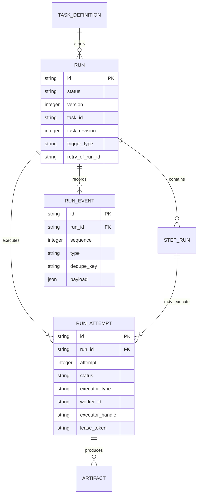

# ADR-0001：Run 状态模型与事务边界

- 状态：Proposed
- 日期：2026-07-18
- 决策者：QingLong Maintainers
- 关联 RFC：[QL-RFC-0001](../QINGLONG_3_0_ARCHITECTURE_RFC.md)
- 目标版本：QingLong 3.0

## 1. 决策摘要

QingLong 3.0 使用 `Run` 作为一次用户可见运行的聚合根，使用 `RunAttempt` 表示每次实际派发和执行尝试，使用 `StepRun` 表示 Workflow/Agent 步骤，并通过只追加的 `RunEvent` 记录状态变化。

Run 当前状态更新、乐观并发版本递增和 RunEvent 追加必须处于同一数据库事务。终态不可修改；人工重试创建新 Run，自动重试在原 Run 下创建新 RunAttempt。

`Crontab.status`、内存队列、PID、系统 crontab 和 Worker 本地状态均不是 3.0 的最终事实源。

## 2. 上下文

2.x 的状态由多个位置共同表达：

- `Crontab.status` 保存任务最近状态。
- `RunningInstance` 保存 PID、日志和实例退出结果。
- Shell 在任务开始和结束时调用 `/open/crons/status`。
- 调度器和手动运行路径分别维护进程与队列状态。
- 服务启动时将所有 Crontab 设为空闲，并将所有 running instance 设为 stopped。

当前实现存在以下边界问题：

1. `RunningInstance` 创建/完成和 `Crontab` 更新不是同一事务。
2. 回调主要依靠 Cron ID、PID 和 log path 定位实例，多实例和重复回调存在歧义。
3. 任务定义同时承载最新运行状态，无法准确表达并发 Run。
4. 服务重启通过批量重置状态恢复，不能区分实际仍在运行、已经失败或失联。
5. 自动重试、人工重试、Workflow Step 和远程 Worker 缺少统一语义。
6. 文本日志可以说明发生了什么，但不能可靠重建状态转换顺序。

3.0 需要在 SQLite edge/standalone 与 PostgreSQL cluster-control 上保持相同领域语义。

## 3. 术语

### 3.1 Run

一次用户、Trigger、API、Workflow 或 Agent 发起的端到端运行。Run 代表用户意图和最终结果。

### 3.2 RunAttempt

Run 的一次实际执行尝试。每次调度到 Executor/Worker 都创建新的 Attempt。Attempt 保存 executor handle、PID、lease、exit code 和日志引用。

### 3.3 StepRun

Workflow 或 Agent 内的一个逻辑步骤。简单 Script/Command Task 可以没有显式 StepRun。

### 3.4 RunEvent

Run 聚合发生的不可变事实。RunEvent 用于审计、实时事件、恢复判断和投影，但 3.0 首版不采用完整 Event Sourcing。

### 3.5 Projection

由 Run/Attempt/Event 派生的兼容或查询状态，例如 `Crontab.status`、Dashboard 计数和日统计。

## 4. 聚合关系



## 5. 标识与时间

### 5.1 标识

- Run、RunAttempt、StepRun、RunEvent 使用 UUIDv7 字符串 ID。
- 采用现有 `uuid` 依赖提供的 v7 实现，避免新增仅用于 ID 的运行时依赖。
- ID 不承载授权、Project 或业务语义。
- API 将 ID 作为不透明字符串处理。

UUIDv7 提供时间排序友好性，但业务排序仍使用显式时间和 sequence，不能依赖 ID 作为唯一顺序来源。

### 5.2 时间

- 数据库存储 UTC 毫秒时间戳。
- API 对外返回 RFC 3339 字符串，并在需要时提供 duration。
- 运行时长使用单调时钟测量后写入结果，不能仅依赖墙上时钟相减。
- 2.x 秒级时间迁移时显式乘以 1000，禁止混合单位。

## 6. Run 状态机

### 6.1 状态

```text
created
queued
dispatching
running
waiting_approval
retry_wait
succeeded
failed
cancelled
timed_out
lost
```

终态：

```text
succeeded
failed
cancelled
timed_out
```

`lost` 是需要协调的非终态。协调器必须根据幂等性、RetryPolicy 和 Executor 检查结果将其转换为 `queued`、`failed` 或 `cancelled`。

### 6.2 合法转换

| 当前状态 | 允许目标状态 |
| --- | --- |
| created | queued、cancelled |
| queued | dispatching、cancelled、timed_out |
| dispatching | running、retry_wait、failed、cancelled、lost |
| running | waiting_approval、retry_wait、succeeded、failed、cancelled、timed_out、lost |
| waiting_approval | running、cancelled、timed_out |
| retry_wait | queued、cancelled、timed_out |
| lost | queued、failed、cancelled |
| succeeded | 无 |
| failed | 无 |
| cancelled | 无 |
| timed_out | 无 |

### 6.3 终态规则

- 终态不可转换为其他状态。
- 用户对失败/取消/超时 Run 执行“重试”时创建新 Run，并设置 `retry_of_run_id`。
- 自动重试不结束顶层 Run；失败 Attempt 后 Run 进入 `retry_wait`，随后创建下一 Attempt。
- 简单任务的 Run 在成功 Attempt 后进入 `succeeded`。
- Workflow Run 由 Workflow Runtime 根据必需 StepRun 的结果决定终态。

## 7. RunAttempt 状态机

### 7.1 状态

```text
claimed
starting
running
succeeded
failed
cancelled
timed_out
lost
```

所有 `succeeded`、`failed`、`cancelled`、`timed_out`、`lost` Attempt 都是不可变终态。Run 可以在 lost Attempt 后创建新的 Attempt。

### 7.2 合法转换

| 当前状态 | 允许目标状态 |
| --- | --- |
| claimed | starting、cancelled、lost |
| starting | running、failed、cancelled、timed_out、lost |
| running | succeeded、failed、cancelled、timed_out、lost |

Attempt 终态不允许被迟到回调覆盖。例如 Attempt 已标记 `cancelled` 后收到 exit code 0，只追加 `attempt.late_callback_ignored` 事件，不将其改为 succeeded。

## 8. 持久化模型

以下字段是 ADR 级概念约束，具体数据库 schema、类型映射和 migration 由实现 PR 确定。领域服务不得依赖 Sequelize Model API；SQLite 与 PostgreSQL 的持久化适配由后续 Repository ADR 决定。

### 8.1 Run

必要字段：

```text
id
project_id
task_id
task_revision
legacy_cron_id nullable
parent_run_id nullable
retry_of_run_id nullable
trigger_id nullable
trigger_type
status
version
priority
idempotency_key nullable
input_ref nullable
output_ref nullable
created_at_ms
queued_at_ms nullable
started_at_ms nullable
finished_at_ms nullable
cancel_requested_at_ms nullable
cancel_reason nullable
error_code nullable
error_summary nullable
```

索引和约束：

- 主键 `id`。
- `(project_id, created_at_ms)` 查询索引。
- `(task_id, created_at_ms)` 查询索引。
- `(status, queued_at_ms)` 调度/恢复索引。
- `(status, cancel_requested_at_ms)` 用于有界恢复尚未完成的取消请求。
- `(project_id, idempotency_key)` 条件唯一索引；无 key 时不限制。
- `version >= 0`。

### 8.2 RunAttempt

必要字段：

```text
id
run_id
step_run_id nullable
attempt
status
executor_type
worker_id nullable
executor_handle nullable
pid nullable
log_artifact_id nullable
lease_token nullable
lease_expires_at_ms nullable
deadline_at_ms nullable
callback_token_hash nullable
callback_sequence
created_at_ms
started_at_ms nullable
finished_at_ms nullable
exit_code nullable
error_code nullable
error_summary nullable
```

索引和约束：

- `(run_id, attempt)` 唯一。
- `(status, created_at_ms)` 用于发现已 claim 但未 start 的陈旧 Attempt。
- `(status, deadline_at_ms, id)` 用于有界扫描跨重启仍未完成的 timeout；null 表示该 Attempt 没有 deadline。
- `attempt >= 1`，`callback_sequence >= 0`。
- `lease_token` 不作为 Secret，但必须不可预测且每次 claim 更新。
- 不使用 PID 作为跨节点唯一标识。

### 8.3 RunEvent

必要字段：

```text
id
run_id
sequence
type
dedupe_key nullable
actor_type
actor_id nullable
attempt_id nullable
step_run_id nullable
payload
created_at_ms
```

索引和约束：

- `(run_id, sequence)` 唯一。
- `(run_id, dedupe_key)` 条件唯一。
- payload 有大小上限，不存完整日志、Prompt、模型结果或 Secret。
- 大内容写入 ArtifactStore，Event 仅保存引用和摘要。

### 8.4 状态字符串

状态以小写字符串持久化，不沿用 2.x 数字枚举。原因：

- 数据库和审计记录可直接阅读。
- 新状态演进不依赖枚举数字顺序。
- SQLite 与 PostgreSQL 保持一致；首版不使用数据库专有 enum。

## 9. 事务边界

### 9.1 核心规则

以下操作必须在同一事务完成：

1. 读取并验证 Run 当前 status/version。
2. 验证状态转换是否合法。
3. 同时递增 Run `version` 和 `event_sequence`。
4. 以 `id + expected version` compare-and-set 更新 Run。
5. 使用新 `event_sequence` 追加 RunEvent。
6. Attempt 转换还需以 `id + expected status + expected callback_sequence` compare-and-set 更新 RunAttempt。

不允许先发布 WebSocket/SSE、再提交数据库。Event Stream 只能发送已提交的 RunEvent。

### 9.2 转换伪代码

```ts
async function transitionRun(command: TransitionRunCommand): Promise<Run> {
  return runRepository.transaction(async (transaction) => {
    const current = await transaction.findRunById(command.runId);

    if (!current) throw new RunNotFound(command.runId);
    const decision = stateMachine.transitionRun(current, command);
    const updated = await transaction.compareAndSetRun(
      decision.run,
      command.expectedVersion,
    );

    if (!updated) throw new RunConflict(command.runId, command.expectedVersion);

    await transaction.appendEvent({
      id: uuidV7(),
      runId: command.runId,
      sequence: decision.event.sequence,
      type: decision.event.type,
      dedupeKey: command.dedupeKey ??
        `run-transition:${command.expectedVersion}:${command.to}`,
      actorType: command.actor.type,
      payload: decision.event.payload,
      createdAtMs: command.atMs,
    });

    return decision.run;
  });
}
```

RunAttempt 转换遵循同一聚合事务：先 CAS Run 的 `version/event_sequence`，再 CAS RunAttempt，最后追加 Event；任一步失败均回滚整个事务。Repository 只提供原子存储语义，Controller、Scheduler、Worker 和兼容层不得自行拼接状态更新。

### 9.3 SQLite

- 使用现有 `IMMEDIATE` transaction 避免开始写入后才升级锁。
- 事务必须短，不在事务中 spawn、调用模型、写日志文件或请求外部服务。
- 发生 `SQLITE_BUSY` 时使用现有有界 retry 策略。
- CAS 更新数量为 0 时返回领域冲突，不盲目重试未知命令。

### 9.4 PostgreSQL

- 使用相同的 version compare-and-set 领域语义。
- 可以使用行锁优化，但不能让 PostgreSQL 实现产生不同状态规则。
- claim/lease 的具体锁策略由 Remote Worker ADR 决定。

### 9.5 外部副作用

spawn、容器创建、MCP Tool 和通知等外部副作用不能与数据库事务原子提交。采用 command/event 协调：

1. 事务提交 `run.dispatching` 和待执行命令标识。
2. Dispatcher 执行外部副作用。
3. 使用 dedupe key 回写 `attempt.starting/running` 或失败事件。
4. Reconciler 查找长期停留在 dispatching 的 Run 并检查/补偿。

首版可以使用数据库表作为可靠命令来源，不强制引入外部消息队列。

## 10. 幂等性与重复回调

### 10.1 创建 Run

- API/Trigger 可以提供 idempotency key。
- 同一 Project 下相同 key 返回已有 Run，不创建重复 Run。
- Trigger 推荐使用 `trigger_id + scheduled_fire_time` 生成稳定 key。

### 10.2 状态命令

- 每个状态命令可以携带 dedupe key。
- Executor 回调使用 `attempt_id + callback_type + executor_event_id`。
- 同一 dedupe key 已提交时返回当前状态，不追加重复 Event。
- 不同命令同时更新同一 version 时只有一个成功，另一个收到 RunConflict 并重新读取。

### 10.3 Shell 回调

迁移完成后，Shell 环境必须获得：

```text
QL_RUN_ID
QL_ATTEMPT_ID
QL_CALLBACK_TOKEN
```

状态 API 根据 Run/Attempt ID 和短期 callback token 鉴权。Cron ID、PID 和 log path 仅用于兼容和诊断，不能作为最终关联键。

Shadow 阶段允许通过 `legacy_cron_id + pid` 辅助关联，但存在歧义时只记录兼容告警，不猜测并更新错误 Run。

## 11. Event 命名

首批事件：

```text
run.created
run.queued
run.dispatching
run.running
run.cancel_requested
run.retry_wait
run.waiting_approval
run.succeeded
run.failed
run.cancelled
run.timed_out
run.lost

attempt.claimed
attempt.starting
attempt.running
attempt.succeeded
attempt.failed
attempt.cancelled
attempt.timed_out
attempt.lost
attempt.late_callback_ignored

run.legacy_projection_mismatch
run.reconciled
```

命名规则：

- 使用 `aggregate.past_tense`。
- Event 表示已发生事实，不使用命令式名称。
- Event schema 有版本；破坏性 payload 变更创建新版本或新事件类型。
- payload 仅包含消费者所需的稳定数据和引用。

## 12. Actor 与错误

### 12.1 Actor

每个转换记录 Actor：

```text
user
api_app
trigger
agent
mcp_client
worker
executor
system
legacy_shell
scheduler
reconciler
compatibility
```

System/Reconciler 行为也必须有 Actor，不能生成来源不明的状态变化。

### 12.2 错误

Run/Attempt 保存稳定 `error_code` 和脱敏 `error_summary`。完整堆栈、stderr 和外部响应写入受保留策略控制的 Artifact。

错误分类至少包含：

```text
validation_error
dispatch_error
executor_start_error
process_exit_error
cancelled_by_user
timeout
worker_lost
policy_denied
approval_rejected
internal_error
```

## 13. 恢复与协调

### 13.1 启动恢复

3.0 不允许在启动时无条件把所有 Run 设为 idle/stopped。

Reconciler 对非终态 Run/Attempt：

1. 根据 executor type 查找 Executor。
2. 使用 executor handle/lease 调用 inspect。
3. 可以确认运行时恢复为 running 并追加 reconciled 事件。
4. 可以确认结束时写入对应终态。
5. 无法确认且 lease 超时时标记 Attempt lost。
6. 根据 RetryPolicy 和幂等性决定 Run queued 或 failed。

### 13.2 LocalProcess 限制

仅凭 PID 不足以证明进程身份，PID 可能被复用。LocalExecutor handle 至少包含 PID、进程启动时间和平台可用的命令/进程组信息。

如果重启后无法可靠证明进程身份，保守标记 Attempt lost，不向未知 PID 发送 signal。

当前 PR-5 孵化实现对 Linux 使用 `/proc/sys/kernel/random/boot_id` 与 `/proc/<pid>/stat` 的 start ticks、process group 共同形成有界 durable handle，并单独核对 Attempt.pid。handle 不保存命令、环境、工作目录或 Secret。任一字段不匹配、token 无效、平台不支持或证据缺失时都不能认领或终止该 PID；非 Linux 平台当前保守进入 lost，而不是降级成 PID-only 恢复。

### 13.3 延迟回调

Attempt 终态后到达的回调不改变状态。系统追加低敏摘要事件并记录指标，供诊断 Shell/Worker 重复或乱序回调。

### 13.4 Durable cancellation

取消命令以 Run 为 CAS 序列化边界，并遵循“持久化先于 signal”：

1. 事务读取 Run 与目标 Attempt；任一已经终态时返回 already-terminal，不追加事件、不调用 Executor.stop。
2. 首次请求递增 Run version/event sequence，写入 `cancel_requested_at_ms`、受限 `cancel_reason`，追加 `run.cancel_requested`；Run/Attempt 此时仍表达已观测到的实际执行状态。
3. 事务提交后才调用 Executor.stop。提交失败时外部副作用必须为零；stop 失败时保留请求供 Reconciler 重试。
4. 重复请求返回 already-requested，不再次递增 version 或追加请求事件，但允许对同一 handle 幂等重试 stop。
5. 取消请求先提交时，后到 Executor success/failure 统一收敛为 cancelled；Attempt 终态先提交时，后到取消不得再发送 signal。

当前 `0004-run-cancellation-request` 以 nullable 增量列和恢复索引实现取消意图，既有 Run 保持 null；`0005-run-cancellation-dispatch` 增加每 Run 唯一、绑定 Attempt 的 dispatch lease/backoff/fencing 状态。孵化实现已有有界 cross-worker source、原子 claim/result Repository、低敏结果事件、指数退避和单周期 supervisor，以及对 Linux durable handle 重新核验 PID、boot ID、start ticks、process group 后才发 TERM/KILL 的 controller。HTTP worker 已通过默认关闭的 manual-only manifest bootstrap 接入 production cadence；只有 accepted 且全部 gate 通过时才在 startup reconciliation 后启动 cancel lifecycle，失败或 shutdown 时有界停止。取消派发协议见 ADR-0005；尚未接入的 completion/log 恢复协议见 ADR-0007。

## 14. Legacy 投影

迁移期：

- Run/Attempt/Event 先以 shadow 模式写入。
- `Crontab.status` 仍供旧 API/UI 使用。
- Projection 更新失败不回滚已经提交的 Run 事实，但必须重试并告警。
- 对账任务比较 Crontab、RunningInstance 与 Run/Attempt。
- 旧 `/open/crons/status` 继续可用，但逐步注入 Run/Attempt ID。

完成切换后：

- Run/Attempt/Event 成为唯一事实源。
- `Crontab.status` 作为可重建兼容投影或被新的查询模型替代。
- `RunningInstance` 停止接收新数据，历史记录保留或迁移为 Attempt。
- Dashboard 和详情页从 Run 查询模型读取。

## 15. API 语义

- 创建 Run 返回 201 和 Run 资源；命中幂等 key 可以返回 200。
- 状态冲突返回 409 和稳定错误码 `RUN_VERSION_CONFLICT` 或 `INVALID_RUN_TRANSITION`。
- 取消是异步命令，接受后返回携带 durable cancel request 的 Run 当前状态，不承诺进程已立即退出。
- Run Event API 按 sequence 分页。
- API 不允许客户端直接写任意 status；客户端提交 start/cancel/retry/approve 等命令。
- 管理员修复状态使用独立审计命令，不能复用普通更新 API。

## 16. 监控指标

至少记录：

```text
run_transition_total{from,to,result}
run_transition_conflict_total{command}
run_event_append_total{type}
run_reconcile_total{executor,result}
run_non_terminal_age_seconds{status}
run_projection_mismatch_total{projection}
attempt_late_callback_total{executor,type}
```

edge 模式限制 label 基数，不将 run_id、task_id 或 error message 放入指标 label。

## 17. 安全与隐私

- Event payload 经过字段 allowlist 和大小限制。
- callback token 与 Run/Attempt 绑定、短期有效并可撤销。
- error summary 在写入前脱敏。
- Tool 参数、Prompt、Secret 和完整日志不进入 RunEvent。
- Actor 必须经过认证；legacy shell 使用专用内部身份。
- 外部 API 只能查看当前 Project 有权限的 Run 和 Event。

## 18. 不采用的方案

### 18.1 继续使用 Crontab.status 作为事实源

不能表达并发 Run、重试 Attempt、Workflow Step 和远程 Worker，拒绝。

### 18.2 只扩展 RunningInstance

RunningInstance 偏向本地进程，缺少用户运行意图、Trigger、重试、Actor 和事件语义，拒绝。

### 18.3 完整 Event Sourcing

会显著增加查询、migration、调试和 edge 资源复杂度。3.0 使用当前状态表 + append-only Event，拒绝首版完整 Event Sourcing。

### 18.4 使用 PID 作为 Attempt ID

PID 仅在单机短时间范围内有效且可能复用，拒绝。

### 18.5 终态 Run 原地重试

会破坏历史结果和审计语义。人工重试创建新 Run，拒绝终态回退。

### 18.6 在事务中执行外部副作用

数据库事务无法与进程、容器和远程 API 原子提交，会造成长锁和不可靠假象，拒绝。

## 19. 影响

### 正面

- 并发任务和多实例具有稳定身份。
- 自动/人工重试语义清晰。
- 可以支持 Workflow、Agent、MCP、Remote Worker 和恢复。
- SQLite 与 PostgreSQL 共享领域规则。
- 状态历史可审计且能驱动实时 UI。

### 代价

- 每次状态变化增加一次 Event 写入。
- 需要 migration、对账和 Legacy Projection。
- Shell、Executor 和 Worker 协议需要传递 Run/Attempt ID。
- 开发者必须使用 RunService，不能直接更新状态列。
- 需要处理外部副作用与数据库提交之间的协调窗口。

## 20. 实施顺序

1. 建立 migration runner 和 2.x 执行契约测试。
2. 新增 Run、RunAttempt、RunEvent Schema 和 Repository。
3. 实现纯领域状态转换测试。
4. 实现事务性 RunService 和冲突测试。
5. 影子记录现有手动任务生命周期。
6. 注入 QL_RUN_ID/QL_ATTEMPT_ID 并兼容旧回调。
7. 上线对账指标和只读 v3 Run API。
8. Feature Flag 切换手动执行路径。
9. 扩展到定时、秒级、Subscription 和其他执行路径。
10. 最终将 Crontab.status 降级为 Projection。

## 21. 验证场景

ADR 接受和实现完成需要覆盖：

1. 同一 Trigger 重复投递只创建一个 Run。
2. 两个并发转换只有一个成功，另一个收到 409/RunConflict。
3. Run 更新失败时不产生孤立 Event。
4. Event 追加失败时 Run 状态不提交。
5. Attempt 成功回调重复两次只产生一次终态。
6. cancel 与 exit code 0 并发时结果符合获胜命令，迟到回调不覆盖终态。
7. 自动重试创建新 Attempt，保持同一 Run。
8. 人工重试创建新 Run，并引用原 Run。
9. 服务重启后通过 inspect 恢复或标记 lost，不批量设 idle。
10. Shadow Run 与 Crontab 状态差异能够被发现和定位。
11. SQLite busy retry 有界且不造成重复 Event。
12. Event payload 不包含已知 Secret 和完整日志。
13. edge 长任务日志不会导致 Event 表或内存随日志量线性增长。
14. PostgreSQL 实现通过与 SQLite 相同的 RunService contract suite。

## 22. 待确认项

以下内容在 ADR 接受前确认，但不改变核心模型：

- UUIDv7 是否在所有承诺 Node 版本和架构上通过 smoke test。
- SQLite 条件唯一索引的 Sequelize migration 表达方式。
- RunEvent payload 的默认和最大字节数。
- callback token 的签发、刷新和撤销实现。
- LocalExecutor handle 的跨平台进程身份字段。
- Shadow Run 对账告警默认级别和保留时间。

## 23. 接受标准

本 ADR 从 Proposed 进入 Accepted 需要：

- Maintainers 接受 Run/Attempt/Step/Event 的职责划分。
- 接受终态不可变和人工重试新建 Run。
- 接受状态更新与 Event 追加的同事务要求。
- 接受 version CAS、sequence 和 dedupe key 规则。
- 接受外部副作用在事务外通过协调恢复。
- 接受 3.0 最终回调必须携带 Run/Attempt ID。
- SQLite edge 基准证明额外 Event 写入处于资源预算内。
