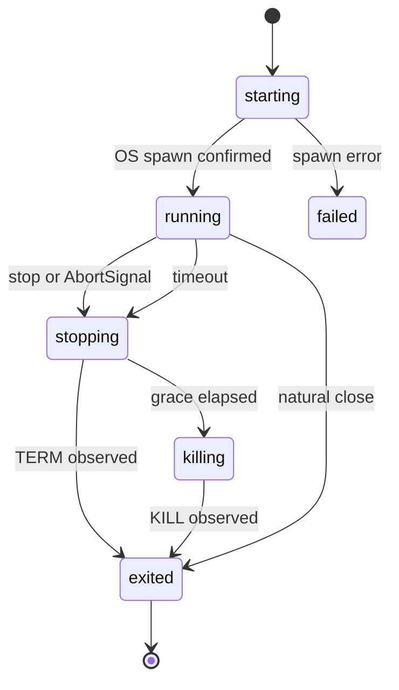

# ADR-0003：Executor 端口与 LocalProcessExecutor

- 状态：Proposed
- 日期：2026-07-18
- RFC：QL-RFC-0001
- 决策范围：任务执行生命周期、进程适配、输出流、取消与能力协商

## 1. 决策摘要

QingLong 3.0 的所有用户任务必须通过 `Executor` 端口启动、观察和停止。首个实现为 `LocalProcessExecutor`，它在当前节点创建独立进程组、流式转发 stdout/stderr、支持协作取消与超时升级，并返回统一的 `ExecutionResult`。

2.x 的 `task.sh`、前后置命令、工作目录、环境加载和语言识别暂不重写，而是作为 `shell` 命令载荷运行在 `LocalProcessExecutor` 内。新领域代码不得直接依赖 `cross-spawn`、`ChildProcess`、PID、`ps-tree` 或 Shell 回调 API。

本 ADR 只建立端口和本机执行适配器，不把现有 Cron/Scheduler 切换到新实现。接管生产流量必须经过 ADR-0002 的 origin 级 Feature Flag、Shadow Run 和回滚门禁。

## 2. 上下文与现状

当前执行逻辑至少分布在以下路径：

1. 系统或 Node Scheduler：`addCron -> runCron -> cross-spawn`。
2. 面板手动运行：`CronService.run -> runSingle -> cross-spawn`。
3. Script、Subscription、System：`ScheduleService.runTask -> cross-spawn`。
4. 停止：多个 Service 直接调用 `killTask`、`killAllTasks` 或通过命令查 PID。
5. 状态：`task.sh -> shell/api.sh -> /open/crons/status -> CronService.status` 反向写回 Crontab 和 RunningInstance。
6. 日志：部分路径由 `task.sh` 写文件，部分路径由 Node 捕获 stdout/stderr 写入 `LogStreamManager` 或 WebSocket。

这会产生以下问题：

- spawn 成功、状态写入和 Shell 回调之间没有统一事实边界。
- PID 是实现细节，却被 API、数据库、停止逻辑和 UI 同时依赖。
- `error`、`exit`、`close`、超时和人工停止缺少统一映射。
- 多条路径分别处理日志，无法统一背压、截断、脱敏和 Artifact 归档。
- 进程重启后内存队列丢失，PID 复用还可能导致错误终止无关进程。
- Docker、Kubernetes 和远程 Worker 无法复用本地进程语义。
- AI、MCP Tool 或插件如果直接 spawn，会形成绕过 Policy 与 Run 审计的执行旁路。

## 3. 目标与非目标

### 3.1 目标

- 为本机进程、容器、Kubernetes Job 和远程 Worker 提供一致生命周期。
- 将安全的任务描述与含 Secret 的运行上下文分离。
- 支持 argv 与兼容 shell 两种命令，不强迫首切片重写 `task.sh`。
- 所有输出以有界、可背压的流交给 Artifact/日志端口。
- 取消、超时和强杀具有确定语义，重复调用保持幂等。
- edge 无需 Docker、systemd、cgroup 或外部服务即可执行本地任务。
- cluster-control 可以只调度，不需要本机用户任务执行能力。

### 3.2 非目标

- 本 ADR 不决定 Run 队列 claim、Worker lease 或 PostgreSQL 锁策略。
- 不在首切片实现 DockerExecutor、KubernetesExecutor 或 RemoteWorkerExecutor。
- 不承诺在所有平台强制 CPU/内存限额；能力不足时必须显式拒绝 required policy。
- 不在首切片替换 `task.sh` 的语言、依赖和环境加载逻辑。
- 不允许通过 Executor 隐式获得 root、Docker socket 或宿主机任意目录权限。

## 4. 核心模型

### 4.1 ExecutionSpec

`ExecutionSpec` 是可审计的执行意图快照，必须能由 Task revision 重建，不保存 Secret 明文。

```ts
type ExecutionCommand =
  | { kind: 'argv'; file: string; args: readonly string[] }
  | { kind: 'shell'; command: string; shell?: string };

interface ExecutionSpec {
  runId: string;
  attemptId: string;
  projectId: string;
  taskId: string;
  taskRevision: string;
  command: ExecutionCommand;
  workingDirectory?: string;
  environmentPolicy: 'inherit' | 'isolated';
  timeoutMs?: number;
  terminationGraceMs: number;
  resourcePolicy?: ExecutionResourcePolicy;
}
```

规则：

- `argv` 是 3.x 新任务默认形态，不经过 Shell 字符串解析。
- `shell` 只用于 2.x 兼容、用户显式 Shell 任务或必须使用管道/重定向的任务。
- Shell 路径属于 Executor 配置或显式 spec；不得把宿主机探测结果写回 Task revision。
- `workingDirectory` 必须由上层按 Project/Package 授权校验；Executor 只执行已授权的绝对路径。
- timeout 和 grace period 必须有上限，禁止无限等待取消。

### 4.2 ExecutionContext

`ExecutionContext` 只在本次 Attempt 内存中存在，承载动态能力和敏感值：

```ts
interface ExecutionContext {
  environment: Readonly<Record<string, string>>;
  signal?: AbortSignal;
  output: ExecutionOutputSink;
}
```

- SecretStore 在 Policy 通过后解析 SecretRef，并只通过 `environment` 或受控文件挂载交给 Executor。
- Context 不进入 RunEvent、普通日志、Trace attribute 或异常序列化。
- Executor 不记录完整 command environment；诊断日志只允许键名和已脱敏摘要。

### 4.3 ExecutionHandle

Handle 分为可持久化描述和进程内私有句柄：

```ts
interface ExecutionHandle {
  id: string;
  executorType: string;
  runId: string;
  attemptId: string;
  startedAtMs: number;
  pid?: number;
  completion: Promise<ExecutionResult>;
}
```

- 上层只持有公共字段和 completion；`ChildProcess` 等对象留在 adapter 内部。
- `pid` 只用于本机诊断和兼容投影，不是跨重启身份。
- 持久化恢复至少需要 executor handle、worker ID、lease/fencing token 或本机进程启动指纹；只凭 PID 不得恢复强杀权限。

### 4.4 ExecutionResult

```ts
type ExecutionOutcome =
  | 'succeeded'
  | 'failed'
  | 'cancelled'
  | 'timed_out'
  | 'lost';

interface ExecutionResult {
  outcome: ExecutionOutcome;
  startedAtMs: number;
  finishedAtMs: number;
  exitCode?: number;
  signal?: string;
  errorCode?: string;
  errorSummary?: string;
}
```

映射规则：

| 条件 | outcome | 说明 |
| --- | --- | --- |
| 正常 close，exit code 0 | succeeded | 必须等待 stdout/stderr sink drain 完成 |
| 正常 close，非 0 | failed | 保留 exit code |
| 用户或 Policy 请求停止 | cancelled | 即使 task.sh 将 SIGTERM 映射为 exit 1 |
| timeout 触发停止 | timed_out | 即使最终由 SIGKILL 结束 |
| spawn 失败 | start 抛 `ExecutorStartError` | RunAttempt 尚未进入 running |
| Executor/Worker 失联且无法确认进程事实 | lost | 不猜测 succeeded/failed |

## 5. Executor 端口

```ts
interface Executor {
  readonly type: string;
  capabilities(): ExecutorCapabilities;
  start(spec: ExecutionSpec, context: ExecutionContext): Promise<ExecutionHandle>;
  stop(handle: ExecutionHandle, reason: StopReason): Promise<StopResult>;
  inspect(handle: ExecutionHandle): Promise<ExecutionInspection>;
}
```

### 5.1 start

- 只有操作系统确认 `spawn` 成功后才返回 Handle。
- 返回前必须注册 stdout、stderr、error、close、timeout 和 AbortSignal 监听器，避免短进程事件丢失。
- `start` 不等待任务完成；完成事实只能由 `handle.completion` 获得。
- 同一 Attempt 不允许并发调用两次 start。幂等由 RunService/dispatch command dedupe 保证，而不是由本机 PID 猜测。

### 5.2 stop

- stop 对已结束或正在停止的 Handle 幂等。
- 首先发送 TERM；超过 `terminationGraceMs` 后发送 KILL。
- POSIX 本机任务默认创建独立进程组并终止整个组，避免只杀 Shell 父进程。
- 无进程组能力的平台必须声明 capability，并使用经过测试的进程树 fallback。
- stop 返回信号是否已发送/升级，不直接伪造 Run 终态；终态来自 completion 或 Reconciler。

### 5.3 inspect

- 首版 LocalProcessExecutor 只保证检查本进程持有的 Handle。
- 控制进程重启后，旧 Handle 进入 `unknown`，由 Reconciler 根据持久化指纹决定 `lost` 或重新附着。
- 不允许通过 `ps | grep command` 把任意相似命令重新认领为当前 Attempt。

## 6. 输出、日志与背压

`ExecutionOutputSink.write` 接收 `{stream, chunk, observedAtMs}`。LocalProcessExecutor 使用异步迭代读取 stdout/stderr，并在读取下一块前等待 sink，利用 Node stream pause/resume 形成背压。

必须满足：

- 不在内存中累计完整 stdout/stderr。
- sink 写入按单 stream 保序；stdout 与 stderr 不承诺全局顺序。
- completion 在两个 stream drain 后才完成。
- sink 失败记为稳定错误码；默认不立即杀死用户进程，但结果必须暴露日志不完整诊断并触发告警。
- 脱敏、行截断、总量配额和 Artifact 分片由输出层执行，Executor 只保证流式和背压。
- 禁止把 stdout/stderr chunk 写入 RunEvent；RunEvent 只记录 Artifact 引用和摘要。

## 7. 超时与取消

取消来源统一映射为：

- `user`
- `policy`
- `shutdown`
- `reconcile`
- `timeout`

状态顺序：



- Executor 自己维护 timeout timer，Run Reconciler 仍需处理控制进程崩溃后的超时恢复。
- `AbortSignal` 只触发一次取消，不允许监听器泄漏。
- 时间采用注入 Clock，持久化为 epoch milliseconds；测试使用虚拟时钟或短有界窗口。

## 8. LocalProcessExecutor 决策

### 8.1 进程创建

- 使用项目现有 `cross-spawn`，避免新增依赖。
- argv 命令直接传 `file + args`；shell 命令使用显式 Shell。
- POSIX 默认 `detached: true` 创建独立进程组，但不 `unref`，确保父进程观察 close。
- 当前孵化实现的 stdio 固定为 pipe/pipe/pipe，不支持继承宿主 TTY；进入跨重启 Primary 前按 ADR-0007 改为 runtime-owned direct-file Artifact，不能把父进程 pipe 作为唯一日志持有者。
- `environmentPolicy=inherit` 用于 Legacy；`isolated` 只注入最小系统变量和 context environment。

### 8.2 资源策略

Capabilities 必须分别声明：

- timeout
- process-group termination
- working directory
- isolated environment
- CPU limit
- memory limit
- filesystem isolation
- network isolation

LocalProcessExecutor 在普通 edge 环境只承诺前四项。若 spec 要求当前节点不支持的 required limit，start 在 spawn 前以 `EXECUTOR_CAPABILITY_UNAVAILABLE` 失败；不得静默降级为无限制执行。

### 8.3 安全边界

- `shell` 命令不是安全沙箱，不能承载未信任的 AI 生成文本。
- Agent/MCP/插件产生的命令必须先经过 Tool Registry、Policy 和 Approval，并优先转换为 argv 或受控 Package Script。
- LocalProcessExecutor 不授予额外权限；它继承 ql-core 用户拥有的宿主权限。
- 高风险或不可信任务必须选择提供 filesystem/network/resource isolation 的 Executor。

## 9. 与 Run 状态机的事务边界

数据库事务不能包含 spawn 或信号发送。Dispatch 采用可恢复协调：

1. 短事务将 Run 从 queued 转为 dispatching，创建 claimed Attempt 和 dispatch command/dedupe key。
2. 事务提交后调用 `Executor.start`。
3. spawn 成功后，短事务记录 executor handle/PID，并将 Attempt starting -> running、Run dispatching -> running。
4. spawn 失败时，短事务将 Attempt 和 Run 转为 failed/retry_wait。
5. completion 产生完成命令，再由 RunCommandService 原子更新 Run/Attempt/Event。

崩溃窗口由 Reconciler 处理：

- dispatching 且无 handle：按 dedupe/retry policy 重新 dispatch 或失败。
- 有 handle 但未 running：inspect 后补写 running 或标记 lost。
- running 但控制进程丢失：只凭 PID 不重连，需启动指纹或 Worker fencing。

## 10. Legacy 兼容策略

首阶段 `LegacyLocalExecutor`/兼容构造器负责把当前 Crontab 转为：

```text
shell command:
  real_time=<...> no_tee=<...> ID=<cronId>
  task_before='<...>' task_after='<...>' work_dir='<...>'
  task <legacy command>
```

必须保留：

- `.js/.mjs/.py/.pyc/.sh/.ts` 识别。
- `now/conc/desi` 参数。
- `task_before`、`task_after`、`work_dir`、`log_name`。
- `NODE_OPTIONS`、`PYTHONPATH` 和依赖路径。
- 当前日志目录兼容。

但以下行为逐步退出：

- Shell 回调直接决定 Run 终态。
- API 根据命令字符串 `ps | grep` 查 PID。
- 多个 Service 各自维护 spawn 和 kill 逻辑。
- Crontab 的单个 `pid/status/log_path` 代表全部并发实例。

Shadow 阶段 Shell 回调仍更新 2.x 表，Executor completion 只写 Shadow Run；Primary 阶段 Run 成为事实源，Shell 回调降级为带 callback token/sequence 的兼容事件。

## 11. Deployment Profile

| Profile | LocalProcessExecutor | 其他 Executor | 说明 |
| --- | --- | --- | --- |
| edge | 默认启用 | 默认禁用 | 无额外守护进程；低内存、单机进程 |
| standalone | 默认启用 | Docker 可选 | 本机仍可独立完成全部核心任务 |
| cluster-control | 默认禁用 | Remote/Kubernetes | 控制面不应隐式执行用户代码 |
| worker | 按 capability 启用 | Docker/Kubernetes 可选 | 向控制面上报能力和资源预算 |

Executor Registry 按任务要求、节点 capability、Policy 和资源预算选择实现；不得仅按字符串名称信任 Worker 自报能力。

## 12. 被否决方案

### 12.1 继续由每个 Service 直接 spawn

无法统一恢复、审计、取消和集群执行，拒绝。

### 12.2 直接删除 task.sh 并在 Node 重写全部行为

一次性破坏脚本参数、环境、日志和社区兼容，首阶段拒绝。长期可把稳定能力逐步下沉为 argv adapter。

### 12.3 只用 PID 作为 Handle

PID 可复用、无法跨 Worker、不能表达容器/Job，拒绝。

### 12.4 所有命令都使用 shell string

难以正确引用并放大注入风险。只允许兼容路径和显式 Shell Task。

### 12.5 LocalProcessExecutor 静默忽略资源限制

会让同一策略在 edge 与 cluster 上产生不同安全结果。required capability 不满足时必须失败。

## 13. 实施切片

### PR-3A：纯端口与本机 adapter

- 定义 ExecutionSpec、Context、Handle、Result、Capabilities 和错误类型。
- 实现 LocalProcessExecutor，不连接现有 Service。
- 使用真实短进程完成 argv、shell、stdout/stderr、非零退出测试。
- 使用可注入 terminator 验证 cancel/timeout/幂等与升级语义。

### PR-3B：Legacy spec builder

- 只把 Crontab snapshot 转换为兼容 ExecutionSpec。
- 建立特殊字符、前后置、工作目录、日志名、参数模式 snapshot test。
- 不执行用户任务，不改变 makeCommand。

### PR-3C：Shadow Executor

- 按 execution origin 开启 flag。
- 现有进程仍为 owner，新 Executor 只观察时不得重复 spawn。
- 真正 shadow Run 记录来自现有 spawn observer，而不是第二次执行任务。

## 14. 验收门禁

进入 PR-4 Shadow Run 前必须证明：

1. argv 与 shell 模式均保留参数边界。
2. start 只在 spawn 确认后返回，spawn error 不产生 running。
3. stdout/stderr 大输出测试无完整缓冲和无事件丢失。
4. exit 0、非 0、signal、cancel、timeout 映射稳定。
5. stop 重复调用幂等，TERM 超时后有界升级 KILL。
6. completion 等待输出 sink drain，监听器和 timer 被清理。
7. required capability 缺失时在 spawn 前拒绝。
8. 环境和错误中不泄漏 Secret 值。
9. Linux amd64、arm/v7、arm64 至少完成本机进程 smoke test；其余支持架构在镜像门禁验证。
10. edge 基准记录 idle overhead、单任务 RSS、10000 行输出和取消时延。
11. GitNexus 显示新 adapter 未被 2.x Controller/Scheduler 调用。
12. 关闭全部 3.0 flag 时，现有行为和资源占用不变。

## 15. 后续 ADR

- ADR-0012：Remote Worker lease、fencing 与 reconnect。
- Docker/Kubernetes Executor 可在实现前分别新增 ADR。
- Artifact/Log Sink 的分片、保留和对象存储策略另行决定。

## 16. PR-5 Primary 编排器孵化约束

PR-5 首先新增不可从 2.x Controller、Scheduler 或 Shell callback 到达的 `PrimaryRunOrchestrator`，用于验证 Run 事务与 Executor 外部副作用之间的编排边界。它不是 Feature Flag，也不表示 LocalProcessExecutor 已接管生产流量。

### 16.1 spawn 前事实

调用 `Executor.start()` 之前必须已经持久化：

1. runtime-owned Run 与 claimed Attempt；
2. `run.created` 与 `run.queued`；
3. `run.dispatching` 与 `attempt.starting`。

任一写入失败都必须在 spawn 前失败关闭。这里不要求把多个状态转换压缩为一个事务；分事务保留可审计状态，启动 Reconciler 负责识别进程尚未产生的 dispatching/starting 残留。

### 16.2 spawn 后 ownership

Executor 返回后，编排器必须验证 handle 的 Run ID、Attempt ID 和 Executor type 与持久化聚合一致，再写入 `attempt.running` 的 handle/PID 和 `run.running`。若身份校验失败，或任一 running ownership 写入失败：

- 以 `reconcile` 原因请求 owning Executor stop；
- 将仍可更新的 Attempt 和 Run 写为 `lost`；
- 向调用者返回包含 Run 引用但不包含命令、环境或路径的类型化错误；
- 即使 stop 或 lost 写入再次失败，也不得自动启动 Legacy 副本。

### 16.3 completion 与取消

- success、failed、cancelled、timed_out 和 lost 由 Executor completion 映射到 Attempt，再映射到 Run；两次转换继续使用 Run version 作为串行化边界。
- Executor completion Promise 异常拒绝视为 ownership 丢失，安全收敛为 lost，而不是让 Run 永久停留在 running。
- cancel 通过当前 owning Executor handle 执行；只有 Executor 报告最终 completion 后才写 Run 终态。
- 当前 active handle registry 只保存实际运行中的本进程任务，completion 后立即删除；跨 Worker cancel 与重启恢复仍由后续 Reconciler/lease 设计负责。

LocalProcessExecutor 的 live handle ID 继续服务当前进程内 stop/inspect；另提供可选 durable handle 用于重启核验。Linux durable handle 编码版本、boot ID、PID、start ticks 和 process group，不包含命令、环境、路径或日志。捕获失败不得阻塞当前任务启动，但这样的 Attempt 重启后只能保守 lost。

### 16.4 Primary fallback 边界

Legacy fallback 只允许发生在能够证明 Primary 尚未 spawn 的阶段。Executor 已被调用、返回 handle、handle 身份不一致、running ownership 写入失败或结果未知时，都必须 stop/reconcile，不得再执行 Legacy 命令。该约束防止一次用户请求产生两个真实进程。

幂等请求使用独立的 Primary lookup port，不扩展 Shadow/Legacy 共用的 Repository reader。编排器先查询 `project_id + idempotency_key`，但预检只用于快速返回；数据库唯一索引才是竞态下的最终裁决。唯一约束冲突后必须重新读取已有 Run ID 并返回 duplicate result，第二个请求的 Executor start 次数必须为零。配置了 idempotency key 却没有 lookup adapter 时在创建 Run 前失败关闭。

### 16.5 尚未通过的生产门禁

- 部署配置写入/审批入口、用户可见状态和操作回滚演练；
- 2.x 实时日志、停止 API 和异常重启契约的完整兼容验证；
- ADR-0007 的 direct-file log、completion receipt、durable deadline 与周期 completion supervisor；
- 多实例策略、跨 Worker cancel、回滚演练；
- 固定 edge 设备与 Linux 多架构的资源/进程 contract gate。

当前仅允许由默认关闭的 manual-only manifest canary 到达；在上述门禁完成前不得扩大到其他 origin 或默认流量。

### 16.6 有界启动 Reconciler 内核

当前孵化实现提供一次性 `reconcileBatch`，调用方负责启动接线和翻页：

- 默认每批 32、最大 64 个 runtime-owned dispatching/running Run；
- 使用 `created_at_ms + run_id` 稳定游标，两次有界查询，不做全表常驻 watcher；
- 每个候选串行核验和写入，避免 SQLite 并发写争用；
- active Attempt 行数超过每批两倍视为不安全数据，整批失败关闭，不移动游标；
- 同一 Run 有多个 active Attempt 时只报告 ambiguous，不选择任意一个；
- 单个 OS probe 或事务失败只计入该候选，不中止后续候选。

协调规则如下：

1. running Attempt 的 durable identity 仍匹配时，running Run 追加 `run.reconciled`；若 Run 停在 dispatching，则以 reconciler actor 转为 running。
2. Attempt 停在 claimed/starting、缺少 handle、handle 无效、PID 不一致、boot/start ticks/process group 不一致、平台不支持或进程已消失时，Attempt 与 Run 收敛为 lost。
3. probe 的暂时性 I/O 异常不立即改状态，留待下一批重试。
4. Reconciler 只有 inspect 能力，不包含 signal/kill API，因此恢复扫描不可能误杀 PID 复用后的其他进程。

这仍不是完整的“进程重启后继续管理”：父进程退出后，新的 QingLong 进程不能重新连接原 stdout/stderr pipe，也不能从已退出进程取得可靠 exit code。durable identity 只能证明进程是否仍存在；ADR-0007 已决定采用 direct-file log、CompletionReceipt 和有界周期 Supervisor，但尚未实现。不得把一次 `run.reconciled` 误解为 completion 已可恢复。
